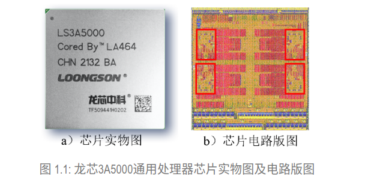

# C1 CPU芯片研发过程概述

## 目录

-   [1 处理器与处理器核](#1-处理器与处理器核)
-   [2 芯片产品的研制过程](#2-芯片产品的研制过程)
-   [3 芯片设计的工作阶段](#3-芯片设计的工作阶段)

这一章主要介绍工业界研发CPU芯片的大致过程

# 1 处理器与处理器核

需要区分处理器/处理器芯片CPU和处理器核CPU Core这两个概念

在上世纪七八十年代，晶体管的集成密度还没有现在这么高，一个处理器芯片的主体就是一个处理器核。随着集成电路工艺的快速演进，单个硅片上晶体管的集成密度越来越高。现在常见的处理器芯片不再是传统意义上的“运算器 + 控制器”，而已经是一个片上系统（System on Chip，简称SoC），处理器核只是这个片上系统的一个核心IP

例如下图的LA3A5000，处理器芯片中集成了4个处理器核，此外还有多核共享的Cache、高速总线接口控制器和内存控制器等功能模块

# 2 芯片产品的研制过程

处理器芯片的研制过程通常需要经过下面五个阶段：芯片定义→芯片设计→芯片制造→芯片封测→芯片验证

1.  **芯片定义**：在芯片定义阶段，需要进行市场调研，针对客户的需求制定芯片的规格定义并进行可行性分析和论证
2.  芯片设计：芯片设计阶段的工作可以进一步划分为硅片设计和封装设计
3.  芯片制造：芯片设计完成后将交付给工厂，进入芯片制造阶段。芯片制造又包含掩模制造、晶圆生产和封装生产几个方面
4.  芯片封测：通常需要先对晶圆进行中测（有些低成本芯片没有这个环节），然后进行划片、封装，最后对封装后的芯片进行成测
5.  芯片验证：需要将芯片焊接到预先设计和生产好的电路板上，装配成机器并加载软件后，才能开始验证[^注释1]。且需要对芯片的各个技术指标进行测评，当发生异常时，需要找到出错原因。如果是设计的错误，那么需要修正设计错误，然后再进行制造、封测和验证

目前在产业界，将芯片设计和芯片制造分离已经成为了主流趋势——**芯片设计企业**[^注释2]**关注芯片的定义和设计，而制造和封测多采用委托外协的方式交由芯片制造企业**[^注释3]

# 3 芯片设计的工作阶段

对于一个CPU来说，其硅片设计的工作可划分为下面的九个阶段：

明确设计规格→制定设计方案→进行设计描述（编写RTL代码）→功能和性能验证→逻辑综合→版图规划→布局布线→网表逻辑验证、时序检查、版图验证→交付流片

1.  明确设计规格
    > 无论是硬件产品还是软件产品，设计之初必然要明确其设计规格，确定设计的边界约束情况
    > 对于CPU设计开发来说，典型的设计规格包括**ISA、主频、性能、面积和功耗指标以及接口信号定义**
2.  制定设计方案

    设计方案通常是用自然语言或高级建模语言从较为抽象的角度对CPU的微结构设计所做的**行为级描述**如HCL。例如，CPU划分为多少级流水、每一级流水线最多处理多少条指令、有多少个运算部件、指令的执行调度机制是什么等等，这些内容都要在设计方案中详细地给出
3.  进行设计描述，RTL编写

    将行为级描述进一步转换为EDA综合工具可以处理的硬件描述语言HDL——目前主要是依赖人工
4.  功能和性能验证

    寄存器传输级Register Transform level描述使得可以在这一层次开展功能和性能的验证

    功能和性能验证，是指证明设计描述的功能正确性和性能指标是否符合设计规格中的定义，它发现并修正的是设计描述阶段引入的逻辑实现错误。如果发现功能或性能上的错误，就需要返回设计描述阶段进行修改，甚至要返回设计方案阶段对不合理的地方进行修改，然后再进行功能和性能验证
    > 用“验证”而不用“测试”的原因
    >
    > 这个验证和软件开发中的测试非常相似，之所以不用“测试”来描述的原因是芯片设计制造领域的测试是指检测电路的功能和性能是否符合设计指标，发现并修正芯片在生产制造环节中引入的电路故障
5.  逻辑综合

    RTL描述将通过EDA综合工具转化成门级网表——**RTL→GTL**

    门级网表是使用逻辑门来实现RTL所描述的功能
6.  版图规划

    对最终实现的电路版图进行设计规划，即对电路的接口引脚、各主要数据通路的相对位置关系进行平面布局规划
7.  布局布线

    版图规划完成之后，自动化布局、布线工具将读入之前综合所得的网表并生成电路的版图
8.  网表逻辑验证、时序检查、版图验证

    要对版图自身进行设计规则检查和电路/版图一致性检查、针对最终设计进行静态时序分析和功耗分析以确保达到频率和功耗的规格定义目标、并将提取到的延迟信息反标至网表中进行时序检查的功能仿真验证
9.  交付流片

[^注释1]: 验证的前提

[^注释2]: Apple、Arm、AMD、Intel、Qualcomm

[^注释3]: 台积电、中芯国际
