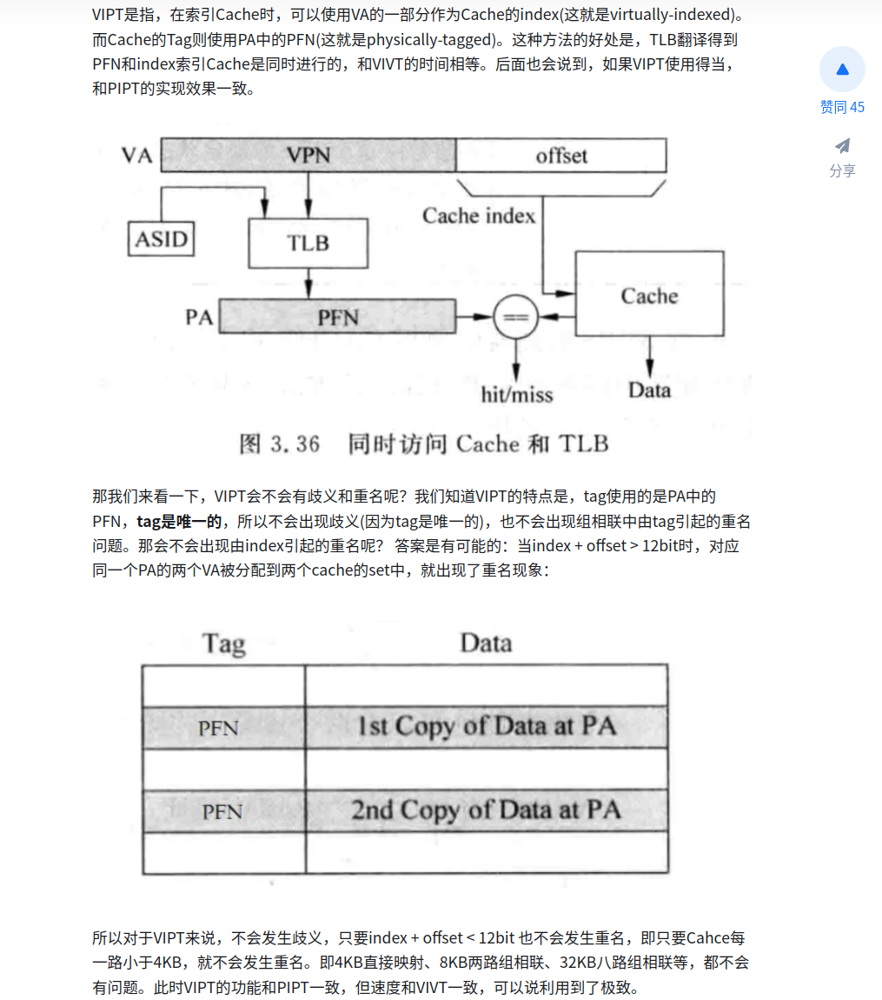
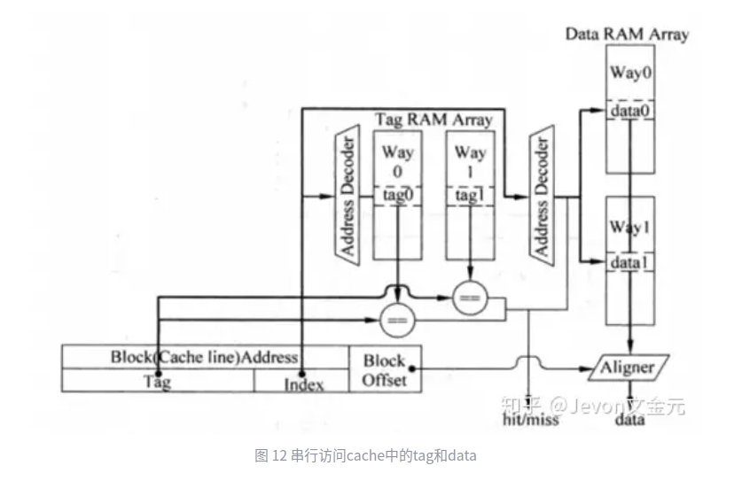
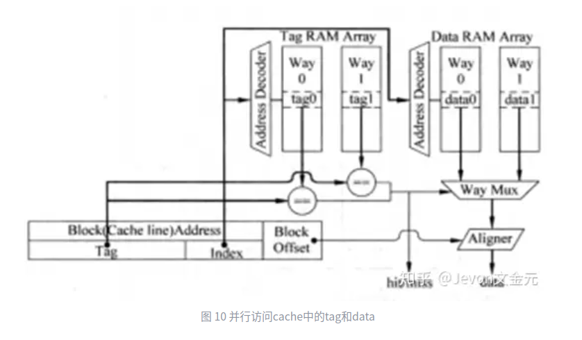
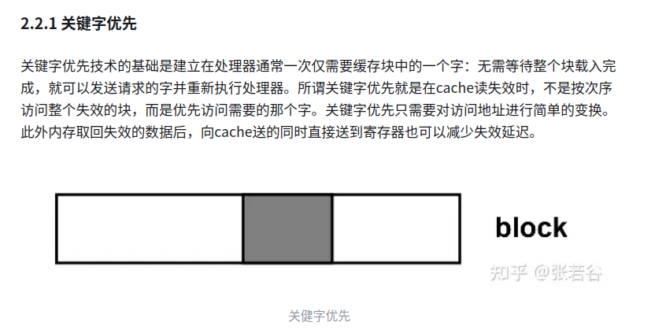
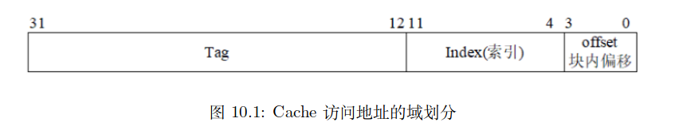
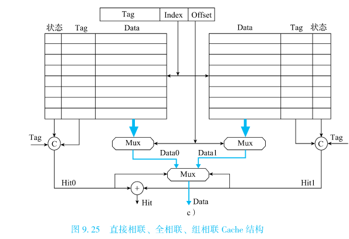
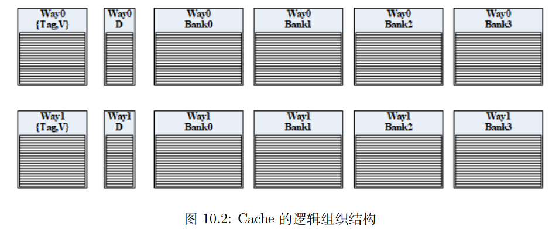
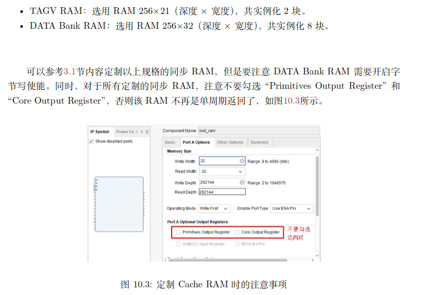
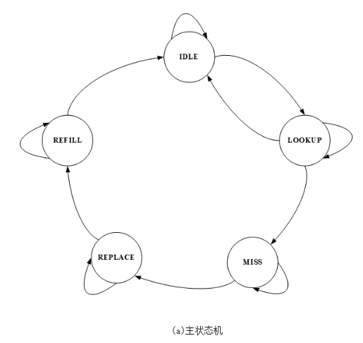
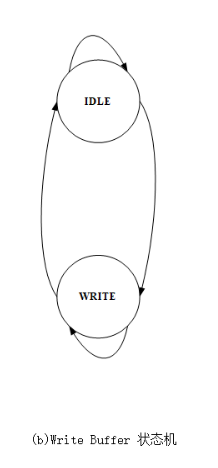

# C10 高速缓存设计

## 目录

- [1 Cache模块的设计](#1-Cache模块的设计)
  - [1.1 Cache的设计规格](#11-Cache的设计规格)
  - [1.2 Cache模块的数据通路设计](#12-Cache模块的数据通路设计)
    - [1.2.1 读写操作访问Cache的执行过程](#121-读写操作访问Cache的执行过程)
    - [1.2.2 Cache表的组织管理](#122-Cache表的组织管理)
    - [1.2.3 Cache模块功能边界的划分](#123-Cache模块功能边界的划分)
    - [1.2.4 Cache模块内除Cache表之外的数据通路](#124-Cache模块内除Cache表之外的数据通路)
  - [1.3 Cache模块内部的控制逻辑设计](#13-Cache模块内部的控制逻辑设计)
    - [1.3.1 Cache模块自身的状态机设计](#131-Cache模块自身的状态机设计)
    - [1.3.2 Cache表的片选和写使能](#132-Cache表的片选和写使能)
    - [1.3.3 Request/Miss Buffer各个域的写使能](#133-RequestMiss-Buffer各个域的写使能)
    - [1.3.4 模块接口输出的控制信息](#134-模块接口输出的控制信息)
  - [1.4 Cache的硬件初始化](#14-Cache的硬件初始化)
  - [1.5 设计综述](#15-设计综述)
- [2 将 Cache 集成至 CPU 中](#2-将-Cache-集成至-CPU-中)
  - [2.1 Cache与总线接口方面的交互适配问题](#21-Cache与总线接口方面的交互适配问题)
  - [2.2 Cache与CPU流水线的交互适配问题](#22-Cache与CPU流水线的交互适配问题)
    - [2.2.1 CPU HIT情况下](#221-CPU-HIT情况下)
    - [2.2.2 CPU MISS情况下](#222-CPU-MISS情况下)
  - [2.3 非缓存访问的处理](#23-非缓存访问的处理)
    - [2.3.1 存储访问类型的判定](#231-存储访问类型的判定)
    - [2.3.2 在 Cache 模块中处理SUC](#232-在-Cache-模块中处理SUC)
- [3 Cache维护指令 CACOP](#3-Cache维护指令-CACOP)
  - [3.1 CACOP——用于Cache的初始化和一致性维护](#31-CACOP用于Cache的初始化和一致性维护)
  - [3.2 设计建议](#32-设计建议)
  - [3.3 设计实现](#33-设计实现)
    - [3.3.1 对ICache的修改](#331-对ICache的修改)
    - [3.3.2 对DCache的修改](#332-对DCache的修改)
    - [3.3.3 CPU实现cacop指令](#333-CPU实现cacop指令)
- [4 仿真遇到的问题](#4-仿真遇到的问题)

> 在给CPU添加总线机制并去除指令RAM和数据RAM后，它的运行效率相比之前差了很多
>
> 但是这并不意味着设计的倒退——指令RAM和数据RAM的使用要求软件人员必须明确掌握物理内存的容量、起始地址，增加了开发的难度。这种直接使用指令RAM和数据RAM的硬件架构仅在对于规模不大，程序行为相对确定的成本、功耗或执行延迟的确定性极为敏感的低端嵌入式领域中使用
>
> 因此为了增加这种进步的机制的允许效率，解决思路是增加高速缓存Cache

围绕Cache的优化技术很多，导致Cache设计的复杂度变化很大。为了方便设计，将Cache的设计复杂度控制在入门水平，并分为四个阶段来实现：

1. 设计 Cache 模块
2. 将 Cache 模块作为 ICache（指令 Cache）集成到 CPU 中，完成与 CPU 取指的配 合、调整，并完成总线接口模块的设计调整
3. 将 Cache 模块作为 DCache（指令 Cache）集成到 CPU 中，完成与 CPU 访存的 配合、调整，并完成总线接口模块的设计调整
4. 实现对 Cache 指令的支持

## 1 Cache模块的设计

### 1.1 Cache的设计规格

本章所设计的Cache规格明确如下：

1. CPU 内部集成一个指令 Cache 和一个数据 Cache

   指令和数据分离，消除结构相关，实现流水线同时支持取指和访存
2. 指令 Cache 和数据 Cache 的容量均为 8KB，均为两路组相联，Cache 行/块大小均为 16B

   设置指令Cache和数据Cache规格相同，使得不用把Cache模块设置成可参数化配置的，直接可以模块例化两个来分别作为指令Cache和数据Cahce

   采用多路组相联架构，选择其中复杂度最低且有代表性的两路组相联

   将每一路定义为4KB（两路容量即为8KB）是为了在采用VIPT访问方式时避免Cache别名问题
   > VIPT
   >
   > <https://zhuanlan.zhihu.com/p/577138649>
   >
   > [ 图解 | CPU-Cache | 2-腾讯云开发者社区-腾讯云 在《图解 | CPU-Cache》一文中介绍了VIVT、PIPT、VIPT三种查找方式。下面分析一下其歧义别名问题。 https://cloud.tencent.com/developer/article/1843909](https://cloud.tencent.com/developer/article/1843909 " 图解 | CPU-Cache | 2-腾讯云开发者社区-腾讯云 在《图解 | CPU-Cache》一文中介绍了VIVT、PIPT、VIPT三种查找方式。下面分析一下其歧义别名问题。 https://cloud.tencent.com/developer/article/1843909")
   >
   > 
   >
   > 1. VIPT是指“Cache的Tag是实地址中的PFN，而Cache的index是VA的一部分”。这样操作Cache的索引和TLB的翻译是可以同时进行的
   > 2. 因为VIPT机制中，Cache的Tag来自于PFN，是唯一的，所以Tag不会引起歧义
   >    如果index+offset\<pagesize，那么index即在pagesize内部，pagesize内部的是直接产生PA→PIPT
   >    如果index+offset=pagesize，同上
   >    如果index+offset>pagesize，那么index就会使用一部分的Tag，从而会存在好几个index高位不同的对应一个TAG，出现歧义
   >    > 📌因此基于VIPT的别名问题总结起来就是：如果cache的size除以WAY数，小于等于1个page的大小，则VI=PI，无别名问题；如果cache的size除以WAY数，大于1个page的大小，则VI≠PI，有别名问题
   >    > 一般页内大小是4KB，两路则定义Cache大小是8KB
   >    > Cache行/块大小定义为16B，而不是商用常见的64B，是为了把 Cache Data 部分的分体数目控制在一个适中的 规模
3. 指令 Cache 和数据 Cache 采用 Tag 和 Data 同步访问的形式

   Cache 采用 Tag 和 Data 同步访问的形式是为了降低 Cache 命中情况下的执行周期数，否则在 Tag 和 Data 串行访问方式下，读一个数最快也需要 3 个周期。然而，现有 CPU 中访问指令 RAM 和数据 RAM 都只需要两个周期，3 个周期的访问延迟需要对 CPU 流水线进行较大幅度的设计调整
   > 📌TAG和Data串行访问的方式
   >
   > 
   >
   > 先根据Index去访问TAG SRAM，用tag判断选择哪一组的哪一路
   >
   > 然后再根据选的路数，和index去访问Data SRAM得到对应的数据
   >
   > 最快也需要3个clk：第一个clk发TAG RAM请求，第二个clk判断命中，如果命中那么根据得到的路信息以及index去发Data RAM请求，第三个clk得到数据
   > TAG和Data并行访问的方式
   >
   > 
   >
   > 根据index同时访问TAG RAM和Data RAM，然后再比较得到的tag判断命中，并根据比较结果输出到data多路选择器进行路数据的选择
   >
   > 需要两个clk即可：第一个clk发出tag ram和data ram的访问请求，第二个clk根据所得到的信息判断命中以及数据的选择
4. 指令 Cache 和数据 Cache 均采用 “虚 Index 实 Tag”（简称 VIPT）的访问形式

   实现TLB和Cache的同时进行
5. 指令 Cache 和数据 Cache 均采用伪随机替换算法

   Cache 采用伪随机替换算法是因为这是最简单实用的 Cache 替换算法

   LRU 算法虽然平均性能更佳，但涉及 LRU 信息的维护问题，会增加设计的复杂度
6. 数据 Cache 采用写回写分配的策略
   > 写回写分配
   >
   > 写回法：当写命中时，先写Cache；当Cache内的该块要被替换出时，再写存储
   >
   > 写分配：当写不命中时，需要先将该块数据由存储调入Cache，再写Cache
   > 使用写回写分配策略，使得写操作在发生 Cache Miss 时的处理流程和读操作发生 Cache Miss 时的处理流程几乎是一样的，从而简化控制逻辑的设计
7. 指令 Cache 和数据 Cache 均采用阻塞式（Blocking）设计，即一旦发生 Cache Miss（未命中），则阻塞后续访问直至数据填回 Cache
8. &#x20;Cache 不采用 “关键字优先” 技术，降低AXI总线的结合难度

   

   请求字处理技术

> 📌因此可以得到Cache的缓存容量是8KB，Cache块大小是16B，一共有$2^9$块，分两路，每路$2^8$个块
>
> 因此块内偏移offset为4位、组索引index为8位，其余为TAG 20位
>
> 
>
> 因此在VIPT下，使用虚地址的\[11:4]作为index、实地址的\[31:12]作为TAG访问Cache

### 1.2 Cache模块的数据通路设计

#### 1.2.1 读写操作访问Cache的执行过程

1. 读操作

   读操作在第一拍时，将请求中的虚地址的\[11:4]位作为Cache的index去访问Cache，将两路Cache中对应该index的两个Cache行都读出来；同时将读操作的这个虚地址送MMU进行地址转换，得到物理地址——这个物理地址需要寄存下来供第二拍使用

   读操作在第二拍时，将寄存下来的物理地址的\[31:12]位与读出的两个Cache行的Tag进行比较，如果有相等且该Cache的有效位为1那么说明命中，选择这个Cache行的对应的块内偏移地址访问[^注释1]；如果没有命中，那么则根据寄存下来的物理地址发起访存请求并等待结果返回Cache[^注释2]并读出——命中读出数据需要两拍，不命中需要三拍（offset为0）、四拍（offset为1）、五拍（offset为2）、六拍（offset为3）
2. 写操作

   写操作开始时可以不读取Cache的Data信息，只需要读Tag、V来判断是否命中

   写操作第一拍时，将请求中的虚地址的\[11:4]位作为Cache的index去访问Cache，将两路Cache中对应该index的两个Cache行的Tag、V都读出来；同时将读操作的这个虚地址送MMU进行地址转换，得到物理地址——这个物理地址需要寄存下来供第二拍使用

   写操作在第二拍时，将寄存下来的物理地址的\[31:12]位与读出的两个Cache行的Tag进行比较，如果有相等且该Cache的有效位为1那么说明命中，那么将要写的数据写到Write Buffer中[^注释3]，然后在第三拍由Write Buffer向Cache发出写请求，写Cache对应index的对应路的块的对应偏移字，并将这一Cache块的脏位D置1；如果未命中，则需要通过总线向外发起访存请求，然 后等访存结果返回 Cache 模块，最后将 store 要写的数据和内存重填的数据拼合在一起，一并写入 Cache 中——命中三拍写到Cache、不命中可能四拍、五拍、六拍、七拍

> 📌Cache读、写不命中时的处理
>
> 1. 记录Cache未命中的地址(TAG+index+offsrt)以及操作类型（写操作还需要记录写数据）
>
>    这些信息其实还是记录在request buffer中
> 2. 通过AXI总线向外发起对该缺失块的访问，访问的地址是缺失的Cache块的起始地址（offset为4'b0），然后大小是一个Cache块的大小type=3'b100
> 3. 在执行第二步的同时或者是等待读响应的过程中，根据替换算法，在对应index的两路Cache块中，选择一个读出，记录选的哪一路replace\_way；如果发现该Cache块的V=1且D=1，那么需要将这个Cache块的数据通过AXI总线接口写回去——写请求v\&d；否则不做任何处理
> 4. 待第二步的数据返回回来后，生成要填写到Cache的Cache块信息——复用Write hit的通道
>
>    Cache V=1,Tag是该物理地址的\[31:12]
>
>    若是Write Miss那么D=1，Data等于读出的数据与写数据的组合
>
>    否则D=0，Data就是读出的数据
> 5. 将该Cache块写入第三步记录下来的index行的对应路中

#### 1.2.2 Cache表的组织管理



左图是目前主要流行的Cache表结构

但是这种画法离实现还有一些差距，下面进行补充

1. 按照Cache行中的信息“Tag、V、D、Data”，那么对于之前已经规定好规格的Cache来说，它有两张256项\*20bit的Tag表、两张256\*1bit的V表、两张256\*1bit的D表以及两张256项\*16B的Data表
2. 所有 Cache 模块的操作（读、写以及读不命中写不命中的情况）分解之后，落实到这些表上的只有读和写

   依据在读、写操作访问 Cache 执行过程中所属的不同阶段，将对 Cache 模块进行的访问归纳为四种：Look Up、Hit Write、Replace 和 Refill

   Look UP：读写操作在第一拍时做的操作；根据index读Cache行两路的Tag、V、Data的部分字（判断命不命中）[^注释4]

   Hit Write：是在写命中时的写Cache对应路；只需要更新命中路Data的部分数据，且更新该命中路D=1

   Replace：是在读不命中、写不命中进行写分配时的根据替换算法，选择当前Cache行的某路读出，并根据该路的V、D决定是否写回主存；需要读待替换路的全部Data、以及D、V、Tag

   Refill：是在读/写不命中以后，将调换出来的块写到被替换的index对应路上。需要写被替换路的全部

   这四种不同Cache访问对Cache各部分的访问行为分析表如下：
   |      | Look up      | Hit Write     | Replace          | Refill                |
   | ---- | ------------ | ------------- | ---------------- | --------------------- |
   | Tag  | 读所有路         | X             | 读被替换路            | 写被替换路                 |
   | V    | 读所有路         | X             | 读被替换路            | 写被替换路                 |
   | Data | 读每路Data的部分数据 | 写命中路Data的部分数据 | 读被替换路&#xA;全部Data | 写被替换路全部Data           |
   | D    | X            | 更新命中路D为1      | 读被替换路            | 写被替换路&#xA;W=1&#xA;R=0 |
3. Cache表合并以及声明

   结合1和2可以得到，Refill在Replace之后，不会同时发生即Replace和Refill对{Tag、V}的读写不会同时出现；而Replace又是在Look up比较得知命不命中之后，所以Look up和Replace对{Tag、V}的读也不会同时发生，因此{Tag、V}同一时刻只能接受一个读/写请求；
   D同理

   至于Data的话会存在相关，因为一个读操作的Look Up 和来自一个写操作的 Hit Write 可能同时发生，一种简单高效但底层电路实现不友好的方式是“让 Data 表同时支持一个读请求和一个写请求”。因此选择另一种解决思路“只要发生Hit Write 就阻塞读操作的 Look Up→只要发生的Hit Write和Look up的读写字不冲突，就可以同时进行”——因此后面规定了Write Buffer时只能阻塞

   进一步严格阻塞条件→**因为目前的读写都不超过1个32位的字，所以把 Data 表横向拆分成四等份，每张子表在同一时刻还是至多接收一个读请求或一个写请求，每份均称为Bank表，Bank表支持字节级的写粒度**——*对于Look up和Hit miss同时访问一个Bank时，阻塞Look up*

   那这样因为后面对于总线的读采用Brust，所以可以设置一个计数器，从0计数，每读一个数据将计数器加1，当计数器值和offset值一样时即得到要读写的这个bank数据（写的话涉及到组合），其他bank写数据值则根据计数器值选择写bank

> 📌因此，经过上面三点的叙述，实际上Cache的逻辑实现表一共有$(1+1+4)\times 2=12$张表——每一路都有一张{Tag,V}、一张{D}、Data的4张Bank
>
> 
>
> 而容量大的表，比如Bank、{Tag,V}采用Block RAM实现（WIDTH是32,DEPTH是256）
> &#x20;容量小的表，比如D用regfile实现
>
> 为了设计的简单，RAM/Regfile与逻辑表是一一映射的关系[^注释5]
>
> 

#### 1.2.3 Cache模块功能边界的划分

为了明确规定Cache模块内部还需要实现哪些数据通路，必须先划分出功能边界

1. **Cache与CPU间——** ​**利用CPU发出的类SRAM接口设置Cache相关需要的端口**

   倾向于Cache与CPU流水线之间的功能界限和现有的“类SRMA-AXI”转接桥和CPU流水线之间的功能边界划分保持一致——CPU 流水线向 Cache 模块发送请求，Cache 模块给 CPU 流水线返回数据或是写成功的响应[^注释6]

   与简单表格差不太多，类SRMA的addr换成了index、tag、offset这些信息。其他基本相当于换了个名[^注释7]
   | 名称       | 位宽 | 相对于Cache&#xA;模块自身方向 | 描述                              |
   | -------- | -- | ------------------- | ------------------------------- |
   | valid    | 1  | in                  | 读写请求有效（类sram req）               |
   | op       | 1  | in                  | 1表示写；0表示读（类sram wr）             |
   | index    | 8  | in                  | va\[11:4]                       |
   | tag      | 20 | in                  | pa\[31:12]                      |
   | offset   | 4  | in                  | va\[3:0]                        |
   | wstrb    | 4  | in                  | 写字节使能（类sram wstrb）              |
   | wdata    | 32 | in                  | 写数据                             |
   | addr\_ok | 1  | out                 | 该次请求的地址传输 OK，读：地址被接收；写：地址和数据被接收 |
   | data\_ok | 1  | out                 | 该次请求的数据传输 OK，读：数据返回；写：数据写入完成    |
   | rdata    | 32 | out                 | 读数据                             |
   1. valid对应sram\_req
   2. op对应sram\_wr
   3. index对应sram\_addr\[11:4]
   4. tag对应sram\_addr\[31:12]
   5. offset对应sram\_addr\[3:0]
   6. wstrb对应sram\_wstrb
   7. wdata对应sram\_wdata
   8. addr\_ok对应sram\_addr\_ok
   9. data\_ok对应sram\_data\_ok
   10. rdata对应sram\_rdata
2. **Cache与AXI间——保留原来的“axi\_bridge”模块，对外还是axi的五个通道，将对内的信号由类SRAM信号改为Cache信号**

   至于Cache和AXI直接的数据交换，给出以下设计建议：

   对于读操作，AXI和Cache之间采用Brust传输。AXI总线接口模块每个周期至多给Cache模块返回32位数据（需要计数值实现与bank和读写offset的匹配），Cache模块将返回的数据填入Cache的Bank RAM中或者直接返回给CPU流水线

   对于写操作，Cache 模块在一个周期内直接将一个 Cache 行的数据传给 AXI 总线接口模块，AXI 总线接口模块内部设一个 16 字节的写缓存[^注释8]保存这些数，然后再慢慢地以 Burst 方式发出去（那么axi\_bridge内部需要设置wait和num信号来确定写到了第几个以及设置wlast并利用wait设置w\_valid进行写数据请求传输）——AXI转接桥还是不太懂？

   因此AXI和Cache之间的交互信号有：（这些信号即是axi\_bridge的对内信号——指令的读接口和数据的读写接口）
   | 名称         | 位宽  | 相对于Cache的方向 | 含义                                                                                                |
   | ---------- | --- | ----------- | ------------------------------------------------------------------------------------------------- |
   | rd\_req    | 1   | 输出          | 读请求有效信号，高有效                                                                                       |
   | rd\_type   | 3   | 输出          | 读请求类型——相当于原来的size&#xA;3'b000——字节，3'b001——半字，3'b010——字，3'b100——Cache 行                             |
   | rd\_addr   | 32  | 输出          | 读请求的起始地址                                                                                          |
   | rd\_rdy    | 1   | 输入          | 读请求能否被接受的握手信号——成功握手以后Cache的主状态机才能由REPLACE→REFILL                                                  |
   | ret\_valid | 1   | 输入          | 读数据有效信号，高有效                                                                                       |
   | ret\_last  | 2   | 输入          | 当前读数据是否是读请求对应的最后一个数据                                                                              |
   | ret\_data  | 32  | 输入          | 每一周期的读数据                                                                                          |
   | wr\_req    | 1   | 输出          | 写请求有效信号，高有效——在收到w\_rdy后，如果被替换的Cache块有效且脏时发起写请求                                                    |
   | wr\_type   | 3   | 输出          | 写请求类型——相当于原来的size&#xA;3'b000——字节，3'b001——半字，3'b010——字，3'b100——Cache 行                             |
   | wr\_addr   | 32  | 输出          | 写请求的起始地址                                                                                          |
   | wr\_wstrb  | 4   | 输出          | 写字节掩码&#xA;仅在wr\_type为3'b000、3'b001、3'b010时有意义[^注释9]                                               |
   | wr\_data   | 128 | 输出          | 写数据——一个周期内就传输16B                                                                                  |
   | wr\_rdy    | 1   | 输入          | 写请求被成功接受信号&#xA;要求 wr\_rdy 要先于 wr\_req 置起，wr\_req 看到 wr\_rdy 后才可能置上——wr\_rdy有效，主状态机才能由MISS→REPLACE |

保留原来的“axi\_bridge”模块，对外还是axi的五个通道，将对内的信号由类SRAM信号改为Cache信号——指令Cache的读通道、数据Cache的读写通道

#### 1.2.4 Cache模块内除Cache表之外的数据通路

接下来在划分好Cache模块与外部的功能边界基础上，就可以把Cache模块内部余下的数据通路的设计确定下来&#x20;

Cache模块的访问可以归纳为4种：Look Up、Hit Write、Replace、Refill

阻塞Cache使得这里的Look UP和Replace & Refill因为不可能同时存在，所以对于Look up和Replace都请求读了Tag、Data、V的数据通路可以复用

将每个访问所做的工作细分到模块，那么Cache Look UP和Replace & Refill的核心是Request Buffer、Tag Compare、Data Select、Miss Buffer和LSFR；而Write Hit的核心是Write Buffer

1. Request Buffer

   Request Buffer负责将CPU输入的op、index、tag、offset、wstrb、wdata锁存下来

   锁存的原因是因为RAM采用Block RAM，读访问会跨越两拍，为了保证Request Buffer的输出和RAM读出的Tag、V、Data等信息属于同一拍，需要锁存这些信息
2. Tag Compare

   Tag Compare负责将每一路 Cache 中读出的 Tag 和 Request Buffer 寄存下来的 tag （记为 reg\_tag）进行相等比较，生成是否命中的结果（如果Uncache，那么一定不命中）
   ```verilog
   assign way0_hit = way0_v && (way0_tag == reg_tag); 
   assign way1_hit = way1_v && (way1_tag == reg_tag); 
   assign cache_hit = (way0_hit || way1_hit) & ~requestBuffer_uncache;
   ```
3. Data Select

   Data Select数据通路是对两路 Cache 中读出的 Data 信息进行选择，得到各种访问操作需要的结果

   对应命中的读 Load 操作，首先用地址的 \[3:2] 从每一路 Cache 读出的 Data 数据中选择一个字，然后根据 Cache 命中的结果从两个字中选择出 Load 的结果（此处未考虑 Miss 情况，如果 Miss，Load 的最终结果来自 AXI 接口的返回，因此这里要么是一个三选一逻辑要么后面再二选一）
   对应 Replace 操作，只需要根据替换算法决定的路信息，将读出的 Data 选择出来即可
   ```verilog
   assign way0_load_word = way0_data[pa[3:2]*32 +: 32]; //从[3:2]*32位开始，读32位数据
   assign way1_load_word = way1_data[pa[3:2]*32 +: 32]; 
   assign load_res = {32{way0_hit}} & way0_load_word | 
                     {32{way1_hit}} & way1_load_word; //如果考虑miss， 应该是三选一，也可以后面再二选一
   ```
4. Miss Buffer

   Miss Buffer记录了缺失Cache行准备要替换的对应路的信息——替换的哪一路（reg）其他data、d、v、tag仍保存在requestBuffer中，以及已经从AXI总线返回了几个 32 位数据——因为要生成读不命中时的data\_ok和写不命中时的与写数据结合

   Miss 处理时需要的地址、是否是 Store 指令等信息依然维护在 Request Buffer 中
5. LSFR

   LFSR是线性反馈移位寄存器，用于作为伪随机替换算法的伪随机源

   [ （九）详解线性反馈移位寄存器（LFSR） 本文是《现代密码学》课程笔记专栏的第9篇，欢迎关注本专栏： 《现代密码学》课程笔记 上节课提到，流密码的流密钥产生器可以通过线性驱动和非线性组合两部分来实现。而线性驱动部分可以由线性反馈移位寄存器（LFS… https://zhuanlan.zhihu.com/p/366067972](https://zhuanlan.zhihu.com/p/366067972 " （九）详解线性反馈移位寄存器（LFSR） 本文是《现代密码学》课程笔记专栏的第9篇，欢迎关注本专栏： 《现代密码学》课程笔记 上节课提到，流密码的流密钥产生器可以通过线性驱动和非线性组合两部分来实现。而线性驱动部分可以由线性反馈移位寄存器（LFS… https://zhuanlan.zhihu.com/p/366067972")
6. Write Buffer

   Write Buffer需要在Hit Write(Look UP时检测到命中且是Store操作)时启动，会寄存Store 要写入的 way、bank、index、bank 内字节写使能和写数据，然后使用寄存后的值写入 Cache 中

> Cache表的输入生成逻辑
>
> 由于每个表都是采用单端口的 Regfile 或 RAM 实现，但是每个表的访问地址、写数据和写字节使能可能来自多个地方，因此要通过多路选择器进行选择之后，再连接到 Regfile 或 RAM 的输入端口上
>
> | 表       | 端口    | Look UP      | Write Hit    | Replace                       | Refill                 |
> | ------- | ----- | ------------ | ------------ | ----------------------------- | ---------------------- |
> | {Tag,V} | 地址    | index[^注释10] | X            | Request Buffer                | Request Buffer         |
> |         | 写数据   | X            | X            | X                             | Request Buffer         |
> | D       | 地址    | X            | Write Buffer | Request Buffer & Missbuffer   | Request Buffer         |
> |         | 写数据   | X            | 1'b1         | X                             | Request Buffer的OP      |
> | Data    | 地址    | index[^注释11] | Write Buffer | Request Buffer and Missbuffer | Request Buffer         |
> |         | 写数据   | X            | Write Buffer | X                             | AXI模块输入& RequestBuffer |
> |         | 写字节使能 | X            | Write Buffer | X                             | Request Buffer         |

### 1.3 Cache模块内部的控制逻辑设计

#### 1.3.1 Cache模块自身的状态机设计

> 还是按照之前对Look UP、Replace、Refill的叙述，它们可以共用一个状态机——主状态机
> 而Write Hit需要一个单独的状态机——Write Buffer状态机

1. 主状态机

   

   共有5个状态：

   `IDLE`：Cache 模块当前没有任何操作

   `LOOKUP`：Cache 模块当前正在执行一个操作且得到了它的查询结果[^注释12]

   `MISS`：Cache 模块当前处理的操作 Cache 缺失，且正在等待 AXI 总线的 wr\_rdy 信号 [^注释13]

   `REPLACE`：待替换的 Cache 行已经从 Cache 中读出，且正在等待 AXI 总线的 rd\_rdy 信号&#x20;

   `REFILL`：Cache 缺失的访存请求已发出，准备/正在将缺失的 Cache 行数据写入 Cache 中

   IDLE→IDLE：这一拍没有新的Cache请求，或者有请求但与Hit Write冲突[^注释14]无法被Cache接收

   IDLE→LOOKUP：这一拍，Cache接受到一个新的与Write Hit不冲突的访存请求

   LOOKIP→IDLE：当前处理的操作是 Cache 命中的，且这一拍流水线没有新的 Cache 访问请求，或者有请求但因该请求与 Hit Write 冲突而无法被 Cache 接收

   LOOKUP→LOOKUP：当前处理的操作是 Cache 命中的，且这一拍 Cache 接收了一个新的与Write Hit无冲突的 Cache 访问请求

   LOOKUP→MISS：当前处理的操作未命中

   MISS→MISS：AXI 总线接口模块反馈回来的 wr\_rdy 为 0（wr\_rdy先于wr\_req置位）

   MISS→REPLACE：AXI 总线接口模块反馈回来的 wr\_rdy 为 1，发起对Cache的替换读请求，并转到REPLACE

   REPLACE→REPLACE：AXI 总线接口模块反馈回来的 rd\_rdy 为 0

   刚进入 REPLACE 的第一拍，会得到被替换的 Cache 行数据，并如果D=1,发起wr\_req 送到 AXI 总线接口。由于 wr\_rdy 为 1，故 wr\_req 一定会被接收。同时，对 AXI 总线发起缺失 Cache 的读请求

   REPLACE→REFILL：AXI 总线接口模块反馈回来的 rd\_rdy 为 1，表示对 AXI 总线发起的缺失 Cache 的读请求将被接收

   REFILL→REFILL：缺失 Cache 行的最后一个 32 位数据（ret\_valid=1\&ret\_last=1）尚未返回

   REFILL→IDLE：缺失 Cache 行的最后一个 32 位数据（ret\_valid=1\&ret\_last=1）从 AXI 总线接口模块返回
2. Write Buffer

   

   `IDLE`：Write Buffer 当前没有待写的数据

   `WRITE`：将待写数据写入到 Cache 中

   在主状态机处于 LOOKUP 状态且发现 Store 操作命中 Cache 时，触发 Write Buffer 状态机进入 WRITE 状态，同时 Write Buffer 会寄存 Store 要写入的 Index、路号、offset、写使能（写 32 位数据里的哪些字节）和写数据——方便前递

   IDLE→IDLE：这一拍，Write Buffer 没有待写的数据，并且主状态机没有新的 Hit Write

   IDLE→WRITE：这一拍，Write Buffer 没有待写的数据，并且主状态机发现新的 Hit Write

   WRITE→WRITE：这一拍，Write Buffer 有待写的数据，并且主状态机发现新的 Hit Write

   WRITE→IDLE：这一拍，Write Buffer 有待写的数据，并且主状态机没有新的 Hit Write

> 📌与Write Hit冲突的情况
>
> 1. 主状态机处于 LOOPUP 状态且发现 Store 操作命中 Cache，此时流水线发来的一个新的 Load 类的 Cache 访问请求，并且该 Load 请求与 LOOKUP 状态的 Store 请求地址存在写后读相关——可以前递也可以阻塞
> 2. Write Buffer 状态机处于 WRITE 状态，也就是正在写入一个待写数据到 Cache 中，此时流水线发来的一个新的 Load 类的 Cache 访问请求，并且该 Load 请求与 Write Buffer 里的待写请求的地址重叠[^注释15]——只能阻塞，因为Block RAM没法同时响应读写

> 📌注意！！！
>
> 1. 为了避免“LOOKUP→LOOKUP”引入RAM输出端到RMA输入端的路径，设置不管 LOOPUP 状态的请求是否命中 Cache，控制 “Hit Write 冲突” 和新的 RAM 使能生成时应视为命中来考虑
> 2. 在MISS→REPLACE的状态要求是收到AXI的wready信号，这是因为在实现中总是无条件地将总线接口模块返回的数据直接写入 Cache 中，所以只有确认被写入位置的脏数据一定能够写回内存，这种无条件的写才是安全的
> 3. 对于指令Cache，可以将wr\_rdy总设置为1——此时MISS只会持续一拍，因为ICache是不会有脏数据的

#### 1.3.2 Cache表的片选和写使能

| 表       | 端口  | Look UP                    | Write Hit                  | Replace      | Refill                       |
| ------- | --- | -------------------------- | -------------------------- | ------------ | ---------------------------- |
| {Tag,V} | 片选  | 两路&#xA;在IDLE时读出以便LOOKUP时判断 | X                          | 之前的LOOKUP已读出 | 两路addrok                     |
|         | 写使能 | X                          | X                          | X            | 在Refill状态且数据已读完且选中对应替换的路     |
| D       | 片选  | X                          | 在当前Write状态                 | 之前的LOOKUP已读出 | 组合逻辑直接读寄存器值就好                |
|         | 写使能 | X                          | Write Buffer记录的那一路         | X            | 在Refill状态且数据已读完且选中对应替换的路     |
| Data    | 片选  | 两路&#xA;在IDLE时读出以便LOOKUP时判断 | 两路&#xA;在IDLE时读出以便LOOKUP时判断 | LOOKUP已读出    | 两路addrok                     |
|         | 写使能 | X                          | 在当前Write状态且选中对应的Bank       | X            | 在Refill状态且对应bank的数据已读出且选中对应路 |

#### 1.3.3 Request/Miss Buffer各个域的写使能

Request Buffer 中记录来自流水线方向的请求信息的域的写使能就是 Cache 模块状态机 `IDLE→LOOKUP`和`LOOKUP→LOOKUP` 两组状态转换发生条件的并集

Miss Buffer 中记录缺失 Cache 行准备要替换的路信息（由 LFSR 生成替换的路号或者无效的Cache块）的域的写使能就是 Cache 模块状态机 `MISS→REPLACE`状态转换发生条件；记录已经从总线返回了几个数据的写使能，一方面来自 Cache 模块状态机`REPLACE→REFILL` 状态转换发生条件（用于清 0），另一方面来自总线方向输入的`ret_valid`（用于计数增加）

#### 1.3.4 模块接口输出的控制信息

1. addr\_ok

   Cache主状态机处于IDLE状态下并将进行IDLE→LOOKUP的转变
   Cache主状态机处于LOOKUP并将进行LOOKUP→LOOKUP的转变
2. data\_ok

   Cache 当前状态为 LOOKUP 且 Cache 命中
   Cache 当前状态为 LOOKUP 且处理的是写操作
   Cache 当前状态为 REFILL 且 ret\_valid=1且进行的是读操作，同时 Miss Buffer 中记录的返回字个数与 Cache 缺失地址的 \[3:2] 相等
   > 为什么写操作不管命不命中都直接返回了data\_ok
   >
   > 1. 写命中时，进入了write\_buffer会阻塞之后的读请求；如果还在LOOKUP那么是可以前递的
   >    后面的读是不会返回错误值的，所以可以直接返回dataok
   > 2. 当写不命中时，进入了MISS。由于使用的是阻塞Cache，会等到REFILL完到IDLE时再响应新的请求。所以返回dataok对于后面的读相关根本不会响应
3. AXI接口方向上的rd\_req信号

   当Cache模块主状态机处于REPLACE状态时，组合逻辑将rd\_req置1
4. AXI接口方向上的wr\_req信号

   复位期间清0

   当主状态机由MISS→REPLACE时，若D=1 V=1将其置1，随后在MAIN\_REPLACE将其清0

### 1.4 Cache的硬件初始化

在没有对接Cache指令CACOP时，无法进行Cache的软件初始化，因此需要考虑硬件初始化的问题——在生成Block RAM IP时选择将其剩余内容填充0

### 1.5 设计综述

1. 设计模块端口输入输出

   Cache模块输入CPU与Cache交互的访存信号——取指+访存

   简单表格

   Cache模块输出Cache与AXI转接桥交互的信号

   简单表格
   ```verilog
   module cache (
       input clk,
       input resetn,

       //与CPU交互的信号
       input  wire        valid,    //访存有效信号
       input  wire        op,       //高表示写，低表示读
       input  wire [ 7:0] index,    //va[11:4]
       input  wire [19:0] tag,      //pa[31:12]
       input  wire [ 3:0] offset,   //va[3:0]
       input  wire [ 3:0] wstrb,    //字节写通
       input  wire [31:0] wdata,    //写数据
       output wire        addr_ok,  //握手信号——类似类SRAM
       output wire        data_ok,
       output wire [31:0] rdata,    //读数据

       //与AXI交互
       output wire rd_req,  //发送给AXI总线转接桥的读请求信号
       output wire [2:0] rd_type,  //读类型，也表示了原来类SRAM-AXI转接桥的size信号
       output wire [31:0] rd_addr,  //读地址
       input wire rd_rdy,  //转接桥返回的握手信号，请求可以被接受
       input wire ret_valid,  //返回的是有效数据
       input wire [1:0] ret_last,  //是否是最后一个有效数据返回
       input wire [31:0] ret_data,  //读数据
       output wire wr_req,  //写AXI请求
       output wire [2:0] wr_type,  //写类型
       output wire [31:0] wr_addr,
       output wire [3:0] wr_wstrb,
       output wire [127:0] wr_data,
       input wire wr_rdy //因为写是一次性将128个全写到AXI总线的写缓冲上，由它来Brust，所以需要有写缓冲空可以接收新请求的wr_rdy信号
   );
   ```
2. 定义Cache表

   D用寄存器来表示——两个256位宽的寄存器

   {Tag,V}用一个SRAM表示——两个tagv ram

   16B Data为了更细分相关，划分为4个Bank——8个Bank ram
   ```verilog
     //D
     reg [255:0] way0_D;
     reg [255:0] way1_D;

     //Tag 20:1 V 0
     wire way0_tagv_ena;
     wire way0_tagv_wea;
     wire [7:0] way0_tagv_addra;
     wire [20:0] way0_tagv_dina;
     wire [20:0] way0_tagv_dout;

     wire way1_tagv_ena;
     wire way1_tagv_wea;
     wire [7:0] way1_tagv_addra;
     wire [20:0] way1_tagv_dina;
     wire [20:0] way1_tagv_dout;

     //Data Bank
     wire way0_bank0_ena;
     wire [3:0] way0_bank0_wea;  //字节写
     wire [7:0] way0_bank0_addr;
     wire [31:0] way0_bank0_dina;
     wire [31:0] way0_bank0_dout;

     wire way0_bank1_ena;
     wire [3:0] way0_bank1_wea;  //字节写
     wire [7:0] way0_bank1_addr;
     wire [31:0] way0_bank1_dina;
     wire [31:0] way0_bank_dout;

     wire way0_bank2_ena;
     wire [3:0] way0_bank2_wea;  //字节写
     wire [7:0] way0_bank2_addr;
     wire [31:0] way0_bank2_dina;
     wire [31:0] way0_bank2_dout;

     wire way0_bank0_ena;
     wire [3:0] way0_bank3_wea;  //字节写
     wire [7:0] way0_bank3_addr;
     wire [31:0] way0_bank3_dina;
     wire [31:0] way0_bank3_dout;

     wire way1_bank0_ena;
     wire [3:0] way1_bank0_wea;  //字节写
     wire [7:0] way1_bank0_addr;
     wire [31:0] way1_bank0_dina;
     wire [31:0] way1_bank0_dout;

     wire way1_bank1_ena;
     wire [3:0] way1_bank1_wea;  //字节写
     wire [7:0] way1_bank1_addr;
     wire [31:0] way1_bank1_dina;
     wire [31:0] way1_bank1_dout;

     wire way1_bank2_ena;
     wire [3:0] way1_bank2_wea;  //字节写
     wire [7:0] way1_bank2_addr;
     wire [31:0] way1_bank2_dina;
     wire [31:0] way1_bank2_dout;

     wire way1_bank3_ena;
     wire [3:0] way1_bank3_wea;  //字节写
     wire [7:0] way1_bank3_addr;
     wire [31:0] way1_bank3_dina;
     wire [31:0] way1_bank3_dout;
   ```
   例化
   ```verilog
    /*----------------------------------------------------例化模块--------------------------------------------*/
     data_way0_bank0 way0_bank0 (
         .addra(way0_bank0_addr),
         .clka (clk),
         .dina (way0_bank0_dina),
         .douta(way0_bank0_dout),
         .ena  (way0_bank0_ena),
         .wea  (way0_bank0_wea)
     );

     data_way0_bank1 way0_bank1 (
         .addra(way0_bank1_addr),
         .clka (clk),
         .dina (way0_bank1_dina),
         .douta(way0_bank1_dout),
         .ena  (way0_bank1_ena),
         .wea  (way0_bank1_wea)
     );

     data_way0_bank2 way0_bank2 (
         .addra(way0_bank2_addr),
         .clka (clk),
         .dina (way0_bank2_dina),
         .douta(way0_bank2_dout),
         .ena  (way0_bank2_ena),
         .wea  (way0_bank2_wea)
     );

     data_way0_bank3 way0_bank3 (
         .addra(way0_bank3_addr),
         .clka (clk),
         .dina (way0_bank3_dina),
         .douta(way0_bank3_dout),
         .ena  (way0_bank3_ena),
         .wea  (way0_bank3_wea)
     );

     data_way1_bank0 way1_bank0 (
         .addra(way1_bank0_addr),
         .clka (clk),
         .dina (way1_bank0_dina),
         .douta(way1_bank0_dout),
         .ena  (way1_bank0_ena),
         .wea  (way1_bank0_wea)
     );

     data_way1_bank1 way1_bank1 (
         .addra(way1_bank1_addr),
         .clka (clk),
         .dina (way1_bank1_dina),
         .douta(way1_bank1_dout),
         .ena  (way1_bank1_ena),
         .wea  (way1_bank1_wea)
     );

     data_way1_bank2 way1_bank2 (
         .addra(way1_bank2_addr),
         .clka (clk),
         .dina (way1_bank2_dina),
         .douta(way1_bank2_dout),
         .ena  (way1_bank2_ena),
         .wea  (way1_bank2_wea)
     );

     data_way1_bank3 way1_bank3 (
         .addra(way1_bank3_addr),
         .clka (clk),
         .dina (way1_bank3_dina),
         .douta(way1_bank3_dout),
         .ena  (way1_bank3_ena),
         .wea  (way1_bank3_wea)
     );

     //[20:1] tag     [0:0] v
     tagv_way0 way0_tagv (
         .addra(way0_tagv_addra),
         .clka (clk),
         .dina (way0_tagv_dina),
         .douta(way0_tagv_dout),
         .ena  (way0_tagv_ena),
         .wea  (way0_tagv_wea)
     );

     tagv_way1 way1_tagv (
         .addra(way1_tagv_addra),
         .clka (clk),
         .dina (way1_tagv_dina),
         .douta(way1_tagv_dout),
         .ena  (way1_tagv_ena),
         .wea  (way1_tagv_wea)
     );

     lfsr lfsr (
         .clk       (clk),
         .resetn    (resetn),
         .random_val(chosen_way)
     );
   ```
3. Cache状态机
   1. 定义状态常量
      ```verilog
        //状态常量定义
        parameter MAIN_IDLE = 3'b000;
        parameter MAIN_LOOKUP = 3'b001;
        parameter MAIN_MISS = 3'b010;
        parameter MAIN_REPLACE = 3'b011;
        parameter MAIN_REFILL = 3'b100;
        parameter WRITE_IDLE = 1'b0;
        parameter WRITE_WRITE = 1'b1;
      ```
   2. 定义全局状态表示变量
      ```verilog
        reg [2:0] cache_state;  //主状态机当前状态
        reg write_state;
      ```
   3. 定义状态内部需要的逻辑信号
      ```verilog
        //Write Buffer相关信息
        reg wirteBuffer_way;
        reg [3:0] writeBuffer_offset;
        reg [7:0] writeBuffer_index;
        reg [3:0] writeBuffer_wstrb;
        reg [31:0] writeBuffer_wdata;
        
         /* -------------------------IDLE相关信号-------------------------------*/
        wire idle2lookup_able;  //当写已经进入Write Buffer发出写请求时的阻塞

        /* -------------------------LOOKUP相关信号-----------------------------*/
        //Request Buffer相关信息
        reg requestBuffer_op;
        reg [7:0] requestBuffer_index;
        reg [19:0] requestBuffer_tag;
        reg [3:0] requestBuffer_offset;
        reg [3:0] requestBuffer_wstrb;
        reg [31:0] requestBuffer_wdata;

        //Tag Compare相关信息
        wire way0_v;
        wire way1_v;
        wire [19:0] way0_tag;
        wire [19:0] way1_tag;
        wire way0_hit;
        wire way1_hit;
        wire cache_hit;

        //Data Select相关信息
        wire [127:0] way0_data;
        wire [127:0] way1_data;
        wire [31:0] way0_load_word;
        wire [31:0] way1_load_word;
        wire [127:0] replace_data;

        wire lookup2lookup_able;  //当写已经进入Write Buffer发出写请求时的阻塞
        reg loadForward;
        wire [31:0] forwardData;
        wire [31:0] hitData;
        wire [31:0] load_res;

        /* -------------------------MISS and REPLACE相关信号-----------------------------*/
        wire chosen_way;
        wire replace_way;
        wire way0_d;
        wire way1_d;
        wire replace_d;
        wire replace_v;
        wire [19:0] replace_tag;

        //Miss Buffer相关信息
        reg missBuffer_replaceWay;  //因为到达refill时有好几个时钟，所以需要缓存
        reg [1:0] missBuffer_retNum;  //这里参考答案的用了一个wire 异或对它进行赋值

        /* -------------------------REFILL相关信号-----------------------------*/
        wire [31:0] write_in;
        wire [31:0] refill_data;
        wire refill_write_way0;
        wire refill_write_way1;
        
        reg rd_req_buffer; //缓存rd_req,当没有rd_req时，REFILL直接到IDLE

        //Write Buffer写bank匹配信号
        wire match_way0_bank0;
        wire match_way0_bank1;
        wire match_way0_bank2;
        wire match_way0_bank3;
        wire match_way1_bank0;
        wire match_way1_bank1;
        wire match_way1_bank2;
        wire match_way1_bank3;

        wire [31:0] bank_dina;//输入到bank中的数据，涉及到多选1
      ```
   4. 定义状态转移

      主状态机
      ```verilog
      //主状态机
        always @(posedge clk) begin
          if (~resetn) begin
            cache_state           <= MAIN_IDLE;

            requestBuffer_op      <= 1'b0;
            requestBuffer_index   <= 8'b0;
            requestBuffer_tag     <= 20'b0;
            requestBuffer_offset  <= 4'b0;
            requestBuffer_wstrb   <= 4'b0;
            requestBuffer_wdata   <= 32'b0;

            missBuffer_replaceWay <= 1'b0;

            wr_req                <= 1'b0;
          end else begin
            case (cache_state)
              MAIN_IDLE: begin
                if (valid & idle2lookup_able) begin
                  cache_state          <= MAIN_LOOKUP;

                  requestBuffer_op     <= op;
                  requestBuffer_index  <= index;
                  requestBuffer_tag    <= tag;
                  requestBuffer_offset <= offset;
                  requestBuffer_wstrb  <= wstrb;
                  requestBuffer_wdata  <= wdata;
                end
              end

              MAIN_LOOKUP: begin
                if (valid & lookup2lookup_able) begin
                  cache_state          <= MAIN_LOOKUP;

                  requestBuffer_op     <= op;
                  requestBuffer_index  <= index;
                  requestBuffer_tag    <= tag;
                  requestBuffer_offset <= offset;
                  requestBuffer_wstrb  <= wstrb;
                  requestBuffer_wdata  <= wdata;
                end else if (~cache_hit) begin
                  cache_state <= MAIN_MISS;
                end else begin
                  cache_state <= MAIN_IDLE;
                end
              end

              MAIN_MISS: begin
                if (wr_rdy) begin  //req要在rdy之后有效
                  cache_state <= MAIN_REPLACE;

                  missBuffer_replaceWay <= replace_way;
                  wr_req <= replace_d & replace_v;
                end
              end

              MAIN_REPLACE: begin
                if (rd_rdy) begin
                  cache_state <= MAIN_REFILL;

                  //开始记录读了几个 当是100时已读完
                  missBuffer_retNum <= 2'b0;
                end
                if (wr_req) begin
                  wr_req <= 1'b0;
                end
              end

              MAIN_REFILL: begin
                if (ret_valid & ret_last == 1'b1 | ~rd_req_buffer) begin  //答案上多了一个缓存判断是否有读请求
                  cache_state <= MAIN_IDLE;
                end else if (ret_valid) begin
                  missBuffer_retNum <= missBuffer_retNum + 2'b01;
                end
              end
              default: cache_state <= MAIN_IDLE;
            endcase
          end
        end
      ```
      1. 复位后，主状态机需处于IDLE状态，且需要复位request buffer和wr\_req
      2. IDLE进入LOOKUP的条件是当前有有效访存（指令/数据）且没有阻塞的Write Hit
         进入后，需要更新状态并保存请求信息到request buffer
      3. LOOKUP状态更新比较复杂

         如果当前有有效访存（指令/数据）且没有阻塞的Write Hit那么仍能进入LOOKUP并更新request buffer

         如果未命中，那么需要进入MISS

         否则进入IDLE，等待有效请求且不阻塞
      4. MISS→REPLACE的更新条件是wr\_rdy有效

         那么对于一些不需要替换的请求，就不需要等待wr\_rdy[^注释16]

         此时会更新状态、清0返回数据计数器并根据replace路的d、v发送写请求
      5. REPLACE→REFILL的更新条件是rd\_rdy有效

         那么对于一些不需要读数据即rd\_req无效时[^注释17]，那么就不用等待rd\_rdy信号

         此时会更新状态，并根据rd\_valid和rd\_last处理状态更新以及更新计数器
         写状态机
      ```verilog
      //Write状态机
        always @(posedge clk) begin
          if (~resetn) begin
            write_state <= WRITE_IDLE;

            wirteBuffer_way <= 1'b0;
            writeBuffer_index <= 8'b0;
            writeBuffer_wstrb <= 4'b0;
            writeBuffer_wdata <= 32'b0;
            writeBuffer_offset <= 4'b0;
          end else begin
            case (write_state)
              WRITE_IDLE: begin
                if (cache_state == MAIN_LOOKUP & cache_hit & requestBuffer_op) begin
                  write_state <= WRITE_WRITE;

                  wirteBuffer_way <= way1_hit;
                  writeBuffer_index <= requestBuffer_index;
                  writeBuffer_wstrb <= requestBuffer_wstrb;
                  writeBuffer_wdata <= requestBuffer_wdata;
                  writeBuffer_offset <= requestBuffer_offset;
                end
              end

              WRITE_WRITE: begin
                if (cache_state == MAIN_LOOKUP & cache_hit & requestBuffer_op) begin
                  write_state <= WRITE_WRITE;

                  wirteBuffer_way <= way1_hit;
                  writeBuffer_index <= requestBuffer_index;
                  writeBuffer_wstrb <= requestBuffer_wstrb;
                  writeBuffer_wdata <= requestBuffer_wdata;
                  writeBuffer_offset <= requestBuffer_offset;
                end else begin
                  write_state <= WRITE_IDLE;
                end
              end

              default: write_state <= WRITE_IDLE;
            endcase
          end
        end
      ```
      复位后，需要清0 Write Buffer并置状态是IDLE
      1. IDLE→WRITE的条件是 主状态机在LOOKUP并命中Cache且是写操作，此时也需要写Write Buffer
      2. Write→Write的条件是 主状态机在LOOKUP并命中Cache且是写操作
4. MAIN\_IDLE内部逻辑&#x20;

   需要产生“Write Hit”阻塞信号——当当前写状态机在WRITE，且当前有有效请求且是读操作[^注释18]要读同一个Bank，那么因为SRAM Bank单端口所以必须阻塞
   ```verilog
   /* ---------------------------------------------MAIN IDLE信号生成---------------------------------------------- */
     assign idle2lookup_able = ~(write_state == WRITE_WRITE & valid & ~op & offset[3:2] == writeBuffer_offset[3:2]);
   ```
   有个疑问，如果offset不一样，如果这个读读不命中，且需要替换，那个被替换的块还要写回，那因为代码中的replace data是在lookup时就生成了。那对应的这个replace data的和这个write buffer offset一样的bank读的时候数据不也有冲突么，导致替换回去的值不是对的

   所以这里的阻塞条件是不是应该更严格一些，不需要offset的判断

   或者再读不命中时再请求一次——这里后面做了，使能有效信号还考虑了uncache
5. MAIN\_LOOKUP内部逻辑
   1. 需要阻塞hit write

      和之前一样，但是对于ICache没有写只需要考虑cache\_hit
      ```verilog
        assign lookup2lookup_able = ~(write_state == WRITE_WRITE & valid & ~op & offset[3:2] == writeBuffer_offset[3:2]) & cache_hit;

      ```
   2. compare tag判断命中
      ```verilog
        assign way0_v = way0_tagv_dout[0];
        assign way1_v = way1_tagv_dout[0];
        assign way0_tag = way0_tagv_dout[20:1];
        assign way1_tag = way1_tagv_dout[20:1];

        assign way0_hit = way0_v & (requestBuffer_tag == way0_tag);
        assign way1_hit = way1_v & (requestBuffer_tag == way1_tag);
        assign cache_hit = way0_hit | way1_hit;
      ```
   3. data select
      ```verilog
        assign way0_data = {way0_bank3_dout, way0_bank2_dout, way0_bank1_dout, way0_bank0_dout};
        assign way1_data = {way1_bank3_dout, way1_bank2_dout, way1_bank1_dout, way1_bank0_dout};
        assign way0_load_word = way0_data[32*requestBuffer_offset[3:2]+:32];//从32*requestBuffer_offset位置往高位读32位数据
        assign way1_load_word = way1_data[32*requestBuffer_offset[3:2]+:32];
        
        assign hitData = {32{way0_hit}} & way0_load_word | {32{way1_hit}} & way1_load_word;

      ```
   4. forward
      ```verilog
        always @(posedge clk) begin
          if (~resetn) begin
            loadForward <= 1'b0;
          end else if (loadForward) begin
            loadForward <= 1'b0;
          end else begin
            loadForward <=  (cache_state = MAIN_LOOKUP) & requestBuffer_op  & !op & requestBuffer_offset[3:2] == offset[3:2] & requestBuffer_index == index & requestBuffer_tag == tag & cache_hit;
          end
        end
        
        assign forwardData = {
          writeBuffer_wstrb[3] ? writeBuffer_wdata[31:24] : hitData[31:24],
          writeBuffer_wstrb[2] ? writeBuffer_wdata[23:16] : hitData[23:16],
          writeBuffer_wstrb[1] ? writeBuffer_wdata[15:8] : hitData[15:8],
          writeBuffer_wstrb[0] ? writeBuffer_wdata[7:0] : hitData[7:0]
        };
      ```
   5. 暂时的数据load\_res
      ```verilog
        assign load_res = loadForward ? forwardData : hitData;
      ```
6. MAIN\_MISS内部逻辑

   生成replace\_way、v、d
   ```verilog
     /* ---------------------------------------------MAIN MISS信号生成-------------------------------------------- */
     assign replace_way = (~way1_v | chosen_way) & way0_v;  //画真值表
     assign way0_d = way0_D[requestBuffer_index];
     assign way1_d = way0_D[requestBuffer_index];
     assign replace_d = replace_way ? way1_d : way0_d;
     assign replace_v = replace_way ? way1_v : way0_v;
   ```
7. MAIN\_REPLACE内部逻辑——消耗了些许的性能，使得必须要等待wr\_rdy

   生成替换写回的replace\_data、replace\_tag和读写输出参数
   ```verilog
    /* ---------------------------------------------MAIN REPLACE信号生成-------------------------------------------- */
     assign replace_data = missBuffer_replaceWay ? way1_data : way0_data; //这里也可以用replace way 在即将进入replace时
     assign replace_tag = missBuffer_replaceWay ? way1_tag : way0_tag;

     assign wr_addr = {replace_tag, requestBuffer_index, 4'b0};  //起始地址
     assign wr_type = 3'b100;  //写16B
     assign wr_data = replace_data;
     assign wr_wstrb = 4'b1111;

     assign rd_req = cache_state == MAIN_REPLACE;
     assign rd_type = 3'b100;
     assign rd_addr = {requestBuffer_tag, requestBuffer_index, 4'b0};
   ```
8. MAIN\_REFILL的内部逻辑

   rd\_req缓冲信息
   ```verilog
     always @(posedge clk) begin
       if (~resetn) begin
           rd_req_buffer <= 1'b0;
       end
       else if (rd_req) begin
           rd_req_buffer <= 1'b1;
       end
       else if (cache_state == MAIN_REFILL & ret_valid & ret_last) begin
           rd_req_buffer <= 1'b0;
       end
     en
   ```
   生成要重填的data，write\_data要在AXI总线和Write buffer中二选一
   ```verilog
     /*----------------------------------------------MAIN REFILL信号生成----------------------------------------------- */
     assign write_in = { 
       requestBuffer_wstrb[3] ? requestBuffer_wdata[31:24] : ret_data[31:24],
       requestBuffer_wstrb[2] ? requestBuffer_wdata[23:16] : ret_data[23:16],
       requestBuffer_wstrb[1] ? requestBuffer_wdata[15:8] : ret_data[15:8],
       requestBuffer_wstrb[0] ? requestBuffer_wdata[7:0] : ret_data[7:0]
     };
     assign refill_data = (requestBuffer_op & (requestBuffer_offset[3:2] == missBuffer_retNum)) ? write_in : ret_data;//其他的直接用ret填充
     assign refill_write_way0 = ~missBuffer_replaceWay & ret_valid;
     assign refill_write_way1 = missBuffer_replaceWay & ret_valid;
   ```
9. 更新D

   D的片选要在Write buffer和Refill中二选一，对应的写地址和写数据也不同

   之前用的组合逻辑生成replace\_d，所以Write Buffer对于这个读不命中或者写不命中的d是实时更新判断的
   ```verilog
   //写D
     always @(posedge clk) begin
       if (~resetn) begin
         way0_D <= 256'b0;
         way1_D <= 256'b0;
       end else if (cache_state == MAIN_REFILL & (ret_valid & ret_last == 1'b1) | ~rd_req_buffer) begin
         if (refill_write_way1) begin
           way0_D[requestBuffer_index] <= requestBuffer_op;
         end else if (refill_write_way0) begin
           way1_D[requestBuffer_index] <= requestBuffer_op;
         end
       end else if (write_state == WRITE_WRITE) begin
         if (wirteBuffer_way) begin
           way1_D[writeBuffer_index] <= 1'b1;
         end else begin
           way0_D[writeBuffer_index] <= 1'b1;
         end
       end
     end

   ```
10. 更新{Tag,V}

    地址要在index和request buffer中二选一——如果addr\_ok那么就是index，否则是request

    写数据来自request buffer

    写使能是refill即将到idle
    ```verilog
      //写TAG,V 写命中时不需要更改TAG和V
      assign way0_tagv_addra = addr_ok ? index : requestBuffer_index;//读的时候要在进入LOOKUP之前就得到信息
      assign way1_tagv_addra = addr_ok ? index : requestBuffer_index;
      assign way0_tagv_ena = addr_ok; //这里不用再访问，因为Write不更新{Tag,V}，所以Look up读时就是确定的
      assign way1_tagv_ena = addr_ok;
      assign way0_tagv_wea = cache_state == MAIN_REFILL & (ret_valid & ret_last == 1'b1) & ~missBuffer_replaceWay;
      assign way1_tagv_wea = cache_state == MAIN_REFILL & (ret_valid & ret_last == 1'b1) & missBuffer_replaceWay;
      assign way0_tagv_dina = {requestBuffer_tag, 1'b1};
      assign way1_tagv_dina = {requestBuffer_tag, 1'b1};
    ```
11. 更新Bank

    地址需要在index、writebuffer和request buffer中三选一——addrok index wirte状态时选write buffer
    ```verilog
      assign way0_bank0_addr = match_way0_bank0 ? writeBuffer_index : (addr_ok ? index : requestBuffer_index);
      assign way0_bank1_addr = match_way0_bank1 ? writeBuffer_index : (addr_ok ? index : requestBuffer_index);
      assign way0_bank2_addr = match_way0_bank2 ? writeBuffer_index : (addr_ok ? index : requestBuffer_index);
      assign way0_bank3_addr = match_way0_bank3 ? writeBuffer_index : (addr_ok ? index : requestBuffer_index);
      assign way1_bank0_addr = match_way1_bank0 ? writeBuffer_index : (addr_ok ? index : requestBuffer_index);
      assign way1_bank1_addr = match_way1_bank1 ? writeBuffer_index : (addr_ok ? index : requestBuffer_index);
      assign way1_bank2_addr = match_way1_bank2 ? writeBuffer_index : (addr_ok ? index : requestBuffer_index);
      assign way1_bank3_addr = match_way1_bank3 ? writeBuffer_index : (addr_ok ? index : requestBuffer_index);
    ```
    对应bank的读使能——需要考虑Replace的再读
    ```verilog
      assign way0_bank0_ena = addr_ok | cache_state == MAIN_MISS;
      assign way0_bank1_ena = addr_ok | cache_state == MAIN_MISS;
      assign way0_bank2_ena = addr_ok | cache_state == MAIN_MISS;
      assign way0_bank3_ena = addr_ok | cache_state == MAIN_MISS;
      assign way1_bank0_ena = addr_ok | cache_state == MAIN_MISS;
      assign way1_bank1_ena = addr_ok | cache_state == MAIN_MISS;
      assign way1_bank2_ena = addr_ok | cache_state == MAIN_MISS;
      assign way1_bank3_ena = addr_ok | cache_state == MAIN_MISS;
    ```
    对应bank的写使能——write buffer时需要根据offset、way匹配bank，refill时只用匹配way
    ```verilog
      assign match_way0_bank0 = write_state == WRITE_WRITE & writeBuffer_offset == 2'h0 & ~wirteBuffer_way;
      assign match_way0_bank1 = write_state == WRITE_WRITE & writeBuffer_offset == 2'h1 & ~wirteBuffer_way;
      assign match_way0_bank2 = write_state == WRITE_WRITE & writeBuffer_offset == 2'h2 & ~wirteBuffer_way;
      assign match_way0_bank3 = write_state == WRITE_WRITE & writeBuffer_offset == 2'h3 & ~wirteBuffer_way;
      assign match_way1_bank0 = write_state == WRITE_WRITE & writeBuffer_offset == 2'h0 & wirteBuffer_way;
      assign match_way1_bank1 = write_state == WRITE_WRITE & writeBuffer_offset == 2'h1 & wirteBuffer_way;
      assign match_way1_bank2 = write_state == WRITE_WRITE & writeBuffer_offset == 2'h2 & wirteBuffer_way;
      assign match_way1_bank3 = write_state == WRITE_WRITE & writeBuffer_offset == 2'h3 & wirteBuffer_way;
      
       assign way0_bank0_wea = {4{match_way0_bank0}} & writeBuffer_wstrb |
                               {4{cache_state == MAIN_REFILL & refill_write_way0 & missBuffer_retNum[2:0] == 2'h0}} & 4'hf;
      assign way0_bank1_wea = {4{match_way0_bank1}} & writeBuffer_wstrb |
                               {4{cache_state == MAIN_REFILL & refill_write_way0 & missBuffer_retNum[2:0] == 2'h1}} & 4'hf;
      assign way0_bank2_wea = {4{match_way0_bank2}} & writeBuffer_wstrb |
                               {4{cache_state == MAIN_REFILL & refill_write_way0 & missBuffer_retNum[2:0] == 2'h2}} & 4'hf;
      assign way0_bank3_wea = {4{match_way0_bank3}} & writeBuffer_wstrb |
                               {4{cache_state == MAIN_REFILL & refill_write_way0 & missBuffer_retNum[2:0] == 2'h3}} & 4'hf;
      assign way1_bank0_wea = {4{match_way1_bank0}} & writeBuffer_wstrb |
                               {4{cache_state == MAIN_REFILL & refill_write_way1 & missBuffer_retNum[2:0] == 2'h0}} & 4'hf;
      assign way1_bank1_wea = {4{match_way1_bank1}} & writeBuffer_wstrb |
                               {4{cache_state == MAIN_REFILL & refill_write_way1 & missBuffer_retNum[2:0] == 2'h1}} & 4'hf;
      assign way1_bank2_wea = {4{match_way1_bank2}} & writeBuffer_wstrb |
                               {4{cache_state == MAIN_REFILL & refill_write_way1 & missBuffer_retNum[2:0] == 2'h2}} & 4'hf;
      assign way1_bank3_wea = {4{match_way1_bank3}} & writeBuffer_wstrb |
                               {4{cache_state == MAIN_REFILL & refill_write_way1 & missBuffer_retNum[2:0] == 2'h3}} & 4'hf;
    ```
    输入数据要在refill和write buffer中二选一
    ```verilog
      assign bank_dina = {32{write_state == WRITE_WRITE}}   & writeBuffer_wdata |
                         {32{cache_state == MAIN_REFILL}}   & refill_data         ;
      assign way0_bank0_dina = bank_dina;
      assign way0_bank1_dina = bank_dina;
      assign way0_bank2_dina = bank_dina;
      assign way0_bank3_dina = bank_dina;
      assign way1_bank0_dina = bank_dina;
      assign way1_bank1_dina = bank_dina;
      assign way1_bank2_dina = bank_dina;
      assign way1_bank3_dina = bank_dina;
    ```
12. 外部信号
    ```verilog
      /*----------------------------------------------------外部信号--------------------------------------------*/
      assign addr_ok = (cache_state == MAIN_IDLE & idle2lookup_able) | (cache_state == MAIN_LOOKUP & lookup2lookup_able);
      assign data_ok = (cache_hit | requestBuffer_op) & cache_state == MAIN_LOOKUP |
                        (cache_state == MAIN_REFILL & ~requestBuffer_op & ret_valid & requestBuffer_offset[1:0] == missBuffer_retNum[1:0]);
      //写时不需要使用这个互锁，读时是需要的；因为写时，如果写还在lookup那么可以直接前递，此时data_ok有效即可;如果不在，那么在writebuffer会阻塞读；如果读不命中，那么在refill完之后，写也就完成了，所以直接data_ok无影响
      assign rdata = cache_hit ? load_res : ret_data; //这里这么写也没问题，因为cache_hit时data_ok也有效了，cahce没有hit，那就是refill
    ```
13. lfsr
    ```verilog
    module lfsr (
        input clk,
        input resetn,

        output random_val
    );

      reg [7:0] r_lfsr;

      always @(posedge clk) begin
        if (~resetn) begin
          r_lfsr <= 8'b0101_1001;  //种子
        end else begin
          r_lfsr[0] <= r_lfsr[7] ^ r_lfsr[5] ^ r_lfsr[3] ^ r_lfsr[2];
          r_lfsr[1] <= r_lfsr[0];
          r_lfsr[2] <= r_lfsr[1];
          r_lfsr[3] <= r_lfsr[2];
          r_lfsr[4] <= r_lfsr[3];
          r_lfsr[5] <= r_lfsr[4];
          r_lfsr[6] <= r_lfsr[5];
          r_lfsr[7] <= r_lfsr[6];
        end
      end

      assign random_val = r_lfsr[7];

    endmodule
    ```
14. ICache特殊的设计
    1. icache的wr\_rdy始终为1'b1，因此并不需要在MISS→REPLACE时的条件写太复杂，始终有效
    2. icache因为不包含写，所以对于idle2lookup\_able的设置始终为1'b1，对于lookup2lookup\_able的设置为cache\_mit
       ```verilog
         assign idle2lookup_able = 1'b1;

         assign lookup2lookup_able = cache_hit;

       ```
15. DCache特殊的设计
    1. dcache的wr\_rdy并不始终为1'b1，为了性能的考虑，可以设置在不需要写回时的MISS→REPLACE的条件简单一些；REPLACE→REFILL同理，在不需要发出AXI总线读时就不需要等待rd\_rdy，既然不需要rd\_rdy了，那REFILL→IDLE也就不需要等待最后一个valid有效了
    2. dcache包含写，所以对于它的idle2lookup\_able和lookup2lookup\_able都需要考虑原来包含写的信号
       ```verilog
         assign idle2lookup_able = ~(write_state == WRITE_WRITE & valid & ~op & offset[3:2] == writeBuffer_offset[3:2]);
         
         assign lookup2lookup_able = ~(write_state == WRITE_WRITE & valid & ~op & offset[3:2] == writeBuffer_offset[3:2]) & cache_hit;

       ```

## 2 将 Cache 集成至 CPU 中

将 Cache 模块集成至 CPU 中，一方面要解决其与 CPU 流水线的交互适配问题，另一方面要解决其与总线接口方面的交互适配问题

### 2.1 Cache与总线接口方面的交互适配问题

即修改“`axi_bridge.v`”

AXI转接桥模块对外是AXI主方，接收/发出五个通道的信号；对内是Cache从方，接受/发出 ICACHE、DCACHE的读写信号

相比原来的AXI转接桥，主要是对信号进行了调整，以及多了Brust的处理

```verilog
`include "mycpu.h"
module axi_bridge (
    //AXI信号 主方
    input clk,
    input aresetn,

    //读请求通道
    output [ 3:0] arid,
    output [31:0] araddr,
    output [ 7:0] arlen,    //0
    output [ 2:0] arsize,
    output [ 1:0] arburst,  //2b'01
    output [ 1:0] arlock,   //0
    output [ 3:0] arcache,  //0
    output [ 2:0] arprot,   //0
    output        arvalid,
    input         arready,

    //读响应通道
    input      [ 3:0] rid,
    input      [31:0] rdata,
    input      [ 1:0] rresp,
    input             rlast,
    input             rvalid,
    output reg        rready,

    //写请求通道              
    output     [ 3:0] awid,
    output     [31:0] awaddr,
    output     [ 7:0] awlen,
    output     [ 2:0] awsize,
    output     [ 1:0] awburst,
    output     [ 1:0] awlock,
    output     [ 3:0] awcache,
    output     [ 2:0] awprot,
    output reg        awvalid,
    input             awready,

    //写数据通道
    output     [ 3:0] wid,
    output     [31:0] wdata,
    output     [ 3:0] wstrb,
    output reg        wlast,
    output reg        wvalid,
    input             wready,

    //写响应通道
    input      [3:0] bid,
    input      [1:0] bresp,
    input            bvalid,
    output reg       bready,

    //类SRAM信号 从方
    //inst
    input wire inst_rd_req,
    input wire [2:0] inst_rd_type,
    input wire [31:0] inst_rd_addr,
    output wire inst_rd_rdy,
    output wire inst_ret_last,
    output wire [31:0] inst_ret_data,
    output wire inst_ret_valid,

    
    //data
    input wire data_rd_req,
    input wire [2:0] data_rd_type,
    input wire [31:0] data_rd_addr,
    output wire data_rd_rdy,
    output wire data_ret_last,
    output wire [31:0] data_ret_data,
    output wire data_ret_valid,
    input wire data_wr_req,
    input wire [2:0] data_wr_type,
    input  wire [31:0] data_wr_addr,
    input wire [3:0] data_wr_wstrb,
    input wire [127:0] data_wr_data,
    output wire data_wr_rdy 
);
  //读请求通道 触发器Q端信号
  reg arvalid_r;  //输出arvalid
  reg [ 3:0]  arid_r;    //输出arid 根据arid在指令addr、size和数据addr、size选择生成arsize、araddr
  reg [2:0] inst_sram_size_r;  //输出访指令arsize
  reg [31:0] inst_sram_addr_r;  //输出访指令存araddr
  reg [2:0] rdata_sram_size_r;  //输出访数据arsize
  reg [31:0] rdata_sram_addr_r;  //输出访指令存araddr 

  //请求完毕，等待读响应
  reg data_read_wait;
  reg inst_read_wait;

  reg [2:0] wdata_sram_size_r;  //输出awsize
  reg [3:0] wdata_sram_wstrb_r;  //输出wstrb
  reg [31:0] wdata_sram_addr_r;  //输出awaddr
  reg [7:0] awlen_r; //
  reg [2:0] w_num;
  reg w_wait;

  reg [127:0] data_sram_wdata_r;  //输出awaddr

  reg wdata_received;  //表示从设备已收到写数据，wready可再有效
  reg waddr_received;  //表示从设备已收到写地址，awready可再有效

  //-----------------------------------读请求相关信号--------------------------------------//
  //因为读请求时，需要传输地址等信息，所以需要在req和addr_ok确认对应请求并且类SRAM总线从方收到地址后再设置
  //arid_r  不同事务都用同一个id，先请求的先响应
  always @(posedge clk) begin
    if (~aresetn) arid_r <= 4'b0000;
    else if(inst_rd_req & inst_rd_rdy)//读指令存储请求且读指令地址成功收到
      arid_r <= 4'b0000;
    else if(data_rd_req & data_rd_rdy)//读数据存储请求且读数据地址成功收到
      arid_r <= 4'b0001;
    else
      arid_r <= arid_r;//存在阻塞、等待时的处理 是不是实现的不改变值 ready还未为1时
  end

  //arsize_r选择之一 inst_sram_size_r
  always @(posedge clk) begin
    if (~aresetn) inst_sram_size_r <= 3'b0;
    else if (inst_rd_req & inst_rd_rdy) 
      inst_sram_size_r <= inst_rd_type == 3'b100 ? 3'b010 : inst_rd_type; //如果是一行cache，那么每个是要读写32bit
    else 
      inst_sram_size_r <= inst_sram_size_r;
  end

  //araddr_r选择之一 inst_sram_addr_r
  always @(posedge clk) begin
    if (~aresetn) inst_sram_addr_r <= 32'b0;
    else if (inst_rd_req & inst_rd_rdy) 
      inst_sram_addr_r <= inst_rd_addr;
    else 
      inst_sram_addr_r <= inst_sram_addr_r;
  end

  //arsize_r选择之一 data_sram_size_r
  always @(posedge clk) begin
    if (~aresetn) rdata_sram_size_r <= 3'b0;
    else if (data_rd_req & data_rd_rdy) 
      rdata_sram_size_r <= data_rd_type == 3'b100 ? 3'b010 : data_rd_type;
    else 
      rdata_sram_size_r <= rdata_sram_size_r;
  end

  //araddr_r选择之一 data_sram_addr_r
  always @(posedge clk) begin
    if (~aresetn) rdata_sram_addr_r <= 32'b0;
    else if (data_rd_req & data_rd_rdy) 
      rdata_sram_addr_r <= data_rd_addr;
    else 
      rdata_sram_addr_r <= rdata_sram_addr_r;
  end

  //读通道正在进行读指令，等待读响应
  always @(posedge clk) begin
    if (~aresetn) inst_read_wait <= 1'b0;
    else if (arvalid & arready & arid_r == 4'b0000) 
      inst_read_wait <= 1'b1;
    else if (rvalid & rready & rid == 4'b0000 & rlast)  //读响应已收到，且是读指令,可能会读多个——需要增加rlast信号判断
      inst_read_wait <= 1'b0;
  end

  //读通道正在进行读数据，等待读响应
  always @(posedge clk) begin
    if (~aresetn) data_read_wait <= 1'b0;
    else if (arvalid & arready & arid_r == 4'b0001) 
      data_read_wait <= 1'b1;
    else if (rvalid & rready & rid == 4'b0001 & rlast)  //读响应已收到，且是读数据
      data_read_wait <= 1'b0;
  end

  //arvalid
  always @(posedge clk) begin
    if (~aresetn)  //
      arvalid_r <= 1'b0;
    else if (arvalid & arready)  //读请求收到响应则复位
      arvalid_r <= 1'b0; 
    else if(data_rd_req & data_rd_rdy | inst_rd_req & inst_rd_rdy) //这里可以加req吧？加req更好理解 Brust时保持
      arvalid_r <= 1'b1;
  end

  //AXI主方，除了常量，其余输出信号的均来自触发器Q端 
  //读请求通道输出信号
  assign arvalid = arvalid_r;
  assign arid = arid_r;
  assign araddr = (arid == 4'b0000) ? inst_sram_addr_r : rdata_sram_addr_r;
  //size是3位，000->1B 001->2B 010->4B 011->8B 100->16B 101->32B 110->64B 111->128B
  assign arsize = (arid == 4'b0000) ? inst_sram_size_r: rdata_sram_size_r;

  assign arlen = (inst_rd_type == 3'b100 | data_rd_type == 3'b100) ? 8'h3 : 8'h0;//当是cahce行时需要读4个
  assign arburst = 2'b01;
  assign arlock = 1'b0;
  assign arcache = 1'b0;
  assign arprot = 1'b0;

  assign data_rd_rdy = //load优先级大于取指
      (~data_read_wait & ~arvalid & data_rd_req == 1'b1) ? 1'b1 : 1'b0; 
  assign inst_rd_rdy = 
        (~inst_read_wait & ~arvalid & inst_rd_req == 1'b1 &  data_rd_req == 1'b0) ? 1'b1 : 1'b0;

  //-----------------------------------读响应相关信号-------------------------------------//
  always @(posedge clk) begin
    if (~aresetn) 
      rready <= 1'b0;
    else if (rready & rvalid & rlast) //突发传输，当读最后一个有效时，再置rready为1'b0
      rready <= 1'b0; //当读到最后一个时，才置rready是1'b0
    else if (inst_read_wait | data_read_wait)  //等待准备接收数据
      rready <= 1'b1;
  end

  assign inst_ret_data = (rvalid & rready & rid == 4'b0000) ? rdata : 32'b0;
  assign inst_ret_valid = rvalid & rready & rid == 4'b0000;
  assign data_ret_data = (rvalid & rready & rid == 4'b0001) ? rdata : 32'b0;
  assign data_ret_valid = rvalid & rready & rid == 4'b0001;
  assign inst_ret_last = rid == 4'b0000 & rlast;
  assign data_ret_last = rid == 4'b0001 & rlast;
  //-----------------------------------写请求相关信号-------------------------------------//
  //处理写地址
  always @(posedge clk) begin
    if (~aresetn) 
      wdata_sram_addr_r <= 32'b0;
    else if (data_wr_req & data_wr_rdy) 
      wdata_sram_addr_r <= data_wr_addr;
    else 
      wdata_sram_addr_r <= wdata_sram_addr_r;
  end

  //处理写长度
  always @(posedge clk) begin
    if (~aresetn) 
      wdata_sram_size_r <= 3'b0;
    else if (data_wr_req & data_wr_rdy) 
      wdata_sram_size_r <= data_wr_type == 3'b100 ? 3'b010 : data_wr_type;
    else 
      wdata_sram_size_r <= wdata_sram_size_r;
  end

  //处理写数据 写请求和写数据同时设置
  always @(posedge clk) begin
    if (~aresetn) 
      data_sram_wdata_r <= 128'b0;
    else if (data_wr_req & data_wr_rdy) 
      data_sram_wdata_r <= data_wr_data;
    else if (wvalid & wready & awlen == 8'b11) begin 
      data_sram_wdata_r <= {32'b0,data_sram_wdata_r[127:32]};  //写128位时，每次都采取右移32位，使得AXI传给总线的32位数据始终赋值[31:0]
    end
  end

  //处理写选通
  always @(posedge clk) begin
    if (~aresetn) wdata_sram_wstrb_r <= 4'b0000;
    else if (data_wr_req & data_wr_rdy) 
      wdata_sram_wstrb_r <= data_wr_wstrb;
    else 
      wdata_sram_wstrb_r <= wdata_sram_wstrb_r;
  end

  //写多个数据时，需要使之后的写等待 
  always @(posedge clk) begin
    if (~aresetn) w_wait <= 1'b0;
    else if (wvalid & wready & awlen == 8'h3 & w_num != 3'b001) 
      w_wait <= 1'b1;
    else 
      w_wait <= 1'b0;
  end

  //从设备已收到写数据
  always @(posedge clk) begin
    if (!aresetn) wdata_received <= 1'b0;
    else if (wvalid & wready) wdata_received <= 1'b1;
    else if (wdata_received & waddr_received) wdata_received <= 1'b0;
  end

  //从设备已收到写地址
  always @(posedge clk) begin
    if (~aresetn) waddr_received <= 1'b0;
    else if (awvalid & awready) waddr_received <= 1'b1;
    else if(wdata_received & waddr_received) //写地址和写数据都被从设备收到后再开始新的写请求
      waddr_received <= 1'b0;
  end

  //写请求 valid信号的发送
  always @(posedge clk) begin
    if (!aresetn) awvalid <= 1'b0;
    else if(data_wr_req & data_wr_rdy)
      awvalid <= 1'b1;
    else if (awvalid & awready) awvalid <= 1'b0;
  end

  always @(posedge clk) begin
    if (~aresetn) wvalid <= 1'b0;
    else if (data_wr_req & data_wr_rdy | w_wait)  //写请求和写数据同时置有效
      wvalid <= 1'b1;
    else if (wvalid & wready) wvalid <= 1'b0;
  end

  always @(posedge clk) begin
    if (~aresetn) begin
      awlen_r <= 8'b0;
    end else if (data_wr_req) begin
      awlen_r <= data_wr_type == 3'b100 ? 8'h3 : 8'h0;
    end
  end

  always @(posedge clk) begin
    if (~aresetn) begin
      w_num <= 3'b000;
    end else if (data_wr_req & data_wr_rdy & awlen == 8'h3) begin
      w_num <= 3'b100;
    end else if (wvalid & wready & awlen == 8'h3) begin
      w_num <= w_num -3'b1;
    end
  end

  always @(posedge clk)begin
    if(~aresetn) wlast <= 1'b0;
    else if(w_num==3'b001 && awlen==8'b11 || data_wr_req && awlen==8'b0)
      wlast <= 1'b1;
    else if(w_num==3'b000 && awlen==8'b11 || wvalid && wready && awlen==8'b0)
      wlast <= 1'b0;
  end

  assign awaddr             = wdata_sram_addr_r;
  assign awsize             = wdata_sram_size_r;
  assign awid               = 4'b0001;
  assign awlen              = data_wr_req ? (data_wr_type == 3'b100 ? 8'h3 : 8'h0) : awlen_r;
  assign awburst            = 2'b01;
  assign awlock             = 1'b0;
  assign awcache            = 1'b0;
  assign awprot             = 1'b0;

  assign wdata              = data_sram_wdata_r[31:0];
  assign wstrb              = wdata_sram_wstrb_r;
  assign wid                = 4'b0001;

  assign data_wr_rdy = ~awvalid & ~wvalid;

  //-------------------------------------写响应相关信号-----------------------------------//
  always @(posedge clk) begin
    if (!aresetn) begin
      bready <= 1'b0;
    end else if (wvalid & wready & awvalid & awready) begin
      bready <= 1'b1;
    end else if (wdata_received & awvalid & awready) begin
      bready <= 1'b1;
    end else if (wvalid & wready & waddr_received) begin
      bready <= 1'b1;
    end else if (bvalid & bready) begin
      bready <= 1'b0;
    end
  end

endmodule

```

### 2.2 Cache与CPU流水线的交互适配问题

#### 2.2.1 CPU HIT情况下

为了尽可能地使得流水线的执行效率与采用指令 RAM、数据 RAM 的时候一致或尽可能一致，设计思路是“对于ICache 的 Look Up 访问，其请求由 pre-IF 级发来，返回的结果送至 IF 级；对于DCache 的 Look Up 访问，其请求由 EX 级发来，返回的结果送至 MEM 级”

对于读不命中，写不命中以及写命中到Write Buffer都根据addr ok产生了阻塞——这个addr ok的阻塞机制在CPU实现类SRAM时已添加
对于写命中到LOOKUP时，设置前递

#### 2.2.2 CPU MISS情况下

由于采用的是阻塞Cache，所以在不命中期间addr\_ok不会有效，从而阻塞发起Cache请求的指令

对于读不命中，等到对应offset的结果返回即可置data\_ok从而流通流水线

对于写不命中，由于对于之后的访存操作会阻塞到REFILL→IDLE，所以对于load的相关一定不会引起冲突，所以可以直接设置data\_ok为1，从而使得非访存指令可以在流水线中继续前行——而对于写命中到Write Buffer也是这样考虑的，对于写命中到LOOKUP，因为此时写还在LOOKUP，可以前递

### 2.3 非缓存访问的处理

LA32R支持两种存储访问类型：强序非缓存SUC和一致可缓存CC——一定不要忘记SUC的处理

#### 2.3.1 存储访问类型的判定

直接地址翻译模式下，取指的存储访问类型由\*\*`CSR.CRMD.DATF`\*\* 决定， load/store 指令访存的存储访问类型由\*\*​`CSR.CRMD.DATM`\*\*决定

直接映射地址翻译模式下， 取指或访存的存储访问类型由所命中的直接映射窗口中 MAT 配置信息（来自于\*\*`CSR.DMW0/1.MAT`\*\*）决定

页表映射地址翻译模式下，取指或访存的存储访问类型则是由虚实地址转换所用页表项中的\*\*`MAT`\*\*域配置信息决定

#### 2.3.2 在 Cache 模块中处理SUC

1. 需要在Cache模块和CPU的交互接口中增加1bit的信号，指示当前访存请求的存储访问类型

   csr模块需要增加`crmd_datf`、`crmd_datf`、`dmw0_mat`、`dmw1_mat`信号的输出
   ```verilog
       assign inst_mat = crmd_da == 1'b1 & crmd_pg == 1'b0 ? crmd_dataF :
                                  dmw_select != 2'b0 ? (dmw_select[0] ? dmw0_mat : dmw1_mat) :
                                  s0_mat[0];
       assign data_mat = crmd_da == 1'b1 & crmd_pg == 1'b0 ? crmd_datm :
                       dmw_select != 2'b0 ? (dmw_select[0] ? dmw0_mat : dmw1_mat) :
                       s1_mat[0];

   ```
2. 非缓存访问在Cache模块中的实现要尽可能地复用Cache MISS的处理流程和通路

   也就是说，非缓存访问的读写都当做MISS处理，只不过不用读替换Cach

   一个非缓存的 load 指令携带着非缓存的标志进入 Cache 模块后，Cache 模块内部也会检查一下 Cache，然后并不看 Cache Tag 的比较结果而是直接将其当作 Cache Miss进行后续处理。因为 Cache Miss 时要向总线外发送访存请求，所以非缓存自然就利用这个流程发起总线请求，然后等待数据返回，只不过此时不需要真的替换一个 Cache 行。换言之，就是状 态机可以进行 MISS→REPLACE→REFILL 状态转换，但是不向 Cache 发送读操作，自然就不 会产生对外的替换写

   非缓存的 store 指令也是采用类似思路进行处理，即 store 指令一定记录为 Cache Miss，然 后空走一圈状态，不发起总线读、Cache 读、Cache 写，只是利用替换写出的数据通路将数据写出去
   > 📌为了保证使用非缓存访问 I/O 外设的正确性，强序非缓存的 Load/Store 操作需要保持严格的顺序。如果 AXI 接口模块内有尚未等到 bvalid 的非缓存写请求，那么一定要阻塞后续所有非缓存的读或 者写请求（无论是否存在地址相关），直到这个非缓存写请求的 bvalid 返回——按照机制，阻塞Cache
3. 对Cache的修改
   1. 接口增加1bit表示存储访问类型，同时对于非缓存写，需要设置size表示写类型
      ```verilog
          input  wire        uncache,
          input  wire [2:0]  size,
      ```
   2. 增加requestBuffer记录uncache访问信息
      ```verilog
        reg requestBuffer_uncache;
        reg [2:0] requestBuffer_size;

      ```
   3. 判断命不命中时考虑访问类型，如果是SUC，那么hit一定为0
      ```verilog
        assign cache_hit = (way0_hit | way1_hit) & ~requestBuffer_uncache; //uncache为1时一定不命中

      ```
   4. 对状态的更新结合访问类型
      1. MISS→REPLACE：如果是非缓存读操作，那么不用等待wr\_rdy，否则需要等待

         对于ICache不用做这个调整
         ```verilog
                 MAIN_MISS: begin
                   //如果当前是非缓存读，那么就不存在写AXI，也就不需要等待wr_rdy
                   if (requestBuffer_uncache & ~requestBuffer_op ? 1'b1 : wr_rdy) begin  //req要在rdy之后有效
                     cache_state <= MAIN_REPLACE; 

                     missBuffer_replaceWay <= replace_way;
                     wr_req <= (replace_d & replace_v & ~requestBuffer_uncache ) | requestBuffer_uncache & requestBuffer_op;
                   end
                 end
         ```
      2. REPLACE→REFILL：如果是非缓存写，那么也不用等待rd\_rdy
         ```verilog
                 MAIN_REPLACE: begin
                   if (rd_rdy | requestBuffer_op & requestBuffer_uncache) begin
                     cache_state <= MAIN_REFILL;

                     //开始记录读了几个 当是100时已读完
                     missBuffer_retNum <= 2'b0;
                   end
                   if (wr_req) begin
                     wr_req <= 1'b0;
                   end
                 end
         ```
      3. REFILL→IDLE：如果是非缓存写，那么不用等待最后一次读
         ```verilog
         MAIN_REFILL: begin
                   if (ret_valid & ret_last | ~rd_req_buffer | requestBuffer_op & requestBuffer_uncache) begin  //答案上多了一个缓存判断是否有读请求
                     cache_state <= MAIN_IDLE;
                   end else if (ret_valid) begin
                     missBuffer_retNum <= missBuffer_retNum + 2'b01;
                   end
                 end
         ```
   5. 读写数据的修改

      非缓存读：

      rd\_req是在REPLACE状态时，MISS和非缓存读下请求，因此需要排除非缓存写
      rd\_type、rd\_addr、data\_ok均需要根据非缓存读来调整
      ```verilog
        assign rd_req = cache_state == MAIN_REPLACE & ~(requestBuffer_uncache & requestBuffer_op);//在REPLACE且不是非缓存写
        assign rd_type = requestBuffer_uncache ? requestBuffer_size : 3'b100;
        assign rd_addr = requestBuffer_uncache ? {requestBuffer_tag,requestBuffer_index,requestBuffer_offset} : {requestBuffer_tag, requestBuffer_index, 4'b0};
        
        assign data_ok = (cache_hit | requestBuffer_op) & cache_state == MAIN_LOOKUP |
                          (cache_state == MAIN_REFILL & ~requestBuffer_op & ret_valid & (requestBuffer_offset[3:2] == missBuffer_retNum[1:0] |
                          requestBuffer_uncache));//当读时只读了1个
      ```
      非缓存写：

      wr\_type
      wr\_addr
      wr\_wstrb
      wr\_data
      ```verilog
        assign wr_addr = requestBuffer_uncache ? {requestBuffer_tag,requestBuffer_index,requestBuffer_offset} : {replace_tag, requestBuffer_index, 4'b0};  //起始地址
        assign wr_type = requestBuffer_uncache ? requestBuffer_size : 3'b100;  //写16B
        assign wr_data = requestBuffer_uncache ? {96'b0, requestBuffer_wdata} :replace_data;
        assign wr_wstrb = requestBuffer_uncache ? requestBuffer_wstrb : 4'b1111;
      ```
   6. 对Cache表在REFILL下的修改必须在可缓存情况下
      ```verilog
      end else if (cache_state == MAIN_REFILL & (ret_valid & ret_last == 1'b1) & ~requestBuffer_uncache) begin
            if (refill_write_way1) begin
              way0_D[requestBuffer_index] <= requestBuffer_op;
            end else if (refill_write_way0) begin
              way1_D[requestBuffer_index] <= requestBuffer_op;
            end
          end
      ```
   7. 对{tag,v}SRAM和Bank SRAM的修改也都需要在\~requestBuffer\_uncache的情况下进行

## 3 Cache维护指令 CACOP

### 3.1 CACOP——用于Cache的初始化和一致性维护

指令格式：`cacop code,rj,si12`

通用寄存器rj的值加上符号扩展后的12位立即数，得到CACOP指令所用的虚拟地址VA

CACOP指令访问哪个Cache以及进行何种CAche操作是由指令中的5bit code决定的——code\[4:3]指示CACOP的操作类型，code\[2:0]指示操作的Cache对象

code\[2:0]值为0时操作一级私有指令Cache、值为1时操作一级私有数据Cache、为2时操作二级共享混合Cache

code\[4:3]值为0时用于Cache的初始化——将指定Cache行的所有路tag置为全0

code\[4:3]值为1时用于采用地址直接索引方式维护Cache的一致性

直接地址索引方式：假设被访问的Cache有（1<\<Way）路，每一路有（1<\<Index）个 Cache 行，每个 Cache 行大小为（1<\<Offset）个字节，那么采用地址直接索引方式意味着，操作该 Cache 的第 VA\[Way-1:0]路的第 VA\[Index+Offset-1:Offset]个Cache行

地址直接索引的话，index位置还是index，直接根据这个index去访问那个组，至于哪一路取决于VA\[Way-1:0]

维护一致性的操作是对指定的Cache 进行无效并写回的操作。如果被操作的是指令 Cache，那么仅需要进行无效操作，并不需要将 Cache 行中的数据写回。写回的数据进入到哪一级存储中由具体实现的 Cache 层次及各级间的包含或互斥关系决定。对于数据Cache 或混合Cache，由具体实现决定是否仅在 Cache 行数据为脏时才将其写回

对于ICACHE，直接置该路V=0
对于DCACHE，置该路V=0且若D=1，再写回

code\[4:3]值为2时表示采用查询索引方式维护Cache的一致性

查询索引方式是指将CACOP指令的VA当做一个普通的访存指令去访问待操作的Cache。如果命中则对命中的 Cache 行进行操作，否则不做任何操作

code\[4:3]未定义，用户可以自定义Cache功能

### 3.2 设计建议

CACOP指令的执行复用Cache正常访问的数据通路

1. 所有 CACOP 指令都涉及对于 Cache 的修改。所谓的 Invalid 操作实质上就是把相应 Cache 行的 V 写成 0

   那么所有的CACOP指令就需要经过IDLE→LOOKUP→MISS→REPLACE→REFILL→IDLE的状态更迭

   对V、TAG的更新复用REFILL的逻辑

   此时tagv\_addr = index——无论是查询索引方式还是直接索引方式，访问的Cache行都由index决定；查询索引方式根据查询到命中结果置位tagv0\_en/wea和tagv1\_en/wea；直接索引方式则根据offset\[Way-1:0]选路
2. 部分CACOP指令需要对Cache进行Hit 判断——code\[4:3] == 2'b10
3. &#x20;部分CACOP指令需要读出Cache行并将其写回内存——code\[4:3] ≠ 2'b00 code\[2:0] = 3'h1&#x20;

> 📌操作指令 Cache 的 CACOP 指令和取指有特权资源相关冲突，因此对于code\[2:0] == 3'b0的CACOP，需要取消重取后续指令

### 3.3 设计实现

#### 3.3.1 对ICache的修改

1. 接口输入

   因为ICache之前访问所使用的地址是inst\_sram\_addr，而cacop指令要求使用data\_sram\_addr，所以ICache需要新增cacop使能端口，操作类型端口以及地址端口

   又因为对于ICache不需要写回，只需要操作{Tag,V}即可，所以为了性能的考虑，在IDLE时响应cacop指令，在LOOKUP对{Tag,V}进行修改。因此需要端口来表示cacop操作被接收的信号，控制流水线可以向后流动
   ```verilog
       input               icacop_en    ,
       input  [ 1:0]       icacop_mode  ,
       input  [19:0]       icacop_tag   ,
       input  [ 7:0]       icacop_index ,
       input  [ 3:0]       icacop_offset,
       output              icacop_ok    ,
   ```
2. requestBuffer保存icacop的相关输入信息

   因为在LOOKUP状态才执行cacop对应的操作，所以需要寄存器保存在IDLE时cacop的响应输入
   ```verilog
     reg         requestBuffer_icacop_en  ;
     reg [ 1:0]  requestBuffer_icacop_mode;
     reg [19:0]  requestBuffer_icacop_tag ;
     reg [ 7:0]  requestBuffer_icacop_index;
     reg [ 3:0]  requestBuffer_icacop_offset;
   ```
3. 在IDLE→LOOKUP时，置为这些信息
   ```verilog
               requestBuffer_icacop_en  <= icacop_en;
               requestBuffer_icacop_mode<= icacop_mode;
               requestBuffer_icacop_tag <= icacop_tag;
               requestBuffer_icacop_index <= icacop_index;
               requestBuffer_icacop_offset <= icacop_offset;
   ```
4. 对于cacop的模式2需要判断是否命中，这里不能用之前的cache\_hit，因为地址不一样
   ```verilog
     //icache中cacop的处理不需要写回，因此统一在idle、lookup时即处理完成
     wire way0_cacop_hit;
     wire way1_cacop_hit;
     wire cache_cacop_hit;

     assign way0_cacop_hit = way0_v & (requestBuffer_icacop_tag == way0_tag) & (requestBuffer_icacop_mode == 2'h2) & requestBuffer_icacop_en;
     assign way1_cacop_hit = way1_v & (requestBuffer_icacop_tag == way1_tag) & (requestBuffer_icacop_mode == 2'h2) & requestBuffer_icacop_en ;
     assign cache_cacop_hit = way0_cacop_hit | way1_cacop_hit;
   ```
5. 更改{tag,v}的片选使能、写使能、输入数据以及地址

   片选使能包括IDLE以及\~uncache

   访问的地址需要考虑addr\_ok下icacop\_en的有效以及是否是模式2且命中

   写使能需要在原来的基础上添加icacop的，结合offset\[0]以及对应路的cacop命中

   输入数据在原来的基础上增加了模式1时清tag，模式2模式3时清v
   ```verilog
     assign way0_tagv_addra = addr_ok | icacop_en & cache_state == MAIN_IDLE ? (icacop_en ? icacop_index : index) : 
                              requestBuffer_icacop_mode == 2'h2 & cache_cacop_hit ? requestBuffer_icacop_index : requestBuffer_index;//读的时候要在进入LOOKUP之前就得到信息，在lookup比较
     assign way1_tagv_addra = addr_ok | icacop_en & cache_state == MAIN_IDLE ? (icacop_en ? icacop_index : index) : 
                              requestBuffer_icacop_mode == 2'h2 & cache_cacop_hit ? requestBuffer_icacop_index : requestBuffer_index;//读的时候要在进入LOOKUP之前就得到信息，在lookup比较
     assign way0_tagv_ena = cache_state == MAIN_IDLE | ~requestBuffer_uncache;
     assign way1_tagv_ena = cache_state == MAIN_IDLE | ~requestBuffer_uncache;
     assign way0_tagv_wea = cache_state == MAIN_REFILL & (ret_valid & ret_last == 1'b1) & ~missBuffer_replaceWay & ~requestBuffer_uncache |
                            (cache_state == MAIN_IDLE & icacop_en & (icacop_mode == 2'h0 | icacop_mode == 2'h1 & ~icacop_offset[0])) | (requestBuffer_icacop_mode == 2'h2 & way0_cacop_hit);
     assign way1_tagv_wea = cache_state == MAIN_REFILL & (ret_valid & ret_last == 1'b1) & missBuffer_replaceWay & ~requestBuffer_uncache |
                            (cache_state == MAIN_IDLE & icacop_en & (icacop_mode == 2'h0 | icacop_mode == 2'h1 & icacop_offset[0])) | (requestBuffer_icacop_mode == 2'h2 & way1_cacop_hit);
     assign way0_tagv_dina = icacop_mode == 2'h0 & cache_state == MAIN_IDLE & icacop_en ? {20'b0,way0_v} :
                             icacop_mode == 2'h1 & cache_state == MAIN_IDLE & icacop_en | requestBuffer_icacop_mode == 2'h2 & cache_cacop_hit ? {way0_tag,1'b0} :
                             {requestBuffer_tag, 1'b1};
     assign way1_tagv_dina = icacop_mode == 2'h0 & cache_state == MAIN_IDLE & icacop_en ? {20'b0,way1_v} :
                             icacop_mode == 2'h1 & cache_state == MAIN_IDLE & icacop_en | requestBuffer_icacop_mode == 2'h2 & cache_cacop_hit ? {way1_tag,1'b0} :
                             {requestBuffer_tag, 1'b1};
   ```

#### 3.3.2 对DCache的修改

1. 接口输入

   对于DCache的cacop，它的操作地址可以复用EXE级发出的请求，所以只需要新增使能信号和模式信号以及ok
   ```verilog
       input               dcacop_en    ,
       input  [ 1:0]       dcacop_mode  ,
       output              dcacop_ok    ,
   ```
2. 缓存设置
   ```verilog
     reg         requestBuffer_dcacop_en  ;
     reg [ 1:0]  requestBuffer_dcacop_mode;
   ```
3. 对uncache的修改

   执行CACOP时不需要再考虑当前是什么存储访问类型[^注释19]，但是由于DCache的cacop第二种模式需要复用不命中时的操作，所以对于DCache的requestBuffer\_uncache需要考虑cacop\_en，从而使得cache\_hit撤销掉之前新增的\~requestBuffer\_uncache
   ```verilog
               requestBuffer_uncache <= uncache & ~dcacop_en;

   ```
4. 因为复用之前compare的比较，而之前是组合逻辑所以需要设置缓存保存之前的比较结果来在REFILL时设置模式2的输入使能

   而且不管cache命不命中在dcacop使能时都需要进入MISS之后的阶段来填写Bank和写回
   ```verilog
     reg cache_hit_r; //保存命中信息，为了cacop指令模式2后面的选择判断
     reg way0_hit_r;
     reg way1_hit_r;
     
             MAIN_IDLE: begin
             if ((valid | dcacop_en) & idle2lookup_able) begin
               cache_state          <= MAIN_LOOKUP;

               requestBuffer_uncache <= uncache & ~dcacop_en;
               requestBuffer_size <= size;

               requestBuffer_op     <= op;
               requestBuffer_index  <= index;
               requestBuffer_tag    <= tag;
               requestBuffer_offset <= offset;
               requestBuffer_wstrb  <= wstrb;
               requestBuffer_wdata  <= wdata;

               requestBuffer_dcacop_en  <=  dcacop_en;
               requestBuffer_dcacop_mode<=  dcacop_mode;
             end
           end

           MAIN_LOOKUP: begin
             if (valid & lookup2lookup_able) begin
               cache_state          <= MAIN_LOOKUP;
               
               requestBuffer_uncache <= uncache;
               requestBuffer_size <= size;

               requestBuffer_op     <= op;
               requestBuffer_index  <= index;
               requestBuffer_tag    <= tag;
               requestBuffer_offset <= offset;
               requestBuffer_wstrb  <= wstrb;
               requestBuffer_wdata  <= wdata;
             end else if (~cache_hit | requestBuffer_dcacop_en) begin //不管命不命中都要进入这个阶段
               cache_state <= MAIN_MISS;

               cache_hit_r <= cache_hit; //因为用的一样的tag，所以不需要设置新的那个cacop比较，寄存这个为了模式2用
               way0_hit_r <= way0_hit;
               way1_hit_r <= way1_hit;

             end else begin
               cache_state <= MAIN_IDLE;
             end
           end
   ```
5. 对写请求的更改

   这里设置不管脏不脏有效与否都写回
   ```verilog
           MAIN_MISS: begin
             //如果当前是非缓存读，那么就不存在写AXI，也就不需要等待wr_rdy
             if (requestBuffer_uncache & ~requestBuffer_op ? 1'b1 : wr_rdy) begin  //req要在rdy之后有效
               cache_state <= MAIN_REPLACE; 

               missBuffer_replaceWay <= replace_way;
               wr_req <= replace_d & replace_v & ~requestBuffer_uncache  | 
                         requestBuffer_uncache & requestBuffer_op |
                         requestBuffer_dcacop_mode == 2'h2 & cache_hit_r & requestBuffer_dcacop_en & replace_d & replace_v|
                         requestBuffer_dcacop_mode == 2'h1 & requestBuffer_dcacop_en & replace_d & replace_v;//不管脏不脏都写回，有效与否都写回
             end
           end
   ```
6. dcacop\_en使能时不需要考虑读总线，所以REPLACE可以直接到REFILL，REFILL到IDLE同理
   ```verilog
           MAIN_REPLACE: begin
             if (rd_rdy | requestBuffer_op & requestBuffer_uncache | requestBuffer_dcacop_en) begin
               cache_state <= MAIN_REFILL;

               //开始记录读了几个 当是100时已读完
               missBuffer_retNum <= 2'b0;
             end
             if (wr_req) begin
               wr_req <= 1'b0;
             end
           end
          
           MAIN_REFILL: begin
             if (ret_valid & ret_last | ~rd_req_buffer | requestBuffer_op & requestBuffer_uncache | requestBuffer_dcacop_en) begin 
               cache_state <= MAIN_IDLE;
             end else if (ret_valid) begin
               missBuffer_retNum <= missBuffer_retNum + 2'b01;
             end
           end
   ```
7. 与ICache在idle接收并开始处理cacop不同，DCache则是在REPLACE时开始处理（REPLACE写回、REFILL更改{tag,v}）

   因此dcacop\_ok的产生规则如下：
   ```verilog
     assign dcacop_ok = cache_state == MAIN_REPLACE & requestBuffer_dcacop_en;

   ```
8. 对于写回路数据的选择
   ```verilog
     assign replace_way = requestBuffer_dcacop_mode == 2'h1 & requestBuffer_dcacop_en ? requestBuffer_offset[0] :
                          requestBuffer_dcacop_mode == 2'h2 & requestBuffer_dcacop_en & cache_hit_r ? way1_hit_r :
                         (~way1_v | chosen_way) & way0_v;  //画真值表 复用cacop写回
   ```
9. 当dcacop\_en有效时，不发送读请求
   ```verilog
     assign rd_req = cache_state == MAIN_REPLACE & ~(requestBuffer_uncache & requestBuffer_op) & ~requestBuffer_dcacop_en;//在REPLACE且不是非缓存写

   ```
10. 写{Tag,V}信号的更改

    地址：这里访问的地址不需要改变，可以直接使用requestBuffer\_index，因为属于复用请求

    片使能信号也不需要改变

    主要更改的是wea和dina

    wea需要新增在这3种模式下的写使能

    dina则需要新增在模式0下的清tag，在模式1模式2下的清v
    ```verilog
      //写TAG,V 写命中时不需要更改TAG和V
      assign way0_tagv_addra = addr_ok ? index : requestBuffer_index;//读的时候要在进入LOOKUP之前就得到信息
      assign way1_tagv_addra = addr_ok ? index : requestBuffer_index;
      //如果addr_ok再写，这个时候addr已经变了
      assign way0_tagv_ena = cache_state == MAIN_IDLE | ~requestBuffer_uncache;
      assign way1_tagv_ena = cache_state == MAIN_IDLE | ~requestBuffer_uncache;
      assign way0_tagv_wea = cache_state == MAIN_REFILL & (ret_valid & ret_last == 1'b1) & ~missBuffer_replaceWay & ~requestBuffer_uncache |
                             cache_state == MAIN_REFILL & requestBuffer_dcacop_en & (requestBuffer_dcacop_mode == 2'h0 | requestBuffer_dcacop_mode == 2'h1 & ~requestBuffer_offset[0] | requestBuffer_dcacop_mode == 2'h2 & way0_hit_r) ;
      assign way1_tagv_wea = cache_state == MAIN_REFILL & (ret_valid & ret_last == 1'b1) & missBuffer_replaceWay & ~requestBuffer_uncache |
                             cache_state == MAIN_REFILL & requestBuffer_dcacop_en & (requestBuffer_dcacop_mode == 2'h0 | requestBuffer_dcacop_mode == 2'h1 & requestBuffer_offset[0] | requestBuffer_dcacop_mode == 2'h2 & way1_hit_r) ;
      assign way0_tagv_dina = requestBuffer_dcacop_mode == 2'h0 & cache_state == MAIN_REPLACE & requestBuffer_dcacop_en ? {20'b0,way0_v} :
                              requestBuffer_dcacop_mode == 2'h1 & cache_state == MAIN_REPLACE & requestBuffer_dcacop_en | requestBuffer_dcacop_mode == 2'h2 & cache_hit_r & requestBuffer_dcacop_en & cache_state == MAIN_REPLACE ? {way0_tag,1'b0} :
                              {requestBuffer_tag, 1'b1};;
      assign way1_tagv_dina = requestBuffer_dcacop_mode == 2'h0 & cache_state == MAIN_REPLACE & requestBuffer_dcacop_en ? {20'b0,way1_v} :
                              requestBuffer_dcacop_mode == 2'h1 & cache_state == MAIN_REPLACE & requestBuffer_dcacop_en | requestBuffer_dcacop_mode == 2'h2 & cache_hit_r & requestBuffer_dcacop_en & cache_state == MAIN_REPLACE ? {way1_tag,1'b0} :
                              {requestBuffer_tag, 1'b1};
    ```

#### 3.3.3 CPU实现cacop指令

1. 译码操作
2. 设置在执行阶段时操作——这样对于DCache可以复用EXE级发出的请求
3. 对于操作ICache的cacop指令需要在MEM级设置重取

## 4 仿真遇到的问题

1. exe有效时才发出cacop\_en
2. tlb srch的信息在exe发出时就能拿到，因此需要在exe收到数据，然后传到MEM

[^注释1]: 一般LA32R读出来的都是32位，再根据ld指令处理；因此是根据虚地址的\[3:2]位作索引访问Cache行

[^注释2]: 读不命中，先要调块入Cache，然后从Cache中读

[^注释3]: 需要index、路号、字偏移、32位写使能
    用Write Buffer是出于时序的考虑，避免引入RAM输出到RAM输入的路径

[^注释4]: 这里Data的部分字是结合offset定义的，虽然写操作不需要读Data，但是为了更好的分类，将其读Data也无影响

[^注释5]: 也可以采用其他映射方式。比如，两个 D 表可以合并映射到一个规格为 256×2 的 Regfile，Way0 和 Way1 相同 序号的 Bank 表也可以合并映射到一个规格为 256×64 的 RAM——这样高位是Way1，低位是Way0

[^注释6]: 本来是CPU发出类SRAM类似的信号，然后再发出到AXI转接桥，给AXI总线。这里中间加一个Cache——**CPU发出类SRAM总线信号，然后这些总线信号传输给Cache(和Cache端口相匹配)，然后Cache再输出和AXI总线交互的接口**

[^注释7]: 但是没有了size？——用type给了axi

[^注释8]: 因此需要从设备先给出w\_rdy信号，确保缓存为空，主方才能请求——w\_req有效要在w\_rdy之后

[^注释9]: 3'b010也不太大，都已经32位，wr\_wstrb全1

[^注释10]: 其实是即将进入LOOKUP

[^注释11]: 即将进入LOOKUP

[^注释12]: idle时查询请求，lookup判断命中

[^注释13]: wr\_rdy信号有效表示AXI总线内部的16字节的写缓冲为空；因为替换如果D=1需要再请求AXI写回主存

[^注释14]: Bank级的冲突

[^注释15]: “地址重叠” 是指 Load 请求地址的 \[3:2] 与 Store 请求地址的 \[3:2] 相等

[^注释16]: 比如uncache读、uncache写

[^注释17]: 因为rd\_req是在REPLACE时发出请求，所以需要缓存其信号

[^注释18]: 为了使Replace复用，这里LOOKUP要读对应index的所有路的Bank

[^注释19]: 对于ICache，因为对它的处理在LOOKUP即完成，所以不管是命不命中都无影响。
    而对于DCache，需要结合命中信息来进一步处理，所以需要置uncache为0
