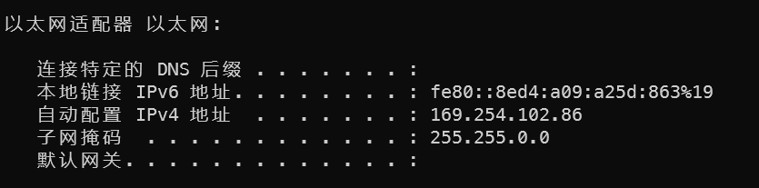

# C11 Chiplab

1. 根据warning信息对源文件进行修改
2. 在dcache、icache内部自定义data\_bank\_ram和tagv\_ram，以方便仿真ifdef SIMU时使用这两个模块
3. 实现ll、sc指令
4. 对dbar、ibar指令实现为nop
5. idle指令
6. 报错不存在zlib.h文件，安装\*\*`sudo apt-get install zlib1g-dev`\*\*
7. func编译不成功——start.S本来会删除，改成cp后会清空
8. data\_sram\_wdata解析一下
9. 选以太网，然后关防火墙

   
10. PMON

    先使用Hardware MANAGER传递programmer\_by\_uart.bit

    然后使用串口传递工具，在serial 波特率230400下传输gzrom.**bin**

    然后在windows下使用ipconfig查看以太网适配器的ipv4地址

    

    然后使用ifconfig dmfe0 ip设置实验箱的ip

    然后关闭电脑防火墙，使用ping验证是否成功接入网络

    最后搭建利用tftp32应用tftp服务器

    然后使用load tftp\://ip/vmlinux传输linux内核

    然后使用g console=ttyS0,baudrate rdinit=sbin/init运行内核（baudrate需要是数字波特率）
11. uboot

    print打印当前的环境配置

    使用setenv ipaddr更改uboot的ip，使用setenv serverip设置电脑ip

    然后关闭电脑防火墙，ping查看是否连接

    使用命令setenv bootcmd console=ttyS0,115200 rdinit=/init设置内核启动参数

    然后使用tftpboot 0xa3000000 vmlinux运行内核

    可以将内核加载到 `0xa300_0000` 开始的地址上，该地址并不是`readelf`显示的`entry`的入口地址。uboot会先把镜像加载到一段无数据的地址，运行时再根据elf段的信息加载到对应的位置上

    最后使用bootelf 0xa3000000 bootcmd运行内核
12. PMON固化

    运行至PMON时，通过下列命令擦除NandFlash
    ```bash
    mtd_erase /dev/mtd0r
    mtd_erase /dev/mtd1r
    ```
    使用ifconfig设置ip

    使用devcp tftp\://x.x.x.x /vmlinux /dev/mtd0传递vmlinux

    之后设置分区空间大小：set mtdparts nand-flash:50M\@0(kernel)ro,-(rootfs)

    最后设置启动分区及参数：
    ```bash
    set al /dev/mtd0
    set append "console=ttyS0,115200 rdinit=/sbin/init initcall_debug=1 loglevel=20"
    ```
