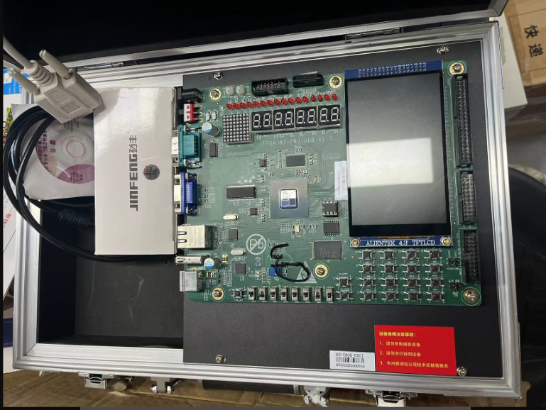
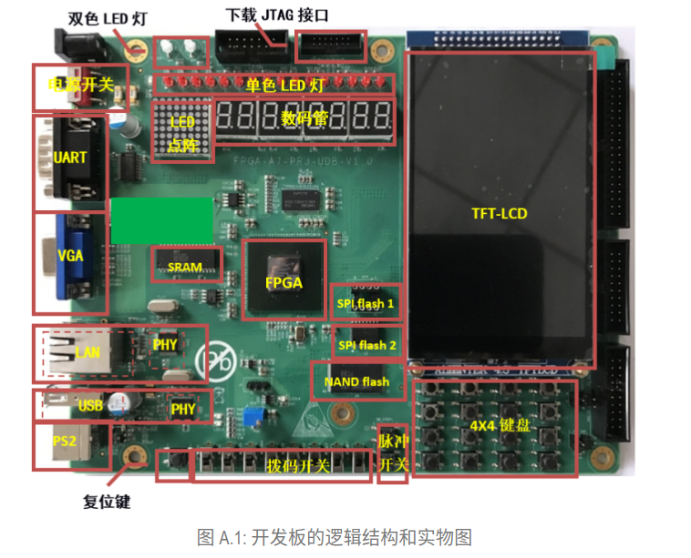

# C2 硬件实验平台及FPGA设计流程

## 目录

-   [1 硬件实验平台——本地实验](#1-硬件实验平台本地实验)
-   [2 FPGA的设计流程](#2-FPGA的设计流程)
    -   [2.1 FPGA的一般设计流程](#21-FPGA的一般设计流程)
        -   [2.1.1 电路设计](#211-电路设计)
        -   [2.1.2 代码编写](#212-代码编写)
        -   [2.1.3 功能仿真](#213-功能仿真)
        -   [2.1.4 综合实现](#214-综合实现)
        -   [2.1.5 上板调试](#215-上板调试)
    -   [2.2 基于Vivado的FPGA实现流程](#22-基于Vivado的FPGA实现流程)
    -   [2.3 实践任务——跑马灯](#23-实践任务跑马灯)
        -   [2.3.1 设计文件](#231-设计文件)
        -   [2.3.2 仿真测试文件](#232-仿真测试文件)
        -   [2.3.3 约束文件](#233-约束文件)

# 1 硬件实验平台——本地实验

实验箱采用龙芯实验箱，如下图，实验箱配备一块FPGA开发板、一个电源适配器、一个FPGA下载适配器的USB线缆JTAG（官网显示的网线、USB延长线那些这里没有）



开发板具体如下：



上图的PHY芯片一般是为模数混合电路，负责接收电、光这类模拟信号，经过解调和A/D转换后通过MII接口将信号交给MAC芯片进行处理；PS2接口用来链接键盘或者鼠标

JTAG接口在开发板下方的白色接口处

下图是板载外设的引脚对应关系表

[引脚对应关系.xlsx](file/引脚对应关系_a-1LM_V8pH.xlsx "引脚对应关系.xlsx")

# 2 FPGA的设计流程

FPGA（Field Programmable Gate Array）即现场可编辑门阵列是一种特殊的集成电路，特殊性体现在它的电路功能可以在芯片被制造出来以后，通过编程配置进行调整

## 2.1 FPGA的一般设计流程

FPGA是一种特殊的集成电路，意味着它首先是集成电路。现在的集成电路绝大多数都是晶体管集成电路，即用金属导线把许许多多由晶体管构成的逻辑门、存储单元连接成一个电路，具备一定的逻辑功能

FPGA的设计流程一般包含五个步骤：电路设计→代码编写→功能仿真→综合实现→上板调试

### 2.1.1 电路设计

根据需求规格制定电路设计方案：将设计CPU的需求一步步分解、细化得到最终满足需求的电路设计方案——要决定分成几个流水级，这里放几个触发器，那里放几个运算器，它们之间怎么连接，整个电路的445状态转换行为是++怎样的等等

通常电路设计只需要细化到RTL级别，无须精确到逻辑门级别或者晶体管级别

### 2.1.2 代码编写

代码编写阶段的工作是将电路设计方案用HDL语言表述，这里所使用的HDL语言是`Verilog语言`

### 2.1.3 功能仿真

功能仿真阶段[^注释1]所作的工作是对HDL语言所描述的设计进行功能仿真验证。这一阶段检查到的错误要么是电路设计错误要么是HDL描述不符合电路设计

> 📌由于是在RTL级对电路建模，因此功能仿真阶段不考虑电路的延迟

### 2.1.4 综合实现

综合实现阶段完成从HDL代码到真实芯片电路的转换过程，分为综合和实现两个阶段

1.  综合：HDL描述→逻辑网表

    综合阶段将HDL描述的设计编译为由基本逻辑单元连接而成的逻辑网表——并不是最终的门级电路网表
2.  实现：逻辑网表→FPGA具体电路

    实现阶段将综合出的逻辑网表映射为FPGA中的具体电路，即将逻辑网表中的基本逻辑单元映射到FPGA芯片内部固有的硬件逻辑模块上

    布局：将逻辑网表中的基本逻辑单元映射到FPGA芯片内部的固有硬件逻辑模块上

    布线：基于布局的拓扑利用FPGA芯片内部的连线资源，将各个映射后的逻辑模块连接起来

如果综合实现成功，最后会产生一个比特流BitStream文件。该文件描述了最终的电路实现，是需要传输到FPGA芯片的

### 2.1.5 上板调试

上板调试阶段需要将综合实现阶段生成的BitStream文件下载到FPGA芯片中，随后运行电路观察工作是否正常，如果发生问题就要调试、定位出错的原因

## 2.2 基于Vivado的FPGA实现流程

Vivado针对FPGA设计提供了两种工作方式：Project方式和Non-Project方式。其中Project方式可以在Vivado的图形界面下操作或以Tcl脚本方式在Vivado Tcl Shell中运行，Non-Project方式只能以Tcl脚本方式运行，而且Non-Project方式和Project方式下的脚本中使用的命令是不同的

## 2.3 实践任务——跑马灯

### 2.3.1 设计文件

16个单色LED灯，高电平灭，低电平亮，初始时的对应输出为`16'hfe`

此后，每隔一段时间循环左移即可

```verilog
`timescale 1ns / 1ps

module scroller #(parameter CNT_1S = 27'd10000)
                 (input clk,
                  input resetn,//因为板载的复位按钮松开为高电平，按下为低电平因此设置为低电平复位
                  output reg [15:0] led);
    
    reg [26:0] cnt;
    always @(posedge clk)//处理块
    begin
        if (!resetn)//低电平复位
        begin
            led <= 16'hfffe;//LED灯是高电平的，0灭1亮，初始时前16个灯亮，最后一个灭
            cnt = 27'b0;
        end
        else if (cnt == CNT_1S)//计时到1s
        begin
            led <= {led[14:0],led[15]};//循环左移实现跑马灯
            cnt = 27'b0;
            end else
            begin
            cnt = cnt + 1;
        end
    end
endmodule

```

### 2.3.2 仿真测试文件

```verilog
`timescale 1ns / 1ps

module testbench();
    reg clk;
    reg resetn;
    initial
    begin
        $dumpfile("dump.vcd");//为所要创建的vcd文件指明文件名
        $dumpvars;//指定需要记录到VCD文件中的信号，无参记录所有 $dumpvar(level, module_name);
        clk    = 0;
        resetn = 1'b0;
        #200;//200时才不复位
        resetn = 1'b1;
    end
    always #5 clk <= ~clk;//一次时钟上升下降10ns
    
    scroller #(
    .CNT_1S(27'd100)
    ) u_scroller (
    .clk(clk),
    .resetn(resetn),
    .led()
    );
endmodule

```

### 2.3.3 约束文件

本次实践任务需要用到的外设有16个单色LED灯，时钟脉冲，复位键

即将顶层设计文件的输入输出与外设管脚相映射：

clk映射FPGA\_CLK\_IN AC19

resetn映射FPGA\_RSTn\_in Y3

16位宽的led映射FPGA\_LED1-16 LED1为左起第一个

```verilog
set_property PACKAGE_PIN AC19 [get_ports clk]
set_property CLOCK_DEDICATED_ROUTE BACKBONE [get_nets clk]
create_clock -period 10.000 -name clk -waveform {0.000 5.000} [get_ports clk]

#reset
set_property PACKAGE_PIN Y3 [get_ports resetn]

#LED
set_property PACKAGE_PIN K23 [get_ports {led[0]}] //设置管脚约束
set_property PACKAGE_PIN J21 [get_ports {led[1]}]
set_property PACKAGE_PIN H23 [get_ports {led[2]}]
set_property PACKAGE_PIN J19 [get_ports {led[3]}]
set_property PACKAGE_PIN G9 [get_ports {led[4]}]
set_property PACKAGE_PIN J26 [get_ports {led[5]}]
set_property PACKAGE_PIN J23 [get_ports {led[6]}]
set_property PACKAGE_PIN J8 [get_ports {led[7]}]
set_property PACKAGE_PIN H8 [get_ports {led[8]}]
set_property PACKAGE_PIN G8 [get_ports {led[9]}]
set_property PACKAGE_PIN F7 [get_ports {led[10]}]
set_property PACKAGE_PIN A4 [get_ports {led[11]}]
set_property PACKAGE_PIN A5 [get_ports {led[12]}]
set_property PACKAGE_PIN A3 [get_ports {led[13]}]
set_property PACKAGE_PIN D5 [get_ports {led[14]}]
set_property PACKAGE_PIN H7 [get_ports {led[15]}]

set_property IOSTANDARD LVCMOS33 [get_ports clk] //设置店铺约束
set_property IOSTANDARD LVCMOS33 [get_ports resetn]
set_property IOSTANDARD LVCMOS33 [get_ports {led[*]}]
```

[^注释1]: 功能仿真验证，就是通过软件仿真模拟的方式查看电路的逻辑功能行为是否符合最初的设计需求。通常我们给电路输入指定的激励，观察电路输出是否符合预期，如果不符合则表明电路逻辑功能有错误
