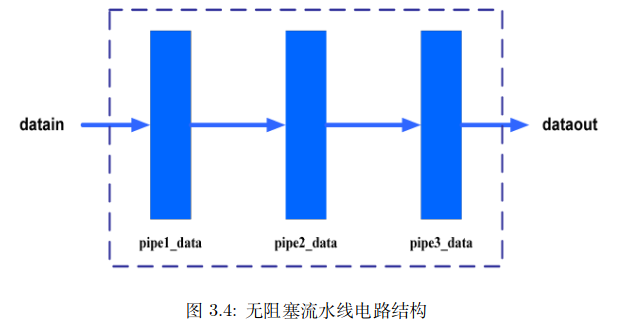
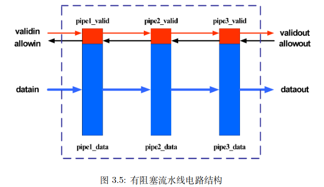

# C3 LA数字逻辑电路设计基础

## 目录

- [1 流水线](#1-流水线)
  - [1.1 无阻塞流水线设计](#11-无阻塞流水线设计)
  - [1.2 阻塞流水线设计](#12-阻塞流水线设计)

### 1 流水线

#### 1.1 无阻塞流水线设计

一个3级无阻塞流水线电路结构如下，其中pipeX\_data都是触发器，存储着各级流水的数据



其对应的Verilog代码如下，三级是直接相连的，用3个`always(@ posedge clk)`语句块直接相连

```verilog
module non_stall_pipeline # ( parameter WIDTH = 100 ) ( 
  input wire clk, 
  input wire [WIDTH-1:0] datain, 
  output wire [WIDTH-1:0] dataout 
); 
  reg [WIDTH-1:0] pipe1_data; 
  reg [WIDTH-1:0] pipe2_data; 
  reg [WIDTH-1:0] pipe3_data; 
  always @(posedge clk) begin 
    pipe1_data <= datain; 
  end 
  always @(posedge clk) begin 
    pipe2_data <= pipe1_data; 
  end 
  always @(posedge clk) begin 
    pipe3_data <= pipe2_data; 
  end 
  assign dataout = pipe3_data; 
endmodule
```

无阻塞流水线是一种非常理想的情况，但是很多时候流水线是会因为一些问题导致阻塞的。例如如果第2级阻塞，那么前面的第1级也必须阻塞，否则会导致第1级的数据丢失，因为并不能将第1级的数据更新至第2级；第3级可以正常流动

#### 1.2 阻塞流水线设计

结合触发器的设计原理，只要它的写使能信号保持无效，那么它内部存储的数据就保持不变。因此，**要使流水线应对阻塞的情况，核心在于控制好各级流水线缓存的写使能信号**

存在两套设计策略：

1. 配置一个流水线总管理员，可以同时看到各级流水线的状态，并对所有流水线下达命令

   一旦发现某个流水线阶段发生阻塞，那么就向这级阶段之前的所有阶段发出下一时刻停止向前传送的命令
2. 为每一级流水线阶段都配置一个管理人员，他和前后级流水线的监管人员相互沟通情况，决定下一时刻是否向前传送东西。

   就某一级流水线而言，它会向其后一级发出一个“下一时刻 我有东西传送给你”的请求，同时向其前一级发出“下一时刻我可以接收你传送来的东西”的反馈

   因此流水线各阶段的控制信号就有`pipeX_valid`[^注释1]、`pipeX_allowin`[^注释2]、`pipeX_ready_go`[^注释3]和`pipeX_to_pipeY_valid`[^注释4]

下面的电路设计采用的是第二种设计策略，电路结构如下图所示：



```verilog
module stallable_pipeline #(
    parameter WIDTH = 32
) (
    input wire clk,
    input wire resetn,
    input wire validin,
    input wire [WIDTH-1:0] datain,
    input wire out_allow,
    output wire validout,
    output wire [WIDTH-1:0] dataout
);
  reg [WIDTH-1:0] pipe1_data;
  reg [WIDTH-1:0] pipe2_data;
  reg [WIDTH-1:0] pipe3_data;
  reg pipe1_valid;
  reg pipe2_valid;
  reg pipe3_valid;

  wire pipe1_allowin;
  wire pipe1_ready_go;
  wire pipe1_to_pipe2_valid;
  assign pipe1_ready_go = ......;
  assign pipe1_allowin = ~pipe1_valid || pipe1_ready_go & pipe2_allowin;
  assign pipe1_to_pipe2_valid = pipe1_valid & pipe1_ready_go;

  always @(posedge clk) begin
    if (~resetn) begin  // 复位使得该触发器数据无效
      pipe1_valid <= 1'b0;
    end else if (pipe1_allowin) begin
      pipe1_valid <= validin;
    end

    if (pipe1_allowin & validin) begin
      pipe1_data <= datain;
    end
  end

  wire pipe2_allowin;
  wire pipe2_ready_go;
  wire pipe2_to_pipe3_valid;
  assign pipe2_ready_go = ......;
  assign pipe2_allowin = ~pipe2_valid || pipe2_ready_go & pipe3_allowin;
  assign pipe2_to_pipe3_valid = pipe2_valid & pipe2_ready_go;

  always @(posedge clk) begin
    if (~resetn) begin
      pipe2_valid <= 1'b0;
    end else if (pipe2_allowin) begin
      pipe2_valid <= pipe1_to_pipe2_valid;
    end
    if (pipe2_allowin & pipe1_to_pipe2_valid) begin
      pipe2_data <= pipe1_data;
    end
  end

  wire pipe3_allowin;
  wire pipe3_ready_go;
  wire pipe3_to_out_valid;  //赋值给validout
  assign pipe3_ready_go = ......;
  assign pipe3_allowin = ~pipe3_valid || pipe3_ready_go & out_allow;
  assign pipe3_to_out_valid = pipe3_valid & pipe3_ready_go;

  always @(posedge clk) begin
    if (~resetn) begin
      pipe3_valid <= 1'b0;
    end else if (pipe3_allowin) begin
      pipe3_valid <= pipe2_to_pipe3_valid;
    end
    if (pipe3_allowin & pipe2_to_pipe3_valid) begin
      pipe3_data <= pipe2_data;
    end
  end
  assign validout = pipe3_to_out_valid;
  assign dataout  = pipe3_data;
endmodule

```

1. pipeX\_valid

   pipeX\_valid称为第X级流水线的有效位

   值为1表示第X 级流水上当前时钟周期存在有效数据，值为 0 表示第 X 级流水上当前时钟周期无有效数据

   这样做的好处是清空流水线时只需要将该位置0即可，节省逻辑资源。但是要注意需要结合该位值来利用流水线触发器中的数据
2. pipeX\_allowin

   pipeX\_allowin 信号是从第 X 级传递给第 X-1 级的信号

   值为 1 表示下一时钟周期第 X 级流水级可以更新为当前时钟周期第X-1级流水级的数据，值为 0 则表示下一时钟周期第X级流水级不能接收新数据
3. pipeX\_ready\_go

   pipeX\_ready\_go信号描述当前时钟周期第 X 级处理任务的完成状态

   值为 1 表示数据在第 X 级的处理任务已完成，可以传递到第 X+1 级流水级

   比如CPU 的执行流水级用迭代方式运算除法，需要多个时钟周期能完成，那么在执行流水级的除法没有完成前，执行流水级的 ready\_go 信号将一直为 0
4. pipeX\_to\_pipeY\_valid

   pipeX\_to\_pipeY\_valid 信号是从第 X 级传递给第 X+1 级的信号

   值为 1 表示第 X 级流水级的数据希望在下一时钟周期进入到第 X+1 级流水级

[^注释1]: 当前流水线阶段的数据是否有效

[^注释2]: 当前流水线阶段是否允许数据进入

[^注释3]: 当前流水线阶段的数据是否准备好传送到下一级

[^注释4]: 流水线X阶段的数据是否正在传送到Y阶段，用来生成pipeY\_valid是否有效
