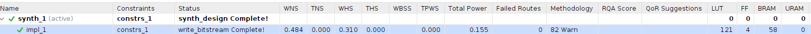
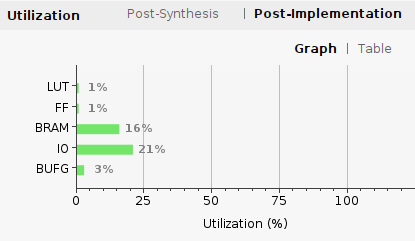
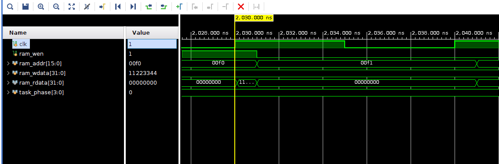
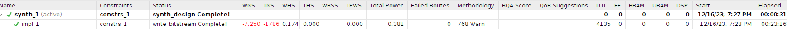
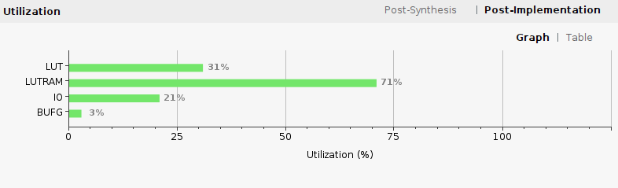
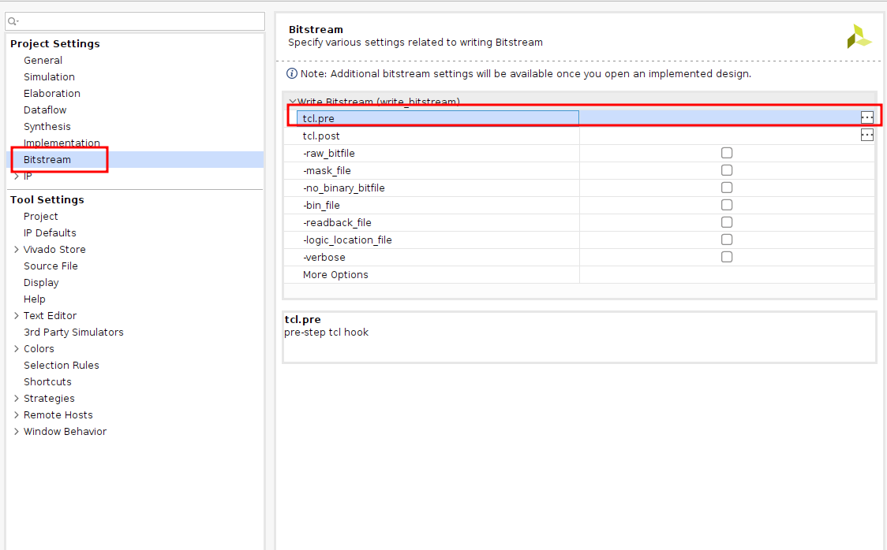

# C3 数字逻辑电路设计基础

## 目录

-   [1 任务1：寄存器堆仿真](#1-任务1寄存器堆仿真)
    -   [1.1 设计文件](#11-设计文件)
    -   [1.2 仿真测试文件](#12-仿真测试文件)
-   [2 任务2：同步RAM和异步RAM仿真、综合与实现](#2-任务2同步RAM和异步RAM仿真综合与实现)
    -   [2.1 同步RAM](#21-同步RAM)
        -   [2.1.1 时序结果和资源利用率](#211-时序结果和资源利用率)
    -   [2.2 异步RAM](#22-异步RAM)
        -   [2.2.1 观察仿真现象](#221-观察仿真现象)
        -   [2.2.2 时序结果和资源利用率](#222-时序结果和资源利用率)
    -   [2.3 问题](#23-问题)
-   [3 任务3：数字逻辑电路的设计与调试](#3-任务3数字逻辑电路的设计与调试)
    -   [3.1 问题分析](#31-问题分析)
    -   [3.2 设计代码](#32-设计代码)
    -   [3.3 约束文件](#33-约束文件)

## 1 任务1：寄存器堆仿真

所需要实现的寄存器文件为“两读一写”结构，接口列表如下：

| 名称     | 宽度 | 方向     | 描述         |
| ------ | -- | ------ | ---------- |
| clk    | 1  | input  | 时钟信号       |
| raddr1 | 5  | input  | 寄存器堆读地址1   |
| rdata1 | 32 | output | 寄存器堆读返回数据1 |
| raddr2 | 5  | input  | 寄存器堆读地址2   |
| rdata2 | 32 | output | 寄存器堆读返回数据2 |
| we     | 1  | input  | 寄存器堆写使能    |
| waddr  | 5  | input  | 寄存器堆写地址    |
| wdata  | 32 | input  | 寄存器堆写数据    |

### 1.1 设计文件

```verilog
module regfile(input clk,            //写时钟——只控制写
               input [4:0] raddr1,   //读端口地址A
               output [31:0] rdata1, //读端口数据A
               input [4:0] raddr2,   //读端口地址B
               output [31:0] rdata2, //读端口数据B
               input we,             //同步写使能信号
               input [4:0] waddr,    //写端口地址和写端口数据
               input [31:0] wdata);
    reg [31:0] rf[31:0];//32个32位宽的寄存器
    // 写 0号寄存器不能写,实质上是硬连线到0
    always @(posedge clk) begin
        if (we&&waddr! = 5'b0) rf[waddr] < = wdata;
    end
    // 读A
    assign rdata1 = (raddr1 == 5'b0) ? 32'b0 : rf[raddr1];
    // 读B
    assign rdata2 = (raddr2 == 5'b0) ? 32'b0 : rf[raddr2];
endmodule


```

### 1.2 仿真测试文件

```verilog
`timescale 1ns / 1ps

module tb_top ();

  reg         clk;

  reg  [ 4:0] raddr1;
  wire [31:0] rdata1;
  reg  [ 4:0] raddr2;
  wire [31:0] rdata2;
  reg         we;
  reg  [ 4:0] waddr;
  reg  [31:0] wdata;

  reg  [ 3:0] task_phase;

  regfile u_regfile (
      .clk   (clk),
      .raddr1(raddr1),
      .rdata1(rdata1),
      .raddr2(raddr2),
      .rdata2(rdata2),
      .we    (we),
      .waddr (waddr),
      .wdata (wdata)
  );

  //clk
  initial begin
    clk = 1'b1;
  end
  always #5 clk = ~clk;

  initial begin
    raddr1     = 5'd0;
    raddr2     = 5'd0;
    waddr      = 5'd0;
    wdata      = 32'd0;
    we         = 1'd0;
    task_phase = 4'd0;
    #2000;//2000ns之后开始

    $display("=============================");
    $display("Test Begin");
    #1;
    // Part 0 Begin
    #10;
    task_phase = 4'd0;
    we         = 1'b0;
    waddr      = 5'd1;
    wdata      = 32'hffffffff;
    raddr1     = 5'd1;
    #10;
    we    = 1'b1;
    waddr = 5'd1;
    wdata = 32'h1111ffff;
    #10;
    we     = 1'b0;
    raddr1 = 5'd2;
    raddr2 = 5'd1;
    #10;
    raddr1 = 5'd1;

    #200;
    // Part 1 Begin
    #10;
    task_phase = 4'd1;
    we         = 1'b1;
    wdata      = 32'h0000ffff;
    waddr      = 5'h10;
    raddr1     = 5'h10;
    raddr2     = 5'h0f;
    #10;
    wdata  = 32'h1111ffff;
    waddr  = 5'h11;
    raddr1 = 5'h11;
    raddr2 = 5'h10;
    #10;
    wdata  = 32'h2222ffff;
    waddr  = 5'h12;
    raddr1 = 5'h12;
    raddr2 = 5'h11;
    #10;
    wdata  = 32'h3333ffff;
    waddr  = 5'h13;
    raddr1 = 5'h13;
    raddr2 = 5'h12;
    #10;
    wdata  = 32'h4444ffff;
    waddr  = 5'h14;
    raddr1 = 5'h14;
    raddr2 = 5'h13;
    #10;
    raddr1 = 5'h15;
    raddr2 = 5'h14;
    #10;

    #200;
    // Part 2 Begin
    #10;
    task_phase = 4'd2;
    we         = 1'b1;
    raddr1     = 5'h10;
    raddr2     = 5'h0f;
    #10;
    raddr1 = 5'h11;
    raddr2 = 5'h10;
    #10;
    raddr1 = 5'h12;
    raddr2 = 5'h11;
    #10;
    raddr1 = 5'h13;
    raddr2 = 5'h12;
    #10;
    raddr1 = 5'h14;
    raddr2 = 5'h13;
    #10;

    #50;
    $display("TEST END");
    $finish;
  end

  initial begin
    $dumpfile("rf.vcd");//波形保存为rf.vcd文件
    $dumpvars(0, u_regfile);//信号要求是u_regfile模块以及之下所有模块的变量
  end

endmodule


```

## 2 任务2：同步RAM和异步RAM仿真、综合与实现

本次实验任务需要调用Xilinx IP库实例化一个同步RAM和异步RAM，并进行仿真、综合实现

### 2.1 同步RAM

定制满足以下要求的同步RAM IP：

1.  IP核名称为：block\_ram
2.  标准类型接口、单端口RAM、不需要写字节使能、算法类型选择“最小面积”
3.  读写深度为65536、宽度为32、片选使能一直有效、不需要额外提高效率、

```verilog
module ram_top (
    input         clk      ,
    input  [15:0] ram_addr ,
    input  [31:0] ram_wdata,
    input         ram_wen  ,
    output [31:0] ram_rdata
);
             
block_ram block_ram (
    .clka (clk       ),
    .wea  (ram_wen   ),
    .addra(ram_addr  ),
    .dina (ram_wdata ),
    .douta(ram_rdata ) 
);
endmodule

```

#### 2.1.1 时序结果和资源利用率





### 2.2 异步RAM

定制满足以下要求的异步RAM IP：

1.  IP核名称为：distributed\_ram
2.  标准类型接口、单端口RAM(地址端既充当读地址又充当写地址)、不需要写字节使能、算法类型选择“最小面积”
3.  读写深度为65536、宽度为32、片选使能一直有效、不需要额外提高效率

blockblock\_ram\_ram

```verilog
module ram_top (
    input         clk      ,
    input  [15:0] ram_addr ,
    input  [31:0] ram_wdata,
    input         ram_wen  ,
    output [31:0] ram_rdata       
);
             
distributed_ram distributed_ram(
    .clk (clk       ),
    .we  (ram_wen   ),
    .a   (ram_addr  ),
    .d   (ram_wdata ),
    .spo (ram_rdata ) 
);

endmodule

```

测试文件均为：

```verilog
`timescale 1ns / 1ps

module tb_top();

reg         clk;

reg         ram_wen;
reg  [15:0] ram_addr;
reg  [31:0] ram_wdata;
wire [31:0] ram_rdata;
reg  [3 :0] task_phase;

ram_top u_ram_top(
    .clk      (clk       ),
    .ram_wen  (ram_wen   ),
    .ram_addr (ram_addr  ),
    .ram_wdata(ram_wdata ),
    .ram_rdata(ram_rdata ) 
);

//clk
initial 
begin
    clk = 1'b1;
end
always #5 clk = ~clk;
          
initial 
begin
  ram_addr   = 16'd0;
  ram_wdata  = 32'd0;
  ram_wen    =  1'd0;
  task_phase =  4'd0;
  #2000;
  
  $display("=============================");
  $display("Test Begin");
  #1;
  // Part 0 Begin
  #10;
  task_phase = 4'd0;
  ram_wen    = 1'b0;
  ram_addr   = 16'hf0;
  ram_wdata  = 32'hffffffff;
    #10;
  ram_wen    = 1'b1;
  ram_addr   = 16'hf0;
  ram_wdata  = 32'h11223344;
    #10;
  ram_wen    = 1'b0;
  ram_addr   = 16'hf1;
  #10;
  ram_wen    = 1'b0;
  ram_addr   = 16'hf0;
    
    #200;
    // Part 1 Begin
    #10;
  task_phase = 4'd1;
  ram_wen    = 1'b1;
  ram_wdata  = 32'hff00;
  ram_addr   = 16'hf0;
  #10;
  ram_wdata  = 32'hff11;
  ram_addr   = 16'hf1;
  #10;
  ram_wdata  = 32'hff22;
  ram_addr   = 16'hf2;
  #10;
  ram_wdata  = 32'hff33;
  ram_addr   = 16'hf3;
  #10;
  ram_wdata  = 32'hff44;
  ram_addr   = 16'hf4;
  #10;

    #200;
  // Part 2 Begin
  #10;
  task_phase = 4'd2;
  ram_wen    = 1'b0;
  ram_addr   = 16'hf0;
  ram_wdata  = 32'hffffffff;
  #10;
  ram_addr   = 16'hf1;
  #10;
  ram_addr   = 16'hf2;
  #10;
  ram_addr   = 16'hf3;
  #10;
  ram_addr   = 16'hf4;
  #10;
  
  #50;
  $display("TEST END");
  $finish;
end

endmodule

```

约束文件均为：

```纯文本
create_clock -period 20.000 -name clk -waveform {0.000 10.000} [get_ports clk]
set_input_delay -clock clk [expr 4.0] [all_inputs]
set_output_delay -clock clk [expr 3.0] [all_outputs]
```

#### 2.2.1 观察仿真现象



上图是异步RAM的仿真，观察可以得到**异步RAM写RAM需要时钟上升沿的控制，但是读RAM是只需要读地址改变即可。而同步RAM的读和写均需要时钟信号的控制**

#### 2.2.2 时序结果和资源利用率





可以看到WNS为负数，时序满足特别好，但是它所利用的资源是比较多的

### 2.3 问题

在生成比特流文件时遇到下面的报错

```text
ERROR: [DRC NSTD-1] Unspecified I/O Standard: 82 out of 82 logical ports use I/O standard (IOSTANDARD) value 'DEFAULT', instead of a user assigned specific value. This may cause I/O contention or incompatibility with the board power or connectivity affecting performance, signal integrity or in extreme cases cause damage to the device or the components to which it is connected. To correct this violation, specify all I/O standards. This design will fail to generate a bitstream unless all logical ports have a user specified I/O standard value defined. To allow bitstream creation with unspecified I/O standard values (not recommended), use this command: set_property SEVERITY {Warning} [get_drc_checks NSTD-1].  NOTE: When using the Vivado Runs infrastructure (e.g. launch_runs Tcl command), add this command to a .tcl file and add that file as a pre-hook for write_bitstream step for the implementation run. Problem ports: ram_wdata[31:0], ram_rdata[31:0], ram_addr[15:0], clk, and ram_wen.
ERROR: [DRC UCIO-1] Unconstrained Logical Port: 82 out of 82 logical ports have no user assigned specific location constraint (LOC). This may cause I/O contention or incompatibility with the board power or connectivity affecting performance, signal integrity or in extreme cases cause damage to the device or the components to which it is connected. To correct this violation, specify all pin locations. This design will fail to generate a bitstream unless all logical ports have a user specified site LOC constraint defined.  To allow bitstream creation with unspecified pin locations (not recommended), use this command: set_property SEVERITY {Warning} [get_drc_checks UCIO-1].  NOTE: When using the Vivado Runs infrastructure (e.g. launch_runs Tcl command), add this command to a .tcl file and add that file as a pre-hook for write_bitstream step for the implementation run.  Problem ports: ram_wdata[31:0], ram_rdata[31:0], ram_addr[15:0], clk, and ram_wen.

```

大概的原因是并未约束文件中并没有指定顶部设计文件端口对应的接口映射（共82位）这可能会导致 I/O 争用或与电路板电源或连接不兼容，从而影响性能、信号完整性，或者在极端情况下会导致设备或其连接的组件损坏

错误信息也提到了解决方法：

1.  定义这82位信号所对应的管脚

    This design will fail to generate a bitstream unless all logical ports have a user specified I/O standard value defined.
2.  执行忽视该错误的TCL命令

    To allow bitstream creation with unspecified I/O standard values (not recommended), use this command: set\_property SEVERITY {Warning} \[get\_drc\_checks NSTD-1]. &#x20;

    新建tcl文件，内容如下：
    ```纯文本
    set_property SEVERITY {Warning} [get_drc_checks NSTD-1]
    set_property SEVERITY {Warning} [get_drc_checks UCIO-1]
    ```
    点击Vivado上方的设置按钮

    

    在下图的Bitstream→tcl.pre添加刚刚新建的tcl文件

    

    然后点击Apply、OK重新生成比特流
3.  选择符合xdc约束的顶层模块

## 3 任务3：数字逻辑电路的设计与调试

### 3.1 问题分析

show\_sw\.v所做的工作是：

1.  获取开发板最右侧4个拨码开关的状态（记为“拨上为1，拨下为0”，实际开发板上拨码开关的电平是“拨上为低电平，拨下为高电平”），共有16个状态（数字编号是0\~15）
2.  最左侧数码管实时显示4个拨码开关的状态。数码管只支持显示0\~9，如果拨码开关状态是10\~15，则数码管的显示状态不更改（显示上一次的显示值）
3.  最右侧的4个单色LED灯会显示上一次的拨码开关的状态，支持显示0\~15（拨码开关拨上，对应LED灯亮）

初始状态下，4个拨码开关拨下，按复位键，则数码管显示0，LED灯都不亮；拨码开关拨为1，则数码管显示1，LED灯还是都不亮；拨码开关再拨为3，则数码管显示3，LED灯显示1

根据功能所述，4位宽的switch获取到的是开发板最右侧4个拨码开关的状态；num\_a\_g输出的是段选码，num\_csn输出的是数码管的位选码；led输出的是最右侧4个单色LED灯

1.  因为实际上开发板拨码开关的电平是“拨上为低电平，拨下为高电平”，但是要求是“拨上为1，拨下为0”所以需要将拨码获得的信号取反。且LED灯输出是“拨码上，LED灯亮”而LED灯是“低电平亮高电平灭”，与拨码相一致
2.  要求数码管实时改变，因此产生num\_csn的数值需要是实时给定的，数码管内部仍使用时序逻辑实现；
3.  要求LED灯显示上一次的结果，所以需要采用时序逻辑保留结果，而因为clk的影响，需要采用一个中间值来暂存每次clk上升沿时得到的上一次开关结果`show_data_t`，只有当两次开关结果不一致时才给真正存储上一次开关结果的变量赋值`prev_data`

### 3.2 设计代码

所以修改后的设计代码如下：

```verilog
module show_sw (
    input clk,
    input resetn,
    input [3 : 0] switch,

    output [7 : 0] num_csn,
    output [6 : 0] num_a_g,
    output [3 : 0] led
);
  reg [3:0] show_data;  //实时数据值
  reg [3:0] show_data_t;
  reg [3:0] prev_data;  //存储上一次的值
  assign led = ~prev_data;
  always @(posedge clk) begin
    if (!resetn) begin
      prev_data <= 4'hf;
      show_data <= 4'h0;
    end else begin
      show_data_t <= show_data;
      show_data   <= ~switch;
      if (show_data_t != show_data) begin
        prev_data <= show_data_t;
      end
    end
  end
  show_num show_num_init (
      clk,
      resetn,
      show_data,
      num_csn,
      num_a_g
  );
endmodule

module show_num (
    input              clk,
    input              resetn,
    input      [3 : 0] show_data,
    output     [7 : 0] num_csn,
    output reg [6 : 0] num_a_g
);

  assign num_csn = 8'b0111_1111;  //位选码只选择最左侧数码管，不变

  wire [6:0] nxt_a_g;

  always @(posedge clk) begin
    if (!resetn) begin
      num_a_g <= 7'b1111110;
    end else begin
      num_a_g <= nxt_a_g;
    end
  end

  assign nxt_a_g = show_data == 4'd0 ? 7'b1111110 :  //0
      show_data == 4'd1 ? 7'b0110000 :  //1
      show_data == 4'd2 ? 7'b1101101 :  //2
      show_data == 4'd3 ? 7'b1111001 :  //3
      show_data == 4'd4 ? 7'b0110011 :  //4
      show_data == 4'd5 ? 7'b1011011 :  //5
      show_data == 4'd6 ? 7'b1011111 :  //6
      show_data == 4'd7 ? 7'b1110000 :  //7
      show_data == 4'd8 ? 7'b1111111 :  //8
      show_data == 4'd9 ? 7'b1111011 :  //9
      num_a_g;
endmodule

```

### 3.3 约束文件

```text
#set_property SEVERITY {Warning} [get_drc_checks RTSTAT-2]
#时钟信号连接
set_property PACKAGE_PIN AC19 [get_ports clk]
set_property CLOCK_DEDICATED_ROUTE BACKBONE [get_nets clk]
create_clock -period 10.000 -name clk -waveform {0.000 5.000} [get_ports clk]
set_property BITSTREAM.CONFIG.UNUSEDPIN Pullnone [current_design]//其他引脚悬空

#reset
set_property PACKAGE_PIN Y3 [get_ports resetn]

#LED
set_property PACKAGE_PIN K23 [get_ports {led[0]}]
set_property PACKAGE_PIN J21 [get_ports {led[1]}]
set_property PACKAGE_PIN H23 [get_ports {led[2]}]
set_property PACKAGE_PIN J19 [get_ports {led[3]}]

#digit show
#低电平有效
set_property PACKAGE_PIN D3  [get_ports {num_csn[7]}] 
set_property PACKAGE_PIN D25 [get_ports {num_csn[6]}]
set_property PACKAGE_PIN D26 [get_ports {num_csn[5]}]
set_property PACKAGE_PIN E25 [get_ports {num_csn[4]}]
set_property PACKAGE_PIN E26 [get_ports {num_csn[3]}]
set_property PACKAGE_PIN G25 [get_ports {num_csn[2]}]
set_property PACKAGE_PIN G26 [get_ports {num_csn[1]}]
set_property PACKAGE_PIN H26 [get_ports {num_csn[0]}]

#段选码是按照abcdefg的顺序
set_property PACKAGE_PIN C3 [get_ports {num_a_g[0]}]
set_property PACKAGE_PIN E6 [get_ports {num_a_g[1]}]
set_property PACKAGE_PIN B2 [get_ports {num_a_g[2]}]
set_property PACKAGE_PIN B4 [get_ports {num_a_g[3]}]
set_property PACKAGE_PIN E5 [get_ports {num_a_g[4]}]
set_property PACKAGE_PIN D4 [get_ports {num_a_g[5]}]
set_property PACKAGE_PIN A2 [get_ports {num_a_g[6]}]
#set_property PACKAGE_PIN C4 :DP

#switch
set_property PACKAGE_PIN AB6  [get_ports {switch[3]}]
set_property PACKAGE_PIN W6   [get_ports {switch[2]}]
set_property PACKAGE_PIN AA7  [get_ports {switch[1]}]
set_property PACKAGE_PIN Y6   [get_ports {switch[0]}]

set_property IOSTANDARD LVCMOS33 [get_ports clk]
set_property IOSTANDARD LVCMOS33 [get_ports resetn]
set_property IOSTANDARD LVCMOS33 [get_ports {led[*]}]
set_property IOSTANDARD LVCMOS33 [get_ports {num_a_g[*]}]
set_property IOSTANDARD LVCMOS33 [get_ports {num_csn[*]}]
set_property IOSTANDARD LVCMOS33 [get_ports {switch[*]}]

```
