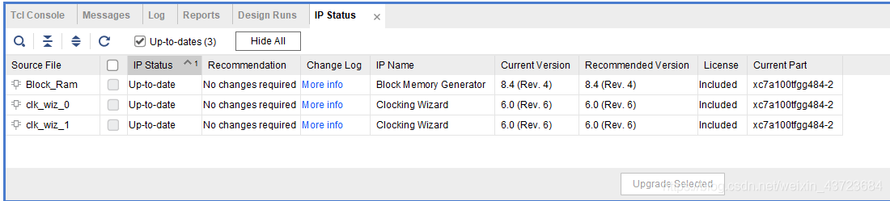
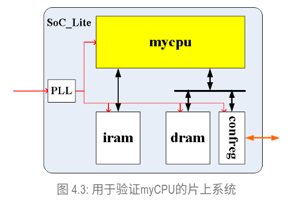
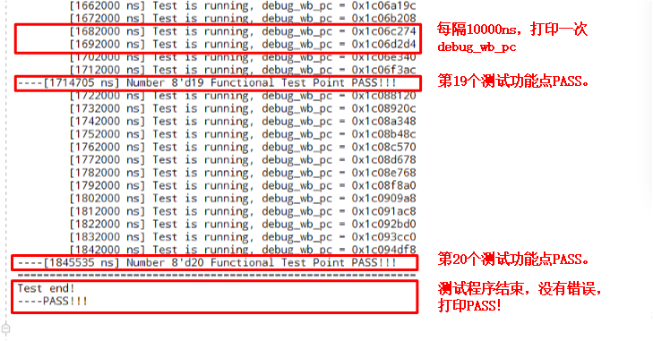
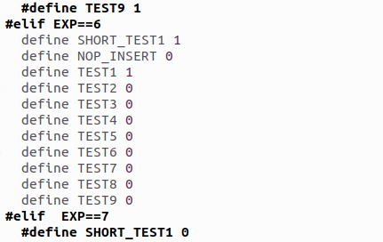
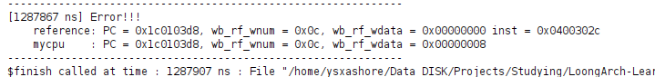

# C4 单周期CPU设计

## 目录

- [1 验证5条指令的单周期CPU](#1-验证5条指令的单周期CPU)
  - [1.1 快速上手](#11-快速上手)
    - [1.1.1 获取实验开发环境](#111-获取实验开发环境)
    - [1.1.2 实验代码](#112-实验代码)
      - [1.1.2.1 填空minicpu\_env/miniCPU/minicpu\_top.v文件](#1121-填空minicpu_envminiCPUminicpu_topv文件)
      - [1.1.2.2 LED——充当数据存储直观写](#1122-LED充当数据存储直观写)
      - [1.1.2.3 顶层模块](#1123-顶层模块)
      - [1.1.2.4 指令存储器coe文件](#1124-指令存储器coe文件)
    - [1.1.3 新建Vivado工程集成CPU并仿真验证](#113-新建Vivado工程集成CPU并仿真验证)
      - [1.1.3.1 仿真过程中遇到的问题](#1131-仿真过程中遇到的问题)
      - [1.1.3.2 仿真结果](#1132-仿真结果)
    - [1.1.4 上板验证](#114-上板验证)
      - [1.1.4.1 约束文件](#1141-约束文件)
  - [1.2 实验开发环境组织结构介绍](#12-实验开发环境组织结构介绍)
- [2 验证20条指令的单周期CPU](#2-验证20条指令的单周期CPU)
  - [2.1 实验开发环境组织结构介绍](#21-实验开发环境组织结构介绍)
    - [2.1.1 SoC\_lite结构介绍](#211-SoC_lite结构介绍)
  - [2.2 基于trace比对的调试框架](#22-基于trace比对的调试框架)
    - [2.2.1 基于trace比对的调试辅助手段](#221-基于trace比对的调试辅助手段)
    - [2.2.2 利用参考模型生成golden\_trace](#222-利用参考模型生成golden_trace)
    - [2.2.3 使用 golden\_trace 监控 myCPU](#223-使用-golden_trace-监控-myCPU)
  - [2.3 func功能测试程序](#23-func功能测试程序)
    - [2.3.1 func测试程序说明](#231-func测试程序说明)
    - [2.3.2 LoongArch-GCC交叉编译工具的安装](#232-LoongArch-GCC交叉编译工具的安装)
    - [2.3.3 func测试程序编译脚本说明](#233-func测试程序编译脚本说明)
    - [2.3.4 func测试程序的装载](#234-func测试程序的装载)
    - [2.3.5 func测试仿真验证结果的判断](#235-func测试仿真验证结果的判断)
    - [2.3.6 func测试FPGA上板验证结果判断](#236-func测试FPGA上板验证结果判断)
  - [2.4 基于mycpu\_env实验开发环境的实验流程](#24-基于mycpu_env实验开发环境的实验流程)
    - [2.4.1 开发CPU代码](#241-开发CPU代码)
      - [2.4.1.1 tools.v](#2411-toolsv)
      - [2.4.1.2 regfile.v](#2412-regfilev)
      - [2.4.1.3 alu.v](#2413-aluv)
      - [2.4.1.4 mul.v](#2414-mulv)
      - [2.4.1.5 div.v](#2415-divv)
      - [2.4.1.6 mycpu\_top.v](#2416-mycpu_topv)
      - [2.4.1.7 bridge\_1x2.v](#2417-bridge_1x2v)
      - [2.4.1.8 confreg.v](#2418-confregv)
      - [2.4.1.9 inst\_ram、data\_ram、clk\_pll IP](#2419-inst_ramdata_ramclk_pll-IP)
    - [2.4.2 编译测试程序](#242-编译测试程序)
    - [2.4.3 生成golden\_trace](#243-生成golden_trace)
    - [2.4.4 仿真验证设计的CPU](#244-仿真验证设计的CPU)
    - [2.4.5 上板验证设计的CPU](#245-上板验证设计的CPU)

# 1 验证5条指令的单周期CPU

## 1.1 快速上手

### 1.1.1 获取实验开发环境

实验开发环境在`git clone gitee链接`所产生的cdp\_ede\_local目录下的minicpu\_env目录[^注释1]

### 1.1.2 实验代码

#### 1.1.2.1 填空minicpu\_env/miniCPU/minicpu\_top.v文件

```verilog
module minicpu_top (
    input wire clk,    //时钟信号
    input wire resetn, //复位信号,低电平有效——板载是低电平

    //指令存储器、数据存储器的写信号、地址信号、写数据信号、读数据信号
    output wire        inst_sram_we,     //指令存储器不需要写，设置为0
    output wire [31:0] inst_sram_addr,
    output wire [31:0] inst_sram_wdata,  //写数据可以是任意值
    input  wire [31:0] inst_sram_rdata,

    output wire        data_sram_we,
    output wire [31:0] data_sram_addr,
    output wire [31:0] data_sram_wdata,
    input  wire [31:0] data_sram_rdata
);

  reg valid;  //?valid是做什么的
  always @(posedge clk) begin  //同步复位
    if (!resetn) begin
      valid <= 1'b0;
    end else begin
      valid <= 1'b1;
    end
  end

  reg  [31:0] pc;  //当前指令的地址
  wire [31:0] nextpc;  //下一条指令的地址

  wire [31:0] inst;  //32位指令

  //这里也可以不需要译码直接比对
  wire [ 5:0] op_31_26;  //指令的26位到31位
  wire [ 3:0] op_25_22;  //指令的22位到25位
  wire [ 1:0] op_21_20;  //指令的20位到21位
  wire [ 4:0] op_19_15;  //指令的15位到19位
  wire [63:0] op_31_26_d;  //6-64译码
  wire [15:0] op_25_22_d;  //4-16译码
  wire [ 3:0] op_21_20_d;  //2-4译码
  wire [31:0] op_19_15_d;  //5-32译码
  wire [ 4:0] rd;  //目的寄存器编号
  wire [ 4:0] rj;  //源寄存器1编号
  wire [ 4:0] rk;  //源寄存器2编号
  wire [11:0] i12;  //指令中的12位立即数
  wire [15:0] i16;  //指令中的16位立即数

  wire        inst_add_w;  //是否是add_w指令
  wire        inst_addi_w;  //是否是addi_w指令
  wire        inst_ld_w;  //是否是ld_w指令
  wire        inst_st_w;  //是否是st_w指令
  wire        inst_bne;  //是否是bne指令

  wire        src2_is_imm;  //表示是否alu的第二个操作数是立即数
  wire        res_from_mem;  //表示是否结果是来自存储器——Load
  wire        gr_we;  //是否要写通用寄存器
  wire        mem_we;  //是否要写存储——st
  wire        src_reg_is_rd;  //rd位也是一个源寄存器
  wire [31:0] rj_value;  //寄存器编号rj读出的值
  wire [31:0] rkd_value;  //寄存器编号rk/rd读出的值

  wire [ 4:0] rf_raddr1;  //读寄存器地址1
  wire [ 4:0] rf_raddr2;  //读寄存器地址2
  wire [31:0] rf_wdata;  //写寄存器数据

  wire        br_taken;  //是否采用分支
  wire        rj_eq_rd;  //rj和rd读出的值是否相等
  wire [31:0] br_offs;  //分支偏移值
  wire [31:0] br_target;  //分支目标地址

  wire [31:0] imm;  //立即数
  wire [31:0] alu_src1;  //alu操作数1
  wire [31:0] alu_src2;  //alu操作数2
  wire [31:0] alu_result;  //alu运算结果


  always @(posedge clk) begin  //初始化以及迭代pc
    if (!resetn) begin
      pc <= 32'h1bfffffc;  //trick: to make nextpc be 0x1c000000 during reset 
    end else begin
      pc <= nextpc;
    end
  end

  assign inst_sram_we    = 1'b0;  //禁止写指令存储
  assign inst_sram_addr  = pc;  //读指令地址
  assign inst_sram_wdata = 32'b0;  //写指令存储值这里设置为0
  assign inst            = inst_sram_rdata;  //指令inst即为指令存储读出的值

  //对指令划分各个字段
  assign op_31_26        = inst[31:26];
  assign op_25_22        = inst[25:22];
  assign op_21_20        = inst[21:20];
  assign op_19_15        = inst[19:15];
  assign rd              = inst[4:0];
  assign rj              = inst[9:5];
  assign rk              = inst[14:10];
  assign i12             = inst[21:10];
  assign i16             = inst[25:10];

  //调用译码单元进行译码
  decoder_6_64 u_dec0 (
      .in(op_31_26),
      .co(op_31_26_d)
  );
  decoder_4_16 u_dec1 (
      .in(op_25_22),
      .co(op_25_22_d)
  );
  decoder_2_4 u_dec2 (
      .in(op_21_20),
      .co(op_21_20_d)
  );
  decoder_5_32 u_dec3 (
      .in(op_19_15),
      .co(op_19_15_d)
  );

  //ADDW 31-26值为0,25-22值为0,21-20是1,19-15是0 rj+rk->rd
  //ADDIW 31-26值为0,25-22值是10即十六进制a rj+立即数->rd
  //LDW 31-26值为10即a,25-22值为2 mem(rj+立即数)->rd
  //STW 31-26值为10即a,25-22值为6 rd->mem(rj+立即数)
  //BNE 31-26值为6'h17 rj!=rd->jump 

  assign inst_add_w = op_31_26_d[6'h00] & op_25_22_d[4'h0] & op_21_20_d[2'h1] & op_19_15_d[5'h00];
  assign inst_addi_w = op_31_26_d[6'h00] & op_25_22_d[4'ha];
  assign inst_ld_w = op_31_26_d[6'h0a] & op_25_22_d[4'h2];
  assign inst_st_w   = op_31_26_d[6'h0a] & op_25_22_d[4'h6]; //在这里实现inst_st_w指令的译码
  assign inst_bne = op_31_26_d[6'h17];

  assign src2_is_imm   = inst_addi_w | inst_ld_w | inst_st_w;  //实现立即数选择信号 ADDIW、LDW、STW的第二个操作数需要是立即数
  assign res_from_mem = inst_ld_w;  //实现寄存器结果的标识信号 只有LDW指令的寄存器结果是来自于存储器的
  assign gr_we = inst_add_w | inst_ld_w | inst_addi_w;  //写寄存器信号 ADD ADDIW LDW需要写寄存器
  assign mem_we = inst_st_w;  //写存储器信号 STW需要写存储器 
  assign src_reg_is_rd = inst_bne | inst_st_w;  //第二个源操作数来自于rd BNE,STW

  assign rf_raddr1 = rj;
  assign rf_raddr2 = src_reg_is_rd ? rd : rk;
  regfile u_regfile (
      .clk   (clk),
      .raddr1(rf_raddr1),  //补充读寄存器1编号地址
      .rdata1(rj_value),
      .raddr2(rf_raddr2),  //补充读寄存器2编号地址
      .rdata2(rkd_value),
      .we    (gr_we),
      .waddr (rd),         //写地址
      .wdata (rf_wdata)
  );  //在空出的括号里完成引脚匹配

  assign br_offs = {
    {14{i16[15]}}, i16, 2'b0
  };  //在这里完成br_offs信号的生成 低位补2位0再符号扩展 SignExtend({offs16, 2'b0}, 32)
  assign br_target = pc + br_offs;
  assign rj_eq_rd = (rj_value == rkd_value);
  assign br_taken = valid && inst_bne && !rj_eq_rd;  //valid的作用，只有复位无效时才执行跳转
  assign nextpc = br_taken ? br_target : pc + 4;  //在这里实现nextpc信号的生成

  assign imm = {{20{i12[11]}}, i12[11:0]};  //SignExtend(si12, 32)
  assign alu_src1 = rj_value;
  assign alu_src2 = src2_is_imm ? imm : rkd_value;  //在这里实现alu_src2信号

  assign alu_result = alu_src1 + alu_src2;  //这5条指令，除BNE外都使用加法

  assign data_sram_we = mem_we;
  assign data_sram_addr = alu_result;  //访存地址是通过alu计算得到的
  assign data_sram_wdata = rkd_value;  //写存存储器的LDW是将rd写入存储

  assign rf_wdata = res_from_mem ? data_sram_rdata : alu_result;//在这里完成写回寄存器值的选择

endmodule

```

#### 1.1.2.2 LED——充当数据存储直观写

```verilog
//该CPU没有设置数据存储器，对于CPU所发出的写存储器指令STW，所采取的直观做法是将写数据写到LED灯上——当CPU发出写信号且写地址是1028时表示写数据到LED
//因此conf_wdata是来自于CPU的写存储器数据,conf_we是来自于CPU的写信号且给定写地址是十进制的1028,clk,resetn也都与CPU的clk，resetn相同
module confreg (
    input  wire        clk,
    input  wire        resetn,
    input  wire        conf_we,
    input  wire [31:0] conf_wdata,
    output wire [15:0] led
);

  reg [31:0] led_data;

  wire write_led = conf_we;
  assign led = led_data[15:0];
  always @(posedge clk) begin
    if (!resetn) begin
      led_data <= 32'h0;
    end else if (write_led) begin
      led_data <= conf_wdata[31:0];
    end
  end

endmodule

```

#### 1.1.2.3 顶层模块

```verilog
//*************************************************************************
//   > File Name   : soc_mini_top.v
//   > Description : SoC, included cpu, 
//                   inst ram, confreg
// 
//           -------------------------
//           |           cpu         |
//           -------------------------
//         inst|                  | data
//             |                  | 
//             |                  |           
//             |                  |           
//      -------------         -----------
//      | inst ram  |         | confreg |
//      -------------         -----------
//
//   > Author      : LOONGSON
//   > Date        : 2017-08-04
//*************************************************************************

`default_nettype none

//for simulation:
//1. if define SIMU_USE_PLL = 1, will use clk_pll to generate cpu_clk,
//   and simulation will be very slow.
//2. usually, please define SIMU_USE_PLL=0 to speed up simulation by assign
//   cpu_clk = clk.
//   at this time, cpu_clk frequency are both 100MHz, same as clk.

`define SIMU_USE_PLL 0 //set 0 to speed up simulation

module soc_mini_top #(
    parameter SIMULATION = 1'b0) (
    input wire resetn,
    input wire clk,

    input wire [7 : 0] switch,  //输入 低位8个开关
    output wire [15:0] led  //输出  低位16个LED灯
);

  //clk and resetn 为了方便上板 使用clk_pll生产cpu时钟以及使用cpu时钟去同步复位信号
  wire cpu_clk;
  reg  cpu_resetn;
  always @(posedge cpu_clk) begin
    cpu_resetn <= resetn;
  end
  generate
    if (SIMULATION && `SIMU_USE_PLL == 0) begin : speedup_simulation
      assign cpu_clk = clk;
    end else begin : pll
      clk_pll clk_pll (
          .clk_in1  (clk),
          .cpu_clk  (cpu_clk),
          .timer_clk()
      );
    end
  endgenerate

  //cpu inst sram
  wire        cpu_inst_we;
  wire [31:0] cpu_inst_addr;
  wire [31:0] cpu_inst_wdata;
  wire [31:0] cpu_inst_rdata;
  //cpu data sram
  wire        cpu_data_we;
  wire [31:0] cpu_data_addr;
  wire [31:0] cpu_data_wdata;
  wire [31:0] cpu_data_rdata;

  //data sram   这里并没有用到
  wire        data_sram_en;
  wire        data_sram_we;
  wire [31:0] data_sram_addr;
  wire [31:0] data_sram_wdata;
  wire [31:0] data_sram_rdata;

  //conf
  wire        conf_en;
  wire        conf_we;
  wire [31:0] conf_addr;
  wire [31:0] conf_wdata;
  wire [31:0] conf_rdata;
  wire [15:0] conf_led;

  //cpu
  minicpu_top cpu (
      .clk   (cpu_clk),
      .resetn(cpu_resetn),

      .inst_sram_we   (cpu_inst_we),
      .inst_sram_addr (cpu_inst_addr),
      .inst_sram_wdata(cpu_inst_wdata),
      .inst_sram_rdata(cpu_inst_rdata),

      .data_sram_we   (cpu_data_we),
      .data_sram_addr (cpu_data_addr),
      .data_sram_wdata(cpu_data_wdata),
      .data_sram_rdata(cpu_data_rdata)
  );

  assign cpu_data_rdata = (cpu_data_addr == 12'd1024) ? {24'b0, ~switch[7:0]} : 32'b0;//如果读存储地址是十进制的1024，那么就读开关数据（拨上是低电平，拨下是高电平），否则读0

  //inst ram
  inst_ram inst_ram (
      .clk(cpu_clk),
      .we (cpu_inst_we),
      .a  (cpu_inst_addr[17:2]),  //取指地址是2~17位
      .d  (cpu_inst_wdata),
      .spo(cpu_inst_rdata)
  );

  //confreg
  confreg u_confreg (
      .clk       (cpu_clk),
      .resetn    (cpu_resetn),
      .conf_we   (conf_we),
      .conf_wdata(conf_wdata),
      .led       (conf_led)
  );

  assign conf_we    = cpu_data_we && cpu_data_addr == 12'd1028;
  assign conf_wdata = cpu_data_wdata;

  assign led = ~conf_led;//led灯高电平是灭，低电平是亮

endmodule

```

#### 1.1.2.4 指令存储器coe文件

```6502&#x20;assembly
0:0280000c //addi.w $t0,$zero,0x0 
1:0280040d //addi.w $t1,$zero,0x1
2:02800017 //addi.w $s0,$zero,0x0
3:02800418 //addi.w $s1,$zero,0x1
4:28900004 //ld.w $a0,$zero,1024
loop:
5:0010358e //add.w $t2.$t0,$t1
6:028001ac //addi.w $t0,$t1,0x0
7:028001cd //addi.w $t1,$t2,0x0
8:001062f7 //add.w $s0,$s0,$s1
9:5ffff2e4 //bne $s0,Sa0,loop 11 f f f 00  9-4=5
10:2990100e //st.w $t2,$zero,1028 00 00 00      
end:  
11:5c000300 //bne $s1,$zero,end $s1!=0->pc+0 死循环
```

### 1.1.3 新建Vivado工程集成CPU并仿真验证

这里需要采用运行rtl文件的方法，将vivado项目建立在`minicpu_env/soc_verify/run_vivado/ `目录下。根据rtl文件创建Vivado的方法见利用tcl创建Vivado工程

#### 1.1.3.1 仿真过程中遇到的问题

1. clk\_pll IP 被上锁导致`Run Sumlation`出现Module \<clk\_pll> not found while processing module instance \<pll.clk\_pll>

   解决方法：
   1. 点击Report–>Report IP Status

      
   2. 勾选被锁的IP核，点击Upgrade Selected

      

      如果upgrade Selected无法点击时，在`Tcl Console`执行命令：`upgrade_ip [get_ips]`

      若过程中提示
      ```bash
       [Common 17-69] Command failed: No IP specified.  Please specify IP with 'objects'

      ```
      原因是项目路径中存在中文，修改为英文即可解决
2. 未安装gcc /usr/bin/gcc not found, please install GCC for your Linux distribution

   安装gcc/g++/gdb/make 等基本编程工具`sudo apt-get install build-essential `
3. 注意在测试文件中写的是#2000ns时 resetn才为高电平，因此需要将仿真时间设置的较长些
   ```bash
   initial
   begin
       clk = 1'b0;
       resetn = 1'b0;
       #2000;
       resetn = 1'b1;
   end
   ```

#### 1.1.3.2 仿真结果

汇编语言所做的工作是设置n，循环求斐波那契0,1,2,3,5,8 ` F(n)=F(n-1)+F(n-2)`

```6502&#x20;assembly
0+1=1
0+1+1=2
0+1 0+1+1=3
0+1+1 0+1+1+1=5
0+1+1+1 0+1+1+1+1+1=8

```

### 1.1.4 上板验证

#### 1.1.4.1 约束文件

用到了8个开关、16个LED、时钟以及复位键

```text
#set_property SEVERITY {Warning} [get_drc_checks RTSTAT-2]
#时钟信号连接
set_property PACKAGE_PIN AC19 [get_ports clk]
set_property CLOCK_DEDICATED_ROUTE BACKBONE [get_nets clk]
create_clock -period 10.000 -name clk -waveform {0.000 5.000} [get_ports clk]

#reset
set_property PACKAGE_PIN Y3 [get_ports resetn]


#LED
set_property PACKAGE_PIN K23 [get_ports {led[0]}]
set_property PACKAGE_PIN J21 [get_ports {led[1]}]
set_property PACKAGE_PIN H23 [get_ports {led[2]}]
set_property PACKAGE_PIN J19 [get_ports {led[3]}]
set_property PACKAGE_PIN G9 [get_ports {led[4]}]
set_property PACKAGE_PIN J26 [get_ports {led[5]}]
set_property PACKAGE_PIN J23 [get_ports {led[6]}]
set_property PACKAGE_PIN J8 [get_ports {led[7]}]
set_property PACKAGE_PIN H8 [get_ports {led[8]}]
set_property PACKAGE_PIN G8 [get_ports {led[9]}]
set_property PACKAGE_PIN F7 [get_ports {led[10]}]
set_property PACKAGE_PIN A4 [get_ports {led[11]}]
set_property PACKAGE_PIN A5 [get_ports {led[12]}]
set_property PACKAGE_PIN A3 [get_ports {led[13]}]
set_property PACKAGE_PIN D5 [get_ports {led[14]}]
set_property PACKAGE_PIN H7 [get_ports {led[15]}]

#switch
set_property PACKAGE_PIN AC21 [get_ports {switch[7]}]
set_property PACKAGE_PIN AD24 [get_ports {switch[6]}]
set_property PACKAGE_PIN AC22 [get_ports {switch[5]}]
set_property PACKAGE_PIN AC23 [get_ports {switch[4]}]
set_property PACKAGE_PIN AB6  [get_ports {switch[3]}]
set_property PACKAGE_PIN W6   [get_ports {switch[2]}]
set_property PACKAGE_PIN AA7  [get_ports {switch[1]}]
set_property PACKAGE_PIN Y6   [get_ports {switch[0]}]

set_property IOSTANDARD LVCMOS33 [get_ports clk]
set_property IOSTANDARD LVCMOS33 [get_ports resetn]
set_property IOSTANDARD LVCMOS33 [get_ports {led[*]}]
set_property IOSTANDARD LVCMOS33 [get_ports {switch[*]}]

set_false_path -from [get_clocks -of_objects [get_pins pll.clk_pll/inst/plle2_adv_inst/CLKOUT1]] -to [get_clocks -of_objects [get_pins pll.clk_pll/inst/plle2_adv_inst/CLKOUT0]]
set_false_path -from [get_clocks -of_objects [get_pins pll.clk_pll/inst/plle2_adv_inst/CLKOUT0]] -to [get_clocks -of_objects [get_pins pll.clk_pll/inst/plle2_adv_inst/CLKOUT1]]

```

上板验证时需要拨动开关以后，按动复位键即可看到LED灯所显示的结果

## 1.2 实验开发环境组织结构介绍

```bash
.
├── func #功能验证测试程序
│   ├── inst_ram.coe #指令存储器内内容 测试程序的机器指令
│   └── inst_ram.txt #测试程序机器指令所对应的汇编代码
├── miniCPU #所实现的CPU的RTL代码
│   ├── minicpu_top.v #5条指令的单周期CPU顶层模块
│   ├── regfile.v #寄存器文件模块
│   └── tools.v #工具模块，包括译码器、编码器
└── soc_verify #所实现的CPU的验证环境
    ├── rtl #SOC RTL目录
    │   ├── CONFREG 
    │   │   └── confreg.v #LED灯、开关模块，充当SOC的数据MEM
    │   ├── soc_mini_top.v #soc顶层模块
    │   └── xilinx_ip #定制的Xilinx IP
    │       ├── clk_pll #时钟IP
    │       └── inst_ram #指令存储器IP
    ├── run_vivado #Vivado项目运行目录
    │   ├── constraints #约束文件
    │   │   └── soc_mini_top.xdc
    │   ├── create_project.tcl #利用该tcl创建项目
    │   └── project #项目目录
    │       ├── ip_upgrade.log
    │       ├── loongson.cache
    │       ├── loongson.hw
    │       ├── loongson.ip_user_files
    │       ├── loongson.runs
    │       ├── loongson.sim 
    │       └── loongson.xpr
    └── testbench #仿真测试文件
        └── mycpu_tb.v

```


一般会构建一个SOC对CPU进行功能验证

左图即为验证miniCPU的功能所构建的SoC\_Mini，miniCPU与指令RAM `inst_ram`进行交互完成取指，与`confreg`进行交互完成外设的访问

此外由于实验箱所提供的时钟的主频是100MHz，如果直接用这个时钟作为SoC\_Mini中各个模块的时钟，则意味着miniCPU至少要能达到100MHz的主频。这对于初学者来说这可能是个比较严格的要求，因此构建一个PLL ip，将时钟降频输出

# 2 验证20条指令的单周期CPU

## 2.1 实验开发环境组织结构介绍

验证20条指令的单周期CPU的实验开发环境位于Git项目的`mycpu_env`目录下，该目录部分结构如下：

```bash
|--gettrace/                生成参考trace的部分。
|  |--src/                  设计代码目录。
|  |  |--tb_top.v           仿真顶层，该模块会抓取debug信息生成到golden_trace.txt中。
|  |  |--soc_lite_top.v     SoC_Lite的顶层文件。
|  |  |--refCPU/            产生比对trace的参考处理器核设计。
|  |  |--CONFREG/           confreg模块，用于访问CPU与开发板上数码管、拨码开关等外设。
|  |  |--BRIDGE/            1×2的桥接模块，CPU的data sram接口同时访问confreg和data_ram。
|  |--gettrace.xpr          Vivado工程文件。
|  |--golden_trace.txt      运行func测试程序所生成的参考trace。需自行生成。
|
|--func/                    实验任务所用的功能验证测试程序。
|  |--include/              功能验证测试程序共享的头文件所在目录。
|  |  |--sysdep.h           一些GCC通用的宏定义的头文件。
|  |  |--asm.h              LoongArch汇编需用到的一些宏定义的头文件，比如LEAF(x)。
|  |  |--regdef.h           LoongArch32 ABI下，32个通用寄存器的汇编助记定义。
|  |  |--cpu_cde.h          SoC_Lite相关参数的宏定义，如访问数码管的confreg的基址。
|  |  |--inst_test.h        各功能测试点的验证程序使用的宏定义头文件
|  |--inst/                 各功能测试点的汇编程序文件。
|  |  |--Makefile           子目录里的Makefile，会被上一级目录中的Makefile调用。
|  |  |--n*.S               各功能测试点的验证程序，汇编语言编写。
|  |--obj/                  功能验证测试程序编译结果存放目录
|  |  |--*                  详见后面小节的说明。
|  |--start.S               功能验证测试的引导代码及主函数。
|  |--Makefile              编译功能验证测试程序的Makefile脚本
|  |--bin.lds               编译bin.lds.S得到的结果，可被make reset命令清除
|  |--convert.c             生成coe和mif文件的处理工具的C程序源码
|
|--myCPU/                   自己实现的CPU的RTL代码。
|
|--soc_verify/              自己实现的CPU的SoC系统验证环境
   |--soc_dram/             CPU对外连接distributed RAM接口时对应的验证环境。
   |  |--rtl/               SoC_Lite设计代码目录。
   |  |  |--soc_lite_top.v  SoC_Lite的顶层文件。
   |  |  |--CONFREG/        confreg模块，用于访问CPU与开发板上数码管、拨码开关等外设。
   |  |  |--BRIDGE/         1×2的桥接模块， CPU的data sram接口同时访问confreg和data_ram。
   |  |  |--xilinx_ip/      定制的Xilinx IP，包含clk_pll、inst_ram、data_ram。
   |  |--testbench/         功能仿真验证平台。
   |  |  |--mycpu_tb.v      功能仿真顶层，该模块会抓取debug信息与golden_trace.txt进行比对。
   |  |--run_vivado/        Vivado工程的运行目录。
   |     |--constraints/    Vivado工程设计的约束。
   |     |--mycpu_dram_prj/ Vivado工程文件所在目录。

```

整个mycpu\_env所涉及到的内容会在后续实验中慢慢接触到

所关注的主要是mycpu子目录和soc\_verify目录

### 2.1.1 SoC\_lite结构介绍

SoC\_lite内部结构如下：



相比之前的SoC\_mini，SoC\_lite多了数据存储器以及mycpu与数据存储器、confreg之间的通信部件

数据存储器在[C3](https://www.wolai.com/aurora_420/aqHjmoXp8UX8wMcqRb9df#4oUAdDtGwZhbEd45Kbvvew "C3")已实现过，与mycpu的交互关系也类似于指令存储器，只不过多了写功能

mycpu与数据存储器、confreg之间的通信部件的存在是因为LA 架构下，所有I/O设备的寄存器都是采用memory mapped方式访问的[^注释2]。`Memory mapped`方式意味着CPU是通过LD、ST指令来对GPIO进行访问，只不过GPIO和数据存储器使用不同的地址空间

## 2.2 基于trace比对的调试框架

为了更方便地对CPU进行调试，Loongson提供了一套基于Trace比对的调试辅助手段。本节主要是介绍这种调试手段

### 2.2.1 基于trace比对的调试辅助手段

基于Trace的调试方式借鉴的是调试高级语言程序所使用的“单步调试”手段

其具体实现方式是：先用一个已知的功能上是正确的CPU运行一遍测试指令序列，将每条指令的PC和写寄存器的信息记录下，记为`golden_trace`[^注释3]；然后在验证myCPU的时候运行相同的指令序列，在myCPU每条指令写寄存器的时候，将myCPU中的PC和写寄存器的信息同之前的golden\_trace进行比对，如果不一样，那么立刻报错并停止仿真

分支指令执行错误识别：错误路径上第一条写寄存器的指令的PC就和golden\_trace不同

store执行错误识别：写的数据在之后load时即识别到错误

### 2.2.2 利用参考模型生成golden\_trace

参考模型的工作目录是`/mycpu_env/gettrace/`，其结构如下：

```bash
.
├── gettrace.xpr
├── Makefile
├── README
└── src
    ├── BRIDGE
    │   └── bridge_1x2.v
    ├── CONFREG
    │   └── confreg.v
    ├── myCPU
    │   └── SimpleLACoreWrapRAM.v
    ├── soc_lite_top.v
    └── tb_top.v

```

gettrace下是一个成熟的Vivado项目，打开gettrace.xpr文件即可打开该项目。项目已经实现了一个功能完备且架构类似于SoC\_lite的片上系统。仿真文件为tb\_top.v，运行会生成golden\_trace文件，与抓取golden\_trace相关的重要代码如下：

```verilog
  ......
  `define TRACE_REF_FILE "../../../../golden_trace.txt"  //参考trace的存放目录 tb_top是在.sim/sim_1/behav/xsim/下运行，保存的话是保存到.sim同级
  `define END_PC 32'h1c000100           //func测试完成后会32'h1c000100处死循环
  ......
  assign debug_wb_pc        = soc_lite.debug_wb_pc;//写寄存器堆pc
  assign debug_wb_rf_wen     = soc_lite.debug_wb_rf_wen;//是否写寄存器——4位信号，分别是写8位、16位、24位和32位
  assign debug_wb_rf_wnum   = soc_lite.debug_wb_rf_wnum;//写寄存器编号
  assign debug_wb_rf_wdata  = soc_lite.debug_wb_rf_wdata;//写寄存器
  
  //wdata[i*8+7 : i*8] is valid, only wehile wen[i] is valid
  wire [31:0] debug_wb_rf_wdata_v;
  assign debug_wb_rf_wdata_v[31:24] = debug_wb_rf_wdata[31:24] & {8{debug_wb_rf_wen[3]}};
  assign debug_wb_rf_wdata_v[23:16] = debug_wb_rf_wdata[23:16] & {8{debug_wb_rf_wen[2]}};
  assign debug_wb_rf_wdata_v[15: 8] = debug_wb_rf_wdata[15: 8] & {8{debug_wb_rf_wen[1]}};
  assign debug_wb_rf_wdata_v[7 : 0] = debug_wb_rf_wdata[7 : 0] & {8{debug_wb_rf_wen[0]}};
  // 打开godlen_trace文件
  integer trace_ref;
  initial begin
      trace_ref = $fopen(`TRACE_REF_FILE, "w");   //使用$fopen 打开trace文件
  end

  // 记录trace
  always @(posedge soc_clk)
  begin
      if(|debug_wb_rf_wen && debug_wb_rf_wnum!=5'd0)    //trace采样时机：需要写寄存器且不是写0号寄存器，那么写trace
      begin
          $fdisplay(trace_ref, "%h %h %h %h" , `CONFREG_OPEN_TRACE ,
              debug_wb_pc, debug_wb_rf_wnum, debug_wb_rf_wdata_v); //写PC、编号、数据
      end
  end
  ......
```

### 2.2.3 使用 golden\_trace 监控 myCPU

myCPU功能验证所使用的 testbench与 gettrace 工程中的testbench 有所不同，见 mycpu\_verify/soc\_verify/soc\_XXX/testbench/mycpu\_tb.v，重点部分代码如下

```verilog
  ......
  `define TRACE_REF_FILE "../../../../../../../gettrace/golden_trace.txt"//参考trace的存放目录
  `define CONFREG_NUM_REG soc_lite.u_confreg.num_data  //confreg中数码管寄存器的数据
  `define END_PC 32'h1c000100                        //func测试完成后会在32'h1c000100处死循环
  ......
  assign debug_wb_pc          = soc_lite.debug_wb_pc;
  assign debug_wb_rf_we       = soc_lite.debug_wb_rf_we;
  assign debug_wb_rf_wnum     = soc_lite.debug_wb_rf_wnum;
  assign debug_wb_rf_wdata    = soc_lite.debug_wb_rf_wdata;
  ......
  //在下降沿读取golden_trace结果
  reg [31:0] ref_wb_pc;
  reg [4 :0] ref_wb_rf_wnum;
  reg [31:0] ref_wb_rf_wdata_v;
  always @(negedge soc_clk)             //下降沿读取参考trace
  begin //复位时debug_end为0直到test_end时，debug_end才为1
      //wire test_end = (debug_wb_pc==`END_PC) || (uart_display && uart_data==8'hff);
      if(|debug_wb_rf_we && debug_wb_rf_wnum!=5'd0 && !debug_end && `CONFREG_OPEN_TRACE)
      //读取trace时机与采样时机相同
      begin
          $fscanf(trace_ref, "%h %h %h %h" , trace_cmp_flag ,
                  ref_wb_pc, ref_wb_rf_wnum, ref_wb_rf_wdata); //读取参考trace信号
      end
  end

  //在上升沿将debug与ref比较
  always @(posedge soc_clk)                 //上升沿将debug信号与trace信号对比
  begin
      if(!resetn)
      begin
          debug_wb_err <= 1'b0;
      end
      else if(|debug_wb_rf_we && debug_wb_rf_wnum!=5'd0 && !debug_end && `CONFREG_OPEN_TRACE)
      //对比时机与采样时机相同
      begin
          if (  (debug_wb_pc!==ref_wb_pc) || (debug_wb_rf_wnum!==ref_wb_rf_wnum)
              ||(debug_wb_rf_wdata_v!==ref_wb_rf_wdata_v) )    //对比时机与采样时机相同
          begin
              $display("--------------------------------------------------------------");
              $display("[%t] Error!!!",$time);
              $display("    reference: PC = 0x%8h, wb_rf_wnum = 0x%2h, wb_rf_wdata = 0x%8h",
                        ref_wb_pc, ref_wb_rf_wnum, ref_wb_rf_wdata_v);
              $display("    mycpu    : PC = 0x%8h, wb_rf_wnum = 0x%2h, wb_rf_wdata = 0x%8h",
                        debug_wb_pc, debug_wb_rf_wnum, debug_wb_rf_wdata_v);
              $display("--------------------------------------------------------------");
              debug_wb_err <= 1'b1;         //标记出错
              #40;
              $finish;              //对比出错，则结束仿真
          end
      end
  end
  ......
  //monitor test
  initial
  begin
      $timeformat(-9,0," ns",10);
      while(!resetn) #5;
    $display("==============================================================");
      $display("Test begin!");
      while(`CONFREG_NUM_MONITOR)
      begin
          #10000;        //每隔10000ns，打印一次写回级PC，帮助判断CPU是否死机或死循环
          $display ("        [%t] Test is running, debug_wb_pc = 0x%8h", debug_wb_pc);
      end
  end
  
  //test end
  wire global_err = debug_wb_err || (err_count!=8'd0);
  always @(posedge soc_clk)
  begin
      if (!resetn)
      begin
          debug_end <= 1'b0;
      end
      else if(debug_wb_pc==`END_PC && !debug_end)
      begin
          debug_end <= 1'b1;
        $display("==============================================================");
        $display("Test end!");
        $fclose(trace_ref);
        #40;
          if (global_err)
          begin
              $display("Fail!!!Total %d errors!",err_count);    //全局出错，打印Fail
          end
          else
          begin
              $display("----PASS!!!");                  //全局无错，打印PASS.
          end
        $finish;
    end
  end
  ......

```

## 2.3 func功能测试程序

`mycpu_env/func/ `目录下的内容比之前`minicpu_env/func/`目录下的增加了许多。这里对新的func程序做一些简要说明

### 2.3.1 func测试程序说明

func程序分为func/start.S和func/inst/ \*.S，都是LoongArch32汇编程序:

1. func/start.S ：主函数，执行必要的启动初始化后调用func/inst/下的各汇编程序

   主函数func/start.S的主体部分代码如下，分为三大部分:初始化、功能点测试、显示测试结果
   1. 设置LED、数码管显示：单色LED灯全灭，双色LED灯一红一绿，数码管不显示
      ```nasm
            LI (a0, LED_RG1_ADDR) #获取双色LED灯1的地址
            LI (a1, LED_RG0_ADDR) #获取双色LED灯2的地址
            LI (a2, LED_ADDR)     #获取单色LED灯的地址
            LI (s1, NUM_ADDR)     #获取数码管的地址
        
            LI (t1, 0x0002)       #RG是10,亮绿色
            LI (t2, 0x0001)       #RG是01,亮红色
            LI (t3, 0x0000ffff)   #单色LED灯是高电平灭，低电平亮
            lu12i.w s3, 0         #数码管是共阴极的，全灭
            NOP4
        
            st.w t1, a0, 0
            st.w t2, a1, 0
            st.w t3, a2, 0
            st.w s3, s1, 0
      ```
   2. 进行各个功能点的测试，每个功能点测试完成后，执行idle\_1s等待一段时间且数码管显示值改变（左边两个显示功能点编号、右边两个显示通过的功能点数[^注释4]）
      ```nasm
        inst_test:
            bl n1_lu12i_w_test    #lu12i.w
            bl idle_1s
            
            bl n2_add_w_test   #add.w
            bl idle_1s
        ......

        idle_1s:
            NOP4
            LI (t0,SW_INTER_ADDR) #获取开关的地址
            LI (t1, 0xaaaa)
        
            #initial t3
            ld.w    t2, t0, 0   #读取开关的值switch_interleave: {switch[7],1'b0, switch[6],1'b0...switch[0],1'b0}
            NOP4
            xor     t2, t2, t1  #开关是"拨上低电平,拨下高电平"异或使其值改变到对应"拨上高电平拨下低电平"
            NOP4
            slli.w  t3, t2, 9   #t3 = switch interleave << 9 左移9位
            NOP4
            addi.w  t3, t3, 1   #t3=t3+1
            NOP4

        sub1:
            addi.w  t3, t3, -1  #t3=t3-1
        
            #select min{t3, switch_interleave}
            ld.w    t2, t0, 0   #switch_interleave: {switch[7],1'b0, switch[6],1'b0...switch[0],1'b0}
            NOP4
            xor     t2, t2, t1 
            NOP4
            slli.w  t2, t2, 9     #再次获取 switch interleave << 9
            NOP4                  
            sltu    t4, t3, t2    #无符号比较，t4=t3<t2
            NOP4
            bne     t4, zero, 1f  #
            NOP4                  #t3>=t2的处理
            addi.w  t3, t2, 0     #t3=min{t3,t2}
            NOP4
        1:
            bne     t3, zero, sub1#t3不为0,再继续sub1循环
            NOP4
            jirl    zero, ra, 0   #结束idle
            NOP4

      ```
      也就是说idle\_1s是根据开关的状态来设定循环次数。在仿真环境下，我们会模拟拨码开关为全拨下的状态，以使 idle\_1s 循环次数最小[^注释5]——如果CPU上板运行过程中，发现数码管累加跳动太慢，请调小拨码开关代表的数值；如果发现数码管累加跳动太快，请调大拨码开关代表的数值
   3. 显示测试结果

      仿真测试通过PASS：两个双色LED灯均为绿色，单色LED灯不亮

      仿真测试失败FAIL：两个双色LED灯均亮红色，单色LED灯全亮
      ```nasm
      test_end:
          LI  (s0, TEST_NUM)
          NOP4
          beq s0, s3, 1f
          NOP4

          LI (a0, LED_ADDR)
          LI (a1, LED_RG1_ADDR)
          LI (a2, LED_RG0_ADDR)

          LI (t1, 0x0002)
          NOP4
          # 测试成功
          st.w    zero, a0, 0 
          st.w    t1, a1, 0
          st.w    t1, a2, 0
          li.w    a0, 0x1
          b  2f
          NOP4
      1:
          # 测试失败
          LI (t1, 0x0001)
          LI (a0, LED_RG1_ADDR)
          LI (a1, LED_RG0_ADDR)
          NOP4
          st.w    t1, a0, 0
          st.w    t1, a1, 0
          li.w    a0, 0

      2:
          bl test_finish
          NOP4
      ```
2. func/inst/ \*.S ：针对每条指令或功能点有一个汇编测试程序

   nst/ 目录下每个功能点的测试代码程序名为`n#_*_test.S`，其中“#”为编号。

   每个功能点的测试代码大致如下
   ```nasm
    ......
     LEAF(n1_lu12i_w_test)
         addi.w   s0, s0 ,1         #加载功能点编号s0++
         addi.w   s2, zero, 0x0
         lu12i.w  t2, 0x1
         ###test inst
         addi.w   t1, zero, 0x0
         TEST_LU12I_W(0x00000, 0x00000)
         ......                     #测试程序，省略
         TEST_LU12I_W(0xff0af, 0xff0a0)
         ###detect exception
         bne      s2, zero, inst_error
         ###score ++                #s3存放功能测试计分，每通过一个功能点测试，则+1
         addi.w   s3, s3, 1
         ###output (s0<<24)|s3
     inst_error:#未通过测试
         slli.w   t1, s0, 24
         NOP4
         or       t0, t1, s3        #t1高8位为功能点编号，s3低8位为通过功能点数，
                                    #相或结果显示到数码管上。
         NOP4
         st.w     t0, s1, 0         #s1存放数码管地址
         jirl     zero, ra, 0
     END(n1_lu12i_w_test)
   ```
3. func/include/ \*.h ：测试程序的配置信息和宏定义

   这里主要介绍以下`test_config.h`头文件，该头文件内容如下：
   ```c
   // ==========================================================================================================================
   // exp6         : n1~n20  SHORT_TEST1 1 NOP_INSERT 0 TEST1 1 TEST2 0 TEST3 0 TEST4 0 TEST5 0 TEST6 0 TEST7 0 TEST8 0 TEST9 0
   // exp7         : n1~n20  SHORT_TEST1 0 NOP_INSERT 1 TEST1 1 TEST2 0 TEST3 0 TEST4 0 TEST5 0 TEST6 0 TEST7 0 TEST8 0 TEST9 0
   // exp8~9       : n1~n20  SHORT_TEST1 0 NOP_INSERT 0 TEST1 1 TEST2 0 TEST3 0 TEST4 0 TEST5 0 TEST6 0 TEST7 0 TEST8 0 TEST9 0
   // exp10        : n1~n36  SHORT_TEST1 0 NOP_INSERT 0 TEST1 1 TEST2 1 TEST3 0 TEST4 0 TEST5 0 TEST6 0 TEST7 0 TEST8 0 TEST9 0
   // exp11        : n1~n46  SHORT_TEST1 0 NOP_INSERT 0 TEST1 1 TEST2 1 TEST3 1 TEST4 0 TEST5 0 TEST6 0 TEST7 0 TEST8 0 TEST9 0
   // exp12        : n1~n47  SHORT_TEST1 0 NOP_INSERT 0 TEST1 1 TEST2 1 TEST3 1 TEST4 1 TEST5 0 TEST6 0 TEST7 0 TEST8 0 TEST9 0
   // exp13~16     : n1~n58  SHORT_TEST1 0 NOP_INSERT 0 TEST1 1 TEST2 1 TEST3 1 TEST4 1 TEST5 1 TEST6 0 TEST7 0 TEST8 0 TEST9 0
   // exp18        : n1~n70  SHORT_TEST1 0 NOP_INSERT 0 TEST1 1 TEST2 1 TEST3 1 TEST4 1 TEST5 1 TEST6 1 TEST7 0 TEST8 0 TEST9 0
   // exp19, 21~22 : n1~n72  SHORT_TEST1 0 NOP_INSERT 0 TEST1 1 TEST2 1 TEST3 1 TEST4 1 TEST5 1 TEST6 1 TEST7 1 TEST8 0 TEST9 0 
   // exp23        : n1~n79  SHORT_TEST1 0 NOP_INSERT 0 TEST1 1 TEST2 1 TEST3 1 TEST4 1 TEST5 1 TEST6 1 TEST7 1 TEST8 1 TEST9 0
   // ==========================================================================================================================

   #if EXP==0 //for user-config
     //==================================================================
     //SHORT_TEST1: less test case for n1~n20.
     //             Only set for exp6.
     //==================================================================
     #define SHORT_TEST1 0
     
     //==================================================================
     //NOP_INSERT: Insert 4 nop insts between every alu operation.
     //            Only set for exp7.
     //==================================================================
     #define NOP_INSERT 0
     
     #define TEST1 1
     #define TEST2 1
     #define TEST3 1
     #define TEST4 1
     #define TEST5 1
     #define TEST6 1
     #define TEST7 1
     #define TEST8 1
     #define TEST9 1
   #elif EXP==6
     #define SHORT_TEST1 1
     #define NOP_INSERT 0
     #define TEST1 1
     #define TEST2 0
     #define TEST3 0
     #define TEST4 0
     #define TEST5 0
     #define TEST6 0
     #define TEST7 0
     #define TEST8 0
     #define TEST9 0
   #elif  EXP==7
     #define SHORT_TEST1 0
     #define NOP_INSERT 1
     #define TEST1 1
     #define TEST2 0
     #define TEST3 0
     #define TEST4 0
     #define TEST5 0
     #define TEST6 0
     #define TEST7 0
     #define TEST8 0
     #define TEST9 0
   #elif  (EXP==8 || EXP==9)
     #define SHORT_TEST1 0
     #define NOP_INSERT 0
     #define TEST1 1
     #define TEST2 0
     #define TEST3 0
     #define TEST4 0
     #define TEST5 0
     #define TEST6 0
     #define TEST7 0
     #define TEST8 0
     #define TEST9 0
   #elif  EXP==10
     #define SHORT_TEST1 0
     #define NOP_INSERT 0
     #define TEST1 1
     #define TEST2 1
     #define TEST3 0
     #define TEST4 0
     #define TEST5 0
     #define TEST6 0
     #define TEST7 0
     #define TEST8 0
     #define TEST9 0
   #elif  EXP==11
     #define SHORT_TEST1 0
     #define NOP_INSERT 0
     #define TEST1 1
     #define TEST2 1
     #define TEST3 1
     #define TEST4 0
     #define TEST5 0
     #define TEST6 0
     #define TEST7 0
     #define TEST8 0
     #define TEST9 0
   #elif  EXP==12
     #define SHORT_TEST1 0
     #define NOP_INSERT 0
     #define TEST1 1
     #define TEST2 1
     #define TEST3 1
     #define TEST4 1
     #define TEST5 0
     #define TEST6 0
     #define TEST7 0
     #define TEST8 0
     #define TEST9 0
   #elif  (EXP==13 || EXP==14 || EXP==15 || EXP==16)
     #define SHORT_TEST1 0
     #define NOP_INSERT 0
     #define TEST1 1
     #define TEST2 1
     #define TEST3 1
     #define TEST4 1
     #define TEST5 1
     #define TEST6 0
     #define TEST7 0
     #define TEST8 0
     #define TEST9 0
   #elif  EXP==18
     #define SHORT_TEST1 0
     #define NOP_INSERT 0
     #define TEST1 1
     #define TEST2 1
     #define TEST3 1
     #define TEST4 1
     #define TEST5 1
     #define TEST6 1
     #define TEST7 0
     #define TEST8 0
     #define TEST9 0  
   #elif  (EXP==19 || EXP==21 || EXP==22)
     #define SHORT_TEST1 0
     #define NOP_INSERT 0
     #define TEST1 1
     #define TEST2 1
     #define TEST3 1
     #define TEST4 1
     #define TEST5 1
     #define TEST6 1
     #define TEST7 1
     #define TEST8 0
     #define TEST9 0  
   #elif  EXP==23
     #define SHORT_TEST1 0
     #define NOP_INSERT 0
     #define TEST1 1
     #define TEST2 1
     #define TEST3 1
     #define TEST4 1
     #define TEST5 1
     #define TEST6 1
     #define TEST7 1
     #define TEST8 1
     #define TEST9 0  
   #else
     #error: please do "make EXP=N"(N={0,6-16,18-19,21-23})
   #endif
   ```
   之后每次开始一个新的实验任务前，需要根据 `test_config.h` 头部注释信息中查明该实验对应的`SHORT_TEST1`, `NOP_INSERT`, `TEST1~TEST9`这12个配置宏的数值，去除掉对应实验的注释

### 2.3.2 LoongArch-GCC交叉编译工具的安装

[ la32r-toolchains 发行版 - Gitee.com 仓库 LoongsonEdu/la32r-toolchains 的 Releases https://gitee.com/loongson-edu/la32r-toolchains/releases](https://gitee.com/loongson-edu/la32r-toolchains/releases " la32r-toolchains 发行版 - Gitee.com 仓库 LoongsonEdu/la32r-toolchains 的 Releases https://gitee.com/loongson-edu/la32r-toolchains/releases")

在上述链接中选择对应的系统架构安装包解压安装——同Chiplab

### 2.3.3 func测试程序编译脚本说明

func测试程序的编译脚本为验证平台目录下的`func/Makefile`，该文件内容如下：

```bash
obj_path = ./obj
inst_srcs = $(wildcard ./inst/*.S)
EXP = 0

default: 
  make all
  make tidy
  @echo "=====\nNote: do \"make EXP=N\"(N={0,6-16,18-19,21-23}) for corresponding EXP\n====="

all:
  mkdir -p ${obj_path}
  make ${obj_path}/inst_ram.coe ${obj_path}/test.s

tidy: 
  rm -f ${obj_path}/convert ${obj_path}/main.bin ${obj_path}/main.data ${obj_path}/main.elf
  rm -f ${obj_path}/start.s ${obj_path}/start.o ${obj_path}/init.s ${obj_path}/init.o
  make -C inst clean 

${obj_path}/test.s: ${obj_path}/main.elf
  loongarch32r-linux-gnusf-objdump -alD ${obj_path}/main.elf > ${obj_path}/test.s

${obj_path}/libinst.a: ${inst_srcs}
  make -C inst EXP=$(EXP) libinst.a

${obj_path}/start.o: ${obj_path}/start.s
  loongarch32r-linux-gnusf-as -mabi=ilp32 ${obj_path}/start.s -o ${obj_path}/start.o
${obj_path}/init.o: ${obj_path}/init.s
  loongarch32r-linux-gnusf-as -mabi=ilp32 ${obj_path}/init.s -o ${obj_path}/init.o

${obj_path}/inst_ram.coe ${obj_path}/inst_ram.mif: ${obj_path}/main.bin ${obj_path}/main.data ${obj_path}/convert
  cd ${obj_path} && ./convert 

${obj_path}/convert: convert.c
  gcc ./convert.c -o ${obj_path}/convert 

${obj_path}/main.bin: ${obj_path}/main.elf
  loongarch32r-linux-gnusf-objcopy -O binary -j .text ${obj_path}/main.elf ${obj_path}/main.bin
${obj_path}/main.data: ${obj_path}/main.elf
  loongarch32r-linux-gnusf-objcopy -O binary -j .data ${obj_path}/main.elf ${obj_path}/main.data

${obj_path}/main.elf: bin.lds ${obj_path}/libinst.a ${obj_path}/start.o ${obj_path}/init.o
  loongarch32r-linux-gnusf-ld ${obj_path}/start.o ${obj_path}/init.o ${obj_path}/libinst.a -T bin.lds -o ${obj_path}/main.elf

${obj_path}/start.s: start.S
  @mkdir -p ${obj_path}
  loongarch32r-linux-gnusf-gcc \
    -Iinclude -nostdinc -nostdlib -D_KERNEL -fno-builtin -D__loongarch32\
    -DMEMSTART=0x10000000 -DMEMSIZE=0x04000 -DCPU_COUNT_PER_US=1000 -DEXP=$(EXP)    \
    -S start.S > ${obj_path}/start.s 
${obj_path}/init.s: init.S
  @mkdir -p ${obj_path}
  loongarch32r-linux-gnusf-gcc \
    -Iinclude -nostdinc -nostdlib -D_KERNEL -fno-builtin -D__loongarch32\
    -DMEMSTART=0x10000000 -DMEMSIZE=0x04000 -DCPU_COUNT_PER_US=1000 -DEXP=$(EXP)    \
    -S init.S > ${obj_path}/init.s 

clean:
  rm -rf obj

help:
  @echo "################################################################"
  @echo "### help for compiling func"
  @echo "################################################################"
  @echo "### options:"
  @echo "###     make      : get compiled result, which is saved in ./obj"
  @echo "###     make clean: remove *.o, *.a, and ./obj"
  @echo "###     make help : show help information"
  @echo "###############################################################"

```

可以看到支持`make`、`make all`、`make tidy`、`make clean` 、`make help`这五个命令

make会调用make all+make tidy，得到编译结果，结果保存在与Makefile同级的obj目录下

与本次实验任务相关的编译结果共3个文件，如下表所示：

| 文件名           | 解释                  |
| ------------- | ------------------- |
| inst\_ram.coe | 定制inst ram所需的coe文件  |
| inst\_ram.mif | 仿真时inst ram读取的mif文件 |
| test.s        | 对main.elf反汇编得到的文件   |

make clean会删除obj目录下的编译结果

make help可以查看帮助信息

### 2.3.4 func测试程序的装载

测试程序用GCC编译之后会生成一个ELF格式的可执行文件——`main.elf`。该文件是不可以直接在设计的CPU上运行的，因为目前CPU只是一个`裸机`，是一台没有运行任何操作系统或者监控环境的单纯的硬件系统，并没有文件系统、可执行程序的加载器等软件，因此不能加载main.elf

main.elf中所需要的只是`可执行程序+数据`，分别在main.elf的`.text`段和`.data`段，因此只需要将.text段内容提取出来给inst\_ram，将.data段内容提取出来给data\_ram，就可以在CPU上运行测试程序

.text段提取出来生成二进制格式的纯数据文件`main.bin`

.data段提取出来生成二进制格式的纯数据文件`main.data`

将main.bin、main.data转换为`coe`、`mif`格式文件，即可利用Xilinx FPGA 中 block RAM IP 的初始内容加载功能，将对应的指令+数据填充到RAM中

coe和mif数据内容完全相同，只是格式信息存在差异。mif文件是根据coe文件生成的，coe文件只会在生成存储模块时起作用，其作用就是根据文件内容生成相应的mif文件，而模块真正使用的是mif文件

### 2.3.5 func测试仿真验证结果的判断

有两种方法判断仿真结果是否正确

1. 观察Vivado控制台的打印信息——PASS通过、ERROR失败

   
2. 通过波形窗口观察程序执行结果func正确的执行行为

   观察confreg模块的信号`led_data`、`led_rg0_data`、`led_rg1_data`、`num_data`
   1. 开始时，led\_data全1，led\_rg0\_data和led\_rg1\_data为0x1和0x2，num\_data全0
   2. 执行过程中，每通过一个测试点num\_data高8位低8位同步累加，如果没有，表示该测试点未通过
   3. 结束时

      通过：led\_data全1、led\_rg0\_data和led\_rg1\_data均为0x1，num\_data高8位低8位值相同

      失败：led\_data全0、led\_rg0\_data和led\_rg1\_data均为0x2，num\_data高8位大于低8位

### 2.3.6 func测试FPGA上板验证结果判断

上板验证结果的判断即仿真结果判断的第二种方法的具象化

1. 开始时，单色LED灯全灭，双色LED灯一红一绿，数码管全灭
2. 执行过程中，每通过一个测试点数码管高8位低8位同步累加，如果没有，表示该测试点未通过
3. 结束时

   通过：单色LED全灭、双色LED全绿，数码管高8位低8位值相同

   失败：单色LED全亮、双色LED全红，数码管高8位大于低8位

## 2.4 基于mycpu\_env实验开发环境的实验流程

### 2.4.1 开发CPU代码

使用TCL方式打开Vivado项目： source位于/soc\_verify/soc\_dram/run\_vivado目录下的create\_project.tcl

设计代码包括：soc\_lite\_top.v、mycpu\_top.v、tools.v、regfile.v、alu.v、bridge\_1x2.v、confreg.v

下面自底向上来进行设计实现

#### 2.4.1.1 tools.v

```verilog
//使用generate来实现译码器
module decoder_2_4 (
    input  wire [1:0] in,
    output wire [3:0] out
);

  genvar i;
  generate
    for (i = 0; i < 4; i = i + 1) begin : gen_for_dec_2_4
      assign out[i] = (in == i);
    end
  endgenerate

endmodule


module decoder_4_16 (
    input  wire [ 3:0] in,
    output wire [15:0] out
);

  genvar i;
  generate
    for (i = 0; i < 16; i = i + 1) begin : gen_for_dec_4_16
      assign out[i] = (in == i);
    end
  endgenerate

endmodule


module decoder_5_32 (
    input  wire [ 4:0] in,
    output wire [31:0] out
);

  genvar i;
  generate
    for (i = 0; i < 32; i = i + 1) begin : gen_fo_dec_5_32
      assign out[i] = (in == i);
    end
  endgenerate

endmodule


module decoder_6_64 (
    input  wire [ 5:0] in,
    output wire [63:0] out
);

  genvar i;
  generate
    for (i = 0; i < 64; i = i + 1) begin : gen_for_dec_6_64
      assign out[i] = (in == i);
    end
  endgenerate

endmodule

```

#### 2.4.1.2 regfile.v

双读端口单写端口寄存器堆

```verilog
module regfile (
    input         clk,     //寄存器文件的写时钟
    // READ PORT 1
    input  [ 4:0] raddr1,  //端口A地址
    output [31:0] rdata1,  //寄存器端口A读出的数据
    // READ PORT 2
    input  [ 4:0] raddr2,  //端口B地址
    output [31:0] rdata2,  //寄存器端口B读出的数据
    // WRITE PORT
    input         we,      //寄存器文件的写使能端，高有效
    input  [ 4:0] waddr,   //写地址端口
    input  [31:0] wdata    //写数据
);
  reg [31:0] rf[31:0];  //定义寄存器文件

  //写数据
  always @(negedge clk) begin  //clk上升沿写
    if (we) rf[waddr] <= wdata;  //同步写
  end

  //读A端口数据
  assign rdata1 = (raddr1 == 5'b0) ? 32'b0 : rf[raddr1];

  //读B端口数据
  assign rdata2 = (raddr2 == 5'b0) ? 32'b0 : rf[raddr2];

endmodule

```

#### 2.4.1.3 alu.v

```verilog
module alu (
    input  [13:0] alu_op,//alu_op是进行14种运算，然后每一位表示一个运算指令表示的运算
    input [31:0] alu_src1,  //alu端口操作数A
    input [31:0] alu_src2,  //alu端口操作数B
    output [31:0] alu_result  //alu运行结果
);

  //14位alu_op对应每位所执行的操作，是将所有实现的指令进行的操作分为14种，在id_stage文件中有声明
  wire op_add;  //作加法
  wire op_sub;  //作减法
  wire op_slt;  //作slt相关的运算 slt/slti
  wire op_sltu;  //作sltu相关的运算 slt/sltu
  wire op_and;  //作与运算
  wire op_nor;  //作或非运算~(|)
  wire op_or;  //作或运算
  wire op_xor;  //作异或运算
  wire op_sll;  //作逻辑左移
  wire op_srl;  //作逻辑右移
  wire op_sra;  //作算术右移
  wire op_lui;  //lui相关的运算
  wire op_andn;  //作&~运算
  wire op_orn;  //作|~运算 

  // control code decomposition 对alu_op解码
  assign op_add  = alu_op[0];
  assign op_sub  = alu_op[1];
  assign op_slt  = alu_op[2];
  assign op_sltu = alu_op[3];
  assign op_and  = alu_op[4];
  assign op_nor  = alu_op[5];
  assign op_or   = alu_op[6];
  assign op_xor  = alu_op[7];
  assign op_sll  = alu_op[8];
  assign op_srl  = alu_op[9];
  assign op_sra  = alu_op[10];
  assign op_lui  = alu_op[11];
  assign op_andn = alu_op[12];
  assign op_orn  = alu_op[13];

  //定义各种操作对应的结果，其中二进制sub也是按加法实现的，因此加减结果存放在一起
  wire [31:0] add_sub_result;
  wire [31:0] slt_result;
  wire [31:0] sltu_result;
  wire [31:0] and_result;
  wire [31:0] nor_result;
  wire [31:0] or_result;
  wire [31:0] xor_result;
  wire [31:0] lui_result;
  wire [31:0] sll_result;
  wire [63:0] sr64_result;
  wire [31:0] sr_result;
  wire [31:0] andn_result;
  wire [31:0] orn_result;


  // 32-bit adder 作加减法操作
  wire [31:0] adder_a;  //加法器的加数a
  wire [31:0] adder_b;  //加法器的加数b
  wire        adder_cin;  //加法器的低位进位
  wire [31:0] adder_result;  //加法结果
  wire        adder_cout;  //加法器的进位输出

  assign adder_a = alu_src1;  //加数a不用变化
  assign adder_b   = (op_sub | op_slt | op_sltu) ? ~alu_src2 : alu_src2;  //src1 - src2 rj-rk 加数b需要根据执行减法取反
  assign adder_cin = (op_sub | op_slt | op_sltu) ? 1'b1      : 1'b0;//因为b只是取反了，减法的话需要加1
  assign {adder_cout, adder_result} = adder_a + adder_b + adder_cin;  //赋值计算

  // ADD, SUB result
  assign add_sub_result = adder_result;  //赋值最终的结果

  // SLT result SLT结果如果src1小于src2那么置1,否则置0
  assign slt_result[31:1] = 31'b0;  //rj < rk 1
  assign slt_result[0] = (alu_src1[31] & ~alu_src2[31])  //src1是负数，src2是正数
      | ((alu_src1[31] ~^ alu_src2[31]) & adder_result[31]);//~^表示同或，src1和src2符号相同，src1<src2时，正数作差三负数，负数作差还是负数

  // SLTU result
  assign sltu_result[31:1] = 31'b0;
  assign sltu_result[0]    = ~adder_cout;//无符号数比较，如果src1>src2时，高位进位输出1

  // bitwise operation
  assign and_result = alu_src1 & alu_src2;  //与结果
  assign andn_result = alu_src1 & ~alu_src2;  //&~结果
  assign or_result = alu_src1 | alu_src2;  //或结果      
  assign orn_result = alu_src1 | ~alu_src2;  //|~结果
  assign nor_result = ~or_result;  //~(|)
  assign xor_result = alu_src1 ^ alu_src2;  //异或
  assign lui_result = alu_src2;  //12位立即数的符号扩展

  // SLL result 
  assign sll_result = alu_src1 << alu_src2[4:0];  //rj << i5

  // SRL, SRA result
  // {op_sra&alu_src1[31]}如果是算术右移，那么补全32个符号位；如果不是算术右移，那么补全32个0
  assign sr64_result = {{32{op_sra & alu_src1[31]}}, alu_src1[31:0]} >> alu_src2[4:0];  //rj >> i5 

  assign sr_result = sr64_result[31:0];  //再取低位

  // final result mux
  assign alu_result = ({32{op_add|op_sub}} & add_sub_result)//多路选择，这里直接是根据op进行32位1扩展，全f与结果
      | ({32{op_slt       }} & slt_result)
      | ({32{op_sltu      }} & sltu_result)
      | ({32{op_and       }} & and_result)
      | ({32{op_andn      }} & andn_result)
      | ({32{op_nor       }} & nor_result)
      | ({32{op_or        }} & or_result)
      | ({32{op_orn       }} & orn_result)
      | ({32{op_xor       }} & xor_result)
      | ({32{op_lui       }} & lui_result)
      | ({32{op_sll       }} & sll_result)
      | ({32{op_srl|op_sra}} & sr_result);

endmodule

```

#### 2.4.1.4 mul.v

```verilog
//mul采用两位Booth算法实现
//YDecoder是进行i-1,i,i+1的比较 (i-1)+(i)-2(i+1)
module YDecoder (
    input  yc,
    yb,
    ya,  //yc为i+1,yb为i,yc为i-1
    output negx,
    x,
    neg2x,
    _2x  //输出-1,1,-2,2
);
  //这里为什么不输出0是因为这几个情况均不符合的或就是0
  assign negx = (yc & yb & ~ya) | (yc & ~yb & ya);  //-1 yc是1 yb和ya中有一个1
  assign x = (~yc & ~yb & ya) | (~yc & yb & ~ya);  //1 yc是0,yb和ya中有一个1
  assign neg2x = (yc & ~yb & ~ya);  //-2 yc是1 yb和ya都是0
  assign _2x = (~yc & yb & ya);  //2 yc是0 yb和ya都是1
endmodule


module BoothBase (
    input negx,
    x,
    neg2x,
    _2x,  //得到的y三项的计算项
    input InX,  //x本位值
    input PosLastX,
    NegLastX,  //正上一位的位值，负上一位的位值
    output PosNextX,
    NegNextX,  //正下一位的位值，负下一位的位值
    output OutX  //当前位的计算结果
);

  //negx,neg2x需要和当前位或者上一位的位值取反相与
  //x,_2x需要和当前位或者上一位的位值相与
  assign OutX = (negx & ~InX) | (x & InX) | (neg2x & NegLastX) | (_2x & PosLastX);
  assign PosNextX = InX;  //计算2倍项所需要的正位值
  assign NegNextX = ~InX;  //计算2倍项所需要的位值取反

endmodule


module BoothInterBase (
    input [2:0] y,
    input [63:0] InX,
    output [63:0] OutX,
    output Carry
);

  wire negx, x, neg2x, _2x;  //当前三位y所计算出的结果 y[0]+y[1]-2y[2]
  wire [1:0] CarrySig[64:0];  //用来存储每次的NextX的正结果和取反结果

  YDecoder uu (
      .yc(y[2]),
      .yb(y[1]),
      .ya(y[0]),
      .negx(negx),
      .x(x),
      .neg2x(neg2x),
      ._2x(_2x)
  );  //计算negx, x, neg2x, _2x

  BoothBase fir (
      .negx(negx),
      .x(x),
      .neg2x(neg2x),
      ._2x(_2x),
      .InX(InX[0]),
      .PosLastX(1'b0),
      .NegLastX(1'b1),
      .PosNextX(CarrySig[1][0]),
      .NegNextX(CarrySig[1][1]),
      .OutX(OutX[0])
  );  //进行部分积最低位值的计算

  //循环计算部分积的1-63位
  generate
    genvar i;
    for (i = 1; i < 64; i = i + 1) begin : gfor
      BoothBase ui (
          .negx(negx),
          .x(x),
          .neg2x(neg2x),
          ._2x(_2x),
          .InX(InX[i]),
          .PosLastX(CarrySig[i][0]),
          .NegLastX(CarrySig[i][1]),
          .PosNextX(CarrySig[i+1][0]),
          .NegNextX(CarrySig[i+1][1]),
          .OutX(OutX[i])
      );
    end
  endgenerate

  //赋进位值，当-1/-2时需要作减法，进位值为1
  assign Carry = negx || neg2x;

endmodule


module add64 (
    input  [63:0] A,
    B,
    C,
    output [63:0] Carry,
    S
);
  genvar i;
  generate
    for (i = 0; i < 64; i = i + 1) begin  //循环64位赋值
      assign {Carry[i], S[i]} = A[i] + B[i] + C[i];
    end
  endgenerate
  //产生的进位应该是加到下一位的，所以使用Carry时，整体左移一位
endmodule

module mul (
    input mul_clk,
    reset,  //reset高低电平有效
    input mul_signed,  //进行有符号乘法还是无符号乘法
    input [31:0] x,
    y,  //x扩展至64位 y扩展至33位 区别有无符号
    output [63:0] result
);

  //整合赋值，扩展被乘数x和乘数y
  wire [63:0] CalX = mul_signed ? {{32{x[31]}}, x} : {32'b0, x};
  wire [32:0] CalY = mul_signed ? {y[31], y} : {1'b0, y};

  //计算Booth部分积  33/2向上取整为17个
  wire [16:0] Carry;  //booth计算得到的进位
  wire [63:0] BoothRes[16:0];  //booth的计算结果
  BoothInterBase fir (
      .y({CalY[1], CalY[0], 1'b0}),
      .InX(CalX),
      .OutX(BoothRes[0]),
      .Carry(Carry[0])
  );  //y1 y0 y-1

  generate
    genvar i;
    for (i = 2; i < 32; i = i + 2) begin : boothfor
      BoothInterBase ai (
          .y(CalY[i+1:i-1]),  //y3 y2 y1~y31 y30 y29
          .InX(CalX << i),  //被乘数左移位
          .OutX(BoothRes[i>>1]),
          .Carry(Carry[i>>1])
      );
    end
  endgenerate

  BoothInterBase las (
      .y({CalY[32], CalY[32], CalY[31]}),
      .InX(CalX << 32),
      .OutX(BoothRes[16]),
      .Carry(Carry[16])
  );  //奇数位的Booth两位乘，最后一次是再加上最高位进行比较


  reg [63:0] SecStageBoothRes[16:0];  //存储最终相加的部分积
  integer p;

  always @(*) begin
    if (~reset) begin  //同步时钟，低电平有效
      for (p = 0; p < 17; p = p + 1) begin
        SecStageBoothRes[p] <= Carry[p]+BoothRes[p];//BoothRes结果和减法变加法的进位相加
      end
    end
  end

  //Wallace Tree 因为Verilog的模块定义不允许使用数组，因此若将Wallace模块抽离出来，传参时需要传递17个数据，比较麻烦，因此这里直接嵌套Wallace
  wire [63:0] COut, SOut;

  wire [63:0] firSig[4:0];
  wire [63:0] firC  [4:0];
  add64 fir1 (
      .A(SecStageBoothRes[0]),
      .B(SecStageBoothRes[1]),
      .C(SecStageBoothRes[2]),
      .Carry(firC[0]),
      .S(firSig[0])
  );
  add64 fir2 (
      .A(SecStageBoothRes[3]),
      .B(SecStageBoothRes[4]),
      .C(SecStageBoothRes[5]),
      .Carry(firC[1]),
      .S(firSig[1])
  );
  add64 fir3 (
      .A(SecStageBoothRes[6]),
      .B(SecStageBoothRes[7]),
      .C(SecStageBoothRes[8]),
      .Carry(firC[2]),
      .S(firSig[2])
  );
  add64 fir4 (
      .A(SecStageBoothRes[9]),
      .B(SecStageBoothRes[10]),
      .C(SecStageBoothRes[11]),
      .Carry(firC[3]),
      .S(firSig[3])
  );
  add64 fir5 (
      .A(SecStageBoothRes[12]),
      .B(SecStageBoothRes[13]),
      .C(SecStageBoothRes[14]),
      .Carry(firC[4]),
      .S(firSig[4])
  );

  wire [63:0] secSig[3:0];
  wire [63:0] secC  [3:0];
  add64 sec1 (
      .A(SecStageBoothRes[15]),
      .B(SecStageBoothRes[16]),
      .C(firSig[0]),
      .Carry(secC[0]),
      .S(secSig[0])
  );
  add64 sec2 (
      .A(firC[0] << 1),
      .B(firSig[1]),
      .C(firC[1] << 1),
      .Carry(secC[1]),
      .S(secSig[1])
  );
  add64 sec3 (
      .A(firSig[2]),
      .B(firC[2] << 1),
      .C(firSig[3]),
      .Carry(secC[2]),
      .S(secSig[2])
  );
  add64 sec4 (
      .A(firC[3] << 1),
      .B(firSig[4]),
      .C(firC[4] << 1),
      .Carry(secC[3]),
      .S(secSig[3])
  );

  wire [63:0] thiSig[1:0];
  wire [63:0] thiC  [1:0];
  add64 thi1 (
      .A(secC[0] << 1),
      .B(secSig[0]),
      .C(secC[1] << 1),
      .Carry(thiC[0]),
      .S(thiSig[0])
  );
  add64 thi2 (
      .A(secSig[1]),
      .B(secC[2] << 1),
      .C(secSig[2]),
      .Carry(thiC[1]),
      .S(thiSig[1])
  );

  wire [63:0] forSig[1:0];
  wire [63:0] forC  [1:0];
  add64 for1 (
      .A(secC[3] << 1),
      .B(secSig[3]),
      .C(thiC[0] << 1),
      .Carry(forC[0]),
      .S(forSig[0])
  );
  add64 for2 (
      .A(thiSig[0]),
      .B(thiC[1] << 1),
      .C(thiSig[1]),
      .Carry(forC[1]),
      .S(forSig[1])
  );

  wire [63:0] fifSig, fifC;
  add64 fif1 (
      .A(forC[0] << 1),
      .B(forSig[0]),
      .C(forC[1] << 1),
      .Carry(fifC),
      .S(fifSig)
  );

  add64 six1 (
      .A(forSig[1]),
      .B(fifSig),
      .C(fifC << 1),
      .Carry(COut),
      .S(SOut)
  );

  assign result = SOut + (COut << 1);  //+的运算优先级高于<<

endmodule
```

#### 2.4.1.5 div.v

```verilog
//x/y   //32位操作数，同mul的处理，根据有无符号需要扩展，因此除数33位，从32到0需要33个时钟周期，再加上0的计算，到34时钟周期上沿时得到结果
module div (
    input div_clk,
    reset,  //div时钟，复位信号高有效
    input div,  //表示当前进行的操作是除法——计算过程中div始终保持有效
    input div_signed,  //高电平有符号除
    input [31:0] x,
    y,  //被除数、除数
    output [31:0] s,
    r,  //商、余数
    output complete_delay  //这里直接输出complete_delay,有效时即得到商和余数
);


  reg [32:0] UnsignS, UnsignR;  //不经过符号处理的商和余数
  reg [32:0] tmp_r;  //存储计算过程中的余数
  reg [ 7:0] count;  //计算周期
  wire [32:0] tmp_d,tmp_add,tmp_sub;//存储新计算得到的余数，余数加除数，余数减除数
  wire [32:0] result_r;  //新产生的余数
  wire [32:0] UnsignX, UnsignY;//根据是否进行有符号除法，进行扩展转换成无符号数

  reg  div_signed_buffer; //因为涉及到多个周期，为了防止中途有新的输入，需要暂存当前计算的符合
  reg x_31_buffer;  //缓存x符号
  reg y_31_buffer;  //缓存y符号
  wire real_div_signed;  //在刚开始时的div_signed和结束时的div_signed_buffer中选择
  wire real_x_31;  //在刚开始时的y_31和结束时的div_signed_buffer中选择
  wire real_y_31;  //在刚开始时的y_31和结束时的div_signed_buffer中选择
  wire complete;  //商计算完成
  wire real_complete;  //余数和商产生的整个时间
  assign complete_delay = (count == 8'hf0);  //余数计算完成
  assign real_complete  = complete_delay || complete;


  always @(posedge div_clk) begin
    if (reset) begin  //初始化
      div_signed_buffer <= 1'b0;
      x_31_buffer <= 1'b0;
      y_31_buffer <= 1'b0;
    end else if (div) begin  //进行除法
      div_signed_buffer <= div_signed;
      x_31_buffer <= x[31];
      y_31_buffer <= y[31];
    end
  end

  //计算刚开始时，需要根据div_signed作处理，计算结束时，根据div_signed_buffer处理
  assign real_div_signed = real_complete ? div_signed_buffer : div_signed;
  assign real_x_31 = real_complete ? x_31_buffer : x[31];
  assign real_y_31 = real_complete ? y_31_buffer : y[31];

  assign UnsignX = {1'b0, (real_div_signed ? (x[31] ? (~x + 32'b1) : x) : x)};  //按无符号处理
  assign UnsignY = {1'b0, (real_div_signed ? (y[31] ? (~y + 32'b1) : y) : y)};

  always @(posedge div_clk) begin  //除法计算 采用同步赋值
    if (reset || ~div || complete_delay) begin
      count <= 8'd32;
      tmp_r <= 33'b0;
    end else if (~(count[7])) begin  //count为8'ff 
      if (tmp_d[32]) begin  //当前结果为负数，那么商上0
        UnsignS <= {UnsignS[31:0], 1'b0};
      end else begin  //当前结果为正数，商上1
        UnsignS <= {UnsignS[31:0], 1'b1};
      end
      tmp_r <= tmp_d;
      count <= count - 8'd1;
    end else begin  //计算余数
      if (tmp_r[32]) begin  //余数结果为负，加除数修复
        UnsignR <= tmp_r + UnsignY;
      end else begin
        UnsignR <= tmp_r;
      end
      count <= 8'hf0;
    end

  end

  assign complete = (count == 8'hff);  //商计算完成

  assign result_r = {
    tmp_r[31:0], UnsignX[count]
  };  //相当于不移动被除数，但也做到了低位补充被除数当前运算要补充到剩余余数的数
  assign tmp_sub = result_r - UnsignY;  //余数-除数
  assign tmp_add = result_r + UnsignY;  //余数+除数
  assign tmp_d = tmp_r[32]?tmp_add:tmp_sub;//若上一次余数为负，则选择tmp_add否则选择tmp_sub

  //根据要进行的有无符号计算，对无符号结果进行处理 被除数和除数异号那么商就是负，余数和被除数符号相同
  wire [32:0] TmpS, TmpR;
  assign TmpS = (real_div_signed ? ((real_x_31 == real_y_31) ? UnsignS : ~(UnsignS - 1)) : UnsignS);
  assign TmpR = (real_div_signed ? (real_x_31 ? ~(UnsignR - 1) : UnsignR) : UnsignR);

  assign s = TmpS[31:0];
  assign r = TmpR[31:0];

endmodule
```

#### 2.4.1.6 mycpu\_top.v

需要修改错误

```verilog
module mycpu_top (
    input  wire        clk,               //系统时钟
    input  wire        resetn,            //复位信号、板载按下复位按钮低电平
    // inst sram interface
    output wire        inst_sram_we,      //指令存储器写信号，设置无效——低电平
    output wire [31:0] inst_sram_addr,    //读指令地址
    output wire [31:0] inst_sram_wdata,   //写指令地址——设置为0
    input  wire [31:0] inst_sram_rdata,   //读指令数据
    // data sram interface
    output wire        data_sram_we,      //写数据存储器信号，高电平有效
    output wire [31:0] data_sram_addr,    //读写数据存储器地址
    output wire [31:0] data_sram_wdata,   //写数据存储器数据
    input  wire [31:0] data_sram_rdata,   //读出的数据存储器数据
    // trace debug interface 用于和golden_trace对比
    output wire [31:0] debug_wb_pc,       //指令地址
    output wire [ 3:0] debug_wb_rf_we,    //写寄存器信号——0~7,8~15,16~23,24~31
    output wire [ 4:0] debug_wb_rf_wnum,  //写寄存器编号
    output wire [31:0] debug_wb_rf_wdata  //写寄存器数据
);
  //CSR
  reg [31:0] csr;
  reg reset;//高电平复位信号，这个可以不用，直接使用低电平的复位信号即可
  always @(posedge clk) reset <= ~resetn;

  reg valid;  //用于分支PC地址的更新有效信号，复位时为低电平，正常为高电平
  always @(posedge clk) begin
    if (reset) begin
      valid <= 1'b0;
      csr   <= 32'h8;
    end else begin
      valid <= 1'b1;
    end
  end

  wire [31:0] seq_pc;  //序列执行的下一个PC
  wire [31:0] nextpc;  //最终的下一条指令地址，在seq_pc和分支地址中选择
  wire br_taken;  //是否采取分支
  wire [31:0] br_target;  //分支目标地址
  wire [31:0] instF;  //读出的inst_ram数据——指令
  reg [31:0] pc;  //当前正在执行的指令的地址

  wire [11:0] alu_op;  //alu操作译码
  wire load_op;  //?
  wire src1_is_pc;  //第一个操作数是否是PC，用于计算分支地址
  wire src2_is_imm;  //第二个操作数是否是立即数
  wire res_from_mem;  //写寄存器堆结果是否来自于存储器——LW
  wire dst_is_r1;  //目的
  wire gr_we;  //写寄存器信号
  wire mem_we;  //写存储器信号
  wire src_reg_is_rd;  //第二个源操作数是否来自于rd寄存器,默认是rk
  wire [4:0] dest;  //写寄存器编号
  wire [31:0] rj_value;  //根据rj读出的寄存器数据
  wire [31:0] rkd_value;//根据rk/rd读出的寄存器数据，默认是读出的rk，如果src_reg_is_rd高有效则读出的rd
  wire [31:0] imm;  //32位立即数
  wire [31:0] br_offs;  //分支偏移地址
  wire [31:0] jirl_offs;  //链接并跳转指令的跳转地址

  wire [5:0] op_31_26;  //inst[31:26]
  wire [3:0] op_25_22;  //inst[25:22]
  wire [1:0] op_21_20;  //inst[21:20]
  wire [4:0] op_19_15;  //inst[19:15]
  wire [4:0] rd;  //inst的rd编码
  wire [4:0] rj;  //inst的rj编码
  wire [4:0] rk;  //inst的rk编码
  wire [11:0] i12;  //inst中的12位立即数
  wire [19:0] i20;  //inst中的20位立即数
  wire [15:0] i16;  //inst中的16位立即数
  wire [25:0] i26;  //inst中的26位立即数

  wire [63:0] op_31_26_d;  //6-64译码
  wire [15:0] op_25_22_d;  //4-16译码
  wire [3:0] op_21_20_d;  //2-4译码
  wire [31:0] op_19_15_d;  //5-32译码

  wire inst_add_w;
  wire inst_sub_w;
  wire inst_slt;
  wire inst_sltu;
  wire inst_nor;
  wire inst_and;
  wire inst_or;
  wire inst_xor;
  wire inst_sll;
  wire inst_srl;
  wire inst_sra;
  wire inst_slli_w;
  wire inst_srli_w;
  wire inst_srai_w;
  wire inst_addi_w;
  wire inst_andi;
  wire inst_xori;
  wire inst_ori;
  wire inst_slti;
  wire inst_sltui;
  wire inst_ld_w;
  wire inst_st_w;
  wire inst_jirl;
  wire inst_b;
  wire inst_bl;
  wire inst_beq;
  wire inst_bne;
  wire inst_lu12i_w;
  wire inst_csrwr;
  wire inst_pcaddu12i;
  wire inst_mul;
  wire inst_mulh;
  wire inst_mulhu;
  wire inst_div;
  wire inst_mod;
  wire inst_modu;
  wire inst_divu;
  wire inst_bge;
  wire inst_blt;
  wire inst_bgeu;
  wire inst_bltu;
  wire inst_ld_b;
  wire inst_ld_h;
  wire inst_ld_bu;
  wire inst_ld_hu;
  wire inst_st_b;
  wire inst_st_h;

  wire need_ui5;  //指令是否需要5位的无符号立即数——移位指令
  wire need_si12;  //指令是否需要12位的有符号立即数
  wire need_ui12;  //指令是否需要12位的无符号立即数——立即数逻辑运算指令
  wire need_si16;  //指令是否需要16位的有符号立即数
  wire need_si20;  //指令是否需要16位的有符号立即数
  wire need_si26;  //指令是否需要16位的有符号立即数
  wire src2_is_4;  //第二个立即数是否是4,用于jirl、bl的实现，写PC+4->$1
  wire rj_eq_rd;  //beq、bne判断 rj寄存器值是否等于rd寄存器值

  wire [4:0] rf_raddr1;  //读寄存器A端口地址
  wire [31:0] rf_rdata1;  //寄存器A端口读出的数据
  wire [4:0] rf_raddr2;  //读寄存器B端口地址
  wire [31:0] rf_rdata2;  //寄存器B端口读出的数据
  wire rf_we;  //写寄存器信号
  wire [4:0] rf_waddr;  //写寄存器地址
  wire [31:0] rf_wdata;  //写寄存器数据

  wire [31:0] alu_src1;  //ALU操作数A
  wire [31:0] alu_src2;  //ALU操作数B
  wire [31:0] alu_result;  //alu计算结果

  wire [31:0] final_result;  //最后写寄存器的值

  wire [31:0] mul_a;
  wire [31:0] mul_b;
  wire [31:0] div_a;
  wire [31:0] div_b;
  wire mul_div_sign;
  wire mul_alu;
  wire div_mod_alu;
  wire mul_high;
  wire is_mod;
  wire complete_delay;

  assign mul_div_sign = inst_mul | inst_mulh | inst_mod | inst_div;
  assign mul_high = inst_mulh | inst_mulhu;
  assign is_mod = inst_mod | inst_modu;
  assign mul_alu = inst_mul | inst_mulh | inst_mulh | inst_mulhu;
  assign div_mod_alu = inst_mod | inst_div | inst_modu | inst_divu;

  assign seq_pc = pc + 32'h4;
  assign nextpc = br_taken ? br_target : seq_pc;

  always @(posedge clk) begin
    if (reset) begin
      pc <= 32'h1bfffffc;  //trick: to make nextpc be 0x1c000000 during reset 
    end else if (~div_mod_alu) begin
      pc <= nextpc;
    end
  end

  assign inst_sram_we    = 1'b0;
  assign inst_sram_addr  = nextpc;
  assign inst_sram_wdata = 32'b0;
  assign instF           = inst_sram_rdata;

  reg [31:0] inst;
  always @(*) begin
    if (reset) begin
      inst <= instF;
    end else if (~div_mod_alu) begin
      inst <= instF;
    end
  end
  always @(negedge clk) begin
    if (complete_delay) begin
      inst <= instF;
    end
  end


  assign op_31_26 = inst[31:26];
  assign op_25_22 = inst[25:22];
  assign op_21_20 = inst[21:20];
  assign op_19_15 = inst[19:15];

  assign rd       = inst[4:0];
  assign rj       = inst[9:5];
  assign rk       = inst[14:10];

  assign i12      = inst[21:10];
  assign i20      = inst[24:5];
  assign i16      = inst[25:10];
  assign i26      = {inst[9:0], inst[25:10]};

  decoder_6_64 u_dec0 (
      .in (op_31_26),
      .out(op_31_26_d)
  );
  decoder_4_16 u_dec1 (
      .in (op_25_22),
      .out(op_25_22_d)
  );
  decoder_2_4 u_dec2 (
      .in (op_21_20),
      .out(op_21_20_d)
  );
  decoder_5_32 u_dec3 (
      .in (op_19_15),
      .out(op_19_15_d)
  );
  //02810084
  //0000 0010 1000 0001 0000 0000 1000 0100
  //addi $4  64 $4
  assign inst_add_w = op_31_26_d[6'h00] & op_25_22_d[4'h0] & op_21_20_d[2'h1] & op_19_15_d[5'h00];
  assign inst_sub_w = op_31_26_d[6'h00] & op_25_22_d[4'h0] & op_21_20_d[2'h1] & op_19_15_d[5'h02];
  assign inst_slt = op_31_26_d[6'h00] & op_25_22_d[4'h0] & op_21_20_d[2'h1] & op_19_15_d[5'h04];
  assign inst_sltu = op_31_26_d[6'h00] & op_25_22_d[4'h0] & op_21_20_d[2'h1] & op_19_15_d[5'h05];
  assign inst_nor = op_31_26_d[6'h00] & op_25_22_d[4'h0] & op_21_20_d[2'h1] & op_19_15_d[5'h08];
  assign inst_and = op_31_26_d[6'h00] & op_25_22_d[4'h0] & op_21_20_d[2'h1] & op_19_15_d[5'h09];
  assign inst_or = op_31_26_d[6'h00] & op_25_22_d[4'h0] & op_21_20_d[2'h1] & op_19_15_d[5'h0a];
  assign inst_xor = op_31_26_d[6'h00] & op_25_22_d[4'h0] & op_21_20_d[2'h1] & op_19_15_d[5'h0b];
  assign inst_sll = op_31_26_d[6'h00] & op_25_22_d[4'h0] & op_21_20_d[2'h1] & op_19_15_d[5'h0e];
  assign inst_srl = op_31_26_d[6'h00] & op_25_22_d[4'h0] & op_21_20_d[2'h1] & op_19_15_d[5'h0f];
  assign inst_sra = op_31_26_d[6'h00] & op_25_22_d[4'h0] & op_21_20_d[2'h1] & op_19_15_d[5'h10];
  assign inst_slli_w = op_31_26_d[6'h00] & op_25_22_d[4'h1] & op_21_20_d[2'h0] & op_19_15_d[5'h01];
  assign inst_srli_w = op_31_26_d[6'h00] & op_25_22_d[4'h1] & op_21_20_d[2'h0] & op_19_15_d[5'h09];
  assign inst_srai_w = op_31_26_d[6'h00] & op_25_22_d[4'h1] & op_21_20_d[2'h0] & op_19_15_d[5'h11];
  assign inst_addi_w = op_31_26_d[6'h00] & op_25_22_d[4'ha];
  assign inst_andi = op_31_26_d[6'h00] & op_25_22_d[4'hd];
  assign inst_ori = op_31_26_d[6'h00] & op_25_22_d[4'he];
  assign inst_xori = op_31_26_d[6'h00] & op_25_22_d[4'hf];
  assign inst_slti = op_31_26_d[6'h00] & op_25_22_d[4'h8];
  assign inst_sltui = op_31_26_d[6'h0] & op_25_22_d[4'h9];
  assign inst_ld_w = op_31_26_d[6'h0a] & op_25_22_d[4'h2];
  assign inst_st_w = op_31_26_d[6'h0a] & op_25_22_d[4'h6];
  assign inst_jirl = op_31_26_d[6'h13];
  assign inst_b = op_31_26_d[6'h14];
  assign inst_bl = op_31_26_d[6'h15];
  assign inst_beq = op_31_26_d[6'h16];
  assign inst_bne = op_31_26_d[6'h17];
  assign inst_lu12i_w = op_31_26_d[6'h05] & ~inst[25];
  assign inst_csrwr = op_31_26_d[6'h01] & op_25_22_d[4'h0];
  assign inst_pcaddu12i = op_31_26_d[6'h07] & ~inst[25];
  assign inst_mul = op_31_26_d[6'h00] & op_25_22_d[4'h0] & op_21_20_d[2'h1] & op_19_15_d[5'h18];
  assign inst_mulh = op_31_26_d[6'h00] & op_25_22_d[4'h0] & op_21_20_d[2'h1] & op_19_15_d[5'h19];
  assign inst_mulhu = op_31_26_d[6'h00] & op_25_22_d[4'h0] & op_21_20_d[2'h1] & op_19_15_d[5'h1a];
  assign inst_div = op_31_26_d[6'h00] & op_25_22_d[4'h0] & op_21_20_d[2'h2] & op_19_15_d[5'h00];
  assign inst_mod = op_31_26_d[6'h00] & op_25_22_d[4'h0] & op_21_20_d[2'h2] & op_19_15_d[5'h01];
  assign inst_divu = op_31_26_d[6'h00] & op_25_22_d[4'h0] & op_21_20_d[2'h2] & op_19_15_d[5'h02];
  assign inst_modu = op_31_26_d[6'h00] & op_25_22_d[4'h0] & op_21_20_d[2'h2] & op_19_15_d[5'h03];
  assign inst_blt = op_31_26_d[6'h18];
  assign inst_bge = op_31_26_d[6'h19];
  assign inst_bltu = op_31_26_d[6'h1a];
  assign inst_bgeu = op_31_26_d[6'h1b];
  assign inst_ld_b = op_31_26_d[6'h0a] & op_25_22_d[4'h0];
  assign inst_ld_h = op_31_26_d[6'h0a] & op_25_22_d[4'h1];
  assign inst_st_b = op_31_26_d[6'h0a] & op_25_22_d[4'h4];
  assign inst_st_h = op_31_26_d[6'h0a] & op_25_22_d[4'h5];
  assign inst_ld_bu = op_31_26_d[6'h0a] & op_25_22_d[4'h8];
  assign inst_ld_hu = op_31_26_d[6'h0a] & op_25_22_d[4'h9];

  assign alu_op[0] = inst_add_w | inst_addi_w | inst_ld_w | inst_ld_b | inst_ld_h | inst_ld_bu | inst_ld_hu | inst_st_b | inst_st_h | inst_st_w | inst_jirl | inst_bl | inst_pcaddu12i;  //add
  assign alu_op[1] = inst_sub_w;  //sub
  assign alu_op[2] = inst_slt | inst_slti | inst_blt | inst_bge;  //slt
  assign alu_op[3] = inst_sltu | inst_sltui | inst_bltu | inst_bgeu;  //sltu
  assign alu_op[4] = inst_and | inst_andi;  //&
  assign alu_op[5] = inst_nor;  //~(|)
  assign alu_op[6] = inst_or | inst_ori;  //|
  assign alu_op[7] = inst_xor | inst_xori;  //^
  assign alu_op[8] = inst_slli_w | inst_sll;  //sll
  assign alu_op[9] = inst_srli_w | inst_srl;  //srl 
  assign alu_op[10] = inst_srai_w | inst_sra;  //sra 
  assign alu_op[11] = inst_lu12i_w;  //lu12i

  assign need_ui5 = inst_slli_w | inst_srli_w | inst_srai_w;
  assign need_ui12 = inst_andi | inst_ori | inst_xori;
  assign need_si12 = inst_addi_w | inst_slti | inst_sltui | inst_ld_w | inst_st_w | inst_ld_b | inst_ld_h | inst_ld_bu | inst_ld_hu | inst_st_b | inst_st_h;
  assign need_si16 = inst_jirl | inst_beq | inst_bne | inst_bge | inst_bgeu | inst_blt | inst_bltu;
  assign need_si20 = inst_lu12i_w | inst_pcaddu12i;
  assign need_si26 = inst_b | inst_bl;
  assign src2_is_4 = inst_jirl | inst_bl;

  assign imm = src2_is_4 ? 32'h4 : (need_si20 ? {i20[19:0], 12'b0} : (need_ui12 ? {20'b0 , i12} : {{20{i12[11]}}, i12}));

  assign br_offs = need_si26 ? {{4{i26[25]}}, i26[25:0], 2'b0} : {{14{i16[15]}}, i16[15:0], 2'b0};//分支地址立即数左移两位再符号扩展

  assign jirl_offs = {{14{i16[15]}}, i16[15:0], 2'b0};

  assign src_reg_is_rd = inst_beq | inst_bne | inst_bge | inst_bgeu | inst_blt | inst_bltu | inst_st_w | inst_st_b | inst_st_h;  //rj==rd->off Reg[rd]->(rj+12si)

  assign src1_is_pc = inst_jirl | inst_bl | inst_pcaddu12i;  //PC+4->rd rd=1

  assign src2_is_imm = inst_slli_w |  //5ui
      inst_srli_w |  //5ui
      inst_srai_w |  //5ui
      inst_addi_w |  //addi
      inst_andi |  //andi
      inst_ori |  //ori 
      inst_xori |  //xori
      inst_slti |  //sti
      inst_sltui |  //sltui
      inst_ld_w |  //计算访存地址
      inst_st_w |  //计算访存地址
      inst_ld_b | 
      inst_ld_h | 
      inst_ld_bu | 
      inst_ld_hu | 
      inst_st_b | 
      inst_st_h |
      inst_lu12i_w |  //20高->寄存器
      inst_pcaddu12i |  //20高+PC->寄存器
      inst_jirl |  //4
      inst_bl;  //4

  assign res_from_mem = inst_ld_w | inst_ld_b | inst_ld_bu | inst_ld_h | inst_ld_hu | inst_ld_w;
  assign dst_is_r1 = inst_bl;
  assign gr_we = ~inst_st_w & ~inst_st_b & ~inst_st_h & ~inst_beq & ~inst_bne & ~inst_bge & ~inst_bgeu & ~inst_blt & ~inst_bltu & ~inst_b;  //不写寄存器的指令与
  assign mem_we = inst_st_w | inst_st_b | inst_st_h;

  assign dest = dst_is_r1 ? 5'd1 : rd;

  assign rf_raddr1 = rj;
  assign rf_raddr2 = src_reg_is_rd ? rd : rk;
  regfile u_regfile (
      .clk   (clk),
      .raddr1(rf_raddr1),
      .rdata1(rf_rdata1),
      .raddr2(rf_raddr2),
      .rdata2(rf_rdata2),
      .we    (rf_we),
      .waddr (rf_waddr),
      .wdata (rf_wdata)
  );

  assign rj_value = rf_rdata1;
  assign rkd_value = rf_rdata2;

  assign rj_eq_rd = (rj_value === rkd_value);  //也比较不定态x和高阻态z
  assign br_taken = (   (inst_beq  &  rj_eq_rd)
                   | (inst_bne  & !rj_eq_rd)
                   | (inst_bge  & ~alu_result[0])
                   | (inst_bgeu & ~alu_result[0])
                   | (inst_blt  & alu_result[0])
                   | (inst_bltu & alu_result[0])
                   | inst_jirl
                   | inst_bl
                   | inst_b
                  ) && valid;
  assign br_target = (inst_beq | inst_bne | inst_bge | inst_bgeu | inst_blt | inst_bltu | inst_bl | inst_b) ? (pc + br_offs) :
       (rj_value + jirl_offs);

  assign alu_src1 = src1_is_pc ? pc : rj_value;
  assign alu_src2 = src2_is_imm ? imm : rkd_value;

  assign mul_a = rj_value;
  assign div_a = rj_value;
  assign mul_b = rkd_value;
  assign div_b = rkd_value;

  wire [63:0] mul_result;
  mul mul_inst (
      .mul_clk(clk),
      .reset(reset),
      .mul_signed(mul_div_sign),
      .x(mul_a),
      .y(mul_b),
      .result(mul_result)
  );

  wire [31:0] s;
  wire [31:0] r;
  div div_init (
      .div_clk(clk),
      .reset(reset),
      .div(div_mod_alu),
      .div_signed(mul_div_sign),
      .x(div_a),
      .y(div_b),
      .s(s),
      .r(r),
      .complete_delay(complete_delay)
  );

  alu u_alu (
      .alu_op    ({2'b0, alu_op}),
      .alu_src1  (alu_src1),
      .alu_src2  (alu_src2),
      .alu_result(alu_result)
  );

  assign data_sram_we   = mem_we && valid;
  assign data_sram_addr = alu_result;

  wire [31:0] mem_byteStored = data_sram_addr[1:0] == 2'b00 ? {data_sram_rdata[31:8],rkd_value[7:0]} :
                              (data_sram_addr[1:0] == 2'b01 ? {data_sram_rdata[31:16],rkd_value[7:0],data_sram_rdata[7:0]} :
                              (data_sram_addr[1:0] == 2'b10 ? {data_sram_rdata[31:24],rkd_value[7:0],data_sram_rdata[15:0]} :
                              {rkd_value[7:0],data_sram_rdata[23:0]}));
  wire [31:0] mem_halfStored = {32{data_sram_addr[1:0] == 2'b00}} & {data_sram_rdata[31:16],rkd_value[15:0]} |
                               {32{data_sram_addr[1:0] == 2'b10}} & {rkd_value[15:0],data_sram_rdata[15:0]};
  assign data_sram_wdata = inst_st_w ? rkd_value : (inst_st_h ? mem_halfStored : mem_byteStored);  //stw rd->(rj+12si)

  wire [7:0] mem_byteLoaded = ({8{data_sram_addr[1:0]==2'b00}} & data_sram_rdata[ 7: 0]) |
                            ({8{data_sram_addr[1:0]==2'b01}} & data_sram_rdata[15: 8]) |
                            ({8{data_sram_addr[1:0]==2'b10}} & data_sram_rdata[23:16]) |
                            ({8{data_sram_addr[1:0]==2'b11}} & data_sram_rdata[31:24]) ;
  wire [15:0] mem_halfLoaded = ({16{data_sram_addr[1:0]==2'b00}} & data_sram_rdata[15: 0]) |
                             ({16{data_sram_addr[1:0]==2'b10}} & data_sram_rdata[31:16]) ;

  wire [31:0] mem_writeResult = inst_ld_b ? {{24{mem_byteLoaded[7]}},mem_byteLoaded} : 
                                (inst_ld_h ? {{16{mem_halfLoaded[15]}},mem_halfLoaded} :
                                (inst_ld_bu ? {24'b0,mem_byteLoaded} : 
                                (inst_ld_hu ? {16'b0,mem_halfLoaded} : data_sram_rdata)));

  assign final_result = res_from_mem ? mem_writeResult : alu_result;

  assign rf_we = (gr_we && valid && ~div_mod_alu) | (div_mod_alu & complete_delay);
  assign rf_waddr = dest;

  wire [31:0] mul_alu_res = mul_high ? mul_result[63:32] : mul_result[31:0];
  wire [31:0] div_mod_res_F = div_mod_alu ? (is_mod ? r : s) : final_result;

  assign rf_wdata          = inst_csrwr ? csr : (mul_alu ? mul_alu_res : div_mod_res_F);

  // debug info generate
  assign debug_wb_pc       = pc;
  assign debug_wb_rf_we    = {4{rf_we}};  //默认写寄存器就是写32位
  assign debug_wb_rf_wnum  = dest;
  assign debug_wb_rf_wdata = inst_csrwr ? csr : (mul_alu ? mul_alu_res : div_mod_res_F);

endmodule

```

#### 2.4.1.7 bridge\_1x2.v

该RTL模块根据访存地址确定是访问数据存储器还是访问外设

```verilog
//*************************************************************************
//   > File Name   : bridge_1x2.v
//   > Description : bridge between cpu_data and data ram, confreg
//   
//     master:    cpu_data
//                   |  \
//     1 x 2         |   \  
//     bridge:       |    \                    
//                   |     \       
//     slave:   data_ram  confreg
//
//   > Author      : LOONGSON
//   > Date        : 2017-08-04
//*************************************************************************
`define CONF_ADDR_BASE 32'h1faf_0000 //外设地址是从32'h1/3/5/7/9/b/d/f faf_0000到32'h1/3/5/7/9/b/d/f faf_ffff
`define CONF_ADDR_MASK 32'h1fff_0000 //外设地址掩码 相与以后=BASE表示当前地址是外设地址
module bridge_1x2 (
    input  wire          clk,              // clock 
    input  wire          resetn,           // reset, active low
    // master : cpu data
    input  wire          cpu_data_we,      // cpu data write byte enable
    input  wire [31 : 0] cpu_data_addr,    // cpu data address
    input  wire [31 : 0] cpu_data_wdata,   // cpu data write data
    output wire [31 : 0] cpu_data_rdata,   // cpu data read data
    // slave : data ram 
    output wire          data_sram_en,     // access data_sram enable 访问有效信号
    output wire          data_sram_we,     // write enable 
    output wire [31 : 0] data_sram_addr,   // address
    output wire [31 : 0] data_sram_wdata,  // data in
    input  wire [31 : 0] data_sram_rdata,  // data out
    // slave : confreg 
    output wire          conf_en,          // access confreg enable 
    output wire          conf_we,          // access confreg enable 
    output wire [31 : 0] conf_addr,        // address
    output wire [31 : 0] conf_wdata,       // write data
    input  wire [31 : 0] conf_rdata        // read data
);
  wire sel_sram;  // CPU地址是访问数据存储器的
  wire sel_conf;  // CPU地址是访问外设的

  assign sel_conf = (cpu_data_addr & `CONF_ADDR_MASK) == `CONF_ADDR_BASE;
  assign sel_sram = !sel_conf;

  // data sram
  assign data_sram_en    = sel_sram;
  assign data_sram_we    = cpu_data_we;
  assign data_sram_addr  = cpu_data_addr;
  assign data_sram_wdata = cpu_data_wdata;

  // confreg
  assign conf_en    = sel_conf;
  assign conf_we    = cpu_data_we;
  assign conf_addr  = cpu_data_addr;
  assign conf_wdata = cpu_data_wdata;

  assign cpu_data_rdata = {32{sel_sram}} & data_sram_rdata
                          | {32{sel_conf}} & conf_rdata;

endmodule

```

#### 2.4.1.8 confreg.v

该RTL模块是控制实验箱板载外设

```verilog
//*************************************************************************
//   > File Name   : confreg.v 控制16单色LED灯、2个双色LED、8个七段数码管、8个开关、4*4键盘、脉冲和定时器
//   > Description : Control module of
//                   16 red leds, 2 green/red leds,
//                   7-segment display,
//                   switchs,
//                   key board,
//                   bottom STEP,
//                   timer.
//
//   > Author      : LOONGSON
//   > Date        : 2017-08-04
//*************************************************************************
`define RANDOM_SEED {7'b1010101,16'h01FF}

//CR0~8是配置寄存器
`define CR0_ADDR 16'h8000   //32'hbfaf_8000
`define CR1_ADDR 16'h8010   //32'hbfaf_8010
`define CR2_ADDR 16'h8020   //32'hbfaf_8020
`define CR3_ADDR 16'h8030   //32'hbfaf_8030
`define CR4_ADDR 16'h8040   //32'hbfaf_8040
`define CR5_ADDR 16'h8050   //32'hbfaf_8050
`define CR6_ADDR 16'h8060   //32'hbfaf_8060
`define CR7_ADDR 16'h8070   //32'hbfaf_8070

`define LED_ADDR 16'hf020   //单色LED灯地址 32'hbfaf_f020
`define LED_RG0_ADDR 16'hf030   //双色LED灯0地址 32'hbfaf_f030
`define LED_RG1_ADDR 16'hf040   //双色LED灯1地址 32'hbfaf_f040
`define NUM_ADDR 16'hf050   //数码管地址 32'hbfaf_f050
`define SWITCH_ADDR 16'hf060   //开关地址 32'hbfaf_f060
`define BTN_KEY_ADDR 16'hf070   //键盘地址 32'hbfaf_f070
`define BTN_STEP_ADDR 16'hf080   //脉冲地址？ 32'hbfaf_f080
`define SW_INTER_ADDR 16'hf090   //？ 32'hbfaf_f090
`define TIMER_ADDR 16'he000   //定时器地址 32'hbfaf_e000

`define IO_SIMU_ADDR 16'hff00  //32'hbfaf_ff00
`define VIRTUAL_UART_ADDR 16'hff10  //32'hbfaf_ff10
`define SIMU_FLAG_ADDR 16'hff20  //32'hbfaf_ff20
`define OPEN_TRACE_ADDR 16'hff30  //32'hbfaf_ff30
`define NUM_MONITOR_ADDR 16'hff40  //32'hbfaf_ff40
module confreg #(
    parameter SIMULATION = 1'b0
) (
    input  wire         clk,
    input  wire         timer_clk,
    input  wire         resetn,
    // read and write from cpu
    input  wire         conf_en,
    input  wire         conf_we,
    input  wire [ 31:0] conf_addr,
    input  wire [ 31:0] conf_wdata,
    output wire [ 31:0] conf_rdata,
    // read and write to device on board
    output wire [ 15:0] led,          //输出给单色LED灯
    output wire [1 : 0] led_rg0,      //输出给双色LED灯0
    output wire [1 : 0] led_rg1,      //输出给双色LED灯1
    output reg  [7 : 0] num_csn,      //数码管片选 8个
    output reg  [6 : 0] num_a_g,      //数码管段选
    output reg  [ 31:0] num_data,     //?
    input  wire [7 : 0] switch,       //输入得到的开关值
    output wire [3 : 0] btn_key_col,  //？怎么是输出
    input  wire [3 : 0] btn_key_row,
    input  wire [1 : 0] btn_step
);
  reg  [ 31:0] cr0;
  reg  [ 31:0] cr1;
  reg  [ 31:0] cr2;
  reg  [ 31:0] cr3;
  reg  [ 31:0] cr4;
  reg  [ 31:0] cr5;
  reg  [ 31:0] cr6;
  reg  [ 31:0] cr7;

  reg  [ 31:0] led_data;
  reg  [ 31:0] led_rg0_data;
  reg  [ 31:0] led_rg1_data;
  wire [ 31:0] switch_data;
  wire [ 31:0] sw_inter_data;  //开关交错值——是用来测试idle_1s循环的
  wire [ 31:0] btn_key_data;
  wire [ 31:0] btn_step_data;
  reg  [7 : 0] confreg_uart_data;
  reg          confreg_uart_valid;
  reg  [ 31:0] timer_r2;
  reg  [ 31:0] simu_flag;
  reg  [ 31:0] io_simu;
  reg  [7 : 0] virtual_uart_data;
  reg          open_trace;
  reg          num_monitor;

  //确定读的是哪个外设的地址
  assign conf_rdata = (conf_addr[15:0]==`CR0_ADDR         )? cr0 :
                    (conf_addr[15:0]==`CR1_ADDR         )? cr1 :
                    (conf_addr[15:0]==`CR2_ADDR         )? cr2 :
                    (conf_addr[15:0]==`CR3_ADDR         )? cr3 :        
                    (conf_addr[15:0]==`CR4_ADDR         )? cr4 :
                    (conf_addr[15:0]==`CR5_ADDR         )? cr5 :      
                    (conf_addr[15:0]==`CR6_ADDR         )? cr6 :       
                    (conf_addr[15:0]==`CR7_ADDR         )? cr7 :  
                    (conf_addr[15:0]==`LED_ADDR         )? led_data:  
                    (conf_addr[15:0]==`LED_RG0_ADDR     )? led_rg0_data :
                    (conf_addr[15:0]==`LED_RG1_ADDR     )? led_rg1_data :
                    (conf_addr[15:0]==`NUM_ADDR         )? num_data     :
                    (conf_addr[15:0]==`SWITCH_ADDR      )? switch_data  :
                    (conf_addr[15:0]==`BTN_KEY_ADDR     )? btn_key_data :
                    (conf_addr[15:0]==`BTN_STEP_ADDR    )? btn_step_data :
                    (conf_addr[15:0]==`SW_INTER_ADDR    )? sw_inter_data :
                    (conf_addr[15:0]==`TIMER_ADDR       )? timer_r2     :
                    (conf_addr[15:0]==`SIMU_FLAG_ADDR   )? simu_flag    :
                    (conf_addr[15:0]==`IO_SIMU_ADDR     )? io_simu      :
                    (conf_addr[15:0]==`VIRTUAL_UART_ADDR)? {24'd0,virtual_uart_data} :
                    (conf_addr[15:0]==`OPEN_TRACE_ADDR  )? {31'd0,open_trace}  :
                    (conf_addr[15:0]==`NUM_MONITOR_ADDR )? {31'd0,num_monitor} :
                                                           32'd0;


  //conf write, only support a word write
  wire conf_write = conf_en & conf_we;

  //-------------------------{confreg register}begin-----------------------//
  wire write_cr0 = conf_write & (conf_addr[15:0] == `CR0_ADDR);
  wire write_cr1 = conf_write & (conf_addr[15:0] == `CR1_ADDR);
  wire write_cr2 = conf_write & (conf_addr[15:0] == `CR2_ADDR);
  wire write_cr3 = conf_write & (conf_addr[15:0] == `CR3_ADDR);
  wire write_cr4 = conf_write & (conf_addr[15:0] == `CR4_ADDR);
  wire write_cr5 = conf_write & (conf_addr[15:0] == `CR5_ADDR);
  wire write_cr6 = conf_write & (conf_addr[15:0] == `CR6_ADDR);
  wire write_cr7 = conf_write & (conf_addr[15:0] == `CR7_ADDR);
  always @(posedge clk) begin
    cr0 <= !resetn ? 32'd0 : write_cr0 ? conf_wdata : cr0;
    cr1 <= !resetn ? 32'd0 : write_cr1 ? conf_wdata : cr1;
    cr2 <= !resetn ? 32'd0 : write_cr2 ? conf_wdata : cr2;
    cr3 <= !resetn ? 32'd0 : write_cr3 ? conf_wdata : cr3;
    cr4 <= !resetn ? 32'd0 : write_cr4 ? conf_wdata : cr4;
    cr5 <= !resetn ? 32'd0 : write_cr5 ? conf_wdata : cr5;
    cr6 <= !resetn ? 32'd0 : write_cr6 ? conf_wdata : cr6;
    cr7 <= !resetn ? 32'd0 : write_cr7 ? conf_wdata : cr7;
  end
  //--------------------------{confreg register}end------------------------//

  //-------------------------------{timer}begin----------------------------//
  reg write_timer_begin, write_timer_begin_r1, write_timer_begin_r2, write_timer_begin_r3;
  reg write_timer_end_r1, write_timer_end_r2;
  reg [31:0] conf_wdata_r, conf_wdata_r1, conf_wdata_r2;

  reg [31:0] timer_r1;
  reg [31:0] timer;

  wire write_timer = conf_write & (conf_addr[15:0] == `TIMER_ADDR);
  always @(posedge clk) begin
    if (!resetn) begin
      write_timer_begin <= 1'b0;
    end else if (write_timer) begin
      write_timer_begin <= 1'b1;
      conf_wdata_r      <= conf_wdata;
    end else if (write_timer_end_r2) begin
      write_timer_begin <= 1'b0;
    end

    write_timer_end_r1 <= write_timer_begin_r2;
    write_timer_end_r2 <= write_timer_end_r1;
  end

  always @(posedge timer_clk) begin
    write_timer_begin_r1 <= write_timer_begin;
    write_timer_begin_r2 <= write_timer_begin_r1;
    write_timer_begin_r3 <= write_timer_begin_r2;
    conf_wdata_r1        <= conf_wdata_r;
    conf_wdata_r2        <= conf_wdata_r1;

    if (!resetn) begin
      timer <= 32'd0;
    end else if (write_timer_begin_r2 && !write_timer_begin_r3) begin
      timer <= conf_wdata_r2[31:0];
    end else begin
      timer <= timer + 1'b1;
    end
  end

  always @(posedge clk) begin
    timer_r1 <= timer;
    timer_r2 <= timer_r1;
  end
  //--------------------------------{timer}end-----------------------------//

  //--------------------------{simulation flag}begin-----------------------//
  always @(posedge clk) begin
    if (!resetn) begin
      simu_flag <= {32{SIMULATION}};
    end
  end
  //---------------------------{simulation flag}end------------------------//

  //---------------------------{io simulation}begin------------------------//
  wire write_io_simu = conf_write & (conf_addr[15:0] == `IO_SIMU_ADDR);
  always @(posedge clk) begin
    if (!resetn) begin
      io_simu <= 32'd0;
    end else if (write_io_simu) begin
      io_simu <= {conf_wdata[15:0], conf_wdata[31:16]};
    end
  end
  //----------------------------{io simulation}end-------------------------//

  //-----------------------------{open trace}begin-------------------------//
  wire write_open_trace = conf_write & (conf_addr[15:0] == `OPEN_TRACE_ADDR);
  always @(posedge clk) begin
    if (!resetn) begin
      open_trace <= 1'b1;
    end else if (write_open_trace) begin
      open_trace <= |conf_wdata;
    end
  end
  //-----------------------------{open trace}end---------------------------//

  //----------------------------{num monitor}begin-------------------------//
  wire write_num_monitor = conf_write & (conf_addr[15:0] == `NUM_MONITOR_ADDR);
  always @(posedge clk) begin
    if (!resetn) begin
      num_monitor <= 1'b1;
    end else if (write_num_monitor) begin
      num_monitor <= conf_wdata[0];
    end
  end
  //----------------------------{num monitor}end---------------------------//

  //---------------------------{virtual uart}begin-------------------------//
  wire [7:0] write_uart_data;
  wire write_uart_valid = conf_write & (conf_addr[15:0] == `VIRTUAL_UART_ADDR);
  assign write_uart_data = conf_wdata[7:0];
  always @(posedge clk) begin
    if (!resetn) begin
      virtual_uart_data  <= 8'd0;
      confreg_uart_data  <= 8'd0;
      confreg_uart_valid <= 1'd0;
    end else if (write_uart_valid) begin
      virtual_uart_data  <= write_uart_data;
      confreg_uart_data  <= write_uart_data;
      confreg_uart_valid <= write_uart_valid;
    end
  end
  //----------------------------{virtual uart}end--------------------------//

  //--------------------------------{led}begin-----------------------------//
  //led display
  //led_data[31:0]
  wire write_led = conf_write & (conf_addr[15:0] == `LED_ADDR);
  assign led = led_data[15:0];
  always @(posedge clk) begin
    if (!resetn) begin
      led_data <= 32'h0;
    end else if (write_led) begin
      led_data <= conf_wdata[31:0];
    end
  end
  //---------------------------------{led}end------------------------------//

  //-------------------------------{switch}begin---------------------------//
  //switch data
  //switch_data[7:0]
  assign switch_data = {24'd0, switch};
  assign sw_inter_data = {
    16'd0,
    switch[7],
    1'b0,
    switch[6],
    1'b0,
    switch[5],
    1'b0,
    switch[4],
    1'b0,
    switch[3],
    1'b0,
    switch[2],
    1'b0,
    switch[1],
    1'b0,
    switch[0],
    1'b0
  };
  //--------------------------------{switch}end----------------------------//

  //------------------------------{btn key}begin---------------------------//
  //btn key data
  reg [15:0] btn_key_r;
  assign btn_key_data = {16'd0, btn_key_r};

  //state machine
  reg  [ 2:0] state;
  wire [ 2:0] next_state;

  //eliminate jitter
  reg         key_flag;
  reg  [19:0] key_count;
  reg  [ 3:0] state_count;
  wire        key_start = (state == 3'b000) && !(&btn_key_row);
  wire        key_end = (state == 3'b111) && (&btn_key_row);
  wire        key_sample = key_count[19];
  always @(posedge clk) begin
    if (!resetn) begin
      key_flag <= 1'd0;
    end else if (key_sample && state_count[3]) begin
      key_flag <= 1'b0;
    end else if (key_start || key_end) begin
      key_flag <= 1'b1;
    end

    if (!resetn || !key_flag) begin
      key_count <= 20'd0;
    end else begin
      key_count <= key_count + 1'b1;
    end
  end

  always @(posedge clk) begin
    if (!resetn || state_count[3]) begin
      state_count <= 4'd0;
    end else begin
      state_count <= state_count + 1'b1;
    end
  end

  always @(posedge clk) begin
    if (!resetn) begin
      state <= 3'b000;
    end else if (state_count[3]) begin
      state <= next_state;
    end
  end

  assign next_state = (state == 3'b000) ? ( (key_sample && !(&btn_key_row)) ? 3'b001 : 3'b000 ) :
                    (state == 3'b001) ? (                !(&btn_key_row)  ? 3'b111 : 3'b010 ) :
                    (state == 3'b010) ? (                !(&btn_key_row)  ? 3'b111 : 3'b011 ) :
                    (state == 3'b011) ? (                !(&btn_key_row)  ? 3'b111 : 3'b100 ) :
                    (state == 3'b100) ? (                !(&btn_key_row)  ? 3'b111 : 3'b000 ) :
                    (state == 3'b111) ? ( (key_sample &&  (&btn_key_row)) ? 3'b000 : 3'b111 ) :
                                                                                        3'b000;
  assign btn_key_col = (state == 3'b000) ? 4'b0000:
                     (state == 3'b001) ? 4'b1110:
                     (state == 3'b010) ? 4'b1101:
                     (state == 3'b011) ? 4'b1011:
                     (state == 3'b100) ? 4'b0111:
                                         4'b0000;
  wire [15:0] btn_key_tmp;
  always @(posedge clk) begin
    if (!resetn) begin
      btn_key_r <= 16'd0;
    end else if (next_state == 3'b000) begin
      btn_key_r <= 16'd0;
    end else if (next_state == 3'b111 && state != 3'b111 && state_count[3]) begin
      btn_key_r <= btn_key_tmp;
    end
  end

  assign btn_key_tmp = (state == 3'b001)&(btn_key_row == 4'b1110) ? 16'h0001:
                     (state == 3'b001)&(btn_key_row == 4'b1101) ? 16'h0010:
                     (state == 3'b001)&(btn_key_row == 4'b1011) ? 16'h0100:
                     (state == 3'b001)&(btn_key_row == 4'b0111) ? 16'h1000:
                     (state == 3'b010)&(btn_key_row == 4'b1110) ? 16'h0002:
                     (state == 3'b010)&(btn_key_row == 4'b1101) ? 16'h0020:
                     (state == 3'b010)&(btn_key_row == 4'b1011) ? 16'h0200:
                     (state == 3'b010)&(btn_key_row == 4'b0111) ? 16'h2000:
                     (state == 3'b011)&(btn_key_row == 4'b1110) ? 16'h0004:
                     (state == 3'b011)&(btn_key_row == 4'b1101) ? 16'h0040:
                     (state == 3'b011)&(btn_key_row == 4'b1011) ? 16'h0400:
                     (state == 3'b011)&(btn_key_row == 4'b0111) ? 16'h4000:
                     (state == 3'b100)&(btn_key_row == 4'b1110) ? 16'h0008:
                     (state == 3'b100)&(btn_key_row == 4'b1101) ? 16'h0080:
                     (state == 3'b100)&(btn_key_row == 4'b1011) ? 16'h0800:
                     (state == 3'b100)&(btn_key_row == 4'b0111) ? 16'h8000:16'h0000;
  //-------------------------------{btn key}end----------------------------//

  //-----------------------------{btn step}begin---------------------------//
  //btn step data
  reg btn_step0_r;  //0:press
  reg btn_step1_r;  //0:press
  assign btn_step_data = {30'd0, ~btn_step0_r, ~btn_step1_r};  //1:press

  //-----step0
  //eliminate jitter
  reg         step0_flag;
  reg  [19:0] step0_count;
  wire        step0_start = btn_step0_r && !btn_step[0];
  wire        step0_end = !btn_step0_r && btn_step[0];
  wire        step0_sample = step0_count[19];
  always @(posedge clk) begin
    if (!resetn) begin
      step0_flag <= 1'd0;
    end else if (step0_sample) begin
      step0_flag <= 1'b0;
    end else if (step0_start || step0_end) begin
      step0_flag <= 1'b1;
    end

    if (!resetn || !step0_flag) begin
      step0_count <= 20'd0;
    end else begin
      step0_count <= step0_count + 1'b1;
    end

    if (!resetn) begin
      btn_step0_r <= 1'b1;
    end else if (step0_sample) begin
      btn_step0_r <= btn_step[0];
    end
  end

  //-----step1
  //eliminate jitter
  reg         step1_flag;
  reg  [19:0] step1_count;
  wire        step1_start = btn_step1_r && !btn_step[1];
  wire        step1_end = !btn_step1_r && btn_step[1];
  wire        step1_sample = step1_count[19];
  always @(posedge clk) begin
    if (!resetn) begin
      step1_flag <= 1'd0;
    end else if (step1_sample) begin
      step1_flag <= 1'b0;
    end else if (step1_start || step1_end) begin
      step1_flag <= 1'b1;
    end

    if (!resetn || !step1_flag) begin
      step1_count <= 20'd0;
    end else begin
      step1_count <= step1_count + 1'b1;
    end

    if (!resetn) begin
      btn_step1_r <= 1'b1;
    end else if (step1_sample) begin
      btn_step1_r <= btn_step[1];
    end
  end
  //------------------------------{btn step}end----------------------------//

  //-------------------------------{led rg}begin---------------------------//
  //led_rg0_data[31:0]  led_rg0_data[31:0]
  //bfd0_f010           bfd0_f014
  wire write_led_rg0 = conf_write & (conf_addr[15:0] == `LED_RG0_ADDR);
  wire write_led_rg1 = conf_write & (conf_addr[15:0] == `LED_RG1_ADDR);
  assign led_rg0 = led_rg0_data[1:0];
  assign led_rg1 = led_rg1_data[1:0];
  always @(posedge clk) begin
    if (!resetn) begin
      led_rg0_data <= 32'h0;
    end else if (write_led_rg0) begin
      led_rg0_data <= conf_wdata[31:0];
    end

    if (!resetn) begin
      led_rg1_data <= 32'h0;
    end else if (write_led_rg1) begin
      led_rg1_data <= conf_wdata[31:0];
    end
  end
  //--------------------------------{led rg}end----------------------------//

  //---------------------------{digital number}begin-----------------------//
  //digital number display
  //num_data[31:0]
  wire write_num = conf_write & (conf_addr[15:0] == `NUM_ADDR);
  always @(posedge clk) begin
    if (!resetn) begin
      num_data <= 32'h0;
    end else if (write_num) begin
      num_data <= conf_wdata[31:0];
    end
  end


  reg [19:0] count;  //刷新
  always @(posedge clk) begin
    if (!resetn) begin
      count <= 20'd0;
    end else begin
      count <= count + 1'b1;
    end
  end
  //scan data
  reg [3:0] scan_data;
  always @(posedge clk) begin
    if (!resetn) begin
      scan_data <= 32'd0;
      num_csn   <= 8'b1111_1111;
    end else begin
      case (count[19:17])
        3'b000: scan_data <= num_data[31:28];
        3'b001: scan_data <= num_data[27:24];
        3'b010: scan_data <= num_data[23:20];
        3'b011: scan_data <= num_data[19:16];
        3'b100: scan_data <= num_data[15:12];
        3'b101: scan_data <= num_data[11:8];
        3'b110: scan_data <= num_data[7 : 4];
        3'b111: scan_data <= num_data[3 : 0];
      endcase

      case (count[19:17])
        3'b000: num_csn <= 8'b0111_1111;
        3'b001: num_csn <= 8'b1011_1111;
        3'b010: num_csn <= 8'b1101_1111;
        3'b011: num_csn <= 8'b1110_1111;
        3'b100: num_csn <= 8'b1111_0111;
        3'b101: num_csn <= 8'b1111_1011;
        3'b110: num_csn <= 8'b1111_1101;
        3'b111: num_csn <= 8'b1111_1110;
      endcase
    end
  end

  always @(posedge clk) begin
    if (!resetn) begin
      num_a_g <= 7'b0000000;
    end else begin
      case (scan_data)
        4'd0:  num_a_g <= 7'b1111110;  //0
        4'd1:  num_a_g <= 7'b0110000;  //1
        4'd2:  num_a_g <= 7'b1101101;  //2
        4'd3:  num_a_g <= 7'b1111001;  //3
        4'd4:  num_a_g <= 7'b0110011;  //4
        4'd5:  num_a_g <= 7'b1011011;  //5
        4'd6:  num_a_g <= 7'b1011111;  //6
        4'd7:  num_a_g <= 7'b1110000;  //7
        4'd8:  num_a_g <= 7'b1111111;  //8
        4'd9:  num_a_g <= 7'b1111011;  //9
        4'd10: num_a_g <= 7'b1110111;  //a
        4'd11: num_a_g <= 7'b0011111;  //b
        4'd12: num_a_g <= 7'b1001110;  //c
        4'd13: num_a_g <= 7'b0111101;  //d
        4'd14: num_a_g <= 7'b1001111;  //e
        4'd15: num_a_g <= 7'b1000111;  //f
      endcase
    end
  end
  //----------------------------{digital number}end------------------------//
endmodule

```

#### 2.4.1.9 inst\_ram、data\_ram、clk\_pll IP

inst\_ram和data\_ram均采用异步RAM的IP核创建，均是单端口的RAM

inst\_ram数据的深度是32768，宽度是32位，inst\_ram预先加载coe文件，coe文件由测试程序编译得到

data\_ram数据的深度是1024，宽度是32位，data\_ram不加载coe文件

clk\_pll是为了时钟降频

### 2.4.2 编译测试程序

> 📌进入`func`目录，根据将要进行的实验修改`include`目录下测试功能点配置文件`test_config.h`，然后回到func目录下先运行make clean，再运行make

这里要做的是实验六，因此取消掉对应的注释即可



make成功后即在obj目录下生成data\_ram.coe  data\_ram.mif  inst\_ram.coe  inst\_ram.mif  rom.vlog  test.s

### 2.4.3 生成golden\_trace

进入`gettrace/`目录，打开Vivado工程`gettrace.xpr`，进行仿真，生成参考结果golden\_trace.txt[^注释6]

这里仿真时间要设置的长一些，直到TCL console输出下列信息

```verilog
==============================================================
gettrace end!
----Succeed in generating trace file!
$finish called at time : 1756365 ns : File "/home/ysxashore/Data_DISK/Projects/Studying/LoongArch-Learn/CPU_design/cdp_ede_local/mycpu_env/gettrace/src/tb_top.v" Line 224
run: Time (s): cpu = 00:00:09 ; elapsed = 00:00:17 . Memory (MB): peak = 11492.676 ; gain = 18.000 ; free physical = 6653 ; free virtual = 12903
```

此时可以在gettrace目录下查看到golden\_trace.txt文件

```verilog
.
├── gettrace.cache
├── gettrace.hw
├── gettrace.ip_user_files
├── gettrace.sim
├── gettrace.xpr
├── golden_trace.txt
├── Makefile
├── README
├── src
├── vivado.jou
└── vivado.log

```

### 2.4.4 仿真验证设计的CPU

**在2.4.3和2.4.4完成之后**即可对自己设计的CPU进行仿真验证

注意同2.4.3一样，仿真时间要设置的长一些

这里可以得到——inst\_ram设置的深度有问题、命名wen和we、csrwr、pcaddu12i、sltui、andi、xori、sll、srl、sra、mul、div，逻辑运算采用无符号扩展

采用的是异步RAM，但深度只是65536，机器指令数远大于这个数量。如果使用同步RAM，那么需要变换PC，在PC之前就已经取出来了指令，所以取指地址是nextpc

此外还有除法、乘法指令未实现，这里先空下

~~就做到了mul、div指令实现，其余BGE报错，有时间再补~~

现在报错csrwr指令，还差大约10000个写寄存器指令，这些剩下再弄



### 2.4.5 上板验证设计的CPU

[^注释1]: cdp\_ede\_local/minicpu\_env

[^注释2]: 统一编址

[^注释3]: golden\_trace记录的是写寄存器指令的PC和写的是哪个寄存器以及写的值

[^注释4]: 上板再看看对不对

[^注释5]: 之所以这样设置，是因为 FPGA 运行远远快于仿真的速度

[^注释6]: 此时inst\_ram所加载的coe恰好是编译测试程序所在obj目录下生成的inst\_ram.coe
