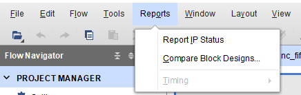
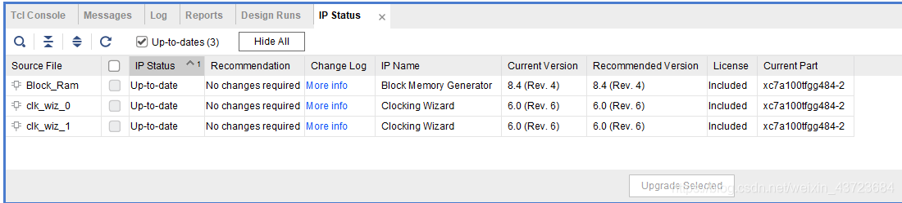
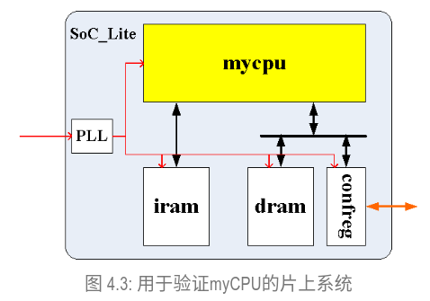

# C4 单周期CPU设计

## 目录

-   [1 验证5条指令的单周期CPU](#1-验证5条指令的单周期CPU)
    -   [1.1 快速上手](#11-快速上手)
        -   [1.1.1 获取实验开发环境](#111-获取实验开发环境)
        -   [1.1.2 实验代码](#112-实验代码)
            -   [1.1.2.1 填空minicpu\_env/miniCPU/minicpu\_top.v文件](#1121-填空minicpu_envminiCPUminicpu_topv文件)
            -   [1.1.2.2 LED——充当数据存储直观写](#1122-LED充当数据存储直观写)
            -   [1.1.2.3 顶层模块](#1123-顶层模块)
            -   [1.1.2.4 指令存储器coe文件](#1124-指令存储器coe文件)
        -   [1.1.3 新建Vivado工程集成CPU并仿真验证](#113-新建Vivado工程集成CPU并仿真验证)
            -   [1.1.3.1 仿真过程中遇到的问题](#1131-仿真过程中遇到的问题)
            -   [1.1.3.2 仿真结果](#1132-仿真结果)
        -   [1.1.4 上板验证](#114-上板验证)
            -   [1.1.4.1 约束文件](#1141-约束文件)
    -   [1.2 实验开发环境组织结构介绍](#12-实验开发环境组织结构介绍)
-   [2 验证20条指令的单周期CPU](#2-验证20条指令的单周期CPU)
    -   [2.1 实验开发环境组织结构介绍](#21-实验开发环境组织结构介绍)
        -   [2.1.1 SoC\_lite结构介绍](#211-SoC_lite结构介绍)
    -   [2.2 基于trace比对的调试框架](#22-基于trace比对的调试框架)
        -   [2.2.1 基于trace比对的调试辅助手段](#221-基于trace比对的调试辅助手段)
        -   [2.2.2 利用参考模型生成golden\_trace](#222-利用参考模型生成golden_trace)
        -   [2.2.3 使用 golden\_trace 监控 myCPU](#223-使用-golden_trace-监控-myCPU)
    -   [2.3 func功能测试程序](#23-func功能测试程序)
        -   [2.3.1 func测试程序说明](#231-func测试程序说明)

# 1 验证5条指令的单周期CPU

## 1.1 快速上手

### 1.1.1 获取实验开发环境

实验开发环境在`git clone gitee链接`所产生的cdp\_ede\_local目录下的minicpu\_env目录[^注释1]

### 1.1.2 实验代码

#### 1.1.2.1 填空minicpu\_env/miniCPU/minicpu\_top.v文件

```verilog
module minicpu_top (
    input wire clk,    //时钟信号
    input wire resetn, //复位信号,低电平有效——板载是低电平

    //指令存储器、数据存储器的写信号、地址信号、写数据信号、读数据信号
    output wire        inst_sram_we,     //指令存储器不需要写，设置为0
    output wire [31:0] inst_sram_addr,
    output wire [31:0] inst_sram_wdata,  //写数据可以是任意值
    input  wire [31:0] inst_sram_rdata,

    output wire        data_sram_we,
    output wire [31:0] data_sram_addr,
    output wire [31:0] data_sram_wdata,
    input  wire [31:0] data_sram_rdata
);

  reg valid;  //?valid是做什么的
  always @(posedge clk) begin  //同步复位
    if (!resetn) begin
      valid <= 1'b0;
    end else begin
      valid <= 1'b1;
    end
  end

  reg  [31:0] pc;  //当前指令的地址
  wire [31:0] nextpc;  //下一条指令的地址

  wire [31:0] inst;  //32位指令

  //这里也可以不需要译码直接比对
  wire [ 5:0] op_31_26;  //指令的26位到31位
  wire [ 3:0] op_25_22;  //指令的22位到25位
  wire [ 1:0] op_21_20;  //指令的20位到21位
  wire [ 4:0] op_19_15;  //指令的15位到19位
  wire [63:0] op_31_26_d;  //6-64译码
  wire [15:0] op_25_22_d;  //4-16译码
  wire [ 3:0] op_21_20_d;  //2-4译码
  wire [31:0] op_19_15_d;  //5-32译码
  wire [ 4:0] rd;  //目的寄存器编号
  wire [ 4:0] rj;  //源寄存器1编号
  wire [ 4:0] rk;  //源寄存器2编号
  wire [11:0] i12;  //指令中的12位立即数
  wire [15:0] i16;  //指令中的16位立即数

  wire        inst_add_w;  //是否是add_w指令
  wire        inst_addi_w;  //是否是addi_w指令
  wire        inst_ld_w;  //是否是ld_w指令
  wire        inst_st_w;  //是否是st_w指令
  wire        inst_bne;  //是否是bne指令

  wire        src2_is_imm;  //表示是否alu的第二个操作数是立即数
  wire        res_from_mem;  //表示是否结果是来自存储器——Load
  wire        gr_we;  //是否要写通用寄存器
  wire        mem_we;  //是否要写存储——st
  wire        src_reg_is_rd;  //rd位也是一个源寄存器
  wire [31:0] rj_value;  //寄存器编号rj读出的值
  wire [31:0] rkd_value;  //寄存器编号rk/rd读出的值

  wire [ 4:0] rf_raddr1;  //读寄存器地址1
  wire [ 4:0] rf_raddr2;  //读寄存器地址2
  wire [31:0] rf_wdata;  //写寄存器数据

  wire        br_taken;  //是否采用分支
  wire        rj_eq_rd;  //rj和rd读出的值是否相等
  wire [31:0] br_offs;  //分支偏移值
  wire [31:0] br_target;  //分支目标地址

  wire [31:0] imm;  //立即数
  wire [31:0] alu_src1;  //alu操作数1
  wire [31:0] alu_src2;  //alu操作数2
  wire [31:0] alu_result;  //alu运算结果


  always @(posedge clk) begin  //初始化以及迭代pc
    if (!resetn) begin
      pc <= 32'h1bfffffc;  //trick: to make nextpc be 0x1c000000 during reset 
    end else begin
      pc <= nextpc;
    end
  end

  assign inst_sram_we    = 1'b0;  //禁止写指令存储
  assign inst_sram_addr  = pc;  //读指令地址
  assign inst_sram_wdata = 32'b0;  //写指令存储值这里设置为0
  assign inst            = inst_sram_rdata;  //指令inst即为指令存储读出的值

  //对指令划分各个字段
  assign op_31_26        = inst[31:26];
  assign op_25_22        = inst[25:22];
  assign op_21_20        = inst[21:20];
  assign op_19_15        = inst[19:15];
  assign rd              = inst[4:0];
  assign rj              = inst[9:5];
  assign rk              = inst[14:10];
  assign i12             = inst[21:10];
  assign i16             = inst[25:10];

  //调用译码单元进行译码
  decoder_6_64 u_dec0 (
      .in(op_31_26),
      .co(op_31_26_d)
  );
  decoder_4_16 u_dec1 (
      .in(op_25_22),
      .co(op_25_22_d)
  );
  decoder_2_4 u_dec2 (
      .in(op_21_20),
      .co(op_21_20_d)
  );
  decoder_5_32 u_dec3 (
      .in(op_19_15),
      .co(op_19_15_d)
  );

  //ADDW 31-26值为0,25-22值为0,21-20是1,19-15是0 rj+rk->rd
  //ADDIW 31-26值为0,25-22值是10即十六进制a rj+立即数->rd
  //LDW 31-26值为10即a,25-22值为2 mem(rj+立即数)->rd
  //STW 31-26值为10即a,25-22值为6 rd->mem(rj+立即数)
  //BNE 31-26值为6'h17 rj!=rd->jump 

  assign inst_add_w = op_31_26_d[6'h00] & op_25_22_d[4'h0] & op_21_20_d[2'h1] & op_19_15_d[5'h00];
  assign inst_addi_w = op_31_26_d[6'h00] & op_25_22_d[4'ha];
  assign inst_ld_w = op_31_26_d[6'h0a] & op_25_22_d[4'h2];
  assign inst_st_w   = op_31_26_d[6'h0a] & op_25_22_d[4'h6]; //在这里实现inst_st_w指令的译码
  assign inst_bne = op_31_26_d[6'h17];

  assign src2_is_imm   = inst_addi_w | inst_ld_w | inst_st_w;  //实现立即数选择信号 ADDIW、LDW、STW的第二个操作数需要是立即数
  assign res_from_mem = inst_ld_w;  //实现寄存器结果的标识信号 只有LDW指令的寄存器结果是来自于存储器的
  assign gr_we = inst_add_w | inst_ld_w | inst_addi_w;  //写寄存器信号 ADD ADDIW LDW需要写寄存器
  assign mem_we = inst_st_w;  //写存储器信号 STW需要写存储器 
  assign src_reg_is_rd = inst_bne | inst_st_w;  //第二个源操作数来自于rd BNE,STW

  assign rf_raddr1 = rj;
  assign rf_raddr2 = src_reg_is_rd ? rd : rk;
  regfile u_regfile (
      .clk   (clk),
      .raddr1(rf_raddr1),  //补充读寄存器1编号地址
      .rdata1(rj_value),
      .raddr2(rf_raddr2),  //补充读寄存器2编号地址
      .rdata2(rkd_value),
      .we    (gr_we),
      .waddr (rd),         //写地址
      .wdata (rf_wdata)
  );  //在空出的括号里完成引脚匹配

  assign br_offs = {
    {14{i16[15]}}, i16, 2'b0
  };  //在这里完成br_offs信号的生成 低位补2位0再符号扩展 SignExtend({offs16, 2'b0}, 32)
  assign br_target = pc + br_offs;
  assign rj_eq_rd = (rj_value == rkd_value);
  assign br_taken = valid && inst_bne && !rj_eq_rd;  //valid的作用，只有复位无效时才执行跳转
  assign nextpc = br_taken ? br_target : pc + 4;  //在这里实现nextpc信号的生成

  assign imm = {{20{i12[11]}}, i12[11:0]};  //SignExtend(si12, 32)
  assign alu_src1 = rj_value;
  assign alu_src2 = src2_is_imm ? imm : rkd_value;  //在这里实现alu_src2信号

  assign alu_result = alu_src1 + alu_src2;  //这5条指令，除BNE外都使用加法

  assign data_sram_we = mem_we;
  assign data_sram_addr = alu_result;  //访存地址是通过alu计算得到的
  assign data_sram_wdata = rkd_value;  //写存存储器的LDW是将rd写入存储

  assign rf_wdata = res_from_mem ? data_sram_rdata : alu_result;//在这里完成写回寄存器值的选择

endmodule

```

#### 1.1.2.2 LED——充当数据存储直观写

```verilog
//该CPU没有设置数据存储器，对于CPU所发出的写存储器指令STW，所采取的直观做法是将写数据写到LED灯上——当CPU发出写信号且写地址是1028时表示写数据到LED
//因此conf_wdata是来自于CPU的写存储器数据,conf_we是来自于CPU的写信号且给定写地址是十进制的1028,clk,resetn也都与CPU的clk，resetn相同
module confreg (
    input  wire        clk,
    input  wire        resetn,
    input  wire        conf_we,
    input  wire [31:0] conf_wdata,
    output wire [15:0] led
);

  reg [31:0] led_data;

  wire write_led = conf_we;
  assign led = led_data[15:0];
  always @(posedge clk) begin
    if (!resetn) begin
      led_data <= 32'h0;
    end else if (write_led) begin
      led_data <= conf_wdata[31:0];
    end
  end

endmodule

```

#### 1.1.2.3 顶层模块

```verilog
//*************************************************************************
//   > File Name   : soc_mini_top.v
//   > Description : SoC, included cpu, 
//                   inst ram, confreg
// 
//           -------------------------
//           |           cpu         |
//           -------------------------
//         inst|                  | data
//             |                  | 
//             |                  |           
//             |                  |           
//      -------------         -----------
//      | inst ram  |         | confreg |
//      -------------         -----------
//
//   > Author      : LOONGSON
//   > Date        : 2017-08-04
//*************************************************************************

`default_nettype none

//for simulation:
//1. if define SIMU_USE_PLL = 1, will use clk_pll to generate cpu_clk,
//   and simulation will be very slow.
//2. usually, please define SIMU_USE_PLL=0 to speed up simulation by assign
//   cpu_clk = clk.
//   at this time, cpu_clk frequency are both 100MHz, same as clk.

`define SIMU_USE_PLL 0 //set 0 to speed up simulation

module soc_mini_top #(
    parameter SIMULATION = 1'b0) (
    input wire resetn,
    input wire clk,

    input wire [7 : 0] switch,  //输入 低位8个开关
    output wire [15:0] led  //输出  低位16个LED灯
);

  //clk and resetn 为了方便上板 使用clk_pll生产cpu时钟以及使用cpu时钟去同步复位信号
  wire cpu_clk;
  reg  cpu_resetn;
  always @(posedge cpu_clk) begin
    cpu_resetn <= resetn;
  end
  generate
    if (SIMULATION && `SIMU_USE_PLL == 0) begin : speedup_simulation
      assign cpu_clk = clk;
    end else begin : pll
      clk_pll clk_pll (
          .clk_in1  (clk),
          .cpu_clk  (cpu_clk),
          .timer_clk()
      );
    end
  endgenerate

  //cpu inst sram
  wire        cpu_inst_we;
  wire [31:0] cpu_inst_addr;
  wire [31:0] cpu_inst_wdata;
  wire [31:0] cpu_inst_rdata;
  //cpu data sram
  wire        cpu_data_we;
  wire [31:0] cpu_data_addr;
  wire [31:0] cpu_data_wdata;
  wire [31:0] cpu_data_rdata;

  //data sram   这里并没有用到
  wire        data_sram_en;
  wire        data_sram_we;
  wire [31:0] data_sram_addr;
  wire [31:0] data_sram_wdata;
  wire [31:0] data_sram_rdata;

  //conf
  wire        conf_en;
  wire        conf_we;
  wire [31:0] conf_addr;
  wire [31:0] conf_wdata;
  wire [31:0] conf_rdata;
  wire [15:0] conf_led;

  //cpu
  minicpu_top cpu (
      .clk   (cpu_clk),
      .resetn(cpu_resetn),

      .inst_sram_we   (cpu_inst_we),
      .inst_sram_addr (cpu_inst_addr),
      .inst_sram_wdata(cpu_inst_wdata),
      .inst_sram_rdata(cpu_inst_rdata),

      .data_sram_we   (cpu_data_we),
      .data_sram_addr (cpu_data_addr),
      .data_sram_wdata(cpu_data_wdata),
      .data_sram_rdata(cpu_data_rdata)
  );

  assign cpu_data_rdata = (cpu_data_addr == 12'd1024) ? {24'b0, ~switch[7:0]} : 32'b0;//如果读存储地址是十进制的1024，那么就读开关数据（拨上是低电平，拨下是高电平），否则读0

  //inst ram
  inst_ram inst_ram (
      .clk(cpu_clk),
      .we (cpu_inst_we),
      .a  (cpu_inst_addr[17:2]),  //取指地址是2~17位
      .d  (cpu_inst_wdata),
      .spo(cpu_inst_rdata)
  );

  //confreg
  confreg u_confreg (
      .clk       (cpu_clk),
      .resetn    (cpu_resetn),
      .conf_we   (conf_we),
      .conf_wdata(conf_wdata),
      .led       (conf_led)
  );

  assign conf_we    = cpu_data_we && cpu_data_addr == 12'd1028;
  assign conf_wdata = cpu_data_wdata;

  assign led = ~conf_led;//led灯高电平是灭，低电平是亮

endmodule

```

#### 1.1.2.4 指令存储器coe文件

```6502&#x20;assembly
0:0280000c //addi.w $t0,$zero,0x0 
1:0280040d //addi.w $t1,$zero,0x1
2:02800017 //addi.w $s0,$zero,0x0
3:02800418 //addi.w $s1,$zero,0x1
4:28900004 //ld.w $a0,$zero,1024
loop:
5:0010358e //add.w $t2.$t0,$t1
6:028001ac //addi.w $t0,$t1,0x0
7:028001cd //addi.w $t1,$t2,0x0
8:001062f7 //add.w $s0,$s0,$s1
9:5ffff2e4 //bne $s0,Sa0,loop 11 f f f 00  9-4=5
10:2990100e //st.w $t2,$zero,1028 00 00 00      
end:  
11:5c000300 //bne $s1,$zero,end $s1!=0->pc+0 死循环
```

### 1.1.3 新建Vivado工程集成CPU并仿真验证

这里需要采用运行rtl文件的方法，将vivado项目建立在`minicpu_env/soc_verify/run_vivado/ `目录下。根据rtl文件创建Vivado的方法见利用tcl创建Vivado工程

#### 1.1.3.1 仿真过程中遇到的问题

1.  clk\_pll IP 被上锁导致`Run Sumlation`出现Module \<clk\_pll> not found while processing module instance \<pll.clk\_pll>

    解决方法：
    1.  点击Report–>Report IP Status

        
    2.  勾选被锁的IP核，点击Upgrade Selected

        

        如果upgrade Selected无法点击时，在`Tcl Console`执行命令：`upgrade_ip [get_ips]`

        若过程中提示
        ```bash
         [Common 17-69] Command failed: No IP specified.  Please specify IP with 'objects'

        ```
        原因是项目路径中存在中文，修改为英文即可解决
2.  未安装gcc /usr/bin/gcc not found, please install GCC for your Linux distribution

    安装gcc/g++/gdb/make 等基本编程工具`sudo apt-get install build-essential `
3.  注意在测试文件中写的是#2000ns时 resetn才为高电平，因此需要将仿真时间设置的较长些
    ```bash
    initial
    begin
        clk = 1'b0;
        resetn = 1'b0;
        #2000;
        resetn = 1'b1;
    end
    ```

#### 1.1.3.2 仿真结果

汇编语言所做的工作是设置n，循环求斐波那契0,1,2,3,5,8 ` F(n)=F(n-1)+F(n-2)`

```6502&#x20;assembly
0+1=1
0+1+1=2
0+1 0+1+1=3
0+1+1 0+1+1+1=5
0+1+1+1 0+1+1+1+1+1=8

```

### 1.1.4 上板验证

#### 1.1.4.1 约束文件

用到了8个开关、16个LED、时钟以及复位键

```text
#set_property SEVERITY {Warning} [get_drc_checks RTSTAT-2]
#时钟信号连接
set_property PACKAGE_PIN AC19 [get_ports clk]
set_property CLOCK_DEDICATED_ROUTE BACKBONE [get_nets clk]
create_clock -period 10.000 -name clk -waveform {0.000 5.000} [get_ports clk]

#reset
set_property PACKAGE_PIN Y3 [get_ports resetn]


#LED
set_property PACKAGE_PIN K23 [get_ports {led[0]}]
set_property PACKAGE_PIN J21 [get_ports {led[1]}]
set_property PACKAGE_PIN H23 [get_ports {led[2]}]
set_property PACKAGE_PIN J19 [get_ports {led[3]}]
set_property PACKAGE_PIN G9 [get_ports {led[4]}]
set_property PACKAGE_PIN J26 [get_ports {led[5]}]
set_property PACKAGE_PIN J23 [get_ports {led[6]}]
set_property PACKAGE_PIN J8 [get_ports {led[7]}]
set_property PACKAGE_PIN H8 [get_ports {led[8]}]
set_property PACKAGE_PIN G8 [get_ports {led[9]}]
set_property PACKAGE_PIN F7 [get_ports {led[10]}]
set_property PACKAGE_PIN A4 [get_ports {led[11]}]
set_property PACKAGE_PIN A5 [get_ports {led[12]}]
set_property PACKAGE_PIN A3 [get_ports {led[13]}]
set_property PACKAGE_PIN D5 [get_ports {led[14]}]
set_property PACKAGE_PIN H7 [get_ports {led[15]}]

#switch
set_property PACKAGE_PIN AC21 [get_ports {switch[7]}]
set_property PACKAGE_PIN AD24 [get_ports {switch[6]}]
set_property PACKAGE_PIN AC22 [get_ports {switch[5]}]
set_property PACKAGE_PIN AC23 [get_ports {switch[4]}]
set_property PACKAGE_PIN AB6  [get_ports {switch[3]}]
set_property PACKAGE_PIN W6   [get_ports {switch[2]}]
set_property PACKAGE_PIN AA7  [get_ports {switch[1]}]
set_property PACKAGE_PIN Y6   [get_ports {switch[0]}]

set_property IOSTANDARD LVCMOS33 [get_ports clk]
set_property IOSTANDARD LVCMOS33 [get_ports resetn]
set_property IOSTANDARD LVCMOS33 [get_ports {led[*]}]
set_property IOSTANDARD LVCMOS33 [get_ports {switch[*]}]

set_false_path -from [get_clocks -of_objects [get_pins pll.clk_pll/inst/plle2_adv_inst/CLKOUT1]] -to [get_clocks -of_objects [get_pins pll.clk_pll/inst/plle2_adv_inst/CLKOUT0]]
set_false_path -from [get_clocks -of_objects [get_pins pll.clk_pll/inst/plle2_adv_inst/CLKOUT0]] -to [get_clocks -of_objects [get_pins pll.clk_pll/inst/plle2_adv_inst/CLKOUT1]]

```

上板验证时需要拨动开关以后，按动复位键即可看到LED灯所显示的结果

## 1.2 实验开发环境组织结构介绍

```bash
.
├── func #功能验证测试程序
│   ├── inst_ram.coe #指令存储器内内容 测试程序的机器指令
│   └── inst_ram.txt #测试程序机器指令所对应的汇编代码
├── miniCPU #所实现的CPU的RTL代码
│   ├── minicpu_top.v #5条指令的单周期CPU顶层模块
│   ├── regfile.v #寄存器文件模块
│   └── tools.v #工具模块，包括译码器、编码器
└── soc_verify #所实现的CPU的验证环境
    ├── rtl #SOC RTL目录
    │   ├── CONFREG 
    │   │   └── confreg.v #LED灯、开关模块，充当SOC的数据MEM
    │   ├── soc_mini_top.v #soc顶层模块
    │   └── xilinx_ip #定制的Xilinx IP
    │       ├── clk_pll #时钟IP
    │       └── inst_ram #指令存储器IP
    ├── run_vivado #Vivado项目运行目录
    │   ├── constraints #约束文件
    │   │   └── soc_mini_top.xdc
    │   ├── create_project.tcl #利用该tcl创建项目
    │   └── project #项目目录
    │       ├── ip_upgrade.log
    │       ├── loongson.cache
    │       ├── loongson.hw
    │       ├── loongson.ip_user_files
    │       ├── loongson.runs
    │       ├── loongson.sim 
    │       └── loongson.xpr
    └── testbench #仿真测试文件
        └── mycpu_tb.v

```


一般会构建一个SOC对CPU进行功能验证

左图即为验证miniCPU的功能所构建的SoC\_Mini，miniCPU与指令RAM `inst_ram`进行交互完成取指，与`confreg`进行交互完成外设的访问

此外由于实验箱所提供的时钟的主频是100MHz，如果直接用这个时钟作为SoC\_Mini中各个模块的时钟，则意味着miniCPU至少要能达到100MHz的主频。这对于初学者来说这可能是个比较严格的要求，因此构建一个PLL ip，将时钟降频输出

# 2 验证20条指令的单周期CPU

## 2.1 实验开发环境组织结构介绍

验证20条指令的单周期CPU的实验开发环境位于Git项目的`mucpu_env`目录下，该目录部分结构如下：

```bash
|--gettrace/                生成参考trace的部分。
|  |--src/                  设计代码目录。
|  |  |--tb_top.v           仿真顶层，该模块会抓取debug信息生成到golden_trace.txt中。
|  |  |--soc_lite_top.v     SoC_Lite的顶层文件。
|  |  |--refCPU/            产生比对trace的参考处理器核设计。
|  |  |--CONFREG/           confreg模块，用于访问CPU与开发板上数码管、拨码开关等外设。
|  |  |--BRIDGE/            1×2的桥接模块，CPU的data sram接口同时访问confreg和data_ram。
|  |--gettrace.xpr          Vivado工程文件。
|  |--golden_trace.txt      运行func测试程序所生成的参考trace。需自行生成。
|
|--func/                    实验任务所用的功能验证测试程序。
|  |--include/              功能验证测试程序共享的头文件所在目录。
|  |  |--sysdep.h           一些GCC通用的宏定义的头文件。
|  |  |--asm.h              LoongArch汇编需用到的一些宏定义的头文件，比如LEAF(x)。
|  |  |--regdef.h           LoongArch32 ABI下，32个通用寄存器的汇编助记定义。
|  |  |--cpu_cde.h          SoC_Lite相关参数的宏定义，如访问数码管的confreg的基址。
|  |  |--inst_test.h        各功能测试点的验证程序使用的宏定义头文件
|  |--inst/                 各功能测试点的汇编程序文件。
|  |  |--Makefile           子目录里的Makefile，会被上一级目录中的Makefile调用。
|  |  |--n*.S               各功能测试点的验证程序，汇编语言编写。
|  |--obj/                  功能验证测试程序编译结果存放目录
|  |  |--*                  详见后面小节的说明。
|  |--start.S               功能验证测试的引导代码及主函数。
|  |--Makefile              编译功能验证测试程序的Makefile脚本
|  |--bin.lds               编译bin.lds.S得到的结果，可被make reset命令清除
|  |--convert.c             生成coe和mif文件的处理工具的C程序源码
|
|--myCPU/                   自己实现的CPU的RTL代码。
|
|--soc_verify/              自己实现的CPU的SoC系统验证环境
   |--soc_dram/             CPU对外连接distributed RAM接口时对应的验证环境。
   |  |--rtl/               SoC_Lite设计代码目录。
   |  |  |--soc_lite_top.v  SoC_Lite的顶层文件。
   |  |  |--CONFREG/        confreg模块，用于访问CPU与开发板上数码管、拨码开关等外设。
   |  |  |--BRIDGE/         1×2的桥接模块， CPU的data sram接口同时访问confreg和data_ram。
   |  |  |--xilinx_ip/      定制的Xilinx IP，包含clk_pll、inst_ram、data_ram。
   |  |--testbench/         功能仿真验证平台。
   |  |  |--mycpu_tb.v      功能仿真顶层，该模块会抓取debug信息与golden_trace.txt进行比对。
   |  |--run_vivado/        Vivado工程的运行目录。
   |     |--constraints/    Vivado工程设计的约束。
   |     |--mycpu_dram_prj/ Vivado工程文件所在目录。

```

整个mycpu\_env所涉及到的内容会在后续实验中慢慢接触到

所关注的主要是mycpu子目录和soc\_verify目录

### 2.1.1 SoC\_lite结构介绍

SoC\_lite内部结构如下：



相比之前的SoC\_mini，SoC\_lite多了数据存储器以及mycpu与数据存储器、confreg之间的通信部件

数据存储器在[C3](https://www.wolai.com/aurora_420/aqHjmoXp8UX8wMcqRb9df#4oUAdDtGwZhbEd45Kbvvew "C3")已实现过，与mycpu的交互关系也类似于指令存储器，只不过多了写功能

mycpu与数据存储器、confreg之间的通信部件的存在是因为LA 架构下，所有I/O设备的寄存器都是采用memory mapped方式访问的[^注释2]。`Memory mapped`方式意味着CPU是通过LD、ST指令来对GPIO进行访问，只不过GPIO和数据存储器使用不同的地址空间

## 2.2 基于trace比对的调试框架

为了更方便地对CPU进行调试，Loongson提供了一套基于Trace比对的调试辅助手段。本节主要是介绍这种调试手段

### 2.2.1 基于trace比对的调试辅助手段

基于Trace的调试方式借鉴的是调试高级语言程序所使用的“单步调试”手段

其具体实现方式是：先用一个已知的功能上是正确的CPU运行一遍测试指令序列，将每条指令的PC和写寄存器的信息记录下，记为`golden_trace`[^注释3]；然后在验证myCPU的时候运行相同的指令序列，在myCPU每条指令写寄存器的时候，将myCPU中的PC和写寄存器的信息同之前的golden\_trace进行比对，如果不一样，那么立刻报错并停止仿真

分支指令执行错误识别：错误路径上第一条写寄存器的指令的PC就和golden\_trace不同

store执行错误识别：写的数据在之后load时即识别到错误

### 2.2.2 利用参考模型生成golden\_trace

参考模型的工作目录是`/mycpu_env-gettrace/`，其结构如下：

```bash
.
├── gettrace.xpr
├── Makefile
├── README
└── src
    ├── BRIDGE
    │   └── bridge_1x2.v
    ├── CONFREG
    │   └── confreg.v
    ├── myCPU
    │   └── SimpleLACoreWrapRAM.v
    ├── soc_lite_top.v
    └── tb_top.v

```

gettrace下是一个成熟的Vivado项目，打开gettrace.xpr文件即可打开该项目。项目已经实现了一个功能完备且架构类似于SoC\_lite的片上系统。仿真文件为tb\_top.v，运行会生成golden\_trace文件，与抓取golden\_trace相关的重要代码如下：

```verilog
  ......
  `define TRACE_REF_FILE "../../../../golden_trace.txt"  //参考trace的存放目录 tb_top是在.sim/sim_1/behav/xsim/下运行，保存的话是保存到.sim同级
  `define END_PC 32'h1c000100           //func测试完成后会32'h1c000100处死循环
  ......
  assign debug_wb_pc        = soc_lite.debug_wb_pc;//写寄存器堆pc
  assign debug_wb_rf_wen     = soc_lite.debug_wb_rf_wen;//是否写寄存器——4位信号，分别是写8位、16位、24位和32位
  assign debug_wb_rf_wnum   = soc_lite.debug_wb_rf_wnum;//写寄存器编号
  assign debug_wb_rf_wdata  = soc_lite.debug_wb_rf_wdata;//写寄存器
  
  //wdata[i*8+7 : i*8] is valid, only wehile wen[i] is valid
  wire [31:0] debug_wb_rf_wdata_v;
  assign debug_wb_rf_wdata_v[31:24] = debug_wb_rf_wdata[31:24] & {8{debug_wb_rf_wen[3]}};
  assign debug_wb_rf_wdata_v[23:16] = debug_wb_rf_wdata[23:16] & {8{debug_wb_rf_wen[2]}};
  assign debug_wb_rf_wdata_v[15: 8] = debug_wb_rf_wdata[15: 8] & {8{debug_wb_rf_wen[1]}};
  assign debug_wb_rf_wdata_v[7 : 0] = debug_wb_rf_wdata[7 : 0] & {8{debug_wb_rf_wen[0]}};
  // 打开godlen_trace文件
  integer trace_ref;
  initial begin
      trace_ref = $fopen(`TRACE_REF_FILE, "w");   //使用$fopen 打开trace文件
  end

  // 记录trace
  always @(posedge soc_clk)
  begin
      if(|debug_wb_rf_wen && debug_wb_rf_wnum!=5'd0)    //trace采样时机：需要写寄存器且不是写0号寄存器，那么写trace
      begin
          $fdisplay(trace_ref, "%h %h %h %h" , `CONFREG_OPEN_TRACE ,
              debug_wb_pc, debug_wb_rf_wnum, debug_wb_rf_wdata_v); //写PC、编号、数据
      end
  end
  ......
```

### 2.2.3 使用 golden\_trace 监控 myCPU

myCPU功能验证所使用的 testbench与 gettrace 工程中的testbench 有所不同，见 mycpu\_verify/soc\_verify/soc\_XXX/testbench/mycpu\_tb.v，重点部分代码如下

```verilog
  ......
  `define TRACE_REF_FILE "../../../../../../../gettrace/golden_trace.txt"//参考trace的存放目录
  `define CONFREG_NUM_REG soc_lite.u_confreg.num_data  //confreg中数码管寄存器的数据
  `define END_PC 32'h1c000100                        //func测试完成后会在32'h1c000100处死循环
  ......
  assign debug_wb_pc          = soc_lite.debug_wb_pc;
  assign debug_wb_rf_we       = soc_lite.debug_wb_rf_we;
  assign debug_wb_rf_wnum     = soc_lite.debug_wb_rf_wnum;
  assign debug_wb_rf_wdata    = soc_lite.debug_wb_rf_wdata;
  ......
  //在下降沿读取golden_trace结果
  reg [31:0] ref_wb_pc;
  reg [4 :0] ref_wb_rf_wnum;
  reg [31:0] ref_wb_rf_wdata_v;
  always @(negedge soc_clk)             //下降沿读取参考trace
  begin //复位时debug_end为0直到test_end时，debug_end才为1
      //wire test_end = (debug_wb_pc==`END_PC) || (uart_display && uart_data==8'hff);
      if(|debug_wb_rf_we && debug_wb_rf_wnum!=5'd0 && !debug_end && `CONFREG_OPEN_TRACE)
      //读取trace时机与采样时机相同
      begin
          $fscanf(trace_ref, "%h %h %h %h" , trace_cmp_flag ,
                  ref_wb_pc, ref_wb_rf_wnum, ref_wb_rf_wdata); //读取参考trace信号
      end
  end

  //在上升沿将debug与ref比较
  always @(posedge soc_clk)                 //上升沿将debug信号与trace信号对比
  begin
      if(!resetn)
      begin
          debug_wb_err <= 1'b0;
      end
      else if(|debug_wb_rf_we && debug_wb_rf_wnum!=5'd0 && !debug_end && `CONFREG_OPEN_TRACE)
      //对比时机与采样时机相同
      begin
          if (  (debug_wb_pc!==ref_wb_pc) || (debug_wb_rf_wnum!==ref_wb_rf_wnum)
              ||(debug_wb_rf_wdata_v!==ref_wb_rf_wdata_v) )    //对比时机与采样时机相同
          begin
              $display("--------------------------------------------------------------");
              $display("[%t] Error!!!",$time);
              $display("    reference: PC = 0x%8h, wb_rf_wnum = 0x%2h, wb_rf_wdata = 0x%8h",
                        ref_wb_pc, ref_wb_rf_wnum, ref_wb_rf_wdata_v);
              $display("    mycpu    : PC = 0x%8h, wb_rf_wnum = 0x%2h, wb_rf_wdata = 0x%8h",
                        debug_wb_pc, debug_wb_rf_wnum, debug_wb_rf_wdata_v);
              $display("--------------------------------------------------------------");
              debug_wb_err <= 1'b1;         //标记出错
              #40;
              $finish;              //对比出错，则结束仿真
          end
      end
  end
  ......
  //monitor test
  initial
  begin
      $timeformat(-9,0," ns",10);
      while(!resetn) #5;
    $display("==============================================================");
      $display("Test begin!");
      while(`CONFREG_NUM_MONITOR)
      begin
          #10000;        //每隔10000ns，打印一次写回级PC，帮助判断CPU是否死机或死循环
          $display ("        [%t] Test is running, debug_wb_pc = 0x%8h", debug_wb_pc);
      end
  end
  
  //test end
  wire global_err = debug_wb_err || (err_count!=8'd0);
  always @(posedge soc_clk)
  begin
      if (!resetn)
      begin
          debug_end <= 1'b0;
      end
      else if(debug_wb_pc==`END_PC && !debug_end)
      begin
          debug_end <= 1'b1;
        $display("==============================================================");
        $display("Test end!");
        $fclose(trace_ref);
        #40;
          if (global_err)
          begin
              $display("Fail!!!Total %d errors!",err_count);    //全局出错，打印Fail
          end
          else
          begin
              $display("----PASS!!!");                  //全局无错，打印PASS.
          end
        $finish;
    end
  end
  ......

```

## 2.3 func功能测试程序

`mycpu_env/func/ `目录下的内容比之前`minicpu_env/func/`目录下的增加了许多。这里对新的func程序做一些简要说明

### 2.3.1 func测试程序说明

func程序分为func/start.S和func/inst/ \*.S，都是LoongArch32汇编程序:

1.  func/start.S ：主函数，执行必要的启动初始化后调用func/inst/下的各汇编程序

    主函数func/start.S的主体部分代码如下：
2.  func/inst/ \*.S ：针对每条指令或功能点有一个汇编测试程序
3.  func/include/ \*.h ：测试程序的配置信息和宏定义

[^注释1]: cdp\_ede\_local/minicpu\_env

[^注释2]: 统一编址

[^注释3]: golden\_trace记录的是写寄存器指令的PC和写的是哪个寄存器以及写的值
