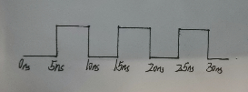
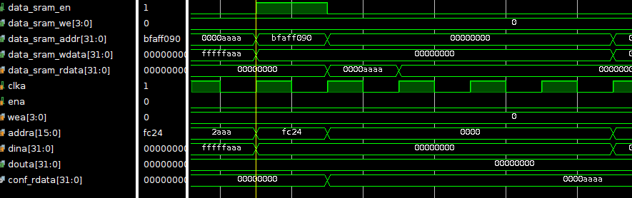
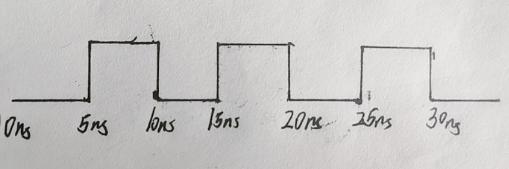
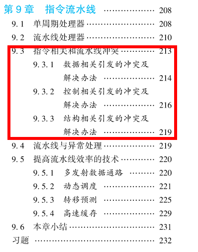

# C5 LA简单流水线CPU设计

## 目录

-   [1 不考虑相关冲突的流水线CPU设计](#1-不考虑相关冲突的流水线CPU设计)
    -   [1.1 添加流水级间缓存](#11-添加流水级间缓存)
        -   [1.1.1 流水线的划分](#111-流水线的划分)
        -   [1.1.2 流水线触发器中存放的内容](#112-流水线触发器中存放的内容)
    -   [1.2 同步读RAM BRAM的引入](#12-同步读RAM-BRAM的引入)
        -   [1.2.1 BRAM和DRAM的时序特性的不同](#121-BRAM和DRAM的时序特性的不同)
        -   [1.2.2 两种不是很好的调整方法](#122-两种不是很好的调整方法)
        -   [1.2.3 最后采用的方法——将指令RAM的访问分布到流水线中的连续两个极端](#123-最后采用的方法将指令RAM的访问分布到流水线中的连续两个极端)
    -   [1.3 调整更新PC的数据通路](#13-调整更新PC的数据通路)
        -   [1.3.1 调整转移指令更新PC的数据通路](#131-调整转移指令更新PC的数据通路)
        -   [1.3.2 调整复位更新PC的数据通路](#132-调整复位更新PC的数据通路)
    -   [1.4 不考虑相关冲突情况下流水线控制信号的设计](#14-不考虑相关冲突情况下流水线控制信号的设计)
    -   [1.5 复位的处理](#15-复位的处理)
    -   [1.6 20条用户态整数指令的流水MC CPU实现](#16-20条用户态整数指令的流水MC-CPU实现)
        -   [1.6.1 if\_stage](#161-if_stage)
        -   [1.6.2 id\_stage](#162-id_stage)
        -   [1.6.3 exe\_stage](#163-exe_stage)
        -   [1.6.4 mem\_stage](#164-mem_stage)
        -   [1.6.5 wb\_stage](#165-wb_stage)
        -   [1.6.6 mycpu\_top](#166-mycpu_top)
        -   [1.6.7 mycpu.h宏定义头文件](#167-mycpuh宏定义头文件)
    -   [1.7 注意事项](#17-注意事项)
-   [2 指令相关与流水线冲突](#2-指令相关与流水线冲突)
    -   [2.1 解决RAW寄存器数据相关导致的流水线冲突](#21-解决RAW寄存器数据相关导致的流水线冲突)
    -   [2.2 解决转移指令控制相关导致的流水线冲突](#22-解决转移指令控制相关导致的流水线冲突)
    -   [2.3 阻塞解决20条用户态整数指令指令冲突的CPU](#23-阻塞解决20条用户态整数指令指令冲突的CPU)
        -   [2.3.1 if\_stage](#231-if_stage)
        -   [2.3.2 id\_stage](#232-id_stage)
        -   [2.3.3 exe\_stage](#233-exe_stage)
        -   [2.3.4 mem\_stage](#234-mem_stage)
        -   [2.3.5 wb\_stage](#235-wb_stage)
        -   [2.3.6 mycpu\_top](#236-mycpu_top)
        -   [2.3.7 mycpu.h](#237-mycpuh)
-   [3 流水线数据前递设计](#3-流水线数据前递设计)
    -   [3.1 前递的数据通路设计](#31-前递的数据通路设计)
        -   [3.1.1 前递途径设计](#311-前递途径设计)
    -   [3.2 前递的流水线控制信号调整](#32-前递的流水线控制信号调整)
    -   [3.3 前递引发的主频下降](#33-前递引发的主频下降)
    -   [3.4 前递解决20条用户态整数指令指令冲突CPU](#34-前递解决20条用户态整数指令指令冲突CPU)
        -   [3.4.1 id\_stage](#341-id_stage)
        -   [3.4.2 exe\_stage](#342-exe_stage)
        -   [3.4.3 mycpu.h](#343-mycpuh)

本章将简单流水线CPU的设计工作分解成三个逐级调节的小任务：

1.  在20条指令的单周期CPU的基础上引入流水线，但是暂时不考虑处理各类相关所引发的冲突
2.  介绍流水线中的各类相关所引发的冲突，并给出阻塞方式解决冲突的设计方案
3.  介绍流水线前递技术，并基于第二阶段的CPU实现进行设计和调整

## 1 不考虑相关冲突的流水线CPU设计

在第一节只需要解决两个设计问题：

1.  把单周期的数据通路切分成多个阶段
2.  让每个阶段流动——理想情况下，流水线每一级都有指令且每个时钟周期都能处理完一条指令

### 1.1 添加流水级间缓存

> 📌流水线电路的一般性设计：
>
> 将电路流水线化的初衷是缩短时序器件之间组合逻辑关键路径的时延，在不降低电路处理吞吐率的情况下提升电路的时钟频 率。从电路设计最终的实现形式来看，是将一段组合逻辑按照功能划分为若干阶段，在各功能阶 段的组合逻辑之间插入时序器件（通常是触发器），前一阶段的组合逻辑输出接入时序器件的输入，后一阶段的组合逻辑输入来自这些时序器件的输出

#### 1.1.1 流水线的划分

直接采用经典的单发射五级流水线划分，即IF、ID、EXE、MEM、WB

IF：将指令取回

ID：解析指令生成控制信号并读取通用寄存器堆生成源操作数

EXE：对源操作数进行算术逻辑类指令的运算或者访存指令的 地址计算

MEM：取回访存的结果

WB：将结果写入通用寄存 器堆

> 对于所插入的触发器的命令一般是以两个流水级的名字来标识，如取指和译码阶段之间的触发器记作“IF\_IDreg”。但是为了编码的整洁，LA将触发器归到它的输出对应的那一个流水线阶段，因此“IF\_IDreg”称为“IDreg”

> 📌**reg的输出直接连接至下一个阶段处理的组合逻辑，而上一个阶段处理的组合逻辑的输入需要一个clk上沿才能更新至reg**

#### 1.1.2 流水线触发器中存放的内容

流水线触发器中存放的内容分为“控制内容”和“数据内容”

-   控制内容
    1.  表示控制内容是否有效的valid位，高有效
    2.
-   数据内容

    单周期CPU中原有的信号线（控制+数据）——从信号产生的流水线阶段开始到使用它的流水线阶段，如果被哪一级流水线寄存器插入，那么该级流水线寄存器中包含该信号

### 1.2 同步读RAM BRAM的引入

#### 1.2.1 BRAM和DRAM的时序特性的不同

BRAM一次读操作需要两个时钟周期：第一个时钟周期向 RAM 发出读使能和读地址，第二个时钟周期 RAM 才能返回读结果

DRAM一次读操作只需要一个时钟周期

> 📌BRAM在第一个时钟上升沿给定地址，第二个时钟上沿给出读结果——时序逻辑
>
> DRAM在第一个时钟上升沿给定地址的同时也拿到了数据——组合逻辑

#### 1.2.2 两种不是很好的调整方法

1.  将IF设计为占用两个时钟周期，第一个周期发送读使能和读地址，第二个周期获取RAM返回数据后再进入ID

    但是这种方法会使得最理想的CPI是2，而不是1
2.  流水线寄存器采用时钟上升沿触发，insRAM采用时钟下降沿触发

    这种方法也是我在flop实现中使用的，但是这里了解到在同一个设计中使用同一个时钟的上升沿和下降沿会使得最后实现的电路频率大幅度下降[^注释1]——其实这个在exp11\~12中测试rdcntvl指令时已经看到了比gettrace慢一些

#### 1.2.3 最后采用的方法——将指令RAM的访问分布到流水线中的连续两个极端

在否定了两种不是很好的调整方法，考虑将指令RAM 的访问分布到流水线中连续的两个阶段，这样既能满足同步读RAM的时序特性，也能达到每周期处理一条指令的吞吐率理论峰值

那么在不增加流水级数的情况下，只有两种设计方案：

-   将指令RAM的读请求发起放在取指阶段，这样指令RAM的输出是在指令位于译码阶段时完成的

    在IF、ID中用了一个触发器缓冲IDreg，insRAM的读数据直接接ID，不经过IDreg从而解决（我在flop设计中是直接将insRAM的数据接到IDreg）

    

    5ns时IFreg更新，进入指令i的取指阶段，进行指令RAM的读请求；
    15ns时指令i的PC更新到IDreg，此时inst直接相连到ID的组合逻辑，不经过IDreg
-   在“更新PC的阶段preIF”发起指令RAM的读请求（以nextpc为指令RAM的读地址，nextpc需要一个clk才到pc）

    这样是insRAM的读数据接到IDreg

    

    nextPC是组合逻辑产生，在5ns时根据上一条指令的某些数据产生
    15ns时，nextPC更新至IFreg，此时inst已读出对应的数据
    25ns时，连同inst更新IDreg
    > 📌prePC并不是一个流水线阶段，自身并不包含流水线触发器，它由IF、ID等的流水级缓存输入，输出nextPC，即preIF生成nextPC，IF采用一个流水线触发器更新PC

至于这两种方法的选择，一般根据所采用的方式：

1.  采用ASIC，第二种方式更好[^注释2]
2.  采用FPGA，第一种方式更好

但是一般采用第二种方法，因为第一种方法是采用instRAM读出的数据直接与ID的组合逻辑相连，当译码阶段的指令因为阻塞需要持续多拍时，如何维护 RAM 读出的指令不变是一 个令人头疼的问题[^注释3]

数据RAM的访存也同指令RAM，但是因为不存在preIF，因此是在EXE阶段发出数据RAM的读请求或者写请求，读数据在MEM阶段得到——mem段直接相连



### 1.3 调整更新PC的数据通路

#### 1.3.1 调整转移指令更新PC的数据通路

因为转移指令（无条件转移和有条件转移）的正确跳转方向和目标在ID即可根据指令码和寄存器数据以及译码阶段PC计算得到，因此将跳转指令修改PC的时机安排在译码阶段

#### 1.3.2 调整复位更新PC的数据通路

所采用的同步instRAM的读是在preIF阶段根据nextPC发出请求，因此一个小技巧是将复位后的pc更新为0x1bfffffc，从而使得第一个发出取指请求的地址是0x1c000000

### 1.4 不考虑相关冲突情况下流水线控制信号的设计

根据阻塞流水线设计中提到的流水线触发器控制信号[^注释4]，其中pipeX\_ready\_go需要结合实际进行设计

1.  IF\_reg

    目前IF阶段的组合逻辑只是从指令RAM中取出指令，因此当指令位于取指阶段的 时候，指令 RAM 一定可以返回指令码，于是IF阶段的 ready\_go 信号为 1
2.  ID\_reg

    忽略分支指令所需要的寄存器操作数的阻塞情况，译码、读寄存器堆都是可以在一个时钟周期内完成的，因此ID阶段的ready\_go信号为1
3.  EXE\_reg

    目前的20条指令在EXE阶段只需要一个时钟周期即可完成，因此EXE阶段的ready\_go为1
4.  MEM\_reg

    目前MEM阶段的组合逻辑只从数据 RAM 中取回数据，因此当 load 类指令位于 MEM 阶段的时候，数据 RAM 一定可以返回数据，于是 MEM 阶段的 ready\_go 信号为 1
5.  WB\_reg

    由于写回寄存器堆在一个时钟周期内一定可以完成，因此 WB 阶段的 ready\_go 信号为 1

### 1.5 复位的处理

> 📌**复位有效期间会使得CPU中所有软件可感知的状态都初始化为一个唯一确定的状态**

1.  LA32R指令集手册6.3复位只是规定了复位后的PC值以及某些CSR值，对于GR和内存的复位后内容，指令手册并没有规定。因此这些存储中的复位需要由软件完成
2.  复位也需要考虑同步复位还是异步复位的情况，**根据自己喜好选择一种——整个CPU设计均采用这种复位方法**
3.  澄清一个初学者最容易犯的错误——在复位信号有效期间就对外发起第一条指令的取指请求

    但是在绝大多数真实系统中，处理器核复位后的第一条指令不是从内部的insRAM中取出的，而是从处理器核外部的片上ROM甚至是 CPU 芯片外部的Flash芯片中取回来的

    处理器核访问这些 ROM 或 Flash 通常是通过发起（片上）总线访问请 求来实现的。处理器核通常是整个 CPU 芯片上较晚结束复位的部件，所以在处理器核硬件复位 的后期，外部总线和设备模块大多已经复位结束，并进入可以工作的状态

    因此如果在复位有效期间就对外部总线发起访问请求，外部总线和处理器核的工作状态并不一致，进而发生错误
    > 📌**需要确保处理器在复位结束后再开始向外部发起访问请求，以确保处理器和外部总线的状态同步并正确执行指令**

### 1.6 20条用户态整数指令的流水MC CPU实现

基本模块如alu、tools、regfile不变

这里的alu直接设置为最终的CPU所需要的alu模块

#### 1.6.1 if\_stage

```verilog
`timescale 1ns / 1ps
`include "mycpu.h"

//X->(X+1)的X_to_Y_valid、data、readygo
//(X+1)->X的allowin
module if_stage (
    input wire clk,
    input wire resetn,

    //与下一级传递通讯的流水线控制信号 
    input wire id_allowin,
    output wire if_to_id_valid,
    output wire [`IF_TO_ID_WD-1:0] if_to_id_bus,

    //id组合逻辑传递给if组合逻辑的一些用于生成nextpc的信号
    input wire [`ID_TO_IF_WD-1:0] id_to_if_bus,

    //对接insRAM接口
    output wire        inst_sram_en,
    output wire [ 3:0] inst_sram_wen,
    output wire [31:0] inst_sram_addr,
    output wire [31:0] inst_sram_wdata,
    input  wire [31:0] inst_sram_rdata
);
  reg if_valid;  //表示if_reg内容是否有效
  wire if_ready_go;  //表示if组合逻辑内容是否处理完成，可以向id_reg传递

  wire if_allowin;  //控制preIF组合逻辑数据是否可以传递进if_reg
  wire preIf_to_if_valid;

  wire [31:0] seq_pc;  //序列下一个PC
  wire [31:0] nextpc;  //最终更新到PC寄存器的指令地址

  //拆解id组合逻辑传递给if组合逻辑的数据
  wire br_taken;
  wire [31:0] br_target;
  assign {br_taken, br_target} = id_to_if_bus;

  //组合传递给id_reg的数据
  wire [31:0] if_inst;
  reg  [31:0] if_pc;
  assign if_to_id_bus      = {if_pc, if_inst};

  // preIF
  assign preIf_to_if_valid = resetn;
  assign seq_pc            = if_pc + 32'h4;
  assign nextpc            = br_taken ? br_target : seq_pc;

  // if_reg
  assign if_ready_go       = 1'b1;
  assign if_allowin        = ~if_valid | if_ready_go & id_allowin;
  assign if_to_id_valid    = if_valid & if_ready_go;
  always @(posedge clk) begin
    if (~resetn) begin
      if_valid <= 1'b0;
      if_pc <= 32'h1bff_fffc;
    end else if (if_allowin) begin
      if_valid <= preIf_to_if_valid;
    end
    if (if_allowin & preIf_to_if_valid) begin
      if_pc <= nextpc;
    end
  end

  //赋值instRAM接口
  assign inst_sram_en    = preIf_to_if_valid & if_allowin;
  assign inst_sram_wen   = 4'h0;
  assign inst_sram_addr  = nextpc;
  assign inst_sram_wdata = 32'b0;

  assign if_inst         = inst_sram_rdata;
endmodule

```

#### 1.6.2 id\_stage

```verilog
`timescale 1ns / 1ps
`include "mycpu.h"

module id_stage (
    input wire clk,
    input wire resetn,

    //与上一级传递通讯的流水线控制信号 
    output wire id_allowin,
    input wire if_to_id_valid,
    input wire [`IF_TO_ID_WD-1:0] if_to_id_bus,

    //与下一级传递通讯的流水线控制信号 
    input wire exe_allowin,
    output wire id_to_exe_valid,
    output wire [`ID_TO_EXE_WD-1:0] id_to_exe_bus,

    //id组合逻辑传递给if组合逻辑的一些用于生成nextpc的信号
    output wire [`ID_TO_IF_WD-1:0] id_to_if_bus,

    //WB组合逻辑传递给id组合逻辑的用于写寄存器的信号
    input wire [`WB_TO_ID_WD-1:0] wb_to_id_bus
);
  //id_reg
  reg id_valid;
  wire id_ready_go;
  reg [`IF_TO_ID_WD-1:0] id_data;  //id_reg的数据
  wire br_taken;

  assign id_ready_go = 1'b1;
  assign id_allowin = ~id_valid | id_ready_go & exe_allowin;
  assign id_to_exe_valid = id_valid & id_ready_go;

  always @(posedge clk) begin
    if (~resetn) begin
      id_valid <= 1'b0;
    end else if (br_taken) begin //如果采取分支，那么当前指令的执行阶段即相当于执行idle指令
      id_valid <= 1'b0;
    end else if (id_allowin) begin
      id_valid <= if_to_id_valid;
    end
    if (id_allowin & if_to_id_valid) begin
      id_data <= if_to_id_bus;
    end
  end

  //拆解if_reg传递过来的数据
  wire [31:0] id_pc;
  wire [31:0] id_inst;
  assign {id_pc, id_inst} = id_data;

  //拆解wb组合逻辑传递过来的数据
  wire wb_regW;
  wire [4:0] wb_regWAddr;
  wire [31:0] wb_regWData;
  assign {wb_regW, wb_regWAddr, wb_regWData} = wb_to_id_bus;

  //指令拆解
  wire [ 5:0] op_31_26;
  wire [ 3:0] op_25_22;
  wire [ 1:0] op_21_20;
  wire [ 4:0] op_19_15;
  wire [ 4:0] rd;
  wire [ 4:0] rj;
  wire [ 4:0] rk;
  wire [11:0] i12;
  wire [19:0] i20;
  wire [15:0] i16;
  wire [25:0] i26;

  assign op_31_26 = id_inst[31:26];
  assign op_25_22 = id_inst[25:22];
  assign op_21_20 = id_inst[21:20];
  assign op_19_15 = id_inst[19:15];
  assign rd = id_inst[4:0];
  assign rj = id_inst[9:5];
  assign rk = id_inst[14:10];
  assign i12 = id_inst[21:10];
  assign i20 = id_inst[24:5];
  assign i16 = id_inst[25:10];
  assign i26 = {id_inst[9:0], id_inst[25:10]};

  //译码器译码
  wire [63:0] op_31_26_d;
  wire [15:0] op_25_22_d;
  wire [ 3:0] op_21_20_d;
  wire [31:0] op_19_15_d;

  decoder_6_64 u_dec0 (
      .in (op_31_26),
      .out(op_31_26_d)
  );
  decoder_4_16 u_dec1 (
      .in (op_25_22),
      .out(op_25_22_d)
  );
  decoder_2_4 u_dec2 (
      .in (op_21_20),
      .out(op_21_20_d)
  );
  decoder_5_32 u_dec3 (
      .in (op_19_15),
      .out(op_19_15_d)
  );

  //译码指令
  wire inst_add = op_31_26_d[6'h00] & op_25_22_d[4'h0] & op_21_20_d[2'h1] & op_19_15_d[5'h00];
  wire inst_sub = op_31_26_d[6'h00] & op_25_22_d[4'h0] & op_21_20_d[2'h1] & op_19_15_d[5'h02];
  wire inst_slt = op_31_26_d[6'h00] & op_25_22_d[4'h0] & op_21_20_d[2'h1] & op_19_15_d[5'h04];
  wire inst_sltu = op_31_26_d[6'h00] & op_25_22_d[4'h0] & op_21_20_d[2'h1] & op_19_15_d[5'h05];
  wire inst_nor = op_31_26_d[6'h00] & op_25_22_d[4'h0] & op_21_20_d[2'h1] & op_19_15_d[5'h08];
  wire inst_and = op_31_26_d[6'h00] & op_25_22_d[4'h0] & op_21_20_d[2'h1] & op_19_15_d[5'h09];
  wire inst_or = op_31_26_d[6'h00] & op_25_22_d[4'h0] & op_21_20_d[2'h1] & op_19_15_d[5'h0a];
  wire inst_xor = op_31_26_d[6'h00] & op_25_22_d[4'h0] & op_21_20_d[2'h1] & op_19_15_d[5'h0b];
  wire inst_slli = op_31_26_d[6'h00] & op_25_22_d[4'h1] & op_21_20_d[2'h0] & op_19_15_d[5'h01];
  wire inst_srli = op_31_26_d[6'h00] & op_25_22_d[4'h1] & op_21_20_d[2'h0] & op_19_15_d[5'h09];
  wire inst_srai = op_31_26_d[6'h00] & op_25_22_d[4'h1] & op_21_20_d[2'h0] & op_19_15_d[5'h11];
  wire inst_addi = op_31_26_d[6'h00] & op_25_22_d[4'ha];
  wire inst_ld_w = op_31_26_d[6'h0a] & op_25_22_d[4'h2];
  wire inst_st_w = op_31_26_d[6'h0a] & op_25_22_d[4'h6];
  wire inst_jirl = op_31_26_d[6'h13];
  wire inst_b = op_31_26_d[6'h14];
  wire inst_bl = op_31_26_d[6'h15];
  wire inst_beq = op_31_26_d[6'h16];
  wire inst_bne = op_31_26_d[6'h17];
  wire inst_lu12i = op_31_26_d[6'h05] & ~id_inst[25];

  //控制信号译码
  wire [11:0] alu_op;
  wire res_from_mem;
  wire src_reg_is_rd;
  wire src1_is_pc;
  wire src2_is_imm;
  wire src2_is_4;
  wire dst_is_r1;
  wire id_memW;
  wire id_regW;
  wire need_ui5;
  wire need_si12;
  wire need_si16;
  wire need_si20;
  wire need_si26;

  assign alu_op[0] = inst_add | inst_addi | inst_ld_w | inst_st_w | inst_jirl | inst_bl;
  assign alu_op[1] = inst_sub;
  assign alu_op[2] = inst_slt;
  assign alu_op[3] = inst_sltu;
  assign alu_op[4] = inst_and;
  assign alu_op[5] = inst_nor;
  assign alu_op[6] = inst_or;
  assign alu_op[7] = inst_xor;
  assign alu_op[8] = inst_slli;
  assign alu_op[9] = inst_srli;
  assign alu_op[10] = inst_srai;
  assign alu_op[11] = inst_lu12i;
  assign res_from_mem = inst_ld_w;
  assign src_reg_is_rd = inst_beq | inst_bne | inst_st_w;
  assign src1_is_pc = inst_jirl | inst_bl;
  assign src2_is_imm = inst_slli | 
                       inst_srli |
                       inst_srai |
                       inst_addi |
                       inst_ld_w |
                       inst_st_w |
                       inst_lu12i|
                       inst_jirl |
                       inst_bl   ;
  assign src2_is_4 = inst_jirl | inst_bl;
  assign dst_is_r1 = inst_bl;
  assign id_memW = inst_st_w;
  assign id_regW = ~inst_st_w & ~inst_beq & ~inst_bne & ~inst_b;
  assign need_ui5 = inst_slli | inst_srli | inst_srai;
  assign need_si12 = inst_addi | inst_ld_w | inst_st_w;
  assign need_si16 = inst_jirl | inst_beq | inst_bne;
  assign need_si20 = inst_lu12i;
  assign need_si26 = inst_b | inst_bl;

  //id阶段组合逻辑数据生成
  wire [31:0] imm;
  wire [31:0] br_offs;
  wire [31:0] jirl_offs;

  assign imm = src2_is_4 ? 32'h4 :
              (need_si20 ? {i20[19:0],12'b0} :
              (need_si12 ? {{20{i12[11]}},i12[11:0]} :
              {27'b0,rk}));
  assign br_offs = need_si26 ? {{4{i26[25]}}, i26[25:0], 2'b0} : {{14{i16[15]}}, i16[15:0], 2'b0};
  assign jirl_offs = {{14{i16[5]}}, i16[15:0], 2'b0};


  //寄存器堆
  wire [ 4:0] regAddrA;
  wire [ 4:0] regAddrB;
  wire [31:0] regDataA;
  wire [31:0] regDataB;
  wire [ 4:0] id_regWAddr;

  assign regAddrA = rj;
  assign regAddrB = src_reg_is_rd ? rd : rk;
  assign id_regWAddr = dst_is_r1 ? 5'b1 : rd;

  regfile u_regfile (
      .clk   (clk),
      .raddr1(regAddrA),
      .rdata1(regDataA),
      .raddr2(regAddrB),
      .rdata2(regDataB),
      .we    (wb_regW),
      .waddr (wb_regWAddr),
      .wdata (wb_regWData)
  );

  //分支判断
  wire [31:0] DataA;
  wire [31:0] DataB;
  wire [31:0] br_target;
  wire rj_eq_rd;

  assign DataA = src1_is_pc ? id_pc : regDataA;
  assign DataB = src2_is_imm ? imm : regDataB;
  assign rj_eq_rd = (DataA == DataB);
  assign br_taken = (inst_beq &  rj_eq_rd |
                     inst_bne & ~rj_eq_rd |
                     inst_jirl            | 
                     inst_bl              |
                     inst_b
  ) && id_valid;
  assign br_target = (inst_beq | inst_bne | inst_bl | inst_b) ? (id_pc + br_offs) : (regDataA + jirl_offs);

  //封包id组合逻辑传递给if组合逻辑preIF的数据
  assign id_to_if_bus = {br_taken, br_target};

  //封包id组合逻辑传递给exe_reg的数据
  assign id_to_exe_bus = {alu_op, res_from_mem, id_regW, id_memW, id_regWAddr, DataA, DataB, id_pc};

endmodule

```

#### 1.6.3 exe\_stage

```verilog
`timescale 1ns / 1ps
`include "mycpu.h"

module exe_stage (
    input wire clk,
    input wire resetn,

    //与上一级流水线通讯的流水线控制信号
    output wire exe_allowin,
    input wire id_to_exe_valid,
    input wire [`ID_TO_EXE_WD-1:0] id_to_exe_bus,

    //与下一级流水线通讯的流水线控制信号
    input wire mem_allowin,
    output wire exe_to_mem_valid,
    output wire [`EXE_TO_MEM_WD-1:0] exe_to_mem_bus,

    //访dataRAM端口
    output wire        data_sram_en,
    output wire [ 3:0] data_sram_we,
    output wire [31:0] data_sram_addr,
    output wire [31:0] data_sram_wdata
);
  //exe_reg
  reg exe_valid;
  wire exe_ready_go;
  reg [`ID_TO_EXE_WD-1:0] exe_data;

  assign exe_ready_go = 1'b1;
  assign exe_allowin = ~exe_valid | exe_ready_go & mem_allowin;
  assign exe_to_mem_valid = exe_valid & exe_ready_go;
  always @(posedge clk) begin
    if (~resetn) begin
      exe_valid <= 1'b0;
    end else if (exe_allowin) begin
      exe_valid <= id_to_exe_valid;
    end
    if (exe_allowin & id_to_exe_valid) begin
      exe_data <= id_to_exe_bus;
    end
  end

  //解压缩id组合逻辑传递给exe_reg的信号
  wire [11:0] alu_op;
  wire res_from_mem;
  wire exe_regW;
  wire exe_memW;
  wire [4:0] exe_regWAddr;
  wire [31:0] DataA;
  wire [31:0] DataB;
  wire [31:0] exe_pc;
  assign {alu_op, res_from_mem, exe_regW, exe_memW, exe_regWAddr, DataA, DataB, exe_pc} = exe_data;

  //alu
  wire [31:0] exe_aluResult;
  alu u_alu (
      .alu_op    (alu_op),
      .alu_src1  (DataA),
      .alu_src2  (DataB),
      .alu_result(exe_aluResult)
  );

  //访存接口
  assign data_sram_en = exe_valid & (exe_memW | res_from_mem);
  assign data_sram_we = {4{exe_memW}};
  assign data_sram_addr = exe_aluResult;
  assign data_sram_wdata = DataB;

  //封包exe组合逻辑传递给mem_reg的数据
  assign exe_to_mem_bus = {exe_regW, exe_regWAddr, res_from_mem, exe_aluResult, exe_pc};

endmodule

```

#### 1.6.4 mem\_stage

```verilog
`timescale 1ns / 1ps
`include "mycpu.h"

module mem_stage (
    input wire clk,
    input wire resetn,

    //与上一级流水线通讯的流水线控制信号
    output wire mem_allowin,
    input wire exe_to_mem_valid,
    input wire [`EXE_TO_MEM_WD-1:0] exe_to_mem_bus,

    //与下一级流水线通讯的流水线控制信号
    input wire wb_allowin,
    output wire mem_to_wb_valid,
    output wire [`MEM_TO_WB_WD-1:0] mem_to_wb_bus,

    input [31:0] data_sram_rdata
);

  // mem_reg
  reg mem_valid;
  wire mem_ready_go;
  reg [`EXE_TO_MEM_WD-1:0] mem_data;

  assign mem_ready_go = 1'b1;
  assign mem_allowin = ~mem_valid | mem_ready_go & wb_allowin;
  assign mem_to_wb_valid = mem_ready_go & mem_valid;
  always @(posedge clk) begin
    if (~resetn) begin
      mem_valid <= 1'b1;
    end else if (mem_allowin) begin
      mem_valid <= exe_to_mem_valid;
    end
    if (mem_allowin & exe_to_mem_valid) begin
      mem_data <= exe_to_mem_bus;
    end
  end

  //拆解mem_reg数据
  wire mem_regW;
  wire [4:0] mem_regWAddr;
  wire res_from_mem;
  wire [31:0] mem_aluResult;
  wire [31:0] mem_pc;

  assign {mem_regW, mem_regWAddr, res_from_mem, mem_aluResult, mem_pc} = mem_data;

  //获得访存数据
  wire [31:0] mem_memReadData;
  assign mem_memReadData = data_sram_rdata;

  //写reg数据
  wire [31:0] mem_regWData = res_from_mem ? mem_memReadData : mem_aluResult;

  //封包传递给wb_reg数据
  assign mem_to_wb_bus = {mem_regW, mem_regWAddr, mem_regWData, mem_pc};
endmodule

```

这里选择将memReadData直接相连不传递到WB段以及将写寄存器数据的选择放到MEM阶段，可以节省传递的数据位宽

#### 1.6.5 wb\_stage

```verilog
`timescale 1ns / 1ps
`include "mycpu.h"

module wb_stage (
    input wire clk,
    input wire resetn,

    //与上一级流水线通讯的流水线控制信号
    output wire wb_allowin,
    input wire mem_to_wb_valid,
    input wire [`MEM_TO_WB_WD-1:0] mem_to_wb_bus,

    //传递给id组合逻辑的数据
    output wire [`WB_TO_ID_WD-1:0] wb_to_id_bus,

    //debug trace 端口
    output wire [31:0] debug_wb_pc,
    output wire [ 3:0] debug_wb_rf_wen,
    output wire [ 4:0] debug_wb_rf_wnum,
    output wire [31:0] debug_wb_rf_wdata
);
  //wb_reg
  reg wb_valid;
  wire wb_ready_go;
  reg [`MEM_TO_WB_WD-1:0] wb_data;

  assign wb_ready_go = 1'b1;
  assign wb_allowin  = ~wb_valid | wb_ready_go;
  always @(posedge clk) begin
    if (~resetn) begin
      wb_valid <= 1'b1;
    end else if (wb_allowin) begin
      wb_valid <= mem_to_wb_valid;
    end
    if (wb_allowin & mem_to_wb_valid) begin
      wb_data <= mem_to_wb_bus;
    end
  end

  //拆解wb_reg数据
  wire wb_regW;
  wire [4:0] wb_regWAddr;
  wire [31:0] wb_regWData;
  wire [31:0] wb_pc;

  assign {wb_regW, wb_regWAddr, wb_regWData, wb_pc} = wb_data;

  //封包传递给id组合逻辑的数据
  assign wb_to_id_bus                               = {wb_regW, wb_regWAddr, wb_regWData};

  //对接debug trace
  assign debug_wb_pc                                = wb_pc;
  assign debug_wb_rf_wen                            = {4{wb_regW}};
  assign debug_wb_rf_wnum                           = wb_regWAddr;
  assign debug_wb_rf_wdata                          = wb_regWData;
endmodule

```

#### 1.6.6 mycpu\_top

```verilog
`timescale 1ns / 1ps
`include "mycpu.h"

module mycpu_top (
    input  wire        clk,
    input  wire        resetn,
    // inst  wiresram interface
    output wire        inst_sram_en,
    output wire [ 3:0] inst_sram_we,
    output wire [31:0] inst_sram_addr,
    output wire [31:0] inst_sram_wdata,
    input  wire [31:0] inst_sram_rdata,
    // data sram interface
    output wire        data_sram_en,
    output wire [ 3:0] data_sram_we,
    output wire [31:0] data_sram_addr,
    output wire [31:0] data_sram_wdata,
    input  wire [31:0] data_sram_rdata,
    // trace debug interface
    output wire [31:0] debug_wb_pc,
    output wire [ 3:0] debug_wb_rf_we,
    output wire [ 4:0] debug_wb_rf_wnum,
    output wire [31:0] debug_wb_rf_wdata
);
  wire id_allowin;
  wire exe_allowin;
  wire mem_allowin;
  wire wb_allowin;
  wire if_to_id_valid;
  wire id_to_exe_valid;
  wire exe_to_mem_valid;
  wire mem_to_wb_valid;

  wire [`IF_TO_ID_WD-1:0] if_to_id_bus;
  wire [`ID_TO_IF_WD-1:0] id_to_if_bus;
  wire [`ID_TO_EXE_WD-1:0] id_to_exe_bus;
  wire [`EXE_TO_MEM_WD-1:0] exe_to_mem_bus;
  wire [`MEM_TO_WB_WD-1:0] mem_to_wb_bus;
  wire [`WB_TO_ID_WD-1:0] wb_to_id_bus;

  if_stage u_if_stage (
      .clk            (clk),
      .resetn         (resetn),
      .id_allowin     (id_allowin),
      .if_to_id_valid (if_to_id_valid),
      .if_to_id_bus   (if_to_id_bus),
      .id_to_if_bus   (id_to_if_bus),
      .inst_sram_en   (inst_sram_en),
      .inst_sram_wen  (inst_sram_wen),
      .inst_sram_addr (inst_sram_addr),
      .inst_sram_wdata(inst_sram_wdata),
      .inst_sram_rdata(inst_sram_rdata)
  );
  id_stage u_id_stage (
      .clk            (clk),
      .resetn         (resetn),
      .id_allowin     (id_allowin),
      .if_to_id_valid (if_to_id_valid),
      .if_to_id_bus   (if_to_id_bus),
      .exe_allowin    (exe_allowin),
      .id_to_exe_valid(id_to_exe_valid),
      .id_to_exe_bus  (id_to_exe_bus),
      .id_to_if_bus   (id_to_if_bus),
      .wb_to_id_bus   (wb_to_id_bus)
  );
  exe_stage u_exe_stage (
      .clk             (clk),
      .resetn          (resetn),
      .exe_allowin     (exe_allowin),
      .id_to_exe_valid (id_to_exe_valid),
      .id_to_exe_bus   (id_to_exe_bus),
      .mem_allowin     (mem_allowin),
      .exe_to_mem_valid(exe_to_mem_valid),
      .exe_to_mem_bus  (exe_to_mem_bus),
      .data_sram_en    (data_sram_en),
      .data_sram_we    (data_sram_we),
      .data_sram_addr  (data_sram_addr),
      .data_sram_wdata (data_sram_wdata)
  );
  mem_stage u_mem_stage (
      .clk             (clk),
      .resetn          (resetn),
      .mem_allowin     (mem_allowin),
      .exe_to_mem_valid(exe_to_mem_valid),
      .exe_to_mem_bus  (exe_to_mem_bus),
      .wb_allowin      (wb_allowin),
      .mem_to_wb_valid (mem_to_wb_valid),
      .mem_to_wb_bus   (mem_to_wb_bus),
      .data_sram_rdata (data_sram_rdata)
  );
  wb_stage u_wb_stage (
      .clk              (clk),
      .resetn           (resetn),
      .wb_allowin       (wb_allowin),
      .mem_to_wb_valid  (mem_to_wb_valid),
      .mem_to_wb_bus    (mem_to_wb_bus),
      .wb_to_id_bus     (wb_to_id_bus),
      .debug_wb_pc      (debug_wb_pc),
      .debug_wb_rf_wen  (debug_wb_rf_wen),
      .debug_wb_rf_wnum (debug_wb_rf_wnum),
      .debug_wb_rf_wdata(debug_wb_rf_wdata)
  );

endmodule

```

#### 1.6.7 mycpu.h宏定义头文件

```verilog
`define IF_TO_ID_WD 64
`define ID_TO_IF_WD 33
`define ID_TO_EXE_WD 116
`define EXE_TO_MEM_WD 71
`define MEM_TO_WB_WD 70
`define WB_TO_ID_WD 38
```

### 1.7 注意事项

1.  IF阶段在preIF时发出取指请求

    访存地址是nextpc

    访存使能信号是（preIF\_to\_if\_valid和if\_allowin均有效）

    指令在IF\_reg更新nextpc→pc时取出

    

    5ns时钟上沿时，根据nextpc(复位后是1c00\_0000)提出访存请求

    15ns时钟上沿时，nextpc→pc且此时insRAM的输出端为1c00\_0000对应的指令

    25ns时钟上沿时，将pc和inst同时更新到id\_reg
2.  EXE阶段发出dataRAM访存请求

    访存地址是exe\_aluResult

    访存使能信号是（exe\_valid且有访存指令请求res\_from\_mem或者memW）

    读数据在MEM阶段得到——组合逻辑

    

    5ns时进入exe阶段，并发出访存请求

    15ns时进入mem阶段，此时memRAM的输出端已经是对应的数据。但是如果采用reg那么得到的是上一个add的数据，因为时钟上沿后mem才得到对应的数据，所以这里只能采用组合逻辑直接将memRAM得到的数据赋值给memRData
3.  流水线阶段的编写模板
    1.  模块定义

        定义时钟和复位
        ```verilog
            input wire clk,
            input wire resetn
        ```
        定义与下一阶段通信的流水线控制信号bus、valid、allowin
        ```verilog
            //与上一级传递通讯的流水线控制信号 
            output wire id_allowin,
            input wire if_to_id_valid,
            input wire [`IF_TO_ID_WD-1:0] if_to_id_bus,
        ```
        中间流水线阶段定义与上一阶段的流水线控制信号bus、valid、allowin
        ```verilog
            input wire exe_allowin,
            output wire id_to_exe_valid,
            output wire [`ID_TO_EXE_WD-1:0] id_to_exe_bus,
        ```
        if、id定义if和id之间的组合逻辑通信bus
        ```verilog
            //id id组合逻辑传递给if组合逻辑的一些用于生成nextpc的信号
            output wire [`ID_TO_IF_WD-1:0] id_to_if_bus,
            
            //if id组合逻辑传递给if组合逻辑的一些用于生成nextpc的信号
            input wire [`ID_TO_IF_WD-1:0] id_to_if_bus,
        ```
        id、wb定义id和wb之间的组合逻辑通信bus
        ```verilog
            //id wb组合逻辑传递给id组合逻辑的用于写寄存器的信号
            input wire [`WB_TO_ID_WD-1:0] wb_to_id_bus
            
            //wb 传递给id组合逻辑的数据
            output wire [`WB_TO_ID_WD-1:0] wb_to_id_bus,
        ```
        if、exe定义访存接口
        ```verilog
            //对接insRAM接口
            output wire        inst_sram_en,
            output wire [ 3:0] inst_sram_wen,
            output wire [31:0] inst_sram_addr,
            output wire [31:0] inst_sram_wdata,
            input  wire [31:0] inst_sram_rdata
            
            //访dataRAM端口
            output wire        data_sram_en,
            output wire [ 3:0] data_sram_we,
            output wire [31:0] data_sram_addr,
            output wire [31:0] data_sram_wdata
        ```
        mem定义dataRAM输入数据端口
        ```verilog
            input [31:0] data_sram_rdata
        ```
        wb定义debug比对端口
        ```verilog
            //debug trace 端口
            output wire [31:0] debug_wb_pc,
            output wire [ 3:0] debug_wb_rf_wen,
            output wire [ 4:0] debug_wb_rf_wnum,
            output wire [31:0] debug_wb_rf_wdata
        ```
    2.  模块内部

        先定义流水线通信的内部信号valid、data、ready\_go

        书写阻塞流水线always语句块

        拆包data

        阶段的组合逻辑

        封包bus

## 2 指令相关与流水线冲突



根据《计算机体系结构基础（第三版）》的9.3以及其他参考文献，对于流水线冲突的原理阐述，总结一下几个要点

1.  单发射静态流水线只需要解决围绕寄存器的RAW数据相关
2.  转移指令的控制相关冲突
3.  结构冲突——通过阻塞流水线逐级互锁机制解决

因此主要是解决原CPU设计的寄存器WAR数据冲突和转移指令的控制相关冲突

> 📌相关和冲突/冒险的区别

### 2.1 解决RAW寄存器数据相关导致的流水线冲突

由RAW寄存器数据相关所引发的流水线冲突的场景是：产生结果的指令（“写者”）尚未将结果写回到通用寄存器堆中，而需要这个结果的指令（“读者”）已经在译码阶段了，此刻它从通用寄存器堆中读出的数值是旧值而非新值

一种很简单的避免这种错误的方法是，让读者在ID阶段一直等待，直到产生结果的质量将结果写入通用寄存器堆——阻塞

因此关键在于怎么生成“控制流水线前进还是阻塞的条件”
而当前阻塞的满足条件是ID阶段检测到了RAW相关，因此这个判断具体可以描述为：处于**ID阶段**的指令具有来自**非 0 号寄存器**的源操作数，那么如果这些源操作数中任何一个的寄存器号与当前时刻处于**EXE、MEM或WB**[^注释5]的指令的**目的操作数的寄存器号（非 0 号）** 相同，则表明处于ID的指令与EXE、MEM或WB的指令存在会引发冲突的RAW相关关系

> 📌而为了减少不必要的比较，一定要保证被比较的两个寄存器号都是有效的
>
> 1.  参与比较的指令到底有没有寄存器源操作数或者寄存器的目的操作数
> 2.  源寄存器号或者目的寄存器号为0则不需要比较
> 3.  用来比较的流水级上存不存在指令

最后如果“存在RAW相关”条件满足时，则**置id阶段的ready\_go为0**

### 2.2 解决转移指令控制相关导致的流水线冲突

处理控制相关主要是**取消可能存在在IF阶段的错误执行路径上的指令**

因为IF阶段的取指设计，使得当ID阶段检测到当前指令是分支指令时且采取分支时，此时IF阶段的错误路径上的指令已经在等待insRAM的输出，所以即使马上改变nextpc也无法改变if\_pc的指令要进入ID开始执行

对于错误执行路径上的指令有两种对待方式：

1.  处理成nop指令

    有两个缺点：无法被标记上任何异常，违反精确异常的要求；信号更多了，删除变大了
2.  **取消指令——推荐**

    利用当前阶段的valid信号表示当前流水线阶段是否存在指令
    > 📌**取消一条指令，就是把伴随这条指令的valid置0**
    >
    > 伴随这条指令的valid有两种情况
    >
    > 1.  当前IF阶段的指令可以正常流入ID阶段，那么在下一个clk上沿。为了取消原IF阶段的指令，需要置id\_valid为0
    > 2.  当前IF阶段的指令不能流入ID阶段，那么在下一个clk上沿，IF阶段的指令没有往后流动。为了取消原IF阶段的指令，需要置if\_valid为0
    >     注意！！！
    >
    > 这里说的是“**伴随这条指令的valid**”而不是“取指阶段的valid”
    >
    > 因为在下一个clk上沿更新if\_reg时，原IF阶段的if\_inst、if\_pc是可以正常流入id\_reg的，而if\_valid取消的是原preIF的nextpc对应的指令（分支目标处指令）
    >
    > 因此这里**伴随这条指令的valid指的是id\_reg的valid**，即如果ID阶段的指令采取分支，br\_taken\_cancel有效，那么下一个clk上沿置id\_valid为0
    >
    > 同时需要考虑“位于取指阶段的指令可能因为等待指令取回而停留的情况——当取指阶段有一条指令且无法在下一个时钟周期进入下一级流水阶段`if_valid &(~if_ready_go |~id_allowin)`”，那么**为了取消这个指令，只能从if\_stage入手，置if\_valid为0**[^注释6]
    > 此外，因为分支指令是需要比较寄存器操作数的，所以也涉及到RAW数据相关，因此在RAW数据相关解除之前不能将br\_taken\_cancel置有效——阻塞branch

### 2.3 阻塞解决20条用户态整数指令指令冲突的CPU

#### 2.3.1 if\_stage

```verilog
`timescale 1ns / 1ps
`include "mycpu.h"

//X->(X+1)的X_to_Y_valid、data、readygo
//(X+1)->X的allowin
module if_stage (
    input wire clk,
    input wire resetn,

    //与下一级传递通讯的流水线控制信号 
    input wire id_allowin,
    output wire if_to_id_valid,
    output wire [`IF_TO_ID_WD-1:0] if_to_id_bus,

    //id组合逻辑传递给if组合逻辑的一些用于生成nextpc的信号
    input wire [`ID_TO_IF_WD-1:0] id_to_if_bus,

    //对接insRAM接口
    output wire        inst_sram_en,
    output wire [ 3:0] inst_sram_wen,
    output wire [31:0] inst_sram_addr,
    output wire [31:0] inst_sram_wdata,
    input  wire [31:0] inst_sram_rdata
);
  reg if_valid;  //表示if_reg内容是否有效
  wire if_ready_go;  //表示if组合逻辑内容是否处理完成，可以向id_reg传递

  wire if_allowin;  //控制preIF组合逻辑数据是否可以传递进if_reg
  wire preIf_to_if_valid;

  wire [31:0] seq_pc;  //序列下一个PC
  wire [31:0] nextpc;  //最终更新到PC寄存器的指令地址

  //拆解id组合逻辑传递给if组合逻辑的数据
  wire br_taken;
  wire br_taken_cancel;
  wire [31:0] br_target;
  assign {br_taken, br_target, br_taken_cancel} = id_to_if_bus;

  //组合传递给id_reg的数据
  wire [31:0] if_inst;
  reg  [31:0] if_pc;
  assign if_to_id_bus      = {if_pc, if_inst};

  // preIF
  assign preIf_to_if_valid = resetn;
  assign seq_pc            = if_pc + 32'h4;
  assign nextpc            = br_taken ? br_target : seq_pc;

  // if_reg
  assign if_ready_go       = 1'b1;
  assign if_allowin        = ~if_valid | if_ready_go & id_allowin;
  assign if_to_id_valid    = if_valid & if_ready_go;
  always @(posedge clk) begin
    if (~resetn) begin
      if_valid <= 1'b0;
      if_pc <= 32'h1bff_fffc;
    end else if (if_allowin) begin
      if_valid <= preIf_to_if_valid;
    end else if (br_taken_cancel) begin  //if_valid & (~id_allowin | ~if_ready_go)
      if_valid <= 1'b0;
    end
    if (if_allowin & preIf_to_if_valid) begin
      if_pc <= nextpc;
    end
  end

  //赋值instRAM接口
  assign inst_sram_en    = preIf_to_if_valid & if_allowin;
  assign inst_sram_wen   = 4'h0;
  assign inst_sram_addr  = nextpc;
  assign inst_sram_wdata = 32'b0;

  assign if_inst         = inst_sram_rdata;
endmodule

```

按照采用“取消指令”解决控制相关带来的冒险的方法，当错误路径上IF阶段的指令无法在下一个节拍到达ID阶段时，需要在IF阶段取消该指令——if\_valid为0

涉及到更改的代码如下：

```verilog
  //拆解id组合逻辑传递给if组合逻辑的数据
  wire br_taken;
  wire br_taken_cancel;
  wire [31:0] br_target;
  assign {br_taken, br_target, br_taken_cancel} = id_to_if_bus;
  
  always @(posedge clk) begin
    if (~resetn) begin
      if_valid <= 1'b0;
      if_pc <= 32'h1bff_fffc;
    end else if (if_allowin) begin
      if_valid <= preIf_to_if_valid;
    end else if (br_taken_cancel) begin  //if_valid & (~id_allowin | ~if_ready_go)
      if_valid <= 1'b0;
    end
    if (if_allowin & preIf_to_if_valid) begin
      if_pc <= nextpc;
    end
  end
```

#### 2.3.2 id\_stage

```verilog
`timescale 1ns / 1ps
`include "mycpu.h"

module id_stage (
    input wire clk,
    input wire resetn,

    //与上一级传递通讯的流水线控制信号 
    output wire id_allowin,
    input wire if_to_id_valid,
    input wire [`IF_TO_ID_WD-1:0] if_to_id_bus,

    //与下一级传递通讯的流水线控制信号 
    input wire exe_allowin,
    output wire id_to_exe_valid,
    output wire [`ID_TO_EXE_WD-1:0] id_to_exe_bus,

    //id组合逻辑传递给if组合逻辑的一些用于生成nextpc的信号
    output wire [`ID_TO_IF_WD-1:0] id_to_if_bus,

    //exe组合逻辑传递给id组合逻辑的用于写寄存器的信号
    input wire [`EXE_TO_ID_WD-1:0] exe_to_id_bus,

    //mem组合逻辑传递给id组合逻辑的用于写寄存器的信号
    input wire [`MEM_TO_ID_WD-1:0] mem_to_id_bus,

    //wb组合逻辑传递给id组合逻辑的用于写寄存器的信号
    input wire [`WB_TO_ID_WD-1:0] wb_to_id_bus
);
  //id_reg
  reg id_valid;
  wire id_ready_go;
  reg [`IF_TO_ID_WD-1:0] id_data;  //id_reg的数据
  wire br_taken;
  wire br_taken_cancel;

  assign id_allowin = ~id_valid | id_ready_go & exe_allowin;
  assign id_to_exe_valid = id_valid & id_ready_go;

  always @(posedge clk) begin
    if (~resetn) begin
      id_valid <= 1'b0;
    end else if (br_taken_cancel) begin  //如果采取分支，那么取消当前IF阶段的指令
      id_valid <= 1'b0;
    end else if (id_allowin) begin
      id_valid <= if_to_id_valid;
    end
    if (id_allowin & if_to_id_valid) begin
      id_data <= if_to_id_bus;
    end
  end

  //拆解if_reg传递过来的数据
  wire [31:0] id_pc;
  wire [31:0] id_inst;
  assign {id_pc, id_inst} = id_data;

  //拆解exe组合逻辑送来的数据
  wire exe_valid;
  wire exe_regW;
  wire [4:0] exe_regWAddr;
  wire [31:0] exe_regWData;
  assign {exe_valid, exe_regW, exe_regWAddr, exe_regWData} = exe_to_id_bus;

  //拆解mem组合逻辑送来的数据
  wire mem_valid;
  wire mem_regW;
  wire [4:0] mem_regWAddr;
  wire [31:0] mem_regWData;
  assign {mem_valid, mem_regW, mem_regWAddr, mem_regWData} = mem_to_id_bus;

  //拆解wb组合逻辑传递过来的数据
  wire wb_valid;
  wire wb_regW;
  wire [4:0] wb_regWAddr;
  wire [31:0] wb_regWData;
  assign {wb_valid, wb_regW, wb_regWAddr, wb_regWData} = wb_to_id_bus;

  //指令拆解
  wire [ 5:0] op_31_26;
  wire [ 3:0] op_25_22;
  wire [ 1:0] op_21_20;
  wire [ 4:0] op_19_15;
  wire [ 4:0] rd;
  wire [ 4:0] rj;
  wire [ 4:0] rk;
  wire [11:0] i12;
  wire [19:0] i20;
  wire [15:0] i16;
  wire [25:0] i26;

  assign op_31_26 = id_inst[31:26];
  assign op_25_22 = id_inst[25:22];
  assign op_21_20 = id_inst[21:20];
  assign op_19_15 = id_inst[19:15];
  assign rd = id_inst[4:0];
  assign rj = id_inst[9:5];
  assign rk = id_inst[14:10];
  assign i12 = id_inst[21:10];
  assign i20 = id_inst[24:5];
  assign i16 = id_inst[25:10];
  assign i26 = {id_inst[9:0], id_inst[25:10]};

  //译码器译码
  wire [63:0] op_31_26_d;
  wire [15:0] op_25_22_d;
  wire [ 3:0] op_21_20_d;
  wire [31:0] op_19_15_d;

  decoder_6_64 u_dec0 (
      .in (op_31_26),
      .out(op_31_26_d)
  );
  decoder_4_16 u_dec1 (
      .in (op_25_22),
      .out(op_25_22_d)
  );
  decoder_2_4 u_dec2 (
      .in (op_21_20),
      .out(op_21_20_d)
  );
  decoder_5_32 u_dec3 (
      .in (op_19_15),
      .out(op_19_15_d)
  );

  //译码指令
  wire inst_add = op_31_26_d[6'h00] & op_25_22_d[4'h0] & op_21_20_d[2'h1] & op_19_15_d[5'h00];
  wire inst_sub = op_31_26_d[6'h00] & op_25_22_d[4'h0] & op_21_20_d[2'h1] & op_19_15_d[5'h02];
  wire inst_slt = op_31_26_d[6'h00] & op_25_22_d[4'h0] & op_21_20_d[2'h1] & op_19_15_d[5'h04];
  wire inst_sltu = op_31_26_d[6'h00] & op_25_22_d[4'h0] & op_21_20_d[2'h1] & op_19_15_d[5'h05];
  wire inst_nor = op_31_26_d[6'h00] & op_25_22_d[4'h0] & op_21_20_d[2'h1] & op_19_15_d[5'h08];
  wire inst_and = op_31_26_d[6'h00] & op_25_22_d[4'h0] & op_21_20_d[2'h1] & op_19_15_d[5'h09];
  wire inst_or = op_31_26_d[6'h00] & op_25_22_d[4'h0] & op_21_20_d[2'h1] & op_19_15_d[5'h0a];
  wire inst_xor = op_31_26_d[6'h00] & op_25_22_d[4'h0] & op_21_20_d[2'h1] & op_19_15_d[5'h0b];
  wire inst_slli = op_31_26_d[6'h00] & op_25_22_d[4'h1] & op_21_20_d[2'h0] & op_19_15_d[5'h01];
  wire inst_srli = op_31_26_d[6'h00] & op_25_22_d[4'h1] & op_21_20_d[2'h0] & op_19_15_d[5'h09];
  wire inst_srai = op_31_26_d[6'h00] & op_25_22_d[4'h1] & op_21_20_d[2'h0] & op_19_15_d[5'h11];
  wire inst_addi = op_31_26_d[6'h00] & op_25_22_d[4'ha];
  wire inst_ld_w = op_31_26_d[6'h0a] & op_25_22_d[4'h2];
  wire inst_st_w = op_31_26_d[6'h0a] & op_25_22_d[4'h6];
  wire inst_jirl = op_31_26_d[6'h13];
  wire inst_b = op_31_26_d[6'h14];
  wire inst_bl = op_31_26_d[6'h15];
  wire inst_beq = op_31_26_d[6'h16];
  wire inst_bne = op_31_26_d[6'h17];
  wire inst_lu12i = op_31_26_d[6'h05] & ~id_inst[25];

  //控制信号译码
  wire [11:0] alu_op;
  wire res_from_mem;
  wire src_reg_is_rd;
  wire src1_is_pc;
  wire src2_is_imm;
  wire src2_is_4;
  wire dst_is_r1;
  wire id_memW;
  wire id_regW;
  wire need_ui5;
  wire need_si12;
  wire need_si16;
  wire need_si20;
  wire need_si26;
  wire need_rj;
  wire need_rkd;

  assign alu_op[0] = inst_add | inst_addi | inst_ld_w | inst_st_w | inst_jirl | inst_bl;
  assign alu_op[1] = inst_sub;
  assign alu_op[2] = inst_slt;
  assign alu_op[3] = inst_sltu;
  assign alu_op[4] = inst_and;
  assign alu_op[5] = inst_nor;
  assign alu_op[6] = inst_or;
  assign alu_op[7] = inst_xor;
  assign alu_op[8] = inst_slli;
  assign alu_op[9] = inst_srli;
  assign alu_op[10] = inst_srai;
  assign alu_op[11] = inst_lu12i;
  assign res_from_mem = inst_ld_w;
  assign src_reg_is_rd = inst_beq | inst_bne | inst_st_w;
  assign src1_is_pc = inst_jirl | inst_bl;
  assign src2_is_imm = inst_slli | 
                       inst_srli |
                       inst_srai |
                       inst_addi |
                       inst_ld_w |
                       inst_st_w |
                       inst_lu12i|
                       inst_jirl |
                       inst_bl   ;
  assign src2_is_4 = inst_jirl | inst_bl;
  assign dst_is_r1 = inst_bl;
  assign id_memW = inst_st_w;
  assign id_regW = ~inst_st_w & ~inst_beq & ~inst_bne & ~inst_b;
  assign need_ui5 = inst_slli | inst_srli | inst_srai;
  assign need_si12 = inst_addi | inst_ld_w | inst_st_w;
  assign need_si16 = inst_jirl | inst_beq | inst_bne;
  assign need_si20 = inst_lu12i;
  assign need_si26 = inst_b | inst_bl;
  assign need_rj = ~inst_b | inst_bl;
  assign need_rkd = ~inst_slli | ~inst_srli | ~inst_srai | ~inst_addi | ~inst_ld_w 
                  | ~inst_st_w | ~inst_jirl | ~inst_b | ~inst_bl | ~inst_beq | ~inst_bne;

  //id阶段组合逻辑数据生成
  wire [31:0] imm;
  wire [31:0] br_offs;
  wire [31:0] jirl_offs;

  assign imm = src2_is_4 ? 32'h4 :
              (need_si20 ? {i20[19:0],12'b0} :
              (need_si12 ? {{20{i12[11]}},i12[11:0]} :
              {27'b0,rk}));
  assign br_offs = need_si26 ? {{4{i26[25]}}, i26[25:0], 2'b0} : {{14{i16[15]}}, i16[15:0], 2'b0};
  assign jirl_offs = {{14{i16[5]}}, i16[15:0], 2'b0};


  //寄存器堆
  wire [ 4:0] regAddrA;
  wire [ 4:0] regAddrB;
  wire [31:0] regDataA;
  wire [31:0] regDataB;
  wire [ 4:0] id_regWAddr;

  assign regAddrA = rj;
  assign regAddrB = src_reg_is_rd ? rd : rk;
  assign id_regWAddr = dst_is_r1 ? 5'b1 : rd;

  regfile u_regfile (
      .clk   (clk),
      .raddr1(regAddrA),
      .rdata1(regDataA),
      .raddr2(regAddrB),
      .rdata2(regDataB),
      .we    (wb_regW),
      .waddr (wb_regWAddr),
      .wdata (wb_regWData)
  );

  //RAW阻塞
  wire addrA_equal;
  wire addrB_equal;

  assign addrA_equal = need_rj & (regAddrA!=5'b0) & ((exe_valid & exe_regW & exe_regWAddr == regAddrA)
                       | (mem_valid & mem_regW & mem_regWAddr == regAddrA)
                       | (wb_valid & wb_regW & wb_regWAddr == regAddrA));
  assign addrB_equal = need_rkd & (regAddrB!=5'b0) & ((exe_valid & exe_regW & exe_regWAddr == regAddrB)
                       | (mem_valid & mem_regW & mem_regWAddr == regAddrB)
                       | (wb_valid & wb_regW & wb_regWAddr == regAddrB));
  assign id_ready_go = ~addrA_equal & ~addrB_equal;


  //分支判断
  wire [31:0] DataA;
  wire [31:0] DataB;
  wire [31:0] br_target;
  wire rj_eq_rd;

  assign DataA = src1_is_pc ? id_pc : regDataA;
  assign DataB = src2_is_imm ? imm : regDataB;
  assign rj_eq_rd = (DataA == DataB);
  assign br_taken = (inst_beq &  rj_eq_rd |
                     inst_bne & ~rj_eq_rd |
                     inst_jirl            | 
                     inst_bl              |
                     inst_b
  ) && id_valid;

  assign br_target = (inst_beq | inst_bne | inst_bl | inst_b) ? (id_pc + br_offs) : (regDataA + jirl_offs);
  assign br_taken_cancel = br_taken & id_ready_go;  //当阻塞完成时，br_taken_cancel才与br_taken一致有效

  //封包id组合逻辑传递给if组合逻辑preIF的数据
  assign id_to_if_bus = {br_taken, br_target, br_taken_cancel};

  //封包id组合逻辑传递给exe_reg的数据
  assign id_to_exe_bus = {alu_op, res_from_mem, id_regW, id_memW, id_regWAddr, DataA, DataB, id_pc};

endmodule


```

根据阻塞解决RAW数据相关带来的冒险，为了尽量的减少阻塞，需要事先确定各阶段指令的有效、有对寄存器写操作、ID阶段指令是需要读寄存器且读地址不为0——这里面就包含了load的阻塞

```verilog
  wire addrA_equal;
  wire addrB_equal;

  assign addrA_equal = need_rj & (regAddrA!=5'b0) & ((exe_valid & exe_regW & exe_regWAddr == regAddrA)
                       | (mem_valid & mem_regW & mem_regWAddr == regAddrA)
                       | (wb_valid & wb_regW & wb_regWAddr == regAddrA));
  assign addrB_equal = need_rkd & (regAddrB!=5'b0) & ((exe_valid & exe_regW & exe_regWAddr == regAddrB)
                       | (mem_valid & mem_regW & mem_regWAddr == regAddrB)
                       | (wb_valid & wb_regW & wb_regWAddr == regAddrB));
  assign id_ready_go = ~addrA_equal & ~addrB_equal;
```

取消指令的方法解决控制相关带来的冒险，在ID阶段需要做的是

1.  赋值br\_taken\_cancel

    等到数据相关的阻塞完成以后，br\_taken\_cancel才有效
    ```verilog
    assign br_taken_cancel = br_taken & id_ready_go;  //当阻塞完成时，br_taken_cancel才与br_taken一致有效
    ```
2.  取消伴随错误路径指令的valid
    ```verilog
     always @(posedge clk) begin
        if (~resetn) begin
          id_valid <= 1'b0;
        end else if (br_taken_cancel) begin  //如果采取分支，那么取消当前IF阶段的指令
          id_valid <= 1'b0;
        end else if (id_allowin) begin
          id_valid <= if_to_id_valid;
        end
        if (id_allowin & if_to_id_valid) begin
          id_data <= if_to_id_bus;
        end
      end
    ```

#### 2.3.3 exe\_stage

```verilog
`timescale 1ns / 1ps
`include "mycpu.h"

module exe_stage (
    input wire clk,
    input wire resetn,

    //与上一级流水线通讯的流水线控制信号
    output wire exe_allowin,
    input wire id_to_exe_valid,
    input wire [`ID_TO_EXE_WD-1:0] id_to_exe_bus,

    //与下一级流水线通讯的流水线控制信号
    input wire mem_allowin,
    output wire exe_to_mem_valid,
    output wire [`EXE_TO_MEM_WD-1:0] exe_to_mem_bus,

    //传递给ID阶段的RAW相关判断
    output wire [`EXE_TO_ID_WD-1:0] exe_to_id_bus,

    //访dataRAM端口
    output wire        data_sram_en,
    output wire [ 3:0] data_sram_we,
    output wire [31:0] data_sram_addr,
    output wire [31:0] data_sram_wdata
);
  //exe_reg
  reg exe_valid;
  wire exe_ready_go;
  reg [`ID_TO_EXE_WD-1:0] exe_data;

  assign exe_ready_go = 1'b1;
  assign exe_allowin = ~exe_valid | exe_ready_go & mem_allowin;
  assign exe_to_mem_valid = exe_valid & exe_ready_go;
  always @(posedge clk) begin
    if (~resetn) begin
      exe_valid <= 1'b0;
    end else if (exe_allowin) begin
      exe_valid <= id_to_exe_valid;
    end
    if (exe_allowin & id_to_exe_valid) begin
      exe_data <= id_to_exe_bus;
    end
  end

  //解压缩id组合逻辑传递给exe_reg的信号
  wire [11:0] alu_op;
  wire res_from_mem;
  wire exe_regW;
  wire exe_memW;
  wire [4:0] exe_regWAddr;
  wire [31:0] DataA;
  wire [31:0] DataB;
  wire [31:0] exe_pc;
  assign {alu_op, res_from_mem, exe_regW, exe_memW, exe_regWAddr, DataA, DataB, exe_pc} = exe_data;

  //alu
  wire [31:0] exe_aluResult;
  alu u_alu (
      .alu_op    (alu_op),
      .alu_src1  (DataA),
      .alu_src2  (DataB),
      .alu_result(exe_aluResult)
  );

  //访存接口
  assign data_sram_en = exe_valid & (exe_memW | res_from_mem);
  assign data_sram_we = {4{exe_memW}};
  assign data_sram_addr = exe_aluResult;
  assign data_sram_wdata = DataB;

  //封包exe组合逻辑传递给mem_reg的数据
  assign exe_to_mem_bus = {exe_regW, exe_regWAddr, res_from_mem, exe_aluResult, exe_pc};

  //封包exe传递给id的RAW相关判断
  assign exe_to_id_bus = {exe_valid, exe_regW, exe_regWAddr, exe_aluResult};

endmodule

```

增加exe\_to\_id\_bus的信号传递

#### 2.3.4 mem\_stage

```verilog
`timescale 1ns / 1ps
`include "mycpu.h"

module mem_stage (
    input wire clk,
    input wire resetn,

    //与上一级流水线通讯的流水线控制信号
    output wire mem_allowin,
    input wire exe_to_mem_valid,
    input wire [`EXE_TO_MEM_WD-1:0] exe_to_mem_bus,

    //与下一级流水线通讯的流水线控制信号
    input wire wb_allowin,
    output wire mem_to_wb_valid,
    output wire [`MEM_TO_WB_WD-1:0] mem_to_wb_bus,

    //传递给id阶段的RAW相关判断
    output wire [`MEM_TO_ID_WD-1:0] mem_to_id_bus,

    //dataRAM读数据
    input [31:0] data_sram_rdata
);

  // mem_reg
  reg mem_valid;
  wire mem_ready_go;
  reg [`EXE_TO_MEM_WD-1:0] mem_data;

  assign mem_ready_go = 1'b1;
  assign mem_allowin = ~mem_valid | mem_ready_go & wb_allowin;
  assign mem_to_wb_valid = mem_ready_go & mem_valid;
  always @(posedge clk) begin
    if (~resetn) begin
      mem_valid <= 1'b1;
    end else if (mem_allowin) begin
      mem_valid <= exe_to_mem_valid;
    end
    if (mem_allowin & exe_to_mem_valid) begin
      mem_data <= exe_to_mem_bus;
    end
  end

  //拆解mem_reg数据
  wire mem_regW;
  wire [4:0] mem_regWAddr;
  wire res_from_mem;
  wire [31:0] mem_aluResult;
  wire [31:0] mem_pc;

  assign {mem_regW, mem_regWAddr, res_from_mem, mem_aluResult, mem_pc} = mem_data;

  //获得访存数据
  wire [31:0] mem_memReadData;
  assign mem_memReadData = data_sram_rdata;

  //写reg数据
  wire [31:0] mem_regWData = res_from_mem ? mem_memReadData : mem_aluResult;

  //封包传递给wb_reg数据
  assign mem_to_wb_bus = {mem_regW, mem_regWAddr, mem_regWData, mem_pc};

  //封包传递给id阶段的数据
  assign mem_to_id_bus = {mem_valid, mem_regW, mem_regWAddr, mem_regWData};
endmodule

```

增加mem\_to\_id\_bus的信号

#### 2.3.5 wb\_stage

```verilog
`timescale 1ns / 1ps
`include "mycpu.h"

module wb_stage (
    input wire clk,
    input wire resetn,

    //与上一级流水线通讯的流水线控制信号
    output wire wb_allowin,
    input wire mem_to_wb_valid,
    input wire [`MEM_TO_WB_WD-1:0] mem_to_wb_bus,

    //传递给id组合逻辑的数据
    output wire [`WB_TO_ID_WD-1:0] wb_to_id_bus,

    //debug trace 端口
    output wire [31:0] debug_wb_pc,
    output wire [ 3:0] debug_wb_rf_wen,
    output wire [ 4:0] debug_wb_rf_wnum,
    output wire [31:0] debug_wb_rf_wdata
);
  //wb_reg
  reg wb_valid;
  wire wb_ready_go;
  reg [`MEM_TO_WB_WD-1:0] wb_data;

  assign wb_ready_go = 1'b1;
  assign wb_allowin  = ~wb_valid | wb_ready_go;
  always @(posedge clk) begin
    if (~resetn) begin
      wb_valid <= 1'b1;
    end else if (wb_allowin) begin
      wb_valid <= mem_to_wb_valid;
    end
    if (wb_allowin & mem_to_wb_valid) begin
      wb_data <= mem_to_wb_bus;
    end
  end

  //拆解wb_reg数据
  wire wb_regW;
  wire [4:0] wb_regWAddr;
  wire [31:0] wb_regWData;
  wire [31:0] wb_pc;

  assign {wb_regW, wb_regWAddr, wb_regWData, wb_pc} = wb_data;

  //封包传递给id组合逻辑的数据
  assign wb_to_id_bus                               = {wb_valid, wb_regW, wb_regWAddr, wb_regWData};

  //对接debug trace
  assign debug_wb_pc                                = wb_pc;
  assign debug_wb_rf_wen                            = {4{wb_regW}};
  assign debug_wb_rf_wnum                           = wb_regWAddr;
  assign debug_wb_rf_wdata                          = wb_regWData;
endmodule

```

#### 2.3.6 mycpu\_top

```verilog
`timescale 1ns / 1ps
`include "mycpu.h"

module mycpu_top (
    input  wire        clk,
    input  wire        resetn,
    // inst  wiresram interface
    output wire        inst_sram_en,
    output wire [ 3:0] inst_sram_we,
    output wire [31:0] inst_sram_addr,
    output wire [31:0] inst_sram_wdata,
    input  wire [31:0] inst_sram_rdata,
    // data sram interface
    output wire        data_sram_en,
    output wire [ 3:0] data_sram_we,
    output wire [31:0] data_sram_addr,
    output wire [31:0] data_sram_wdata,
    input  wire [31:0] data_sram_rdata,
    // trace debug interface
    output wire [31:0] debug_wb_pc,
    output wire [ 3:0] debug_wb_rf_we,
    output wire [ 4:0] debug_wb_rf_wnum,
    output wire [31:0] debug_wb_rf_wdata
);
  wire id_allowin;
  wire exe_allowin;
  wire mem_allowin;
  wire wb_allowin;
  wire if_to_id_valid;
  wire id_to_exe_valid;
  wire exe_to_mem_valid;
  wire mem_to_wb_valid;

  wire [`IF_TO_ID_WD-1:0] if_to_id_bus;
  wire [`ID_TO_IF_WD-1:0] id_to_if_bus;
  wire [`ID_TO_EXE_WD-1:0] id_to_exe_bus;
  wire [`EXE_TO_MEM_WD-1:0] exe_to_mem_bus;
  wire [`MEM_TO_WB_WD-1:0] mem_to_wb_bus;
  wire [`WB_TO_ID_WD-1:0] wb_to_id_bus;
  wire [`EXE_TO_ID_WD-1:0] exe_to_id_bus;
  wire [`MEM_TO_ID_WD-1:0] mem_to_id_bus;

  if_stage u_if_stage (
      .clk            (clk),
      .resetn         (resetn),
      .id_allowin     (id_allowin),
      .if_to_id_valid (if_to_id_valid),
      .if_to_id_bus   (if_to_id_bus),
      .id_to_if_bus   (id_to_if_bus),
      .inst_sram_en   (inst_sram_en),
      .inst_sram_wen  (inst_sram_wen),
      .inst_sram_addr (inst_sram_addr),
      .inst_sram_wdata(inst_sram_wdata),
      .inst_sram_rdata(inst_sram_rdata)
  );
  id_stage u_id_stage (
      .clk            (clk),
      .resetn         (resetn),
      .id_allowin     (id_allowin),
      .if_to_id_valid (if_to_id_valid),
      .if_to_id_bus   (if_to_id_bus),
      .exe_allowin    (exe_allowin),
      .id_to_exe_valid(id_to_exe_valid),
      .id_to_exe_bus  (id_to_exe_bus),
      .id_to_if_bus   (id_to_if_bus),
      .exe_to_id_bus  (exe_to_id_bus),
      .mem_to_id_bus  (mem_to_id_bus),
      .wb_to_id_bus   (wb_to_id_bus)
  );

  exe_stage u_exe_stage (
      .clk             (clk),
      .resetn          (resetn),
      .exe_allowin     (exe_allowin),
      .id_to_exe_valid (id_to_exe_valid),
      .id_to_exe_bus   (id_to_exe_bus),
      .mem_allowin     (mem_allowin),
      .exe_to_mem_valid(exe_to_mem_valid),
      .exe_to_mem_bus  (exe_to_mem_bus),
      .exe_to_id_bus   (exe_to_id_bus),
      .data_sram_en    (data_sram_en),
      .data_sram_we    (data_sram_we),
      .data_sram_addr  (data_sram_addr),
      .data_sram_wdata (data_sram_wdata)
  );

  mem_stage u_mem_stage (
      .clk             (clk),
      .resetn          (resetn),
      .mem_allowin     (mem_allowin),
      .exe_to_mem_valid(exe_to_mem_valid),
      .exe_to_mem_bus  (exe_to_mem_bus),
      .wb_allowin      (wb_allowin),
      .mem_to_wb_valid (mem_to_wb_valid),
      .mem_to_wb_bus   (mem_to_wb_bus),
      .mem_to_id_bus   (mem_to_id_bus),
      .data_sram_rdata (data_sram_rdata)
  );

  wb_stage u_wb_stage (
      .clk              (clk),
      .resetn           (resetn),
      .wb_allowin       (wb_allowin),
      .mem_to_wb_valid  (mem_to_wb_valid),
      .mem_to_wb_bus    (mem_to_wb_bus),
      .wb_to_id_bus     (wb_to_id_bus),
      .debug_wb_pc      (debug_wb_pc),
      .debug_wb_rf_wen  (debug_wb_rf_wen),
      .debug_wb_rf_wnum (debug_wb_rf_wnum),
      .debug_wb_rf_wdata(debug_wb_rf_wdata)
  );

endmodule

```

#### 2.3.7 mycpu.h

```verilog
`define IF_TO_ID_WD 64
`define ID_TO_IF_WD 34
`define ID_TO_EXE_WD 116
`define EXE_TO_MEM_WD 71
`define MEM_TO_WB_WD 70
`define WB_TO_ID_WD 39
`define EXE_TO_ID_WD 39
`define MEM_TO_ID_WD 39
```

## 3 流水线数据前递设计

前递技术又称为旁路技术，是指“直接将从结果的产生处传输到需要该结果的地方”的一种技术

### 3.1 前递的数据通路设计

#### 3.1.1 前递途径设计

按照之前采用阻塞方法解决RAW数据相关带来的冒险的思路，需要将exe组合逻辑计算出的结果、mem组合逻辑最后二选一的结果以及wb组合逻辑写寄存器数据前递到id组合逻辑处。且优先级是exe>mem>wb

### 3.2 前递的流水线控制信号调整

目前采用前递技术解决RAW数据冒险，仅需要考虑load\_delay导致的阻塞问题——如果exe阶段需要写寄存器且写寄存器结果来自mem且存在id阶段源操作数地址与exe写目的地址相同，那么需要阻塞一个时钟周期

### 3.3 前递引发的主频下降

前面所提到的前递设计方案比较容易实现且能够最大限度地减少因为RAW所引起的流水线阻塞。但是这套设计方案会增加CPU关键路径的延迟，导致CPU主频的下降

下面进行分析：

1.  找到是哪块更改增加的延迟

    这套前递设计方案在阻塞的基础上只是对ID进行了修改（EXE扇出的控制信号多了一位，忽略），具体包括多路选择器、load\_delay延迟以及旁路

    load\_delay相较原来ready\_gos1变得更简单了

    旁路原来也存在，且规模较小，不应该是主要问题

    因此重点怀疑多路选择器
2.  对该块的所有组合路径进行梳理分析，找到瓶颈

    多路选择器的存在出现了新的组合逻辑路径：转移指令前递

    “exe\_reg的Q 端”→ALU→ 前递路径 →“id前递四选一”→“转移指令跳转方向的判定逻辑”→“nextpc”→“指令 RAM 的地址输入端口”
3.  修改
    > 📌完全舍弃前递，主频最高，流水线效率低；最大限度地进行前递，流水线效率最高，但主频低
    > 因此对于转移指令数据相关经常出现的程序可以不选择对发生RAW的转移指令的前递，推迟一个节拍，将MEM的结果传递回去

### 3.4 前递解决20条用户态整数指令指令冲突CPU

在前面阻塞设计的基础上只是更改了mycpu.h、id\_stage和exe\_stage

#### 3.4.1 id\_stage

```verilog
`timescale 1ns / 1ps
`include "mycpu.h"

module id_stage (
    input wire clk,
    input wire resetn,

    //与上一级传递通讯的流水线控制信号 
    output wire id_allowin,
    input wire if_to_id_valid,
    input wire [`IF_TO_ID_WD-1:0] if_to_id_bus,

    //与下一级传递通讯的流水线控制信号 
    input wire exe_allowin,
    output wire id_to_exe_valid,
    output wire [`ID_TO_EXE_WD-1:0] id_to_exe_bus,

    //id组合逻辑传递给if组合逻辑的一些用于生成nextpc的信号
    output wire [`ID_TO_IF_WD-1:0] id_to_if_bus,

    //exe组合逻辑传递给id组合逻辑的用于写寄存器的信号
    input wire [`EXE_TO_ID_WD-1:0] exe_to_id_bus,

    //mem组合逻辑传递给id组合逻辑的用于写寄存器的信号
    input wire [`MEM_TO_ID_WD-1:0] mem_to_id_bus,

    //wb组合逻辑传递给id组合逻辑的用于写寄存器的信号
    input wire [`WB_TO_ID_WD-1:0] wb_to_id_bus
);
  //id_reg
  reg id_valid;
  wire id_ready_go;
  reg [`IF_TO_ID_WD-1:0] id_data;  //id_reg的数据
  wire br_taken;
  wire br_taken_cancel;

  assign id_allowin = ~id_valid | id_ready_go & exe_allowin;
  assign id_to_exe_valid = id_valid & id_ready_go;

  always @(posedge clk) begin
    if (~resetn) begin
      id_valid <= 1'b0;
    end else if (br_taken_cancel) begin  //如果采取分支，那么取消当前IF阶段的指令
      id_valid <= 1'b0;
    end else if (id_allowin) begin
      id_valid <= if_to_id_valid;
    end
    if (id_allowin & if_to_id_valid) begin
      id_data <= if_to_id_bus;
    end
  end

  //拆解if_reg传递过来的数据
  wire [31:0] id_pc;
  wire [31:0] id_inst;
  assign {id_pc, id_inst} = id_data;

  //拆解exe组合逻辑送来的数据
  wire exe_valid;
  wire exe_regW;
  wire exe_res_from_mem;
  wire [4:0] exe_regWAddr;
  wire [31:0] exe_regWData;
  assign {exe_valid, exe_res_from_mem, exe_regW, exe_regWAddr, exe_regWData} = exe_to_id_bus;

  //拆解mem组合逻辑送来的数据
  wire mem_valid;
  wire mem_regW;
  wire [4:0] mem_regWAddr;
  wire [31:0] mem_regWData;
  assign {mem_valid, mem_regW, mem_regWAddr, mem_regWData} = mem_to_id_bus;

  //拆解wb组合逻辑传递过来的数据
  wire wb_valid;
  wire wb_regW;
  wire [4:0] wb_regWAddr;
  wire [31:0] wb_regWData;
  assign {wb_valid, wb_regW, wb_regWAddr, wb_regWData} = wb_to_id_bus;

  //指令拆解
  wire [ 5:0] op_31_26;
  wire [ 3:0] op_25_22;
  wire [ 1:0] op_21_20;
  wire [ 4:0] op_19_15;
  wire [ 4:0] rd;
  wire [ 4:0] rj;
  wire [ 4:0] rk;
  wire [11:0] i12;
  wire [19:0] i20;
  wire [15:0] i16;
  wire [25:0] i26;

  assign op_31_26 = id_inst[31:26];
  assign op_25_22 = id_inst[25:22];
  assign op_21_20 = id_inst[21:20];
  assign op_19_15 = id_inst[19:15];
  assign rd = id_inst[4:0];
  assign rj = id_inst[9:5];
  assign rk = id_inst[14:10];
  assign i12 = id_inst[21:10];
  assign i20 = id_inst[24:5];
  assign i16 = id_inst[25:10];
  assign i26 = {id_inst[9:0], id_inst[25:10]};

  //译码器译码
  wire [63:0] op_31_26_d;
  wire [15:0] op_25_22_d;
  wire [ 3:0] op_21_20_d;
  wire [31:0] op_19_15_d;

  decoder_6_64 u_dec0 (
      .in (op_31_26),
      .out(op_31_26_d)
  );
  decoder_4_16 u_dec1 (
      .in (op_25_22),
      .out(op_25_22_d)
  );
  decoder_2_4 u_dec2 (
      .in (op_21_20),
      .out(op_21_20_d)
  );
  decoder_5_32 u_dec3 (
      .in (op_19_15),
      .out(op_19_15_d)
  );

  //译码指令
  wire inst_add = op_31_26_d[6'h00] & op_25_22_d[4'h0] & op_21_20_d[2'h1] & op_19_15_d[5'h00];
  wire inst_sub = op_31_26_d[6'h00] & op_25_22_d[4'h0] & op_21_20_d[2'h1] & op_19_15_d[5'h02];
  wire inst_slt = op_31_26_d[6'h00] & op_25_22_d[4'h0] & op_21_20_d[2'h1] & op_19_15_d[5'h04];
  wire inst_sltu = op_31_26_d[6'h00] & op_25_22_d[4'h0] & op_21_20_d[2'h1] & op_19_15_d[5'h05];
  wire inst_nor = op_31_26_d[6'h00] & op_25_22_d[4'h0] & op_21_20_d[2'h1] & op_19_15_d[5'h08];
  wire inst_and = op_31_26_d[6'h00] & op_25_22_d[4'h0] & op_21_20_d[2'h1] & op_19_15_d[5'h09];
  wire inst_or = op_31_26_d[6'h00] & op_25_22_d[4'h0] & op_21_20_d[2'h1] & op_19_15_d[5'h0a];
  wire inst_xor = op_31_26_d[6'h00] & op_25_22_d[4'h0] & op_21_20_d[2'h1] & op_19_15_d[5'h0b];
  wire inst_slli = op_31_26_d[6'h00] & op_25_22_d[4'h1] & op_21_20_d[2'h0] & op_19_15_d[5'h01];
  wire inst_srli = op_31_26_d[6'h00] & op_25_22_d[4'h1] & op_21_20_d[2'h0] & op_19_15_d[5'h09];
  wire inst_srai = op_31_26_d[6'h00] & op_25_22_d[4'h1] & op_21_20_d[2'h0] & op_19_15_d[5'h11];
  wire inst_addi = op_31_26_d[6'h00] & op_25_22_d[4'ha];
  wire inst_ld_w = op_31_26_d[6'h0a] & op_25_22_d[4'h2];
  wire inst_st_w = op_31_26_d[6'h0a] & op_25_22_d[4'h6];
  wire inst_jirl = op_31_26_d[6'h13];
  wire inst_b = op_31_26_d[6'h14];
  wire inst_bl = op_31_26_d[6'h15];
  wire inst_beq = op_31_26_d[6'h16];
  wire inst_bne = op_31_26_d[6'h17];
  wire inst_lu12i = op_31_26_d[6'h05] & ~id_inst[25];

  //控制信号译码
  wire [11:0] alu_op;
  wire res_from_mem;
  wire src_reg_is_rd;
  wire src1_is_pc;
  wire src2_is_imm;
  wire src2_is_4;
  wire dst_is_r1;
  wire id_memW;
  wire id_regW;
  wire need_ui5;
  wire need_si12;
  wire need_si16;
  wire need_si20;
  wire need_si26;
  wire need_rj;
  wire need_rkd;

  assign alu_op[0] = inst_add | inst_addi | inst_ld_w | inst_st_w | inst_jirl | inst_bl;
  assign alu_op[1] = inst_sub;
  assign alu_op[2] = inst_slt;
  assign alu_op[3] = inst_sltu;
  assign alu_op[4] = inst_and;
  assign alu_op[5] = inst_nor;
  assign alu_op[6] = inst_or;
  assign alu_op[7] = inst_xor;
  assign alu_op[8] = inst_slli;
  assign alu_op[9] = inst_srli;
  assign alu_op[10] = inst_srai;
  assign alu_op[11] = inst_lu12i;
  assign res_from_mem = inst_ld_w;
  assign src_reg_is_rd = inst_beq | inst_bne | inst_st_w;
  assign src1_is_pc = inst_jirl | inst_bl;
  assign src2_is_imm = inst_slli | 
                       inst_srli |
                       inst_srai |
                       inst_addi |
                       inst_ld_w |
                       inst_st_w |
                       inst_lu12i|
                       inst_jirl |
                       inst_bl   ;
  assign src2_is_4 = inst_jirl | inst_bl;
  assign dst_is_r1 = inst_bl;
  assign id_memW = inst_st_w;
  assign id_regW = ~inst_st_w & ~inst_beq & ~inst_bne & ~inst_b;
  assign need_ui5 = inst_slli | inst_srli | inst_srai;
  assign need_si12 = inst_addi | inst_ld_w | inst_st_w;
  assign need_si16 = inst_jirl | inst_beq | inst_bne;
  assign need_si20 = inst_lu12i;
  assign need_si26 = inst_b | inst_bl;
  assign need_rj = ~inst_b | inst_bl;
  assign need_rkd = ~inst_slli | ~inst_srli | ~inst_srai | ~inst_addi | ~inst_ld_w 
                  | ~inst_st_w | ~inst_jirl | ~inst_b | ~inst_bl | ~inst_beq | ~inst_bne;

  //id阶段组合逻辑数据生成
  wire [31:0] imm;
  wire [31:0] br_offs;
  wire [31:0] jirl_offs;

  assign imm = src2_is_4 ? 32'h4 :
              (need_si20 ? {i20[19:0],12'b0} :
              (need_si12 ? {{20{i12[11]}},i12[11:0]} :
              {27'b0,rk}));
  assign br_offs = need_si26 ? {{4{i26[25]}}, i26[25:0], 2'b0} : {{14{i16[15]}}, i16[15:0], 2'b0};
  assign jirl_offs = {{14{i16[5]}}, i16[15:0], 2'b0};


  //寄存器堆
  wire [ 4:0] regAddrA;
  wire [ 4:0] regAddrB;
  wire [31:0] regDataA;
  wire [31:0] regDataB;
  wire [ 4:0] id_regWAddr;

  assign regAddrA = rj;
  assign regAddrB = src_reg_is_rd ? rd : rk;
  assign id_regWAddr = dst_is_r1 ? 5'b1 : rd;

  regfile u_regfile (
      .clk   (clk),
      .raddr1(regAddrA),
      .rdata1(regDataA),
      .raddr2(regAddrB),
      .rdata2(regDataB),
      .we    (wb_regW),
      .waddr (wb_regWAddr),
      .wdata (wb_regWData)
  );

  //前递设计 当前指令是否需要读寄存器数 地址非0 存不存在指令
  wire [31:0] forwardDataA;
  wire [31:0] forwardDataB;

  assign forwardDataA = id_valid & need_rj & regAddrA != 5'b0 ?
                        (exe_valid & exe_regW & exe_regWAddr == regAddrA ? exe_regWData :
                        (mem_valid & mem_regW & mem_regWAddr == regAddrA ? mem_regWData :
                        (wb_valid & wb_regW & wb_regWAddr == regAddrA ? wb_regWData : regDataA))) :regDataA;
  assign forwardDataB = id_valid & need_rkd & regAddrB != 5'b0 ?
                        (exe_valid & exe_regW & exe_regWAddr == regAddrB ? exe_regWData :
                        (mem_valid & mem_regW & mem_regWAddr == regAddrB ? mem_regWData :
                        (wb_valid & wb_regW & wb_regWAddr == regAddrB ? wb_regWData : regDataB))) :regDataB;

  wire load_delay;  //load_delay

  assign load_delay = id_valid & ((need_rj & regAddrA != 5'b0 & exe_valid & exe_res_from_mem & exe_regWAddr == regAddrA) |
                                  (need_rkd & regAddrB != 5'b0 & exe_valid & exe_res_from_mem & exe_regWAddr == regAddrB));
  assign id_ready_go = ~load_delay;

  //分支判断
  wire [31:0] DataA;
  wire [31:0] DataB;
  wire [31:0] br_target;
  wire rj_eq_rd;

  assign DataA = src1_is_pc ? id_pc : forwardDataA;
  assign DataB = src2_is_imm ? imm : forwardDataB;
  assign rj_eq_rd = (DataA == DataB);
  assign br_taken = (inst_beq &  rj_eq_rd |
                     inst_bne & ~rj_eq_rd |
                     inst_jirl            | 
                     inst_bl              |
                     inst_b
  ) && id_valid;

  assign br_target = (inst_beq | inst_bne | inst_bl | inst_b) ? (id_pc + br_offs) : (regDataA + jirl_offs);
  assign br_taken_cancel = br_taken & id_ready_go;  //当阻塞完成时，br_taken_cancel才与br_taken一致有效

  //封包id组合逻辑传递给if组合逻辑preIF的数据
  assign id_to_if_bus = {br_taken, br_target, br_taken_cancel};

  //封包id组合逻辑传递给exe_reg的数据
  assign id_to_exe_bus = {alu_op, res_from_mem, id_regW, id_memW, id_regWAddr, DataA, DataB, id_pc};

endmodule

```

主要是将原来的“RAW阻塞”更改为了“前递设计”

```verilog
  //前递设计 当前指令是否需要读寄存器数 地址非0 存不存在指令
  wire [31:0] forwardDataA;
  wire [31:0] forwardDataB;

  assign forwardDataA = id_valid & need_rj & regAddrA != 5'b0 ?
                        (exe_valid & exe_regW & exe_regWAddr == regAddrA ? exe_regWData :
                        (mem_valid & mem_regW & mem_regWAddr == regAddrA ? mem_regWData :
                        (wb_valid & wb_regW & wb_regWAddr == regAddrA ? wb_regWData : regDataA))) :regDataA;
  assign forwardDataB = id_valid & need_rkd & regAddrB != 5'b0 ?
                        (exe_valid & exe_regW & exe_regWAddr == regAddrB ? exe_regWData :
                        (mem_valid & mem_regW & mem_regWAddr == regAddrB ? mem_regWData :
                        (wb_valid & wb_regW & wb_regWAddr == regAddrB ? wb_regWData : regDataB))) :regDataB;

  wire load_delay;  //load_delay

  assign load_delay = id_valid & ((need_rj & regAddrA != 5'b0 & exe_valid & exe_res_from_mem & exe_regWAddr == regAddrA) |
                                  (need_rkd & regAddrB != 5'b0 & exe_valid & exe_res_from_mem & exe_regWAddr == regAddrB));
  assign id_ready_go = ~load_delay;
```

#### 3.4.2 exe\_stage

```verilog
`timescale 1ns / 1ps
`include "mycpu.h"

module exe_stage (
    input wire clk,
    input wire resetn,

    //与上一级流水线通讯的流水线控制信号
    output wire exe_allowin,
    input wire id_to_exe_valid,
    input wire [`ID_TO_EXE_WD-1:0] id_to_exe_bus,

    //与下一级流水线通讯的流水线控制信号
    input wire mem_allowin,
    output wire exe_to_mem_valid,
    output wire [`EXE_TO_MEM_WD-1:0] exe_to_mem_bus,

    //传递给ID阶段的RAW相关判断
    output wire [`EXE_TO_ID_WD-1:0] exe_to_id_bus,

    //访dataRAM端口
    output wire        data_sram_en,
    output wire [ 3:0] data_sram_we,
    output wire [31:0] data_sram_addr,
    output wire [31:0] data_sram_wdata
);
  //exe_reg
  reg exe_valid;
  wire exe_ready_go;
  reg [`ID_TO_EXE_WD-1:0] exe_data;

  assign exe_ready_go = 1'b1;
  assign exe_allowin = ~exe_valid | exe_ready_go & mem_allowin;
  assign exe_to_mem_valid = exe_valid & exe_ready_go;
  always @(posedge clk) begin
    if (~resetn) begin
      exe_valid <= 1'b0;
    end else if (exe_allowin) begin
      exe_valid <= id_to_exe_valid;
    end
    if (exe_allowin & id_to_exe_valid) begin
      exe_data <= id_to_exe_bus;
    end
  end

  //解压缩id组合逻辑传递给exe_reg的信号
  wire [11:0] alu_op;
  wire res_from_mem;
  wire exe_regW;
  wire exe_memW;
  wire [4:0] exe_regWAddr;
  wire [31:0] DataA;
  wire [31:0] DataB;
  wire [31:0] exe_pc;
  assign {alu_op, res_from_mem, exe_regW, exe_memW, exe_regWAddr, DataA, DataB, exe_pc} = exe_data;

  //alu
  wire [31:0] exe_aluResult;
  alu u_alu (
      .alu_op    (alu_op),
      .alu_src1  (DataA),
      .alu_src2  (DataB),
      .alu_result(exe_aluResult)
  );

  //访存接口
  assign data_sram_en = exe_valid & (exe_memW | res_from_mem);
  assign data_sram_we = {4{exe_memW}};
  assign data_sram_addr = exe_aluResult;
  assign data_sram_wdata = DataB;

  //封包exe组合逻辑传递给mem_reg的数据
  assign exe_to_mem_bus = {exe_regW, exe_regWAddr, res_from_mem, exe_aluResult, exe_pc};

  //封包exe传递给id的RAW相关判断
  assign exe_to_id_bus = {exe_valid, res_from_mem, exe_regW, exe_regWAddr, exe_aluResult};

endmodule

```

相比阻塞的EXE多扇出到ID一个信号

```verilog
  //封包exe传递给id的RAW相关判断
  assign exe_to_id_bus = {exe_valid, res_from_mem, exe_regW, exe_regWAddr, exe_aluResult};
```

#### 3.4.3 mycpu.h

```verilog
`define IF_TO_ID_WD 64
`define ID_TO_IF_WD 34
`define ID_TO_EXE_WD 116
`define EXE_TO_MEM_WD 71
`define MEM_TO_WB_WD 70
`define WB_TO_ID_WD 39
`define EXE_TO_ID_WD 40
`define MEM_TO_ID_WD 39
```

更改了EXE\_TO\_ID\_WD值

[^注释1]: 与FPGA底层电路实现机制有关

[^注释2]: 同步读 RAM 的 clk-to-Q 延迟比它的输入端口的 Setup 延迟大，也会远大于触 发器的 clk-to-Q 延迟

[^注释3]: 我在flop方法中虽然采用的是IF阶段访instRAM，但是不同的是是采用的clk下降沿，且inst也经过了缓冲才译码

[^注释4]: pipeX\_valid
    pipeX\_ready\_go
    pipeX\_allowin
    pipeX\_to\_pipeY\_valid

[^注释5]: 这里需要比较WB是因为，寄存器堆文件对于同时读写同一项数据时，在写使能有效的这个周期，读除数据的端口只能出现旧值而非新值——但是读不是用的组合逻辑么

[^注释6]: 此时后面是可以正常执行的，那么br\_taken\_cancel后面会失去值，因此不能再从id\_stage入手。此时伴随这条指令的valid就是if\_valid
