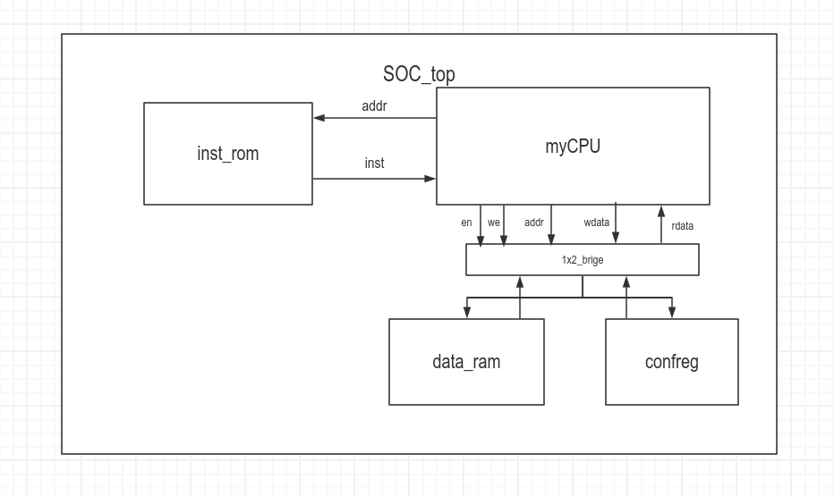

# C5 五级流水CPU设计

## 目录

-   [设计概述](#设计概述)
    -   [自顶向下的分析](#自顶向下的分析)
        -   [SoC](#SoC)
        -   [myCPU](#myCPU)
        -   [dataRAM](#dataRAM)
        -   [instROM](#instROM)
        -   [confreg](#confreg)
-   [设计实现——自底向上](#设计实现自底向上)
    -   [adder](#adder)
    -   [IF\_stage](#IF_stage)
    -   [regfile](#regfile)
    -   [ID\_stage](#ID_stage)
    -   [mul](#mul)
    -   [div](#div)
    -   [alu](#alu)
    -   [EXE\_stage](#EXE_stage)
    -   [MEM\_stage](#MEM_stage)
    -   [WB\_stage](#WB_stage)
    -   [mycpu\_top](#mycpu_top)
    -   [confreg](#confreg)
    -   [soc\_top](#soc_top)
-   [重点记录](#重点记录)

## 设计概述

参照[Lab4 五段流水MIPS CPU设计](https://www.wolai.com/kxcUtW525HDtUbYt7EwQwp "Lab4 五段流水MIPS CPU设计")的设计，采用“自顶向下”的分析方法，“自底向上”的实现方法进行设计

### 自顶向下的分析

#### SoC

参照C4中20条单周期CPU实验，soc片上系统的层次结构如下：



myCPU模块是SOC的核心模块，也是所需要实现的五级流水CPU

inst\_rom模块是只读的指令存储器ROM，根据mycpu所给定的指令地址读取指令

1x2\_bridge模块是根据CPU所采用的“统一编址”思想来访问数据存储器和外设，根据地址掩码，将CPU发出的访数据存地址、数据、写信号分发给数据存储器和confreg外设

data\_ram模块是可读可写的数据存储器RAM，根据BRIDGE所分发的信号进行操作

confreg模块是统一管理实验箱板载外设的模块，将单、双色LED，开关、计时器、4x4键盘等外设的读写统一

#### myCPU

1.  IF

    取指单元负责计算取指令地址——根据`D_sel_pc`信号在ID阶段信号`D_pc_4`、`D_pc_branch`和`D_pc_j`中三选一产生取指地址
2.  ID

    译码取寄存器数单元需要做两件事情：
    1.  根据取出的指令进行译码产生控制信号以及取寄存器操作数
    2.  根据输入的F\_pc产生D\_pc\_4、D\_pc\_branch、D\_pc\_j
        需要译码的指令以及对应的字段域表格如下
        \| 指令        | inst\[31:26] | inst\[25:22] | inst\[21:20]     | inst\[19:15] | rk    | rj           | rd           |
        \| --------- | ------------ | ------------ | ---------------- | ------------ | ----- | ------------ | ------------ |
        \| RDCNTID.W | 000000       | 0000         | 00               | 00000        | 11000 | rj           | 00000        |
        \| RDCNTVL.W | 000000       | 0000         | 00               | 00000        | 11000 | 00000        | rd           |
        \| RDCNTVH.W | 000000       | 0000         | 00               | 00000        | 11001 | 00000        | rd           |
        \| ADD.W     | 000000       | 0000         | 01               | 00000        | rk    | rj           | rd           |
        \| SUB.W     | 000000       | 0000         | 01               | 00010        | rk    | rj           | rd           |
        \| SLT       | 000000       | 0000         | 01               | 00100        | rk    | rj           | rd           |
        \| SLTU      | 000000       | 0000         | 01               | 00101        | rk    | rj           | rd           |
        \| NOR       | 000000       | 0000         | 01               | 01000        | rk    | rj           | rd           |
        \| AND       | 000000       | 0000         | 01               | 01001        | rk    | rj           | rd           |
        \| OR        | 000000       | 0000         | 01               | 01010        | rk    | rj           | rd           |
        \| XOR       | 000000       | 0000         | 01               | 01011        | rk    | rj           | rd           |
        \| SLL.W     | 000000       | 0000         | 01               | 01110        | rk    | rj           | rd           |
        \| SRL.W     | 000000       | 0000         | 01               | 01111        | rk    | rj           | rd           |
        \| SRA.W     | 000000       | 0000         | 01               | 10000        | rk    | rj           | rd           |
        \| MUL.W     | 000000       | 0000         | 01               | 11000        | rk    | rj           | rd           |
        \| MULH.W    | 000000       | 0000         | 01               | 11001        | rk    | rj           | rd           |
        \| MULH.WU   | 000000       | 0000         | 01               | 11010        | rk    | rj           | rd           |
        \| DIV.W     | 000000       | 0000         | 10               | 00000        | rk    | rj           | rd           |
        \| MOD.W     | 000000       | 0000         | 10               | 00001        | rk    | rj           | rd           |
        \| DIV.WU    | 000000       | 0000         | 10               | 00010        | rk    | rj           | rd           |
        \| MOD.WU    | 000000       | 0000         | 10               | 00011        | rk    | rj           | rd           |
        \| BREAK     | 000000       | 0000         | 10               | 10100        | code  |              |              |
        \| SYSCALL   | 000000       | 0000         | 10               | 10110        | code  |              |              |
        \| SLLI.W    | 000000       | 0001         | 00               | 00001        | ui5   | rj           | rd           |
        \| SRLI.W    | 000000       | 0001         | 00               | 01001        | ui5   | rj           | rd           |
        \| SRAI.W    | 000000       | 0001         | 00               | 10001        | ui5   | rj           | rd           |
        \| SLTI      | 000000       | 1000         | SI12             |              |       | rj           | rd           |
        \| SLTUI     | 000000       | 1001         | SI12             |              |       | rj           | rd           |
        \| ADDI.W    | 000000       | 1010         | SI12             |              |       | rj           | rd           |
        \| ANDI      | 000000       | 1101         | UI12             |              |       | rj           | rd           |
        \| ORI       | 000000       | 1110         | UI12             |              |       | rj           | rd           |
        \| XORI      | 000000       | 1111         | UI12             |              |       | rj           | rd           |
        \| CSRRD     | 000001       | 00XX         | INST\[23:10] CSR |              |       | 00000        | rd           |
        \| CSRWR     | 000001       | 00XX         | INST\[23:10] CSR |              |       | 00001        | rd           |
        \| CSRXCHG   | 000001       | 00XX         | INST\[23:10] CSR |              |       | rj≠0,1       | rd           |
        \| CACOP     | 000001       | 1000         | SI12             |              |       | rj           | code         |
        \| TLBSRCH   | 000001       | 1001         | 00               | 10000        | 01010 | 00000        | 00000        |
        \| TLBRD     | 000001       | 1001         | 00               | 10000        | 01011 | 00000        | 00000        |
        \| TLBWR     | 000001       | 1001         | 00               | 10000        | 01100 | 00000        | 00000        |
        \| TLBFILL   | 000001       | 1001         | 00               | 10000        | 01101 | 00000        | 00000        |
        \| ERTN      | 000001       | 1001         | 00               | 10000        | 01110 | 00000        | 00000        |
        \| IDLE      | 000001       | 1001         | 00               | 10001        | level |              |              |
        \| INVTLB    | 000001       | 1001         | 00               | 10011        | rk    | rj           | op           |
        \| LU12I.W   | 000101       | 0xxx         | inst\[24:5]      |              |       |              | rd           |
        \| PCADDU12I | 000111       | 0xxx         | inst\[24:5]      |              |       |              | rd           |
        \| LL.W      | 001000       | 00xx         | inst\[22:9]      |              |       | rj           | rd           |
        \| SC.W      | 001000       | 01xx         | inst\[22:9]      |              |       | rj           | rd           |
        \| LD.B      | 001010       | 0000         | SI12             |              |       | rj           | rd           |
        \| LD.H      | 001010       | 0001         | SI12             |              |       | rj           | rd           |
        \| LD.W      | 001010       | 0010         | SI12             |              |       | rj           | rd           |
        \| ST.B      | 001010       | 0100         | SI12             |              |       | rj           | rd           |
        \| ST.H      | 001010       | 0101         | SI12             |              |       | rj           | rd           |
        \| ST.W      | 001010       | 0110         | SI12             |              |       | rj           | rd           |
        \| LD.BU     | 001010       | 1000         | SI12             |              |       | rj           | rd           |
        \| LD.HU     | 001010       | 1001         | SI12             |              |       | rj           | rd           |
        \| PRELD     | 001010       | 1011         | SI12             |              |       | rj           | hint         |
        \| DBAR      | 001110       | 0001         | 11               | 00100        | hint  |              |              |
        \| IBAR      | 001110       | 0001         | 11               | 00101        | hint  |              |              |
        \| BCEQZ     | 010010       | offs\[15:0]  |                  |              |       | 00 cj        | offs\[20:16] |
        \| BCNEZ     | 010010       | offs\[15:0]  |                  |              |       | 01 cj        | offs\[20:16] |
        \| JIRL      | 010011       | offs\[15:0]  |                  |              |       | rj           | rd           |
        \| B         | 010100       | offs\[15:0]  |                  |              |       | offs\[25:16] |              |
        \| BL        | 010101       | offs\[15:0]  |                  |              |       | offs\[25:16] |              |
        \| BEQ       | 010110       | offs\[15:0]  |                  |              |       | rj           | rd           |
        \| BNE       | 010111       | offs\[15:0]  |                  |              |       | rj           | rd           |
        \| BLT       | 011000       | offs\[15:0]  |                  |              |       | rj           | rd           |
        \| BGE       | 011001       | offs\[15:0]  |                  |              |       | rj           | rd           |
        \| BLTU      | 011010       | offs\[15:0]  |                  |              |       | rj           | rd           |
        \| BGEU      | 011011       | offs\[15:0]  |                  |              |       | rj           | rd           |
        所有涉及到的控制信号表格如下：
        \| 控制信号名称              | 控制信号描述                              | 产生方式                                                                                                                                                                                                                                                                                                                                                                                                                                                                                                                                                                                                                                                                                                                                                                                                                                                                                                                       |
        \| ------------------- | ----------------------------------- | -------------------------------------------------------------------------------------------------------------------------------------------------------------------------------------------------------------------------------------------------------------------------------------------------------------------------------------------------------------------------------------------------------------------------------------------------------------------------------------------------------------------------------------------------------------------------------------------------------------------------------------------------------------------------------------------------------------------------------------------------------------------------------------------------------------------------------------------------------------------------------------------------------------------------- |
        \| d\_regW             | 产生的写寄存器信号，1位
        需要输出               | \~inst\_st\_b    &
        \~inst\_st\_h    &
        \~inst\_st\_w    &
        \~inst\_beq     &
        \~inst\_bne     &
        \~inst\_blt     &
        \~inst\_bge     &
        \~inst\_bltu    &
        \~inst\_bgeu    &
        \~inst\_b       &
        \~inst\_syscall &
        \~inst\_tlbsrch &
        \~inst\_tlbrd   &
        \~inst\_tlbwr   &
        \~inst\_tlbfill &
        \~inst\_invtlb  &
        \~inst\_cacop   &
        \~inst\_preld   &
        \~inst\_dbar    &
        \~inst\_ibar                                                                                                                                                                                                                                                                                                                                                                                                                                                                          |
        \| d\_selPC            | 产生的下一个指令地址的选择信号，输出给IF阶段，2位
        需要输出 | 00——pc4：
        01——pcBranch：inst\_bl | inst\_b | (inst\_beq & d\_rjEqrd) |(inst\_bne & \~d\_rjEqrd) | (...)
        10——pcJ：inst\_jirl                                                                                                                                                                                                                                                                                                                                                                                                                                                                                                                                                                                                                                                                                                                                                                                       |
        \| d\_aluOP            | 产生的ALU运算信号，输出给EXE阶段12位
        需要输出     | assign alu\_op\[ 0] = inst\_add |
        inst\_addi |
        inst\_ld\_b |
        inst\_ld\_h |
        inst\_ld\_w |
        inst\_st\_b |
        inst\_st\_h |
        inst\_st\_w |
        inst\_ld\_bu |
        inst\_ld\_hu |
        inst\_ll |
        inst\_sc |
        inst\_jirl |
        inst\_bl |
        inst\_pcaddu12i|
        inst\_cacop |
        inst\_preld;

        assign alu\_op\[ 1] = inst\_sub\_w;
        assign alu\_op\[ 2] = inst\_slt   | inst\_slti;
        assign alu\_op\[ 3] = inst\_sltu  | inst\_sltui;
        assign alu\_op\[ 4] = inst\_and   | inst\_andi;
        assign alu\_op\[ 5] = inst\_nor;
        assign alu\_op\[ 6] = inst\_or    | inst\_ori;
        assign alu\_op\[ 7] = inst\_xor   | inst\_xori;
        assign alu\_op\[ 8] = inst\_sll\_w | inst\_slli\_w;
        assign alu\_op\[ 9] = inst\_srl\_w | inst\_srli\_w;
        assign alu\_op\[10] = inst\_sra\_w | inst\_srai\_w;
        assign alu\_op\[11] = inst\_lu12i\_w; |
        \| d\_memReadE         | 产生的读存储信号，输出给EXE阶段，1位
        需要输出       | inst\_ld\_b | inst\_ld\_h | inst\_ld\_w | inst\_ld\_bu | inst\_ld\_hu                                                                                                                                                                                                                                                                                                                                                                                                                                                                                                                                                                                                                                                                                                                                                                                                                                                  |
        \| d\_memReadW         | 产生的读存储位宽，输出给EXE阶段，4位
        需要输出       | \[0] : inst\_ld\_b | inst\_ld\_h | inst\_ld\_w | inst\_ld\_bu | inst\_ld\_hu
        \[1] : inst\_ld\_h | inst\_ld\_hu
        \[2] : inst\_ld\_w
        \[3] : inst\_ld\_w                                                                                                                                                                                                                                                                                                                                                                                                                                                                                                                                                                                                                                                                                                                                                      |
        \| d\_memWriteE        | 产生的写存储信号，输出给EXE阶段，1位
        需要输出       | inst\_st\_b | inst\_st\_h | inst\_st\_w                                                                                                                                                                                                                                                                                                                                                                                                                                                                                                                                                                                                                                                                                                                                                                                                                                                                                  |
        \| d\_memWriteW        | 产生的写存储位宽，输出给EXE阶段，4位
        需要输出       | \[0] : inst\_st\_b | inst\_st\_h | inst\_st\_w&#x20;
        \[1] : inst\_st\_h&#x20;
        \[2] : inst\_st\_w
        \[3] : inst\_st\_w                                                                                                                                                                                                                                                                                                                                                                                                                                                                                                                                                                                                                                                                                                                                                                                                    |
        \| d\_src1\_is\_pc     | alu第一个操作数是pc                        | inst\_jirl | inst\_bl | inst\_pcaddu12i                                                                                                                                                                                                                                                                                                                                                                                                                                                                                                                                                                                                                                                                                                                                                                                                                                                                                  |
        \| d\_src2\_is\_4      | alu第二个操作数是4                         | inst\_jirl | inst\_bl                                                                                                                                                                                                                                                                                                                                                                                                                                                                                                                                                                                                                                                                                                                                                                                                                                                                                                     |
        \| d\_src2\_is\_imm    | alu第二个操作数是立即数                       | d\_ src2\_is\_imm   = inst\_slli |
        inst\_srli |
        inst\_srai |
        inst\_addi |
        inst\_slti |
        inst\_sltu |
        inst\_andi |
        inst\_ori |
        inst\_xori |
        inst\_pcaddu12i |
        inst\_ld\_b |
        inst\_ld\_h |
        inst\_ld\_w |
        inst\_ld\_bu |
        inst\_ld\_hu |
        inst\_st\_b |
        inst\_st\_h |
        inst\_st\_w |
        inst\_ll |
        inst\_sc |
        inst\_lu12i |
        inst\_cacop |
        inst\_preld ;                                                                                                                                                                                                                                                                                                                                                                                                                                                                |
        \| d\_res\_from\_mem   | 寄存器的结果来自于mem，需要输出                   | inst\_st\_b | inst\_st\_h | inst\_st\_w                                                                                                                                                                                                                                                                                                                                                                                                                                                                                                                                                                                                                                                                                                                                                                                                                                                                                  |
        \| d\_src\_reg\_is\_rd | 读寄存器的B端口地址是rd                       | d\_src\_reg\_is\_rd =inst\_beq |
        inst\_bne |
        inst\_blt |
        inst\_bltu |
        inst\_bge |
        inst\_bgeu |
        inst\_st\_b |
        inst\_st\_h |
        inst\_st\_w |
        inst\_sc |
        inst\_csrwr |
        inst\_csrxchg;                                                                                                                                                                                                                                                                                                                                                                                                                                                                                                                                                                                                                                                                                    |
        \| d\_dst\_is\_r1      | 写寄存器地址是r1                           | inst\_bl                                                                                                                                                                                                                                                                                                                                                                                                                                                                                                                                                                                                                                                                                                                                                                                                                                                                                                                   |
        \| d\_need\_si12       | 表示指令需要使用立即数，且是12位的有符号扩展             | d\_need\_si12     =  inst\_addi\_w |
        inst\_ld\_b   |
        inst\_ld\_h   |
        inst\_ld\_w   |
        inst\_st\_b   |
        inst\_st\_h   |
        inst\_st\_w   |
        inst\_ld\_bu  |
        inst\_ld\_hu  |
        inst\_slti   |
        inst\_sltui  |
        inst\_cacop  |
        inst\_preld  ;                                                                                                                                                                                                                                                                                                                                                                                                                                                                                                                                                                                                                               |
        \| d\_need\_ui12       | 表示指令需要使用立即数，且是12位的无符号扩展             | inst\_andi | inst\_ori | inst\_xori                                                                                                                                                                                                                                                                                                                                                                                                                                                                                                                                                                                                                                                                                                                                                                                                                                                                                      |
        \| d\_need\_si16       | 表示指令需要使用立即数，且是16位的有符号扩展             | inst\_jirl |
        inst\_beq  |
        inst\_bne  |
        inst\_blt  |
        inst\_bge  |
        inst\_bltu |
        inst\_bgeu                                                                                                                                                                                                                                                                                                                                                                                                                                                                                                                                                                                                                                                                                                                                                                                                     |
        \| d\_need\_si20       | 表示指令需要使用立即数，且是20位的有符号扩展             | inst\_lu12i | inst\_pcaddu12i                                                                                                                                                                                                                                                                                                                                                                                                                                                                                                                                                                                                                                                                                                                                                                                                                                                                                             |
        \| d\_need\_si26       | 表示指令需要使用立即数，且是26位的有符号扩展             | inst\_b | inst\_bl                                                                                                                                                                                                                                                                                                                                                                                                                                                                                                                                                                                                                                                                                                                                                                                                                                                                                                        |
        \| d\_rjEqrd           | 表示rd寄存器数据和rj寄存器数据相等                 | d\_regDataA === d\_regDataB                                                                                                                                                                                                                                                                                                                                                                                                                                                                                                                                                                                                                                                                                                                                                                                                                                                                                                |
        \| d\_rjLTrd           | 表示rj寄存器数据小于rd寄存器数据                  | 用一个adder来判断                                                                                                                                                                                                                                                                                                                                                                                                                                                                                                                                                                                                                                                                                                                                                                                                                                                                                                                |
        \| d\_rjLTrdU          | 表示无符号rj寄存器数据小于rd寄存器数据               |                                                                                                                                                                                                                                                                                                                                                                                                                                                                                                                                                                                                                                                                                                                                                                                                                                                                                                                            |
        所涉及到的数据信号表格如下：
        \| 数据信号名称        | 数据信号描述          | 产生方式                                                                                                             |
        \| ------------- | --------------- | ---------------------------------------------------------------------------------------------------------------- |
        \| d\_rj         | 指令译码的rj字段       | inst\[9:5]                                                                                                       |
        \| d\_rk         | 指令译码的rk字段       | inst\[14:10]                                                                                                     |
        \| d\_rd         | 指令译码的rd字段       | inst\[4:0]                                                                                                       |
        \| d\_regAddA    | 读寄存器A端口地址       | d\_rj                                                                                                            |
        \| d\_regAddB    | 读寄存器B端口地址       | d\_src\_reg\_is\_rd ? d\_rd : d\_rk                                                                              |
        \| d\_regDataA   | 寄存器A端口读出的数据     | 寄存器模块输出                                                                                                          |
        \| d\_regDataB   | 寄存器B端口读出的数据     | 寄存器模块输出                                                                                                          |
        \| d\_regWAdd    | 写寄存器地址，需要输出     | d\_dst\_is\_r1 ? 5'h1 : d\_rd                                                                                    |
        \| W\_regWData   | 写寄存器数据，外部输入     | 模块输入                                                                                                             |
        \| d\_imm        | 立即数             | src2\_is\_4 ? 32'h4 : (need\_si20 ? {i20\[19:0], 12'b0} : (need\_ui12 ? {20'b0 , i12} : {{20{i12\[11]}}, i12})); |
        \| d\_pc4        | PC+4，需要输出       | F\_PC+32'h4                                                                                                      |
        \| d\_pcJ        | J跳转指令的PC地址，需要输出 | d\_regDataA+d\_jirl\_offs                                                                                        |
        \| d\_pcBranch   | 分支指令的PC地址，需要输出  | F\_PC+d\_br\_offs                                                                                                |
        \| d\_br\_offs   | 分支偏移地址          | need\_si26 ? {{4{i26\[25]}}, i26\[25:0], 2'b0} : {{14{i16\[15]}}, i16\[15:0], 2'b0};                             |
        \| d\_jirl\_offs | 链接并跳转指令的偏移地址    | {{14{i16\[15]}}, i16\[15:0], 2'b0}                                                                               |
        \| d\_i12        | 指令中的12位立即数      | inst\[21:10]                                                                                                     |
        \| d\_i20        | 指令中的20位立即数      | inst\[24:5]                                                                                                      |
        \| d\_i16        | 指令中的16位立即数      | inst\[25:10]                                                                                                     |
        \| d\_i26        | 指令中的26位立即数      | {inst\[9:0],inst\[25:10]}                                                                                        |
        \| d\_aluSrc1    | alu运算操作数A，需要输出  | d\_src1\_is\_pc ? F\_PC : d\_regDataA                                                                            |
        \| d\_aluSrc2    | alu运算操作数B，需要输出  | d\_src2\_is\_imm ? d\_imm : d\_regDataB                                                                          |
3.  EX

    EXE阶段根据ID阶段的控制信号`D_aluOP`以及ALU的两个操作数`D_aluSrc1`,`D_aluSrc2`做运算。同时向MEM段继续传递控制信号
4.  MEM

    MEM阶段根据alu计算出的地址写数据或者读数据，注意这里要结合写/读的位宽，对写数据或者读数据变形
5.  WB

    根据传递过来的控制信号`M_res_from_mem`选择写寄存器的数据

#### dataRAM

#### instROM

#### confreg

## 设计实现——自底向上

为了区分各阶段的信号，加前缀大写“F”、“D”、“E”、“M”、“W”表示是该阶段输出的信号，小写“f”、“d”、“e”、“m”、“w”表示是该阶段过程中产生的信号

### adder

```verilog
`timescale 1ns / 1ps
module adder #(
    parameter WIDTH = 32
) (
    input [WIDTH-1:0] a,
    input [WIDTH-1:0] b,
    output [WIDTH-1:0] res,
    output c
);
  assign {c, res} = a + b;
endmodule

```

### IF\_stage

```verilog
`timescale 1ns / 1ps

module IF_stage (
    input clk,
    input stall,
    input resetn,

    input [1:0] d_selPC,
    input [31:0] d_pcBranch,
    d_pcJ,
    output reg [31:0] F_pc
);
  wire [31:0] f_pc;
  always @(posedge clk) begin
    if (~resetn) begin
      F_pc <= 32'h1bfffffc;
    end else begin
      F_pc <= d_selPC === 2'h2 ? d_pcJ : (d_selPC === 2'h1 ? d_pcBranch : f_pc);
    end
  end
  assign f_pc = F_pc + 32'h4;
endmodule

```

### regfile

```verilog
module regfile (
    input         clk,     //寄存器文件的写时钟
    // READ PORT 1
    input  [ 4:0] raddr1,  //端口A地址
    output [31:0] rdata1,  //寄存器端口A读出的数据
    // READ PORT 2
    input  [ 4:0] raddr2,  //端口B地址
    output [31:0] rdata2,  //寄存器端口B读出的数据
    // WRITE PORT
    input         we,      //寄存器文件的写使能端，高有效
    input  [ 4:0] waddr,   //写地址端口
    input  [31:0] wdata    //写数据
);
  reg [31:0] rf[31:0];  //定义寄存器文件

  //写数据
  always @(posedge clk) begin  //clk上升沿写
    if (we) rf[waddr] <= wdata;  //同步写
  end

  //读A端口数据
  assign rdata1 = (raddr1 == 5'b0) ? 32'b0 : rf[raddr1];

  //读B端口数据
  assign rdata2 = (raddr2 == 5'b0) ? 32'b0 : rf[raddr2];

endmodule

```

### ID\_stage

```verilog
`timescale 1ns / 1ps

module ID_stage (
    input clk,
    input resetn,
    input stall,

    input [31:0] F_pc,
    input [31:0] inst,

    output reg D_regW,
    output reg D_res_from_mem,
    output [1:0] d_selPC,
    output reg [11:0] D_aluOP,
    output reg D_memReadE,
    output reg [3:0] D_memReadW,
    output reg D_memWriteE,
    output reg [3:0] D_memWriteW,
    output reg [31:0] D_memWriteData,
    output reg [4:0] D_regWAdd,
    output [31:0] d_pcJ,
    output [31:0] d_pcBranch,
    output reg [31:0] D_aluSrc1,
    output reg [31:0] D_aluSrc2,

    input W_regW,
    input [31:0] W_regWData,
    input [4:0] W_regWAdd
);
  wire [31:0] d_pc;

  wire [ 5:0] d_op_31_26;  //inst[31:26]
  wire [ 3:0] d_op_25_22;  //inst[25:22]
  wire [ 1:0] d_op_21_20;  //inst[21:20]
  wire [ 4:0] d_op_19_15;  //inst[19:15]
  wire [ 4:0] d_rd;  //inst的rd编码
  wire [ 4:0] d_rj;  //inst的rj编码
  wire [ 4:0] d_rk;  //inst的rk编码
  wire [11:0] d_i12;  //inst中的12位立即数
  wire [19:0] d_i20;  //inst中的20位立即数
  wire [15:0] d_i16;  //inst中的16位立即数
  wire [25:0] d_i26;  //inst中的26位立即数

  wire [63:0] d_op_31_26_d;  //6-64译码
  wire [15:0] d_op_25_22_d;  //4-16译码
  wire [ 3:0] d_op_21_20_d;  //2-4译码
  wire [31:0] d_op_19_15_d;  //5-32译码

  assign d_op_31_26 = inst[31:26];
  assign d_op_25_22 = inst[25:22];
  assign d_op_21_20 = inst[21:20];
  assign d_op_19_15 = inst[19:15];

  assign d_rd       = inst[4:0];
  assign d_rj       = inst[9:5];
  assign d_rk       = inst[14:10];

  assign d_i12      = inst[21:10];
  assign d_i20      = inst[24:5];
  assign d_i16      = inst[25:10];
  assign d_i26      = {inst[9:0], inst[25:10]};

  decoder_6_64 u_dec0 (
      .in (d_op_31_26),
      .out(d_op_31_26_d)
  );
  decoder_4_16 u_dec1 (
      .in (d_op_25_22),
      .out(d_op_25_22_d)
  );
  decoder_2_4 u_dec2 (
      .in (d_op_21_20),
      .out(d_op_21_20_d)
  );
  decoder_5_32 u_dec3 (
      .in (d_op_19_15),
      .out(d_op_19_15_d)
  );

  wire inst_rdcntid = d_op_31_26_d[6'h00] & d_op_25_22_d[4'h0] & d_op_21_20_d[2'h0] & d_rk == 5'h18 & d_rd == 5'h00;
  wire inst_rdcntvl = d_op_31_26_d[6'h00] & d_op_25_22_d[4'h0] & d_op_21_20_d[2'h0] & d_rk == 5'h18 & d_rj == 5'h00;
  wire inst_rdcntvh = d_op_31_26_d[6'h00] & d_op_25_22_d[4'h0] & d_op_21_20_d[2'h0] & d_rk == 5'h19 & d_rj == 5'h00;
  wire inst_add = d_op_31_26_d[6'h00] & d_op_25_22_d[4'h0] & d_op_21_20_d[2'h1] &d_op_19_15_d[5'h00];
  wire inst_sub = d_op_31_26_d[6'h00] & d_op_25_22_d[4'h0] & d_op_21_20_d[2'h1] &d_op_19_15_d[5'h02];
  wire inst_slt = d_op_31_26_d[6'h00] & d_op_25_22_d[4'h0] & d_op_21_20_d[2'h1] &d_op_19_15_d[5'h04];
  wire inst_sltu = d_op_31_26_d[6'h00] & d_op_25_22_d[4'h0] & d_op_21_20_d[2'h1] &d_op_19_15_d[5'h05];
  wire inst_nor = d_op_31_26_d[6'h00] & d_op_25_22_d[4'h0] & d_op_21_20_d[2'h1] &d_op_19_15_d[5'h08];
  wire inst_and = d_op_31_26_d[6'h00] & d_op_25_22_d[4'h0] & d_op_21_20_d[2'h1] &d_op_19_15_d[5'h09];
  wire inst_or = d_op_31_26_d[6'h00] & d_op_25_22_d[4'h0] & d_op_21_20_d[2'h1] &d_op_19_15_d[5'h0a];
  wire inst_xor = d_op_31_26_d[6'h00] & d_op_25_22_d[4'h0] & d_op_21_20_d[2'h1] &d_op_19_15_d[5'h0b];
  wire inst_sll = d_op_31_26_d[6'h00] & d_op_25_22_d[4'h0] & d_op_21_20_d[2'h1] &d_op_19_15_d[5'h0e];
  wire inst_srl = d_op_31_26_d[6'h00] & d_op_25_22_d[4'h0] & d_op_21_20_d[2'h1] &d_op_19_15_d[5'h0f];
  wire inst_sra = d_op_31_26_d[6'h00] & d_op_25_22_d[4'h0] & d_op_21_20_d[2'h1] &d_op_19_15_d[5'h10];
  wire inst_mul = d_op_31_26_d[6'h00] & d_op_25_22_d[4'h0] & d_op_21_20_d[2'h1] &d_op_19_15_d[5'h18];
  wire inst_mulh = d_op_31_26_d[6'h00] & d_op_25_22_d[4'h0] & d_op_21_20_d[2'h1] &d_op_19_15_d[5'h19];
  wire inst_mulhu = d_op_31_26_d[6'h00] & d_op_25_22_d[4'h0] & d_op_21_20_d[2'h1] &d_op_19_15_d[5'h1a];
  wire inst_div = d_op_31_26_d[6'h00] & d_op_25_22_d[4'h0] & d_op_21_20_d[2'h2] &d_op_19_15_d[5'h00];
  wire inst_mod = d_op_31_26_d[6'h00] & d_op_25_22_d[4'h0] & d_op_21_20_d[2'h2] &d_op_19_15_d[5'h01];
  wire inst_divu = d_op_31_26_d[6'h00] & d_op_25_22_d[4'h0] & d_op_21_20_d[2'h2] &d_op_19_15_d[5'h02];
  wire inst_modu = d_op_31_26_d[6'h00] & d_op_25_22_d[4'h0] & d_op_21_20_d[2'h2] &d_op_19_15_d[5'h03];
  wire inst_break = d_op_31_26_d[6'h00] & d_op_25_22_d[4'h0] & d_op_21_20_d[2'h2] &d_op_19_15_d[5'h14];
  wire inst_syscall = d_op_31_26_d[6'h00] & d_op_25_22_d[4'h0] & d_op_21_20_d[2'h2] &d_op_19_15_d[5'h16];
  wire inst_slli = d_op_31_26_d[6'h00] & d_op_25_22_d[4'h1] & d_op_21_20_d[2'h0] & d_op_19_15_d[5'h01];
  wire inst_srli = d_op_31_26_d[6'h00] & d_op_25_22_d[4'h1] & d_op_21_20_d[2'h0] & d_op_19_15_d[5'h09];
  wire inst_srai = d_op_31_26_d[6'h00] & d_op_25_22_d[4'h1] & d_op_21_20_d[2'h0] & d_op_19_15_d[5'h19];
  wire inst_slti = d_op_31_26_d[6'h00] & d_op_25_22_d[4'h8];
  wire inst_sltui = d_op_31_26_d[6'h00] & d_op_25_22_d[4'h9];
  wire inst_addi = d_op_31_26_d[6'h00] & d_op_25_22_d[4'ha];
  wire inst_andi = d_op_31_26_d[6'h00] & d_op_25_22_d[4'hb];
  wire inst_ori = d_op_31_26_d[6'h00] & d_op_25_22_d[4'he];
  wire inst_xori = d_op_31_26_d[6'h00] & d_op_25_22_d[4'hf];
  wire inst_csrrd = d_op_31_26_d[6'h01] & ~inst[25] & ~inst[24] & d_rj == 5'h00;
  wire inst_csrwr = d_op_31_26_d[6'h01] & ~inst[25] & ~inst[24] & d_rj == 5'h01;
  wire inst_csrxchg = d_op_31_26_d[6'h01] & ~inst[25] & ~inst[24] & ~inst_csrrd & ~inst_csrwr;
  wire inst_cacop = d_op_31_26_d[6'h01] & d_op_25_22_d[4'h8];
  wire inst_tlbsrch = d_op_31_26_d[6'h01] & d_op_25_22_d[4'h9] & d_op_21_20_d[2'h0] & d_op_19_15_d[5'h10] & d_rk == 5'h0a & d_rj == 5'h00 & d_rd == 5'h00;
  wire inst_tlbrd = d_op_31_26_d[6'h01] & d_op_25_22_d[4'h9] & d_op_21_20_d[2'h0] & d_op_19_15_d[5'h10] & d_rk == 5'h0b & d_rj == 5'h00 & d_rd == 5'h00;
  wire inst_tlbwr = d_op_31_26_d[6'h01] & d_op_25_22_d[4'h9] & d_op_21_20_d[2'h0] & d_op_19_15_d[5'h10] & d_rk == 5'h0c & d_rj == 5'h00 & d_rd == 5'h00;
  wire inst_tlbfill = d_op_31_26_d[6'h01] & d_op_25_22_d[4'h9] & d_op_21_20_d[2'h0] & d_op_19_15_d[5'h10] & d_rk == 5'h0d & d_rj == 5'h00 & d_rd == 5'h00;
  wire inst_ertn = d_op_31_26_d[6'h01] & d_op_25_22_d[4'h9] & d_op_21_20_d[2'h0] & d_op_19_15_d[5'h10] & d_rk == 5'h0e & d_rj == 5'h00 & d_rd == 5'h00;
  wire inst_idle = d_op_31_26_d[6'h01] & d_op_25_22_d[4'h9] & d_op_21_20_d[2'h0] & d_op_19_15_d[5'h11];
  wire inst_invtlb = d_op_31_26_d[6'h01] & d_op_25_22_d[4'h9] & d_op_21_20_d[2'h0] & d_op_19_15_d[5'h13];
  wire inst_lu12i = d_op_31_26_d[6'h05] & ~inst[25];
  wire inst_pcaddu12i = d_op_31_26_d[6'h07] & ~inst[25];
  wire inst_ll = d_op_31_26_d[6'h08] & ~inst[25] & ~inst[24];
  wire inst_sc = d_op_31_26_d[6'h08] & ~inst[25] & inst[24];
  wire inst_ld_b = d_op_31_26_d[6'h0a] & d_op_25_22_d[4'h0];
  wire inst_ld_h = d_op_31_26_d[6'h0a] & d_op_25_22_d[4'h1];
  wire inst_ld_w = d_op_31_26_d[6'h0a] & d_op_25_22_d[4'h2];
  wire inst_st_b = d_op_31_26_d[6'h0a] & d_op_25_22_d[4'h4];
  wire inst_st_h = d_op_31_26_d[6'h0a] & d_op_25_22_d[4'h5];
  wire inst_st_w = d_op_31_26_d[6'h0a] & d_op_25_22_d[4'h6];
  wire inst_ld_bu = d_op_31_26_d[6'h0a] & d_op_25_22_d[4'h8];
  wire inst_ld_hu = d_op_31_26_d[6'h0a] & d_op_25_22_d[4'h9];
  wire inst_preld = d_op_31_26_d[6'h0a] & d_op_25_22_d[4'hb];
  wire inst_dbar = d_op_31_26_d[6'h0e] & d_op_25_22_d[4'h1] & d_op_21_20_d[2'h3] & d_op_19_15_d[5'h04];
  wire inst_ibar = d_op_31_26_d[6'h0e] & d_op_25_22_d[4'h1] & d_op_21_20_d[2'h3] & d_op_19_15_d[5'h05];
  wire inst_bceqz = d_op_31_26_d[6'h12] & ~inst[9] & ~inst[8];
  wire inst_bcnez = d_op_31_26_d[6'h12] & ~inst[9] & inst[8];
  wire inst_jirl = d_op_31_26_d[6'h13];
  wire inst_b = d_op_31_26_d[6'h14];
  wire inst_bl = d_op_31_26_d[6'h15];
  wire inst_beq = d_op_31_26_d[6'h16];
  wire inst_bne = d_op_31_26_d[6'h17];
  wire inst_blt = d_op_31_26_d[6'h18];
  wire inst_bge = d_op_31_26_d[6'h19];
  wire inst_bltu = d_op_31_26_d[6'h1a];
  wire inst_bgeu = d_op_31_26_d[6'h1b];

  wire d_regW;
  wire [1:0] d_selPC;
  wire [11:0] d_aluOP;
  wire d_memReadE;
  wire [3:0] d_memReadW;
  wire d_memWriteE;
  wire [3:0] d_memWriteW;
  wire d_src1_is_pc;
  wire d_src2_is_4;
  wire d_src2_is_imm;
  wire d_res_from_mem;
  wire d_src_reg_is_rd;
  wire d_dst_is_r1;
  wire d_need_si12;
  wire d_need_ui12;
  wire d_need_si16;
  wire d_need_si20;
  wire d_need_si26;
  wire d_rjEqrd;
  wire d_rjLTrd;
  wire d_rjLTrdU;

  assign d_regW = ~inst_st_b    &
                    ~inst_st_h    &
                    ~inst_st_w    &
                    ~inst_beq     &
                    ~inst_bne     &
                    ~inst_blt     &
                    ~inst_bge     &
                    ~inst_bltu    &
                    ~inst_bgeu    &
                    ~inst_b       &
                    ~inst_syscall &
                    ~inst_tlbsrch &
                    ~inst_tlbrd   &
                    ~inst_tlbwr   &
                    ~inst_tlbfill &
                    ~inst_invtlb  &
                    ~inst_cacop   &
                    ~inst_preld   &
                    ~inst_dbar    &
                    ~inst_ibar   ;
  assign d_selPC[0] = inst_bl 
                    | inst_b 
                    | (inst_beq & d_rjEqrd) 
                    | (inst_bne & ~d_rjEqrd)
                    | (inst_blt & d_rjLTrd)
                    | (inst_bge & ~d_rjLTrd)
                    | (inst_bltu & d_rjLTrdU)
                    | (inst_bgeu & d_rjLTrdU);
  assign d_selPC[1] = inst_jirl;
  assign d_aluOP[0] =  inst_add    |
                    inst_addi   |
                    inst_ld_b     |
                    inst_ld_h     |
                    inst_ld_w     |
                    inst_st_b     |
                    inst_st_h     |
                    inst_st_w     |
                    inst_ld_bu    |
                    inst_ld_hu    |
                    inst_ll     |
                    inst_sc     |
                    inst_jirl     |
                    inst_bl       |
                    inst_pcaddu12i|
                    inst_cacop    |
                    inst_preld;
  assign d_aluOP[1] = inst_sub;
  assign d_aluOP[2] = inst_slt | inst_slti;
  assign d_aluOP[3] = inst_sltu | inst_sltui;
  assign d_aluOP[4] = inst_and | inst_andi;
  assign d_aluOP[5] = inst_nor;
  assign d_aluOP[6] = inst_or | inst_ori;
  assign d_aluOP[7] = inst_xor | inst_xori;
  assign d_aluOP[8] = inst_sll | inst_slli;
  assign d_aluOP[9] = inst_srl | inst_srli;
  assign d_aluOP[10] = inst_sra | inst_srai;
  assign d_aluOP[11] = inst_lu12i;
  assign d_memReadE = inst_ld_b | inst_ld_h | inst_ld_w | inst_ld_bu | inst_ld_hu;
  assign d_memReadW[0] = inst_ld_b | inst_ld_h | inst_ld_w | inst_ld_bu | inst_ld_hu;
  assign d_memReadW[1] = inst_ld_h | inst_ld_w;
  assign d_memReadW[2] = inst_ld_w;
  assign d_memReadW[3] = inst_ld_w;
  assign d_memWriteE = inst_st_b | inst_st_h | inst_st_w;
  assign d_memWriteW[0] = inst_st_b | inst_st_h | inst_st_w;
  assign d_memWriteW[1] = inst_st_h;
  assign d_memWriteW[2] = inst_st_w;
  assign d_memWriteW[3] = inst_st_w;
  assign d_src1_is_pc = inst_jirl | inst_bl | inst_pcaddu12i;
  assign d_src2_is_4 = inst_jirl | inst_bl;
  assign d_src2_is_imm =  inst_slli    |
                        inst_srli      |
                        inst_srai      |
                        inst_addi      |
                        inst_slti      |
                        inst_sltu      |
                        inst_andi      |
                        inst_ori       |
                        inst_xori      |
                        inst_pcaddu12i |
                        inst_ld_b      |
                        inst_ld_h      |
                        inst_ld_w      |
                        inst_ld_bu     |
                        inst_ld_hu     |
                        inst_st_b      |
                        inst_st_h      |
                        inst_st_w      |
                        inst_ll        |
                        inst_sc        |
                        inst_lu12i     |
                        inst_cacop     |
                        inst_preld     ;
  assign d_res_from_mem = inst_st_b | inst_st_h | inst_st_w;
  assign d_src_reg_is_rd =  inst_beq    |
                        inst_bne    |
                        inst_blt    |
                        inst_bltu   |
                        inst_bge    |
                        inst_bgeu   |
                        inst_st_b   |
                        inst_st_h   |
                        inst_st_w   |
                        inst_sc     |
                        inst_csrwr  |
                        inst_csrxchg;
  assign d_dst_is_r1 = inst_bl;
  assign d_need_si12 = inst_addi |
                    inst_ld_b   |
                    inst_ld_h   |
                    inst_ld_w   |
                    inst_st_b   |
                    inst_st_h   |
                    inst_st_w   |
                    inst_ld_bu  |
                    inst_ld_hu  |
                    inst_slti   |
                    inst_sltui  |
                    inst_cacop  |
                    inst_preld  ;
  assign d_need_ui12 = inst_andi | inst_ori | inst_xori;
  assign d_need_si16 = inst_jirl |
                    inst_beq  |
                    inst_bne  |
                    inst_blt  |
                    inst_bge  |
                    inst_bltu |
                    inst_bgeu;
  assign d_need_si20 = inst_lu12i | inst_pcaddu12i;
  assign d_need_si26 = inst_b | inst_bl;

  wire [ 4:0] d_regAddA;
  wire [ 4:0] d_regAddB;
  wire [31:0] d_regDataA;
  wire [31:0] d_regDataB;
  wire [ 4:0] d_regWAdd;
  wire [31:0] d_imm;
  wire [31:0] d_pcJ;
  wire [31:0] d_pcBranch;
  wire [31:0] d_br_offs;
  wire [31:0] d_jirl_offs;
  wire [31:0] d_aluSrc1;
  wire [31:0] d_aluSrc2;
  assign d_regAddA = d_rj;
  assign d_regAddB = d_src_reg_is_rd ? d_rd : d_rj;
  assign d_regWAdd = d_dst_is_r1 ? 5'h1 : d_rd;
  assign d_imm = d_src2_is_4 ? 32'h4 : 
                (d_need_si20 ? {d_i20[19:0],12'b0} : 
                (d_need_ui12 ? {20'b0,d_i12[11:0]} : 
                {{20{d_i12[11]}},d_i12[11:0]}));
  assign d_pcJ = d_regDataA + d_jirl_offs;
  assign d_pcBranch = d_pc + d_br_offs;
  assign d_br_offs = d_need_si26 ? {{4{d_i26[25]}},d_i26[25:0],2'b0} : {{14{d_i16[15]}},d_i16[15:0],2'b0};
  assign d_jirl_offs = {{14{d_i16[15]}}, d_i16[15:0], 2'b0};
  assign d_aluSrc1 = d_src1_is_pc ? d_pc : d_regDataA;
  assign d_aluSrc2 = d_src2_is_imm ? d_imm : d_regDataB;

  wire [31:0] cmp_a, cmp_b, res;
  wire cmp_c;
  assign d_rjEqrd = d_regDataA === d_regDataB;
  assign cmp_a = d_regDataA;
  assign cmp_b = ~d_regDataB;
  adder adder_init (
      .a(cmp_a),
      .b(cmp_b),
      .cin(1'b1),
      .res(res),
      .cout(cmp_c)
  );
  assign d_rjLTrd = (d_regDataA[31] & ~d_regDataB[31]) | 
                    ((d_regDataA[31] ~^ d_regDataB[31]) & res[31]);
  assign d_rjLTrdU = ~cmp_c;

  regfile regfile_init (
      .clk(clk),
      .raddr1(d_regAddA),
      .rdata1(d_regDataA),
      .raddr2(d_regAddB),
      .rdata2(d_regDataB),
      .we(W_regW),
      .waddr(W_regWAdd),
      .wdata(W_regWData)
  );
  assign d_pc = F_pc;
  always @(posedge clk) begin
    if (~resetn) begin
      D_regW <= 0;
      D_res_from_mem <= 0;
      D_aluOP <= 0;
      D_memReadE <= 0;
      D_memReadW <= 0;
      D_memWriteW <= 0;
      D_regWAdd <= 0;
      D_aluSrc1 <= 0;
      D_aluSrc2 <= 0;
      D_memWriteData <= 0;
    end
    if (resetn) begin
      D_regW <= d_regW;
      D_res_from_mem <= d_res_from_mem;
      D_aluOP <= d_aluOP;
      D_memReadE <= d_memReadE;
      D_memReadW <= d_memReadW;
      D_memWriteW <= d_memWriteW;
      D_regWAdd <= d_regWAdd;
      D_aluSrc1 <= d_aluSrc1;
      D_aluSrc2 <= d_aluSrc2;
      D_memWriteData <= d_regDataB;
    end
  end

endmodule


```

### mul

```verilog
//mul采用两位Booth算法实现
//YDecoder是进行i-1,i,i+1的比较 (i-1)+(i)-2(i+1)
module YDecoder (
    input  yc,
    yb,
    ya,  //yc为i+1,yb为i,yc为i-1
    output negx,
    x,
    neg2x,
    _2x  //输出-1,1,-2,2
);
  //这里为什么不输出0是因为这几个情况均不符合的或就是0
  assign negx = (yc & yb & ~ya) | (yc & ~yb & ya);  //-1 yc是1 yb和ya中有一个1
  assign x = (~yc & ~yb & ya) | (~yc & yb & ~ya);  //1 yc是0,yb和ya中有一个1
  assign neg2x = (yc & ~yb & ~ya);  //-2 yc是1 yb和ya都是0
  assign _2x = (~yc & yb & ya);  //2 yc是0 yb和ya都是1
endmodule


module BoothBase (
    input negx,
    x,
    neg2x,
    _2x,  //得到的y三项的计算项
    input InX,  //x本位值
    input PosLastX,
    NegLastX,  //正上一位的位值，负上一位的位值
    output PosNextX,
    NegNextX,  //正下一位的位值，负下一位的位值
    output OutX  //当前位的计算结果
);

  //negx,neg2x需要和当前位或者上一位的位值取反相与
  //x,_2x需要和当前位或者上一位的位值相与
  assign OutX = (negx & ~InX) | (x & InX) | (neg2x & NegLastX) | (_2x & PosLastX);
  assign PosNextX = InX;  //计算2倍项所需要的正位值
  assign NegNextX = ~InX;  //计算2倍项所需要的位值取反

endmodule


module BoothInterBase (
    input [2:0] y,
    input [63:0] InX,
    output [63:0] OutX,
    output Carry
);

  wire negx, x, neg2x, _2x;  //当前三位y所计算出的结果 y[0]+y[1]-2y[2]
  wire [1:0] CarrySig[64:0];  //用来存储每次的NextX的正结果和取反结果

  YDecoder uu (
      .yc(y[2]),
      .yb(y[1]),
      .ya(y[0]),
      .negx(negx),
      .x(x),
      .neg2x(neg2x),
      ._2x(_2x)
  );  //计算negx, x, neg2x, _2x

  BoothBase fir (
      .negx(negx),
      .x(x),
      .neg2x(neg2x),
      ._2x(_2x),
      .InX(InX[0]),
      .PosLastX(1'b0),
      .NegLastX(1'b1),
      .PosNextX(CarrySig[1][0]),
      .NegNextX(CarrySig[1][1]),
      .OutX(OutX[0])
  );  //进行部分积最低位值的计算

  //循环计算部分积的1-63位
  generate
    genvar i;
    for (i = 1; i < 64; i = i + 1) begin : gfor
      BoothBase ui (
          .negx(negx),
          .x(x),
          .neg2x(neg2x),
          ._2x(_2x),
          .InX(InX[i]),
          .PosLastX(CarrySig[i][0]),
          .NegLastX(CarrySig[i][1]),
          .PosNextX(CarrySig[i+1][0]),
          .NegNextX(CarrySig[i+1][1]),
          .OutX(OutX[i])
      );
    end
  endgenerate

  //赋进位值，当-1/-2时需要作减法，进位值为1
  assign Carry = negx || neg2x;

endmodule


module add64 (
    input  [63:0] A,
    B,
    C,
    output [63:0] Carry,
    S
);
  genvar i;
  generate
    for (i = 0; i < 64; i = i + 1) begin  //循环64位赋值
      assign {Carry[i], S[i]} = A[i] + B[i] + C[i];
    end
  endgenerate
  //产生的进位应该是加到下一位的，所以使用Carry时，整体左移一位
endmodule

module mul (
    input mul_clk,
    reset,  //reset高低电平有效
    input mul_signed,  //进行有符号乘法还是无符号乘法
    input [31:0] x,
    y,  //x扩展至64位 y扩展至33位 区别有无符号
    output [63:0] result
);

  //整合赋值，扩展被乘数x和乘数y
  wire [63:0] CalX = mul_signed ? {{32{x[31]}}, x} : {32'b0, x};
  wire [32:0] CalY = mul_signed ? {y[31], y} : {1'b0, y};

  //计算Booth部分积  33/2向上取整为17个
  wire [16:0] Carry;  //booth计算得到的进位
  wire [63:0] BoothRes[16:0];  //booth的计算结果
  BoothInterBase fir (
      .y({CalY[1], CalY[0], 1'b0}),
      .InX(CalX),
      .OutX(BoothRes[0]),
      .Carry(Carry[0])
  );  //y1 y0 y-1

  generate
    genvar i;
    for (i = 2; i < 32; i = i + 2) begin : boothfor
      BoothInterBase ai (
          .y(CalY[i+1:i-1]),  //y3 y2 y1~y31 y30 y29
          .InX(CalX << i),  //被乘数左移位
          .OutX(BoothRes[i>>1]),
          .Carry(Carry[i>>1])
      );
    end
  endgenerate

  BoothInterBase las (
      .y({CalY[32], CalY[32], CalY[31]}),
      .InX(CalX << 32),
      .OutX(BoothRes[16]),
      .Carry(Carry[16])
  );  //奇数位的Booth两位乘，最后一次是再加上最高位进行比较


  reg [63:0] SecStageBoothRes[16:0];  //存储最终相加的部分积
  integer p;

  always @(*) begin
    if (~reset) begin  //同步时钟，低电平有效
      for (p = 0; p < 17; p = p + 1) begin
        SecStageBoothRes[p] <= Carry[p]+BoothRes[p];//BoothRes结果和减法变加法的进位相加
      end
    end
  end

  //Wallace Tree 因为Verilog的模块定义不允许使用数组，因此若将Wallace模块抽离出来，传参时需要传递17个数据，比较麻烦，因此这里直接嵌套Wallace
  wire [63:0] COut, SOut;

  wire [63:0] firSig[4:0];
  wire [63:0] firC  [4:0];
  add64 fir1 (
      .A(SecStageBoothRes[0]),
      .B(SecStageBoothRes[1]),
      .C(SecStageBoothRes[2]),
      .Carry(firC[0]),
      .S(firSig[0])
  );
  add64 fir2 (
      .A(SecStageBoothRes[3]),
      .B(SecStageBoothRes[4]),
      .C(SecStageBoothRes[5]),
      .Carry(firC[1]),
      .S(firSig[1])
  );
  add64 fir3 (
      .A(SecStageBoothRes[6]),
      .B(SecStageBoothRes[7]),
      .C(SecStageBoothRes[8]),
      .Carry(firC[2]),
      .S(firSig[2])
  );
  add64 fir4 (
      .A(SecStageBoothRes[9]),
      .B(SecStageBoothRes[10]),
      .C(SecStageBoothRes[11]),
      .Carry(firC[3]),
      .S(firSig[3])
  );
  add64 fir5 (
      .A(SecStageBoothRes[12]),
      .B(SecStageBoothRes[13]),
      .C(SecStageBoothRes[14]),
      .Carry(firC[4]),
      .S(firSig[4])
  );

  wire [63:0] secSig[3:0];
  wire [63:0] secC  [3:0];
  add64 sec1 (
      .A(SecStageBoothRes[15]),
      .B(SecStageBoothRes[16]),
      .C(firSig[0]),
      .Carry(secC[0]),
      .S(secSig[0])
  );
  add64 sec2 (
      .A(firC[0] << 1),
      .B(firSig[1]),
      .C(firC[1] << 1),
      .Carry(secC[1]),
      .S(secSig[1])
  );
  add64 sec3 (
      .A(firSig[2]),
      .B(firC[2] << 1),
      .C(firSig[3]),
      .Carry(secC[2]),
      .S(secSig[2])
  );
  add64 sec4 (
      .A(firC[3] << 1),
      .B(firSig[4]),
      .C(firC[4] << 1),
      .Carry(secC[3]),
      .S(secSig[3])
  );

  wire [63:0] thiSig[1:0];
  wire [63:0] thiC  [1:0];
  add64 thi1 (
      .A(secC[0] << 1),
      .B(secSig[0]),
      .C(secC[1] << 1),
      .Carry(thiC[0]),
      .S(thiSig[0])
  );
  add64 thi2 (
      .A(secSig[1]),
      .B(secC[2] << 1),
      .C(secSig[2]),
      .Carry(thiC[1]),
      .S(thiSig[1])
  );

  wire [63:0] forSig[1:0];
  wire [63:0] forC  [1:0];
  add64 for1 (
      .A(secC[3] << 1),
      .B(secSig[3]),
      .C(thiC[0] << 1),
      .Carry(forC[0]),
      .S(forSig[0])
  );
  add64 for2 (
      .A(thiSig[0]),
      .B(thiC[1] << 1),
      .C(thiSig[1]),
      .Carry(forC[1]),
      .S(forSig[1])
  );

  wire [63:0] fifSig, fifC;
  add64 fif1 (
      .A(forC[0] << 1),
      .B(forSig[0]),
      .C(forC[1] << 1),
      .Carry(fifC),
      .S(fifSig)
  );

  add64 six1 (
      .A(forSig[1]),
      .B(fifSig),
      .C(fifC << 1),
      .Carry(COut),
      .S(SOut)
  );

  assign result = SOut + (COut << 1);  //+的运算优先级高于<<

endmodule
```

### div

```verilog
//x/y   //32位操作数，同mul的处理，根据有无符号需要扩展，因此除数33位，从32到0需要33个时钟周期，再加上0的计算，到34时钟周期上沿时得到结果
module div (
    input div_clk,
    reset,  //div时钟，复位信号高有效
    input div,  //表示当前进行的操作是除法——计算过程中div始终保持有效
    input div_signed,  //高电平有符号除
    input [31:0] x,
    y,  //被除数、除数
    output [31:0] s,
    r,  //商、余数
    output complete_delay  //这里直接输出complete_delay,有效时即得到商和余数
);


  reg [32:0] UnsignS, UnsignR;  //不经过符号处理的商和余数
  reg [32:0] tmp_r;  //存储计算过程中的余数
  reg [ 7:0] count;  //计算周期
  wire [32:0] tmp_d,tmp_add,tmp_sub;//存储新计算得到的余数，余数加除数，余数减除数
  wire [32:0] result_r;  //新产生的余数
  wire [32:0] UnsignX, UnsignY;//根据是否进行有符号除法，进行扩展转换成无符号数

  reg  div_signed_buffer; //因为涉及到多个周期，为了防止中途有新的输入，需要暂存当前计算的符合
  reg x_31_buffer;  //缓存x符号
  reg y_31_buffer;  //缓存y符号
  wire real_div_signed;  //在刚开始时的div_signed和结束时的div_signed_buffer中选择
  wire real_x_31;  //在刚开始时的y_31和结束时的div_signed_buffer中选择
  wire real_y_31;  //在刚开始时的y_31和结束时的div_signed_buffer中选择
  wire complete;  //商计算完成
  wire real_complete;  //余数和商产生的整个时间
  assign complete_delay = (count == 8'hf0);  //余数计算完成
  assign real_complete  = complete_delay || complete;


  always @(posedge div_clk) begin
    if (reset) begin  //初始化
      div_signed_buffer <= 1'b0;
      x_31_buffer <= 1'b0;
      y_31_buffer <= 1'b0;
    end else if (div) begin  //进行除法
      div_signed_buffer <= div_signed;
      x_31_buffer <= x[31];
      y_31_buffer <= y[31];
    end
  end

  //计算刚开始时，需要根据div_signed作处理，计算结束时，根据div_signed_buffer处理
  assign real_div_signed = real_complete ? div_signed_buffer : div_signed;
  assign real_x_31 = real_complete ? x_31_buffer : x[31];
  assign real_y_31 = real_complete ? y_31_buffer : y[31];

  assign UnsignX = {1'b0, (real_div_signed ? (x[31] ? (~x + 32'b1) : x) : x)};  //按无符号处理
  assign UnsignY = {1'b0, (real_div_signed ? (y[31] ? (~y + 32'b1) : y) : y)};

  always @(posedge div_clk) begin  //除法计算 采用同步赋值
    if (reset || ~div || complete_delay) begin
      count <= 8'd32;
      tmp_r <= 33'b0;
    end else if (~(count[7])) begin  //count为8'ff 
      if (tmp_d[32]) begin  //当前结果为负数，那么商上0
        UnsignS <= {UnsignS[31:0], 1'b0};
      end else begin  //当前结果为正数，商上1
        UnsignS <= {UnsignS[31:0], 1'b1};
      end
      tmp_r <= tmp_d;
      count <= count - 8'd1;
    end else begin  //计算余数
      if (tmp_r[32]) begin  //余数结果为负，加除数修复
        UnsignR <= tmp_r + UnsignY;
      end else begin
        UnsignR <= tmp_r;
      end
      count <= 8'hf0;
    end

  end

  assign complete = (count == 8'hff);  //商计算完成

  assign result_r = {
    tmp_r[31:0], UnsignX[count]
  };  //相当于不移动被除数，但也做到了低位补充被除数当前运算要补充到剩余余数的数
  assign tmp_sub = result_r - UnsignY;  //余数-除数
  assign tmp_add = result_r + UnsignY;  //余数+除数
  assign tmp_d = tmp_r[32]?tmp_add:tmp_sub;//若上一次余数为负，则选择tmp_add否则选择tmp_sub

  //根据要进行的有无符号计算，对无符号结果进行处理 被除数和除数异号那么商就是负，余数和被除数符号相同
  wire [32:0] TmpS, TmpR;
  assign TmpS = (real_div_signed ? ((real_x_31 == real_y_31) ? UnsignS : ~(UnsignS - 1)) : UnsignS);
  assign TmpR = (real_div_signed ? (real_x_31 ? ~(UnsignR - 1) : UnsignR) : UnsignR);

  assign s = TmpS[31:0];
  assign r = TmpR[31:0];

endmodule
```

### alu

```verilog
module alu (
    input  [11:0] alu_op,//alu_op是进行14种运算，然后每一位表示一个运算指令表示的运算
    input [31:0] alu_src1,  //alu端口操作数A
    input [31:0] alu_src2,  //alu端口操作数B
    output [31:0] alu_result  //alu运行结果
);

  //12位alu_op对应每位所执行的操作，是将所有实现的指令进行的操作分为14种，在id_stage文件中有声明
  wire op_add;  //作加法
  wire op_sub;  //作减法
  wire op_slt;  //作slt相关的运算 slt/slti
  wire op_sltu;  //作sltu相关的运算 slt/sltu
  wire op_and;  //作与运算
  wire op_nor;  //作或非运算~(|)
  wire op_or;  //作或运算
  wire op_xor;  //作异或运算
  wire op_sll;  //作逻辑左移
  wire op_srl;  //作逻辑右移
  wire op_sra;  //作算术右移
  wire op_lui;  //lui相关的运算

  // control code decomposition 对alu_op解码
  assign op_add  = alu_op[0];
  assign op_sub  = alu_op[1];
  assign op_slt  = alu_op[2];
  assign op_sltu = alu_op[3];
  assign op_and  = alu_op[4];
  assign op_nor  = alu_op[5];
  assign op_or   = alu_op[6];
  assign op_xor  = alu_op[7];
  assign op_sll  = alu_op[8];
  assign op_srl  = alu_op[9];
  assign op_sra  = alu_op[10];
  assign op_lui  = alu_op[11];

  //定义各种操作对应的结果，其中二进制sub也是按加法实现的，因此加减结果存放在一起
  wire [31:0] add_sub_result;
  wire [31:0] slt_result;
  wire [31:0] sltu_result;
  wire [31:0] and_result;
  wire [31:0] nor_result;
  wire [31:0] or_result;
  wire [31:0] xor_result;
  wire [31:0] lui_result;
  wire [31:0] sll_result;
  wire [63:0] sr64_result;
  wire [31:0] sr_result;


  // 32-bit adder 作加减法操作
  wire [31:0] adder_a;  //加法器的加数a
  wire [31:0] adder_b;  //加法器的加数b
  wire        adder_cin;  //加法器的低位进位
  wire [31:0] adder_result;  //加法结果
  wire        adder_cout;  //加法器的进位输出

  assign adder_a = alu_src1;  //加数a不用变化
  assign adder_b   = (op_sub | op_slt | op_sltu) ? ~alu_src2 : alu_src2;  //src1 - src2 rj-rk 加数b需要根据执行减法取反
  assign adder_cin = (op_sub | op_slt | op_sltu) ? 1'b1      : 1'b0;//因为b只是取反了，减法的话需要加1
  assign {adder_cout, adder_result} = adder_a + adder_b + adder_cin;  //赋值计算

  // ADD, SUB result
  assign add_sub_result = adder_result;  //赋值最终的结果

  // SLT result SLT结果如果src1小于src2那么置1,否则置0
  assign slt_result[31:1] = 31'b0;  //rj < rk 1
  assign slt_result[0] = (alu_src1[31] & ~alu_src2[31])  //src1是负数，src2是正数
      | ((alu_src1[31] ~^ alu_src2[31]) & adder_result[31]);//~^表示同或，src1和src2符号相同，src1<src2时，正数作差三负数，负数作差还是负数

  // SLTU result
  assign sltu_result[31:1] = 31'b0;
  assign sltu_result[0]    = ~adder_cout;//无符号数比较，如果src1>src2时，高位进位输出1

  // bitwise operation
  assign and_result = alu_src1 & alu_src2;  //与结果
  assign andn_result = alu_src1 & ~alu_src2;  //&~结果
  assign or_result = alu_src1 | alu_src2;  //或结果      
  assign orn_result = alu_src1 | ~alu_src2;  //|~结果
  assign nor_result = ~or_result;  //~(|)
  assign xor_result = alu_src1 ^ alu_src2;  //异或
  assign lui_result = alu_src2;  //12位立即数的符号扩展

  // SLL result 
  assign sll_result = alu_src1 << alu_src2[4:0];  //rj << i5

  // SRL, SRA result
  // {op_sra&alu_src1[31]}如果是算术右移，那么补全32个符号位；如果不是算术右移，那么补全32个0
  assign sr64_result = {{32{op_sra & alu_src1[31]}}, alu_src1[31:0]} >> alu_src2[4:0];  //rj >> i5 

  assign sr_result = sr64_result[31:0];  //再取低位

  // final result mux
  assign alu_result = ({32{op_add|op_sub}} & add_sub_result)//多路选择，这里直接是根据op进行32位1扩展，全f与结果
      | ({32{op_slt       }} & slt_result)
      | ({32{op_sltu      }} & sltu_result)
      | ({32{op_and       }} & and_result)
      | ({32{op_nor       }} & nor_result)
      | ({32{op_or        }} & or_result)
      | ({32{op_xor       }} & xor_result)
      | ({32{op_lui       }} & lui_result)
      | ({32{op_sll       }} & sll_result)
      | ({32{op_srl|op_sra}} & sr_result);

endmodule


```

### EXE\_stage

```verilog
`timescale 1ns / 1ps

module EXE_stage (
    input clk,
    input D_regW,
    input D_res_from_mem,
    input [4:0] D_regWAdd,
    input D_memReadE,
    input [3:0] D_memReadW,
    input D_memWriteE,
    input [3:0] D_memWriteW,
    input [31:0] D_memWriteData,
    input [11:0] D_aluOP,
    input [31:0] D_aluSrc1,
    input [31:0] D_aluSrc2,

    output reg [31:0] E_aluResult,
    output reg E_regW,
    output reg E_res_from_mem,
    output reg [4:0] E_regWAdd,
    output reg E_memReadE,
    output reg [3:0] E_memReadW,
    output reg E_memWriteE,
    output reg [3:0] E_memWriteW,
    output reg [31:0] E_memWriteData
);
  wire [31:0] e_aluResult;
  alu alu_init (
      .alu_op(D_aluOP),
      .alu_src1(D_aluSrc1),
      .alu_src2(D_aluSrc2),
      .alu_result(e_aluResult)
  );

  always @(posedge clk) begin
    E_aluResult <= e_aluResult;
    E_res_from_mem <= D_res_from_mem;
    E_regW <= D_regW;
    E_regWAdd <= D_regWAdd;
    E_memReadE <= D_memReadE;
    E_memReadW <= D_memReadW;
    E_memWriteE <= D_memWriteE;
    E_memWriteW <= D_memWriteW;
    E_memWriteData <= D_memWriteData;
  end

endmodule


```

### MEM\_stage

```verilog
`timescale 1ns / 1ps


module MEM_stage (
    input clk,
    input [31:0] E_aluResult,
    input E_regW,
    input E_res_from_mem,
    input [4:0] E_regWAdd,
    input E_memReadE,
    input [3:0] E_memReadW,
    input E_memWriteE,
    input [3:0] E_memWriteW,
    input [31:0] E_memWriteData,

    input [31:0] memReadData,

    output reg [31:0] M_aluResult,
    output reg M_regW,
    output reg M_res_from_mem,
    output reg [4:0] M_regWAdd,
    output reg [31:0] M_memAdd,
    output reg M_memWE,
    output reg [31:0] M_memWriteData,
    output reg [31:0] M_memReadData
);
  wire [31:0] m_memReadData;
  wire [31:0] m_memWriteData;
  //mem、load这有问题
  assign m_memReadData[7:0] = {8{E_memReadW[0]}} & memReadData[7:0];
  assign m_memReadData[15:8] = {8{E_memReadW[1]}} & memReadData[15:8];
  assign m_memReadData[23:16] = {8{E_memReadW[2]}} & memReadData[23:16];
  assign m_memReadData[31:24] = {8{E_memReadW[3]}} & memReadData[31:24];
  assign m_memWriteData[7:0] = {8{E_memWriteW[0]}} & E_memWriteData[7:0];
  assign m_memWriteData[15:8] = {8{E_memWriteW[1]}} & E_memWriteData[15:8];
  assign m_memWriteData[23:16] = {8{E_memWriteW[2]}} & E_memWriteData[23:16];
  assign m_memWriteData[31:24] = {8{E_memWriteW[3]}} & E_memWriteData[31:24];

  always @(posedge clk) begin
    M_aluResult <= E_aluResult;
    M_regW <= E_regW;
    M_res_from_mem <= E_res_from_mem;
    M_regWAdd <= E_regWAdd;
    M_memAdd <= E_aluResult;
    M_memWE <= E_memWriteE;
    M_memWriteData <= m_memWriteData;
    M_memReadData <= m_memReadData;
  end

endmodule

```

### WB\_stage

```verilog
`timescale 1ns / 1ps

module WB_stage (
    input clk,

    input [31:0] M_aluResult,
    input M_regW,
    input M_res_from_mem,
    input [4:0] M_regWAdd,
    input [31:0] M_memReadData,

    output reg W_regW,
    output reg [4:0] W_regWAdd,
    output reg [31:0] W_regWData
);
  wire w_regWData;
  assign w_regWData = M_res_from_mem ? M_memReadData : M_aluResult;
  always @(posedge clk) begin
    W_regW <= M_regW;
    W_regWAdd <= M_regWAdd;
    W_regWData <= w_regWData;
  end
endmodule

```

### mycpu\_top

封装IF\_stage、ID\_stage、EXE\_stage、MEM\_stage、WB\_stage

```verilog
`timescale 1ns / 1ps

module mycpu_top (
    input clk,
    input stall,
    input resetn,

    input [31:0] inst,
    input [31:0] memReadData,
    output [31:0] F_pc,
    output [31:0] M_memAdd,
    output M_memWE,
    output [31:0] M_memWriteData
);
  wire [1:0] d_selPC;
  wire [31:0] d_pcBranch, d_pcJ;

  IF_stage if_stage_init (
      .clk(clk),
      .stall(stall),
      .resetn(resetn),
      .d_selPC(d_selPC),
      .d_pcJ(d_pcJ),
      .d_pcBranch(d_pcBranch),
      .F_pc(F_pc)
  );

  wire D_regW;
  wire D_res_from_mem;
  wire [11:0] D_aluOP;
  wire D_memReadE, D_memWriteE;
  wire [3:0] D_memReadW, D_memWriteW;
  wire [31:0] D_memWriteData;
  wire [ 4:0] D_regWAdd;
  wire [31:0] D_aluSrc1, D_aluSrc2;
  wire W_regW;
  wire [31:0] W_regWData;
  wire [4:0] W_regWAdd;

  ID_stage id_stage_init (
      .clk(clk),
      .resetn(resetn),
      .stall(stall),
      .F_pc(F_pc),
      .inst(inst),
      .D_regW(D_regW),
      .D_res_from_mem(D_res_from_mem),
      .d_selPC(d_selPC),
      .D_aluOP(D_aluOP),
      .D_memReadE(D_memReadE),
      .D_memReadW(D_memReadW),
      .D_memWriteE(D_memWriteE),
      .D_memWriteW(D_memWriteW),
      .D_memWriteData(D_memWriteData),
      .D_regWAdd(D_regWAdd),
      .d_pcJ(d_pcJ),
      .d_pcBranch(d_pcBranch),
      .D_aluSrc1(D_aluSrc1),
      .D_aluSrc2(D_aluSrc2),
      .W_regW(W_regW),
      .W_regWData(W_regWData),
      .W_regWAdd(W_regWAdd)
  );

  wire [31:0] E_aluResult;
  wire E_regW;
  wire E_res_from_mem;
  wire [4:0] E_regWAdd;
  wire E_memReadE;
  wire [3:0] E_memReadW;
  wire E_memWriteE;
  wire [3:0] E_memWriteW;
  wire [31:0] E_memWriteData;

  EXE_stage exe_stage_init (
      .clk(clk),
      .D_regW(D_regW),
      .D_res_from_mem(D_res_from_mem),
      .D_regWAdd(D_regWAdd),
      .D_memReadE(D_memReadE),
      .D_memReadW(D_memReadW),
      .D_memWriteE(D_memWriteE),
      .D_memWriteW(D_memWriteW),
      .D_memWriteData(D_memWriteData),
      .D_aluOP(D_aluOP),
      .D_aluSrc1(D_aluSrc1),
      .D_aluSrc2(D_aluSrc2),
      .E_aluResult(E_aluResult),
      .E_regW(E_regW),
      .E_res_from_mem(E_res_from_mem),
      .E_regWAdd(E_regWAdd),
      .E_memReadE(E_memReadE),
      .E_memReadW(E_memReadW),
      .E_memWriteE(E_memWriteE),
      .E_memWriteW(E_memWriteW),
      .E_memWriteData(E_memWriteData)
  );

  wire [31:0] M_aluResult;
  wire M_regW;
  wire M_res_from_mem;
  wire [4:0] M_regWAdd;
  wire [31:0] M_memReadData;

  MEM_stage mem_stage_init (
      .clk(clk),
      .E_aluResult(E_aluResult),
      .E_regW(E_regW),
      .E_res_from_mem(E_res_from_mem),
      .E_regWAdd(E_regWAdd),
      .E_memReadE(E_memReadE),
      .E_memReadW(E_memReadW),
      .E_memWriteE(E_memWriteE),
      .E_memWriteW(E_memWriteW),
      .E_memWriteData(E_memWriteData),
      .memReadData(memReadData),
      .M_aluResult(M_aluResult),
      .M_regW(M_regW),
      .M_res_from_mem(M_res_from_mem),
      .M_regWAdd(M_regWAdd),
      .M_memAdd(M_memAdd),
      .M_memWE(M_memWE),
      .M_memWriteData(M_memWriteData),
      .M_memReadData(M_memReadData)
  );

  WB_stage wb_stage_init (
      .clk(clk),
      .M_aluResult(M_aluResult),
      .M_regW(M_regW),
      .M_res_from_mem(M_res_from_mem),
      .M_regWAdd(M_regWAdd),
      .M_memReadData(M_memReadData),
      .W_regW(W_regW),
      .W_regWAdd(W_regWAdd),
      .W_regWData(W_regWData)
  );
endmodule


```

### confreg

### soc\_top

下面的代码是没有加入confreg的版本

```verilog
`timescale 1ns / 1ps

module soc_top (
    input clk,
    input resetn,
    input stall
);
  wire [31:0] inst;
  wire [31:0] memReadData;
  wire [31:0] F_pc;
  wire [31:0] M_memAdd;
  wire M_memWE;
  wire [31:0] M_memWriteData;

  mycpu_top cpu_init (
      .clk(clk),
      .resetn(resetn),
      .stall(stall),
      .inst(inst),
      .memReadData(memReadData),
      .F_pc(F_pc),
      .M_memAdd(M_memAdd),
      .M_memWE(M_memWE),
      .M_memWriteData(M_memWriteData)
  );

  data_ram data_ram_init (
      .clka (clk),
      .wea  (M_memWE),
      .addra(M_memAdd[19:2]),
      .dina (M_memWriteData),
      .douta(memReadData)
  );

  inst_rom inst_rom_init (
      .clka (clk),
      .addra(F_pc[19:2]),
      .douta(inst)
  );
endmodule

```

## 重点记录

1.  branch、jump提前到ID，下一个EXE清空
2.  mem的Read、Write使用clk下降沿
3.  前递顺序：EXE alu>memload>mem alu
4.  W GR使用clk下降沿
5.  div阻塞                                                                                                                                                                                                                                                                                                                                                                                                                                                                                                     &#x20;
