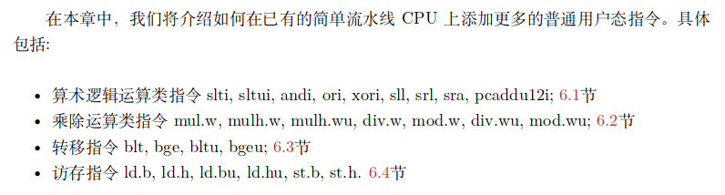
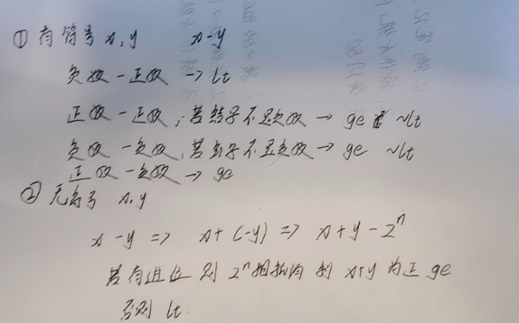

# C6 在流水线中增加用户态指令

## 目录

-   [1 算术逻辑运算类指令的添加](#1-算术逻辑运算类指令的添加)
-   [2 乘除法运算类指令的添加](#2-乘除法运算类指令的添加)
    -   [2.1 MUL Booth两位乘+Wallace Tree](#21-MUL-Booth两位乘Wallace-Tree)
    -   [2.2 DIV 不恢复余数法](#22-DIV-不恢复余数法)
    -   [2.3 添加mul、div、mod指令](#23-添加muldivmod指令)
        -   [2.3.1 实现指令译码](#231-实现指令译码)
        -   [2.3.2 产生控制信号](#232-产生控制信号)
        -   [2.3.3 exe组合逻辑例化mul、div](#233-exe组合逻辑例化muldiv)
        -   [2.3.4 利用互锁机制，阻塞IF、ID、EXE](#234-利用互锁机制阻塞IFIDEXE)
        -   [2.3.5 五选一选择最终exe\_finalResult](#235-五选一选择最终exe_finalResult)
    -   [2.4 最终的exp10 RTLcode](#24-最终的exp10-RTLcode)
        -   [2.4.1 id\_stage](#241-id_stage)
        -   [2.4.2 exe\_stage](#242-exe_stage)
        -   [2.4.3 mycpu.h](#243-mycpuh)
-   [3 转移指令的添加](#3-转移指令的添加)
    -   [3.1 指令译码](#31-指令译码)
    -   [3.2 控制信号的改变](#32-控制信号的改变)
    -   [3.3 分支条件判断](#33-分支条件判断)
-   [4 访存指令的添加](#4-访存指令的添加)
    -   [4.1 指令译码](#41-指令译码)
    -   [4.2 控制信号的增加](#42-控制信号的增加)
    -   [4.3 exe阶段写信号和写数据的改变](#43-exe阶段写信号和写数据的改变)
    -   [4.4 mem阶段读数据处理](#44-mem阶段读数据处理)
-   [5 最终所更改后的RTL code](#5-最终所更改后的RTL-code)
    -   [5.1 if\_stage](#51-if_stage)
    -   [5.2 id\_stage](#52-id_stage)
    -   [5.3 exe\_stage](#53-exe_stage)
    -   [5.4 mem\_stage](#54-mem_stage)
    -   [5.5 wb\_stage](#55-wb_stage)
    -   [5.6 mycpu\_top](#56-mycpu_top)
    -   [5.7 mycpu.h](#57-mycpuh)



## 1 算术逻辑运算类指令的添加

本节需要增加slti, sltui, andi, ori, xori, sll, srl, sra, pcaddu12i

只需要结合之前flop的设计添加对应的指令译码，以及控制信号生成逻辑即可，难度较小

主要的更改是ID阶段对alu\_op、need\_ui12、imm以及src1\_is\_pc

## 2 乘除法运算类指令的添加

本节需要增加mul.w, mulh.w, mulh.wu, div.w, mod.w, div.wu, mod.wu

首先需要实现mul模块和div模块，这两个已经在[MyCPU](https://www.wolai.com/oPSWP2V7h6mprRhZNdAWWE "MyCPU")中提到，这里直接使用verilog代码即可

### 2.1 MUL Booth两位乘+Wallace Tree

```verilog
//mul采用两位Booth算法实现
//YDecoder是进行i-1,i,i+1的比较 (i-1)+(i)-2(i+1)
module YDecoder (
    input  yc,
    yb,
    ya,  //yc为i+1,yb为i,yc为i-1
    output negx,
    x,
    neg2x,
    _2x  //输出-1,1,-2,2
);
  //这里为什么不输出0是因为这几个情况均不符合的或就是0
  assign negx = (yc & yb & ~ya) | (yc & ~yb & ya);  //-1 yc是1 yb和ya中有一个1
  assign x = (~yc & ~yb & ya) | (~yc & yb & ~ya);  //1 yc是0,yb和ya中有一个1
  assign neg2x = (yc & ~yb & ~ya);  //-2 yc是1 yb和ya都是0
  assign _2x = (~yc & yb & ya);  //2 yc是0 yb和ya都是1
endmodule


module BoothBase (
    input negx,
    x,
    neg2x,
    _2x,  //得到的y三项的计算项
    input InX,  //x本位值
    input PosLastX,
    NegLastX,  //正上一位的位值，负上一位的位值
    output PosNextX,
    NegNextX,  //正下一位的位值，负下一位的位值
    output OutX  //当前位的计算结果
);

  //negx,neg2x需要和当前位或者上一位的位值取反相与
  //x,_2x需要和当前位或者上一位的位值相与
  assign OutX = (negx & ~InX) | (x & InX) | (neg2x & NegLastX) | (_2x & PosLastX);
  assign PosNextX = InX;  //计算2倍项所需要的正位值
  assign NegNextX = ~InX;  //计算2倍项所需要的位值取反

endmodule


module BoothInterBase (
    input [2:0] y,
    input [63:0] InX,
    output [63:0] OutX,
    output Carry
);

  wire negx, x, neg2x, _2x;  //当前三位y所计算出的结果 y[0]+y[1]-2y[2]
  wire [1:0] CarrySig[64:0];  //用来存储每次的NextX的正结果和取反结果

  YDecoder uu (
      .yc(y[2]),
      .yb(y[1]),
      .ya(y[0]),
      .negx(negx),
      .x(x),
      .neg2x(neg2x),
      ._2x(_2x)
  );  //计算negx, x, neg2x, _2x

  BoothBase fir (
      .negx(negx),
      .x(x),
      .neg2x(neg2x),
      ._2x(_2x),
      .InX(InX[0]),
      .PosLastX(1'b0),
      .NegLastX(1'b1),
      .PosNextX(CarrySig[1][0]),
      .NegNextX(CarrySig[1][1]),
      .OutX(OutX[0])
  );  //进行部分积最低位值的计算

  //循环计算部分积的1-63位
  generate
    genvar i;
    for (i = 1; i < 64; i = i + 1) begin : gfor
      BoothBase ui (
          .negx(negx),
          .x(x),
          .neg2x(neg2x),
          ._2x(_2x),
          .InX(InX[i]),
          .PosLastX(CarrySig[i][0]),
          .NegLastX(CarrySig[i][1]),
          .PosNextX(CarrySig[i+1][0]),
          .NegNextX(CarrySig[i+1][1]),
          .OutX(OutX[i])
      );
    end
  endgenerate

  //赋进位值，当-1/-2时需要作减法，进位值为1
  assign Carry = negx || neg2x;

endmodule


module add64 (
    input  [63:0] A,
    B,
    C,
    output [63:0] Carry,
    S
);
  genvar i;
  generate
    for (i = 0; i < 64; i = i + 1) begin  //循环64位赋值
      assign {Carry[i], S[i]} = A[i] + B[i] + C[i];
    end
  endgenerate
  //产生的进位应该是加到下一位的，所以使用Carry时，整体左移一位
endmodule

module mul (
    input mul_clk,
    resetn,  //resetn低电平有效
    input mul_signed,  //进行有符号乘法还是无符号乘法
    input [31:0] x,
    y,  //x扩展至64位 y扩展至33位 区别有无符号
    output [63:0] result
);

  //整合赋值，扩展被乘数x和乘数y
  wire [63:0] CalX = mul_signed ? {{32{x[31]}}, x} : {32'b0, x};
  wire [32:0] CalY = mul_signed ? {y[31], y} : {1'b0, y};

  //计算Booth部分积  33/2向上取整为17个
  wire [16:0] Carry;  //booth计算得到的进位
  wire [63:0] BoothRes[16:0];  //booth的计算结果
  BoothInterBase fir (
      .y({CalY[1], CalY[0], 1'b0}),
      .InX(CalX),
      .OutX(BoothRes[0]),
      .Carry(Carry[0])
  );  //y1 y0 y-1

  generate
    genvar i;
    for (i = 2; i < 32; i = i + 2) begin : boothfor
      BoothInterBase ai (
          .y(CalY[i+1:i-1]),  //y3 y2 y1~y31 y30 y29
          .InX(CalX << i),  //被乘数左移位
          .OutX(BoothRes[i>>1]),
          .Carry(Carry[i>>1])
      );
    end
  endgenerate

  BoothInterBase las (
      .y({CalY[32], CalY[32], CalY[31]}),
      .InX(CalX << 32),
      .OutX(BoothRes[16]),
      .Carry(Carry[16])
  );  //奇数位的Booth两位乘，最后一次是再加上最高位进行比较


  reg [63:0] SecStageBoothRes[16:0];  //存储最终相加的部分积
  integer p;

  always @(*) begin
    if (resetn) begin  //同步时钟，低电平有效
      for (p = 0; p < 17; p = p + 1) begin
        SecStageBoothRes[p] <= Carry[p]+BoothRes[p];//BoothRes结果和减法变加法的进位相加
      end
    end
  end

  //Wallace Tree 因为Verilog的模块定义不允许使用数组，因此若将Wallace模块抽离出来，传参时需要传递17个数据，比较麻烦，因此这里直接嵌套Wallace
  wire [63:0] COut, SOut;

  wire [63:0] firSig[4:0];
  wire [63:0] firC  [4:0];
  add64 fir1 (
      .A(SecStageBoothRes[0]),
      .B(SecStageBoothRes[1]),
      .C(SecStageBoothRes[2]),
      .Carry(firC[0]),
      .S(firSig[0])
  );
  add64 fir2 (
      .A(SecStageBoothRes[3]),
      .B(SecStageBoothRes[4]),
      .C(SecStageBoothRes[5]),
      .Carry(firC[1]),
      .S(firSig[1])
  );
  add64 fir3 (
      .A(SecStageBoothRes[6]),
      .B(SecStageBoothRes[7]),
      .C(SecStageBoothRes[8]),
      .Carry(firC[2]),
      .S(firSig[2])
  );
  add64 fir4 (
      .A(SecStageBoothRes[9]),
      .B(SecStageBoothRes[10]),
      .C(SecStageBoothRes[11]),
      .Carry(firC[3]),
      .S(firSig[3])
  );
  add64 fir5 (
      .A(SecStageBoothRes[12]),
      .B(SecStageBoothRes[13]),
      .C(SecStageBoothRes[14]),
      .Carry(firC[4]),
      .S(firSig[4])
  );

  wire [63:0] secSig[3:0];
  wire [63:0] secC  [3:0];
  add64 sec1 (
      .A(SecStageBoothRes[15]),
      .B(SecStageBoothRes[16]),
      .C(firSig[0]),
      .Carry(secC[0]),
      .S(secSig[0])
  );
  add64 sec2 (
      .A(firC[0] << 1),
      .B(firSig[1]),
      .C(firC[1] << 1),
      .Carry(secC[1]),
      .S(secSig[1])
  );
  add64 sec3 (
      .A(firSig[2]),
      .B(firC[2] << 1),
      .C(firSig[3]),
      .Carry(secC[2]),
      .S(secSig[2])
  );
  add64 sec4 (
      .A(firC[3] << 1),
      .B(firSig[4]),
      .C(firC[4] << 1),
      .Carry(secC[3]),
      .S(secSig[3])
  );

  wire [63:0] thiSig[1:0];
  wire [63:0] thiC  [1:0];
  add64 thi1 (
      .A(secC[0] << 1),
      .B(secSig[0]),
      .C(secC[1] << 1),
      .Carry(thiC[0]),
      .S(thiSig[0])
  );
  add64 thi2 (
      .A(secSig[1]),
      .B(secC[2] << 1),
      .C(secSig[2]),
      .Carry(thiC[1]),
      .S(thiSig[1])
  );

  wire [63:0] forSig[1:0];
  wire [63:0] forC  [1:0];
  add64 for1 (
      .A(secC[3] << 1),
      .B(secSig[3]),
      .C(thiC[0] << 1),
      .Carry(forC[0]),
      .S(forSig[0])
  );
  add64 for2 (
      .A(thiSig[0]),
      .B(thiC[1] << 1),
      .C(thiSig[1]),
      .Carry(forC[1]),
      .S(forSig[1])
  );

  wire [63:0] fifSig, fifC;
  add64 fif1 (
      .A(forC[0] << 1),
      .B(forSig[0]),
      .C(forC[1] << 1),
      .Carry(fifC),
      .S(fifSig)
  );

  add64 six1 (
      .A(forSig[1]),
      .B(fifSig),
      .C(fifC << 1),
      .Carry(COut),
      .S(SOut)
  );

  assign result = SOut + (COut << 1);  //+的运算优先级高于<<

endmodule

```

mul需要输入的端口有mul\_clk(对接clk)，reset(对接resetn)、mul\_signed需要id阶段输出给exe\_reg，x(对接DataA)，y(对接DataB)

### 2.2 DIV 不恢复余数法

```verilog
//x/y   //32位操作数，同mul的处理，根据有无符号需要扩展，因此除数33位，从32到0需要33个时钟周期，再加上0的计算，到34时钟周期上沿时得到结果
module div (
    input div_clk,
    resetn,  //div时钟，复位信号高有效
    input div,  //表示当前进行的操作是除法——计算过程中div始终保持有效
    input div_signed,  //高电平有符号除
    input [31:0] x,
    y,  //被除数、除数
    output [31:0] s,
    r,  //商、余数
    output complete_delay  //这里直接输出complete_delay,有效时即得到商和余数
);


  reg [32:0] UnsignS, UnsignR;  //不经过符号处理的商和余数
  reg [32:0] tmp_r;  //存储计算过程中的余数
  reg [ 7:0] count;  //计算周期
  wire [32:0] tmp_d,tmp_add,tmp_sub;//存储新计算得到的余数，余数加除数，余数减除数
  wire [32:0] result_r;  //新产生的余数
  wire [32:0] UnsignX, UnsignY;//根据是否进行有符号除法，进行扩展转换成无符号数

  reg  div_signed_buffer; //因为涉及到多个周期，为了防止中途有新的输入，需要暂存当前计算的符合
  reg x_31_buffer;  //缓存x符号
  reg y_31_buffer;  //缓存y符号
  wire real_div_signed;  //在刚开始时的div_signed和结束时的div_signed_buffer中选择
  wire real_x_31;  //在刚开始时的y_31和结束时的div_signed_buffer中选择
  wire real_y_31;  //在刚开始时的y_31和结束时的div_signed_buffer中选择
  wire complete;  //商计算完成
  wire real_complete;  //余数和商产生的整个时间
  assign complete_delay = (count == 8'hf0);  //余数计算完成
  assign real_complete  = complete_delay || complete;


  always @(posedge div_clk) begin
    if (~resetn) begin  //初始化
      div_signed_buffer <= 1'b0;
      x_31_buffer <= 1'b0;
      y_31_buffer <= 1'b0;
    end else if (div) begin  //进行除法
      div_signed_buffer <= div_signed;
      x_31_buffer <= x[31];
      y_31_buffer <= y[31];
    end
  end

  //计算刚开始时，需要根据div_signed作处理，计算结束时，根据div_signed_buffer处理
  assign real_div_signed = real_complete ? div_signed_buffer : div_signed;
  assign real_x_31 = real_complete ? x_31_buffer : x[31];
  assign real_y_31 = real_complete ? y_31_buffer : y[31];

  assign UnsignX = {1'b0, (real_div_signed ? (x[31] ? (~x + 32'b1) : x) : x)};  //按无符号处理
  assign UnsignY = {1'b0, (real_div_signed ? (y[31] ? (~y + 32'b1) : y) : y)};

  always @(posedge div_clk) begin  //除法计算 采用同步赋值
    if (~resetn | ~div | complete_delay) begin
      count <= 8'd32;
      tmp_r <= 33'b0;
    end else if (~(count[7])) begin  //count为8'ff 
      if (tmp_d[32]) begin  //当前结果为负数，那么商上0
        UnsignS <= {UnsignS[31:0], 1'b0};
      end else begin  //当前结果为正数，商上1
        UnsignS <= {UnsignS[31:0], 1'b1};
      end
      tmp_r <= tmp_d;
      count <= count - 8'd1;
    end else begin  //计算余数
      if (tmp_r[32]) begin  //余数结果为负，加除数修复
        UnsignR <= tmp_r + UnsignY;
      end else begin
        UnsignR <= tmp_r;
      end
      count <= 8'hf0;
    end

  end

  assign complete = (count == 8'hff);  //商计算完成

  assign result_r = {
    tmp_r[31:0], UnsignX[count]
  };  //相当于不移动被除数，但也做到了低位补充被除数当前运算要补充到剩余余数的数
  assign tmp_sub = result_r - UnsignY;  //余数-除数
  assign tmp_add = result_r + UnsignY;  //余数+除数
  assign tmp_d = tmp_r[32]?tmp_add:tmp_sub;//若上一次余数为负，则选择tmp_add否则选择tmp_sub

  //根据要进行的有无符号计算，对无符号结果进行处理 被除数和除数异号那么商就是负，余数和被除数符号相同
  wire [32:0] TmpS, TmpR;
  assign TmpS = (real_div_signed ? ((real_x_31 == real_y_31) ? UnsignS : ~(UnsignS - 1)) : UnsignS);
  assign TmpR = (real_div_signed ? (real_x_31 ? ~(UnsignR - 1) : UnsignR) : UnsignR);

  assign s = TmpS[31:0];
  assign r = TmpR[31:0];

endmodule

```

div模块需要输入的div\_clk、reset、x、y同mul模块；输入的div\_signed需要id阶段传输到exe\_reg，div也需要由执行阶段传递过来

### 2.3 添加mul、div、mod指令

#### 2.3.1 实现指令译码

```verilog
  wire inst_mul = d_op_31_26_d[6'h00] & d_op_25_22_d[4'h0] & d_op_21_20_d[2'h1] &d_op_19_15_d[5'h18] ;
  wire inst_mulh = d_op_31_26_d[6'h00] & d_op_25_22_d[4'h0] & d_op_21_20_d[2'h1] &d_op_19_15_d[5'h19] ;
  wire inst_mulhu = d_op_31_26_d[6'h00] & d_op_25_22_d[4'h0] & d_op_21_20_d[2'h1] &d_op_19_15_d[5'h1a] ;
  wire inst_div = d_op_31_26_d[6'h00] & d_op_25_22_d[4'h0] & d_op_21_20_d[2'h2] &d_op_19_15_d[5'h00] ;
  wire inst_mod = d_op_31_26_d[6'h00] & d_op_25_22_d[4'h0] & d_op_21_20_d[2'h2] &d_op_19_15_d[5'h01] ;
  wire inst_divu = d_op_31_26_d[6'h00] & d_op_25_22_d[4'h0] & d_op_21_20_d[2'h2] &d_op_19_15_d[5'h02] ;
  wire inst_modu = d_op_31_26_d[6'h00] & d_op_25_22_d[4'h0] & d_op_21_20_d[2'h2] &d_op_19_15_d[5'h03] ;
```

#### 2.3.2 产生控制信号

ID阶段产生标识mul\_designed、div\_designed、div以及alu+mul+div结果五选一的选择信号

```verilog
  wire div_signed;
  wire mul_signed;
  wire div;
  wire [2:0] aluMD_resSelect;

  assign div_signed = inst_div | inst_mod;
  assign mul_signed = inst_mul | inst_mulh;
  assign div = inst_mod | inst_modu | inst_div | inst_divu;
  assign aluMD_resSelect = inst_mul ? 3'b001 :
                          (inst_mulh | inst_mulhu ? 3'b010 :
                          (inst_div | inst_divu ? 3'b011 :
                          (inst_mod | inst_modu ? 3'b100 : 3'b000)) );
```

然后将这些控制信号传递给exe\_reg

#### 2.3.3 exe组合逻辑例化mul、div

```verilog
//mul
  wire [63:0] exe_mulResult;
  mul u_mul (
      .mul_clk   (clk),
      .resetn    (resetn),
      .mul_signed(mul_signed),
      .x         (DataA),
      .y         (DataB),
      .result    (exe_mulResult)
  );

  //div
  wire [31:0] s;
  wire [31:0] r;
  wire complete_delay; //单使用complete_delay使得除法的exe多计算了一个节拍
  div u_div (
      .div_clk       (clk),
      .resetn        (resetn),
      .div           (div),
      .div_signed    (div_signed),
      .x             (DataA),
      .y             (DataB),
      .s             (s),
      .r             (r),
      .complete_delay(complete_delay)
  );
```

#### 2.3.4 利用互锁机制，阻塞IF、ID、EXE

当exe阶段正在做除法，且除法并没有计算完成时，阻塞

```verilog
  assign exe_ready_go = div ? complete_delay : 1'b1;//如果当前exe阶段组合逻辑正在计算div且complete_delay未高有效，那么阻塞exe

```

#### 2.3.5 五选一选择最终exe\_finalResult

```verilog
  //选择最后exe计算数据
  wire [31:0] exe_finalResult;
  assign exe_finalResult = {32{aluMD_resSelect == 3'b000}} & exe_aluResult       |
                           {32{aluMD_resSelect == 3'b001}} & exe_mulResult[31:0] |
                           {32{aluMD_resSelect == 3'b010}} & exe_mulResult[63:32]|
                           {32{aluMD_resSelect == 3'b011}} & s                   |
                           {32{aluMD_resSelect == 3'b100}} & r;
```

### 2.4 最终的exp10 RTLcode

在exp9的基础上，所修改了的文件是id\_stage、exe\_stage、mycpu.h

#### 2.4.1 id\_stage

```verilog
`timescale 1ns / 1ps
`include "mycpu.h"

module id_stage (
    input wire clk,
    input wire resetn,

    //与上一级传递通讯的流水线控制信号 
    output wire id_allowin,
    input wire if_to_id_valid,
    input wire [`IF_TO_ID_WD-1:0] if_to_id_bus,

    //与下一级传递通讯的流水线控制信号 
    input wire exe_allowin,
    output wire id_to_exe_valid,
    output wire [`ID_TO_EXE_WD-1:0] id_to_exe_bus,

    //id组合逻辑传递给if组合逻辑的一些用于生成nextpc的信号
    output wire [`ID_TO_IF_WD-1:0] id_to_if_bus,

    //exe组合逻辑传递给id组合逻辑的用于写寄存器的信号
    input wire [`EXE_TO_ID_WD-1:0] exe_to_id_bus,

    //mem组合逻辑传递给id组合逻辑的用于写寄存器的信号
    input wire [`MEM_TO_ID_WD-1:0] mem_to_id_bus,

    //wb组合逻辑传递给id组合逻辑的用于写寄存器的信号
    input wire [`WB_TO_ID_WD-1:0] wb_to_id_bus
);
  //id_reg
  reg id_valid;
  wire id_ready_go;
  reg [`IF_TO_ID_WD-1:0] id_data;  //id_reg的数据
  wire br_taken;
  wire br_taken_cancel;

  assign id_allowin = ~id_valid | id_ready_go & exe_allowin;
  assign id_to_exe_valid = id_valid & id_ready_go;

  always @(posedge clk) begin
    if (~resetn) begin
      id_valid <= 1'b0;
    end else if (br_taken_cancel) begin  //如果采取分支，那么取消当前IF阶段的指令
      id_valid <= 1'b0;
    end else if (id_allowin) begin
      id_valid <= if_to_id_valid;
    end
    if (id_allowin & if_to_id_valid) begin
      id_data <= if_to_id_bus;
    end
  end

  //拆解if_reg传递过来的数据
  wire [31:0] id_pc;
  wire [31:0] id_inst;
  assign {id_pc, id_inst} = id_data;

  //拆解exe组合逻辑送来的数据
  wire exe_valid;
  wire exe_regW;
  wire exe_res_from_mem;
  wire [4:0] exe_regWAddr;
  wire [31:0] exe_regWData;
  assign {exe_valid, exe_res_from_mem, exe_regW, exe_regWAddr, exe_regWData} = exe_to_id_bus;

  //拆解mem组合逻辑送来的数据
  wire mem_valid;
  wire mem_regW;
  wire [4:0] mem_regWAddr;
  wire [31:0] mem_regWData;
  assign {mem_valid, mem_regW, mem_regWAddr, mem_regWData} = mem_to_id_bus;

  //拆解wb组合逻辑传递过来的数据
  wire wb_valid;
  wire wb_regW;
  wire [4:0] wb_regWAddr;
  wire [31:0] wb_regWData;
  assign {wb_valid, wb_regW, wb_regWAddr, wb_regWData} = wb_to_id_bus;

  //指令拆解
  wire [ 5:0] op_31_26;
  wire [ 3:0] op_25_22;
  wire [ 1:0] op_21_20;
  wire [ 4:0] op_19_15;
  wire [ 4:0] rd;
  wire [ 4:0] rj;
  wire [ 4:0] rk;
  wire [11:0] i12;
  wire [19:0] i20;
  wire [15:0] i16;
  wire [25:0] i26;

  assign op_31_26 = id_inst[31:26];
  assign op_25_22 = id_inst[25:22];
  assign op_21_20 = id_inst[21:20];
  assign op_19_15 = id_inst[19:15];
  assign rd = id_inst[4:0];
  assign rj = id_inst[9:5];
  assign rk = id_inst[14:10];
  assign i12 = id_inst[21:10];
  assign i20 = id_inst[24:5];
  assign i16 = id_inst[25:10];
  assign i26 = {id_inst[9:0], id_inst[25:10]};

  //译码器译码
  wire [63:0] op_31_26_d;
  wire [15:0] op_25_22_d;
  wire [ 3:0] op_21_20_d;
  wire [31:0] op_19_15_d;

  decoder_6_64 u_dec0 (
      .in (op_31_26),
      .out(op_31_26_d)
  );
  decoder_4_16 u_dec1 (
      .in (op_25_22),
      .out(op_25_22_d)
  );
  decoder_2_4 u_dec2 (
      .in (op_21_20),
      .out(op_21_20_d)
  );
  decoder_5_32 u_dec3 (
      .in (op_19_15),
      .out(op_19_15_d)
  );

  //译码指令
  wire inst_add = op_31_26_d[6'h00] & op_25_22_d[4'h0] & op_21_20_d[2'h1] & op_19_15_d[5'h00];
  wire inst_sub = op_31_26_d[6'h00] & op_25_22_d[4'h0] & op_21_20_d[2'h1] & op_19_15_d[5'h02];
  wire inst_slt = op_31_26_d[6'h00] & op_25_22_d[4'h0] & op_21_20_d[2'h1] & op_19_15_d[5'h04];
  wire inst_sltu = op_31_26_d[6'h00] & op_25_22_d[4'h0] & op_21_20_d[2'h1] & op_19_15_d[5'h05];
  wire inst_nor = op_31_26_d[6'h00] & op_25_22_d[4'h0] & op_21_20_d[2'h1] & op_19_15_d[5'h08];
  wire inst_and = op_31_26_d[6'h00] & op_25_22_d[4'h0] & op_21_20_d[2'h1] & op_19_15_d[5'h09];
  wire inst_or = op_31_26_d[6'h00] & op_25_22_d[4'h0] & op_21_20_d[2'h1] & op_19_15_d[5'h0a];
  wire inst_xor = op_31_26_d[6'h00] & op_25_22_d[4'h0] & op_21_20_d[2'h1] & op_19_15_d[5'h0b];
  wire inst_sll = op_31_26_d[6'h00] & op_25_22_d[4'h0] & op_21_20_d[2'h1] & op_19_15_d[5'h0e];
  wire inst_srl = op_31_26_d[6'h00] & op_25_22_d[4'h0] & op_21_20_d[2'h1] & op_19_15_d[5'h0f];
  wire inst_sra = op_31_26_d[6'h00] & op_25_22_d[4'h0] & op_21_20_d[2'h1] & op_19_15_d[5'h10];
  wire inst_mul = op_31_26_d[6'h00] & op_25_22_d[4'h0] & op_21_20_d[2'h1] & op_19_15_d[5'h18];
  wire inst_mulh = op_31_26_d[6'h00] & op_25_22_d[4'h0] & op_21_20_d[2'h1] & op_19_15_d[5'h19];
  wire inst_mulhu = op_31_26_d[6'h00] & op_25_22_d[4'h0] & op_21_20_d[2'h1] & op_19_15_d[5'h1a];
  wire inst_div = op_31_26_d[6'h00] & op_25_22_d[4'h0] & op_21_20_d[2'h2] & op_19_15_d[5'h00];
  wire inst_mod = op_31_26_d[6'h00] & op_25_22_d[4'h0] & op_21_20_d[2'h2] & op_19_15_d[5'h01];
  wire inst_divu = op_31_26_d[6'h00] & op_25_22_d[4'h0] & op_21_20_d[2'h2] & op_19_15_d[5'h02];
  wire inst_modu = op_31_26_d[6'h00] & op_25_22_d[4'h0] & op_21_20_d[2'h2] & op_19_15_d[5'h03];
  wire inst_slli = op_31_26_d[6'h00] & op_25_22_d[4'h1] & op_21_20_d[2'h0] & op_19_15_d[5'h01];
  wire inst_srli = op_31_26_d[6'h00] & op_25_22_d[4'h1] & op_21_20_d[2'h0] & op_19_15_d[5'h09];
  wire inst_srai = op_31_26_d[6'h00] & op_25_22_d[4'h1] & op_21_20_d[2'h0] & op_19_15_d[5'h11];
  wire inst_slti = op_31_26_d[6'h00] & op_25_22_d[4'h8];
  wire inst_sltui = op_31_26_d[6'h00] & op_25_22_d[4'h9];
  wire inst_addi = op_31_26_d[6'h00] & op_25_22_d[4'ha];
  wire inst_andi = op_31_26_d[6'h00] & op_25_22_d[4'hd];
  wire inst_ori = op_31_26_d[6'h00] & op_25_22_d[4'he];
  wire inst_xori = op_31_26_d[6'h00] & op_25_22_d[4'hf];
  wire inst_pcaddu12i = op_31_26_d[6'h07] & ~id_inst[25];
  wire inst_ld_w = op_31_26_d[6'h0a] & op_25_22_d[4'h2];
  wire inst_st_w = op_31_26_d[6'h0a] & op_25_22_d[4'h6];
  wire inst_jirl = op_31_26_d[6'h13];
  wire inst_b = op_31_26_d[6'h14];
  wire inst_bl = op_31_26_d[6'h15];
  wire inst_beq = op_31_26_d[6'h16];
  wire inst_bne = op_31_26_d[6'h17];
  wire inst_lu12i = op_31_26_d[6'h05] & ~id_inst[25];

  //控制信号译码
  wire [11:0] alu_op;
  wire res_from_mem;
  wire src_reg_is_rd;
  wire src1_is_pc;
  wire src2_is_imm;
  wire src2_is_4;
  wire dst_is_r1;
  wire id_memW;
  wire id_regW;
  wire need_ui5;
  wire need_ui12;
  wire need_si12;
  wire need_si16;
  wire need_si20;
  wire need_si26;
  wire need_rj;
  wire need_rkd;

  assign alu_op[0] = inst_add | inst_addi | inst_ld_w | inst_st_w | inst_jirl | inst_bl | inst_pcaddu12i;
  assign alu_op[1] = inst_sub;
  assign alu_op[2] = inst_slt | inst_slti;
  assign alu_op[3] = inst_sltu | inst_sltui;
  assign alu_op[4] = inst_and | inst_andi;
  assign alu_op[5] = inst_nor;
  assign alu_op[6] = inst_or | inst_ori;
  assign alu_op[7] = inst_xor | inst_xori;
  assign alu_op[8] = inst_sll | inst_slli;
  assign alu_op[9] = inst_srl | inst_srli;
  assign alu_op[10] = inst_sra | inst_srai;
  assign alu_op[11] = inst_lu12i;
  assign res_from_mem = inst_ld_w;
  assign src_reg_is_rd = inst_beq | inst_bne | inst_st_w;
  assign src1_is_pc = inst_jirl | inst_bl | inst_pcaddu12i;
  assign src2_is_imm = inst_slli     | 
                       inst_srli     |
                       inst_srai     |
                       inst_addi     |
                       inst_ld_w     |
                       inst_st_w     |
                       inst_lu12i    |
                       inst_jirl     |
                       inst_bl       |
                       inst_slti     |
                       inst_sltui    |
                       inst_andi     |
                       inst_ori      |
                       inst_xori     |
                       inst_pcaddu12i;
  assign src2_is_4 = inst_jirl | inst_bl;
  assign dst_is_r1 = inst_bl;
  assign id_memW = inst_st_w;
  assign id_regW = ~inst_st_w & ~inst_beq & ~inst_bne & ~inst_b;
  assign need_ui5 = inst_slli | inst_srli | inst_srai;
  assign need_si12 = inst_addi | inst_ld_w | inst_st_w | inst_slti | inst_sltui;
  assign need_ui12 = inst_andi | inst_ori | inst_xori;
  assign need_si16 = inst_jirl | inst_beq | inst_bne;
  assign need_si20 = inst_lu12i | inst_pcaddu12i;
  assign need_si26 = inst_b | inst_bl;
  assign need_rj = ~inst_b | inst_bl;
  assign need_rkd = ~inst_slli | ~inst_srli | ~inst_srai | ~inst_addi | ~inst_ld_w 
                  | ~inst_st_w | ~inst_jirl | ~inst_b | ~inst_bl | ~inst_beq | ~inst_bne;

  //id阶段组合逻辑数据生成
  wire [31:0] imm;
  wire [31:0] br_offs;
  wire [31:0] jirl_offs;

  assign imm = src2_is_4 ? 32'h4 :
              (need_si20 ? {i20[19:0],12'b0} :
              (need_si12 ? {{20{i12[11]}},i12[11:0]} :
              (need_ui12 ? {20'b0,i12[11:0]} :
              {27'b0,rk})));
  assign br_offs = need_si26 ? {{4{i26[25]}}, i26[25:0], 2'b0} : {{14{i16[15]}}, i16[15:0], 2'b0};
  assign jirl_offs = {{14{i16[5]}}, i16[15:0], 2'b0};


  //寄存器堆
  wire [ 4:0] regAddrA;
  wire [ 4:0] regAddrB;
  wire [31:0] regDataA;
  wire [31:0] regDataB;
  wire [ 4:0] id_regWAddr;

  assign regAddrA = rj;
  assign regAddrB = src_reg_is_rd ? rd : rk;
  assign id_regWAddr = dst_is_r1 ? 5'b1 : rd;

  regfile u_regfile (
      .clk   (clk),
      .raddr1(regAddrA),
      .rdata1(regDataA),
      .raddr2(regAddrB),
      .rdata2(regDataB),
      .we    (wb_regW),
      .waddr (wb_regWAddr),
      .wdata (wb_regWData)
  );

  //前递设计 当前指令是否需要读寄存器数 地址非0 存不存在指令
  wire [31:0] forwardDataA;
  wire [31:0] forwardDataB;

  assign forwardDataA = id_valid & need_rj & regAddrA != 5'b0 ?
                        (exe_valid & exe_regW & exe_regWAddr == regAddrA ? exe_regWData :
                        (mem_valid & mem_regW & mem_regWAddr == regAddrA ? mem_regWData :
                        (wb_valid & wb_regW & wb_regWAddr == regAddrA ? wb_regWData : regDataA))) :regDataA;
  assign forwardDataB = id_valid & need_rkd & regAddrB != 5'b0 ?
                        (exe_valid & exe_regW & exe_regWAddr == regAddrB ? exe_regWData :
                        (mem_valid & mem_regW & mem_regWAddr == regAddrB ? mem_regWData :
                        (wb_valid & wb_regW & wb_regWAddr == regAddrB ? wb_regWData : regDataB))) :regDataB;

  wire load_delay;  //load_delay

  assign load_delay = id_valid & ((need_rj & regAddrA != 5'b0 & exe_valid & exe_res_from_mem & exe_regWAddr == regAddrA) |
                                  (need_rkd & regAddrB != 5'b0 & exe_valid & exe_res_from_mem & exe_regWAddr == regAddrB));
  assign id_ready_go = ~load_delay;

  //分支判断
  wire [31:0] DataA;
  wire [31:0] DataB;
  wire [31:0] br_target;
  wire rj_eq_rd;

  assign DataA = src1_is_pc ? id_pc : forwardDataA;
  assign DataB = src2_is_imm ? imm : forwardDataB;
  assign rj_eq_rd = (DataA == DataB);
  assign br_taken = (inst_beq &  rj_eq_rd |
                     inst_bne & ~rj_eq_rd |
                     inst_jirl            | 
                     inst_bl              |
                     inst_b
  ) && id_valid;

  assign br_target = (inst_beq | inst_bne | inst_bl | inst_b) ? (id_pc + br_offs) : (regDataA + jirl_offs);
  assign br_taken_cancel = br_taken & id_ready_go;  //当阻塞完成时，br_taken_cancel才与br_taken一致有效

  //乘除相关控制信号
  wire div_signed;
  wire mul_signed;
  wire div;
  wire [2:0] aluMD_resSelect;

  assign div_signed = inst_div | inst_mod;
  assign mul_signed = inst_mul | inst_mulh;
  assign div = inst_mod | inst_modu | inst_div | inst_divu;
  assign aluMD_resSelect = inst_mul ? 3'b001 :
                          (inst_mulh | inst_mulhu ? 3'b010 :
                          (inst_div | inst_divu ? 3'b011 :
                          (inst_mod | inst_modu ? 3'b100 : 3'b000)) );

  //封包id组合逻辑传递给if组合逻辑preIF的数据
  assign id_to_if_bus = {br_taken, br_target, br_taken_cancel};

  //封包id组合逻辑传递给exe_reg的数据
  assign id_to_exe_bus = {
    alu_op,
    res_from_mem,
    id_regW,
    id_memW,
    id_regWAddr,
    DataA,
    DataB,
    div_signed,
    mul_signed,
    div,
    aluMD_resSelect,
    id_pc
  };

endmodule

```

#### 2.4.2 exe\_stage

```verilog
`timescale 1ns / 1ps
`include "mycpu.h"

module exe_stage (
    input wire clk,
    input wire resetn,

    //与上一级流水线通讯的流水线控制信号
    output wire exe_allowin,
    input wire id_to_exe_valid,
    input wire [`ID_TO_EXE_WD-1:0] id_to_exe_bus,

    //与下一级流水线通讯的流水线控制信号
    input wire mem_allowin,
    output wire exe_to_mem_valid,
    output wire [`EXE_TO_MEM_WD-1:0] exe_to_mem_bus,

    //传递给ID阶段的RAW相关判断
    output wire [`EXE_TO_ID_WD-1:0] exe_to_id_bus,

    //访dataRAM端口
    output wire        data_sram_en,
    output wire [ 3:0] data_sram_we,
    output wire [31:0] data_sram_addr,
    output wire [31:0] data_sram_wdata
);
  //exe_reg
  reg exe_valid;
  wire exe_ready_go;
  reg [`ID_TO_EXE_WD-1:0] exe_data;

  assign exe_allowin = ~exe_valid | exe_ready_go & mem_allowin;
  assign exe_to_mem_valid = exe_valid & exe_ready_go;
  always @(posedge clk) begin
    if (~resetn) begin
      exe_valid <= 1'b0;
    end else if (exe_allowin) begin
      exe_valid <= id_to_exe_valid;
    end
    if (exe_allowin & id_to_exe_valid) begin
      exe_data <= id_to_exe_bus;
    end
  end

  //解压缩id组合逻辑传递给exe_reg的信号
  wire [11:0] alu_op;
  wire res_from_mem;
  wire exe_regW;
  wire exe_memW;
  wire [4:0] exe_regWAddr;
  wire [31:0] DataA;
  wire [31:0] DataB;
  wire div_signed;
  wire mul_signed;
  wire div;
  wire [2:0] aluMD_resSelect;

  wire [31:0] exe_pc;
  assign {alu_op, res_from_mem, exe_regW, exe_memW, exe_regWAddr, DataA, DataB, div_signed,mul_signed,div,aluMD_resSelect,exe_pc} = exe_data;

  //alu
  wire [31:0] exe_aluResult;
  alu u_alu (
      .alu_op    (alu_op),
      .alu_src1  (DataA),
      .alu_src2  (DataB),
      .alu_result(exe_aluResult)
  );

  //mul
  wire [63:0] exe_mulResult;
  mul u_mul (
      .mul_clk   (clk),
      .resetn    (resetn),
      .mul_signed(mul_signed),
      .x         (DataA),
      .y         (DataB),
      .result    (exe_mulResult)
  );

  //div
  wire [31:0] s;
  wire [31:0] r;
  wire complete_delay;
  div u_div (
      .div_clk       (clk),
      .resetn        (resetn),
      .div           (div),
      .div_signed    (div_signed),
      .x             (DataA),
      .y             (DataB),
      .s             (s),
      .r             (r),
      .complete_delay(complete_delay)
  );

  assign exe_ready_go = div ? complete_delay : 1'b1;//如果当前exe阶段组合逻辑正在计算div且complete_delay未高有效，那么阻塞exe

  //访存接口
  assign data_sram_en = exe_valid & (exe_memW | res_from_mem);
  assign data_sram_we = {4{exe_memW}};
  assign data_sram_addr = exe_aluResult;
  assign data_sram_wdata = DataB;

  //选择最后exe计算数据
  wire [31:0] exe_finalResult;
  assign exe_finalResult = {32{aluMD_resSelect == 3'b000}} & exe_aluResult       |
                           {32{aluMD_resSelect == 3'b001}} & exe_mulResult[31:0] |
                           {32{aluMD_resSelect == 3'b010}} & exe_mulResult[63:32]|
                           {32{aluMD_resSelect == 3'b011}} & s                   |
                           {32{aluMD_resSelect == 3'b100}} & r;

  //封包exe组合逻辑传递给mem_reg的数据
  assign exe_to_mem_bus = {exe_regW, exe_regWAddr, res_from_mem, exe_finalResult, exe_pc};

  //封包exe传递给id的RAW相关判断
  assign exe_to_id_bus = {exe_valid, res_from_mem, exe_regW, exe_regWAddr, exe_finalResult};

endmodule

```

#### 2.4.3 mycpu.h

```verilog
`define IF_TO_ID_WD 64
`define ID_TO_IF_WD 34
`define ID_TO_EXE_WD 122
`define EXE_TO_MEM_WD 71
`define MEM_TO_WB_WD 70
`define WB_TO_ID_WD 39
`define EXE_TO_ID_WD 40
`define MEM_TO_ID_WD 39
```

## 3 转移指令的添加

本节需要添加blt、bge、bltu、bgeu

### 3.1 指令译码

```verilog
  wire inst_blt = op_31_26_d[6'h18];
  wire inst_bge = op_31_26_d[6'h19];
  wire inst_bltu = op_31_26_d[6'h1a];
  wire inst_bgeu = op_31_26_d[6'h1b];
```

### 3.2 控制信号的改变

连带着之前所加的指令

```verilog
  //控制信号译码
  wire [11:0] alu_op;
  wire res_from_mem;
  wire src_reg_is_rd;
  wire src1_is_pc;
  wire src2_is_imm;
  wire src2_is_4;
  wire dst_is_r1;
  wire id_memW;
  wire id_regW;
  wire need_ui5;
  wire need_ui12;
  wire need_si12;
  wire need_si16;
  wire need_si20;
  wire need_si26;
  wire need_rj;
  wire need_rkd;

  assign alu_op[0] = inst_add | inst_addi | inst_ld_w | inst_st_w | inst_jirl | inst_bl | inst_pcaddu12i;
  assign alu_op[1] = inst_sub;
  assign alu_op[2] = inst_slt | inst_slti;
  assign alu_op[3] = inst_sltu | inst_sltui;
  assign alu_op[4] = inst_and | inst_andi;
  assign alu_op[5] = inst_nor;
  assign alu_op[6] = inst_or | inst_ori;
  assign alu_op[7] = inst_xor | inst_xori;
  assign alu_op[8] = inst_sll | inst_slli;
  assign alu_op[9] = inst_srl | inst_srli;
  assign alu_op[10] = inst_sra | inst_srai;
  assign alu_op[11] = inst_lu12i;
  assign res_from_mem = inst_ld_w;
  assign src_reg_is_rd = inst_beq | inst_bne | inst_blt | inst_bge | inst_bltu | inst_bgeu | inst_st_w;
  assign src1_is_pc = inst_jirl | inst_bl | inst_pcaddu12i;
  assign src2_is_imm = inst_slli     | 
                       inst_srli     |
                       inst_srai     |
                       inst_addi     |
                       inst_ld_w     |
                       inst_st_w     |
                       inst_lu12i    |
                       inst_jirl     |
                       inst_bl       |
                       inst_slti     |
                       inst_sltui    |
                       inst_andi     |
                       inst_ori      |
                       inst_xori     |
                       inst_pcaddu12i;
  assign src2_is_4 = inst_jirl | inst_bl;
  assign dst_is_r1 = inst_bl;
  assign id_memW = inst_st_w;
  assign id_regW = ~inst_st_w & ~inst_beq & ~inst_bne & ~inst_blt & ~inst_bge & ~inst_bltu & ~inst_bgeu & ~inst_b;
  assign need_ui5 = inst_slli | inst_srli | inst_srai;
  assign need_si12 = inst_addi | inst_ld_w | inst_st_w | inst_slti | inst_sltui;
  assign need_ui12 = inst_andi | inst_ori | inst_xori;
  assign need_si16 = inst_jirl | inst_beq | inst_bne | inst_blt | inst_bge | inst_bltu | inst_bgeu;
  assign need_si20 = inst_lu12i | inst_pcaddu12i;
  assign need_si26 = inst_b | inst_bl;
  assign need_rj = ~inst_b & ~inst_bl & ~inst_lu12i & ~inst_pcaddu12i;
  assign need_rkd = ~inst_slli & ~inst_srli & ~inst_srai & ~inst_addi & ~inst_slti & ~inst_sltui & ~inst_andi & ~inst_ori & ~inst_xori
                  & ~inst_lu12i & ~inst_pcaddu12i & ~inst_ld_w & ~inst_jirl & ~inst_b & ~inst_bl;
```

### 3.3 分支条件判断

分支条件的判断借鉴alu设计中的slt、sltu的比较——将操作数做减法（减数取反，低位进位为1），使用全加器相加。根据所得的结果、进位以及原操作数符号判断lt or ge

被减数为负数，减数为正数→lt

被减数、减数符号相同，但是结果是负数→lt

无符号的被减数、减数，无进位→ltu



```verilog
//分支判断
  wire [31:0] DataA;
  wire [31:0] DataB;
  wire [31:0] ltA;
  wire [31:0] ltB;
  wire cin;
  wire [31:0] ltResult;
  wire cout;
  wire [31:0] br_target;
  wire rj_eq_rd;
  wire rj_lt_rd;
  wire rj_ltu_rd;

  assign DataA = src1_is_pc ? id_pc : forwardDataA;
  assign DataB = src2_is_imm ? imm : forwardDataB;

  assign ltA = DataA;
  assign ltB = ~DataB;
  assign cin = 1;
  assign {cout, ltResult} = ltA + ltB + cin;

  assign rj_lt_rd = (~DataA[31] & DataB[31]) | (~(DataA[31] ^ DataB[31]) & ltResult[31]);
  assign rj_ltu_rd = ~cout;
  assign rj_eq_rd = (DataA == DataB);
  assign br_taken = (inst_beq  &  rj_eq_rd |
                     inst_bne  & ~rj_eq_rd |
                     inst_blt  &  rj_lt_rd |
                     inst_bge  & ~rj_lt_rd |
                     inst_bltu &  rj_ltu_rd|
                     inst_bgeu & ~rj_ltu_rd|
                     inst_jirl             | 
                     inst_bl               |
                     inst_b
  ) && id_valid;

  assign br_target = (inst_beq | inst_bne | inst_bge | inst_blt | inst_bltu | inst_bgeu | inst_bl | inst_b) ? (id_pc + br_offs) : (regDataA + jirl_offs);
```

## 4 访存指令的添加

本节需要增加ld.b、ld.h、ld.bu、ld.hu、st.b、st.h

### 4.1 指令译码

### 4.2 控制信号的增加

```verilog
  //控制信号译码
  wire [11:0] alu_op;
  wire res_from_mem;
  wire src_reg_is_rd;
  wire src1_is_pc;
  wire src2_is_imm;
  wire src2_is_4;
  wire dst_is_r1;
  wire id_memW;
  wire id_regW;
  wire need_ui5;
  wire need_ui12;
  wire need_si12;
  wire need_si16;
  wire need_si20;
  wire need_si26;
  wire need_rj;
  wire need_rkd;

  assign alu_op[0] = inst_add | inst_addi | inst_ld_w | inst_ld_b | inst_ld_h | inst_ld_bu | inst_ld_hu | inst_st_w 
                   | inst_st_b | inst_st_h | inst_jirl | inst_bl | inst_pcaddu12i;
  assign alu_op[1] = inst_sub;
  assign alu_op[2] = inst_slt | inst_slti;
  assign alu_op[3] = inst_sltu | inst_sltui;
  assign alu_op[4] = inst_and | inst_andi;
  assign alu_op[5] = inst_nor;
  assign alu_op[6] = inst_or | inst_ori;
  assign alu_op[7] = inst_xor | inst_xori;
  assign alu_op[8] = inst_sll | inst_slli;
  assign alu_op[9] = inst_srl | inst_srli;
  assign alu_op[10] = inst_sra | inst_srai;
  assign alu_op[11] = inst_lu12i;
  assign res_from_mem = inst_ld_w | inst_ld_b | inst_ld_h | inst_ld_bu | inst_ld_hu;
  assign src_reg_is_rd = inst_beq | inst_bne | inst_blt | inst_bge | inst_bltu | inst_bgeu | inst_st_w | inst_st_b | inst_st_h;
  assign src1_is_pc = inst_jirl | inst_bl | inst_pcaddu12i;
  assign src2_is_imm = inst_slli     | 
                       inst_srli     |
                       inst_srai     |
                       inst_addi     |
                       inst_ld_w     | 
                       inst_ld_b     |
                       inst_ld_h     | 
                       inst_ld_bu    | 
                       inst_ld_hu    |
                       inst_st_w     |
                       inst_st_b     |
                       inst_st_h     |
                       inst_lu12i    |
                       inst_jirl     |
                       inst_bl       |
                       inst_slti     |
                       inst_sltui    |
                       inst_andi     |
                       inst_ori      |
                       inst_xori     |
                       inst_pcaddu12i;
  assign src2_is_4 = inst_jirl | inst_bl;
  assign dst_is_r1 = inst_bl;
  assign id_memW = inst_st_w | inst_st_b | inst_st_h;
  assign id_regW = ~inst_st_w & ~inst_st_b & ~inst_st_h & ~inst_beq & ~inst_bne & ~inst_blt & ~inst_bge & ~inst_bltu & ~inst_bgeu & ~inst_b;
  assign need_ui5 = inst_slli | inst_srli | inst_srai;
  assign need_si12 = inst_addi | inst_ld_w | inst_ld_b | inst_ld_h | inst_ld_bu | inst_ld_hu | inst_st_w | inst_st_b | inst_st_h |inst_slti | inst_sltui;
  assign need_ui12 = inst_andi | inst_ori | inst_xori;
  assign need_si16 = inst_jirl | inst_beq | inst_bne | inst_blt | inst_bge | inst_bltu | inst_bgeu;
  assign need_si20 = inst_lu12i | inst_pcaddu12i;
  assign need_si26 = inst_b | inst_bl;
  assign need_rj = ~inst_b & ~inst_bl & ~inst_lu12i & ~inst_pcaddu12i;
  assign need_rkd = ~inst_slli & ~inst_srli & ~inst_srai & ~inst_addi & ~inst_slti & ~inst_sltui & ~inst_andi & ~inst_ori & ~inst_xori
                  & ~inst_lu12i & ~inst_pcaddu12i & ~inst_ld_w & ~inst_ld_b & ~inst_ld_bu & ~inst_ld_h & ~inst_ld_hu & ~inst_jirl & ~inst_b & ~inst_bl;
```

增加了st指令需要做add运算、需要读rd寄存器、第二个运算操作数是立即数、不需要写寄存器、需要12位的有符号立即数

增加了ld指令需要做add运算，第二个运算操作数是立即数，需要12位的有符号立即数，不需要读rj/rd寄存器

此外还需要增加读写数据位宽，以及load时的有无符号控制——需要按照流水传递到mem阶段

```verilog
  //访存位宽控制、符号控制
  wire [1:0] memINS_rec;
  wire load_sign;

  assign memINS_rec = {2{inst_ld_b | inst_ld_bu | inst_st_b}} & 2'b01 |
                       {2{inst_ld_h | inst_ld_hu | inst_st_h}} & 2'b10 |
                       {2{inst_ld_w | inst_st_w}}              & 2'b11 ;
  assign load_sign = inst_ld_b | inst_ld_h | inst_ld_w;
```

### 4.3 exe阶段写信号和写数据的改变

写信号——对应31-0的4组8位

前提：exe阶段有指令且指令是写存储的

如果访存指令标识是2'b01，那么如果地址末两位是00，则写信号是4'b0001；如果地址末两位是01，那写信号是4'b0010；如果地址末两位是10，那么写信号是4'b0100；如果地址末两位是11，那么写信号是4'b1000

如果访存指令标识是2'b10，那么如果地址末两位是00，则写信号是4'b0011，如果地址是10，那写信号是4'b1100

如果访存指令标识是2'b11，那么写信号是4'b1111

写数据

如果访存指令标识是2'b01，那么写数据是4组Data\[7:0]

如果访存指令标识是2'b10，那么写数据是2组Data\[15:0]

如果访存指令标识是2'b11，那么写数据是DataB

```verilog
  assign data_sram_en = exe_valid & (exe_memW | res_from_mem);
  assign data_sram_we = {4{exe_valid}} & {4{exe_memW}}
                      & (memINS_rec == 2'b01 ? 
                         ({4{exe_aluResult[1:0] == 2'b00}} & 4'b0001 |
                          {4{exe_aluResult[1:0] == 2'b01}} & 4'b0010 |
                          {4{exe_aluResult[1:0] == 2'b10}} & 4'b0100 |
                          {4{exe_aluResult[1:0] == 2'b11}} & 4'b1000 
                      ):(memINS_rec == 2'b10 ?
                         ({4{exe_aluResult[1:0] == 2'b00}} & 4'b0011 |
                          {4{exe_aluResult[1:0] == 2'b10}} & 4'b1100)
                      :(memINS_rec == 2'b11 ? 4'b1111 : 4'b0000)));
  assign data_sram_addr = exe_aluResult;
  assign data_sram_wdata = {32{memINS_rec == 2'b01}} & {4{DataB[7:0]}} |
                           {32{memINS_rec == 2'b10}} & {2{DataB[15:0]}}|
                           {32{memINS_rec == 2'b11}} & DataB;
```

### 4.4 mem阶段读数据处理

如果访存指令标识是2'b01，那么如果load\_sign为1，则是读数据低7位符号扩充为最终读数据；否则是零扩充

如果访存指令标识是2'b10，那么如果load\_sign为1，则是读数据低16位符号扩充为最终读数据；否则是零扩充

如果访存指令标识是2'b11，那么最终读数据即为dataRAM输出

```verilog
  assign mem_memReadData = {32{memINS_rec == 2'b01}} & {{24{load_sign}},data_sram_rdata[7:0]} |
                           {32{memINS_rec == 2'b10}} & {{16{load_sign}},data_sram_rdata[15:0]} |
                           {32{memINS_rec == 2'b11}} & data_sram_rdata;
```

## 5 最终所更改后的RTL code

### 5.1 if\_stage

```verilog
`timescale 1ns / 1ps
`include "mycpu.h"

//X->(X+1)的X_to_Y_valid、data、readygo
//(X+1)->X的allowin
module if_stage (
    input wire clk,
    input wire resetn,

    //与下一级传递通讯的流水线控制信号 
    input wire id_allowin,
    output wire if_to_id_valid,
    output wire [`IF_TO_ID_WD-1:0] if_to_id_bus,

    //id组合逻辑传递给if组合逻辑的一些用于生成nextpc的信号
    input wire [`ID_TO_IF_WD-1:0] id_to_if_bus,

    //对接insRAM接口
    output wire        inst_sram_en,
    output wire [ 3:0] inst_sram_wen,
    output wire [31:0] inst_sram_addr,
    output wire [31:0] inst_sram_wdata,
    input  wire [31:0] inst_sram_rdata
);
  reg if_valid;  //表示if_reg内容是否有效
  wire if_ready_go;  //表示if组合逻辑内容是否处理完成，可以向id_reg传递

  wire if_allowin;  //控制preIF组合逻辑数据是否可以传递进if_reg
  wire preIf_to_if_valid;

  wire [31:0] seq_pc;  //序列下一个PC
  wire [31:0] nextpc;  //最终更新到PC寄存器的指令地址

  //拆解id组合逻辑传递给if组合逻辑的数据
  wire br_taken;
  wire br_taken_cancel;
  wire [31:0] br_target;
  assign {br_taken, br_target, br_taken_cancel} = id_to_if_bus;

  //组合传递给id_reg的数据
  wire [31:0] if_inst;
  reg  [31:0] if_pc;
  assign if_to_id_bus      = {if_pc, if_inst};

  // preIF
  assign preIf_to_if_valid = resetn;
  assign seq_pc            = if_pc + 32'h4;
  assign nextpc            = br_taken ? br_target : seq_pc;

  // if_reg
  assign if_ready_go       = 1'b1;
  assign if_allowin        = ~if_valid | if_ready_go & id_allowin;
  assign if_to_id_valid    = if_valid & if_ready_go;
  always @(posedge clk) begin
    if (~resetn) begin
      if_valid <= 1'b0;
      if_pc <= 32'h1bff_fffc;
    end else if (if_allowin) begin
      if_valid <= preIf_to_if_valid;
    end else if (br_taken_cancel) begin  //if_valid & (~id_allowin | ~if_ready_go)
      if_valid <= 1'b0;
    end
    if (if_allowin & preIf_to_if_valid) begin
      if_pc <= nextpc;
    end
  end

  //赋值instRAM接口
  assign inst_sram_en    = preIf_to_if_valid & if_allowin;
  assign inst_sram_wen   = 4'h0;
  assign inst_sram_addr  = nextpc;
  assign inst_sram_wdata = 32'b0;

  assign if_inst         = inst_sram_rdata;
endmodule

```

### 5.2 id\_stage

```verilog
`timescale 1ns / 1ps
`include "mycpu.h"

module id_stage (
    input wire clk,
    input wire resetn,

    //与上一级传递通讯的流水线控制信号 
    output wire id_allowin,
    input wire if_to_id_valid,
    input wire [`IF_TO_ID_WD-1:0] if_to_id_bus,

    //与下一级传递通讯的流水线控制信号 
    input wire exe_allowin,
    output wire id_to_exe_valid,
    output wire [`ID_TO_EXE_WD-1:0] id_to_exe_bus,

    //id组合逻辑传递给if组合逻辑的一些用于生成nextpc的信号
    output wire [`ID_TO_IF_WD-1:0] id_to_if_bus,

    //exe组合逻辑传递给id组合逻辑的用于写寄存器的信号
    input wire [`EXE_TO_ID_WD-1:0] exe_to_id_bus,

    //mem组合逻辑传递给id组合逻辑的用于写寄存器的信号
    input wire [`MEM_TO_ID_WD-1:0] mem_to_id_bus,

    //wb组合逻辑传递给id组合逻辑的用于写寄存器的信号
    input wire [`WB_TO_ID_WD-1:0] wb_to_id_bus
);
  //id_reg
  reg id_valid;
  wire id_ready_go;
  reg [`IF_TO_ID_WD-1:0] id_data;  //id_reg的数据
  wire br_taken;
  wire br_taken_cancel;

  assign id_allowin = ~id_valid | id_ready_go & exe_allowin;
  assign id_to_exe_valid = id_valid & id_ready_go;

  always @(posedge clk) begin
    if (~resetn) begin
      id_valid <= 1'b0;
    end else if (br_taken_cancel) begin  //如果采取分支，那么取消当前IF阶段的指令
      id_valid <= 1'b0;
    end else if (id_allowin) begin
      id_valid <= if_to_id_valid;
    end
    if (id_allowin & if_to_id_valid) begin
      id_data <= if_to_id_bus;
    end
  end

  //拆解if_reg传递过来的数据
  wire [31:0] id_pc;
  wire [31:0] id_inst;
  assign {id_pc, id_inst} = id_data;

  //拆解exe组合逻辑送来的数据
  wire exe_valid;
  wire exe_regW;
  wire exe_res_from_mem;
  wire [4:0] exe_regWAddr;
  wire [31:0] exe_regWData;
  assign {exe_valid, exe_res_from_mem, exe_regW, exe_regWAddr, exe_regWData} = exe_to_id_bus;

  //拆解mem组合逻辑送来的数据
  wire mem_valid;
  wire mem_regW;
  wire [4:0] mem_regWAddr;
  wire [31:0] mem_regWData;
  assign {mem_valid, mem_regW, mem_regWAddr, mem_regWData} = mem_to_id_bus;

  //拆解wb组合逻辑传递过来的数据
  wire wb_valid;
  wire wb_regW;
  wire [4:0] wb_regWAddr;
  wire [31:0] wb_regWData;
  assign {wb_valid, wb_regW, wb_regWAddr, wb_regWData} = wb_to_id_bus;

  //指令拆解
  wire [ 5:0] op_31_26;
  wire [ 3:0] op_25_22;
  wire [ 1:0] op_21_20;
  wire [ 4:0] op_19_15;
  wire [ 4:0] rd;
  wire [ 4:0] rj;
  wire [ 4:0] rk;
  wire [11:0] i12;
  wire [19:0] i20;
  wire [15:0] i16;
  wire [25:0] i26;

  assign op_31_26 = id_inst[31:26];
  assign op_25_22 = id_inst[25:22];
  assign op_21_20 = id_inst[21:20];
  assign op_19_15 = id_inst[19:15];
  assign rd = id_inst[4:0];
  assign rj = id_inst[9:5];
  assign rk = id_inst[14:10];
  assign i12 = id_inst[21:10];
  assign i20 = id_inst[24:5];
  assign i16 = id_inst[25:10];
  assign i26 = {id_inst[9:0], id_inst[25:10]};

  //译码器译码
  wire [63:0] op_31_26_d;
  wire [15:0] op_25_22_d;
  wire [ 3:0] op_21_20_d;
  wire [31:0] op_19_15_d;

  decoder_6_64 u_dec0 (
      .in (op_31_26),
      .out(op_31_26_d)
  );
  decoder_4_16 u_dec1 (
      .in (op_25_22),
      .out(op_25_22_d)
  );
  decoder_2_4 u_dec2 (
      .in (op_21_20),
      .out(op_21_20_d)
  );
  decoder_5_32 u_dec3 (
      .in (op_19_15),
      .out(op_19_15_d)
  );

  //译码指令
  wire inst_add = op_31_26_d[6'h00] & op_25_22_d[4'h0] & op_21_20_d[2'h1] & op_19_15_d[5'h00];
  wire inst_sub = op_31_26_d[6'h00] & op_25_22_d[4'h0] & op_21_20_d[2'h1] & op_19_15_d[5'h02];
  wire inst_slt = op_31_26_d[6'h00] & op_25_22_d[4'h0] & op_21_20_d[2'h1] & op_19_15_d[5'h04];
  wire inst_sltu = op_31_26_d[6'h00] & op_25_22_d[4'h0] & op_21_20_d[2'h1] & op_19_15_d[5'h05];
  wire inst_nor = op_31_26_d[6'h00] & op_25_22_d[4'h0] & op_21_20_d[2'h1] & op_19_15_d[5'h08];
  wire inst_and = op_31_26_d[6'h00] & op_25_22_d[4'h0] & op_21_20_d[2'h1] & op_19_15_d[5'h09];
  wire inst_or = op_31_26_d[6'h00] & op_25_22_d[4'h0] & op_21_20_d[2'h1] & op_19_15_d[5'h0a];
  wire inst_xor = op_31_26_d[6'h00] & op_25_22_d[4'h0] & op_21_20_d[2'h1] & op_19_15_d[5'h0b];
  wire inst_sll = op_31_26_d[6'h00] & op_25_22_d[4'h0] & op_21_20_d[2'h1] & op_19_15_d[5'h0e];
  wire inst_srl = op_31_26_d[6'h00] & op_25_22_d[4'h0] & op_21_20_d[2'h1] & op_19_15_d[5'h0f];
  wire inst_sra = op_31_26_d[6'h00] & op_25_22_d[4'h0] & op_21_20_d[2'h1] & op_19_15_d[5'h10];
  wire inst_mul = op_31_26_d[6'h00] & op_25_22_d[4'h0] & op_21_20_d[2'h1] & op_19_15_d[5'h18];
  wire inst_mulh = op_31_26_d[6'h00] & op_25_22_d[4'h0] & op_21_20_d[2'h1] & op_19_15_d[5'h19];
  wire inst_mulhu = op_31_26_d[6'h00] & op_25_22_d[4'h0] & op_21_20_d[2'h1] & op_19_15_d[5'h1a];
  wire inst_div = op_31_26_d[6'h00] & op_25_22_d[4'h0] & op_21_20_d[2'h2] & op_19_15_d[5'h00];
  wire inst_mod = op_31_26_d[6'h00] & op_25_22_d[4'h0] & op_21_20_d[2'h2] & op_19_15_d[5'h01];
  wire inst_divu = op_31_26_d[6'h00] & op_25_22_d[4'h0] & op_21_20_d[2'h2] & op_19_15_d[5'h02];
  wire inst_modu = op_31_26_d[6'h00] & op_25_22_d[4'h0] & op_21_20_d[2'h2] & op_19_15_d[5'h03];
  wire inst_slli = op_31_26_d[6'h00] & op_25_22_d[4'h1] & op_21_20_d[2'h0] & op_19_15_d[5'h01];
  wire inst_srli = op_31_26_d[6'h00] & op_25_22_d[4'h1] & op_21_20_d[2'h0] & op_19_15_d[5'h09];
  wire inst_srai = op_31_26_d[6'h00] & op_25_22_d[4'h1] & op_21_20_d[2'h0] & op_19_15_d[5'h11];
  wire inst_slti = op_31_26_d[6'h00] & op_25_22_d[4'h8];
  wire inst_sltui = op_31_26_d[6'h00] & op_25_22_d[4'h9];
  wire inst_addi = op_31_26_d[6'h00] & op_25_22_d[4'ha];
  wire inst_andi = op_31_26_d[6'h00] & op_25_22_d[4'hd];
  wire inst_ori = op_31_26_d[6'h00] & op_25_22_d[4'he];
  wire inst_xori = op_31_26_d[6'h00] & op_25_22_d[4'hf];
  wire inst_pcaddu12i = op_31_26_d[6'h07] & ~id_inst[25];
  wire inst_ld_b = op_31_26_d[6'h0a] & op_25_22_d[4'h0];
  wire inst_ld_h = op_31_26_d[6'h0a] & op_25_22_d[4'h1];
  wire inst_ld_w = op_31_26_d[6'h0a] & op_25_22_d[4'h2];
  wire inst_st_b = op_31_26_d[6'h0a] & op_25_22_d[4'h4];
  wire inst_st_h = op_31_26_d[6'h0a] & op_25_22_d[4'h5];
  wire inst_st_w = op_31_26_d[6'h0a] & op_25_22_d[4'h6];
  wire inst_ld_bu = op_31_26_d[6'h0a] & op_25_22_d[4'h8];
  wire inst_ld_hu = op_31_26_d[6'h0a] & op_25_22_d[4'h9];
  wire inst_jirl = op_31_26_d[6'h13];
  wire inst_b = op_31_26_d[6'h14];
  wire inst_bl = op_31_26_d[6'h15];
  wire inst_beq = op_31_26_d[6'h16];
  wire inst_bne = op_31_26_d[6'h17];
  wire inst_lu12i = op_31_26_d[6'h05] & ~id_inst[25];
  wire inst_blt = op_31_26_d[6'h18];
  wire inst_bge = op_31_26_d[6'h19];
  wire inst_bltu = op_31_26_d[6'h1a];
  wire inst_bgeu = op_31_26_d[6'h1b];

  //控制信号译码
  wire [11:0] alu_op;
  wire res_from_mem;
  wire src_reg_is_rd;
  wire src1_is_pc;
  wire src2_is_imm;
  wire src2_is_4;
  wire dst_is_r1;
  wire id_memW;
  wire id_regW;
  wire need_ui5;
  wire need_ui12;
  wire need_si12;
  wire need_si16;
  wire need_si20;
  wire need_si26;
  wire need_rj;
  wire need_rkd;

  assign alu_op[0] = inst_add | inst_addi | inst_ld_w | inst_ld_b | inst_ld_h | inst_ld_bu | inst_ld_hu | inst_st_w 
                   | inst_st_b | inst_st_h | inst_jirl | inst_bl | inst_pcaddu12i;
  assign alu_op[1] = inst_sub;
  assign alu_op[2] = inst_slt | inst_slti;
  assign alu_op[3] = inst_sltu | inst_sltui;
  assign alu_op[4] = inst_and | inst_andi;
  assign alu_op[5] = inst_nor;
  assign alu_op[6] = inst_or | inst_ori;
  assign alu_op[7] = inst_xor | inst_xori;
  assign alu_op[8] = inst_sll | inst_slli;
  assign alu_op[9] = inst_srl | inst_srli;
  assign alu_op[10] = inst_sra | inst_srai;
  assign alu_op[11] = inst_lu12i;
  assign res_from_mem = inst_ld_w | inst_ld_b | inst_ld_h | inst_ld_bu | inst_ld_hu;
  assign src_reg_is_rd = inst_beq | inst_bne | inst_blt | inst_bge | inst_bltu | inst_bgeu | inst_st_w | inst_st_b | inst_st_h;
  assign src1_is_pc = inst_jirl | inst_bl | inst_pcaddu12i;
  assign src2_is_imm = inst_slli     | 
                       inst_srli     |
                       inst_srai     |
                       inst_addi     |
                       inst_ld_w     | 
                       inst_ld_b     |
                       inst_ld_h     | 
                       inst_ld_bu    | 
                       inst_ld_hu    |
                       inst_st_w     |
                       inst_st_b     |
                       inst_st_h     |
                       inst_lu12i    |
                       inst_jirl     |
                       inst_bl       |
                       inst_slti     |
                       inst_sltui    |
                       inst_andi     |
                       inst_ori      |
                       inst_xori     |
                       inst_pcaddu12i;
  assign src2_is_4 = inst_jirl | inst_bl;
  assign dst_is_r1 = inst_bl;
  assign id_memW = inst_st_w | inst_st_b | inst_st_h;
  assign id_regW = ~inst_st_w & ~inst_st_b & ~inst_st_h & ~inst_beq & ~inst_bne & ~inst_blt & ~inst_bge & ~inst_bltu & ~inst_bgeu & ~inst_b;
  assign need_ui5 = inst_slli | inst_srli | inst_srai;
  assign need_si12 = inst_addi | inst_ld_w | inst_ld_b | inst_ld_h | inst_ld_bu | inst_ld_hu | inst_st_w | inst_st_b | inst_st_h |inst_slti | inst_sltui;
  assign need_ui12 = inst_andi | inst_ori | inst_xori;
  assign need_si16 = inst_jirl | inst_beq | inst_bne | inst_blt | inst_bge | inst_bltu | inst_bgeu;
  assign need_si20 = inst_lu12i | inst_pcaddu12i;
  assign need_si26 = inst_b | inst_bl;
  assign need_rj = ~inst_b & ~inst_bl & ~inst_lu12i & ~inst_pcaddu12i;
  assign need_rkd = ~inst_slli & ~inst_srli & ~inst_srai & ~inst_addi & ~inst_slti & ~inst_sltui & ~inst_andi & ~inst_ori & ~inst_xori
                  & ~inst_lu12i & ~inst_pcaddu12i & ~inst_ld_w & ~inst_ld_b & ~inst_ld_bu & ~inst_ld_h & ~inst_ld_hu & ~inst_jirl & ~inst_b & ~inst_bl;

  //id阶段组合逻辑数据生成
  wire [31:0] imm;
  wire [31:0] br_offs;
  wire [31:0] jirl_offs;

  assign imm = src2_is_4 ? 32'h4 :
              (need_si20 ? {i20[19:0],12'b0} :
              (need_si12 ? {{20{i12[11]}},i12[11:0]} :
              (need_ui12 ? {20'b0,i12[11:0]} :
              {27'b0,rk})));
  assign br_offs = need_si26 ? {{4{i26[25]}}, i26[25:0], 2'b0} : {{14{i16[15]}}, i16[15:0], 2'b0};
  assign jirl_offs = {{14{i16[5]}}, i16[15:0], 2'b0};


  //寄存器堆
  wire [ 4:0] regAddrA;
  wire [ 4:0] regAddrB;
  wire [31:0] regDataA;
  wire [31:0] regDataB;
  wire [ 4:0] id_regWAddr;

  assign regAddrA = rj;
  assign regAddrB = src_reg_is_rd ? rd : rk;
  assign id_regWAddr = dst_is_r1 ? 5'b1 : rd;

  regfile u_regfile (
      .clk   (clk),
      .raddr1(regAddrA),
      .rdata1(regDataA),
      .raddr2(regAddrB),
      .rdata2(regDataB),
      .we    (wb_regW),
      .waddr (wb_regWAddr),
      .wdata (wb_regWData)
  );

  //前递设计 当前指令是否需要读寄存器数 地址非0 存不存在指令
  wire [31:0] forwardDataA;
  wire [31:0] forwardDataB;

  assign forwardDataA = id_valid & need_rj & regAddrA != 5'b0 ?
                        (exe_valid & exe_regW & exe_regWAddr == regAddrA ? exe_regWData :
                        (mem_valid & mem_regW & mem_regWAddr == regAddrA ? mem_regWData :
                        (wb_valid & wb_regW & wb_regWAddr == regAddrA ? wb_regWData : regDataA))) :regDataA;
  assign forwardDataB = id_valid & need_rkd & regAddrB != 5'b0 ?
                        (exe_valid & exe_regW & exe_regWAddr == regAddrB ? exe_regWData :
                        (mem_valid & mem_regW & mem_regWAddr == regAddrB ? mem_regWData :
                        (wb_valid & wb_regW & wb_regWAddr == regAddrB ? wb_regWData : regDataB))) :regDataB;

  wire load_delay;  //load_delay

  assign load_delay = id_valid & ((need_rj & regAddrA != 5'b0 & exe_valid & exe_res_from_mem & exe_regWAddr == regAddrA) |
                                  (need_rkd & regAddrB != 5'b0 & exe_valid & exe_res_from_mem & exe_regWAddr == regAddrB));
  assign id_ready_go = ~load_delay;

  //分支判断
  wire [31:0] DataA;
  wire [31:0] DataB;
  wire [31:0] ltA;
  wire [31:0] ltB;
  wire cin;
  wire [31:0] ltResult;
  wire cout;
  wire [31:0] br_target;
  wire rj_eq_rd;
  wire rj_lt_rd;
  wire rj_ltu_rd;

  assign DataA = src1_is_pc ? id_pc : forwardDataA;
  assign DataB = src2_is_imm ? imm : forwardDataB;

  assign ltA = DataA;
  assign ltB = ~DataB;
  assign cin = 1;
  assign {cout, ltResult} = ltA + ltB + cin;

  assign rj_lt_rd = (~DataA[31] & DataB[31]) | (~(DataA[31] ^ DataB[31]) & ltResult[31]);
  assign rj_ltu_rd = ~cout;
  assign rj_eq_rd = (DataA == DataB);
  assign br_taken = (inst_beq  &  rj_eq_rd |
                     inst_bne  & ~rj_eq_rd |
                     inst_blt  &  rj_lt_rd |
                     inst_bge  & ~rj_lt_rd |
                     inst_bltu &  rj_ltu_rd|
                     inst_bgeu & ~rj_ltu_rd|
                     inst_jirl             | 
                     inst_bl               |
                     inst_b
  ) && id_valid;

  assign br_target = (inst_beq | inst_bne | inst_bge | inst_blt | inst_bltu | inst_bgeu | inst_bl | inst_b) ? (id_pc + br_offs) : (regDataA + jirl_offs);
  assign br_taken_cancel = br_taken & id_ready_go;  //当阻塞完成时，br_taken_cancel才与br_taken一致有效

  //乘除相关控制信号
  wire div_signed;
  wire mul_signed;
  wire div;
  wire [2:0] aluMD_resSelect;

  assign div_signed = inst_div | inst_mod;
  assign mul_signed = inst_mul | inst_mulh;
  assign div = inst_mod | inst_modu | inst_div | inst_divu;
  assign aluMD_resSelect = inst_mul ? 3'b001 :
                          (inst_mulh | inst_mulhu ? 3'b010 :
                          (inst_div | inst_divu ? 3'b011 :
                          (inst_mod | inst_modu ? 3'b100 : 3'b000)) );

  //访存位宽控制、符号控制
  wire [1:0] memINS_rec;
  wire load_sign;

  assign memINS_rec =  {2{inst_ld_b | inst_ld_bu | inst_st_b}} & 2'b01 |
                       {2{inst_ld_h | inst_ld_hu | inst_st_h}} & 2'b10 |
                       {2{inst_ld_w | inst_st_w}}              & 2'b11 ;
  assign load_sign = inst_ld_b | inst_ld_h | inst_ld_w;

  //封包id组合逻辑传递给if组合逻辑preIF的数据
  assign id_to_if_bus = {br_taken, br_target, br_taken_cancel};

  //封包id组合逻辑传递给exe_reg的数据
  assign id_to_exe_bus = {
    alu_op,
    res_from_mem,
    id_regW,
    id_memW,
    id_regWAddr,
    DataA,
    DataB,
    div_signed,
    mul_signed,
    div,
    aluMD_resSelect,
    memINS_rec,
    load_sign,
    id_pc
  };

endmodule

```

### 5.3 exe\_stage

```verilog
`timescale 1ns / 1ps
`include "mycpu.h"

module exe_stage (
    input wire clk,
    input wire resetn,

    //与上一级流水线通讯的流水线控制信号
    output wire exe_allowin,
    input wire id_to_exe_valid,
    input wire [`ID_TO_EXE_WD-1:0] id_to_exe_bus,

    //与下一级流水线通讯的流水线控制信号
    input wire mem_allowin,
    output wire exe_to_mem_valid,
    output wire [`EXE_TO_MEM_WD-1:0] exe_to_mem_bus,

    //传递给ID阶段的RAW相关判断
    output wire [`EXE_TO_ID_WD-1:0] exe_to_id_bus,

    //访dataRAM端口
    output wire        data_sram_en,
    output wire [ 3:0] data_sram_we,
    output wire [31:0] data_sram_addr,
    output wire [31:0] data_sram_wdata
);
  //exe_reg
  reg exe_valid;
  wire exe_ready_go;
  reg [`ID_TO_EXE_WD-1:0] exe_data;

  assign exe_allowin = ~exe_valid | exe_ready_go & mem_allowin;
  assign exe_to_mem_valid = exe_valid & exe_ready_go;
  always @(posedge clk) begin
    if (~resetn) begin
      exe_valid <= 1'b0;
    end else if (exe_allowin) begin
      exe_valid <= id_to_exe_valid;
    end
    if (exe_allowin & id_to_exe_valid) begin
      exe_data <= id_to_exe_bus;
    end
  end

  //解压缩id组合逻辑传递给exe_reg的信号
  wire [11:0] alu_op;
  wire res_from_mem;
  wire exe_regW;
  wire exe_memW;
  wire [4:0] exe_regWAddr;
  wire [31:0] DataA;
  wire [31:0] DataB;
  wire div_signed;
  wire mul_signed;
  wire div;
  wire [2:0] aluMD_resSelect;
  wire [1:0] memINS_rec;
  wire load_sign;
  wire [31:0] exe_pc;

  assign {alu_op, res_from_mem, exe_regW, exe_memW, exe_regWAddr, DataA, DataB, div_signed, mul_signed, div, aluMD_resSelect, 
          memINS_rec, load_sign, exe_pc} = exe_data;

  //alu
  wire [31:0] exe_aluResult;
  alu u_alu (
      .alu_op    (alu_op),
      .alu_src1  (DataA),
      .alu_src2  (DataB),
      .alu_result(exe_aluResult)
  );

  //mul
  wire [63:0] exe_mulResult;
  mul u_mul (
      .mul_clk   (clk),
      .resetn    (resetn),
      .mul_signed(mul_signed),
      .x         (DataA),
      .y         (DataB),
      .result    (exe_mulResult)
  );

  //div
  wire [31:0] s;
  wire [31:0] r;
  wire complete_delay;
  div u_div (
      .div_clk       (clk),
      .resetn        (resetn),
      .div           (div),
      .div_signed    (div_signed),
      .x             (DataA),
      .y             (DataB),
      .s             (s),
      .r             (r),
      .complete_delay(complete_delay)
  );

  assign exe_ready_go = div ? complete_delay : 1'b1;//如果当前exe阶段组合逻辑正在计算div且complete_delay未高有效，那么阻塞exe

  //访存接口
  assign data_sram_en = exe_valid & (exe_memW | res_from_mem);
  assign data_sram_we = {4{exe_valid}} & {4{exe_memW}}
                      & (memINS_rec == 2'b01 ? 
                         ({4{exe_aluResult[1:0] == 2'b00}} & 4'b0001 |
                          {4{exe_aluResult[1:0] == 2'b01}} & 4'b0010 |
                          {4{exe_aluResult[1:0] == 2'b10}} & 4'b0100 |
                          {4{exe_aluResult[1:0] == 2'b11}} & 4'b1000 
                      ):(memINS_rec == 2'b10 ?
                         ({4{exe_aluResult[1:0] == 2'b00}} & 4'b0011 |
                          {4{exe_aluResult[1:0] == 2'b10}} & 4'b1100)
                      :(memINS_rec == 2'b11 ? 4'b1111 : 4'b0000)));
  assign data_sram_addr = exe_aluResult;
  assign data_sram_wdata = {32{memINS_rec == 2'b01}} & {4{DataB[7:0]}} |
                           {32{memINS_rec == 2'b10}} & {2{DataB[15:0]}}|
                           {32{memINS_rec == 2'b11}} & DataB;

  //选择最后exe计算数据
  wire [31:0] exe_finalResult;
  assign exe_finalResult = {32{aluMD_resSelect == 3'b000}} & exe_aluResult       |
                           {32{aluMD_resSelect == 3'b001}} & exe_mulResult[31:0] |
                           {32{aluMD_resSelect == 3'b010}} & exe_mulResult[63:32]|
                           {32{aluMD_resSelect == 3'b011}} & s                   |
                           {32{aluMD_resSelect == 3'b100}} & r;

  //封包exe组合逻辑传递给mem_reg的数据
  assign exe_to_mem_bus = {
    exe_regW, exe_regWAddr, res_from_mem, exe_finalResult, memINS_rec, load_sign, exe_pc
  };

  //封包exe传递给id的RAW相关判断
  assign exe_to_id_bus = {exe_valid, res_from_mem, exe_regW, exe_regWAddr, exe_finalResult};

endmodule

```

### 5.4 mem\_stage

```verilog
`timescale 1ns / 1ps
`include "mycpu.h"

module mem_stage (
    input wire clk,
    input wire resetn,

    //与上一级流水线通讯的流水线控制信号
    output wire mem_allowin,
    input wire exe_to_mem_valid,
    input wire [`EXE_TO_MEM_WD-1:0] exe_to_mem_bus,

    //与下一级流水线通讯的流水线控制信号
    input wire wb_allowin,
    output wire mem_to_wb_valid,
    output wire [`MEM_TO_WB_WD-1:0] mem_to_wb_bus,

    //传递给id阶段的RAW相关判断
    output wire [`MEM_TO_ID_WD-1:0] mem_to_id_bus,

    //dataRAM读数据
    input [31:0] data_sram_rdata
);

  // mem_reg
  reg mem_valid;
  wire mem_ready_go;
  reg [`EXE_TO_MEM_WD-1:0] mem_data;

  assign mem_ready_go = 1'b1;
  assign mem_allowin = ~mem_valid | mem_ready_go & wb_allowin;
  assign mem_to_wb_valid = mem_ready_go & mem_valid;
  always @(posedge clk) begin
    if (~resetn) begin
      mem_valid <= 1'b1;
    end else if (mem_allowin) begin
      mem_valid <= exe_to_mem_valid;
    end
    if (mem_allowin & exe_to_mem_valid) begin
      mem_data <= exe_to_mem_bus;
    end
  end

  //拆解mem_reg数据
  wire mem_regW;
  wire [4:0] mem_regWAddr;
  wire res_from_mem;
  wire [31:0] mem_aluResult;
  wire [1:0] memINS_rec;
  wire load_sign;
  wire [31:0] mem_pc;

  assign {mem_regW, mem_regWAddr, res_from_mem, mem_aluResult, memINS_rec, load_sign, mem_pc} = mem_data;

  //获得访存数据
  wire [31:0] mem_memReadData;
  assign mem_memReadData = {32{memINS_rec == 2'b01}} & {{24{load_sign}},data_sram_rdata[7:0]} |
                           {32{memINS_rec == 2'b10}} & {{16{load_sign}},data_sram_rdata[15:0]} |
                           {32{memINS_rec == 2'b11}} & data_sram_rdata;

  //写reg数据
  wire [31:0] mem_regWData = res_from_mem ? mem_memReadData : mem_aluResult;

  //封包传递给wb_reg数据
  assign mem_to_wb_bus = {mem_regW, mem_regWAddr, mem_regWData, mem_pc};

  //封包传递给id阶段的数据
  assign mem_to_id_bus = {mem_valid, mem_regW, mem_regWAddr, mem_regWData};
endmodule

```

### 5.5 wb\_stage

```verilog
`timescale 1ns / 1ps
`include "mycpu.h"

module wb_stage (
    input wire clk,
    input wire resetn,

    //与上一级流水线通讯的流水线控制信号
    output wire wb_allowin,
    input wire mem_to_wb_valid,
    input wire [`MEM_TO_WB_WD-1:0] mem_to_wb_bus,

    //传递给id组合逻辑的数据
    output wire [`WB_TO_ID_WD-1:0] wb_to_id_bus,

    //debug trace 端口
    output wire [31:0] debug_wb_pc,
    output wire [ 3:0] debug_wb_rf_wen,
    output wire [ 4:0] debug_wb_rf_wnum,
    output wire [31:0] debug_wb_rf_wdata
);
  //wb_reg
  reg wb_valid;
  wire wb_ready_go;
  reg [`MEM_TO_WB_WD-1:0] wb_data;

  assign wb_ready_go = 1'b1;
  assign wb_allowin  = ~wb_valid | wb_ready_go;
  always @(posedge clk) begin
    if (~resetn) begin
      wb_valid <= 1'b1;
    end else if (wb_allowin) begin
      wb_valid <= mem_to_wb_valid;
    end
    if (wb_allowin & mem_to_wb_valid) begin
      wb_data <= mem_to_wb_bus;
    end
  end

  //拆解wb_reg数据
  wire wb_regW;
  wire [4:0] wb_regWAddr;
  wire [31:0] wb_regWData;
  wire [31:0] wb_pc;

  assign {wb_regW, wb_regWAddr, wb_regWData, wb_pc} = wb_data;

  //封包传递给id组合逻辑的数据
  assign wb_to_id_bus                               = {wb_valid, wb_regW, wb_regWAddr, wb_regWData};

  //对接debug trace
  assign debug_wb_pc                                = wb_pc;
  assign debug_wb_rf_wen                            = {4{wb_regW}};
  assign debug_wb_rf_wnum                           = wb_regWAddr;
  assign debug_wb_rf_wdata                          = wb_regWData;
endmodule

```

### 5.6 mycpu\_top

```verilog
`timescale 1ns / 1ps
`include "mycpu.h"

module mycpu_top (
    input  wire        clk,
    input  wire        resetn,
    // inst  wiresram interface
    output wire        inst_sram_en,
    output wire [ 3:0] inst_sram_we,
    output wire [31:0] inst_sram_addr,
    output wire [31:0] inst_sram_wdata,
    input  wire [31:0] inst_sram_rdata,
    // data sram interface
    output wire        data_sram_en,
    output wire [ 3:0] data_sram_we,
    output wire [31:0] data_sram_addr,
    output wire [31:0] data_sram_wdata,
    input  wire [31:0] data_sram_rdata,
    // trace debug interface
    output wire [31:0] debug_wb_pc,
    output wire [ 3:0] debug_wb_rf_we,
    output wire [ 4:0] debug_wb_rf_wnum,
    output wire [31:0] debug_wb_rf_wdata
);
  wire id_allowin;
  wire exe_allowin;
  wire mem_allowin;
  wire wb_allowin;
  wire if_to_id_valid;
  wire id_to_exe_valid;
  wire exe_to_mem_valid;
  wire mem_to_wb_valid;

  wire [`IF_TO_ID_WD-1:0] if_to_id_bus;
  wire [`ID_TO_IF_WD-1:0] id_to_if_bus;
  wire [`ID_TO_EXE_WD-1:0] id_to_exe_bus;
  wire [`EXE_TO_MEM_WD-1:0] exe_to_mem_bus;
  wire [`MEM_TO_WB_WD-1:0] mem_to_wb_bus;
  wire [`WB_TO_ID_WD-1:0] wb_to_id_bus;
  wire [`EXE_TO_ID_WD-1:0] exe_to_id_bus;
  wire [`MEM_TO_ID_WD-1:0] mem_to_id_bus;

  if_stage u_if_stage (
      .clk            (clk),
      .resetn         (resetn),
      .id_allowin     (id_allowin),
      .if_to_id_valid (if_to_id_valid),
      .if_to_id_bus   (if_to_id_bus),
      .id_to_if_bus   (id_to_if_bus),
      .inst_sram_en   (inst_sram_en),
      .inst_sram_wen  (inst_sram_wen),
      .inst_sram_addr (inst_sram_addr),
      .inst_sram_wdata(inst_sram_wdata),
      .inst_sram_rdata(inst_sram_rdata)
  );
  id_stage u_id_stage (
      .clk            (clk),
      .resetn         (resetn),
      .id_allowin     (id_allowin),
      .if_to_id_valid (if_to_id_valid),
      .if_to_id_bus   (if_to_id_bus),
      .exe_allowin    (exe_allowin),
      .id_to_exe_valid(id_to_exe_valid),
      .id_to_exe_bus  (id_to_exe_bus),
      .id_to_if_bus   (id_to_if_bus),
      .exe_to_id_bus  (exe_to_id_bus),
      .mem_to_id_bus  (mem_to_id_bus),
      .wb_to_id_bus   (wb_to_id_bus)
  );

  exe_stage u_exe_stage (
      .clk             (clk),
      .resetn          (resetn),
      .exe_allowin     (exe_allowin),
      .id_to_exe_valid (id_to_exe_valid),
      .id_to_exe_bus   (id_to_exe_bus),
      .mem_allowin     (mem_allowin),
      .exe_to_mem_valid(exe_to_mem_valid),
      .exe_to_mem_bus  (exe_to_mem_bus),
      .exe_to_id_bus   (exe_to_id_bus),
      .data_sram_en    (data_sram_en),
      .data_sram_we    (data_sram_we),
      .data_sram_addr  (data_sram_addr),
      .data_sram_wdata (data_sram_wdata)
  );

  mem_stage u_mem_stage (
      .clk             (clk),
      .resetn          (resetn),
      .mem_allowin     (mem_allowin),
      .exe_to_mem_valid(exe_to_mem_valid),
      .exe_to_mem_bus  (exe_to_mem_bus),
      .wb_allowin      (wb_allowin),
      .mem_to_wb_valid (mem_to_wb_valid),
      .mem_to_wb_bus   (mem_to_wb_bus),
      .mem_to_id_bus   (mem_to_id_bus),
      .data_sram_rdata (data_sram_rdata)
  );

  wb_stage u_wb_stage (
      .clk              (clk),
      .resetn           (resetn),
      .wb_allowin       (wb_allowin),
      .mem_to_wb_valid  (mem_to_wb_valid),
      .mem_to_wb_bus    (mem_to_wb_bus),
      .wb_to_id_bus     (wb_to_id_bus),
      .debug_wb_pc      (debug_wb_pc),
      .debug_wb_rf_wen  (debug_wb_rf_wen),
      .debug_wb_rf_wnum (debug_wb_rf_wnum),
      .debug_wb_rf_wdata(debug_wb_rf_wdata)
  );

endmodule

```

### 5.7 mycpu.h

```verilog
`define IF_TO_ID_WD 64
`define ID_TO_IF_WD 34
`define ID_TO_EXE_WD 125
`define EXE_TO_MEM_WD 74
`define MEM_TO_WB_WD 70
`define WB_TO_ID_WD 39
`define EXE_TO_ID_WD 40
`define MEM_TO_ID_WD 39
```
