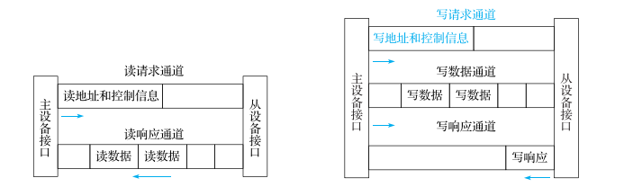
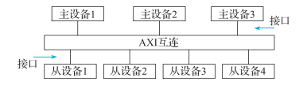
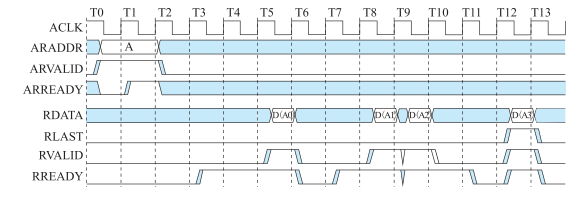
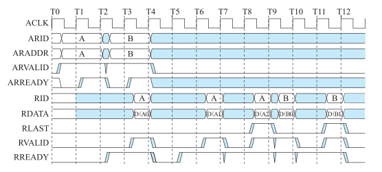
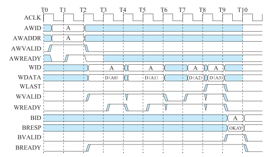

# C7 五级流水MC CPU的AXI总线接口

## 目录

-   [1 AMBA AXI总线接口基本介绍](#1-AMBA-AXI总线接口基本介绍)
-   [2 AXI总线接口实现](#2-AXI总线接口实现)
    -   [2.1 类SRAM总线](#21-类SRAM总线)
        -   [2.1.1 类SRAM总线接口相关](#211-类SRAM总线接口相关)
            -   [2.1.1.1 主方和从方](#2111-主方和从方)
            -   [2.1.1.2 类SRAM总线接口信号定义](#2112-类SRAM总线接口信号定义)
            -   [2.1.1.3 类SRAM总线的读写时序](#2113-类SRAM总线的读写时序)
            -   [2.1.1.4 类SRAM总线的约束](#2114-类SRAM总线的约束)
        -   [2.1.2 类SRAM总线接口设计](#212-类SRAM总线接口设计)
            -   [2.1.2.1 类SRAM总线接口](#2121-类SRAM总线接口)
            -   [2.1.2.2 取指设计](#2122-取指设计)
            -   [2.1.2.3 访存设计](#2123-访存设计)
        -   [2.1.3 类SRAM-AXI转换桥](#213-类SRAM-AXI转换桥)
            -   [2.1.3.1 转换桥实现](#2131-转换桥实现)

# 1 AMBA AXI总线接口基本介绍

1.  AXI即Advanced Extensible Interface
2.  AXI的地址/控制和数据总线分离，读写通道也是分离的，支持乱序访问，支持不对齐的数据传输，同时在突发传输[^注释1]中只需要发送首地址来提高数据传输率
3.  AXI总线主设备的主要信号定义如下表所示——将AXI总线分成独立的5个通道：写请求、写数据、写响应、读请求、读响应。每个通道均采用握手协议独立传输。其中下划线的是必须要掌握的
    | 通道名称             | 引脚名称          | 方向   | 描述                  | 设计建议                                                    |
    | ---------------- | ------------- | ---- | ------------------- | ------------------------------------------------------- |
    |                  | ACLK          | 输入   | AXI时钟信号             |                                                         |
    |                  | ARESETN       | 输入   | AXI复位信号，低电平有效       |                                                         |
    | 写请求通道/&#xA;写地址通道 | AWID\[3:0]    | 输出   | 写请求标识号              | 固定为1                                                    |
    |                  | AWADDR\[31:0] | 输出   | 写请求地址               |                                                         |
    |                  | AWSIZE\[2:0]  | 输出   | 写请求数据宽度——每节拍传输数据字节数 |                                                         |
    |                  | AWLEN\[7:0]   | 输出   | 写请求数据长度——传输数据节拍数    | 固定为0                                                    |
    |                  | AWBURST\[1:0] | 输出   | 写请求类型               | 固定为2’b01                                                |
    |                  | AWLOCK\[1:0]  | 输出   | 写请求原子锁              | 固定为0                                                    |
    |                  | AWCACHE\[3:0] | 输出   | 写请求Cache属性          | 固定为0                                                    |
    |                  | AWPROT\[2:0]  | 输出   | 写请求保护属性             | 固定为0                                                    |
    |                  | AWVALID       | 输出   | 写请求地址有效信号           |                                                         |
    |                  | AWREADY       | 输入   | 从设备写请求接收准备好信号       |                                                         |
    | 写数据通道            | WID\[3:0]     | 输出   | 写数据标识号,与写请求标识号对应    | 固定为1                                                    |
    |                  | WDATA\[31:0]  | 输出   | 写数据                 |                                                         |
    |                  | WSTRB\[3:0]   | 输出   | 写数据字节选通信号，1位对应8个数据位 |                                                         |
    |                  | WLAST         | 输出   | 写请求最后一拍数据的指示信号      | 固定为1                                                    |
    |                  | WVALID        | 输出   | 写数据有效信号             |                                                         |
    |                  | WREADY        | 输入   | 从设备写数据接收准备好信号       |                                                         |
    | 写响应通道            | BID\[3:0]     | 输入   | 写响应标识号，与写请求标识号对应    | 可忽略                                                     |
    |                  | BRESP\[1:0]   | 输入   | 写响应状态，本次写请求是否成功完成   | 可忽略                                                     |
    |                  | BVALID        | 输入   | 写响应有效信号             |                                                         |
    |                  | BREADY        | 输出   | 写响应接收准备好信号          |                                                         |
    | 读请求通道/&#xA;读地址通道 | ARID\[3:0]    | 输出   | 读请求标识号              | 取指设为0，取数设为1                                             |
    |                  | ARADDR\[31:0] | 输出   | 读请求地址               |                                                         |
    |                  | ARSIZE\[2:0]  | 输出   | 读请求数据宽度——数据传输每拍字节数  |                                                         |
    |                  | ARLEN\[7:0]   | 输出   | 读请求传输的长度——数据传输拍数    | 固定为0&#xA;因为还没有Cache，所有的读请求都只需要一次总线传输就能完成，相应的 arlen 就为 0 |
    |                  | ARBURST\[1:0] | 输出   | 读请求类型               | 固定为2'b01                                                |
    |                  | ARLOCK\[1:0]  | 输出   | 读请求原子锁              | 固定为0                                                    |
    |                  | ARPROT        | 输出   | 读请求保护属性             | 固定为0                                                    |
    |                  | ARCACHE\[3:0] | 说过一次 | 读请求Cache属性          | 固定为0                                                    |
    |                  | ARVALID       | 输出   | 读请求有效信号             |                                                         |
    |                  | ARREADY       | 输入   | 读请求接收准备好信号          |                                                         |
    | 读响应通道            | RID\[3:0]     | 输入   | 读数据标识号，与读请求标识号对应    | 取指是0；取数是1                                               |
    |                  | RDATA\[31:0]  | 输入   | 读数据                 |                                                         |
    |                  | RRESP\[1:0]   | 输入   | 读响应状态，本次读请求是否成功完成   | 可忽略                                                     |
    |                  | RLAST         | 输入   | 读请求最后一拍数据的指示信号      | 可忽略                                                     |
    |                  | RVALID        | 输入   | 读数据有效信号             |                                                         |
    |                  | RREADY        | 输出   | 读数据接收准备好信号          |                                                         |
4.  AXI协议特点
    1.  单向通道体系结构

        单工，信号要么确定是输入要么确定是输出，只以单方向传输
    2.  支持多项数据交换

        AXI协议支持的数据宽度很宽，最大支持到1024位

        可以并行执行突发操作，极大提高数据吞吐能力
    3.  独立的地址/控制和数据通道

        地址/控制和数据通道分开便于单独进行优化，而且方便插入流水线中
5.  AXI架构
    1.  AXI协议是主从协议——每套AXI总线的主设备和从设备是固定的，只有主设备才可以发起读写命令(request)
    2.  一套AXI总线包含五个通道[^注释2]，每个通道的信号定义见[2中的表格](https://www.wolai.com/aurora_420/a4NQef8H2GcGxyi4tdDbch#teHCcM4rDkDwdZdVy68Vme "2中的表格")
    3.  AXI协议的一次完整的读或写过程是一个总线事务
    4.  下图分别说明了读写事务是如何通过对应的通道进行的

        
    5.  AXI协议是双向握手的，每次传输也都需要主从双方给出确认信号——数据的来源方设置有效Valid信号，数据的接收方设置准备好Ready信号。只有Valid和Ready均有效时，才会传输数据
    6.  若采用Brust传输，那么读请求通道和写数据通道还各包含一个结束信号[^注释3]来指定一次突发传输的最后一个传输周期
6.  AXI互连

    处理器系统中的多个主设备和从设备之间可以使用互连总线进行连接如下图。在该互连结构中，任意一个主设备都可以访问所有的从设备

    
7.  AXI高频设计

    因为AXI协议的五个通道都是单向的信息传递，并且各个通道之间没有规定特定的顺序关系，不存在同步，所以可以很容易地在通道之间插入寄存器缓冲，便于进行高频设计
8.  AXI基本事务
    > 📌AXI协议的主要特点是
    >
    > 1.  使用VALID[^注释4]和READY[^注释5]握手机制进行传输，地址和数据信息都只有在VALID和READY信号同时为高电平时才进行传输
    > 2.  使用分离的地址/数据通道，读事务和写事务都包含独立的地址通道[^注释6]和数据通道
    1.  突发读事务——RLAST信号结束突发传输

        

        A开头的信号表示读地址/请求通道，不带A的是读数据通道

        读事务的数据接收端是主设备，发送端是从设备。因此主设备是READY信号，从设备是VALID信号

        读请求通道：T1\~T2时，主设备给出的ARREADY信号和从设备给出的AVALID信号均为高电平，因此地址ARADDR可以经主设备传输给从设备

        读数据通道：采用突发传输方式，当主设备给出RREADY信号，从设备给出RVALID信号有效时，数据RDATA可以由从设备传输至主设备。到最后一个数据传输时，需要从设备置RLAST信号高电平
    2.  重叠的读事务——根据事务ID区分

        
        > ✨AXI支持重叠事务的性质使得从设备可以在前面的数据没有传输完成时就开始处理后面的事务，从而降低后面事务的完成时间
        > 上图中，在T4时，A事务的数据还没有读完，就给出了B事务的地址信息。因为重叠事务的性质，从设备可以在A设备的数据均传输完成后，待RVALID和RREADY均有效后立刻开始B事务数据的传输
    3.  写事务

        

        写事务是主设备将数据写至从设备，因此主设备是数据提供方，发出VALID信号；从设备是数据接收方，发出READY信号

        写事务涉及写地址AW、写数据W、写响应B三个通道

        T2时，AWVALID和AWREADY信号均有效，主设备将AWADDR传输至从设备

        T4、T6、T8、T9时，WVALID、WREADY信号均有效，主设备将数据WDATA写至从设备

        T10时，BVALID、BREADY信号均有效，从设备将BRESP信号传输至主设备
9.  读写事务顺序——AXI协议支持读写事务乱序完成

    AXI总线的每一个读写事务都有一个ID标签。同ID的读事务或者同ID的写事务必须按照发生的顺序按序完成，不同ID的事务可以乱序完成
10. AXI协议的其它特点
    1.  支持不同的突发传输类型——回绕、顺序、固定

        回绕适合高速缓存行传输

        顺序适合较长的内存访问

        固定适合对外设FIFO访问
    2.  突发传输长度可变——1\~16
    3.  传输数据宽度可变——8\~1024位
    4.  支持非对齐的访问——但是LA32R架构并不实现这个，仍然有ALE异常
    5.  支持原子操作、安全和特权访问、错误报告

# 2 AXI总线接口实现

根据找到的资料汪文祥老师的《CPU设计实战 MIPS版》，对AXI总线接口的实现可以简化为以下三步[^注释7]：

1.  将原有CPU访问SRAM的接口调整为类SRAM总线接口[^注释8]
2.  设计实现“类SRAM-AXI”的转换桥，拼接1.所实现的CPU，运行AXI固定延迟验证
3.  完善2.的CPU，完成AXI随机延迟验证

## 2.1 类SRAM总线

### 2.1.1 类SRAM总线接口相关

#### 2.1.1.1 主方和从方

读和写这两种交互行为的发起方称为“主方”[^注释9]，响应方称为“从方”[^注释10]

读操作：主方提出读请求，从方接收请求并返回数据
写操作：主方提出写请求并发出数据，从方接收请求和数据并响应

#### 2.1.1.2 类SRAM总线接口信号定义

**信号的输入、输出是针对于CPU(主设备)来说的**

下表列出了类SRAM总线接口信号的说明：

| 信号       | 位宽 | 方向     | 功能                                     |
| -------- | -- | ------ | -------------------------------------- |
| clk      | 1  | input  | 时钟信号                                   |
| req      | 1  | output | 交互请求信号，高电平表示有读写请求                      |
| wr       | 1  | output | 写请求信号，高电平时表示写请求，低电平且req为高电平表示读请求       |
| size     | 2  | 输出     | 该次请求传输的字节数&#xA;0:1B、1:2B、2:4B          |
| addr     | 32 | 输出     | 该次请求的地址                                |
| wstrb    | 4  | 输出     | 该次写请求的字节写使能                            |
| wdata    | 32 | 输出     | 该次写请求的写数据                              |
| addr\_ok | 1  | 输入     | 该次请求的地址传输OK&#xA;读请求：地址被接收；写请求：地址和数据被接收 |
| data\_ok | 1  | 输入     | 该次请求的数据传输OK&#xA;读：数据返回给主方&#xA;写：数据写入完成 |
| rdata    | 32 | 输入     | 该次读请求返回的数据                             |

其中clk对应原来Data SRAM的cpu\_clk、req对应原来Data SRAM的data\_sram\_en、addr对应原来Data SRAM的data\_sram\_addr\[17:2]、wstrb对应原来Data SRAM的data\_sram\_we、wdata对应原来Data SRAM的data\_sram\_wdata、rdata对应原来Data SRAM的data\_sram\_rdata

**wr、size、addr\_ok、data\_ok**是新增的信号

1.  wr信号
    1.  取指时，wr为1'b0
    2.  访存时，wr信号根据M\_memWriteE设置，M\_memWriteE为1时设置为1
2.  size信号
    1.  取指时，size为2'b10
    2.  访存时，size信号可以根据M\_memReadW,M\_memWriteW设置。LB、LBU、SB为2'b00，LH、LHU、SH为2'b01，LW、SW为2'b10
3.  addr\_ok信号用于和req信号一起完成读写请求的握手

    只有在clk的上升沿同时看到req和addr\_ok为高电平时才是一次成功的请求握手
4.  data\_ok信号

    对应读事务时，data\_ok是数据返回的有效信号
    对应写事务时，data\_ok是写入完成的有效信号

    **在类SRAM接口中，主方对于data\_ok信号总是可以接受到的，因此不再设置data\_ok的握手信号**

#### 2.1.1.3 类SRAM总线的读写时序


左图为类SRAM总线上的一次读事务时序关系

在clk上升沿时，若addr\_ok和req均为高电平则说明地址握手成功——读地址已成功传递给从方

在clk上升沿时，若data\_ok为高电平则说明数据已成功传输给主方，此时的rdata即为给定位置读出的数据


左图为类SRAM总线上的一次写事务时序关系

在clk上升沿时，若addr\_ok和req均为高电平则说明地址握手成功——读地址已成功传递给从方

在clk上升沿时，若data\_ok为高电平则说明数据已成功写入至从方

> 📌**连续写读时，从方返回的data\_ok是严格按照请求发出的顺序返回的**
>
> **为了简化设计，需要控制连续写读的数目，可以****在主方拉低req信号****来暂停发送新事务的请求，****在从方拉低addr\_ok****信号来暂停接收新事务的请求**


左图为类SRAM总线上的连续写读的时序关系。

在左图中，写请求握手成功后又马上进行读请求的握手，因此响应的data\_ok也是先响应写请求，再响应读请求

#### 2.1.1.4 类SRAM总线的约束

为降低类SRAM总线的设计复杂度，对类SRAM总线做出以下约束：

1.  从方发出的addr\_ok值不能依赖主方发出的req值——**生成addr\_ok的逻辑不能看req信号**
2.  **在req为高电平且addr\_ok为低电平时，允许主方更改wr、size、addr、wstrb和wdata**

    类SRAM总线在地址请求未得到响应时，可以更换请求的信息；但AXI总线要求：主方一旦发起某一地址或数据的传输，在该传输握手成功前，不得更改传输的地址或数据

### 2.1.2 类SRAM总线接口设计

本小节需要将所实现的具有精确中断机制的五级流水MC CPU的取指和访存所使用的标准的SRAM接口改造为类SRAM总线接口

#### 2.1.2.1 类SRAM总线接口

在项目soc\_hs\_bram中已经完成了类SRAM总线对ins\_ram的接口，如下：

```verilog
//for func test, no define RUN_PERF_TEST，未指定值默认为1
`define _RUN_PERF_TEST

module sram_wrap (
    input wire clk,    //外部时钟输入
    input wire resetn, //外部复位信号、低电平

    input  wire         req,      //外部输入的请求信号
    input  wire         wr,       //外部输入的读写信号，inst时始终为0
    input  wire [1 : 0] size,     //访问数据大小
    input  wire [3 : 0] wstrb,    //写位选通信号
    input  wire [ 31:0] addr,     //访存地址
    input  wire [ 31:0] wdata,    //写数据
    output wire         addr_ok,  //输出的地址ok信号
    output wire         data_ok,  //已得到数据ok信号
    output wire [ 31:0] rdata,    //读出的数据

    //slave 给SRAM的接口
    output wire ram_en,
    output wire [3 : 0] ram_we,
    output wire [31:0] ram_addr,
    output wire [31:0] ram_wdata,
    input wire [31:0] ram_rdata,
    //from confreg
    input  wire [1 : 0] ram_random_mask  //仿真时用作的掩码信号，用于addr_ok，data_ok的生成
);
  wire addr_and;
  wire data_and;
  //mask
`ifdef RUN_PERF_TEST  //仿真时设置为1，上板时根据开关来设置
  assign addr_and = 1'b1;
  assign data_and = 1'b1;
`else
  assign addr_and = ram_random_mask[1];
  assign data_and = ram_random_mask[0];
`endif

  //to ram

  //size_decode
  //访问字节数据时，地址末两位3,2,1,0分别对应size_decode对应32位对应的31~24,23~16,15~8,7~0
  //访问半字数据时，地址末两位为00时对应15~0,10时对应31~16
  //访问字数据时，对应31~0,均为4'b1111
  wire [3:0] size_decode = size==2'd0 ? {addr[1:0]==2'd3,addr[1:0]==2'd2,addr[1:0]==2'd1,addr[1:0]==2'd0} :
                         size==2'd1 ? {addr[1],addr[1],~addr[1],~addr[1]} :
                                      4'hf;

  assign ram_en = req && addr_ok;  //当req和addr_ok同时有效时，即可以访问存储器
  assign ram_we    = {4{wr}} & wstrb & size_decode;//wr、wstrb（原实现是始终是4'b1111）、size_decode相与生成写存位宽信号
  assign ram_addr = addr;
  assign ram_wdata = wdata;

  reg ram_en_r;  //延缓一个时钟周期，和BRAM需要一个周期得到存储数据同步
  always @(posedge clk) begin
    ram_en_r <= ram_en;
  end


  //读缓冲
  reg [2 : 0] buf_wptr;  //总线的写指针——类似于双指针循环队列的思想 4个通道需要两位，再增加一位判断队列空满
  reg [2 : 0] buf_rptr;  //总线的读指针
  reg [31:0] buf_rdata[3:0];  //4个32位宽的总线

  wire buf_empty = buf_wptr == buf_rptr;  //当读写指针相等时队列空
  wire buf_full = buf_wptr == {~buf_rptr[2], buf_rptr[1:0]}; //当读写指针低两位相同但最高位不同时表示队列满

  wire fast_return = ram_en_r && data_ok && buf_empty;//当访存且data_ok握手且buf空时，直接返回sram数据，不用写sram

  always @(posedge clk) begin
    if (!resetn) begin  //复位时，写指针清0
      buf_wptr <= 3'd0;
    end else if (ram_en_r && !fast_return) begin
      buf_wptr <= buf_wptr + 1'b1;
    end

    if (ram_en_r && !fast_return) begin  //将数据加载到buf中，写buf，这个可以放在上面的else-if中，<=同步赋值
      buf_rdata[buf_wptr[1:0]] <= ram_rdata;
    end

    if (!resetn) begin  //复位时，读指针清0
      buf_rptr <= 3'd0;
    end else if (!buf_empty && data_ok) begin//队列不空时，data_ok表示该数据已读出，可以增加读指针
      buf_rptr <= buf_rptr + 1'b1;
    end
  end
  
  assign addr_ok = 1'b1 && addr_and && !buf_full;//addr_and为1时，只要队列不满就可以接受addr
  assign data_ok = 1'b1 && data_and && (!buf_empty || ram_en_r);//data_and为1时，当buf空时，需要等待1个时钟周期才能完成读取/写入，因此是ram_en_r；当buf不空时，可以直接使用buf中的数据返回，不需要等待一个时钟即可有data_ok信号
  assign rdata = buf_empty ? ram_rdata : buf_rdata[buf_rptr[1:0]];//buf空时，直接读sram读出的数据，否则读buf的
endmodule

```

```verilog
//for func test, no define RUN_PERF_TEST，未指定值默认为1
`define _RUN_PERF_TEST

module sram_wrap (
    input wire clk,    //外部时钟输入
    input wire resetn, //外部复位信号、低电平

    input  wire         req,      //外部输入的请求信号
    input  wire         wr,       //外部输入的读写信号，inst时始终为0
    input  wire [1 : 0] size,     //访问数据大小
    input  wire [3 : 0] wstrb,    //写位选通信号
    input  wire [ 31:0] addr,     //访存地址
    input  wire [ 31:0] wdata,    //写数据
    output wire         addr_ok,  //输出的地址ok信号
    output wire         data_ok,  //已得到数据ok信号
    output wire [ 31:0] rdata,    //读出的数据

    //slave 给SRAM的接口
    output wire ram_en,
    output wire [3 : 0] ram_we,
    output wire [31:0] ram_addr,
    output wire [31:0] ram_wdata,
    input wire [31:0] ram_rdata,
    //from confreg
    input  wire [1 : 0] ram_random_mask  //仿真时用作的掩码信号，用于addr_ok，data_ok的生成
);
  wire addr_and;
  wire data_and;
  //mask
`ifdef RUN_PERF_TEST  //仿真时设置为1，上板时根据开关来设置
  assign addr_and = 1'b1;
  assign data_and = 1'b1;
`else
  assign addr_and = ram_random_mask[1];
  assign data_and = ram_random_mask[0];
`endif

  //to ram

  //size_decode
  //访问字节数据时，地址末两位3,2,1,0分别对应size_decode对应32位对应的31~24,23~16,15~8,7~0
  //访问半字数据时，地址末两位为00时对应15~0,10时对应31~16
  //访问字数据时，对应31~0,均为4'b1111
  wire [3:0] size_decode = size==2'd0 ? {addr[1:0]==2'd3,addr[1:0]==2'd2,addr[1:0]==2'd1,addr[1:0]==2'd0} :
                         size==2'd1 ? {addr[1],addr[1],~addr[1],~addr[1]} :
                                      4'hf;

  assign ram_en = req && addr_ok;  //当req和addr_ok同时有效时，即可以访问存储器
  assign ram_we    = {4{wr}} & wstrb & size_decode;//wr、wstrb（原实现是始终是4'b1111）、size_decode相与生成写存位宽信号
  assign ram_addr = addr;
  assign ram_wdata = wdata;

  reg ram_en_r;  //延缓一个时钟周期，和BRAM需要一个周期得到存储数据同步
  always @(posedge clk) begin
    ram_en_r <= ram_en;
  end


  //读缓冲
  reg [2 : 0] buf_wptr;  //总线的写指针——类似于双指针循环队列的思想 4个通道需要两位，再增加一位判断队列空满
  reg [2 : 0] buf_rptr;  //总线的读指针
  reg [31:0] buf_rdata[3:0];  //4个32位宽的总线

  wire buf_empty = buf_wptr == buf_rptr;  //当读写指针相等时队列空
  wire buf_full = buf_wptr == {~buf_rptr[2], buf_rptr[1:0]}; //当读写指针低两位相同但最高位不同时表示队列满

  wire fast_return = ram_en_r && data_ok && buf_empty;//当访存且data_ok握手且buf空时，直接返回sram数据，不用写sram

  always @(posedge clk) begin
    if (!resetn) begin  //复位时，写指针清0
      buf_wptr <= 3'd0;
    end else if (ram_en_r && !fast_return) begin
      buf_wptr <= buf_wptr + 1'b1;
    end

    if (ram_en_r && !fast_return) begin  //将数据加载到buf中，写buf，这个可以放在上面的else-if中，<=同步赋值
      buf_rdata[buf_wptr[1:0]] <= ram_rdata;
    end

    if (!resetn) begin  //复位时，读指针清0
      buf_rptr <= 3'd0;
    end else if (!buf_empty && data_ok) begin//队列不空时，data_ok表示该数据已读出，可以增加读指针
      buf_rptr <= buf_rptr + 1'b1;
    end
  end
  
  assign addr_ok = 1'b1 && addr_and && !buf_full;//addr_and为1时，只要队列不满就可以接受addr
  assign data_ok = 1'b1 && data_and && (!buf_empty || ram_en_r);//data_and为1时，当buf空时，需要等待1个时钟周期才能完成读取/写入，因此是ram_en_r；当buf不空时，可以直接使用buf中的数据返回，不需要等待一个时钟即可有data_ok信号
  assign rdata = buf_empty ? ram_rdata : buf_rdata[buf_rptr[1:0]];//buf空时，直接读sram读出的数据，否则读buf的
endmodule

```

在[2.1.1.2](https://www.wolai.com/ysx_ashore/a4NQef8H2GcGxyi4tdDbch#vB7Fbd8HsXN9gwpR1qY7Lm "2.1.1.2")中分析所得，将标准SRAM接口改造为类SRAM总线接口只需要增加四个信号：wr、size、addr\_ok、data\_ok。而wr、size的设置较为简单，主要是addr\_ok和data\_ok这两个信号，分别对原CPU设计中的取指和访存修改

#### 2.1.2.2 取指设计

取指阶段是IF阶段发出请求，ID阶段接收读到的数据

只有收到addr\_ok时才能更新F流水线寄存器，否则阻塞

只有当收到data\_ok时才能更新ID流水寄存器，否则阻塞

当没有F流水寄存器的阻塞信号时，才可以发送req信号

#### 2.1.2.3 访存设计

当没有阻塞+清空信号时，才可以发送req信号

只有当收到addr\_ok时，才能更新MEM阶段的流水寄存器

只有当收到data\_ok时，才能更新WB阶段的流水寄存器

但是在仿真过程中遇到了以下问题：

1.  addr\_ok的更新也会使得id的F\_pcAddr一直改变，因为原设计是取指立刻有结果，因此传递一个clk的F\_pcAddr正好是指令的pc。但是这种实现因为data\_ok的不确定导致id阶段获得的对应指令的pc也不确定
2.  然后我想的是将ID阶段F\_pcAddr的输入由IF阶段更改到inst\_ram的访存地址，但是这种情况忽略了data\_ok的有效——仿真看到的
3.  现在的想法是：因为接口中有读缓冲队列，所以想的是在if阶段也加一个读缓冲队列，每有一个addr\_ok就将F\_pcAddr压入，每有一个data\_ok就取出一个——除夕完了做一下

### 2.1.3 类SRAM-AXI转换桥

#### 2.1.3.1 转换桥实现

```verilog
module axi_wrap (

    //CPU->axi转换桥的信号 master
    input  wire         m_aclk,     //axi时钟
    input  wire         m_aresetn,  //axi复位信号
    //ar 读请求通道
    input  wire [3 : 0] m_arid,
    input  wire [ 31:0] m_araddr,
    input  wire [7 : 0] m_arlen,
    input  wire [2 : 0] m_arsize,
    input  wire [1 : 0] m_arburst,
    input  wire [1 : 0] m_arlock,
    input  wire [3 : 0] m_arcache,
    input  wire [2 : 0] m_arprot,
    input  wire         m_arvalid,
    output wire         m_arready,
    //r 读响应通道
    output wire [3 : 0] m_rid,
    output wire [ 31:0] m_rdata,
    output wire [1 : 0] m_rresp,
    output wire         m_rlast,
    output wire         m_rvalid,
    input  wire         m_rready,
    //aw 写请求通道
    input  wire [3 : 0] m_awid,
    input  wire [ 31:0] m_awaddr,
    input  wire [7 : 0] m_awlen,
    input  wire [2 : 0] m_awsize,
    input  wire [1 : 0] m_awburst,
    input  wire [1 : 0] m_awlock,
    input  wire [3 : 0] m_awcache,
    input  wire [2 : 0] m_awprot,
    input  wire         m_awvalid,
    output wire         m_awready,
    //w 写数据通道
    input  wire [3 : 0] m_wid,
    input  wire [ 31:0] m_wdata,
    input  wire [3 : 0] m_wstrb,
    input  wire         m_wlast,
    input  wire         m_wvalid,
    output wire         m_wready,
    //b 写响应通道
    output wire [3 : 0] m_bid,
    output wire [1 : 0] m_bresp,
    output wire         m_bvalid,
    input  wire         m_bready,


    //axi转换桥给到外设的信号 slave
    output wire         s_aclk,
    output wire         s_aresetn,
    //ar
    output wire [3 : 0] s_arid,
    output wire [ 31:0] s_araddr,
    output wire [7 : 0] s_arlen,
    output wire [2 : 0] s_arsize,
    output wire [1 : 0] s_arburst,
    output wire [1 : 0] s_arlock,
    output wire [3 : 0] s_arcache,
    output wire [2 : 0] s_arprot,
    output wire         s_arvalid,
    input  wire         s_arready,
    //r
    input  wire [3 : 0] s_rid,
    input  wire [ 31:0] s_rdata,
    input  wire [1 : 0] s_rresp,
    input  wire         s_rlast,
    input  wire         s_rvalid,
    output wire         s_rready,
    //aw
    output wire [3 : 0] s_awid,
    output wire [ 31:0] s_awaddr,
    output wire [7 : 0] s_awlen,
    output wire [2 : 0] s_awsize,
    output wire [1 : 0] s_awburst,
    output wire [1 : 0] s_awlock,
    output wire [3 : 0] s_awcache,
    output wire [2 : 0] s_awprot,
    output wire         s_awvalid,
    input  wire         s_awready,
    //w
    output wire [3 : 0] s_wid,
    output wire [ 31:0] s_wdata,
    output wire [3 : 0] s_wstrb,
    output wire         s_wlast,
    output wire         s_wvalid,
    input  wire         s_wready,
    //b
    input  wire [3 : 0] s_bid,
    input  wire [1 : 0] s_bresp,
    input  wire         s_bvalid,
    output wire         s_bready
);
  assign s_aclk = m_aclk;
  assign s_aresetn = m_aresetn;
  //ar
  assign s_arid = m_arid;
  assign s_araddr = m_araddr;
  assign s_arlen = m_arlen;
  assign s_arsize = m_arsize;
  assign s_arburst = m_arburst;
  assign s_arlock = m_arlock;
  assign s_arcache = m_arcache;
  assign s_arprot = m_arprot;
  assign s_arvalid = m_arvalid;
  assign m_arready = s_arready;
  //r
  assign m_rid     = m_rvalid ? s_rid : 4'd0;  //valid有效则表示从设备已将数据给出，赋值s_rid
  assign m_rdata = m_rvalid ? s_rdata : 32'd0;
  assign m_rresp = m_rvalid ? s_rresp : 2'd0;
  assign m_rlast = m_rvalid ? s_rlast : 1'd0;
  assign m_rvalid = s_rvalid;
  assign s_rready = m_rready;
  //aw
  assign s_awid = m_awid;
  assign s_awaddr = m_awaddr;
  assign s_awlen = m_awlen;
  assign s_awsize = m_awsize;
  assign s_awburst = m_awburst;
  assign s_awlock = m_awlock;
  assign s_awcache = m_awcache;
  assign s_awprot = m_awprot;
  assign s_awvalid = m_awvalid;
  assign m_awready = s_awready;
  //w
  assign s_wid = m_wid;
  assign s_wdata = m_wdata;
  assign s_wstrb = m_wstrb;
  assign s_wlast = m_wlast;
  assign s_wvalid = m_wvalid;
  assign m_wready = s_wready;
  //b
  assign m_bid = m_bvalid ? s_bid : 4'd0;
  assign m_bresp = m_bvalid ? s_bresp : 2'd0;
  assign m_bvalid = s_bvalid;
  assign s_bready = m_bready;
endmodule

```

[^注释1]: 突发传输即Burst transmission，是指在同一行相邻的存储单元之间连续进行数据传输的方式，连续传输的周期数就是突发长度Burst Length(BL)

[^注释2]: 写地址、写数据、写响应、读地址、读响应

    写地址、读地址通道用于传送读写的目标地址、数据宽度、传输长度和其他控制信息
    写数据通道用于由主设备向从设备传送写数据，AXI也支持带掩码的写操作
    写响应通道用来传送写完成信息
    读响应通道用于传送从设备读出的数据以及响应信息

[^注释3]: 表格中没有

[^注释4]: 提供数据的设备端输出的信号

[^注释5]: 接收数据的设备端输出的信号

[^注释6]: 用来传输地址和其他控制信息

[^注释7]: 使用这种方法的原因：
    1\. 一部分初学者完全不知道如何从现有取指和访存的SRAM接口改出AXI接口
    2\. 一部分初学者过于激进地使用AXI协议特性，实现过于复杂出现大量错误

[^注释8]: 只是在SRAM接口的基础上增加了握手信号

[^注释9]: CPU

[^注释10]: 从设备
