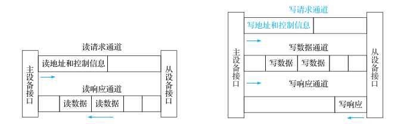
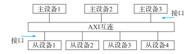
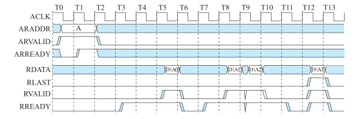
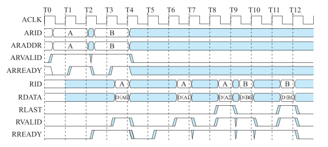
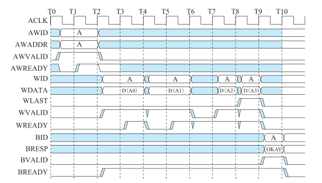

# C7 五级流水MC CPU的AXI总线接口

## 目录

-   [1 AMBA AXI总线接口基本介绍、](#1-AMBA-AXI总线接口基本介绍)

## 1 AMBA AXI总线接口基本介绍、

1.  AXI即Advanced Extensible Interface
2.  AXI的地址/控制和数据总线分离，读写通道也是分离的，支持乱序访问，支持不对齐的数据传输，同时在突发传输[^注释1]中只需要发送首地址来提高数据传输率
3.  AXI总线主设备的主要信号定义如下表所示——将AXI总线分成独立的5个通道：写请求、写数据、写响应、读请求、读响应。每个通道均采用握手协议独立传输
    | 通道名称             | 引脚名称          | 方向 | 描述                |
    | ---------------- | ------------- | -- | ----------------- |
    | 写请求通道/&#xA;写地址通道 | AWID\[n:0]    | 输出 | 写请求标识号            |
    |                  | AWADDR\[m:0]  | 输出 | 写请求地址             |
    |                  | AWSIZE\[2:0]  | 输出 | 写请求数据宽度           |
    |                  | AWLEN\[3:0]   | 输出 | 写请求数据长度           |
    |                  | AWBURST\[1:0] | 输出 | 写请求类型             |
    |                  | AWREADY       | 输入 | 写请求接收准备好信号        |
    | 写数据通道            | WID\[n:0]     | 输出 | 写数据标识号,与写请求标识号对应  |
    |                  | WDATA\[j:0]   | 输出 | 写数据               |
    |                  | WSTRB\[k:0]   | 输出 | 写数据屏蔽信号，1位对应8个数据位 |
    |                  | WVALID        | 输出 | 写数据有效信号           |
    |                  | WREADY        | 输入 | 写数据接收准备好信号        |
    | 写响应通道            | BID\[n:0]     | 输入 | 写响应标识号，与写请求标识号对应  |
    |                  | BRESP\[1:0]   | 输入 | 写响应状态             |
    |                  | BVALID        | 输入 | 写响应有效信号           |
    |                  | BREADY        | 输出 | 写响应接收准备好信号        |
    | 读请求通道/&#xA;读地址通道 | ARID\[n:0]    | 输出 | 读请求标识号            |
    |                  | ARADDR\[m:0]  | 输出 | 读请求地址             |
    |                  | ARSIZE\[2:0]  | 输出 | 读请求数据宽度           |
    |                  | ARLEN\[3:0]   | 输出 | 读请求数据长度           |
    |                  | ARBURST\[1:0] | 输出 | 读请求类型             |
    |                  | ARVALID       | 输出 | 读请求有效信号           |
    |                  | ARREADY       | 输入 | 读请求接收准备好信号        |
    | 读响应通道            | RID\[n:0]     | 输入 | 读数据标识号，与读请求标识号对应  |
    |                  | RDATA\[j:0]   | 输入 | 读数据               |
    |                  | RRESP\[1:0]   | 输入 | 读响应状态             |
    |                  | RVALID        | 输入 | 读数据有效信号           |
    |                  | RREADY        | 输出 | 读数据接收准备好信号        |
4.  AXI协议特点
    1.  单向通道体系结构

        单工，信号要么确定是输入要么确定是输出，只以单方向传输
    2.  支持多项数据交换

        AXI协议支持的数据宽度很宽，最大支持到1024位

        可以并行执行突发操作，极大提高数据吞吐能力
    3.  独立的地址/控制和数据通道

        地址/控制和数据通道分开便于单独进行优化，而且方便插入流水线中
5.  AXI架构
    1.  AXI协议是主从协议——每套AXI总线的主设备和从设备是固定的，只有主设备才可以发起读写命令(request)
    2.  一套AXI总线包含五个通道[^注释2]，每个通道的信号定义见[2中的表格](https://www.wolai.com/aurora_420/a4NQef8H2GcGxyi4tdDbch#teHCcM4rDkDwdZdVy68Vme "2中的表格")
    3.  AXI协议的一次完整的读或写过程是一个总线事务
    4.  下图分别说明了读写事务是如何通过对应的通道进行的

        
    5.  AXI协议是双向握手的，每次传输也都需要主从双方给出确认信号——数据的来源方设置有效Valid信号，数据的接收方设置准备好Ready信号。只有Valid和Ready均有效时，才会传输数据
    6.  若采用Brust传输，那么读请求通道和写数据通道还各包含一个结束信号[^注释3]来指定一次突发传输的最后一个传输周期
6.  AXI互连

    处理器系统中的多个主设备和从设备之间可以使用互连总线进行连接如下图。在该互连结构中，任意一个主设备都可以访问所有的从设备

    
7.  AXI高频设计

    因为AXI协议的五个通道都是单向的信息传递，并且各个通道之间没有规定特定的顺序关系，不存在同步，所以可以很容易地在通道之间插入寄存器缓冲，便于进行高频设计
8.  AXI基本事务
    > 📌AXI协议的主要特点是
    >
    > 1.  使用VALID[^注释4]和READY[^注释5]握手机制进行传输，地址和数据信息都只有在VALID和READY信号同时为高电平时才进行传输
    > 2.  使用分离的地址/数据通道，读事务和写事务都包含独立的地址通道[^注释6]和数据通道
    1.  突发读事务——RLAST信号结束突发传输

        

        A开头的信号表示读地址/请求通道，不带A的是读数据通道

        读事务的数据接收端是主设备，发送端是从设备。因此主设备是READY信号，从设备是VALID信号

        读请求通道：T1\~T2时，主设备给出的ARREADY信号和从设备给出的AVALID信号均为高电平，因此地址ARADDR可以经主设备传输给从设备

        读数据通道：采用突发传输方式，当主设备给出RREADY信号，从设备给出RVALID信号有效时，数据RDATA可以由从设备传输至主设备。到最后一个数据传输时，需要从设备置RLAST信号高电平
    2.  重叠的读事务——根据事务ID区分

        
        > ✨AXI支持重叠事务的性质使得从设备可以在前面的数据没有传输完成时就开始处理后面的事务，从而降低后面事务的完成时间
        > 上图中，在T4时，A事务的数据还没有读完，就给出了B事务的地址信息。因为重叠事务的性质，从设备可以在A设备的数据均传输完成后，待RVALID和RREADY均有效后立刻开始B事务数据的传输
    3.  写事务

        

        写事务是主设备将数据写至从设备，因此主设备是数据提供方，发出VALID信号；从设备是数据接收方，发出READY信号

        写事务涉及写地址AW、写数据W、写响应B三个通道

        T2时，AWVALID和AWREADY信号均有效，主设备将AWADDR传输至从设备

        T4、T6、T8、T9时，WVALID、WREADY信号均有效，主设备将数据WDATA写至从设备

        T10时，BVALID、BREADY信号均有效，从设备将BRESP信号传输至主设备
9.  读写事务顺序——AXI协议支持读写事务乱序完成

    AXI总线的每一个读写事务都有一个ID标签。同ID的读事务或者同ID的写事务必须按照发生的顺序按序完成，不同ID的事务可以乱序完成
10. AXI协议的其它特点
    1.  支持不同的突发传输类型——回绕、顺序、固定

        回绕适合高速缓存行传输

        顺序适合较长的内存访问

        固定适合对外设FIFO访问
    2.  突发传输长度可变——1\~16
    3.  传输数据宽度可变——8\~1024位
    4.  支持原子操作、安全和特权访问、错误报告

[^注释1]: 突发传输即Burst transmission，是指在同一行相邻的存储单元之间连续进行数据传输的方式，连续传输的周期数就是突发长度Burst Length(BL)

[^注释2]: 写地址、写数据、写响应、读地址、读响应

    写地址、读地址通道用于传送读写的目标地址、数据宽度、传输长度和其他控制信息
    写数据通道用于由主设备向从设备传送写数据，AXI也支持带掩码的写操作
    写响应通道用来传送写完成信息
    读响应通道用于传送从设备读出的数据以及响应信息

[^注释3]: 表格中没有

[^注释4]: 提供数据的设备端输出的信号

[^注释5]: 接收数据的设备端输出的信号

[^注释6]: 用来传输地址和其他控制信息
