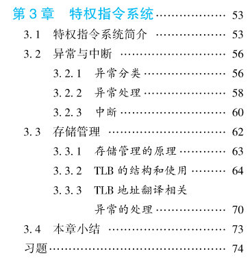
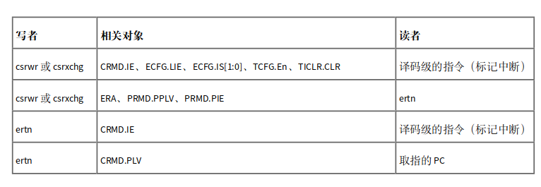

# C7 异常和中断的支持

## 目录

- [1 异常和中断的基本概念](#1-异常和中断的基本概念)
  - [1.1 异常是一套软硬件协同处理的机制](#11-异常是一套软硬件协同处理的机制)
  - [1.2 精确异常机制](#12-精确异常机制)
- [2 LA ISA中与异常相关的功能定义](#2-LA-ISA中与异常相关的功能定义)
  - [2.1 控制状态寄存器CSA](#21-控制状态寄存器CSA)
  - [2.2 异常产生条件的判定](#22-异常产生条件的判定)
    - [2.2.1 核内判定接收到中断的过程](#221-核内判定接收到中断的过程)
    - [2.2.2 取指地址错异常ADEF判定条件](#222-取指地址错异常ADEF判定条件)
    - [2.2.3 地址非对齐异常ALE判定条件](#223-地址非对齐异常ALE判定条件)
    - [2.2.4 指令不存在异常INE判断条件](#224-指令不存在异常INE判断条件)
    - [2.2.5 系统调用异常SYS和断点异常BRK判断条件](#225-系统调用异常SYS和断点异常BRK判断条件)
  - [2.3 响应异常后硬件的一般处理过程](#23-响应异常后硬件的一般处理过程)
  - [2.4 异常处理返回指令](#24-异常处理返回指令)
  - [2.5 CSR读写指令](#25-CSR读写指令)
- [3 流水线CPU实现异常和中断的设计要点](#3-流水线CPU实现异常和中断的设计要点)
  - [3.1 异常检测逻辑的实现](#31-异常检测逻辑的实现)
    - [3.1.1 ADEF检测逻辑](#311-ADEF检测逻辑)
    - [3.1.2 ALE检测逻辑](#312-ALE检测逻辑)
    - [3.1.3 INE检测逻辑](#313-INE检测逻辑)
    - [3.1.4 SYS and BRK检测逻辑](#314-SYS-and-BRK检测逻辑)
    - [3.1.5 中断检测逻辑](#315-中断检测逻辑)
  - [3.2 精确异常的实现](#32-精确异常的实现)
  - [3.3 CSR的实现](#33-CSR的实现)
    - [3.3.1 CSR实现代码的组织形式](#331-CSR实现代码的组织形式)
    - [3.3.2 csr.v](#332-csrv)
  - [3.4 处理CSR相关引发的冲突](#34-处理CSR相关引发的冲突)
- [4 其他指令的实现](#4-其他指令的实现)
- [5 任务与实践](#5-任务与实践)
  - [5.1 exp12 添加系统调用的支持](#51-exp12-添加系统调用的支持)
    - [5.1.1 CSRRD、CSRWR、CSRXCHG、SYSCALL、BRK指令的译码](#511-CSRRDCSRWRCSRXCHGSYSCALLBRK指令的译码)
    - [5.1.2 CSRRD、CSRWR、CSRXCHG的实现](#512-CSRRDCSRWRCSRXCHG的实现)
    - [5.1.3 SYS系统调用异常的实现逻辑](#513-SYS系统调用异常的实现逻辑)
    - [5.1.4 之前的设计问题，当时仿真的时候只顾最后有PASS，没看中间的信息](#514-之前的设计问题当时仿真的时候只顾最后有PASS没看中间的信息)
  - [5.2 添加其它异常支持](#52-添加其它异常支持)
    - [5.2.1 添加ADEF、ALE、BRK、INE异常的支持](#521-添加ADEFALEBRKINE异常的支持)
    - [5.2.2 添加中断的支持](#522-添加中断的支持)
    - [5.2.3 添加rdcntv{l/h}.w、rdcntid指令](#523-添加rdcntvlhwrdcntid指令)

## 1 异常和中断的基本概念

可以参考《计算机体系结构基础LA》3.2中异常和中断的基本概念



> 📌从CPU设计的角度来看，中断也是一种特殊的异常，因此在之后的描述中，除非专指中断，否则用异常统一代指中断+异常

### 1.1 异常是一套软硬件协同处理的机制

！！！首先需要明确异常是一套软硬件协同处理的机制——因为“异常”不是常态，发生的频度不高以及硬件的资源有限且昂贵[^注释1]，所以尽可能的让软件程序来处理异常

> 📌异常处理的绝大多数工作是由异常处理程序（软件）完成的，但是异常处理的开始和结束阶 段必须要由硬件来完成
>
> 1. 异常处理开始阶段——保护现场并跳转
>
>    硬件在该阶段需要完成是否有异常的触发，如果有，那么需要保护现场（触发异常指令的PC、异常类型）、切换CPU到核心态并跳转到异常处理程序的入口
> 2. 异常处理结束阶段——恢复现场并切回用户态
>
>    硬件需要返回到触发异常的指令PC/下一条，并将CPU状态切换回用户态

### 1.2 精确异常机制

“精确异常”即“当系统软件处理完异常返回后，对于发生异常的指令和它后面的 指令，就好像异常没有发生过一样——对于正在执行的指令所看到的内容不变（PC、通用寄存器、内存、特权等级等ISA定义的内容）。这里的 ‘前后’ 是根据程序中定义的顺序来判定的”

## 2 LA ISA中与异常相关的功能定义

### 2.1 控制状态寄存器CSA

正因为异常是一个软硬件协同的处理过程，所以根据**精确异常**的前提，为了实现软硬件之间必要的信息交互，需要设置一组**独立**的寄存器用于这类信息的交互——**这组寄存器只能在核心态下访问**，称之为控制状态寄存器CSR

本章所涉及到的CSR有：CRMD、PRMD、ECFG、ESTAT、ERA、BADV、EENTRY、SAVE0\~3、TID、TCFG、TVAL、TICLR

CSR的详细信息见[7 控制状态寄存器CSR](https://www.wolai.com/hfAQovN8p4tkzBTxQsdqgn "7 控制状态寄存器CSR")

### 2.2 异常产生条件的判定

本章需要实现的异常包括：中断`INT`、取指地址错`ADEF`、地址非对齐`ALE`、系统调用`SYS`、 断点`BRK`和指令不存在`INE`共计 6 种异常

下面对异常产生条件的判定进行总结

#### 2.2.1 核内判定接收到中断的过程

LA32R ISA规定每个处理器核内部可以记录12个线中断[^注释2]：1个核间中断（IPI）[^注释3]，1 个定时器中断（TI），8 个硬中断（HWI0\~HWI7），2 个软中断（SWI0\~SWI1）。这12个中断记录在`CSR.ESTAT`的*12,11,9...0*这12位上

1. 硬中断HWI0\~HWI7

   硬中断来源于核外，即核上有8个中断输入引脚，存在8个设备或者从中断控制器将高有效的中断信号与之相连，对应于`CSR.ESTAT`的*9...2*位采样
2. 软中断SWI0\~SWI1

   通过CSR写指令`csrwr`、`csrxchg`指令对`CSR.ESTAT`的*1...0*位写1或0来置起或撤销软中断
3. 定时器中断TI——经常用于操作系统的调度和计时功能实现

   定时器中断源自于定时器，可以分为核外、核内两种实现方式

   LA ISA采用了核内实现定时器中断源的方式，即每个LA32R 处理器核内部存在一个32位的计数器，在开启定时功能后每个时钟周期减 1，当减到 0 值即可触发一次定时器中断

   需要注意以下要点：
   1. 定时器的软件配置是通过读写`CSR.TCFG`进行[^注释4]
   2. 定时器的时钟与`rdcntc{l/h}.w`指令所访问的计时器使用同一频率固定的时钟[^注释5]
   3. 定时器当前的计数值**仅**可以通过读取 TVAL 状态寄存器近似[^注释6]获得，它与 rdcntv{l/h}.w 指令读取的计时器值来自于两个不同的对象
   4. 当定时器倒计时到 0 时硬件将 ESTAT 控制状态寄存器 IS 域的第 11 位置 1，软件通过对 TICLR 控制寄存器的 CLR 位写 1 将 ESTAT 控制状态寄存器 IS 域的第 11 位清 0

      尤其需要注意将定时器中断清0的条件，并不是CSR.ESTAT.IS\[11]一直检测计数值是否为0来置位或者复位中断，而是置位时需要检测计数值，但是复位时只能看软件是否有执行写ticlr.clr字段域的指令且写值为1
      ```verilog
            //定时器中断——当倒计时为0且TCFG.En使能，置位定时器中断csr_estat[11];同时写ticlr.clr域为1清除定时器中断
            if (csr_tcfg[`EN] & csr_tval == 32'b0) begin
              csr_estat[11] <= 1'b1;
            end else if (ticlr_wen & csrWData[`CLR]) begin
              csr_estat[11] <= 1'b0;
            end
      ```
      至于为什么定时器中断状 态位的设置和清除要定义的这么 “绕”的原因是——电平中断、脉冲信号

> 📌处理器核内部判断是否接收到中断不仅要看这些位中是否存在有效值，还要看中断的使能情况
>
> 中断的使能情况分为两个层次：
>
> 低层次：与各中断一一对应的局部中断使能[^注释7]，在`CSR.ECFG.LIE[11,9...0]`中存放
>
> 高层次：全局中断使能[^注释8]，在`CSR.CRMD.IE`中控制
>
> 对应中断识别位与对应的局部控制使能相与判断是否有中断，再与IE相与得到是否有中断[^注释9]
>
> ```verilog
>   assign has_int = csr_crmd[`IE] & ((csr_ecfg[`LIE] & csr_estat[`IS]) != 13'b0);
>
> ```

#### 2.2.2 取指地址错异常ADEF判定条件

LA ISA规定“所有的指令的PC都是字对齐（地址最低两bit为全 0），当违反这一规定时，将触发取指地址错误异常`ADEF`”

ADEF异常会将错误的PC值记录在`CSR.BADV`中——记录异常返回地址的 ERA 控制状态寄存器中应记录出错的 PC

#### 2.2.3 地址非对齐异常ALE判定条件

地址非对齐异常`ALE`仅针对 load、store 访存指令

当`ld.h`、`ld.hu`、`st.h`指令的访存地址最低位不为0时；当`ld.w`、`st.w`、`ll`、`sc`指令的访存地址最低两位不为0时，触发地址非对齐异常ALE，出错的访存 “虚” 地址将记录在CSR.BADV中，其余按照异常的一般处理过程进行处理

#### 2.2.4 指令不存在异常INE判断条件

当取回的指令的指令码不属于ISA所定义的（目前是不属于任何已实现的），将触发指令不存在异常`INE`，按照异常的一般处理过程进行处理

#### 2.2.5 系统调用异常SYS和断点异常BRK判断条件

当执行`SYSCALL` 指令时触发系统调用异常`SYS`，当执行`BREAK`指令时触发断点异常`BRK`，按照异常的一般处理过程进行处理

### 2.3 响应异常后硬件的一般处理过程

处理器响应异常后硬件的一般处理过程见6.1.3 处理器响应中断处理过程

异常入口的定义见6.2.1异常入口

### 2.4 异常处理返回指令

在异常处理的结束阶段，异常处理程序要完成两个同步的操作——最好使用一条指令完成：一是回到异常出现的 位置，二是恢复出现异常时的特权等级

在LA32R ISA中定义了`ERTN`指令来原子地完成这两个操作

ERTN指令一方面将 ERA 寄存器中存放的指针写PC，一方面将 `CSR.PRMD`的 PPLV 和 PIE 域的值分别写入到`CSR.CRMD`的 PLV 和 IE 域

### 2.5 CSR读写指令

LA ISA定义了三条CSR读写指令用于在GR和CSR寄存器之间交互数据——这三条指令属于特权指令

4.2.1 CSR访问指令

## 3 流水线CPU实现异常和中断的设计要点

接下来将进一步从处理器微结构设计的视角，来分析相关的设计要点

### 3.1 异常检测逻辑的实现

#### 3.1.1 ADEF检测逻辑

ADEF异常的检测需要对取指所用的PC的最低两位进行判断，而设计过程中的访指令存储的地址是preIF的nextpc，因此**在preIF级进行检测**取指地址的低两位是否是全0，如果不是那么触发ADEF

> 📌严格意义上讲，**出现异常的取指地址不应该用来发起取指的请求**，因为此时这个 PC 可能已经完全不正确，所以它的 访存行为也不在软件开发人员的预想之内，最严重时可能导致死机等错误

#### 3.1.2 ALE检测逻辑

ALE异常的检测需要对访存地址检测，因此在发起访存请求的EXE级进行检测，在发现异常情况的时候停止用错误地址发起访存请求

根据ld.h、ld.hu、st.h，检测访存地址的最低位是否是0

根据ld.w、st.w、ll、sc检测访存地址的低两位是否是0

#### 3.1.3 INE检测逻辑

INE异常的检测需要根据指令的指令码，因此在ID级进行检测

根据所有译码的指令的非与，判断结果如果是1那么触发INE

#### 3.1.4 SYS and BRK检测逻辑

SYS和BRK是根据syscall、break指令来触发——根据对应指令的指令码，因此在ID级检测

#### 3.1.5 中断检测逻辑

中断的检测逻辑之前已经在核内判定接收到中断的过程有介绍，这里主要介绍LA32R是怎么处理中断这种特殊的异常的

前面所有的异常产生是指令（或程序）自身的属性造成的，而中断是由外部事件触发的，它与指令之间并无直接对应关系。因为把中断看作一种特殊的异常，所以首先需要把中断和异常一样和某条指令绑定起来

> 📌五级流水CPU的任一时刻都会有多条指令同时存在。理论上讲，任一级流水线上的指令都可以选出来，被标记上中断异常。**出于精确异常实现开销和中断响应延迟两方面的折中，通常将中断标记在ID级的指令上**——已经取出来的执行完，未取出的阻塞不取

### 3.2 精确异常的实现

1. 发生异常时仅需要考虑如何处理那些在流水线中的指令

   处理思路如下：异常发生的判断逻辑分布在各流水级，靠近与之相关的数据通路；发现异常后将异常信息附着在指令上沿流水线一路携带下去，直至WB级才真正报出异常，此时才会根据所携带的异常信息更新CSR；写回指令报出异常的同时，清空所有流水级缓存的状态——置valid，并将 nextPC 置为异常入口地址
   > 📌报出异常的流水级不一定要设置为WB，也可以是MEM。只需要遵循“在‘报出异常级’之后的流水级不能产生新的异常”
   > 这里需要处理一种特殊情况，除了有在WB级对GR的写之外，在EXE级也有store指令对dataMEM的写请求。因此对于这种情况，**现阶段一种有效的方式是，store指令如果想在EXE级发出写命令，需要检测当前MEM、WB级是否存在已标记为异常/ERTN的指令以及自己这条指令是否被标记上异常**
   > 📌在真正实用的处理器中，store 指令不会在执行级就真的发出可修改内存的命令，而是要等到 store 指令从写回级执行完毕之后才 真正发出修改内存的动作。这套功能通常需要 `store buffer`或`store queue`这样的结构来支持

### 3.3 CSR的实现

[7 控制状态寄存器CSR](https://www.wolai.com/hfAQovN8p4tkzBTxQsdqgn "7 控制状态寄存器CSR")

CSR实现

CSR和GR、FR的一个最大的区别是：CSR不仅能被软件用指令直接读写，也能够被硬件直接更新或者直接控制硬件的行为

#### 3.3.1 CSR实现代码的组织形式

由于CSR既需要被csrrd、csrwr、csrxchg这些CSR指令访问，也需要和处理器核各级流水线以及接口交互——前者适合集中实现，后者适合分散实现，因此采用“该集中集中，该分散分散”的方式实现

1. 将所有的CSR集中到一个模块实现，该模块可以实例化在某一级流水线模块内部，也可以与各流水级模块处于并列地位
2. CSR模块接口分为CSR指令访问的接口和与处理器核内部组合逻辑电路直接交互的信号
3. 与CSR指令访问相关的接口包括：写使能`W_csr_en`、写地址`W_csrWAdd`、写数据`W_csrWData`、读地址`d_csrAdd`、读数据`d_csrRead`
4. 与硬件电路逻辑直接交互的接口信号视需要各自独立定义，无须再统一编码
   1. 送往preIF生成nextpc的异常处理入口地址`eentry_out`、`tlbrentry_out`、返回地址`era_out`
   2. 送往ID级的中断有效信号has\_int、特权等级plv
   3. 送往WB级的ertn执行的有效信号W\_ertn
   4. 来自WB级的异常处理写信号W\_excp、W\_code、W\_subcode、W\_era，以及ADEF、ALE时的W\_badv\_addr和W\_excpAboutAddr
5. 注意CSR.TVAL的写，在更新TCFG的同时判断是否有更新使能，从而开启计时；也需要注意初始值为32'hffff\_ffff，原因是在32'h0000\_0000时还需要再做一次减法

#### 3.3.2 csr.v

```verilog
`timescale 1ns / 1ps
`include "csr.vh"

module csr (
    input clk,
    input resetn,

    //读CSR寄存器——类似于直接读通用寄存器
    input  [13:0] csrRAdd,
    output [31:0] csrRData,

    //写CSR
    input csrWen,
    input [13:0] csrWAdd,
    input [31:0] csrWData,

    //输出的定时器编号 为了实现RDCNT系列指令
    output [31:0] tid_out,
    output [63:0] timer_64_out,

    //外部输入的8个硬中断中断源 对应csr.estat.is[9:2] 来自外设 
    input [7:0] interrupt,
    output has_int,  //表示有中断请求——当做一个特殊的异常处理

    //进行异常的响应 
    input excp,
    input excp_tlbrefill,
    //进行ertn的响应 
    input ertn,
    //输入给csr.era的服务程序返回地址 
    input [31:0] era,
    //输入给csr.estat的异常编号 
    input [8:0] subcode,
    input [5:0] code,
    //输入给csr.badv 的adef、ale异常
    input [31:0] badv_addr,
    input excpAboutAddr,
    //ll sc设置llbit
    input llbitWData,
    input llbitWen,

    //输出给preIF阶段，作为next_pc的选择
    output [31:0] eentry_out,
    output [31:0] tlbrentry_out,
    output [31:0] era_out,

    //输出给各个需要当前特权等级的阶段
    output [1:0] plv
);
  //模块内部使用的常量使用localparam定义，不能通过模块例化修改
  //使用localparam定义csr寄存器的地址
  localparam CRMD = 14'h0;
  localparam PRMD = 14'h1;
  localparam EUEN = 14'h2;
  localparam ECFG = 14'h4;
  localparam ESTAT = 14'h5;
  localparam ERA = 14'h6;
  localparam BADV = 14'h7;
  localparam EENTRY = 14'hc;
  localparam TLBIDX = 14'h10;
  localparam TLBEHI = 14'h11;
  localparam TLBELO0 = 14'h12;
  localparam TLBELO1 = 14'h13;
  localparam ASID = 14'h18;
  localparam PGDL = 14'h19;
  localparam PGDH = 14'h1a;
  localparam PGD = 14'h1b;
  localparam CPUID = 14'h20;
  localparam SAVE0 = 14'h30;
  localparam SAVE1 = 14'h31;
  localparam SAVE2 = 14'h32;
  localparam SAVE3 = 14'h33;
  localparam TID = 14'h40;
  localparam TCFG = 14'h41;
  localparam TVAL = 14'h42;
  localparam CNTC = 14'h43;  //还不知道有什么用
  localparam TICLR = 14'h44;
  localparam LLBCTL = 14'h60;
  localparam TLBRENTRY = 14'h88;
  localparam CTAG = 14'h98;
  localparam BRK = 14'h100;
  localparam DISABLE_CACHE = 14'h101;
  localparam DMW0 = 14'h180;
  localparam DMW1 = 14'h181;


  //定义各个csr寄存器的写信号
  //cpuid、pgd、tval只有读属性
  wire crmd_wen = csrWen & (csrWAdd == CRMD);
  wire prmd_wen = csrWen & (csrWAdd == PRMD);
  wire euen_wen = csrWen & (csrWAdd == EUEN);
  wire ecfg_wen = csrWen & (csrWAdd == ECFG);
  wire estat_wen = csrWen & (csrWAdd == ESTAT);
  wire era_wen = csrWen & (csrWAdd == ERA);
  wire badv_wen = csrWen & (csrWAdd == BADV);
  wire eentry_wen = csrWen & (csrWAdd == EENTRY);
  wire tlbidx_wen = csrWen & (csrWAdd == TLBIDX);
  wire tlbehi_wen = csrWen & (csrWAdd == TLBEHI);
  wire tlbelo0_wen = csrWen & (csrWAdd == TLBELO0);
  wire tlbelo1_wen = csrWen & (csrWAdd == TLBELO1);
  wire asid_wen = csrWen & (csrWAdd == ASID);
  wire pgdl_wen = csrWen & (csrWAdd == PGDL);
  wire pgdh_wen = csrWen & (csrWAdd == PGDH);
  wire save0_wen = csrWen & (csrWAdd == SAVE0);
  wire save1_wen = csrWen & (csrWAdd == SAVE1);
  wire save2_wen = csrWen & (csrWAdd == SAVE2);
  wire save3_wen = csrWen & (csrWAdd == SAVE3);
  wire tid_wen = csrWen & (csrWAdd == TID);
  wire tcfg_wen = csrWen & (csrWAdd == TCFG);
  wire cntc_wen = csrWen & (csrWAdd == CNTC);
  wire ticlr_wen = csrWen & (csrWAdd == TICLR);
  wire llbctl_wen = csrWen & (csrWAdd == LLBCTL);
  wire tlbrentry_wen = csrWen & (csrWAdd == TLBRENTRY);
  wire ctag_wen = csrWen & (csrWAdd == CTAG);
  wire dmw0_wen = csrWen & (csrWAdd == DMW0);
  wire dmw1_wen = csrWen & (csrWAdd == DMW1);
  wire brk_wen = csrWen & (csrWAdd == BRK);
  wire disable_cache_wen = csrWen & (csrWAdd == DISABLE_CACHE);

  reg [31:0] csr_crmd;
  reg [31:0] csr_prmd;
  reg [31:0] csr_euen;
  reg [31:0] csr_ecfg;
  reg [31:0] csr_estat;
  reg [31:0] csr_era;
  reg [31:0] csr_badv;
  reg [31:0] csr_eentry;
  reg [31:0] csr_tlbidx;
  reg [31:0] csr_tlbehi;
  reg [31:0] csr_tlbelo0;
  reg [31:0] csr_tlbelo1;
  reg [31:0] csr_asid;
  reg [31:0] csr_pgdl;
  reg [31:0] csr_pgdh;
  reg [31:0] csr_cpuid;
  reg [31:0] csr_save0;
  reg [31:0] csr_save1;
  reg [31:0] csr_save2;
  reg [31:0] csr_save3;
  reg [31:0] csr_tid;
  reg [31:0] csr_tcfg;
  reg [31:0] csr_tval;
  reg [31:0] csr_cntc;
  reg [31:0] csr_ticlr;
  reg [31:0] csr_llbctl;
  reg [31:0] csr_tlbrentry;
  reg [31:0] csr_dmw0;
  reg [31:0] csr_dmw1;
  reg [31:0] csr_brk;
  reg [31:0] csr_disable_cache;
  wire [31:0] csr_pgd;

  //RDCNT系列指令
  reg [63:0] timer_64;
  always @(posedge clk) begin
    if (~resetn) begin
      timer_64 <= 64'b0;
    end else begin
      timer_64 <= timer_64 + 1'b1;
    end
  end

  //crmd
  always @(posedge clk) begin
    if (~resetn) begin
      csr_crmd[`PLV]  <= 2'b0;
      csr_crmd[`IE]   <= 1'b0;
      csr_crmd[`DA]   <= 1'b1;
      csr_crmd[`PG]   <= 1'b0;
      csr_crmd[`DATF] <= 2'b0;
      csr_crmd[`DATM] <= 2'b0;
      csr_crmd[31:9]  <= 23'b0;
    end else if (excp) begin
      csr_crmd[`PLV] <= 2'b0;
      csr_crmd[`IE]  <= 1'b0;
      if (excp_tlbrefill) begin
        csr_crmd[`DA] <= 1'b1;
        csr_crmd[`PG] <= 1'b0;
      end
    end else if (ertn) begin
      csr_crmd[`PLV] <= csr_prmd[`PPLV];
      csr_crmd[`IE]  <= csr_prmd[`PIE];
      if (csr_estat[`ECODE] == 6'h3f) begin  //重填异常
        csr_crmd[`DA] <= 1'b0;
        csr_crmd[`PG] <= 1'b1;
      end
    end else if (crmd_wen) begin
      csr_crmd[`PLV]  <= csrWData[`PLV];
      csr_crmd[`IE]   <= csrWData[`IE];
      csr_crmd[`DA]   <= csrWData[`DA];
      csr_crmd[`PG]   <= csrWData[`PG];
      csr_crmd[`DATF] <= csrWData[`DATF];
      csr_crmd[`DATM] <= csrWData[`DATM];
    end
  end

  //prmd
  always @(posedge clk) begin
    if (~resetn) begin
      csr_prmd[31:3] <= 29'b0;
    end else if (excp) begin
      csr_prmd[`PPLV] <= csr_crmd[`PLV];
      csr_prmd[`PIE]  <= csr_crmd[`IE];
    end else if (prmd_wen) begin
      csr_prmd[`PPLV] <= csrWData[`PPLV];
      csr_prmd[`PIE]  <= csrWData[`PIE];
    end
  end

  //euen 目前不实现浮点，故不会有写euen的指令
  always @(posedge clk) begin
    if (~resetn) begin
      csr_euen <= 32'b0;
    end else if (euen_wen) begin
      csr_euen[`FPE] <= csrWData[`FPE];
    end
  end

  //ecfg
  always @(posedge clk) begin
    if (~resetn) begin
      csr_ecfg <= 32'b0;
    end else if (ecfg_wen) begin
      csr_ecfg[`LIE_9_0]   <= csrWData[`LIE_9_0];
      csr_ecfg[`LIE_12_11] <= csrWData[`LIE_12_11];
    end
  end

  //estat
  always @(posedge clk) begin
    if (~resetn) begin
      csr_estat[`IS_1_0] <= 2'b0;
      csr_estat[`IS_9_2] <= 8'b0;
      csr_estat[10] <= 1'b0;  //手册没写，但是应该是也需要复位的
      csr_estat[12] <= 1'b0;  //手册没写，复位也需要复位核间中断，因为单核所以手册没写
      csr_estat[15:13] <= 3'b0;
      csr_estat[31] <= 1'b0;
    end else begin
      //根据外设硬中断源interrupt，赋值csr_estat[`IS_9_2]
      csr_estat[`IS_9_2] <= interrupt;
      //定时器中断——当倒计时为0且TCFG.En使能，置位定时器中断csr_estat[11];同时写ticlr.clr域为1清除定时器中断
      if (csr_tcfg[`EN] & csr_tval == 32'b0) begin
        csr_estat[11] <= 1'b1;
      end else if (ticlr_wen & csrWData[`CLR]) begin
        csr_estat[11] <= 1'b0;
      end

      if (excp) begin
        csr_estat[`ECODE] <= code;
        csr_estat[`ESUBCODE] <= subcode;
      end else if (estat_wen) begin
        csr_estat[`IS_1_0] <= csrWData[`IS_1_0];
      end
    end
  end

  //era
  always @(posedge clk) begin
    if (excp) begin
      csr_era <= era;
    end else if (era_wen) begin
      csr_era <= csrWData;
    end
  end

  //badv 先不实现完全
  always @(posedge clk) begin
    if (badv_wen) begin
      csr_badv <= csrWData;
    end else if (excpAboutAddr) begin
      csr_badv <= badv_addr;
    end
  end

  //eentry
  always @(posedge clk) begin
    if (~resetn) begin
      csr_eentry[5:0] <= 6'b0;
    end else if (eentry_wen) begin
      csr_eentry[`EENTRY_VA] <= csrWData[`EENTRY_VA];
    end
  end

  //cpuid LA32R只实现单核，因此CoreID默认为0
  always @(posedge clk) begin
    if (~resetn) begin
      csr_cpuid[`COREID] <= 9'b0;
      csr_cpuid[31:9] <= 23'b0;
    end
  end

  //save
  always @(posedge clk) begin
    if (save0_wen) begin
      csr_save0 <= csrWData;
    end
    if (save1_wen) begin
      csr_save1 <= csrWData;
    end
    if (save2_wen) begin
      csr_save2 <= csrWData;
    end
    if (save3_wen) begin
      csr_save3 <= csrWData;
    end
  end

  //llbit
  reg llbit;
  always @(posedge clk) begin
    if (~resetn) begin
      llbit <= 1'b0;
      csr_llbctl[`KLO] <= 1'b0;
      csr_llbctl[31:3] <= 29'b0;
    end else if (ertn) begin
      if (csr_llbctl[`KLO]) begin
        csr_llbctl[`KLO] <= 1'b0;
      end else begin
        llbit <= 1'b0;
      end
    end else if (llbctl_wen) begin
      csr_llbctl[`KLO] <= csrWData[`KLO];
      if (csrWData[`WCLLB] == 1'b1) begin
        csr_llbctl[`WCLLB] <= csrWData[`WCLLB] == 1'b1;
        llbit <= 1'b0;
      end
    end else if (llbitWen) begin
      llbit <= llbitWData;
    end
  end

  //tlbidx 没实现完整
  always @(posedge clk) begin
    if (~resetn) begin
      csr_tlbidx[23:5] <= 11'b0;
      csr_tlbidx[30]   <= 1'b0;
    end else if (tlbidx_wen) begin
      csr_tlbidx[`INDEX] <= csrWData[`INDEX];
      csr_tlbidx[`PS] <= csrWData[`PS];
      csr_tlbidx[`NE] <= csrWData[`NE];
    end
  end

  //tlbehi 没实现完整
  always @(posedge clk) begin
    if (~resetn) begin
      csr_tlbehi[12:0] <= 13'b0;
    end else if (tlbehi_wen) begin
      csr_tlbehi[`VPPN] <= csrWData[`VPPN];
    end
  end

  //tlbelo0 没实现完整
  always @(posedge clk) begin
    if (~resetn) begin
      csr_tlbelo0[7] <= 1'b0;
    end else if (tlbelo0_wen) begin
      csr_tlbelo0[`TLB_V]   <= csrWData[`TLB_V];
      csr_tlbelo0[`TLB_D]   <= csrWData[`TLB_D];
      csr_tlbelo0[`TLB_PLV] <= csrWData[`TLB_PLV];
      csr_tlbelo0[`TLB_MAT] <= csrWData[`TLB_MAT];
      csr_tlbelo0[`TLB_G]   <= csrWData[`TLB_G];
      csr_tlbelo0[`TLB_PPN] <= csrWData[`TLB_PPN];
    end
  end

  //tlbelo1 没实现完整
  always @(posedge clk) begin
    if (~resetn) begin
      csr_tlbelo1[7] <= 1'b0;
    end else if (tlbelo0_wen) begin
      csr_tlbelo1[`TLB_V]   <= csrWData[`TLB_V];
      csr_tlbelo1[`TLB_D]   <= csrWData[`TLB_D];
      csr_tlbelo1[`TLB_PLV] <= csrWData[`TLB_PLV];
      csr_tlbelo1[`TLB_MAT] <= csrWData[`TLB_MAT];
      csr_tlbelo1[`TLB_G]   <= csrWData[`TLB_G];
      csr_tlbelo1[`TLB_PPN] <= csrWData[`TLB_PPN];
    end
  end

  //asid 没实现完整 少了tlbrd指令写读取TLB表项的ASID域值
  always @(posedge clk) begin
    if (~resetn) begin
      csr_asid[15:10] <= 6'b0;
      csr_asid[31:24] <= 8'b0;
      //ASID域位宽为10——9:0
      csr_asid[`TLB_ASIDBITS] <= 8'd10;
    end else if (asid_wen) begin
      csr_asid[`TLB_ASID] <= csrWData[`TLB_ASID];
    end
  end

  //pgdl
  always @(posedge clk) begin
    if (~resetn) begin
      csr_pgdl[11:0] <= 12'b0;
    end else if (pgdl_wen) begin
      csr_pgdl[`PGDL_BASE] <= csrWData[`PGDL_BASE];
    end
  end

  //pgdh
  always @(posedge clk) begin
    if (~resetn) begin
      csr_pgdh[11:0] <= 12'b0;
    end else if (pgdh_wen) begin
      csr_pgdh[`PGDH_BASE] <= csrWData[`PGDH_BASE];
    end
  end

  //pgd
  assign csr_pgd = csr_badv[31] ? csr_pgdh : csr_pgdl;

  //tlbrentry
  always @(posedge clk) begin
    if (~resetn) begin
      csr_tlbrentry[5:0] <= 6'b0;
    end else if (tlbrentry_wen) begin
      csr_tlbrentry[`TLBEENTRY_VA] <= csrWData[`TLBEENTRY_VA];
    end
  end

  //dmw0
  always @(posedge clk) begin
    if (~resetn) begin
      csr_dmw0[`DMW_PLV0] <= 1'b0;
      csr_dmw0[2:1] <= 2'b0;
      csr_dmw0[`DMW_PLV3] <= 1'b0;
      csr_dmw0[24:6] <= 19'b0;
      csr_dmw0[28] <= 1'b0;
    end else if (dmw0_wen) begin
      csr_dmw0[`DMW_PLV0] <= csrWData[`DMW_PLV0];
      csr_dmw0[`DMW_PLV3] <= csrWData[`DMW_PLV3];
      csr_dmw0[`DMW_MAT]  <= csrWData[`DMW_MAT];
      csr_dmw0[`DMW_PSEG] <= csrWData[`DMW_PSEG];
      csr_dmw0[`DMW_VSEG] <= csrWData[`DMW_VSEG];
    end
  end

  //dmw1
  always @(posedge clk) begin
    if (~resetn) begin
      csr_dmw1[`DMW_PLV0] <= 1'b0;
      csr_dmw1[2:1] <= 2'b0;
      csr_dmw1[`DMW_PLV3] <= 1'b0;
      csr_dmw1[24:6] <= 19'b0;
      csr_dmw1[28] <= 1'b0;
    end else if (dmw1_wen) begin
      csr_dmw1[`DMW_PLV0] <= csrWData[`DMW_PLV0];
      csr_dmw1[`DMW_PLV3] <= csrWData[`DMW_PLV3];
      csr_dmw1[`DMW_MAT]  <= csrWData[`DMW_MAT];
      csr_dmw1[`DMW_PSEG] <= csrWData[`DMW_PSEG];
      csr_dmw1[`DMW_VSEG] <= csrWData[`DMW_VSEG];
    end
  end

  //tid 处理器核复位时将其复位成与CSR.CPUID.COREID相同的值 单核即0
  always @(posedge clk) begin
    if (~resetn) begin
      csr_tid <= 32'b0;
    end else if (tid_wen) begin
      csr_tid <= csrWData;
    end
  end

  //tcfg
  always @(posedge clk) begin
    if (~resetn) begin
      csr_tcfg[`EN] <= 1'b0;
    end else if (tcfg_wen) begin
      csr_tcfg[`EN] <= csrWData[`EN];
      csr_tcfg[`PERIODIC] <= csrWData[`PERIODIC];
      csr_tcfg[`INITVAL] <= csrWData[`INITVAL];
      csr_tval <= {csrWData[`INITVAL], 2'b0};
    end
  end

  //tval n是32
  //在写tcfg的同时设置tval,所以需要获取下一个clk时钟时要写入tcfg的值
  //当tval为0时，如果不设置PERIODIC那么还会再减1,因此初始值设置成全f，进行减的比较也需要&不为全f
  always @(posedge clk) begin
    if (~resetn) begin
      csr_tval <= 32'hffff_ffff;  //计时到0后再减1
    end else if (tcfg_wen & csrWData[`EN]) begin
      csr_tval <= {csrWData[`INITVAL], 2'b0};
    end else if (csr_tcfg[`EN] & csr_tval != 32'hffff_ffff) begin
      if (csr_tval == 32'b0 & csr_tcfg[`PERIODIC]) begin
        csr_tval <= {csr_tcfg[`INITVAL], 2'b0};
      end else begin
        csr_tval <= csr_tval - 32'b1;
      end
    end
  end

  //ticlr
  always @(posedge clk) begin
    if (~resetn) begin
      csr_ticlr <= 32'b0;
    end
  end

  //cntc
  always @(posedge clk) begin
    if (~resetn) begin
      csr_cntc <= 32'b0;
    end else if (cntc_wen) begin
      csr_cntc <= csrWData;
    end
  end

  //output port
  assign csrRData = {32{csrRAdd == CRMD}} & csr_crmd |
                 {32{csrRAdd == PRMD }}  & csr_prmd    |
                 {32{csrRAdd == ECFG  }}  & csr_ecfg    |
                 {32{csrRAdd == ESTAT }}  & csr_estat   |
                 {32{csrRAdd == ERA   }}  & csr_era      |
                 {32{csrRAdd == BADV  }}  & csr_badv    |
                 {32{csrRAdd == EENTRY}}  & csr_eentry  |
                 {32{csrRAdd == TLBIDX}}  & csr_tlbidx  |
                 {32{csrRAdd == TLBEHI}}  & csr_tlbehi  |
                 {32{csrRAdd == TLBELO0}} & csr_tlbelo0 |
                 {32{csrRAdd == TLBELO1}} & csr_tlbelo1 |
                 {32{csrRAdd == ASID  }}  & csr_asid    |
                 {32{csrRAdd == PGDL  }}  & csr_pgdl    |
                 {32{csrRAdd == PGDH  }}  & csr_pgdh    |
                 {32{csrRAdd == PGD   }}  & csr_pgd     |
                 {32{csrRAdd == CPUID }}  & csr_cpuid   |
                 {32{csrRAdd == SAVE0 }}  & csr_save0   |
                 {32{csrRAdd == SAVE1 }}  & csr_save1   |
                 {32{csrRAdd == SAVE2 }}  & csr_save2   |
                 {32{csrRAdd == SAVE3 }}  & csr_save3   |
                 {32{csrRAdd == TID   }}  & csr_tid     |
                 {32{csrRAdd == TCFG  }}  & csr_tcfg    |
                 {32{csrRAdd == CNTC  }}  & csr_cntc    |
                 {32{csrRAdd == TICLR }}  & csr_ticlr   |
                 {32{csrRAdd == LLBCTL}}  & {csr_llbctl[31:1], llbit} |
                 {32{csrRAdd == TVAL  }}  & csr_tval    |
                 {32{csrRAdd == TLBRENTRY}} & csr_tlbrentry   |
                 {32{csrRAdd == DMW0}}    & csr_dmw0    |
                 {32{csrRAdd == DMW1}}    & csr_dmw1    ;
  assign tid_out = csr_tid;
  assign timer_64_out = timer_64;
  assign has_int = csr_crmd[`IE] & ((csr_ecfg[`LIE] & csr_estat[`IS]) != 13'b0);
  assign eentry_out = csr_eentry;
  assign tlbrentry_out = csr_tlbrentry;
  assign era_out = csr_era;
  assign plv = {2{excp}} & 2'b0 |   
               {2{ertn}} & csr_prmd[`PPLV] |
               {2{crmd_wen}} & csrWData[`PLV]   |
               {2{!excp && !ertn && !crmd_wen}} & csr_crmd[`PLV];
endmodule

```

### 3.4 处理CSR相关引发的冲突

CSR寄存器间的读写指令会触发“`RAW相关`”——CSRWR或CSRXCHG指令修改一个CSR后又有CSRRD、CSRWR或CSRXCHG指令读取同一个 CSR

因为CSR指令是特权指令，只有内核之类的特权软件中才使用，而且在实际使用中也并不多见写入一个 CSR 立即又要将其读出来的情况，因此对这种小概率场景进行性能优化，投入产出比太低，因此采用阻塞的方法实现

1. 将读CSR的指令阻塞在ID级，直至前面的CSR指令到达WB级
2. 还有一些特殊的需要阻塞的情况

   
   > 📌判断EXE、MEM、WB有没有这几种情况中的写相关对象的写者，如果有就把读者阻塞在ID且什么都不做（什么都不做意味着不要进行中断标记，不要修改取指 PC）。对于第4种情况，因为在preIF时发出取指请求，在IF时已有了取出的指令，因此需要特殊处理——ERTN指令直到写回级才修改 CRMD，与此同时清空流水线并更新取指 PC

## 4 其他指令的实现

这一部分需要再实现3条计时器相关的指令：`rdcntv{l/h}.w`、`rdcntid`

这里rdcntv{l/h}.w指令分别读取计时器的低32位和高32位写入rd寄存器，这里的计时器和tval倒计时计时器不同，单均采用一个恒定频率的时钟。前者的计时器是一个64位的，复位为0，复位结束后每个时钟周期自增1，且无法通过软件修改这个计时器

由于 64 位的计时器并不会被软件修改，所以 rdcntvl.w 和 rdcntvh.w 指令在EXE、MEM、WB级读取它的值都是没有问题的，推荐EXE级读取，可以减少不需要的阻塞。而rdcntid需要读取CSR.TID，因此可以将该读动作推迟到WB级进行

## 5 任务与实践

### 5.1 exp12 添加系统调用的支持

1. 为 CPU 增加 csrrd、csrwr、csrxchg 和 ertn 指令
2. 为 CPU 增加控制状态寄存器 CRMD、PRMD、ESTAT、ERA、EENTRY、SAVE0\~3
3. 为 CPU 增加 syscall 指令，实现系统调用异常支持
4. 运行 exp12 对应的 func，要求成功通过仿真和上板验证

#### 5.1.1 CSRRD、CSRWR、CSRXCHG、SYSCALL、BRK指令的译码

```verilog
  wire inst_break = op_31_26_d[6'h00] & op_25_22_d[4'h0] & op_21_20_d[2'h2] & op_19_15_d[5'h14];
  wire inst_syscall = op_31_26_d[6'h00] & op_25_22_d[4'h0] & op_21_20_d[2'h2] & op_19_15_d[5'h16];

  wire inst_csrrd = op_31_26_d[6'h01] & (id_inst[25:24] == 2'b00) & (id_inst[9:5] == 5'd0);
  wire inst_csrwr = op_31_26_d[6'h01] & (id_inst[25:24] == 2'b00) & (id_inst[9:5] == 5'd1);
  wire inst_csrxchg= op_31_26_d[6'h01] & (id_inst[25:24]==2'b00) & (id_inst[9:5]!=5'd0) & (id_inst[9:5]!=5'd1);

```

#### 5.1.2 CSRRD、CSRWR、CSRXCHG的实现

1. 根据csrrd、csrwr、csrxchg更改控制信号src\_reg\_is\_rd、id\_regW、need\_rj、need\_rkd以及csr指令的标识信号
2. 这三类csr指令的读csr寄存器设置在MEM阶段读,MEM阶段写，因此需要把ID级的译码的读写GR num和CSR num按流水传递到MEM级
3. 因为CSR的异步读设置在了MEM阶段，所以如果CSR指令后紧跟一个用户态指令在ID级读所写的GR，那么需要阻塞该用户态指令，阻塞逻辑同load\_delay
4. CSR例化在与流水级模块同级的位置，MEM级需要与CSR级传递excp、ertn、era、subcode、code以及csr读写地址和数据；IF级需要与CSR传递era\_out和eentry\_out；MEM级需要传递给IF级选择nextpc的信号excp、ertn

#### 5.1.3 SYS系统调用异常的实现逻辑

1. ID级根据syscall指令触发系统调用异常，然后标记该条指令，一直传递到MEM级。然后在MEM级完成异常触发时硬件写CSR的逻辑处理（code、subcode、根据mem\_excp信号写era、crmd、prmd等）
2. 因为转移到异常服务程序时，之后在流水线中的指令即需要清出流水线，因此需要将MEM级的excp、ertn所生成的刷新信号、刷新MEM、EXE、ID的valid
3. 取消EXE级时需要注意取消写存信号，因此在EXE级发出写存命令时，需要看MEM级是否有标记异常/ERTN、EXE级是否有标记异常/ERTN
4. IF级的preIF需要增加根据excp、ertn的nextpc选择，同时清除当前IF级的PC
   ```verilog
   end else if ((excp | ertn) & ~if_allowin) begin
         if_valid <= 1'b0;
   ```

#### 5.1.4 之前的设计问题，当时仿真的时候只顾最后有PASS，没看中间的信息

1. 之前的写存数据有问题——不应该写运算数据B，因为涉及到了imm，src2\_is\_imm
2. 前递忘了改jirl的跳转地址
3. rj\_lt\_rd没更改完，且写的有点问题（忘记取反src2、判断存在问题）
4. ld.b、ld.h加载数据没考虑地址

### 5.2 添加其它异常支持

1. 增加取指地址错（ADEF）、地址非对齐（ALE）、断点（BRK）和指令不存在（INE）异常的支持
2. 增加中断的支持，包括2个软件中断、8个硬件中断和定时器中断
3. 为 CPU 增加控制状态寄存器 ECFG、BADV、TID、TCFG、TVAL、TICLR
4. 增加rdcntv{l/h}.w、rdcntid指令
5. 运行exp13对应的func，要求通过仿真和上板验证

#### 5.2.1 添加ADEF、ALE、BRK、INE异常的支持

1. ADEF

   ADEF的检测是在preIF时，当nextpc的最低两位不全为0时触发ADEF异常，然后将preIF的ADEF异常传输到ID级，按照之前的SYS异常处理逻辑进行处理

   触发ADEF异常不访存且需要写CSR.BADV为该nextpc
2. BRK

   BRK的检测同SYS，在ID级检测指令的指令码，若为break指令则触发BRK异常，按照SYS异常处理逻辑进行处理
3. INE

   INE的检测也需要根据指令码，在ID级数据有效的前提下，若指令的指令码与所有已实现的（严格来说是ISA规定的）都不相符则触发INE异常，按照SYS异常处理逻辑进行处理
4. ALE

   ALE的检测是在EXE级，根据访存指令和访存地址来进行判断

   w宽指令，低两位不为0；h宽指令，最低位不为0则触发ALE异常

   然后继续SYS的异常传输，传输到MEM级处理

   触发ALE异常时不访存且需要写CSR.BADV为访存地址

#### 5.2.2 添加中断的支持

中断包括：8个外部中断、2个软件中断、1个定时器中断

外部中断是需要靠soc\_top.v输入到mycpu\_top.v到csr的

软件中断是通过csr写指令写软件中断IS位来触发

定时器中断也是需要csr写指令来开启定时器，然后定时器值为0时触发

因为是将中断标记在ID级指令处，所以中断的处理同SYS、BRK等ID级触发的异常

> 📌优先级的考虑：
>
> 译码级能够检测到的异常是互斥的
>
> 一般来说IF级检测到的异常优先级大于ID级大于EXE级
>
> 中断优先级高于异常，中断内部，中断号越大优先级越高

#### 5.2.3 添加rdcntv{l/h}.w、rdcntid指令

rdcntv{l/h}.w指令需要读取一个与定时器中断的定时器相同频率的64位计时器，我设置在了MEM级读

rdcntid指令需要读取csr\_tid，因为csr\_tid会被其它写csr指令改变，存在数据相关，所以设置在MEM级读

因此在ID级进行rdcnt指令的译码，编码对应的识别码以方便在MEM级进行选择；同时MEM级需要输入csr的tid\_out和timer\_64\_out

> 📌问题：
>
> 1. 注意到异常后紧跟一个div造成exe级阻塞，导致无法更新PC，进入中断服务程序。此时因为需要取消流水线中的指令，所以需要让exe级流动起来；ID同理，也需要让id流动起来
> 2. mem写excp、ertn时需要保证mem指令的有效，否则阻塞时会多次写入——所有的写GR、写CSR、写mem都要保证valid有效
> 3. 不能对已有的wire值，再用数组的形式去更改会造成不定态，比如excp\_num
> 4. EXE检测到ALE异常后，需要复位写寄存器信号
> 5. rdcnt指令也需要读csr到GR和csr指令一样，存在阻塞

[^注释1]: 好钢用在刀刃上

[^注释2]: 线中断（或称为硬件中断）是指由硬件设备发出的中断请求

[^注释3]: 实现的是单核CPU，核间中断暂不考虑

[^注释4]: 包括，定时器的启动使能、倒计时初始值和倒计方式——有两种倒计方式，其中之一是减到0后停止计数，另一种是减到0之后自动装载倒计时初始值开启新一轮倒计时

[^注释5]: 尚不考虑处理器核的变频和关停，所以 可以采用处理器核流水线的时钟

[^注释6]: 近似的原因是因为，定时器每个时钟周期都在自减 1，软件用来读取 TVAL 寄存器的 CSR 读指令的执行需要多个时钟周期，所以它只能反映执行这条 CSR 指令的这段时间中某个时钟周期的定时器数值

[^注释7]: Local Interrupt Enable

[^注释8]: Interrupt Enable

[^注释9]: 显然无论时接收到一个外部中断还是多个外部中断，has\_int 信号都可以被置为有效，在LA32R中 CPU 硬件并不考虑这其中的细节差异（商用版按照固定优先级去处理）。当确实同时接收到多个中断时，后续的处理交给软件的中断处理函数进行
