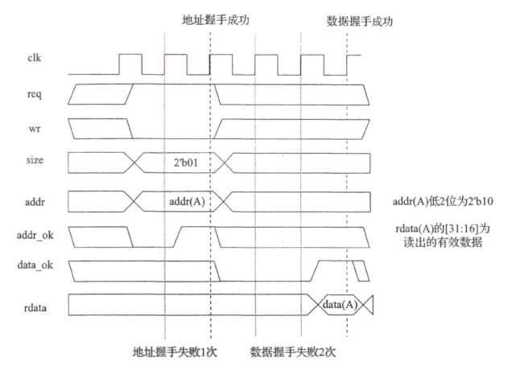
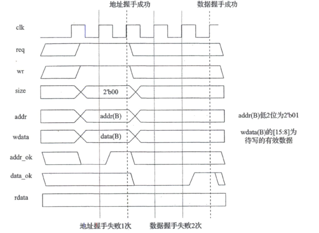
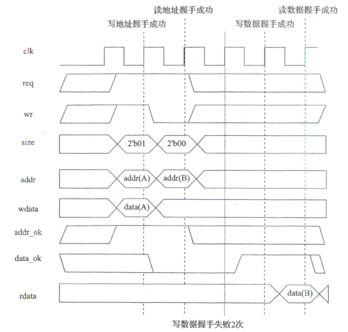
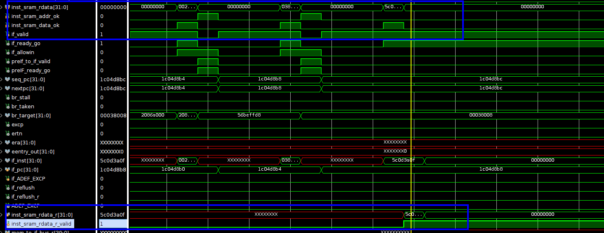
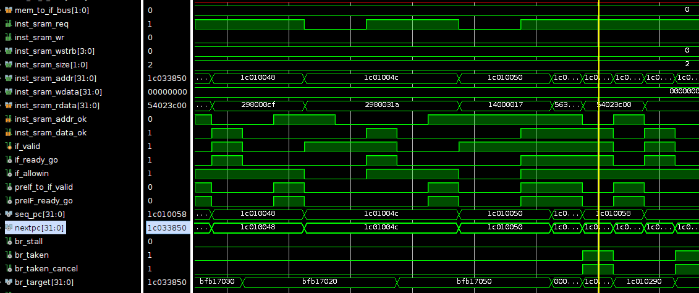
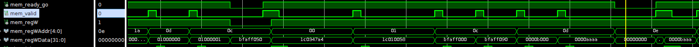
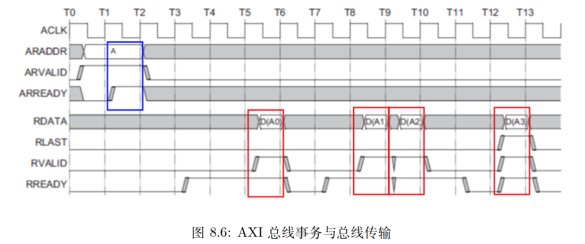
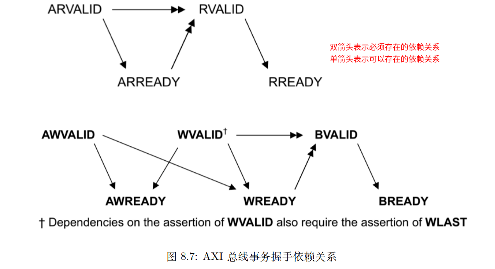
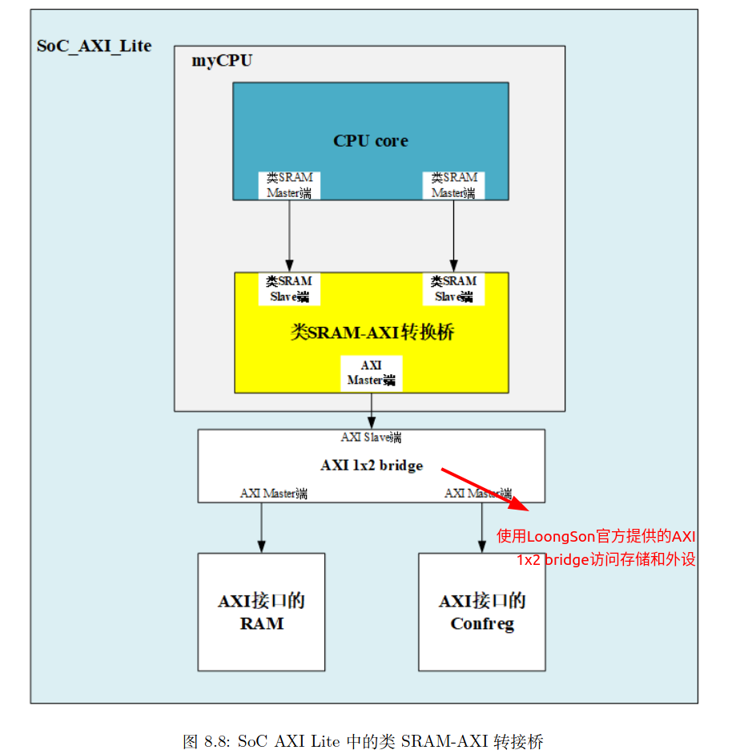
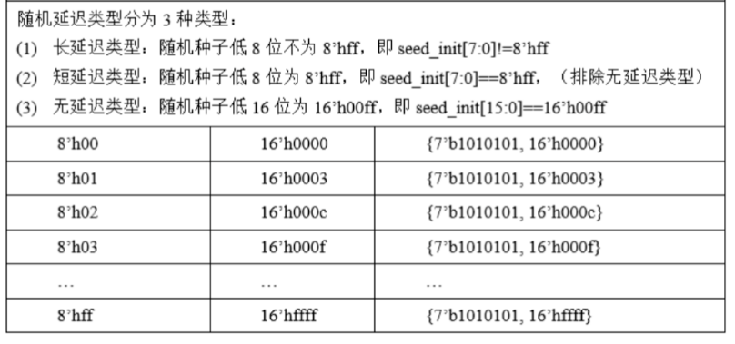

# C8 AXI总线接口设计

## 目录

- [1 类SRAM总线](#1-类SRAM总线)
  - [1.1 主方和从方](#11-主方和从方)
  - [1.2 类SRAM总线接口信号的定义](#12-类SRAM总线接口信号的定义)
  - [1.3 类SRAM总线的读写时序](#13-类SRAM总线的读写时序)
- [2 类SRAM总线的设计](#2-类SRAM总线的设计)
  - [2.1 取指设计的考虑](#21-取指设计的考虑)
    - [2.1.1 考虑ready\_go](#211-考虑ready_go)
    - [2.1.2 考虑allowin](#212-考虑allowin)
    - [2.1.3 考虑异常清空流水线](#213-考虑异常清空流水线)
    - [2.1.4 考虑转移计算未完成的情况](#214-考虑转移计算未完成的情况)
    - [2.1.5 设计综述](#215-设计综述)
    - [2.1.6 优化——还没做](#216-优化还没做)
  - [2.2 访存设计的考虑](#22-访存设计的考虑)
    - [2.2.1 Load访存设计](#221-Load访存设计)
    - [2.2.2 Store访存设计](#222-Store访存设计)
    - [2.2.3 设计综述](#223-设计综述)
- [3 AXI总线协议](#3-AXI总线协议)
  - [3.1 AXI总线协议初步解读](#31-AXI总线协议初步解读)
    - [3.1.1 握手](#311-握手)
    - [3.1.2 总线传输和总线事务](#312-总线传输和总线事务)
    - [3.1.3 地址、大小和数据](#313-地址大小和数据)
    - [3.1.4 多个通道](#314-多个通道)
    - [3.1.5 多通道间同一事务的握手依赖关系](#315-多通道间同一事务的握手依赖关系)
    - [3.1.6 并发访问](#316-并发访问)
    - [3.1.7 乱序响应](#317-乱序响应)
    - [3.1.8 ID](#318-ID)
    - [3.1.9 写响应通道的作用](#319-写响应通道的作用)
    - [3.1.10 突发传输方式](#3110-突发传输方式)
  - [3.2 类SRAM总线接口信号与AXI总线接口信号的对应关系](#32-类SRAM总线接口信号与AXI总线接口信号的对应关系)
- [4 类SRAM-AXI转接桥设计](#4-类SRAM-AXI转接桥设计)
  - [4.1 转接桥顶层接口](#41-转接桥顶层接口)
  - [4.2 转接桥设计要求——保证功能正确且匹配验证环境](#42-转接桥设计要求保证功能正确且匹配验证环境)
  - [4.3 转接桥设计建议——牺牲一些性能和面积来换取控制逻辑的简洁性](#43-转接桥设计建议牺牲一些性能和面积来换取控制逻辑的简洁性)
  - [4.4 设计实现](#44-设计实现)
  - [4.5 优化——还没做](#45-优化还没做)

本章将进入一个新的阶段——为设计出的CPU添加AXI总线接口

总线接口可以自行定义，也可以遵照工业界的标准。但是显然，后者更有助于与大量的第三方IP集成，因此接下来选用`AMBA AXI`总线协议作为CPU总线接口的协议规范

本章的设计任务有两个难点：一是 CPU 内部要如何调整以适应总线接口下的访存行为，二是如何设计出一个遵循 AXI 总线协议的接口。为了降低难度，将这章的设计工作划分为三个阶段：

1. 将原有 CPU 访问 SRAM 的接口调整为类 SRAM 总线接口
2. 设计实现一个 “类 SRAM-AXI” 的转接桥，拼接上阶段一完成的 CPU，完成AXI固定延迟验证
3. 完善设计的CPU，通过AXI随机延迟验证

## 1 类SRAM总线

> 为什么要引入类SRAM总线
>
> 1. 一部分初学者完全不知道如何从现有取指和访存的 SRAM 接口改出 AXI 接口
> 2. 一部分初学者过于激进地使用 AXI 协议的特性，把设计改得太复杂，出现大量错误。

### 1.1 主方和从方

读和写这两种交互行为的发起方称为“主方”[^注释1]，响应方称为“从方”[^注释2]

读操作：主方提出读请求，从方接收请求并返回数据
写操作：主方提出写请求并发出数据，从方接收请求和数据并响应

### 1.2 类SRAM总线接口信号的定义

信号的输入、输出是针对于CPU(主设备)来说的

下表列出了类SRAM总线接口信号的说明：

| 信号       | 位宽 | 方向     | 功能                                     |
| -------- | -- | ------ | -------------------------------------- |
| clk      | 1  | input  | 时钟信号                                   |
| req      | 1  | output | 交互请求信号，高电平表示有读写请求                      |
| wr       | 1  | output | 写请求信号，高电平时表示写请求，低电平且req为高电平表示读请求       |
| size     | 2  | 输出     | 该次请求传输的字节数&#xA;0:1B、1:2B、2:4B          |
| addr     | 32 | 输出     | 该次请求的地址                                |
| wstrb    | 4  | 输出     | 该次写请求的字节写使能                            |
| wdata    | 32 | 输出     | 该次写请求的写数据                              |
| addr\_ok | 1  | 输入     | 该次请求的地址传输OK&#xA;读请求：地址被接收；写请求：地址和数据被接收 |
| data\_ok | 1  | 输入     | 该次请求的数据传输OK&#xA;读：数据返回给主方&#xA;写：数据写入完成 |
| rdata    | 32 | 输入     | 该次读请求返回的数据                             |

1. clk对应于cpu的`clk`
2. req对应于原访存的`en`信号
3. wr对应于原访存的`|wen`信号
4. size是新增的信号

   访指令存储时size设置为2'b10

   访数据存储时size需要结合访存指令设置
5. addr对应于原访存的`addr`信号
6. wstrb对应于原访存的`wen`信号
7. wdata对应于原访存的`wdata`信号
8. addr\_ok是新增的信号

   addr\_ok是用于和req信号一起完成读写请求的握手——在clk上升沿的同时看到req和addr\_ok均为高有效才是请求握手成功
9. data\_ok是新增的信号

   data\_ok对应读事务时，是数据返回的有效信号；对应写事务时，是写入完成的有效信号

   和addr\_ok不同的是，在类SRAM接口中主方对于data\_ok是总可以接收的，所以不设置data\_ok的握手信号
10. rdata对应于原访存的`rdata`信号

### 1.3 类SRAM总线的读写时序



左图为类SRAM总线上的一次读事务时序关系

在clk上升沿时，若addr\_ok和req均为高电平则说明地址握手成功——读地址已成功传递给从方

在clk上升沿时，若data\_ok为高电平则说明数据已成功传输给主方，此时的rdata即为给定位置读出的数据



左图为类SRAM总线上的一次写事务时序关系

在clk上升沿时，若addr\_ok和req均为高电平则说明地址握手成功——读地址已成功传递给从方

在clk上升沿时，若data\_ok为高电平则说明数据已成功写入至从方

> 📌**连续写读时，从方返回的data\_ok是严格按照请求发出的顺序返回的**
>
> **为了简化设计，需要控制连续写读的数目，可以****在主方拉低req信号****来暂停发送新事务的请求，****在从方拉低addr\_ok****信号来暂停接收新事务的请求**



左图为类SRAM总线上的连续写读的时序关系。

在左图中，写请求握手成功后又马上进行读请求的握手，因此响应的data\_ok也是先响应写请求，再响应读请求

## 2 类SRAM总线的设计

根据类SRAM总线接口信号的定义中对类SRAM总线接口信号的分析，可以得到将标准 SRAM 接口改造为类 SRAM 接口只需要增加 3 个信号：`size`、`addr_ok` 和`data_ok`

size信号的生成非常简单，着重分析addr\_ok和data\_ok怎么加入到现有的cpu rtl code中

### 2.1 取指设计的考虑

之前所设计的CPU是在preIF级发送insRAM的请求信号、在IF级得到读数据，结合addr\_ok和data\_ok的性质，很明显addr\_ok应该用于preIF、data\_ok应该用于IF

#### 2.1.1 考虑ready\_go

ready\_go信号的作用当前阶段的组合逻辑工作是否完成

1. preIF插入addr\_ok的应用

   当preIF级接收不到addr\_ok和req高有效的握手时，preIF 的工作没有完成，需要继续发送请求

   结合互锁流水线的valid、allowin、readygo可知在preIF级也应该存在一个readygo，该readygo只有当req和addr\_ok均高有效时为1'b1

   readygo的设置就可以结合to\_valid，从而无法将nextpc传至 IF 阶段的 PC
   ```verilog
      preIF_readygo = req & addr_ok;
      preIF_to_IF_valid = resetn & preIF_readygo;
   ```
2. IF插入data\_ok的应用

   data\_ok是表示数据已读出，可以接收。因此只有当data\_ok有效时，IF级才得到了对应地址的指令，内部的工作才处理完成可以准备好向ID 级流动，所以if\_readygo应该设置为data\_ok
   ```verilog
      if_readygo = data_ok;
   ```

#### 2.1.2 考虑allowin

要达到流水线互锁的目的，还需要使用allowin信号

1. preIF级向IF级流动

   这一过程是：preIF级生成nextPC，并根据该nextPC发起取指请求，当收到addr\_ok时，preIF\_readygo有效；此时若IF级if\_allowin为1，则preIF级的nextPC就流向IF级的PC，preIF级维护下一条指令的取指请求

   根据preIF\_readygo和if\_allowin的组合情况，有以下几种可能
   1. preIF\_readygo为0，if\_allowin为0：请求未成功，preIF继续发送取指请求
   2. preIF\_readygo为0，if\_allowin为1：请求未成功，preIF继续发送取指请求
   3. preIF\_readygo为1，if\_allowin为1：nextPC→PC
   4. preIF\_readygo为1，if\_allowin为0：这种情况需要详细讨论
      1. 被堵在preIF级的指令下一拍不能再继续读地址请求

         这是因为此时preIF\_readygo已为1，表明发送到地址请求已经被类SRAM接收。如果下一拍再置起req，那么类SRAM会将它视为一个新的请求

         CPU 外部接收了多少个读请求，就会一个不漏地返回同样数目的数据
      2. 地址请求已成功，数据可能会随时返回

         如果在if\_allowin为1前IF级就接受到该指令，那么if\_readygo为1，但是因为if\_allowin为0，此时nextPC还无法进入IF级。而类SRAM的rdata接口数据只能保持一拍，所以就需要面临一个选择：“是保持该指令到缓存[^注释3]还是重新让preIF发送取指请求”
         一种简单但相对低效的解决方法是，只有当if\_allowin为1时preIF才能发送地址请求——这里采用这种低效的方法，为了实现简单
   > 📌综上所述，要么需要建立指令缓存，且preIF\_readygo的有效不能仅仅只看req、addr\_ok还需要考虑请求已被接收后的情况；要么直接设置当if\_allowin为1时preIF才能发送地址请求
2. IF级向ID级流动

   这一过程是：IF级等待data\_ok来置if\_readygo，当if\_readygo为1且id\_allowin为1时，IF级的指令流向ID级，IF级维护下一条指令的取指数据或者进入无效状态

   和preIF→IF类似，IF→ID的readygo和allowin也存在四种情况：
   1. if\_readygo为0，id\_allowin为0：IF级继续等待指令返回
   2. if\_readygo为0，id\_allowin为1：IF级继续等待指令返回
   3. if\_readygo为1，id\_allowin为1：if→id
   4. if\_readygo为1，id\_allowin为0：按照之前的写法，取指返回是assign赋值给if\_inst，那么同preIF→IF存在的问题一样，指令只能保持一拍，那么就需要丢弃然后preIF重新请求或者暂存指令，结合preIF→IF的处理，这里采用暂存指令的方法——设置一组触发器来保存 IF 级取回的指令，当该组触发器存有有效数据时， 则选择该组触发器保存的数据作为 IF 级取回的指令送往 ID 级，在 ID 级 allowin 为 1 后，该指令立即进入 ID 级
      同样if\_readygo不能只看data\_ok还需要看临时缓存中是否有有效指令

#### 2.1.3 考虑异常清空流水线

在引入类 SRAM 总线接口后，异常清空流水线的情况也需要特别考虑

1. preIF：根据preIF是否完成了地址请求分两种情况讨论
   1. preIF\_to\_IF\_valid为0

      按照之前所述，preIF\_to\_IF\_valid的赋值不能仅仅看resetn还需要看preIF\_readygo

      不考虑复位的情况，那么此时`preIF_to_IF_valid=0→preIF_readygo=0`。因此此时地址请求并未被类SRAM接收。而类 SRAM 总线允许请求中途更改请求[^注释4]，因此直接根据 Cancel 信息调 整 pre-IF 级发送的地址请求不会有任何影响
   2. preIF\_to\_IF\_valid为1

      而preIF\_to\_IF\_valid为1时，此时读请求地址已成功被类SRAM接收，此时若存在异常清空流水线虽然preIF的nextPC可以马上修改发出新的取指请求，但是IF级收到的第一个返回的指令数据是对当前被取消的取指请求的返回
2. IF：根据if\_allowin分两种情况讨论
   1. if\_allowin为1

      因为`if_allowin=~if_valid | if_ready_go & id_allowin`，所以if\_allowin=1可以得到要么if级没有有效指令if\_valid=0，要么if阶段组合逻辑工作已经完成有指令且即将要进入id级
   2. if\_allowin为0

      如果if\_allowin为0，那么if级指令有效且无法进入ID级，这时又可以根据if\_readygo来分为两种情况
      1. if\_readygo为1

         表明if级已收到过data\_ok，此时if级不存在未完成的类SRAM总线事务，可以直接通过if\_valid=0来取消if级下一拍的指令

         按照之前所采用的方法，if级存在指令缓存，也需要清除指令缓存有效信号——preIF\_to\_IF\_valid为0也是，要清除缓存有效信号
      2. if\_readygo为0

         if级还在等待 data\_ok，此时 if 级有待完成的类 SRAM 总线事务，可以直接将 IF-valid 置0，但是要注意if级后续收到的第一个返回的指令数据是对当前被 Cancel 的取指请求的返回

上述都存在一种共同的情况：异常取消以后，if级收到的第一个返回的指令数据是被取消的取指请求的返回。很明显这一个指令数据应该被丢弃，否则会出现if级指令和pc码不对应的情况。在最多只取消一个指令数据的前提下[^注释5]，解决方法有两个：

1. 在if级状态机，引入新的状态

   该状态表明等一个data\_ok并丢弃当次返回的指令数据
2. 在if级新增一个触发器——用这种方法

   该触发器复位值为0，遇到上述的两种情况时，该触发器置为1；在收到data\_ok时，该触发器置为0

   当触发器值为1时，会将if级readygo置为0从而丢弃第一个返回的指令数据

#### 2.1.4 考虑转移计算未完成的情况

在RAW数据相关中存在一种特殊情况：`Load-to-Branch`，即第i条指令是Load，第i+1条指令是转移指令，转移指令至少有一个源寄存器与Load指令的目的寄存器相同

在这种情况下，当转移指令在ID级时，Load 指令在执行级尚无法获得 Load 结果，因而转移指令无法计算正确的跳转方向或跳转目标，称为 “转移计算未完成”

出现转移计算未完成的情况时，preIF所进行取指请求的nextPC就是不正确的[^注释6]，解决方法有两种：

1. 阻塞取指——用这种方法

   在ID级送到IF级的 bus上新增一个控制信号 `br_stall`，当ID级上存在转移指令且处于计算未完成状态时，将 br\_stall 置为 1；pre-IF 级看到 br\_stall 为 1 时将暂停发出取指请求直至 br\_stall重新为 0
2. 丢弃错误取指

#### 2.1.5 设计综述

1. 为了撤销“preIF\_to\_IF\_readygo=1,if\_allowin=0的特殊情况”，设置只有在if\_allowin时才能发送取指请求
   ```verilog
     assign inst_sram_req   = if_allowin & ~ADEF_EXCP & ~br_stall;  //因为preIF_to_IF_valid的更改是由preIF_readygo设置的，因此不能作为req生成的信号

   ```
2. 针对“if\_readygo=1,id\_allowin=0”的情况，需要添加指令缓存，保存在if级只能维持一拍的指令
   ```verilog
     //if->id的指令缓存
     reg [31:0] inst_sram_rdata_r;
     reg inst_sram_rdata_r_valid;

     always @(posedge clk) begin
       if (~resetn | if_reflush) begin
         inst_sram_rdata_r_valid <= 1'b0;
       end else if (if_valid & if_ready_go & ~id_allowin) begin
         inst_sram_rdata_r <= inst_sram_rdata;
         inst_sram_rdata_r_valid <= 1'b1;
       end else if (id_allowin) begin
         inst_sram_rdata_r_valid <= 1'b0;
       end
     end
   ```
   

   但是缓存的设计也需要看data\_ok时的指令，不然会因为缓存有效而一直更换缓存数据
   ```verilog
     //if->id的指令缓存
     reg [31:0] inst_sram_rdata_r;
     reg inst_sram_rdata_r_valid;

     always @(posedge clk) begin
       if (~resetn | if_reflush) begin
         inst_sram_rdata_r_valid <= 1'b0;
       end else if (if_valid & inst_sram_data_ok & ~id_allowin) begin
         inst_sram_rdata_r <= inst_sram_rdata;
         inst_sram_rdata_r_valid <= 1'b1;
       end else if (id_allowin) begin
         inst_sram_rdata_r_valid <= 1'b0;
       end
     end
   ```
3. 对于转移问题
   1. 因为指令缓存解决了`"if_readygo=1,id_allowin=0"`的特殊情况，而对于`"if_readygo=0"`的情况，阻塞等待data\_ok，因此这种添加了类SRAM的机制使得指令都可以流经到ID阶段——不再使用id\_to\_if\_bus的br\_taken\_cancel[^注释7]，所有转移指令的下一条指令的取消都放到ID阶段进行，也因此ID阶段的转移指令的转移信息需要缓存，否则会出现下图的情况

      

      上图中光标所在位置，nextPC是采取了br\_taken的，但是由于preIF阶段的addr\_ok还没收到，不能更新IF，nextPC也就没法进入到PC——但是该nextPC是可以进行取指请求的。而ID阶段因为下一个时钟周期已经是无效的指令了——转移取消下一个ID指令，所以nextPC不再是转移的nextPC，因此需要保持br信息到缓存。缓存的条件是下一拍要采用转移`br_taken`且id阶段的指令准备好流进下一拍`id_ready_go`但下一拍由if进入id的指令是无效的`if_to_id_valid`
      ```verilog
        //处理转移指令以后的下一条指令因为data_ok长期未到导致的br_taken_cancel的失效问题
        wire br_cancel;
        wire br_taken_cancel;
        reg  br_cancel_r;
        reg  br_cancel_r_valid;
        assign br_cancel = br_taken;
        assign br_taken_cancel = br_cancel_r_valid ? br_cancel_r : br_cancel;

        always @(posedge clk) begin
          if (~resetn | mem_to_id_flush_excp_ertn) begin
            br_cancel_r_valid <= 1'b0;
          end else if (br_taken & ~if_to_id_valid & id_ready_go) begin 
            br_cancel_r_valid <= 1'b1;
            br_cancel_r <= br_cancel;
          end else if (br_cancel_r_valid & if_to_id_valid) begin
            br_cancel_r_valid <= 1'b0;
          end
        end
        
        always @(posedge clk) begin
          if (~resetn | mem_to_id_flush_excp_ertn) begin
            id_valid <= 1'b0;
          end else if (br_taken_cancel) begin  //如果采取分支，那么取消当前IF阶段的指令
            id_valid <= 1'b0;
          end else if (id_allowin) begin
            id_valid <= if_to_id_valid;
          end
          if (id_allowin & if_to_id_valid) begin
            id_data <= if_to_id_bus;
          end
        end
      ```
   2. 对于`load-to-branch`的阻塞问题，需要在ID阶段检测“是否branch所读的寄存器是exe阶段load的目的寄存器”，如果是则置br\_stall有效并传输到IF阶段，禁止preIF的取指请求
      ```verilog
        assign br_stall = id_valid & load_delay & br_taken;


        //封包id组合逻辑传递给if组合逻辑preIF的数据
        assign id_to_if_bus = {br_stall, br_taken, br_target};
        
        assign inst_sram_req   = if_allowin & ~ADEF_EXCP & ~br_stall;  //因为preIF_to_IF_valid的更改是由preIF_readygo设置的，因此不能作为req生成的信号

      ```
   3. 当nextPC无法被更新时，需要缓存id\_to\_if\_bus
      1. 转移指令的下一条指令的地址请求还没被响应，无法进入IF级
      2. 因为类SRAM总线的存在，导致if级的内容并不始终有效。而转移可以立即更新的条件是if级有效且preIF即将进入if级
      3. 当地址请求完成，等待数据响应时，可以更新nextPC进行下一个取指请求
         因此可以更新的条件是——有效指令进入id段|当前取指请求成功得到地址响应进入if段，其不满足的条件是\~preIF\_readygo | \~if\_allowin | \~if\_valid
      ```verilog
        reg [`ID_TO_IF_WD-1:0] id_to_if_bus_r;
        reg                    id_to_if_bus_r_valid;
        reg                    bd_done;
        always @(posedge clk) begin
          if (~resetn | if_reflush) begin
            id_to_if_bus_r_valid <= 1'b0;
          end else if (id_to_if_bus[32] & id_allowin & ~(preIF_ready_go & if_valid & if_allowin)) begin //而转移的取消必须都进入到id阶段，因此这里是也需要if_valid和if_allowin
            id_to_if_bus_r <= id_to_if_bus;
            id_to_if_bus_r_valid <= 1'b1;
          end else if ((bd_done | if_valid) & preIF_ready_go & if_allowin) begin //可以成功更新nextPC
            id_to_if_bus_r_valid <= 1'b0;
          end
        end
      ```
   4. 使用bd\_done解决if\_valid无效时的nextPC更新问题
      > 📌总的来说，nextPC的更新是要么转移指令的下一条指令到达if级，要么转移指令的下一条指令到达id级
      > 因此当if\_valid无效时，即转移指令的下一条指令目前还在取指请求或者即将进入if级，此时也应该要更新PC。但是if\_valid无效，所以需要使用另外的信号来记录这一种可以更新的情况——bd\_done
      ```verilog
        always @(posedge clk) begin 
          if (~resetn | if_reflush) begin
            bd_done <= 1'b0;
          end else if (br_taken & ~bd_done & (if_valid ^ (preIF_ready_go & if_allowin))) begin
            bd_done <= 1'b1;
          end else if (bd_done & preIF_ready_go & if_allowin) begin
            bd_done <= 1'b0;
          end
        end
      ```
4. 异常处理

   记录异常的第二种情况的清除if级指令
   ```verilog
     //br信息也需要保持到缓存，以在preIF_ready_go无效时保持进入到IF，同样MEM到ID的更新nextpc的信息也需要保持
     reg [`MEM_TO_ID_WD-1:0] mem_to_if_bus_r;
     reg mem_to_if_bus_r_valid;
     always @(posedge clk) begin
       if (~resetn) begin
         mem_to_if_bus_r_valid <= 1'b0;
       end else if (~mem_to_if_bus_r_valid & (mem_to_if_bus[1] | mem_to_if_bus[0]) & ~preIF_ready_go) begin
         mem_to_if_bus_r <= mem_to_if_bus;  //这也应该加一个if_allowin吧？不用，异常针对if_readygo不为1有处理
         mem_to_if_bus_r_valid <= 1'b1;
       end else if (mem_to_if_bus_r_valid & preIF_ready_go) begin
         mem_to_if_bus_r_valid <= 1'b0;
       end
     end
     
     wire if_reflush;
     assign if_reflush = mem_to_if_bus[1] | mem_to_if_bus[0];
     wire if_reflush_r;
     assign if_reflush_r = excp | ertn;
     
     assign if_allowin     = ~if_valid | if_ready_go & id_allowin | if_reflush_r;
     
     always @(posedge clk) begin
       if (~resetn) begin
         if_valid <= 1'b0;
         if_pc <= 32'h1bff_fffc;
       end else if (if_allowin) begin
         if_valid <= preIf_to_if_valid;
       end else if (if_ready_go & if_reflush) begin
         if_valid <= 1'b0;
       end
       if (if_allowin & preIf_to_if_valid) begin //原来在if_valid & (~id_allowin | ~if_ready_go)时利用brcancel取消指令的方法，都用到id阶段处理了，因为现在都能流经到id阶段
         if_pc <= nextpc;
         if_ADEF_EXCP <= ADEF_EXCP;
       end
     end
     
     //异常清空时的特殊处理
     reg excp_reg;
     always @(posedge clk) begin
       if (~resetn) begin
         excp_reg <= 1'b0;
       end else if (if_valid & if_reflush & ~if_ready_go) begin
         excp_reg <= 1'b1;
       end else if (inst_sram_data_ok) begin
         excp_reg <= 1'b0;
       end
     end

   ```
   > 📌当此时if\_ready\_go无效时，即表明if级指令正在等待data\_ok，如果收到了data\_ok时也不要把他进入id级

#### 2.1.6 优化——还没做

设计时preIF→IF也建立缓存，取指请求不再看if\_allowin

### 2.2 访存设计的考虑

将访存分为load和store两类分别进行分析

#### 2.2.1 Load访存设计

load 指令设计的逻辑改动很大程度上可以借鉴前一小节中介绍的取指设计调整。其中发出 load 访存请求的 EX 级对应发出取指请求的 pre-IF 级，接收数据返回的 MEM 级对应接收取指返回的 IF 级

核心是以下几点：

1. 指令在发起访存的那一级，都要完成地址请求的握手（addr\_ok 正在或已经为 1）才能进入下一级流水
2. 指令在接收数据的那一级，都要等待数据返回握手完成（data\_ok 正在或已经为 1）才能进入下一级流水
3. 对于某指令访存请求被接收后数据已返回，而该指令却因为下一级反馈的 allowin 无效而无 法进入下一级的情况，建议在看到下一级反馈的 allowin 有效时才发出访存请求以简化设计
4. 对于已经被接收的访存请求，如果其对应的指令因为异常清空流水线而被取消时，一定要记 录下这些访存请求，进而在它们的数据返回时将其丢弃

   store 指令已为实现精确异常而保证了其发起访存请求时就一定不会再被异常取消[^注释8]，如果将 load 指令发访存请求的条件也设置的同 样严格，那么就不会出现这种情况，也就无须额外处理

此外，如果MEM级参与前递的有效信号是mem\_valid需要修改至ms\_to\_ws\_valid

#### 2.2.2 Store访存设计

store指令在EXE级的改动和load指令一致，因为类SRAM总线中关于addr\_ok的定义是“当操作是写操作时，addr\_ok 为 1 表示写地址和写数据均被接收”；store指令在MEM级也需要在data\_ok有效后才能进入WB级，这是因为类SRAM总线对于读写操作均会产生data\_ok[^注释9]，如果store不接受这个data\_ok那么可能会被load当做它的data\_ok

此外在MEM阶段，因为如果是load引发的前递，会需要等待data\_ok因此需要再设置id的阻塞——即如果mem阶段存在写寄存器且写寄存器的来源来自于mem且data\_ok尚未满足，那么阻塞id

#### 2.2.3 设计综述

1. EXE级的ready\_go需要添加“如果有发出访存请求，那么exe需要阻塞直到req和addr\_ok均有效”，通过画真值表得到表达式是`~((exe_memW | res_from_mem) & ~(data_sram_req & data_sram_addr_ok))`
2. 为消除“exe\_ready\_go有效而mem\_allowin无效”的情况，访存请求需要在mem\_allowin有效时发送
3. 有异常时不发出请求req，实现精确异常
4. mem参与前递的mem\_valid需要更改为mem\_to\_wb\_valid
5. mem\_ready\_go需要根据“当前阶段是否是访存指令”来设置，如果是那么需要等待data\_ok
   `~((mem_memW | res_from_mem) & ~data_sram_data_ok)` exe级需要增加exe\_memW信号到mem级的传递
6. 因为data\_ok不是总有效的，所以如果id阶段涉及到load-delay，且load指令在mem级阻塞，那么也需要阻塞id级的指令直到mem级的load指令收到data\_ok

   mem级需要传递mem\_ready\_go信号到id级

   id级需结合mem级是否存在load指令以及是否有mem级的前递来设置阻塞
   ```verilog
     wire mem_data_ok_stall = ~mem_ready_go & mem_regW & mem_valid & id_valid & ((need_rj & regAddrA != 5'b0 & mem_regWAddr == regAddrA) |
                                     (need_rkd & regAddrB != 5'b0 & mem_regWAddr == regAddrB));
     assign id_ready_go = ~load_delay & ~csr_delay & ~mem_data_ok_stall;
   ```
   这里遇到了一些问题

   

   此时mem\_valid是无效的，因此不能\&mem\_valid

   可能会有短延时的id级存在的问题，导致ld指令已经将数据写回，id还在判断阻塞，这里可以加上wbpc和mempc的比较来消除阻塞

## 3 AXI总线协议

AMBA AXI总线接口基本介绍

### 3.1 AXI总线协议初步解读

#### 3.1.1 握手

为了实现处理器和内存、外设交互的步调一致，AXI总线协议采用的是握手机制——每个通道的valid和ready信号。且因为 AXI 协议是面向一个同步的数字逻辑电路设计来定义的，所以valid和ready信号不是异步的互锁，统一在时钟上升沿看这一对信号

> 📌为了避免死锁，AXI规范中明确了每个通道中valid和ready的依赖关系：
>
> valid的置有效一定不能依赖于ready是否有效；但ready的有效可以依赖于valid的有效
>
> 在之前的CPU设计中，valid相当于p1\_to\_p2\_valid，而ready相当于p2\_allowin

#### 3.1.2 总线传输和总线事务

总线事务的概念是为了更方便的描述总线的行为而产生的[^注释10]，一次总线事务对应一次完整的读/写过程

一个总线事务包含多个总线传输。总线传输只针对 valid 和 ready 同时有效（即握手成功）的那个时钟周期。如下图中的一次AXI读事务，包括读请求上的一次传输（蓝色框）和读响应上的四次传输（红色框）



#### 3.1.3 地址、大小和数据

根据地址（ARADDR、AWADDR）来区分数据（写数据WDATA，读数据RDATA），地址能够寻址的最小粒度是字节（WSTRB），每次交互数据量的大小（ARSIZE、AWSIZE）以及交互多少次（ARLEN、AWLEN）可以由主方告诉从方

AXI总线协议是单向的，不用考虑方向

#### 3.1.4 多个通道

AXI为了实现非常高的总线传输性能定义了5个通道：写地址请求、写数据、写响应、读地址请求、读响应

因为读和写操作都需要交互地址和数据，合在一起的通道就必须在进行读操作和写操作之间二选一；而分开的读写通道，则可以并行进行读操作和写操作——在资源和性能之间平衡

可以用网购下订单来类比读通道，用退货来类比写通道

#### 3.1.5 多通道间同一事务的握手依赖关系



读事务：只有在ARVALID和ARREADY都有效时，从方才能将RVALID置有效

写事务：只有写请求和写数据的最后一次传输都被从方接收以后，从方才会反馈写响应有效信号

写请求和写数据并没有任何依赖关系，但是建议AWVALID和WVALID一并置有效

#### 3.1.6 并发访问

对于某个主方来说，它可以连续发出多个请求，即使先前发出的请求所需要的数据还没有传输完毕。对于某个从方来说，它可以在没有传输完之前请求所需要的数据的时候，就接收来自一个或多个主方发来的新请求

#### 3.1.7 乱序响应

通俗地说，事务的乱序响应就是后发出的请求可能先返回数据。允许事务的乱序响应是为了提升总线的传输性能。当系统中集成了多个主方，或者主方支持乱序执行机制，那么总线乱序响应会显著提升性能

> 📌除非发出的一连串读请求都是采用同一个 ID，否则就要考虑后发的请求的数据先返回的情况
>
> 如果希望先发出的请求一定先返回，那么就必须将这些请求的 ID 置为相同值

#### 3.1.8 ID

根据事务的ID来区分并发进行的不同事务，同一事务所使用的通道的ID相同——读通道ARID==RID，写通道AWID==WID==BID

> 📌不同的事务的ID之间没有相关性→不同事务可以设置同一个ID→这样的作用是保证先请求的先响应

#### 3.1.9 写响应通道的作用

之所以要设置写响应通道，是为了解决“RAW”相关

因为读写通道分离且AXI总线从主方到从方之间可以有任意层缓存的原因，会存在这样的情况：假设系统中只有一个主设备是 CPU，地址 A 处的原值是 0，现在 CPU 通过 AXI 总线向 A 地址处写 1，在最后一个数据写出去（wvalid && wlast && wready == 1）之后，CPU 再通 过 AXI 总线读 A 地址。此时因为上述的两个原因，写地址、写数据可能会堵塞在写通道的某处，而读通道不影响，从而使得读地址和读响应先到达从设备，最终将原值0读响应给主方

因此需要设置一个信号，对于读写同一地址且写先于读的请求，需要在接收到写响应以后再发出读请求

#### 3.1.10 突发传输方式

突发传输方式是为了减少多节拍传输数据的握手时间，实现更高性能的传输[^注释11]——只握手一次，给出访问数据的首地址，其余数据地址自动递增推算

而为了实现地址的自动递增推算，需要起始地址、地址变化规律和增量三个参数，分别对应AXI的addr、burst、len

### 3.2 类SRAM总线接口信号与AXI总线接口信号的对应关系

1. 当req=1且wr=0时，对应arvalid信号
2. 当req=1且wr=1时，对应awvalid信号
3. 当前总线事务是读事务时，addr\_ok对应aready信号
4. 当前总线事务是写事务时，addr\_ok对应AXI总线上的awready和wready都已经或者正在为1
5. 当前总线事务是读事务时，data\_ok对应rvalid信号
6. 当前总线事务是写事务时，data\_ok对应bvalid信号
7. 当前总线事务是读事务时，addr对应araddr、size对应arsize、rdata对应rdata
8. 当前总线事务是写事务时，addr对应awaddr、size对应awsize、wdata对应wdata、wstrb对应wstrb

## 4 类SRAM-AXI转接桥设计

### 4.1 转接桥顶层接口

转接桥对内是同CPU发出的类SRAM总线信号对接（CPU发出指令的类SRAM请求和数据的类SRAM请求），对外需要对接AXI总线信号。因此转接桥需要有两个类SRAM接口，一个AXI接口

整个转接桥与 CPU 其余部分，以及与 SoC 中的其他部分的关系如下图所示：



注意转接桥的类SRAM接口是从方，AXI接口是主方

### 4.2 转接桥设计要求——保证功能正确且匹配验证环境

1. ARESETN有效期间，AXI主方端口的VALID信号输出必须是0，READY信号不能是不定态
2. AXI主方端口的所有valid输出信号的置1逻辑中，一定不能允许组合逻辑来自同一通道的ready输入信号，但是可以来自于时序逻辑的ready输入——valid有效一定不能根据ready得到
3. AXI主方端口的所有ready输出信号，一定不能允许组合逻辑来自同一通道的valid输入信号，但是可以来自于时序逻辑的valid输入——设计要求

> 📌2和3使得主方输出的valid、ready分别和当前时刻输入的ready、valid无关，但可以和上一时刻的有关

1. 无论读、写请求，类 SRAM 接口上的事务要和 AXI 接口上的事务严格一一对应
2. 在AXI主方的读请求、写请求、写数据通道上，如果主方输出的valid置为1时的从方ready输入是0，那么在ready 信号变为 1 之前，不允许主方变更该通道的所有输出信号——与类 SRAM 总线不同，类 SRAM 总线允许中途更改请求
3. AXI主方在发起读请求时，要先确保“该请求与‘已发出请求但尚未接收到写响应的写请求’”不存在相关

   如果存在，那么需要阻塞读请求的发出，不能使用前递

   简单的方法是：只要有写请求就停止发送读请求，直至主方收到写响应

   高效的方法是：记录那些 “已发出请求但尚未接收到写响 应的写请求” 的地址waddr、位宽wsize、字节写使能wstrb等信息，后续读请求查询并比较这些信息后再决定 是否发出

### 4.3 转接桥设计建议——牺牲一些性能和面积来换取控制逻辑的简洁性

1. 除了可以置为常值的信号外，所有 AXI 主方的输出直接来自触发器 Q 端
2. 为读数据预留缓存，从 rdata 端口上收到的数据先保存到这个预留缓存中。AXI 上最多支持几个 “已完成读请求握手但数据尚未返回的读事务”，就预留同样数目的 rdata 缓存&#x20;
3. 取指对应的 arid 恒为 0，load 对应的 arid 恒为 1
4. 控制 AXI 读写的状态机分为独立的 4 个状态机：读请求通道一个，读响应通道一个，写请求和写数据共用一个，写响应一个
5. 类 SRAM 从方端的输入信号不用锁存后再使用
6. 数据端发来的类 SRAM 总线的读请求优先级固定高于取指端发来的类 SRAM 总线的读请求
   **load优先级大于取指**
7. 类 SRAM 从端输出的 addr\_ok 和 data\_ok 信号若是来自组合逻辑，那么这个组合逻辑中不要引入 AXI 接口上的 valid 和 ready 信号 ？

### 4.4 设计实现

```verilog
`include "mycpu.h"
module axi_bridge(
    //AXI信号 主方
    input         clk,
    input         aresetn,
    
    //读请求通道
    output  [3:0]   arid,
    output  [31:0]  araddr,
    output  [7:0]   arlen,  //0
    output  [2:0]   arsize,
    output  [1:0]   arburst,//2b'01
    output  [1:0]   arlock, //0
    output  [3:0]   arcache,//0
    output  [2:0]   arprot, //0
    output          arvalid,
    input           arready,
    
    //读响应通道
    input   [3:0]    rid,
    input   [31:0]   rdata,
    input   [1:0]    rresp,
    input            rlast,
    input            rvalid,
    output  reg      rready,
               
    //写请求通道              
    output  [3:0]   awid,
    output  [31:0]  awaddr,
    output  [7:0]   awlen,
    output  [2:0]   awsize,
    output  [1:0]   awburst,
    output  [1:0]   awlock,
    output  [3:0]   awcache,
    output  [2:0]   awprot,
    output  reg     awvalid,
    input           awready,
    
    //写数据通道
    output  [3:0]   wid,
    output  [31:0]  wdata,
    output  [3:0]   wstrb,
    output          wlast,
    output  reg     wvalid,
    input           wready,
    
    //写响应通道
    input   [3:0]   bid,
    input   [1:0]   bresp,
    input           bvalid,
    output  reg     bready,
  
    //类SRAM信号 从方
    //inst
    input inst_sram_req,
    input inst_sram_wr,
    input [1:0] inst_sram_size,
    input [3:0] inst_sram_wstrb,
    input [31:0] inst_sram_addr,
    input [31:0] inst_sram_wdata,
    output  inst_sram_addr_ok,
    output  inst_sram_data_ok,
    output [31:0] inst_sram_rdata,

    //data
    input data_sram_req,
    input data_sram_wr,
    input [1:0] data_sram_size,
    input [3:0] data_sram_wstrb,
    input [31:0] data_sram_addr,
    input [31:0] data_sram_wdata,
    output  data_sram_addr_ok,
    output  data_sram_data_ok,
    output  [31:0] data_sram_rdata
);

//读写通道分离 分离addr_ok信号
wire        rdata_sram_addr_ok;
wire        wdata_sram_addr_ok;

//读请求通道 触发器Q端信号
reg         arvalid_r; //输出arvalid
reg [ 3:0]  arid_r;    //输出arid 根据arid在指令addr、size和数据addr、size选择生成arsize、araddr
reg [ 1:0]  inst_sram_size_r; //输出访指令arsize
reg [31:0]  inst_sram_addr_r; //输出访指令存araddr
reg [ 1:0]  rdata_sram_size_r; //输出访数据arsize
reg [31:0]  rdata_sram_addr_r; //输出访指令存araddr 

//请求完毕，等待读响应
reg         data_read_wait; 
reg         inst_read_wait;

reg [ 1:0]  wdata_sram_size_r; //输出awsize
reg [ 3:0]  wdata_sram_wstrb_r;//输出wstrb
reg [31:0]  wdata_sram_addr_r;//输出awaddr

reg [31:0]  data_sram_wdata_r;//输出awaddr

reg         wdata_received;//表示从设备已收到写数据，wready可再有效
reg         waddr_received;//表示从设备已收到写地址，awready可再有效

//-----------------------------------读请求相关信号--------------------------------------//
//因为读请求时，需要传输地址等信息，所以需要在req和addr_ok确认对应请求并且类SRAM总线从方收到地址后再设置
//arid_r  不同事务都用同一个id，先请求的先响应
always @(posedge clk)begin
    if(~aresetn)
        arid_r <= 4'b0000;
    else if(inst_sram_req & inst_sram_addr_ok)//读指令存储请求且读指令地址成功收到
        arid_r <= 4'b0000;
    else if(data_sram_req & rdata_sram_addr_ok)//读数据存储请求且读数据地址成功收到
        arid_r <= 4'b0001;
    else
        arid_r <= arid_r;//存在阻塞、等待时的处理 是不是实现的不改变值 ready还未为1时
end

//arsize_r选择之一 inst_sram_size_r
always @(posedge clk)begin
    if(~aresetn)
        inst_sram_size_r <= 2'b00;
    else if(inst_sram_req & inst_sram_addr_ok)
        inst_sram_size_r <= inst_sram_size;
    else
        inst_sram_size_r <= inst_sram_size_r;
end

//araddr_r选择之一 inst_sram_addr_r
always @(posedge clk)begin
    if(~aresetn)
        inst_sram_addr_r <= 32'b0;
    else if(inst_sram_req & inst_sram_addr_ok)
        inst_sram_addr_r <= inst_sram_addr;
    else
        inst_sram_addr_r <= inst_sram_addr_r;
end

//arsize_r选择之一 data_sram_size_r
always @(posedge clk)begin
    if(~aresetn)
        rdata_sram_size_r <= 2'b00;
    else if(data_sram_req & rdata_sram_addr_ok)
        rdata_sram_size_r <= data_sram_size;
    else
        rdata_sram_size_r <= rdata_sram_size_r;
end

//araddr_r选择之一 data_sram_addr_r
always @(posedge clk)begin
    if(~aresetn)
        rdata_sram_addr_r <= 32'b0;
    else if(data_sram_req & rdata_sram_addr_ok)
        rdata_sram_addr_r <= data_sram_addr;
    else
        rdata_sram_addr_r <= rdata_sram_addr_r;
end

//读通道正在进行读指令，等待读响应
always @(posedge clk)begin
    if(~aresetn)
        inst_read_wait <= 1'b0;
    else if(arvalid & arready & arid_r == 4'b0000)
        inst_read_wait <= 1'b1;
    else if(rvalid & rready & rid == 4'b0000)//读响应已收到，且是读指令
        inst_read_wait <= 1'b0;
end

//读通道正在进行读数据，等待读响应
always @(posedge clk)begin
    if(~aresetn)
        data_read_wait <= 1'b0;
    else if(arvalid & arready & arid_r == 4'b0001)
        data_read_wait <= 1'b1;
    else if(rvalid & rready & rid == 4'b0001)//读响应已收到，且是读数据
        data_read_wait <= 1'b0;
end

//arvalid
always @(posedge clk)begin
    if(~aresetn) //
        arvalid_r <= 1'b0;
    else if(arvalid & arready) //读请求收到响应则复位
        arvalid_r <= 1'b0;
    else if(data_sram_req & rdata_sram_addr_ok | inst_sram_req & inst_sram_addr_ok) //这里可以加req吧？加req更好理解
        arvalid_r <= 1'b1;
end

//AXI主方，除了常量，其余输出信号的均来自触发器Q端 
//读请求通道输出信号
assign arvalid = arvalid_r;
assign arid    = arid_r;
assign araddr  = (arid == 4'b0000) ? inst_sram_addr_r : rdata_sram_addr_r; 
//size是3位，000->1B 001->2B 010->4B 011->8B 100->16B 101->32B 110->64B 111->128B
assign arsize  = (arid == 4'b0000) ? {1'b0, inst_sram_size_r} : {1'b0, rdata_sram_size_r};

assign arlen   = 8'b0;
assign arburst = 2'b01;
assign arlock  = 1'b0;
assign arcache = 1'b0;
assign arprot  = 1'b0;

assign rdata_sram_addr_ok = //这为什么不用data_read_wait load优先级大于取指 设置了有写请求就暂停读 addr_ok无效
        (~arvalid & data_sram_req == 1'b1 & data_sram_wr == 1'b0) ? 1'b1 : 1'b0; //读通道没有被占用且进行读数据RAM请求
assign inst_sram_addr_ok = 
        (~inst_read_wait & ~arvalid & inst_sram_req == 1'b1 & inst_sram_wr == 1'b0 & 
            (data_sram_req == 1'b0 | data_sram_wr == 1'b1)) ? 1'b1 : 1'b0;//load优先级大于取指，需要判断没有读数据请求或者有但是是写数据

//-----------------------------------读响应相关信号-------------------------------------//
always @(posedge clk)begin
    if(~aresetn)
        rready <= 1'b0;
    else if(rready & rvalid)
        rready <= 1'b0;
    else if(inst_read_wait | data_read_wait) //等待准备接收数据
        rready <= 1'b1;
end

assign inst_sram_data_ok = (rvalid & rready & rid == 4'b0000);
assign data_sram_data_ok = (rvalid & rready & rid == 4'b0001) | bvalid & bready;//数据存储的data_ok包括读数据存储和写响应

assign inst_sram_rdata   = (rvalid & rready & rid == 4'b0000) ? rdata : 32'b0;
assign data_sram_rdata   = (rvalid & rready & rid == 4'b0001) ? rdata : 32'b0;

assign data_sram_addr_ok = rdata_sram_addr_ok | wdata_sram_addr_ok;//读写通道分离

//-----------------------------------写请求相关信号-------------------------------------//
//处理写地址
always @(posedge clk)begin 
    if(~aresetn)
        wdata_sram_addr_r <= 32'b0;
    else if(data_sram_req & wdata_sram_addr_ok)
        wdata_sram_addr_r <= data_sram_addr;
    else
        wdata_sram_addr_r <= wdata_sram_addr_r;
end

//处理写长度
always @(posedge clk)begin
    if(~aresetn)
        wdata_sram_size_r <= 2'b00;
    else if(data_sram_req & wdata_sram_addr_ok)
        wdata_sram_size_r <= data_sram_size;
    else
        wdata_sram_size_r <= wdata_sram_size_r;
end

//处理写数据 写请求和写数据同时设置
always @(posedge clk)begin
    if(~aresetn)
        data_sram_wdata_r <= 32'b0;
    else if(data_sram_req & wdata_sram_addr_ok)
        data_sram_wdata_r <= data_sram_wdata;
    else
        data_sram_wdata_r <= data_sram_wdata_r;
end

//处理写选通
always @(posedge clk)begin
    if(~aresetn)
        wdata_sram_wstrb_r <= 4'b0000;
    else if(data_sram_req & wdata_sram_addr_ok)
        wdata_sram_wstrb_r <= data_sram_wstrb;
    else
        wdata_sram_wstrb_r <= wdata_sram_wstrb_r;
end

//从设备已收到写数据
always @(posedge clk)begin
    if(!aresetn)
        wdata_received <= 1'b0;
    else if(wvalid & wready)
        wdata_received <= 1'b1;
    else if(wdata_received & waddr_received)
        wdata_received <= 1'b0;
end

//从设备已收到写地址
always @(posedge clk)begin
    if(~aresetn)
        waddr_received <= 1'b0;
    else if(awvalid & awready)
        waddr_received <= 1'b1;
    else if(wdata_received & waddr_received) //写地址和写数据都被从设备收到后再开始新的写请求
        waddr_received <= 1'b0;
end

//写请求 valid信号的发送
always @(posedge clk)begin
    if(!aresetn)
        awvalid <= 1'b0;
    else if(data_sram_req & data_sram_wr)//这里是不是可以替换成req&addr 可以 组合逻辑
        awvalid <= 1'b1;
    else if(awvalid & awready)
        awvalid <= 1'b0;
end

always @(posedge clk)begin
    if(~aresetn)
        wvalid <= 1'b0;
    else if(data_sram_req & data_sram_wr)//写请求和写数据同时置有效
        wvalid <= 1'b1;
    else if(wvalid & wready)
        wvalid <= 1'b0;
end

assign awaddr   = wdata_sram_addr_r;
assign awsize   = wdata_sram_size_r;
assign awid     = 4'b0001;
assign awlen    = 8'b0;
assign awburst  = 2'b01;
assign awlock   = 1'b0;
assign awcache  = 1'b0;
assign awprot   = 1'b0;

assign wdata    = data_sram_wdata_r;
assign wstrb    = wdata_sram_wstrb_r;
assign wid      = 4'b0001;
assign wlast    = 1'b1;  

assign wdata_sram_addr_ok = (data_sram_req == 1'b1 && data_sram_wr == 1'b1) ? 1'b1 : 1'b0;

//-------------------------------------写响应相关信号-----------------------------------//
always @(posedge clk)begin
    if (!aresetn) begin
        bready <= 1'b0;
    end
    else if (wvalid & wready & awvalid & awready) begin
        bready <= 1'b1;
    end
    else if (wdata_received & awvalid & awready) begin
        bready <= 1'b1;
    end
    else if (wvalid & wready & waddr_received) begin
        bready <= 1'b1;
    end
    else if (bvalid & bready) begin
        bready <= 1'b0;
    end
end

endmodule
```

> 仿真时通过设置confreg.v的RANDOM\_SEED来达到随机延时的效果
>
> 

### 4.5 优化——还没做

记录写相关信息，再判断阻塞；也没有设置缓存

记录写相关信息也需要设置缓存即需要读缓存和写缓存

缓存的设置方法可以参照类SRAM总线的wrap 类SRAM总线接口，此时的addr\_ok和data\_ok需要结合缓存队列来判断

[^注释1]: CPU

[^注释2]: 从设备

[^注释3]: 保持指令到缓存也需要暂停preIF的取指请求，否则新的被接收的请求又会返回新的指令码，将覆盖掉缓存中保存的指令；当这个指令缓存有效时，指令从 pre-IF 级进入 IF 级后，将无需再等待类SRAM接口返回的 的 data\_ok，而是直接从指令缓存中拿指令

[^注释4]: 多返回的addr\_ok怎么弄

[^注释5]: 其他设计情况需要自己结合这两种方法修改

[^注释6]: 可能有的读者会认为：如果我的设计中 pre-IF 级发取指请求时已经看了 IF 级反馈的 allowin 是否为 1 了，那么当译码级的转移指令计算未完成时，它就会堵住流水线，然后 IF 级也被堵着， IF 级传递到 pre-IF 级的 allowin 就是 0，那么 pre-IF 也就不会发出请求了，也就不会出现上面 分析的出错情况，不需要额外处理的。这里的分析乍一看上去好像挺有道理，但是其推导过程中 引入了一个错误的隐含条件，即 “它就会堵住流水线，然后 IF 级也被堵着” 这句话是有问题的。 当指令 RAM 不再是固定一个时钟周期返回数据而是可能随机多个时钟返回数据时，ID 级存在 指令的时候，IF 级未必存在指令。所以，转移指令因为计算未完成在 ID 级等待时，pre-IF 级看 到 IF 级反馈的 allowin 仍然可能为 1。总线接口引入的内存访问延迟时钟周期数随机化，是初学 者最容易忽视的设计难点，一定要时刻提防

[^注释7]: 原来使用的条件是 if\_valid&(\~if\_ready\_go | \~id\_allowin)

[^注释8]: store的写是在无异常时进行，有异常时写命令无效

[^注释9]: 原因是

[^注释10]: 因为这个过程可能涉及很多信号且在总线上持续多个周期，且对于高性能片上总线而言，同一时刻上还可能进行着多个不同的读写操作

[^注释11]: 假设总线上读数据的宽度是 32 比特，那 么当你想读 512 比特地址连续的数据时，该怎么发送总线请求呢？一种方式是，发送 16 次 4 字 节的读地址请求，这意味着要在读地址通道进行 16 次握手。如果因为时序的原因，主、从方之间 的握手不可能逐拍连续完成，那么这 16 次握手就会耗费很多时间
