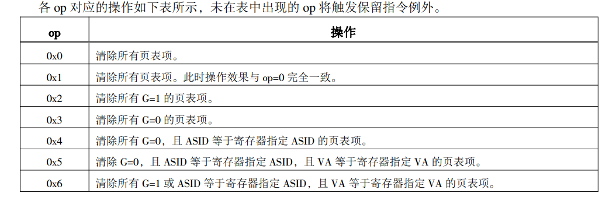

# C9 存储管理单元设计

## 目录

- [1 MMU相关规范定义](#1-MMU相关规范定义)
  - [1.1 指令集手册相关规定](#11-指令集手册相关规定)
  - [1.2 CPU 硬件方面在进行访存虚实地址转换时基本过程](#12-CPU-硬件方面在进行访存虚实地址转换时基本过程)
  - [1.3 虚实地址转换过程中所需的信息软件方面是如何进行配置的](#13-虚实地址转换过程中所需的信息软件方面是如何进行配置的)
  - [1.4 引入映射地址翻译模式而在实现中需要新增的异常](#14-引入映射地址翻译模式而在实现中需要新增的异常)
- [2 TLB模块设计分析](#2-TLB模块设计分析)
  - [2.1 分析要点](#21-分析要点)
  - [2.2 设计实现](#22-设计实现)
- [3 MMU相关CSR与指令的实现](#3-MMU相关CSR与指令的实现)
  - [3.1 MMU相关CSR设计实现](#31-MMU相关CSR设计实现)
  - [3.2 MMU相关的TLB指令实现](#32-MMU相关的TLB指令实现)
    - [3.2.1 TLBSRCH](#321-TLBSRCH)
    - [3.2.2 TLBWR、TLBFILL](#322-TLBWRTLBFILL)
    - [3.2.3 TLBRD指令](#323-TLBRD指令)
    - [3.2.4 INVTLB](#324-INVTLB)
    - [3.2.5 设计综述](#325-设计综述)
- [4 MMU 地址转换以及相关异常的实现](#4-MMU-地址转换以及相关异常的实现)
  - [4.1 地址转换的实现](#41-地址转换的实现)
    - [4.1.1 preIF取指的地址转换](#411-preIF取指的地址转换)
    - [4.1.2 EXE访存的地址转换](#412-EXE访存的地址转换)
  - [4.2 TLB异常的添加](#42-TLB异常的添加)
    - [4.2.1 preIF时的PPI、TLBR、PPF](#421-preIF时的PPITLBRPPF)
    - [4.2.2 exe时的PPL、PPS、TLBR、PPI、PME](#422-exe时的PPLPPSTLBRPPIPME)

存储管理单元MMU即CPU中参与存储管理的逻辑单元

之前所设计的CPU采用的存储管理模式是直接地址翻译模式，本章讲完成MMU的其余部分设计。将整个设计分为三个阶段：

1. 设计TLB模块
2. 将TLB模块集成至之前所设计的CPU，并实现MMU相关指令和CSR
3. 添加MMU相关异常的支持

## 1 MMU相关规范定义

### 1.1 指令集手册相关规定

[5 存储管理](https://www.wolai.com/3Bi7YfUMYQzaS1pwQ8hsLC "5 存储管理")

### 1.2 CPU 硬件方面在进行访存虚实地址转换时基本过程

1. 根据CSR.CRMD.PG和CSR.CRMD.DA判断当前MMU的地址翻译模式

   PG=0.DA=1→直接地址翻译模式

   PG=1.DA=0→映射地址翻译模式
2. 如果是直接地址翻译模式，那么虚地址即为物理地址，不足补0
3. 如果是映射地址翻译模式
   1. 先看虚地址是否有命中直接映射配置窗口，如果有则使用该配置窗口进行地址转换

      命中的判定：va\[31:29]==CSR.DMW0/1.VSEG且CSR.CRMD.PLV允许访问该窗口
   2. 如果没命中则查找TLB，如果 TLB 中可以找到一个合法页表项则基于该页表项信息转换出物理地 址，否则将触发相应的异常由系统软件做进一步处理

      TLB found的判定：TLB项有效且ASID相等或者不用判断ASID且虚地址相等

      如果没找到则触发TLBR

      如果找到了但是页表项无效，那么根据访存类型触发表项无效异常PIF、PIL、PIS

      如果找到了且表项有效，但特权等级不允许，则触发PPI

      如果找到了且表项有效且特权等级允许，但是当前是store操作但页表项不允许修改D=0，则触发PME

      都没有触发则进行地址转换

### 1.3 虚实地址转换过程中所需的信息软件方面是如何进行配置的

1. 对于用来区分直接地址翻译模式和映射地址翻译模式的区分 CSR.CRMD. PG/DA ，核心态软件可以用 CSR 指令进行修改
2. 直接映射窗口的信息都存放在 DMW0 和 DMW1 中，核心态软件使用 CSR 指令进行修改
3. TLB读时，先要用TLBRD指令将TLB表项的内容读出到对应的CSR中，然后核心态软件再用CSR读指令从CSR中读出
4. TLB写时，核心态软件先要用CSR写指令写对应的CSR，然后再用TLBWR或者TLBFILL将CSR中的信息写TLB

### 1.4 引入映射地址翻译模式而在实现中需要新增的异常

> LA64中，映射模式下会有合法虚拟地址的概念，因此ADEF、ADEM的判定条件需要增加——无法命中直接映射窗口时的非法虚拟地址触发地址错异常
>
> 但是在LA32R中，整个虚拟地址空间都是合法的，不用增加这个判定

TLB相关的异常需要写CSR.BADV，以及TLBR的服务程序入口地址由CSR.TLBENRTY配置

## 2 TLB模块设计分析

### 2.1 分析要点

1. 每一个TLB表项包括两部分：比较部分+物理转换部分。TLB的项数自定义

   比较部分的信息包括：E、VPPN、PS、ASID、G，既参与读写又参与查找

   物理转换部分包括两个相邻的奇偶页表：PPN0、PLV0、MAT0、D0、V0和PPN1、PLV1、MAT1、D1、V1，只参与读写
2. TLB 模块要支持取指和访存两个部分的虚实地址转换需求，即两部分都需要对 TLB 模块进行查找，且两部分对应的查找功能一致。且为了流水效率，需要支持同时查找

   设置两套查找端口

   查找端口的输入是`s_vppn`（默认是31...13，当ps大于4KB时，截取高位，ps-13作为va），`s_va_bit12`（默认是12，4KB）和`s_asid`（CSR.ASID.ASID）

   查找端口的输出是`s_found`，`s_ppn`，`s_ps`，`s_plv`，`s_mat`，`s_d`和`s_v`以及找到的索引号
3. TLB模块需要支持TLBSRCH指令的查找操作

   复用2的查找端口，即输入复用访存的s\_vppn、s\_asid，输出复用s\_found——不需要从物理转换部分中得到转换信息，因此不需要s\_va\_bit12。此外需要输出表项索引至s\_index用于填充CSR.TLBIDX
4. TLB模块需要支持TLBWR和TLBFILL指令的写操作，CSR对应内容赋值给这些写信号

   设立单独的写端口，写TLB表项的全部内容

   需要有写使能we、写地址w\_index以及对应内容的写信号w\_e、w\_vppn、w\_ps、 w\_asid、w\_g、w\_ppn0、w\_plv0、w\_mat0、w\_d0、w\_v0、w\_ppn1、w\_mat1、w\_mat1、w\_d1、 w\_v1
5. TLB模块需要支持TLBRD指令的读操作，读的内容赋值给CSR对应内容

   设立单独的读端口，读TLB表项的全部内容

   需要有读地址r\_index以及对应内容的写信号r\_e、r\_vppn、r\_ps、r\_asid、 r\_g、r\_ppn0、r\_plv0、r\_mat0、r\_d0、r\_v0、r\_ppn1、r\_plv1、r\_mat1、r\_d1、r\_v1
6. TLB 模块需要支持 INVTLB 指令的查找、无效操作

   复用访存的查找端口s\_vppn、s\_asid

   同时需要输入op，根据op的值来将符合判断条件的TLB表项E复位

### 2.2 设计实现

1. 采用组合逻辑，加快速度，同时比对所有表项，每一项的比对结果值存放到一个数组的该表项索引值处。found信号则为|数组
2. 比对条件是：`表项有效 & (G| ASID匹配) & (虚地址匹配)`，其中虚地址匹配需要参考PS值做不同的比对处理

   因为LA32R的页大小只能是4KB和4MB，所以对应的PS值只能是12和21，对应的虚地址比较也只有两种：12时s\_vppn，21时s\_vppn\[18:9]

   整合发现12和22时都比较s\_vppn\[18:9]
3. 对invtlb op所进行的各种检索设置原子，然后按照对应的op对比较信息的数组进行按位组合，然后清除对应的页表项E

   

   根据上表所示，共有4种原子：G=1、G=0、ASID相等、VA相等&#x20;

   0x0和0x1是全部表项
   0x2是G=1
   0x3是G=0
   0x4是G=0 & ASID\_EQU
   0x5是G=0 & ASID\_EQU & VA\_EQU
   0x6是(G=1 | ASID\_EQU) & VA\_EQU
4. 需要注意不能有多个found，硬件设置小序优先
5. 读出数据时的奇偶页选择

   如果ps是12，那么根据给定的s0/1\_va\_bit12选择

   如果ps是21，那么根据此时虚页号最低位是原来va的\[21]位，换算到给定的s0/1\_vppn就是多了8位，即\[8]

```verilog
module tlb #(
    parameter NUM = 32
) (
    input clk,
    //不用硬件初始化，因此不需要赋值信号 

    //取指
    input wire [18:0] s0_vppn,
    input wire s0_va_bit12,
    input wire [9:0] s0_asid,
    output wire s0_found,
    output wire [19:0] s0_ppn,
    output wire [5:0] s0_ps,
    output wire [1:0] s0_plv,
    output wire [1:0] s0_mat,
    output wire s0_d,
    output wire s0_v,
    output wire [$clog2(
NUM
)-1:0] s0_findex,  //输出index，默认是5位——TLBHI里的index也设置了5位

    //访存
    input wire [18:0] s1_vppn,
    input wire s1_va_bit12,
    input wire [9:0] s1_asid,
    output wire s1_found,
    output wire [19:0] s1_ppn,
    output wire [5:0] s1_ps,
    output wire [1:0] s1_plv,
    output wire [1:0] s1_mat,
    output wire s1_d,
    output wire s1_v,
    output wire [$clog2(NUM)-1:0] s1_findex,

    //TLBSRCH 索引端口已经列出

    //TLBWR、TLBFILL
    input wire we,
    input wire [$clog2(NUM)-1:0] w_index,
    input wire w_e,
    input wire [18:0] w_vppn,
    input wire [5:0] w_ps,
    input wire [9:0] w_asid,
    input wire w_g,
    input wire [19:0] w_ppn0,
    input wire [1:0] w_plv0,
    input wire [1:0] w_mat0,
    input wire w_d0,
    input wire w_v0,
    input wire [19:0] w_ppn1,
    input wire [1:0] w_plv1,
    input wire [1:0] w_mat1,
    input wire w_d1,
    input wire w_v1,

    //TLBRD
    input wire [$clog2(NUM)-1:0] r_index,
    output wire r_e,
    output wire [18:0] r_vppn,
    output wire [5:0] r_ps,
    output wire [9:0] r_asid,
    output wire r_g,
    output wire [19:0] r_ppn0,
    output wire [1:0] r_plv0,
    output wire [1:0] r_mat0,
    output wire r_d0,
    output wire r_v0,
    output wire [19:0] r_ppn1,
    output wire [1:0] r_plv1,
    output wire [1:0] r_mat1,
    output wire r_d1,
    output wire r_v1,

    //INVTLB
    input wire invtlb_valid,  //表示进行invtlb操作
    input [4:0] op  //超过6时触发ine
);
  reg        tlb_e   [NUM-1:0];
  reg [18:0] tlb_vppn[NUM-1:0];
  reg [ 5:0] tlb_ps  [NUM-1:0];
  reg [ 9:0] tlb_asid[NUM-1:0];
  reg        tlb_g   [NUM-1:0];
  reg [19:0] ppn0    [NUM-1:0];
  reg [ 1:0] plv0    [NUM-1:0];
  reg [ 1:0] mat0    [NUM-1:0];
  reg        d0      [NUM-1:0];
  reg        v0      [NUM-1:0];
  reg [19:0] ppn1    [NUM-1:0];
  reg [ 1:0] plv1    [NUM-1:0];
  reg [ 1:0] mat1    [NUM-1:0];
  reg        d1      [NUM-1:0];
  reg        v1      [NUM-1:0];

  //WRITE
  always @(posedge clk) begin
    if (we) begin
      tlb_e[w_index] <= w_e;
      tlb_vppn[w_index] <= w_vppn;
      tlb_ps[w_index] <= w_ps;
      tlb_asid[w_index] <= w_asid;
      tlb_g[w_index] <= w_g;
      ppn0[w_index] <= w_ppn0;
      plv0[w_index] <= w_plv0;
      mat0[w_index] <= w_mat0;
      d0[w_index] <= w_d0;
      v0[w_index] <= w_v0;
      ppn1[w_index] <= w_ppn1;
      plv1[w_index] <= w_plv1;
      mat1[w_index] <= w_mat1;
      d1[w_index] <= w_d1;
      v1[w_index] <= w_v1;
    end
  end

  //READ
  assign r_e = tlb_e[r_index];
  assign r_vppn = tlb_vppn[r_index];
  assign r_ps = tlb_ps[r_index];
  assign r_asid = tlb_asid[r_index];
  assign r_g = tlb_g[r_index];
  assign r_ppn0 = ppn0[r_index];
  assign r_plv0 = plv0[r_index];
  assign r_mat0 = mat0[r_index];
  assign r_d0 = d0[r_index];
  assign r_v0 = v0[r_index];
  assign r_ppn1 = ppn1[r_index];
  assign r_plv1 = plv1[r_index];
  assign r_mat1 = mat1[r_index];
  assign r_d1 = d1[r_index];
  assign r_v1 = v1[r_index];

  //TLBSRCH、取指、访存
  wire [NUM-1:0] match_item0;  //取指
  wire [NUM-1:0] match_item1;  //访存+TLBSRCH

  //找一个命中的就行，出现多个命中时处理器的结果不确定 这里给定一个优先级 序号小的先被找到
  assign match_item0[0] = tlb_e[0] 
                            & (tlb_g[0] | tlb_asid[0] == s0_asid) 
                            & tlb_vppn[0][18:9] == s0_vppn[18:9] & (tlb_ps[0] == 6'd21 | tlb_vppn[0][8:0] == s0_vppn[8:0]);
  assign match_item1[0] = tlb_e[0] 
                            & (tlb_g[0] | tlb_asid[0] == s1_asid) 
                            & tlb_vppn[0][18:9] == s1_vppn[18:9] & (tlb_ps[0] == 6'd21 | tlb_vppn[0][8:0] == s1_vppn[8:0]);

  genvar i;
  generate
    for (i = 1; i < NUM; i = i + 1) begin
      assign match_item0[i] = tlb_e[i] 
                             & (tlb_g[i] | tlb_asid[i] == s0_asid) 
                             & tlb_vppn[i][18:9] == s0_vppn[18:9] & (tlb_ps[i] == 6'd21 | tlb_vppn[i][8:0] == s0_vppn[8:0])
                             & ~|match_item0[i-1:0];//之前的没有命中的

      assign match_item1[i] = tlb_e[i] 
                             & (tlb_g[i] | tlb_asid[i] == s1_asid) 
                             & tlb_vppn[i][18:9] == s1_vppn[18:9] & (tlb_ps[i] == 6'd21 | tlb_vppn[i][8:0] == s1_vppn[8:0])
                             & ~|match_item1[i-1:0];//之前的没有命中的
    end
  endgenerate

  assign s0_found = |match_item0;
  assign s1_found = |match_item1;

  parameter WIDTH = 32 + $clog2(NUM);

  //根据被查找虚页号的最低位                                                                              
  wire [WIDTH-1:0] res_temp0[NUM-1:0];
  wire [WIDTH-1:0] res_temp1[NUM-1:0];
  assign res_temp0[0] = {WIDTH{match_item0[0]}} & {tlb_ps[0] == 6'd12 & s0_va_bit12 |  tlb_ps[0] == 6'd21 & s0_vppn[8] ? ppn1[0] : ppn0[0],
                                                                                        tlb_ps[0],
                                                                                        tlb_ps[0] == 6'd12 & s0_va_bit12 | tlb_ps[0] == 6'd21 & s0_vppn[8] ? plv1[0] : plv0[0],
                                                                                        tlb_ps[0] == 6'd12 & s0_va_bit12 | tlb_ps[0] == 6'd21 & s0_vppn[8] ? mat1[0] : mat0[0],
                                                                                        tlb_ps[0] == 6'd12 & s0_va_bit12 | tlb_ps[0] == 6'd21 & s0_vppn[8] ? d1[0] : d0[0],
                                                                                        tlb_ps[0] == 6'd12 & s0_va_bit12 | tlb_ps[0] == 6'd21 & s0_vppn[8] ? v1[0] : v0[0],
                                                                                        {$clog2(
      NUM
  ) {1'b0}}};
  assign res_temp1[0] = {WIDTH{match_item1[0]}} & {tlb_ps[0] == 6'd12 & s1_va_bit12 |  tlb_ps[0] == 6'd21 & s1_vppn[8] ? ppn1[0] : ppn0[0],
                                                                                        tlb_ps[0],
                                                                                        tlb_ps[0] == 6'd12 & s1_va_bit12 | tlb_ps[0] == 6'd21 & s1_vppn[8] ? plv1[0] : plv0[0],
                                                                                        tlb_ps[0] == 6'd12 & s1_va_bit12 | tlb_ps[0] == 6'd21 & s1_vppn[8] ? mat1[0] : mat0[0],
                                                                                        tlb_ps[0] == 6'd12 & s1_va_bit12 | tlb_ps[0] == 6'd21 & s1_vppn[8] ? d1[0] : d0[0],
                                                                                        tlb_ps[0] == 6'd12 & s1_va_bit12 | tlb_ps[0] == 6'd21 & s1_vppn[8] ? v1[0] : v0[0],
                                                                                        {$clog2(
      NUM
  ) {1'b0}}};
  genvar j;
  generate
    for (j = 1; j < NUM; j = j + 1) begin
      assign res_temp0[j] = res_temp0[j-1] | {{WIDTH{match_item0[j]}}} & {tlb_ps[j] == 6'd12 & s0_va_bit12 | tlb_ps[j] == 6'd21 & s0_vppn[8] ? ppn1[j] : ppn0[j],
                                                                             tlb_ps[j],
                                                                             tlb_ps[j] == 6'd12 & s0_va_bit12 | tlb_ps[j] == 6'd21 & s0_vppn[8] ? plv1[j] : plv0[j],
                                                                             tlb_ps[j] == 6'd12 & s0_va_bit12 | tlb_ps[j] == 6'd21 & s0_vppn[8] ? mat1[j] : mat0[j],
                                                                             tlb_ps[j] == 6'd12 & s0_va_bit12 | tlb_ps[j] == 6'd21 & s0_vppn[8] ? d1[j] : d0[j],
                                                                             tlb_ps[j] == 6'd12 & s0_va_bit12 | tlb_ps[j] == 6'd21 & s0_vppn[8] ? v1[j] : v0[j],
                                                                             j[$clog2(
          NUM
      )-1:0]};
      assign res_temp1[j] = res_temp1[j-1] | {{WIDTH{match_item1[j]}}} & {tlb_ps[j] == 6'd12 & s1_va_bit12 | tlb_ps[j] == 6'd21 & s1_vppn[8] ? ppn1[j] : ppn0[j],
                                                                             tlb_ps[j],
                                                                             tlb_ps[j] == 6'd12 & s1_va_bit12 | tlb_ps[j] == 6'd21 & s1_vppn[8] ? plv1[j] : plv0[j],
                                                                             tlb_ps[j] == 6'd12 & s1_va_bit12 | tlb_ps[j] == 6'd21 & s1_vppn[8] ? mat1[j] : mat0[j],
                                                                             tlb_ps[j] == 6'd12 & s1_va_bit12 | tlb_ps[j] == 6'd21 & s1_vppn[8] ? d1[j] : d0[j],
                                                                             tlb_ps[j] == 6'd12 & s1_va_bit12 | tlb_ps[j] == 6'd21 & s1_vppn[8] ? v1[j] : v0[j],
                                                                             j[$clog2(
          NUM
      )-1:0]};
    end
  endgenerate

  assign {s0_ppn, s0_ps, s0_plv, s0_mat, s0_d, s0_v, s0_findex} = res_temp0[NUM-1];
  assign {s1_ppn, s1_ps, s1_plv, s1_mat, s1_d, s1_v, s1_findex} = res_temp1[NUM-1];

  // invtlb 这样的综合结果是？
  integer k;
  always @(posedge clk) begin
    if (invtlb_valid) begin
      for (k = 0; k < NUM; k = k + 1) begin
        if (op == 5'h0 | op == 5'h1) begin
          tlb_e[k] <= 1'b0;
        end else if (op == 5'h2 & tlb_g[k]) begin
          tlb_e[k] <= 1'b0;
        end else if (op == 5'h3 & ~tlb_g[k]) begin
          tlb_e[k] <= 1'b0;
        end else if (op == 5'h4 & ~tlb_g[k] & tlb_asid[k] == s1_asid) begin
          tlb_e[k] <= 1'b0;
        end else if (op == 5'h5 & ~tlb_g[k] & tlb_asid[k] == s1_asid & tlb_vppn[k][18:9] == s1_vppn[18:9] & (tlb_ps[0] == 6'd21 | tlb_vppn[k][8:0] == s1_vppn[8:0])) begin
          tlb_e[k] <= 1'b0;
        end else if (op == 5'h6 & (tlb_g[k] | tlb_asid[k] == s1_asid) & tlb_vppn[k][18:9] == s1_vppn[18:9] & (tlb_ps[0] == 6'd21 | tlb_vppn[k][8:0] == s1_vppn[8:0])) begin
          tlb_e[k] <= 1'b0;
        end
      end
    end
  end
endmodule
```

## 3 MMU相关CSR与指令的实现

### 3.1 MMU相关CSR设计实现

与MMU相关的CSR包括：CRMD.DA、CRMD.PG、DMW0、DMW1、ASID、TLBEHI、TLBELO0、TLBELO1、TLBIDX、PGDL、PGDH、PGD

参考7.4 TLB相关CSR加以实现

1. CRMD.DA和CRMD.PG

   复位后，CRMD.DA为1，CRMD.PG为0

   当触发重填异常时excp\_tlbrefill有效，则置DA为1，PG为0

   当执行ERTN返回时，若CSR.ESTAST.Ecode=0x3f[^注释1]，则DA=0，PG=1
   ```verilog
     always @(posedge clk) begin
       if (~resetn) begin
         csr_crmd[`PLV]  <= 2'b0;
         csr_crmd[`IE]   <= 1'b0;
         csr_crmd[`DA]   <= 1'b1;
         csr_crmd[`PG]   <= 1'b0;
         csr_crmd[`DATF] <= 2'b0;
         csr_crmd[`DATM] <= 2'b0;
         csr_crmd[31:9]  <= 23'b0;
       end else if (excp) begin
         csr_crmd[`PLV] <= 2'b0;
         csr_crmd[`IE]  <= 1'b0;
         if (excp_tlbrefill) begin
           csr_crmd[`DA] <= 1'b1;
           csr_crmd[`PG] <= 1'b0;
         end
       end else if (ertn) begin
         csr_crmd[`PLV] <= csr_prmd[`PPLV];
         csr_crmd[`IE]  <= csr_prmd[`PIE];
         if (csr_estat[`ECODE] == 6'h3f) begin  //重填异常
           csr_crmd[`DA] <= 1'b0;
           csr_crmd[`PG] <= 1'b1;
         end
       end else if (crmd_wen) begin
         csr_crmd[`PLV]  <= csrWData[`PLV];
         csr_crmd[`IE]   <= csrWData[`IE];
         csr_crmd[`DA]   <= csrWData[`DA];
         csr_crmd[`PG]   <= csrWData[`PG];
         csr_crmd[`DATF] <= csrWData[`DATF];
         csr_crmd[`DATM] <= csrWData[`DATM];
       end
     end
   ```
2. DMW0\~1

   只需要按照指导手册完成读写、复位即可
   ```verilog
     //dmw0
     always @(posedge clk) begin
       if (~resetn) begin
         csr_dmw0[`DMW_PLV0] <= 1'b0;
         csr_dmw0[2:1] <= 2'b0;
         csr_dmw0[`DMW_PLV3] <= 1'b0;
         csr_dmw0[24:6] <= 19'b0;
         csr_dmw0[28] <= 1'b0;
       end else if (dmw0_wen) begin
         csr_dmw0[`DMW_PLV0] <= csrWData[`DMW_PLV0];
         csr_dmw0[`DMW_PLV3] <= csrWData[`DMW_PLV3];
         csr_dmw0[`DMW_MAT]  <= csrWData[`DMW_MAT];
         csr_dmw0[`DMW_PSEG] <= csrWData[`DMW_PSEG];
         csr_dmw0[`DMW_VSEG] <= csrWData[`DMW_VSEG];
       end
     end

     //dmw1
     always @(posedge clk) begin
       if (~resetn) begin
         csr_dmw1[`DMW_PLV0] <= 1'b0;
         csr_dmw1[2:1] <= 2'b0;
         csr_dmw1[`DMW_PLV3] <= 1'b0;
         csr_dmw1[24:6] <= 19'b0;
         csr_dmw1[28] <= 1'b0;
       end else if (dmw1_wen) begin
         csr_dmw1[`DMW_PLV0] <= csrWData[`DMW_PLV0];
         csr_dmw1[`DMW_PLV3] <= csrWData[`DMW_PLV3];
         csr_dmw1[`DMW_MAT]  <= csrWData[`DMW_MAT];
         csr_dmw1[`DMW_PSEG] <= csrWData[`DMW_PSEG];
         csr_dmw1[`DMW_VSEG] <= csrWData[`DMW_VSEG];
       end
     end
   ```
3. ASID

   ASID的值需要输出作为查询TLB的依据，且除了CSR指令外，TLBRD指令也要将所读取的TLB表项的ASID值写到这里

   因此ASID需要复位、需要输出CSR.ASID值、需要根据TLB.RD指令将输入的ASID值更新到该域
   ```verilog
       //ASID读写
       output [9:0]asid_out,
       input [9:0] asid_in,
       input tlb_rd_wen,
   ```
   ```verilog
     //asid 
     always @(posedge clk) begin
       if (~resetn) begin
         csr_asid[15:10] <= 6'b0;
         csr_asid[31:24] <= 8'b0;
         //ASID域位宽为10——9:0
         csr_asid[`TLB_ASIDBITS] <= 8'd10;
       end else if(asid_wen) begin
         csr_asid[`TLB_ASID] <= asid_in;
       end
       else else if (asid_wen) begin
         csr_asid[`TLB_ASID] <= csrWData[`TLB_ASID];
       end
     end

     assign asid_out = csr_asid[`TLB_ASID];

   ```
4. TLBEHI

   TLBEHI中的VPPN既需要提供给TLBSRCH、TLBWR、WLBFILL输入给TLB模块，也需要将TLBRD指令读出的TLB模块VPPN写到此处；同时在触发TLBR、PIL、PIF、PIS、PII、PME等异常时，将虚地址的\[31:13]位记录在VPPN中

   因此需要增加TLBEHI.VPPN的输出端口以及输入量，虚地址的\[31:13]位可以复用填入CSR.BADV的badv\_addr(可能是pc也可能是addr)
   ```verilog
       output [18:0] vppn_out,
       input [18:0] vppn_in,
   ```
   ```verilog
     assign vppn_out = csr_tlbehi[`VPPN];


       //tlbehi
     always @(posedge clk) begin
       if (~resetn) begin
         csr_tlbehi[12:0] <= 13'b0;
       end else if(tlb_rd_wen) begin //这几个条件是互斥的
         csr_tlbehi[`VPPN] <= vppn_in;
       end else if (excpAboutAddr) begin
         csr_tlbehi[`VPPN] <= badv_addr[31:13];
       end else if (tlbehi_wen) begin
         csr_tlbehi[`VPPN] <= csrWData[`VPPN];
       end
     end

   ```
5. TLBELO0\~TLBELO1

   TLBELO0和TLBELO1中包含的是TLB指令读写TLB表项时的一些记录信息，因此这些信息需要输入端口也需要输出端口。奇数页的物理转换信息存放在TLBELO1中，偶数页的物理转换信息存放在TLBELO0中
   ```verilog
       //TLBELO
       output [31:0] tlbelo0_out,
       output [31:0] tlbelo1_out,
       input [31:0] tlbelo0_in,
       input [31:0] tlbelo1_in,
   ```
   ```verilog
     assign tlbelo0_out = csr_tlbelo0;
     assign tlbelo1_out = csr_tlbelo1;
     
     //tlbelo0
     always @(posedge clk) begin
       if (~resetn) begin
         csr_tlbelo0[7] <= 1'b0;
       end else if(tlb_rd_wen) begin
         csr_tlbelo0[31:8] <= tlbelo0_in[31:8];
         csr_tlbelo0[6:0] <= tlbelo0_in[6:0];
       end else if (tlbelo0_wen) begin
         csr_tlbelo0[`TLB_V]   <= csrWData[`TLB_V];
         csr_tlbelo0[`TLB_D]   <= csrWData[`TLB_D];
         csr_tlbelo0[`TLB_PLV] <= csrWData[`TLB_PLV];
         csr_tlbelo0[`TLB_MAT] <= csrWData[`TLB_MAT];
         csr_tlbelo0[`TLB_G]   <= csrWData[`TLB_G];
         csr_tlbelo0[`TLB_PPN] <= csrWData[`TLB_PPN];
       end
     end

     //tlbelo1
     always @(posedge clk) begin
       if (~resetn) begin
         csr_tlbelo1[7] <= 1'b0;
       end else if(tlb_rd_wen) begin
         csr_tlbelo1[31:8] <= tlbelo1_in[31:8];
         csr_tlbelo1[6:0] <= tlbelo1_in[6:0];
       end else if (tlbelo0_wen) begin
         csr_tlbelo1[`TLB_V]   <= csrWData[`TLB_V];
         csr_tlbelo1[`TLB_D]   <= csrWData[`TLB_D];
         csr_tlbelo1[`TLB_PLV] <= csrWData[`TLB_PLV];
         csr_tlbelo1[`TLB_MAT] <= csrWData[`TLB_MAT];
         csr_tlbelo1[`TLB_G]   <= csrWData[`TLB_G];
         csr_tlbelo1[`TLB_PPN] <= csrWData[`TLB_PPN];
       end
     end
   ```
6. TLBIDX

   TLBIDX中的index、ps、ne均需要读出，供TLBWR、TLBFILL写TLB表项；而也需要将TLBRD读出的TLB表项内容写至此处

   且对于TLBIDX.NE，执行 TLBWR 或 TLBFILL 指令时，若 CSR.ESTAT.Ecode!=0x3F，将该位的值取反后写入到被写 TLB 项的 E 位；若此时 CSR.ESTAT.Ecode=0x3F，那么被写入的TLB项的E位总是置为 1，与该位的值无关

   注意TLB表项中的是tlb\_e，而CSR中的是ne，写入取出时记得取反
   ```verilog
       //TLBIDX 5位
       output [4:0]index_out,
       output [6:0]ps_out,
       output e_out,
       input [4:0]index_in,
       input [6:0]ps_in,
       input e_in,
       
       input tlb_srch_wen,
   ```
   ```verilog
     assign index_out = csr_tlbidx[`INDEX];
     assign ps_out = csr_tlbidx[`PS];
     assign e_out = csr_estat[`ECODE] != 6'h3f ? ~csr_tlbidx[`NE] : 1'b1;
     
     always @(posedge clk) begin
       if (~resetn) begin
         csr_tlbidx[23:5] <= 11'b0;
         csr_tlbidx[30]   <= 1'b0;
       end else if (tlb_rd_wen) begin
         csr_tlbidx[`INDEX] <= index_in;
         csr_tlbidx[`PS] <= ps_in;
         csr_tlbidx[`NE] <= ~e_in;
       end else if (tlb_srch_wen) begin
         csr_tlbidx[`INDEX] <= index_in;
         csr_tlbidx[`NE] <= ~e_in;
       end else if (tlbidx_wen) begin
         csr_tlbidx[`INDEX] <= csrWData[`INDEX];
         csr_tlbidx[`PS] <= csrWData[`PS];
         csr_tlbidx[`NE] <= csrWData[`NE];
       end
     end
   ```
7. PGDL
   ```verilog
     //pgdl
     always @(posedge clk) begin
       if (~resetn) begin
         csr_pgdl[11:0] <= 12'b0;
       end else if (pgdl_wen) begin
         csr_pgdl[`PGDL_BASE] <= csrWData[`PGDL_BASE];
       end
     end
   ```
8. PGDH
   ```verilog
     //pgdh
     always @(posedge clk) begin
       if (~resetn) begin
         csr_pgdh[11:0] <= 12'b0;
       end else if (pgdh_wen) begin
         csr_pgdh[`PGDH_BASE] <= csrWData[`PGDH_BASE];
       end
     end
   ```
9. PGD
   ```verilog
     //pgd
     assign csr_pgd = csr_badv[31] ? csr_pgdh : csr_pgdl;
   ```

> PGDL、PGDH、PGD主要是控制页表遍历过程的，是存放页目录表的基地址
>
> 每个进程的PGD表基地址存放在进场上下文中，内核进程进行切换时把PGD表的基地址写入CSR.PGDH.BASE，用户进场进行切换时把PGD表的基地址写入CSR.PGDL.BASE

> 📌MMU CSR引发的冲突处理
>
> 因为preIF级的取指请求需要参考CRMD.DA/PG、DMW0、DMW1、ASID来选择地址翻译模式并进行映射，而这些CSR寄存器可能会被之前的CSR写指令和TLB读指令进行修改。
>
> 很显然不能用阻塞来规避这种冲突，因为最早在 ID 级才能知道一条 CSR 指令是否修改了上述控制寄存器，但此时 IF 级有可能已经有一条根据旧的 MMU 信息进行虚实地址转换而取回的指令了，显然这条指令要被取消然后重取
>
> 一个可行的方案是，当有检测到CSR写指令和TLB读指令对这些寄存器有修改时，那么就将这些指令之后进入流水的指令设置上一个重取标识——带有重取标识的指令不能产生任何的执行结果且阻塞流水线中它后面的指令产生执行结果，当它达到MEM[^注释2]级时重取更新nextPC
>
> 对DA、PG、DMW修改就直接设置重取
> 对ASID等TLB的CSR修改，当直接映射无效时再设置重取

### 3.2 MMU相关的TLB指令实现

#### 3.2.1 TLBSRCH

TLBSRCH指令的执行复用访存TLB翻译逻辑，因此设置TLBSRCH在EXE级发起查找请求

但是TLBSRCH指令查找所用到的CSR.ASID、TLBEHI会被可能在MEM级的CSR写指令或者TLBRD指令修改——但是因为设置CSR的读写在MEM级——紧邻的可以写回组合逻辑取出用，而TLBWR、TLBFILL、INVTLB也会更改所要查找的表项——这个更新不在EXE级

因为TLBRD、TLBWR、TLBFILL、INVTLB均会采用取消重取的机制，所以这种TLBSRCH可以正常放在EXE级请求

#### 3.2.2 TLBWR、TLBFILL

因为TLBWR、TLBFILL需要用到TLB相关的CSR，所以设置TLBWR、TLBFILL的时机在MEM级

因为TLBWR、TLBFILL均会更改TLB项，而取指和访存的地址翻译可能用到TLB

所以为了解决这种冲突，设置TLBWR、TLBFILL之后的第一个需要地址翻译的取指、访存指令取消重取

#### 3.2.3 TLBRD指令

因为TLBRD需要读取CSR.TLBIDX的index作为读地址，而这个值可能会被MEM级的CSR写指令和TLBSRCH修改，所以设置TLBRD指令在MEM级读TLB并更新CSR

而TLBRD对TLB相关CSR的更改又会使得之后的第一个需要地址翻译的取指、访存冲突，因此设置TLBRD之后的第一个需要地址翻译的取指、访存指令取消重取

#### 3.2.4 INVTLB

INTVLB指令需要读寄存器操作数，而且需要复用访存的TLB端口，因此设置在EXE级发送请求，至于其使用的通用寄存器已经在ID阶段前递取出，而被修改的CSR因为是在MEM级，所以也不用考虑阻塞

只需要考虑INVTLB对TLB表项的修改，又会使得之后的第一个需要地址翻译的取指、访存指令取消重取

> 📌虽然，有的只是修改了页表映射所需要使用的CSR或者TLB表项，并不一定会导致之后的所有指令都重取。但是为了设计更加方便，设置TLBRD、TLBWR、TLBFILL、INVTLB以及CSR写CRMD.DA、PG、ASID等CSR时都设置取消重取——效率也并没有损失很多，因为情况并不频繁

#### 3.2.5 设计综述

1. IF阶段需要根据MEM级传回的refetch信号和pc重取，此外重取类似异常，为了更新nextpc需要保持缓存
   ```verilog
     //拆解MEM传递过来的数据
     wire excp;
     wire ertn;
     wire refetch;
     wire [31:0] refetch_pc;
     assign {refetch_pc,refetch,excp, ertn} = mem_to_if_bus_r_valid ? mem_to_if_bus_r : mem_to_if_bus;

   ```
   注意不要忘记refetch也需要更新下面的信号+缓存，只有这样才能实现像异常一样的取消后续指令
   ```verilog
     wire if_reflush;
     assign if_reflush = mem_to_if_bus[2] | mem_to_if_bus[1] | mem_to_if_bus[0];
     wire if_reflush_r;
     assign if_reflush_r = excp | ertn | refetch;
   ```
   ```verilog
     //br信息也需要保持到缓存，以在preIF_ready_go无效时保持进入到IF，同样MEM到ID的更新nextpc的信息也需要保持 
     //增加了refetch，那么为了保留reftech时readygo无效不能更新PC的情况，需要保持缓存
     reg [`MEM_TO_ID_WD-1:0] mem_to_if_bus_r;
     reg mem_to_if_bus_r_valid;
     always @(posedge clk) begin
       if (~resetn) begin
         mem_to_if_bus_r_valid <= 1'b0;
       end else if (~mem_to_if_bus_r_valid & (mem_to_if_bus[2] | mem_to_if_bus[1] | mem_to_if_bus[0]) & ~preIF_ready_go) begin
         mem_to_if_bus_r <= mem_to_if_bus;  //这也应该加一个if_allowin吧？不用，异常针对if_readygo不为1有处理
         mem_to_if_bus_r_valid <= 1'b1;
       end else if (mem_to_if_bus_r_valid & preIF_ready_go) begin
         mem_to_if_bus_r_valid <= 1'b0;
       end
     end
   ```
2. ID阶段进行指令译码并更改控制信号，传输TLB相关信号到EXE级；
   ```verilog
     wire inst_tlbsrch = op_31_26_d[6'h01] &op_25_22_d[4'h9] &op_21_20_d[2'h0] & op_19_15_d[5'h10] & id_inst[14:10] == 5'h0a & id_inst[9:0] == 10'b0;
     wire inst_tlbrd = op_31_26_d[6'h01] &op_25_22_d[4'h9] &op_21_20_d[2'h0] & op_19_15_d[5'h10] & id_inst[14:10] == 5'h0b & id_inst[9:0] == 10'b0;
     wire inst_tlbwr = op_31_26_d[6'h01] &op_25_22_d[4'h9] &op_21_20_d[2'h0] & op_19_15_d[5'h10] & id_inst[14:10] == 5'h0c & id_inst[9:0] == 10'b0;
     wire inst_tlbfill = op_31_26_d[6'h01] &op_25_22_d[4'h9] &op_21_20_d[2'h0] & op_19_15_d[5'h10] & id_inst[14:10] == 5'h0d & id_inst[9:0] == 10'b0;
     wire inst_invtlb = op_31_26_d[6'h01] & op_25_22_d[4'h9] & op_21_20_d[2'h0] & op_19_15_d[5'h11];

   ```
   ```verilog
     assign id_regW = ~inst_st_w & ~inst_st_b & ~inst_st_h & ~inst_beq & ~inst_bne & ~inst_blt & ~inst_bge & ~inst_bltu & ~inst_bgeu & ~inst_b & ~inst_syscall & ~inst_break & ~inst_ertn & ~inst_tlbsrch & ~inst_tlbrd & ~inst_tlbwr & ~inst_tlbfill & ~inst_invtlb & ~id_ADEF_EXCP;

     assign need_rj = ~inst_b & ~inst_bl & ~inst_lu12i & ~inst_pcaddu12i & ~inst_csrrd & ~inst_csrwr & ~inst_syscall & ~inst_break & ~inst_ertn & ~inst_rdcntid & ~inst_rdcntvl & ~inst_rdcntvh & ~inst_tlbsrch & ~inst_tlbrd & ~inst_tlbwr & ~inst_tlbfill;
     assign need_rkd = ~inst_slli & ~inst_srli & ~inst_srai & ~inst_addi & ~inst_slti & ~inst_sltui & ~inst_andi & ~inst_ori & ~inst_xori
                     & ~inst_lu12i & ~inst_pcaddu12i & ~inst_ld_w & ~inst_ld_b & ~inst_ld_bu & ~inst_ld_h & ~inst_ld_hu & ~inst_jirl & ~inst_b & ~inst_bl
                     & ~inst_csrrd & ~inst_syscall & ~inst_break & ~inst_ertn & ~inst_rdcntid & ~inst_rdcntvl & ~inst_rdcntvh & ~inst_tlbsrch & ~inst_tlbrd & ~inst_tlbwr & ~inst_tlbfill;
     
     
     assign inst_ine = ~inst_rdcntid & ~inst_rdcntvl & ~inst_rdcntvh & ~inst_add & ~inst_sub & ~inst_slt & ~inst_sltu & ~inst_nor & ~inst_and & ~inst_or & ~inst_xor & ~inst_sll
                     & ~inst_srl & ~inst_sra & ~inst_mul & ~inst_mulh & ~inst_mulhu & ~inst_div & ~inst_mod & ~inst_divu & ~inst_modu
                     & ~inst_break & ~inst_syscall & ~inst_slli & ~inst_srli & ~inst_srai & ~inst_slti & ~inst_sltui & ~inst_addi 
                     & ~inst_andi & ~inst_ori & ~inst_xori & ~inst_csrrd & ~inst_csrwr & ~inst_csrxchg & ~inst_tlbsrch & ~inst_tlbrd
                     & ~inst_tlbwr & ~inst_tlbfill & ~inst_invtlb & ~inst_ertn & ~inst_lu12i
                     & ~inst_pcaddu12i & ~inst_ld_b & ~inst_ld_h & ~inst_ld_w & ~inst_st_b & ~inst_st_h & ~inst_st_w & ~inst_ld_bu
                     & ~inst_ld_hu & ~inst_jirl & ~inst_b & ~inst_bl & ~inst_beq & ~inst_bne & ~inst_blt & ~inst_bge & ~inst_bltu 
                     & ~inst_bgeu;
     assign INE_EXCP = id_valid & inst_ine | (inst_invtlb ? rd > 5'h06 : 1'b0);

   ```
   ```verilog
     //TLB INS
     wire [2:0]tlb_ins_rec = {3{inst_tlbsrch}} & 3'b001 |
                             {3{inst_tlbrd}}   & 3'b010 |
                             {3{inst_tlbwr}}   & 3'b011 |
                             {3{inst_tlbfill}} & 3'b100 |
                             {3{inst_invtlb}}  & 3'b101 ;
     //封包id组合逻辑传递给exe_reg的数据
     assign id_to_exe_bus = {
       alu_op,
       res_from_mem,
       id_regW,
       id_memW,
       id_regWAddr,
       forwardDataB,
       DataA,
       DataB,
       div_signed,
       mul_signed,
       div,
       aluMD_resSelect,
       memINS_rec,
       load_sign,
       csr_num,
       csr_instRec,
       id_ertn,
       id_excp,
       excp_num,
       rdcnt_REC,
       tlb_ins_rec,
       rd,
       id_pc
     };
   ```
3. EXE阶段发出TLBSRCH、INVTLB的请求，且需要根据mem级传过来的刷新信号禁止tlb操作以及写操作
   1. 解析ID传过来的数据
      ```verilog
        //解压缩id组合逻辑传递给exe_reg的信号
        wire [11:0] alu_op;
        wire res_from_mem;
        wire exe_regW_temp;
        wire exe_memW;
        wire [4:0] exe_regWAddr;
        wire [31:0] DataA;
        wire [31:0] forwardDataB;
        wire [31:0] DataB;
        wire div_signed;
        wire mul_signed;
        wire div;
        wire [2:0] aluMD_resSelect;
        wire [1:0] memINS_rec;
        wire [13:0] csr_num;
        wire [1:0] csr_instRec;
        wire exe_ertn;
        wire exe_excp_temp;
        wire load_sign;
        wire [5:0] excp_num_temp;
        wire [1:0] rdcnt_REC;
        wire [4:0] code;
        wire [2:0] tlb_ins_rec;
        wire [31:0] exe_pc;

        assign {alu_op, res_from_mem, exe_regW_temp, exe_memW, exe_regWAddr, forwardDataB, DataA, DataB, div_signed, mul_signed, div, aluMD_resSelect, 
                memINS_rec, load_sign, csr_num, csr_instRec, exe_ertn, exe_excp_temp, excp_num_temp, rdcnt_REC, tlb_ins_rec, code, exe_pc} = exe_data;
      ```
   2. 解析CSR传递过来的数据
      ```verilog
        //解压缩CSR传递过来的信号
        wire [18:0] vppn;
        wire [ 9:0] asid;

        assign {vppn, asid} = csr_to_exe_bus;

      ```
   3. 发送请求——传递到TLB
      ```verilog
        //TLB SRCH INVTLB
        wire invtlb_valid = tlb_ins_rec == 3'b101 & ~mem_to_exe_flush_excp_ertn;
        wire [18:0] s1_vppn = {19{tlb_ins_rec == 3'b001}} & vppn |
                              {19{tlb_ins_rec == 3'b101}} & DataB[31:13];  //这里先不考虑访存，只考虑tlbsrch、invtlb的vppn、asid值
        wire [9:0] s1_asid = {19{tlb_ins_rec == 3'b001}} & asid | {19{tlb_ins_rec == 3'b101}} & DataA[9:0];

      ```
      ```verilog
        //封包exe传递给tlb的数据
        assign exe_to_tlb_bus = {s1_vppn, s1_asid, invtlb_valid, code};
      ```
4. MEM级发出TLBRD、TLBWR、TLBFILL设置CSR的修改以及取消重取的标识
   1. 获取EXE级传过来的数据
      ```verilog
        //拆解mem_reg数据
        wire mem_memW;
        wire mem_regW;
        wire [4:0] mem_regWAddr;
        wire res_from_mem;
        wire [31:0] mem_aluResult;
        wire [1:0] memINS_rec;
        wire load_sign;
        wire [31:0] DataA;
        wire [31:0] DataB;
        wire [13:0] csr_num;
        wire [1:0] csr_instRec;
        wire mem_excp;
        wire mem_ertn;
        wire [5:0] excp_num;
        wire [1:0] rdcnt_REC;
        wire [2:0] tlb_ins_rec;
        wire [31:0] mem_pc;

        assign {mem_memW,mem_regW, mem_regWAddr, res_from_mem, mem_aluResult, memINS_rec, load_sign, DataA, DataB, 
                csr_num, csr_instRec, mem_excp, mem_ertn, excp_num, rdcnt_REC, tlb_ins_rec, mem_pc} = mem_data;
      ```
   2. 获取CSR传递过来的数据——增加了用于TLBWR、TLBFILL的信号
      ```verilog
        //拆解CSR传递过来的数据
        wire [31:0] csrRData;
        wire [31:0] tid_out;
        wire [63:0] timer_64_out;
        wire [$clog2(`TLB_NUM)-1:0] tlb_index;
        wire e;
        wire [5:0] ps;
        wire g;
        wire [19:0] ppn0;
        wire [1:0] plv0;
        wire [1:0] mat0;
        wire d0;
        wire v0;
        wire [19:0] ppn1;
        wire [1:0] plv1;
        wire [1:0] mat1;
        wire d1;
        wire v1;

        assign {csrRData, tid_out, timer_64_out, tlb_index, e, ps, g, ppn0, plv0, mat0, d0, v0, ppn1, plv1, mat1, d1, v1} = csr_to_mem_bus;
      ```
   3. 获取TLB传递过来的数据——增加了RD、SRCH得到的信号
      ```verilog
        //拆解TLB传递过来的数据
        wire r_e;
        wire [18:0] r_vppn;
        wire [5:0] r_ps;
        wire [9:0] r_asid;
        wire r_g;
        wire [19:0] r_ppn0;
        wire [1:0] r_plv0;
        wire [1:0] r_mat0;
        wire r_d0;
        wire r_v0;
        wire [19:0] r_ppn1;
        wire [1:0] r_plv1;
        wire [1:0] r_mat1;
        wire r_d1;
        wire r_v1;
        wire [$clog2(NUM)-1:0] s1_findex;
        wire s1_found;

        assign {r_e, r_vppn, r_ps, r_asid, r_g, r_ppn0, r_plv0, r_mat0, r_d0, r_v0, r_ppn1, r_plv1, r_mat1, r_d1, r_v1, s1_findex,s1_found} = tlb_to_mem_bus;
      ```
   4. 设置TLBWR、TLBFILL写信号
      ```verilog
        //TLB WR FILL
        wire we = tlb_ins_rec == 3'b001 | tlb_ins_rec == 3'b100;
        wire [$clog2(`TLB_NUM)-1:0] w_index = tlb_index;
        wire w_e = e;
        wire [18:0] w_vppn = vppn;
        wire [5:0] w_ps = ps;
        wire [9:0] w_asid = asid;
        wire w_g = g;
        wire [19:0] w_ppn0 = ppn0;
        wire [1:0] w_plv0 = plv0;
        wire [1:0] w_mat0 = mat0;
        wire w_d0 = d0;
        wire w_v0 = v0;
        wire [19:0] w_ppn1 = ppn1;
        wire [1:0] w_plv1 = plv1;
        wire [1:0] w_mat1 = mat1;
        wire w_d1 = d1;
        wire w_v1 = v1;
      ```
   5. 设置TLBRD信号
      ```verilog
        //TLB R
        wire r_index = tlb_index;
      ```
   6. 处理接受到的RD、SRCH信号

      当RD得到的TLB表现有效时，写读到的数据；否则写全0

      SRCH需要根据found写ne，且若found有效需要写index
      ```verilog
        //TLB RD SRCH得到的数据处理
        wire [31:0] tlbelo0_in = r_e ? {r_ppn0, 1'b0, r_g, r_mat0, r_plv0, r_d0, r_v0} : 32'b0;
        wire [31:0] tlbelo1_in = r_e ? {r_ppn1, 1'b1, r_g, r_mat1, r_plv1, r_d1, r_v1} : 32'b0;
        wire [9:0] asid_in = r_e ? r_asid : 10'b0;
        wire [18:0] vppn_in = r_e ? r_vppn : 19'b0;
        wire [5:0] ps_in = r_e ? r_ps : 6'b0;

        wire [$clog(TLB_NUM)-1:0] index_in = s1_findex;  //只有SRCH更新index
        wire e_in = tlb_ins_rec == 3'b001 ? s1_found : r_e;
      ```
   7. 重取，并设置刷新之前的EXE、ID阶段，传递到IF级
      ```verilog
      //refetch pc
        wire [31:0] refetch_pc = mem_pc + 32'h4;
        wire refetch = mem_valid & (tlb_ins_rec != 3'b0 | (csr_instRec == 2'b10 | csr_instRec == 2'b11) & (csr_num == 14'h0 | csr_num == 14'h10 | csr_num == 14'h11 | csr_num== 14'h12 | csr_num == 14'h13 | csr_num == 14'h18 | csr_num == 14'h19 | csr_num == 14'h1a));
      ```
      ```verilog
        //触发异常、ertn则刷新ID、EXE，并置preIF的next为新值
        assign flush_excp_ertn = (mem_excp | mem_ertn | refetch) & mem_valid;
        assign mem_to_id_flush_excp_ertn = flush_excp_ertn;
        assign mem_to_exe_flush_excp_ertn = flush_excp_ertn;
        assign mem_to_if_bus = {
          refetch_pc, mem_valid & refetch, mem_valid & mem_excp, mem_valid & mem_ertn
        };
      ```
   8. 传输TLB写数据给TLB
      ```verilog
        //封包传递给TLB的数据
        assign mem_to_tlb_bus = {
          r_index,
          we,
          w_index,
          w_e,
          w_vppn,
          w_ps,
          w_asid,
          w_g,
          w_ppn0,
          w_plv0,
          w_mat0,
          w_d0,
          w_v0,
          w_ppn1,
          w_plv1,
          w_mat1,
          w_d1,
          w_v1
        };
      ```
   9. 传递RD、SRCH数据给CSR
      ```verilog
      //封包传递给CSR的数据
        assign mem_to_csr_bus = {
          csrRAdd,
          csrWen & mem_valid,
          csrWAdd,
          csrWData,
          mem_excp & mem_valid,
          mem_ertn & mem_valid,
          era,
          subcode,
          code,
          excpAboutAddr & mem_valid,
          badv_addr,
          asid_in,
          vppn_in,
          tlbelo0_in,
          tlbelo1_in,
          index_in,
          ps_in,
          e_in,
          tlb_ins_rec == 3'b001,
          tlb_ins_rec == 3'b010
        };
      ```
5. 同级别例化TLB
   ```verilog
   //tlb
     wire [18:0] s1_vppn;
     wire [9:0] s1_asid;
     wire invtlb_valid;
     wire [4:0] op;

     assign {s1_vppn, s1_asid, invtlb_valid, op} = exe_to_tlb_bus;

     wire r_e;
     wire [18:0] r_vppn;
     wire [5:0] r_ps;
     wire [9:0] r_asid;
     wire r_g;
     wire [19:0] r_ppn0;
     wire [1:0] r_plv0;
     wire [1:0] r_mat0;
     wire r_d0;
     wire r_v0;
     wire [19:0] r_ppn1;
     wire [1:0] r_plv1;
     wire [1:0] r_mat1;
     wire r_d1;
     wire r_v1;
     wire [$clog2(`TLB_NUM)-1:0] s1_findex;
     wire s1_found;

     assign tlb_to_mem_bus = {
       r_e,
       r_vppn,
       r_ps,
       r_asid,
       r_g,
       r_ppn0,
       r_plv0,
       r_mat0,
       r_d0,
       r_v0,
       r_ppn1,
       r_plv1,
       r_mat1,
       r_d1,
       r_v1,
       s1_findex,
       s1_found
     };

     wire r_index;
     wire we;
     wire [$clog2(`TLB_NUM)-1:0] w_index;
     wire w_e;
     wire [18:0] w_vppn;
     wire [5:0] w_ps;
     wire [9:0] w_asid;
     wire w_g;
     wire [19:0] w_ppn0;
     wire [1:0] w_plv0;
     wire [1:0] w_mat0;
     wire w_d0;
     wire w_v0;
     wire [19:0] w_ppn1;
     wire [1:0] w_plv1;
     wire [1:0] w_mat1;
     wire w_d1;
     wire w_v1;

     assign {r_index,
       we,
       w_index,
       w_e,
       w_vppn,
       w_ps,
       w_asid,
       w_g,
       w_ppn0,
       w_plv0,
       w_mat0,
       w_d0,
       w_v0,
       w_ppn1,
       w_plv1,
       w_mat1,
       w_d1,
       w_v1} = mem_to_tlb_bus;

     tlb u_tlb (
         .clk         (aclk),
         .s0_vppn     (s0_vppn),
         .s0_va_bit12 (s0_va_bit12),
         .s0_asid     (s0_asid),
         .s0_found    (s0_found),
         .s0_ppn      (s0_ppn),
         .s0_ps       (s0_ps),
         .s0_plv      (s0_plv),
         .s0_mat      (s0_mat),
         .s0_d        (s0_d),
         .s0_v        (s0_v),
         .s0_findex   (s0_findex),
         .s1_vppn     (s1_vppn),
         .s1_va_bit12 (s1_va_bit12),
         .s1_asid     (s1_asid),
         .s1_found    (s1_found),
         .s1_ppn      (s1_ppn),
         .s1_ps       (s1_ps),
         .s1_plv      (s1_plv),
         .s1_mat      (s1_mat),
         .s1_d        (s1_d),
         .s1_v        (s1_v),
         .s1_findex   (s1_findex),
         .we          (we),
         .w_index     (w_index),
         .w_e         (w_e),
         .w_vppn      (w_vppn),
         .w_ps        (w_ps),
         .w_asid      (w_asid),
         .w_g         (w_g),
         .w_ppn0      (w_ppn0),
         .w_plv0      (w_plv0),
         .w_mat0      (w_mat0),
         .w_d0        (w_d0),
         .w_v0        (w_v0),
         .w_ppn1      (w_ppn1),
         .w_plv1      (w_plv1),
         .w_mat1      (w_mat1),
         .w_d1        (w_d1),
         .w_v1        (w_v1),
         .r_index     (r_index),
         .r_e         (r_e),
         .r_vppn      (r_vppn),
         .r_ps        (r_ps),
         .r_asid      (r_asid),
         .r_g         (r_g),
         .r_ppn0      (r_ppn0),
         .r_plv0      (r_plv0),
         .r_mat0      (r_mat0),
         .r_d0        (r_d0),
         .r_v0        (r_v0),
         .r_ppn1      (r_ppn1),
         .r_plv1      (r_plv1),
         .r_mat1      (r_mat1),
         .r_d1        (r_d1),
         .r_v1        (r_v1),
         .invtlb_valid(invtlb_valid),
         .op          (op)
     );
   ```

之前实现异常时，对于ine异常没做不能更改PC、MEM的设置

以及测试用例用的是16个TLB，我设置的32个，然后为了方便更改，对所有文件的index等以及csr的置0范围都用统一的宏变量做了管理

然后还有一些粗心的错误——数没数对——这个主要是csr.vh中定义TLBELO的PALEN定义成了36,但是应该是32,从而使得PPN多算了3位；还有invtlb指令译码看错了；还有一些信号位宽设置成了1这些；然后还有写只能一次有效，所以一般都设置了\&valid

查找TLBSRCH的话，为了得到最终的index不能让s1\_valid12bit为高阻态，设为1或者0都行

## 4 MMU 地址转换以及相关异常的实现

> 整体思路：
>
> 1. 取指请求在preIF级发出
>
>    采用组合逻辑实现直接地址翻译、直接映射窗口翻译和TLB地址翻译
>
>    将`nextPC`分别送往这三种方式进行虚实地址转换然后再根据转换方式选择最终的实地址
> 2. 访存请求在EXE级发出
>
>    类似于preIF，只不过是将`aluResult`送往这几种方式的组合逻辑
> 3. 根据取指和访存时TLB模块的输出信息，结合自身的访问类型，给定异常的判断结果
> 4. 当MMU相关异常发生时，禁止发出总线请求

### 4.1 地址转换的实现

#### 4.1.1 preIF取指的地址转换

1. 直接地址翻译产生的实地址即为虚地址——不用再增加逻辑产生
2. 直接映射窗口产生的实地址需要使用DMW计算

   直接地址映射模式的命中条件是“必须在对应的PLV下VSEG等于虚地址高三位”

   实地址的生成即为“`{PSEG,虚地址[28:0]}`”
   ```verilog
     //直接映射地址模式
     wire [31:0] dmw_pc;
     wire [ 1:0] dmw_select;  //2'b01表示命中DMW0 2'b10表示命中DMW1 

     assign dmw_select[0] = dmw0_vseg == nextpc[31:29] & (dmw0_plv3 == 1'b1 & cur_plv == 2'b11 | dmw0_plv1 == 1'b1 & cur_plv == 2'b0);//只有对应等级的plv才能使用对应的窗口
     assign dmw_select[1] = dmw1_vseg == nextpc[31:29] & (dmw1_plv3 == 1'b1 & cur_plv == 2'b11 | dmw1_plv1 == 1'b1 & cur_plv == 2'b0);

     assign dmw_pc = {32{dmw_select[0]}} & {dmw0_pseg, nextpc[28:0]} | {32{dmw_select[1]}} & {dmw1_pseg,nextpc[28:0]};
   ```
3. TLB映射产生的实地址

   需要根据所转换得到的页大小s0\_ps和s0\_ppn来生成

   当页表大小为21时，页内地址即为nextPC\[20:0]，页号为s0\_ppn\[19:9]

   当页表大小为12时，业内地址即为nextPC\[11:0]，页号为s0\_ppn\[19:0]
   ```verilog
     //TLB映射地址模式
     wire [31:0] tlb_pc;
     assign tlb_pc = s0_ps == 6'b21 ? {s0_ppn[19:9],nextpc[20:0]} : {s0_ppn[19:0],nextpc[11:0]};
   ```
4. 发出TLB转换请求，以及接受其转换结果
   1. 需要使用CSR的asid、da、pg以及DMW
      ```verilog
       //拆解CSR传递过来的数据
        wire [31:0] era;
        wire [31:0] eentry_out;
        wire [9:0] asid_out;
        wire crmd_da;
        wire crmd_pg;
        wire [2:0] dmw0_vseg,dmw1_vseg,dmw0_pseg,dmw1_pseg;
        wire dmw0_plv0,dmw0_plv3,dmw1_plv0,dmw1_plv3;
          wire [1:0] cur_plv;
        assign {eentry_out, era, asid_out, crmd_pa, crmd_pg, dmw0_vseg, dmw1_vseg, dmw0_pseg, dmw1_pseg, dmw0_plv0, dmw1_plv1, dmw0_plv3, dmw1_plv3, cur_plv} = csr_to_if_bus;
      ```
   2. 发出请求
      ```verilog
        //TLB转换
        wire [18:0] s0_vppn = nextpc[31:13];
        wire s0_va_asid = nextpc[12];
        assign if_to_tlb_bus = {s0_vppn, asid_out, s0_va_asid};
      ```
   3. 接受转换结果
      ```verilog
       //拆解TLB传递过来的数据
        wire s0_found;
        wire [19:0] s0_ppn;
        wire [5:0] s0_ps;
        wire [1:0] s0_plv;
        wire [1:0] s0_mat;
        wire s0_d;
        wire s0_v;
        wire [$clog2(NUM)-1:0] s0_findex;
        assign {s0_found, s0_ppn, s0_ps, s0_plv, s0_mat, s0_d, s0_v, s0_findex} = tlb_to_if_bus;
      ```
5. 地址赋值
   ```verilog
     assign inst_sram_addr = crmd_da == 1'b & crmd_pg == 1'b0 ? nextpc :
                             dmw_select != 2'b0 ? dmw_pc :
                             tlb_pc;
   ```

#### 4.1.2 EXE访存的地址转换

1. 直接地址翻译产生的实地址即为虚地址——不用再增加逻辑产生
2. 直接映射窗口产生的实地址需要使用DMW计算
   1. CSR数据传递
      ```verilog
      //解压缩CSR传递过来的信号
        wire [18:0] vppn;
        wire [9:0] asid;
        wire crmd_da;
        wire crmd_pg;
        wire [2:0] dmw0_vseg, dmw1_vseg, dmw0_pseg, dmw1_pseg;
        wire dmw0_plv0, dmw0_plv3, dmw1_plv0, dmw1_plv3;
        wire [1:0] cur_plv;

        assign {vppn, asid,crmd_pa, crmd_pg, dmw0_vseg, dmw1_vseg, dmw0_pseg, dmw1_pseg, dmw0_plv0, dmw1_plv1, dmw0_plv3, dmw1_plv3, cur_plv} = csr_to_exe_bus;
      ```
   2. 地址计算
      ```verilog
      //dmw_addr
        wire [31:0] dmw_addr;
        wire [1:0] dmw_select;  //2'b01表示命中DMW0 2'b10表示命中DMW1 

        assign dmw_select[0] = dmw0_vseg == exe_aluResult[31:29] & (dmw0_plv3 == 1'b1 & cur_plv == 2'b11 | dmw0_plv1 == 1'b1 & cur_plv == 2'b0);//只有对应等级的plv才能使用对应的窗口
        assign dmw_select[1] = dmw1_vseg == exe_aluResult[31:29] & (dmw1_plv3 == 1'b1 & cur_plv == 2'b11 | dmw1_plv1 == 1'b1 & cur_plv == 2'b0);

        assign dmw_addr = {32{dmw_select[0]}} & {dmw0_pseg, exe_aluResult[28:0]} | {32{dmw_select[1]}} & {dmw1_pseg,exe_aluResult[28:0]};
      ```
3. TLB地址计算
   ```verilog
   //tlb_addr
     wire [31:0] tlb_addr;
     assign tlb_addr = s1_ps == 6'b21 ? {s1_ppn[19:9],exe_aluResult[20:0]} : {s1_ppn[19:0],exe_aluResult[11:0]};
   ```
4. TLB请求
   ```verilog
     wire [18:0] s1_vppn = {19{tlb_ins_rec == 3'b001}} & vppn |
                           {19{tlb_ins_rec == 3'b101}} & DataB[31:13]
                           {19{exe_valid & (exe_memW | res_from_mem)}} & exe_aluResult[31:13];  //这里先不考虑访存，只考虑tlbsrch、invtlb的vppn、asid、也需要考虑12bit值，不然读不出来
     wire [9:0] s1_asid = {10{tlb_ins_rec == 3'b001}} & asid | {10{tlb_ins_rec == 3'b101}} & DataA[9:0] | {10{exe_valid & (exe_memW | res_from_mem)}} & asid;
     wire s1_va_bit12 = exe_aluResult[12];
     
     //封包exe传递给tlb的数据
     assign exe_to_tlb_bus = {s1_vppn, s1_asid, s1_va_bit12, invtlb_valid, code};
   ```
5. 转换TLB得到的信息
   ```verilog
    //拆解TLB传递过来的数据
     wire s1_found;
     wire [19:0] s1_ppn;
     wire [5:0] s1_ps;
     wire [1:0] s1_plv;
     wire [1:0] s1_mat;
     wire s1_d;
     wire s1_v;
     wire [$clog2(NUM)-1:0] s1_findex;
     assign {s1_found, s1_ppn, s1_ps, s1_plv, s1_mat, s1_d, s1_v, s1_findex} = tlb_to_exe_bus;
   ```
6. 地址赋值
   ```verilog
     assign data_sram_addr = crmd_da == 1'b1 & crmd_pg == 1'b0 ? exe_aluResult :
                             dmw_select != 2'b0 ? dmw_addr :
                             tlb_addr;
   ```

### 4.2 TLB异常的添加

#### 4.2.1 preIF时的PPI、TLBR、PPF

1. 声明并赋值异常

   只有当只能使用TLB，但出现各种问题时才触发这些异常
   ```verilog
     wire TLBR;
     wire PPI;
     wire PPF;
     
      assign TLBR = crmd_da == 1'b0 & crmd_pg == 1'b1 & dmw_select == 2'b0 & ~s0_found;//只能采用TLB，但TLB没找到
     assign PIF = crmd_da == 1'b0 &  crmd_pg == 1'b1 & dmw_select == 2'b0 & s0_found & ~s0_v;
     assign PPI = crmd_da == 1'b0 & crmd_pg == 1'b1 & dmw_select == 2'b00 & s0_found & s0_v & cur_plv > s0_plv;
   ```
2. 在原来ADEF更改的地方也加上这三个异常的更改
3. 在ID级更改原来的数组以及excp信号——所有有id\_adef\_excp的地方都加上这三个异常
4. 之后到EXE级了，所有的异常处理一样

#### 4.2.2 exe时的PPL、PPS、TLBR、PPI、PME

1. 声明并赋值异常
   ```verilog
   assign TLBR = (exe_memW | res_from_mem) & crmd_da == 1'b0 & crmd_pg == 1'b1 & dmw_select == 2'b0 & ~s1_found;
     assign PIL = (res_from_mem) & crmd_da == 1'b0 &  crmd_pg == 1'b1 & dmw_select == 2'b0 & s1_found & ~s1_v;
     assign PIS = (exe_memW) & crmd_da == 1'b0 &  crmd_pg == 1'b1 & dmw_select == 2'b0 & s1_found & ~s1_v;
     assign PPI = (exe_memW | res_from_mem) & crmd_da == 1'b0 & crmd_pg == 1'b1 & dmw_select == 2'b0 & ~s1_found & s1_found & s1_v & cur_plv > s1_plv;
     assign PME = (exe_memW) & crmd_da == 1'b0 & crmd_pg == 1'b1 & dmw_select == 2'b0 & ~s1_found & s1_found & s1_v & cur_plv <= s1_plv & ~s1_d;
   ```
2. 在原来ALE更改的地方也加上这几个异常的更改
3. 更改原来的数组、excp信号
4. 到达MEM级时，对tlbr单独有信号表示，然后badv的分类处理，code、scode分类

[^注释1]: 从TLB重填异常复位程序返回

[^注释2]: 因为设置在MEM级更新CSR
