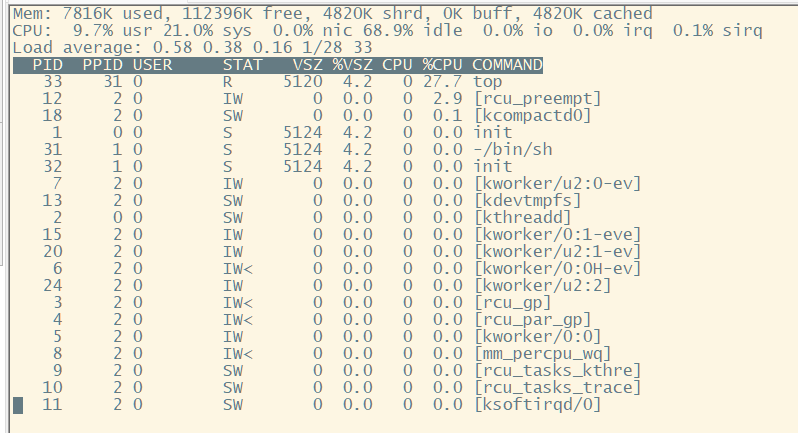
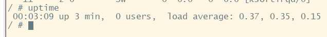
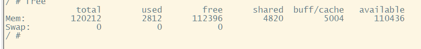

# 上板调试修改

1. 删除csr.v中对csr\_tval的多重驱动、ps\_out/in的位宽
2. 一些信号宽度的修改，inst\_wr、data\_wr、debug\_rf\_we和wen名字的问题
3. inst缓存保存的时机要再严格一点——data\_ok
4. mem data\_ok的阻塞不需要mem\_valid，因为这个mem\_valid实质上是mem\_to\_wb\_valid，和mem\_ready\_go的功能类似，且不只需要比较mem\_regWAddr还需要比较exe级和wb级，不能让它流动
5. id阶段的cancel信号生成也需要结合上面的问题
6. ine、adef等异常时不需要写寄存器、写存储
7. ar\_prot、aw\_prot信号的宽度
8. axi\_bridge内部的ar/w\_prot、cacche、lock赋位信号
9. mycpu\_top中重复定义的vppn\_out和asid\_out等
10. tlb中的多驱动
11. mul用时钟计算乘法

    这样乘法也需要阻塞一拍，然后在MEM级得到最终的运算结果

> 📌长短延时跑不通

时序不满足——超时的主要是exe级操作icacop指令时的重取，造成的延时

top命令

uptime

free

