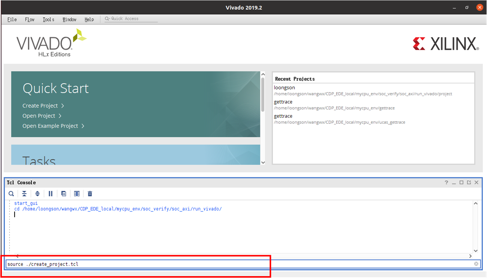
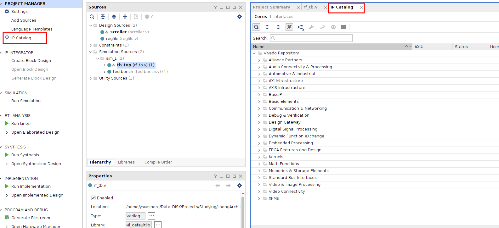
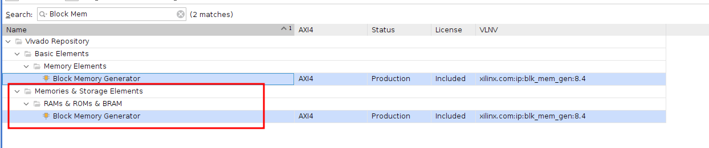
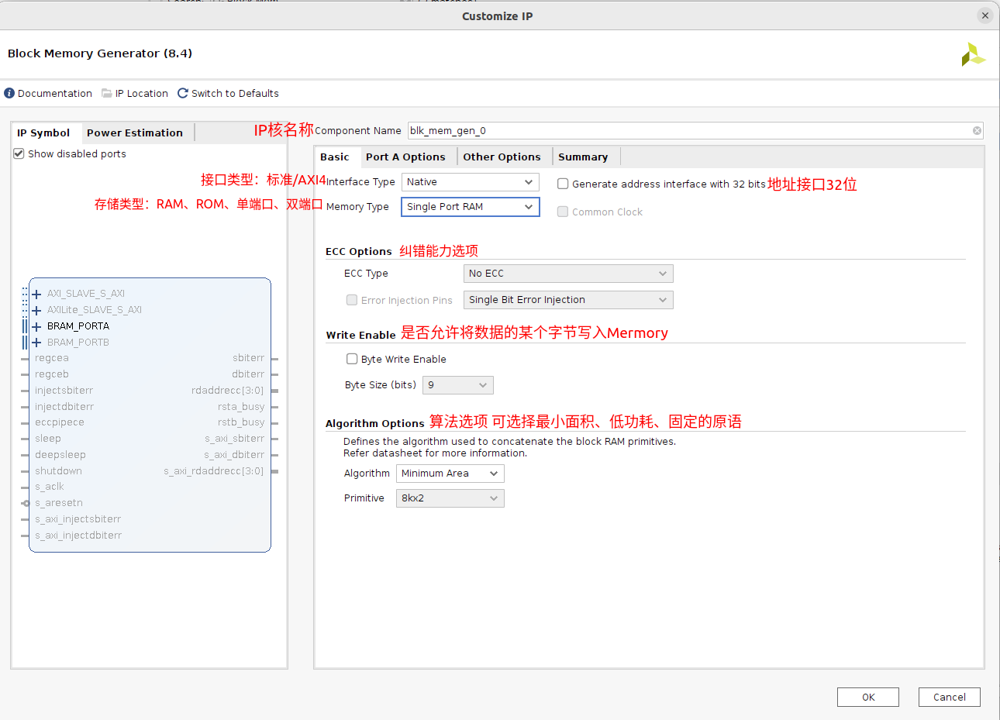
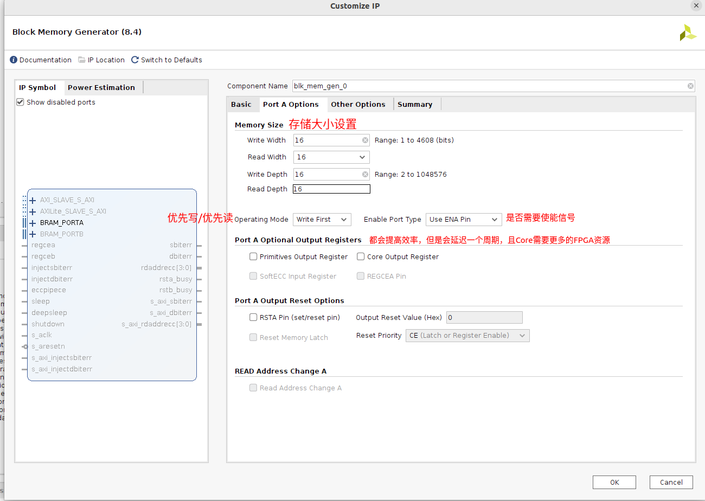
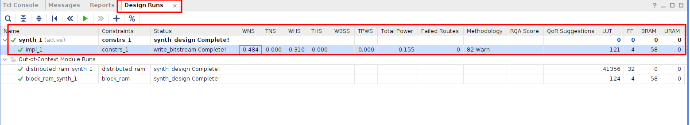
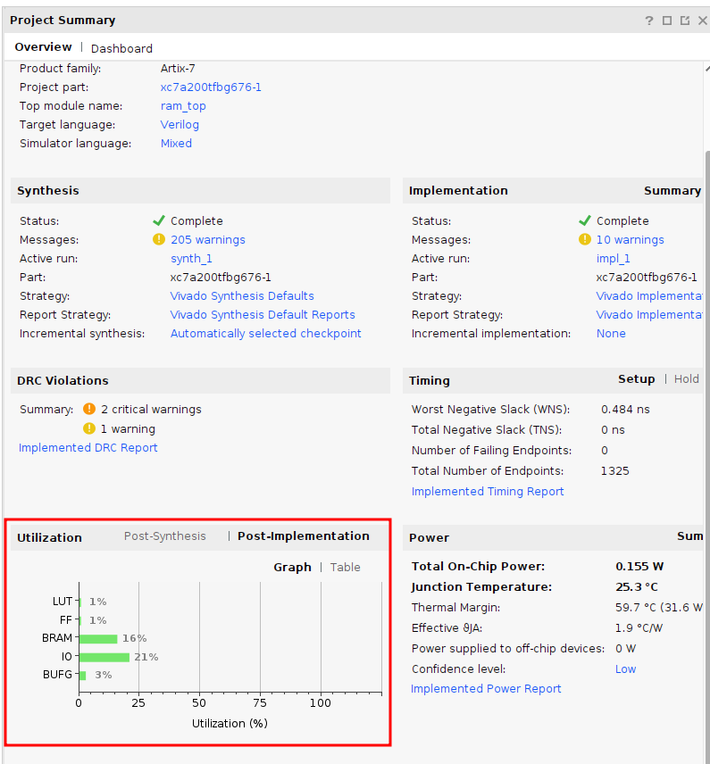

# 附录

## 目录

- [利用tcl创建Vivado工程](#利用tcl创建Vivado工程)
- [定制同步RAM IP核](#定制同步RAM-IP核)
- [定制异步RAM IP核](#定制异步RAM-IP核)
- [查看时序结果和资源利用率](#查看时序结果和资源利用率)
  - [查看时序结果](#查看时序结果)
  - [查看资源利用率](#查看资源利用率)

## 利用tcl创建Vivado工程

1. 启动Vivado后，如下图所示点击最下方的“Tcl Console”标签

   
2. 如下图所示，在打开的Tcl Console中输入命令，cd 到待使用 create\_project.tcl 文件所在目录

   

   
3. 如图D.11所示，继续在Tcl Console中输入命令“`source ./create_project.tcl`”接下来Vivado将根据create\_project.tcl的内容创建工程。

   

## 定制同步RAM IP核

在Vivado左侧的在“`PROJECT MANAGER`”里点击“`IP Catalog`”，然后右侧会出现`IP Catalog`的窗口

在Search栏中搜索“`Block Memory Generator`”并点击`RAMs&……`对应的结果

`Other Options`中是设置是否需要预先加载coe文件，以及是否未填充数据设置0

## 定制异步RAM IP核

同定制同步RAM IP核一样，需要在Search栏中搜索“`Distributed Memory Generator`”

选项设置较为简单，这里不再描述

## 查看时序结果和资源利用率

在对Vivado进行综合和实现后，我们可以查看时序结果和资源利用率（确保已经完成了综合实现）

#### 查看时序结果

点击Vivado左边最上方的`Project Manager`，下方即有`Design Runs`标签

WNS表示最长路径的违约值，TNS表示所有违约路径的总违约值。WNS和TNS为红色负值表示有违约。WNS为非负值表示时序满足极好，WNS违约值不超过300ps表示时序满足较好，WNS违约值超过300ps表示时序很糟糕，设计有可能无法上板运行。WNS违约越多，设计上板失败的可能性越大。

#### 查看资源利用率

点击Vivado左边最上方的`Project Manager`然后下滑Project Summary，Utilization项即为资源利用率

LUT为主要资源，也就是查找表的资源（FPGA的实现原理主要就是查找表）

BRAM为内部集成的同步RAM的资源

IO为FPGA I/O接口的资源

BUFG为FPGA内部集成的BUF的资源。
