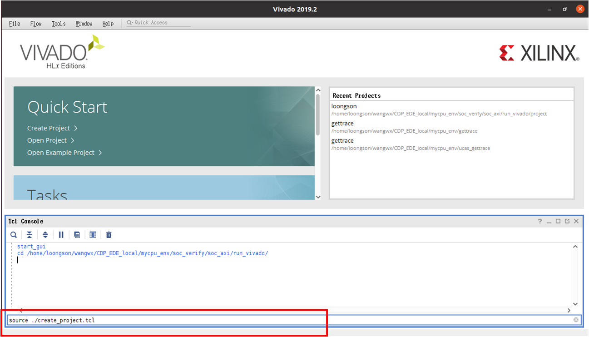

# 附录

## 目录

-   [利用tcl创建Vivado工程](#利用tcl创建Vivado工程)

## 利用tcl创建Vivado工程

1.  启动Vivado后，如下图所示点击最下方的“Tcl Console”标签

    
2.  如下图所示，在打开的Tcl Console中输入命令，cd 到待使用 create\_project.tcl 文件所在目录

    

    
3.  如图D.11所示，继续在Tcl Console中输入命令“`source ./create_project.tcl`”接下来Vivado将根据create\_project.tcl的内容创建工程。

    
