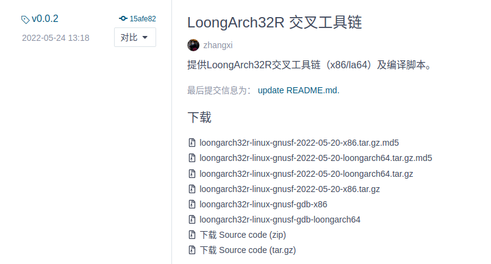
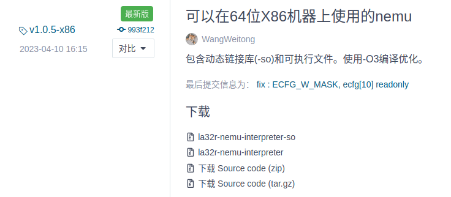

# Chiplab用户手册

## 目录

- [1 目录结构](#1-目录结构)
- [2 使用方法](#2-使用方法)
  - [2.1 toolchains工具下载](#21-toolchains工具下载)
  - [2.2 项目所需第三方工具下载](#22-项目所需第三方工具下载)
  - [2.3 实验步骤](#23-实验步骤)

```bash
git clone https://gitee.com/loongson-edu/chiplab.git
```

## 1 目录结构

```bash
├── chip  SoC顶层
│   └── soc_demo SoC顶层代码实例
│       ├── Baixin 百芯开发板SoC顶层代码
│       ├── loongson 龙芯实验箱SoC顶层代码
│       ├── nexys4ddr Nexys4 DDR开发板SoC顶层代码
│       └── sim 仿真SoC顶层代码
├── docs
│   ├── Debug
│   ├── figures
│   ├── FPGA_run_linux
│   ├── locales
│   │   └── en
│   │       └── LC_MESSAGES
│   └── Simulation
├── fpga FPGA综合工程
│   ├── Baixin 百芯开发板综合工程
│   │   ├── system_run 
│   │   └── testbench
│   ├── loongson 龙芯实验箱综合工程
│   │   ├── system_run 
│   │   └── testbench
│   └── nexys4ddr Nexys4 DRR综合工程
│       ├── system_run
│       └── testbench
├── IP SoC IP
│   ├── AMBA 总线IP
│   ├── APB_DEV APB协议通信设备
│   │   ├── NAND NAND设备控制器
│   │   └── URT UART设备控制器
│   ├── AXI_DELAY_RAND 随机延迟注入
│   ├── AXI_SRAM_BRIDGE AXI协议 -> SRAM接口转换
│   ├── BRIDGE 1x2桥接模块
│   ├── CONFREG 用于访问开发板上数码管、拨码开关等外设以及特殊寄存器
│   ├── DEBUG 
│   ├── DMA DMA逻辑，用于设备作为master访问内存
│   ├── MAC MAC设备控制器
│   ├── myCPU 处理器核逻辑
│   │   └── IP
│   ├── SPI SPI Flash设备控制器
│   └── xilinx_ip Vivado平台所创建的IP
│       ├── axi_2x1_mux
│       ├── axi_clock_converter_0
│       ├── axi_interconnect_0
│       ├── axi_interconnect_0_n4ddr
│       ├── clk_pll_33
│       ├── clk_pll_33_n4ddr
│       ├── clk_wiz_0_Baixin
│       ├── clk_wiz_0_loongson
│       ├── clk_wiz_0_n4ddr
│       ├── dpram_512x32
│       ├── dpram_512x32_n4ddr
│       ├── mig_axi_32_Baixin
│       ├── mig_axi_32_loongson
│       ├── mig_axi_32_n4ddr
│       ├── mii_to_rmii_0_n4ddr
│       ├── mii_to_rmii_v2_0
│       │   ├── bd
│       │   ├── doc
│       │   ├── hdl
│       │   ├── ttcl
│       │   ├── utils
│       │   │   └── board
│       │   └── xgui
│       ├── sram_128x22
│       ├── sram_128x32
│       ├── sram_128x64
│       └── sram_32x52bit
├── sims 运行仿真以及存放testbench源码
│   ├── iverilog 
│   │   ├── run_prog
│   │   └── testbench
│   └── verilator 以verilator仿真工具为基础
│       ├── run_prog 测试程序运行目录，包括func、性能测试程序、内核等
│       │   └── log_script
│       ├── run_random 随机指令序列运行目录
│       │   └── run_random
│       └── testbench testbech源码，提供仿真运行、在线比对、设备模拟等功能
│           └── include
├── software 测试用例
│   ├── coremark coremark性能测试程序
│   │   ├── barebones
│   │   ├── cygwin
│   │   ├── docs
│   │   │   └── html
│   │   │       ├── files
│   │   │       │   ├── docs
│   │   │       │   ├── linux
│   │   │       │   └── PIC32
│   │   │       ├── index
│   │   │       ├── javascript
│   │   │       ├── search
│   │   │       └── styles
│   │   ├── freebsd
│   │   ├── linux
│   │   ├── linux64
│   │   ├── macos
│   │   ├── rtems
│   │   └── simple
│   ├── c_prg
│   │   ├── inner_product
│   │   ├── lookup_table
│   │   ├── loop_induction
│   │   ├── memcmp
│   │   ├── minmax_sequence
│   │   └── product_sequence
│   ├── debug
│   ├── dhrystone dhrystone性能测试程序
│   ├── fireye
│   │   ├── A0
│   │   ├── B2
│   │   ├── C0
│   │   ├── D1
│   │   └── I2
│   ├── func 功能测试点，验证处理器核设计是否与指令手册一致
│   │   ├── func_advance
│   │   │   ├── include
│   │   │   └── inst
│   │   ├── func_lab14
│   │   │   ├── include
│   │   │   └── inst
│   │   ├── func_lab15
│   │   │   ├── include
│   │   │   └── inst
│   │   ├── func_lab19
│   │   │   ├── include
│   │   │   └── inst
│   │   ├── func_lab3
│   │   │   ├── include
│   │   │   └── inst
│   │   ├── func_lab4
│   │   │   ├── include
│   │   │   └── inst
│   │   ├── func_lab6
│   │   │   ├── include
│   │   │   └── inst
│   │   ├── func_lab7
│   │   │   ├── include
│   │   │   └── inst
│   │   ├── func_lab8
│   │   │   ├── include
│   │   │   └── inst
│   │   ├── func_lab9
│   │   │   ├── include
│   │   │   └── inst
│   │   └── func_src
│   │       ├── include
│   │       └── inst
│   ├── linux 提供内核启动的支持
│   ├── memset 
│   ├── my_program
│   ├── random_boot 为随机指令序列的运行提供支持
│   └── rtthread 
└── toolchains chiplab运行所需工具
```

## 2 使用方法

### 2.1 toolchains工具下载

查看`toolchains/README.md`自行下载

````bash
1. [GCC交叉编译器](https://gitee.com/loongson-edu/la32r-toolchains/releases)

根据架构下载相映`loongarch32r-linux-gnusf-${TOOLCHAINS_DATE}.tar.gz`，并解压。解压后将`loongarch32r-linux-gnusf-${TOOLCHAINS_DATE}/bin/`目录添加到path中。
linux下建议打开
```
vim ~/.bashrc
```
在文件末尾添加以下内容，注意保持此处`${TOOLCHAINS_DATE}`和所下载工具链文件夹名称一致。
```
export PATH=${CHIPLAB_HOME}/toolchains/loongarch32r-linux-gnusf-${TOOLCHAINS_DATE}/bin/:$PATH 
```

2. [NEMU](https://gitee.com/wwt_panache/la32r-nemu/releases)

在当前目录`mkdir nemu`，然后下载`la32r-nemu-interpreter-so`到`nemu`目录。

3. [newlib](https://gitee.com/chenzes/la32r-newlib/releases/tag/newlib_0609)

内容包括`libc.a libg.a libm.a libpmon.a pmon.ld start.o`，在当前目录下解压。

````

1. 下载GCC交叉编译器

   在[https://gitee.com/loongson-edu/la32r-toolchains/releases](https://gitee.com/loongson-edu/la32r-toolchains/releases "https://gitee.com/loongson-edu/la32r-toolchains/releases")链接下载x86-64架构的交叉编译器

   

   TOOLCHAINS\_DATE为2022-05-20

   解压到chiplab/toolchains下，不能改名字
   ```bash
   tar -zxvf loongarch32r-linux-gnusf-2022-05-20-x86.tar.gz 
   mv loongarch32r-linux-gnusf-2022-05-20-x86/* chiplab/toolchains/gnusf
   ```
2. 添加环境变量

   将gnusf目录下的bin添加到\~/.bashrc中
   ```bash
   vim ~/.bashrc
   export PATH=/home/aurora/Code/Arch/chiplab/toolchains/gnusf/bin/:$PATH 
   source ~/.bashrc

   ```
3. 在toolchains目录下\`mkdir nemu\`，然后下载\`la32r-nemu-interpreter-so\`到\`nemu\`目录。

   在[https://gitee.com/wwt\_panache/la32r-nemu/releases](https://gitee.com/wwt_panache/la32r-nemu/releases "https://gitee.com/wwt_panache/la32r-nemu/releases")下载la32r-nemu-interpreter-so

   
4. 在toolchains下解压下载的压缩包

   在[https://gitee.com/chenzes/la32r-newlib/releases/tag/newlib\_0609](https://gitee.com/chenzes/la32r-newlib/releases/tag/newlib_0609 "https://gitee.com/chenzes/la32r-newlib/releases/tag/newlib_0609")下下载[system\_newlib.tar](https://gitee.com/chenzes/la32r-newlib/releases/download/newlib_0609/system_newlib.tar "system_newlib.tar")并解压到toolchains目录下
   ```bash
   tar -xvf system_newlib.tar
   rm system_newlib.tar
   ```

至此toolchains目录下载完毕，运行`tree -L 2`目录结构如下

```bash
.
├── gnusf
│   ├── bin
│   ├── include
│   ├── lib
│   ├── lib64
│   ├── libexec
│   ├── loongarch32r-linux-gnusf
│   ├── share
│   └── sysroot
├── nemu
│   └── la32r-nemu-interpreter-so
├── README.md
└── system_newlib
    ├── libc.a
    ├── libg.a
    ├── libm.a
    ├── libpmon.a
    ├── loongarch32-unknown-elf
    ├── pmon.ld
    └── start.o

```

### 2.2 项目所需第三方工具下载

项目需要使用verilator和gtkwave

verilator4.228

```bash
sudo apt install verilator gtkwave
```

### 2.3 实验步骤

1. 设置CHIPLAB\_HOME变量
   ```bash
   #export CHIPLAB_HOME="your own chiplab pwd address"
   export CHIPLAB_HOME="/home/aurora/Code/Arch/chiplab"

   ```
2. 替换myCPU

   `IP/myCPU`中存放的是处理器核代码，对外的接口和核顶层模块名称固定。该环境默认处理器核已实现`AXI`总线
3. 仿真

   使用verilator的工作目录位于`sims/verilator/run_*`，包括`run_prog`和`run_random`
   - `run_prog` : 该工作目录下可运行`func`测试用例、`dhrystone`、`coremark`性能测试程序、`linux`以及自定义C程序。
   - `run_random` : 该工作目录下可进行随机指令序列测试。
     具体仿真使用方法参考[verilator仿真环境说明](../verilator仿真环境说明/verilator仿真环境说明.md "verilator仿真环境说明")
4. 综合
5. 板上启动内核
