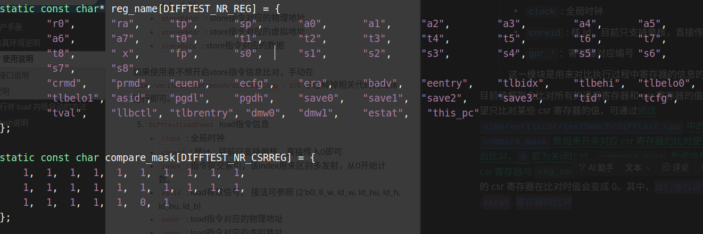

# DIFFTEST使用说明

## 目录

- [3.1 DPIC接口说明](#31-DPIC接口说明)

> 📌仅支持单核，那我毕设还要不要做双核

LA所使用的DIFFTEST框架是基于“一生一芯”提供的oscpu开发框架修改得到的

DIFFTEST的比对对象是两个核，一个是用户设计的核，一个是参考核。 比对原理是设计核在每提交一条指令的同时使参考核执行相同的指令，之后比对所有的通用寄存器和CSR[^注释1]寄存器的值，如果完全相同则认为设计核执行正确。 同时， DIFFTEST比对机制也实现了对于store指令的比对，一旦store指令中的物理地址和存储数据与参考核不同，也会立即暂停仿真，以此来尽早定位错误

本项目DIFFTEST所使用的参考核是经过移植后的`la32r-nemu`[^注释2]，只需要使用动态链接文件(`toolchains/nemu/la32r-nemu-interpreter-so`)即可进行difftest

## 3.1 DPIC接口说明

> DPIC简介
>
> [ SV DPI-C接口学习心得 1、是什么？？ DPI(Direct Programming Interface)，全称直接编程接口，是SV与其它语言(C/C++)交互的接口，基本上是唯一接口了。 2、为什么？？ 说完是什么，那么我们可以考虑一下了，为什么需要这个接口呢？或者… https://zhuanlan.zhihu.com/p/258390406](https://zhuanlan.zhihu.com/p/258390406 " SV DPI-C接口学习心得 1、是什么？？ DPI(Direct Programming Interface)，全称直接编程接口，是SV与其它语言(C/C++)交互的接口，基本上是唯一接口了。 2、为什么？？ 说完是什么，那么我们可以考虑一下了，为什么需要这个接口呢？或者… https://zhuanlan.zhihu.com/p/258390406")
>
> 1. DPI是什么
>
>    DPI全程“Direct Programming Interface”直接编程接口，是`SystemVerilog`和其他语言（C/C++）交互的接口——可以说是唯一接口
> 2. 为什么需要这个接口
>    1. 验证复用的需要。在模块级、子系统级的上面的层级的验证多使用大量的C代码；而模块级、子系统级的验证多使用SV。为了实现测试用例从子系统级到系统级的复用，最好在子系统级开始就有意识地建立支持C测试的环境，并且使用一些基于C的测试用例，这样才能使得整体具有更好的复用性
>    2. 处理器的需要。子系统测试时，不一定本身自带了处理器的硬件实例(Verilog编写的)，因此在构建子系统时还要考虑如何模拟外部处理器对子系统的访问行为
>
>       当然可以再在外部加一个Verilog所实现的处理器实例，验证外以后撤去。但是这个方法会有一些弊端：外部处理器的硬件体积会影响仿真速度；对预留接口需要作的调整需要使用C语言
>       因此转而搭建一个软件环境“DPI”，来既保证复用，也可以模拟常规处理器的行为

本项目的DPIC涉及到的文件及相关内容介绍如下：

- `difftest.v`中定义了所有DPIC相关的 Verilog module 信息，这些 module 中会调用c函数用来传输信号。这些 module 会被设计核实例化用来传输信号
- `mycpu_top.v`中实例化了`difftest.v`中定义的 module
- `interface.h`是c函数的实现，c函数将设计核的信号赋值给difftest中的变量

数据流的方向可以简单认为是`mycpu_top.v→difftest.v→interface.h→difftest.c`

在重新设计mycpu时，需要将原本`mycpu_top.v`中相关 verilog module 例化信号接到自己核中相应的信号上，下面简单地介绍一下各个信号的作用，**为了满足在指令提交的时刻该指令产生的影响恰好生效，部分信号需要 delay 一拍再传递**， 详细使用案例可参考本仓库中`IP/myCPU/mycpu_top.v`

1. DifftestInstrCommit &#x20;
   ```verilog
   DifftestInstrCommit DifftestInstrCommit(
       .clock              (aclk           ),
       .coreid             (0              ),
       .index              (0              ),
       .valid              (cmt_valid      ),
       .pc                 (cmt_pc         ),
       .instr              (cmt_inst       ),
       .skip               (0              ),
       .is_TLBFILL         (cmt_tlbfill_en ),
       .TLBFILL_index      (cmt_rand_index ),
       .is_CNTinst         (cmt_cnt_inst   ),
       .timer_64_value     (cmt_timer_64   ),
       .wen                (cmt_wen        ),
       .wdest              (cmt_wdest      ),
       .wdata              (cmt_wdata      ),
       .csr_rstat          (cmt_csr_rstat_en),
       .csr_data           (cmt_csr_data   )
   );
   ```
   - `clock` : 全局时钟
   - `coreid` : 核id，目前只支持单核，直接传入0即可
   - `index` : 指令提交索引，该index用来区别多指令提交，从0开始计数。difftest支持任意宽度的指令提交，其比对粒度与提交宽度一致。如果设计的提交宽度大于6，那么需要使用者手动修改 `sims/verilator/testbench/include/difftest.h` 中的宏定义 `DIFFTEST_COMMIT_WIDTH`。
   - `valid` : 提交有效信号，该信号拉高时，指令提交
   - `pc` : 当前提交指令的pc
   - `instr` : 当前提交指令的指令码
   - `skip` : 跳过当前指令的比对，目前没有实现，直接传入0即可
   - `is_TLBFILL` : tlbfill指令使能，当前指令为tlbfill指令时，该信号拉高
   - `TLBFILL_index` : tlbfill指令对应的tlb表项索引
   - `is_CNTinst` : 与计时器相关的指令，提交指令为rdcntv{l/h}.w 或 rdcntid 时该位拉高
   - `timer_64_value` : 当前指令读出的64位计数器值(StableCounter)
   - `wen` : 提交指令通用寄存器写使能
   - `wdest` : 提交指令写通用寄存器索引
   - `wdata` : 提交指令写通用寄存器数据
   - `csr_rstat` : 当提交指令为csrrd、csrwr、csrxchg，同时该指令对应的csr寄存器为estat寄存器时该位拉高
   - `csr_data` : 当`csr_rstat == 1`时，当前指令读取到的csr寄存器(estat)的值
2. DifftestExcpEvent
   ```verilog
   DifftestExcpEvent DifftestExcpEvent(
       .clock              (aclk           ),
       .coreid             (0              ),
       .excp_valid         (cmt_excp_flush ),
       .eret               (cmt_ertn       ),
       .intrNo             (csr_estat_diff_0[12:2]),
       .cause              (cmt_csr_ecode  ),
       .exceptionPC        (cmt_pc         ),
       .exceptionInst      (cmt_inst       )
   );
   ```
   - `clock` : 全局时钟
   - `coreid` : 核id，目前只支持单核，直接传入0即可
   - `excp_valid` : 当前指令如果有异常/外部中断要处理，该位为1
   - `eret` : 当前指令为`eret`指令时，该位为1
   - `intrNo` : csr寄存器中csr\_estat\[12:2]
   - `cause` : estat.ecode
   - `exceptionPC` : 出现异常的指令pc
   - `exceptionInst` : 出现异常的指令码
3. DifftestTrapEvent
   ```verilog
   DifftestTrapEvent DifftestTrapEvent(
       .clock              (aclk           ),
       .coreid             (0              ),
       .valid              (trap           ),
       .code               (trap_code      ),
       .pc                 (cmt_pc         ),
       .cycleCnt           (cycleCnt       ),
       .instrCnt           (instrCnt       )
   );
   ```
   - `clock` : 全局时钟
   - `coreid` : 核id，目前只支持单核，直接传入0即可
   - `valid` : 当前指令是否有trap处理，如果有的话设置为1
   - `code` :trap的编码
   - `pc` :出现trap的指令PC
   - `cycleCnt` :
   - `instrCnt` :
4. DifftestStoreEvent
   ```verilog
   DifftestStoreEvent DifftestStoreEvent(
       .clock              (aclk           ),
       .coreid             (0              ),
       .index              (0              ),
       .valid              (cmt_inst_st_en ),
       .storePAddr         (cmt_st_paddr   ),
       .storeVAddr         (cmt_st_vaddr   ),
       .storeData          (cmt_st_data    )
   );
   ```
   - `clock` : 全局时钟
   - `coreid` : 核id，目前只支持单核，直接传入0即可
   - `index` : 指令提交索引，该index用来区别多发射，从0开始计数。
   - `valid` : store有效信号， 接法可参照 {4'b0, llbit && sc\_w, st\_w, st\_h, st\_b}
   - `storePAddr` : store指令对应的物理地址
   - `storeVAddr` : store指令对应的虚拟地址
   - `storeData` : store指令对应的数据
   > 可以在`sims/verilator/testbench/difftest.cpp : 175`中注释掉相关代码关闭store指令信息比对
5. DifftestLoadEvent
   ```verilog
   DifftestLoadEvent DifftestLoadEvent(
       .clock              (aclk           ),
       .coreid             (0              ),
       .index              (0              ),
       .valid              (cmt_inst_ld_en ),
       .paddr              (cmt_ld_paddr   ),
       .vaddr              (cmt_ld_vaddr   )
   );
   ```
   - `clock` : 全局时钟
   - `coreid` : 核id，目前只支持单核，直接传入0即可
   - `index` : 指令提交索引，该index用来区别多发射，从0开始计数。
   - `valid` : load有效信号， 接法可参照 {2'b0, ll\_w, ld\_w, ld\_hu, ld\_h, ld\_bu, ld\_b}
   - `paddr` : load指令对应的物理地址
   - `vaddr` : load指令对应的虚拟地址
6. DifftestCSRRegState
   ```verilog
   DifftestCSRRegState DifftestCSRRegState(
       .clock              (aclk               ),
       .coreid             (0                  ),
       .crmd               (csr_crmd_diff_0    ),
       .prmd               (csr_prmd_diff_0    ),
       .euen               (0                  ),
       .ecfg               (csr_ectl_diff_0    ),
       .estat              (csr_estat_diff_0   ),
       .era                (csr_era_diff_0     ),
       .badv               (csr_badv_diff_0    ),
       .eentry             (csr_eentry_diff_0  ),
       .tlbidx             (csr_tlbidx_diff_0  ),
       .tlbehi             (csr_tlbehi_diff_0  ),
       .tlbelo0            (csr_tlbelo0_diff_0 ),
       .tlbelo1            (csr_tlbelo1_diff_0 ),
       .asid               (csr_asid_diff_0    ),
       .pgdl               (csr_pgdl_diff_0    ),
       .pgdh               (csr_pgdh_diff_0    ),
       .save0              (csr_save0_diff_0   ),
       .save1              (csr_save1_diff_0   ),
       .save2              (csr_save2_diff_0   ),
       .save3              (csr_save3_diff_0   ),
       .tid                (csr_tid_diff_0     ),
       .tcfg               (csr_tcfg_diff_0    ),
       .tval               (csr_tval_diff_0    ),
       .ticlr              (csr_ticlr_diff_0   ),
       .llbctl             (csr_llbctl_diff_0  ),
       .tlbrentry          (csr_tlbrentry_diff_0),
       .dmw0               (csr_dmw0_diff_0    ),
       .dmw1               (csr_dmw1_diff_0    )
   );
   ```
   `clock `: 全局时钟

   `coreid` : 核id，目前只支持单核，直接传入0即可

   之后的字段是csr寄存器堆中的各个域

   这一模块是为了对比执行过程中CSR寄存器堆的值
7. DifftestGRegState
   ```verilog
   DifftestGRegState DifftestGRegState(
       .clock              (aclk       ),
       .coreid             (0          ),
       .gpr_0              (0          ),
       .gpr_1              (regs[1]    ),
       .gpr_2              (regs[2]    ),
       .gpr_3              (regs[3]    ),
       .gpr_4              (regs[4]    ),
       .gpr_5              (regs[5]    ),
       .gpr_6              (regs[6]    ),
       .gpr_7              (regs[7]    ),
       .gpr_8              (regs[8]    ),
       .gpr_9              (regs[9]    ),
       .gpr_10             (regs[10]   ),
       .gpr_11             (regs[11]   ),
       .gpr_12             (regs[12]   ),
       .gpr_13             (regs[13]   ),
       .gpr_14             (regs[14]   ),
       .gpr_15             (regs[15]   ),
       .gpr_16             (regs[16]   ),
       .gpr_17             (regs[17]   ),
       .gpr_18             (regs[18]   ),
       .gpr_19             (regs[19]   ),
       .gpr_20             (regs[20]   ),
       .gpr_21             (regs[21]   ),
       .gpr_22             (regs[22]   ),
       .gpr_23             (regs[23]   ),
       .gpr_24             (regs[24]   ),
       .gpr_25             (regs[25]   ),
       .gpr_26             (regs[26]   ),
       .gpr_27             (regs[27]   ),
       .gpr_28             (regs[28]   ),
       .gpr_29             (regs[29]   ),
       .gpr_30             (regs[30]   ),
       .gpr_31             (regs[31]   )
   );
   ```
   - `clock` : 全局时钟
   - `coreid` : 核id，目前只支持单核，直接传入0即可
   - `gpr_*`：寄存器对应编号
     这一模块是用来对比执行过程中寄存器的信息的

目前该框架会比对所有的通用寄存器和csr寄存器的值，如果用户希望只比对某些csr寄存器的值，可通过修改`sims/verilator/testbench/difftest.cpp`中的`compare_mask`数组来开关对应csr寄存器的比对使能，`1`即为开启比对，`0`即为关闭比对。`compare_mask`数组中每一项对应的csr寄存器与`reg_name`数组中的csr寄存器一一对应。被关闭比对的csr寄存器在比对时值会变成0。其中，我们强烈建议关闭`estat`寄存器的比对——默认是关闭的



[^注释1]: Control and Status Register

[^注释2]: [https://gitee.com/wwt\_panache/la32r-nemu](https://gitee.com/wwt_panache/la32r-nemu "https://gitee.com/wwt_panache/la32r-nemu")
