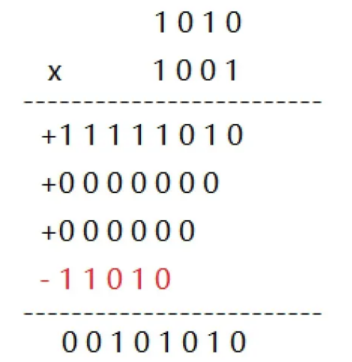
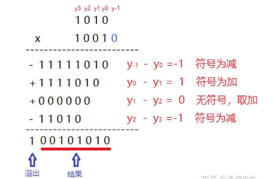
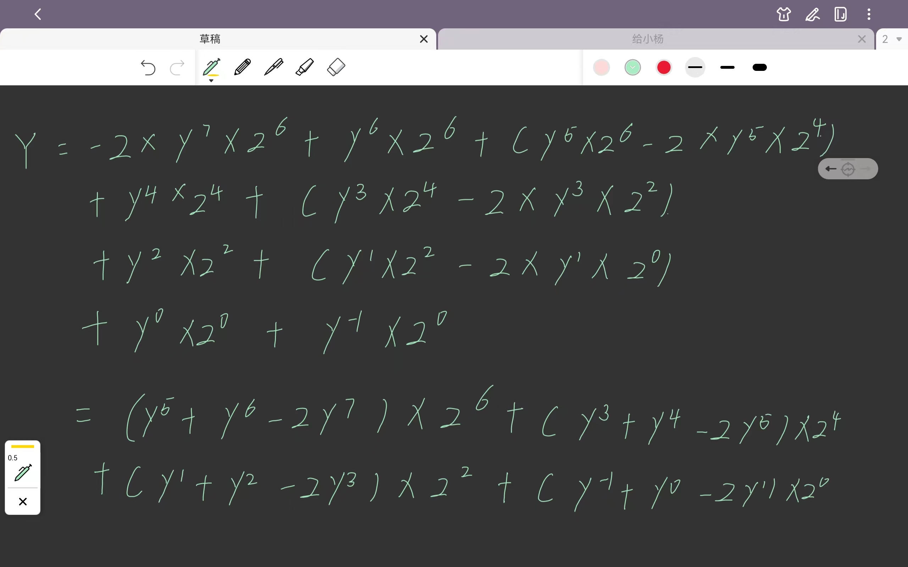
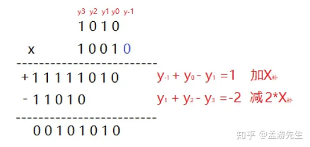

# MyCPU

## 目录

- [功能部件的实现](#功能部件的实现)
  - [ALU](#ALU)
  - [RegFile](#RegFile)
  - [Mul](#Mul)
  - [DIV](#DIV)
  - [Tools](#Tools)
- [流水阶段实现](#流水阶段实现)

## 功能部件的实现

#### ALU

```verilog
module alu(
  input  [13:0] alu_op,//alu_op是进行14种运算，然后每一位表示一个运算指令表示的运算
  input  [31:0] alu_src1,//alu端口操作数A
  input  [31:0] alu_src2,//alu端口操作数B
  output [31:0] alu_result//alu运行结果
);

//14位alu_op对应每位所执行的操作，是将所有实现的指令进行的操作分为14种，在id_stage文件中有声明
wire op_add;//作加法
wire op_sub;//作减法
wire op_slt;//作slt相关的运算 slt/slti
wire op_sltu;//作sltu相关的运算 slt/sltu
wire op_and;//作与运算
wire op_nor;//作或非运算~(|)
wire op_or;//作或运算
wire op_xor;//作异或运算
wire op_sll;//作逻辑左移
wire op_srl;//作逻辑右移
wire op_sra;//作算术右移
wire op_lui;//lui相关的运算
wire op_andn;//作&~运算
wire op_orn;//作|~运算 

// control code decomposition 对alu_op解码
assign op_add  = alu_op[ 0];
assign op_sub  = alu_op[ 1];
assign op_slt  = alu_op[ 2];
assign op_sltu = alu_op[ 3];
assign op_and  = alu_op[ 4];
assign op_nor  = alu_op[ 5];
assign op_or   = alu_op[ 6];
assign op_xor  = alu_op[ 7];
assign op_sll  = alu_op[ 8];
assign op_srl  = alu_op[ 9];
assign op_sra  = alu_op[10];
assign op_lui  = alu_op[11];
assign op_andn = alu_op[12];
assign op_orn  = alu_op[13];

//定义各种操作对应的结果，其中二进制sub也是按加法实现的，因此加减结果存放在一起
wire [31:0] add_sub_result; 
wire [31:0] slt_result; 
wire [31:0] sltu_result;
wire [31:0] and_result;
wire [31:0] nor_result;
wire [31:0] or_result;
wire [31:0] xor_result;
wire [31:0] lui_result;
wire [31:0] sll_result; 
wire [63:0] sr64_result; 
wire [31:0] sr_result; 
wire [31:0] andn_result;
wire [31:0] orn_result;


// 32-bit adder 作加减法操作
wire [31:0] adder_a;//加法器的加数a
wire [31:0] adder_b;//加法器的加数b
wire        adder_cin;//加法器的低位进位
wire [31:0] adder_result;//加法结果
wire        adder_cout;//加法器的进位输出

assign adder_a   = alu_src1; //加数a不用变化
assign adder_b   = (op_sub | op_slt | op_sltu) ? ~alu_src2 : alu_src2;  //src1 - src2 rj-rk 加数b需要根据执行减法取反
assign adder_cin = (op_sub | op_slt | op_sltu) ? 1'b1      : 1'b0;//因为b只是取反了，减法的话需要加1
assign {adder_cout, adder_result} = adder_a + adder_b + adder_cin;//赋值计算

// ADD, SUB result
assign add_sub_result = adder_result;//赋值最终的结果

// SLT result SLT结果如果src1小于src2那么置1,否则置0
assign slt_result[31:1] = 31'b0;   //rj < rk 1
assign slt_result[0]    = (alu_src1[31] & ~alu_src2[31])//src1是负数，src2是正数
                        | ((alu_src1[31] ~^ alu_src2[31]) & adder_result[31]);//~^表示同或，src1和src2符号相同，src1<src2时，正数作差三负数，负数作差还是负数

// SLTU result
assign sltu_result[31:1] = 31'b0;
assign sltu_result[0]    = ~adder_cout;//无符号数比较，如果src1>src2时，高位进位输出1

// bitwise operation
assign and_result = alu_src1 & alu_src2;//与结果
assign andn_result= alu_src1 & ~alu_src2;//&~结果
assign or_result  = alu_src1 | alu_src2;//或结果      
assign orn_result = alu_src1 | ~alu_src2;//|~结果
assign nor_result = ~or_result;//~(|)
assign xor_result = alu_src1 ^ alu_src2;//异或
assign lui_result = alu_src2;//12位立即数的符号扩展

// SLL result 
assign sll_result = alu_src1 << alu_src2[4:0];   //rj << i5

// SRL, SRA result
// {op_sra&alu_src1[31]}如果是算术右移，那么补全32个符号位；如果不是算术右移，那么补全32个0
assign sr64_result = {{32{op_sra & alu_src1[31]}}, alu_src1[31:0]} >> alu_src2[4:0]; //rj >> i5 

assign sr_result   = sr64_result[31:0];//再取低位

// final result mux
assign alu_result = ({32{op_add|op_sub}} & add_sub_result)//多路选择，这里直接是根据op进行32位1扩展，全f与结果
                  | ({32{op_slt       }} & slt_result)
                  | ({32{op_sltu      }} & sltu_result)
                  | ({32{op_and       }} & and_result)
                  | ({32{op_andn      }} & andn_result)
                  | ({32{op_nor       }} & nor_result)
                  | ({32{op_or        }} & or_result)
                  | ({32{op_orn       }} & orn_result)
                  | ({32{op_xor       }} & xor_result)
                  | ({32{op_lui       }} & lui_result)
                  | ({32{op_sll       }} & sll_result)
                  | ({32{op_srl|op_sra}} & sr_result);   

endmodule


```

ALU模块的输入是`操作码alu_op`，`操作数alu_src1、alu_src2`，`运算结果alu_result`

alu\_op信号位宽是14位，每位代表一种对应的指令运算

具体包括`加法op_add、减法op_sub、有符号比较置位op_slt、无符号比较置位op_sltu、与运算op_and、非或运算op_nor、或运算op_or、异或运算op_xor、逻辑左移op_sll、逻辑右移op_srl、取高位立即数op_lui、与非op_andn、或非op_orn`14种操作

mycpu中的alu所采用的逻辑是计算出每一种操作对应的结果，然后再使用位操作码符号扩展为位全1的值`{32{op_操作}}`与各种操作对应的结果得到最终的结果

1. 加法和减法共用一种结果表示

   因为采用二进制补码表示有符号数的原因$-b=\bar b+1$，所以减法也可以表示成加法的形式：
   $$
   a-b=a+(-b)=a+\bar b+1，1可以作为低位进位输入
   $$
   因此加法和减法共同时用加法器adder来计算结果

   操作数a不用改变

   操作数b需要根据是否作减法来决定是否取反——op\_sub,op\_slt,op\_sltu执行减法

   进位输入也要根据是否作减法来决定是否为1——op\_sub,op\_slt,op\_sltu执行减法
   ```verilog
   assign adder_a   = alu_src1; //加数a不用变化
   assign adder_b   = (op_sub | op_slt | op_sltu) ? ~alu_src2 : alu_src2;  //src1 - src2 rj-rk 加数b需要根据执行减法取反
   assign adder_cin = (op_sub | op_slt | op_sltu) ? 1'b1      : 1'b0;//因为b只是取反了，减法的话需要加1
   assign {adder_cout, adder_result} = adder_a + adder_b + adder_cin;//赋值计算
   ```
2. 有符号数比较置位结果

   有符号操作数A小于有符号操作数B的情况是：
   1. A是负数，B是正数
   2. A、B同号且A-B的结果是负数

      若A和B都是正数，那么若A\<B时，A-B是负数

      若A和B都是负数，那么若A\<B时，A-B亦是负数
   ```verilog
   // SLT result SLT结果如果src1小于src2那么置1,否则置0
   assign slt_result[31:1] = 31'b0;   //rj < rk 1
   assign slt_result[0]    = (alu_src1[31] & ~alu_src2[31])//src1是负数，src2是正数
                           | ((alu_src1[31] ~^ alu_src2[31]) & adder_result[31]);//~^表示同或，src1和src2符号相同，src1<src2时，正数作差三负数，负数作差还是负数
   ```
3. 无符号数比较置位结果
   $$
   A-B=A+\bar B+1=A+2^n-1-B+1=A-B+2^n
   $$
   若A>B那么A-B不会产生进借位，而$+2^n$使得整个最终的式子会有一个进位

   因此若进位为1表示A>B，若进位为0表示A\<B
   ```verilog
   // SLTU result
   assign sltu_result[31:1] = 31'b0;
   assign sltu_result[0]    = ~adder_cout;//无符号数比较，如果src1>src2时，高位进位输出1

   ```
4. 位逻辑运算
   ```verilog
   // bitwise operation
   assign and_result = alu_src1 & alu_src2;//与结果
   assign andn_result= alu_src1 &~ alu_src2;//&~结果
   assign or_result  = alu_src1 | alu_src2;//或结果       
   assign orn_result = alu_src1 |~ alu_src2;//|~结果
   assign nor_result = ~or_result;//~(|)
   assign xor_result = alu_src1 ^ alu_src2;//异或
   assign lui_result = alu_src2;//高位20位立即数+12位低位0
   ```
5. 逻辑左移

   sll逻辑左移是根据操作数B的低五位对操作数A进行左移，低位补0
   ```verilog
   // SLL result 
   assign sll_result = alu_src1 << alu_src2[4:0];   //rj << i5
   ```
6. 逻辑右移+算术右移

   逻辑右移的高位补0，算术右移的高位补符号位

   那么补充的高位可以综合为`{是否是算术右移&操作数A的符号位}`，且因为最多移32位，所以补全64位数再右移，低32位结果即为最终结果
   ```verilog
   // SRL, SRA result
   // {op_sra&alu_src1[31]}如果是算术右移，那么补全32个符号位；如果不是算术右移，那么补全32个0
   assign sr64_result = {{32{op_sra & alu_src1[31]}}, alu_src1[31:0]} >> alu_src2[4:0]; //rj >> i5 

   assign sr_result   = sr64_result[31:0];//再取低位
   ```

最后再根据各个操作的32位扩展与对应的操作结果相与得到最终的alu运算结果

```verilog
// final result mux
assign alu_result = ({32{op_add|op_sub}} & add_sub_result)//多路选择，这里直接是根据op进行32位1扩展，全f与结果
                  | ({32{op_slt       }} & slt_result)
                  | ({32{op_sltu      }} & sltu_result)
                  | ({32{op_and       }} & and_result)
                  | ({32{op_andn      }} & andn_result)
                  | ({32{op_nor       }} & nor_result)
                  | ({32{op_or        }} & or_result)
                  | ({32{op_orn       }} & orn_result)
                  | ({32{op_xor       }} & xor_result)
                  | ({32{op_lui       }} & lui_result)
                  | ({32{op_sll       }} & sll_result)
                  | ({32{op_srl|op_sra}} & sr_result); 
```

#### RegFile

```verilog
module regfile(
    input         clk,//寄存器文件的写时钟
    // READ PORT 1
    input  [ 4:0] raddr1,//端口A地址
    output [31:0] rdata1,//寄存器端口A读出的数据
    // READ PORT 2
    input  [ 4:0] raddr2,//端口B地址
    output [31:0] rdata2,//寄存器端口B读出的数据
    // WRITE PORT
    input         we,    //寄存器文件的写使能端，高有效
    input  [ 4:0] waddr, //写地址端口
    input  [31:0] wdata  //写数据
    
    //如果有定义DIFFTEST对比，那么就需要输出寄存器文件的32个寄存器
    `ifdef DIFFTEST_EN
    ,
    output [31:0] rf_o [31:0]   
    `endif 
);
reg [31:0] rf[31:0]; //定义寄存器文件

//写数据
always @(posedge clk) begin //clk上升沿写
    if (we) rf[waddr]<= wdata; //同步写
end

//读A端口数据
assign rdata1 = (raddr1==5'b0) ? 32'b0  ://读0号寄存器输出始终为0
                ((raddr1==waddr) && we) ? wdata : //这样设置是为了不需要等上升沿时钟就可以把要写入的数据直接读出
                                          rf[raddr1];//

//读B端口数据
assign rdata2 = (raddr2==5'b0) ? 32'b0 : //读0号寄存器输出始终为0
                ((raddr2==waddr) && we) ? wdata :
                                          rf[raddr2];
//DIFFTEST
`ifdef DIFFTEST_EN
assign rf_o = rf;
`endif

endmodule

```

寄存器文件整理的实现逻辑和MIPS的寄存器文件实现逻辑基本一致

存在两处不同：

1. 如果定义了DIFFTEST对比，那么寄存器文件还需要输出32个寄存器的值方便对比
   ```verilog
   //模块定义
   `ifdef DIFFTEST_EN,
     output [31:0] rf_o [31:0]   
   `endif 

   //赋值输出
   `ifdef DIFFTEST_EN
     assign rf_o = rf;
   `endif

   ```
2. 在读端口数据时设置了两层的条件表达式：如果读端口地址是0，那么直接输出0；如果读端口地址和写端口地址相同且写使能有效，那么直接输出写数据[^注释1]；都不符合则输出对应读端口的寄存器数组数据
   ```verilog
   //读A端口数据
   assign rdata1 = (raddr1==5'b0) ? 32'b0  ://读0号寄存器输出始终为0
                   ((raddr1==waddr) && we) ? wdata : //这样设置是为了不需要等上升沿时钟就可以把要写入的数据直接读出
                                             rf[raddr1];//

   //读B端口数据
   assign rdata2 = (raddr2==5'b0) ? 32'b0 : //读0号寄存器输出始终为0
                   ((raddr2==waddr) && we) ? wdata :
                                             rf[raddr2];
   ```

#### Mul

Mul部件的实现采用Booth两位乘算法

1. Booth算法简介

   [ 八位“Booth二位乘算法”乘法器 八位“Booth二位乘算法”乘法器原理补码乘法器Booth一位乘Booth二位乘设计思路减法变加法vivado特性设计文件综合电路测试文件仿真波形原理补码乘法器之前介绍了几篇无符号乘法器或加法器的写法，当然，稍作修改也… https://zhuanlan.zhihu.com/p/291239777](https://zhuanlan.zhihu.com/p/291239777 " 八位“Booth二位乘算法”乘法器 八位“Booth二位乘算法”乘法器原理补码乘法器Booth一位乘Booth二位乘设计思路减法变加法vivado特性设计文件综合电路测试文件仿真波形原理补码乘法器之前介绍了几篇无符号乘法器或加法器的写法，当然，稍作修改也… https://zhuanlan.zhihu.com/p/291239777")

   了解Booth算法的原理首先需要了解补码乘法
   - 补码乘法器

     通过原码计算补码的计算方法有两种：
     1. 如果是正数，那么不变；如果是负数，符号位不变，其余位取反加1
     2. 如果是正整数，那么不变。如果是负数，按无符号数解释当前数-溢出条件
        因此若采用第二种方法，一个二进制数$Y_补$形如$у_7у_6у_5у_4у_3у_2 y_1 y_0
         $，那么根据$[Y_补]_补=Y$
     如果$Y_补$为正整数，那么$y_7=0$，其原码就是$0у_6у_5у_4у_3у_2 y_1 y_0
      $

     如果$Y_补$为负数，那么$y_7=1$，其原码就是$Y=[Y_补]_{无符号}-2^8=\left(1* 2^{7}+y_{6} * 2^{6}+y_{5} * 2^{5}+\ldots+y_{0} * 2^{0}\right)-2^{8}=-2^7+(y_{6} * 2^{6}+y_{5} * 2^{5}+\ldots+y_{0} * 2^{0})$

     因此综合来说$Y=-y_7*2^7+(y_{6} * 2^{6}+y_{5} * 2^{5}+\ldots+y_{0} * 2^{0})$

     所以$\begin{array}{l}{[X * Y]_{\text {补 }}=\left[X *\left(-y_{7} * 2^{7}\right)+X *\left(y_{6} * 2^{6}+y_{5} * 2^{5}+\ldots \right.\right.}  \left.\left.+y_{0} * 2^{0}\right)\right]_{\text {补 }} \\\end{array}$

     而$[X+Y]_补=X_补+Y_补$所以
     $[X * Y]_补=-y_{7} *[X * 2^{7}]_补+y_{6} *[X * 2^{6}]_补+y_{5} *[X * 2^{5}]_补+ \ldots+y_{0} *[X * 2^{0}]_补 $

     而$[X*2^n]_补=X_补*2^n$

     所以$\begin{array}{c}{[X * Y]_{\text {补 }}=X_{\text {补 }}}  *\left(-y_{7} * 2^{7}+\left(y_{6} * 2^{6}+y_{5} * 2^{5}+\ldots+y_{0} * 2^{0}\right)\right)=Y * X_{\text {补 }}\end{array}$

     因此可以得到$[X*Y]_补=X*Y_补=Y*X_补$

     也可以设置$Y_{1补}=y_6y_5y_4y_3y_2y_1y_0$，那么$[X*Y]_补=-y_7*X_补*2^7+X_补*Y_{1补}$
     > 📌可以得到一个补码的乘法可以分成两部分：**第二个乘数补码的首位的乘法和其他位的乘法，首位乘法产生的部分积符号是负，其他位部分积符号是正**例如-6 \*-7可以得到
     
   - Booth一位乘

     补码乘法器已经可以推导得到：
     $$
     {[X * Y]_{\text {补 }}=X_{\text {补 }}}  *\left(-y_{7} * 2^{7}+\left(y_{6} * 2^{6}+y_{5} * 2^{5}+\ldots \ldots+y_{0} * 2^{0}\right)\right)=Y * X_{\text {补 }}
     $$
     而因为$2^n=2^{n-1}*2$，因此上式可以化简为：
     $$
     {[X * Y]_{\text {补 }}=X_{\text {补 }}}  *\left(-y_{7} * 2^{7}+\left((2-1)*y_{6} * 2^{6}+(2-1)*y_{5} * 2^{5}+\ldots+(2-1)*y_{0} * 2^{0}\right)\right)\\
     =X_补*((y_6-y_7)*2^7+(y_5-y_6)*2^6+(y_4-y_5)*2^5+\dots+(0-y_0)*2^0) 
     $$
     设$y_{-1}=0$则
     $$
     [X * Y]_{\text {补 }}
     =X_补*((y_6-y_7)*2^7+(y_5-y_6)*2^6+(y_4-y_5)*2^5+\dots+(y_{-1}-y_0)*2^0) 
     $$
     这就是Booth一位乘的原理，其优点在于不用像补码乘法器那样专门对最后首位的部分积采用补码加法

     仍以$-6*(-7)$为例

     

     还存在减法，因此Booth一位乘并不常用，不仅没减去减法还增大了电路复杂度

     但若采用Booth二位乘牺牲一定的空间复杂度，就会得到较快的运算速度
   - Booth两位乘

     同样先对Y进行化简
     $$
     \begin{array}{c}Y=-2 * y_{7} * 2^{6}+ y_{6} * 2^{6}+\left(y_{5} * 2^{6}-2 * y_{5} * 2^{4}\right)+\ldots   +y_{0} * 2^{0}+y_{-1} * 2^{0}\end{array}
     $$
     可以得到：
     $$
     \begin{array}{c}\left.Y=\left(y_{5}+y_{6}-2 * y_{7}\right) * 2^{6}+\left(y_{3}+y_{4}-2 * y_{5}\right) * 2^{4}\right)+  \ldots+\left(y_{-1}+y_{0}-2 * y_{1}\right) * 2^{0}\end{array}
     $$
     具体过程如下：

     

     这就是Booth二位乘的原理，仍以$-6*(-7)
      $为例

     
2. 代码设计
   - 比较$y_{i+1},y_i,y_{i-1}$得到当前是应该+0、+x、-x、+2x、-2x

     因为$y_{i+1},y_i,y_{i-1}$都是一位数据，所以可以使用简单的位运算得到结果

     当计算结果为1时，$y_{i+1}$一定为0，$y_i,y_{i-1}$中有一个为1&#x20;
     当计算结果为2时，$y_{i+1}$一定为0，$y_i,y_{i-1}$中均为1
     当计算结果为-1时，$y_{i+1}$一定为1，$y_i,y_{i-1}$中有一个为1
     当计算结果为-2时，$y_{i+1}$一定为1，$y_i,y_{i-1}$中均为0

     不计算0的原因是，上述各种结果不满足的或就是0
     ```verilog
     //YDecoder是进行i-1,i,i+1的比较 (i-1)+(i)-2(i+1)
     module YDecoder(
         input yc, yb, ya, //yc为i+1,yb为i,yc为i-1
         output negx, x, neg2x, _2x//输出-1,1,-2,2
     );
       //这里为什么不输出0是因为这几个情况均不符合的或就是0
       assign negx = (yc & yb & ~ya) | (yc & ~yb & ya);//-1 yc是1 yb和ya中有一个1
       assign x = (~yc & ~yb & ya) | (~yc & yb & ~ya);//1 yc是0,yb和ya中有一个1
       assign neg2x = (yc & ~yb & ~ya);//-2 yc是1 yb和ya都是0
       assign _2x = (~yc & yb & ya);//2 yc是0 yb和ya都是1
     endmodule
     ```
   - 每一位的Booth结果——变减法为加法

     当$y_{i+1},y_i,y_{i-1}$计算出负数时，需要作减法，按照ALU中加法和减法共用一种表示加法和减法共用一种结果表示**对x取反，然后进位设置为1**使得结果均为相加

     因为会计算出**2倍项，所以当前位的结果是处理之前一位的位值**——因为刚开始初始时$y_a=0$所以计算结果的取值是-2，-1，1，不会出现2且结果用补码表示，所以**默认设置刚开始的前一位正结果为0，负结果为1**
     ```verilog
     module BoothBase(
         input negx, x, neg2x, _2x,//得到的y三项的计算项
         input InX,//x本位值
         input PosLastX, NegLastX,//正上一位的位值，负上一位的位值
         output PosNextX, NegNextX,//正下一位的位值，负下一位的位值
         output OutX//当前位的计算结果
         );

     //negx,neg2x需要和当前位或者上一位的位值取反相与
     //x,_2x需要和当前位或者上一位的位值相与
     assign OutX = (negx & ~InX) | (x & InX) | (neg2x & NegLastX) | (_2x & PosLastX);
     assign PosNextX = InX;//计算2倍项所需要的正位值
     assign NegNextX = ~InX;//计算2倍项所需要的位值取反

     endmodule
     ```
   - 整合一次Booth比较的乘法结果

     对当前被乘数的每一位都采用b中所提到的模块作处理

     **因为要变减法为加法，所以当**$y_{i+1},y_i,y_{i-1}$**计算结果是-1/-2时，b模块取反计算，c中的模块需要输出进位为1**
     ```verilog
     module BoothInterBase(
         input [2:0] y,
         input [63:0] InX,
         output [63:0] OutX,
         output Carry
     );

     wire negx, x, neg2x, _2x;//当前三位y所计算出的结果 y[0]+y[1]-2y[2]
     wire [1:0] CarrySig [64:0];//用来存储每次的NextX的正结果和取反结果

     YDecoder uu(.yc(y[2]), .yb(y[1]), .ya(y[0]), .negx(negx), .x(x), .neg2x(neg2x), ._2x(_2x));//计算negx, x, neg2x, _2x

     BoothBase fir(.negx(negx), .x(x), .neg2x(neg2x), ._2x(_2x), .InX(InX[0]), .PosLastX(1'b0), .NegLastX(1'b1), .PosNextX(CarrySig[1][0]), .NegNextX(CarrySig[1][1]), .OutX(OutX[0]));//进行部分积最低位值的计算

     //循环计算部分积的1-63位
     generate
         genvar i;
         for (i=1; i<64; i=i+1) begin: gfor
             BoothBase ui(
                 .negx(negx),
                 .x(x),
                 .neg2x(neg2x),
                 ._2x(_2x),
                 .InX(InX[i]),
                 .PosLastX(CarrySig[i][0]),
                 .NegLastX(CarrySig[i][1]),
                 .PosNextX(CarrySig[i+1][0]),
                 .NegNextX(CarrySig[i+1][1]),
                 .OutX(OutX[i])
             );
         end
     endgenerate

     //赋进位值，当-1/-2时需要作减法，进位值为1
     assign Carry = negx || neg2x;

     endmodule

     ```
   - 使用Wallace Tree对部分积以及进位相加

     Wallace Tree所使用的是进位保存加法器CSR进位保存加法器CSA
     1. 构造64位的CSR加法器
        ```verilog
        module add64(
            input [63:0]A, B, C,
            output [63:0]Carry, S
        );
            genvar i;
            generate
                for (i = 0; i<64; i=i+1) begin //循环64位赋值
                    assign {Carry[i],S[i]}=A[i]+B[i]+C[i];
                end
            endgenerate
            //产生的进位应该是加到下一位的，所以使用Carry时，整体左移一位
        endmodule
        ```
     2. 构造Tree得到最终的结果

        这里是已经得到了部分积的结果`BoothRes`，以及对应每个结果如果执行减法的话变加法的进位`Carry`，二者对应项相加即得到最终所要相加的部分积结果`SecStageBoothRes`
        ```verilog
        reg [63:0] SecStageBoothRes [16:0];//存储最终相加的部分积
        integer p;
         
        always @(posedge mul_clk) begin
            if (~reset) begin
                for(p=0; p<17; p=p+1) begin
                    SecStageBoothRes[p] <= Carry[p]+BoothRes[p];//BoothRes结果和减法变加法的进位相加
                end 
            end
        end
        ```
        之后只需要使用Wallace Tree对17个SecStageBoothRes相加即可

        第一阶段需要使用5个add64，产生10个结果，剩余两个未处理，共12个待处理项
        第二阶段需要使用4个add64，产生8个结果，剩余0个未处理，共8个待处理项
        第三阶段需要使用2个add64，产生4个结果，剩余2个未处理，共6个待处理项
        第四阶段需要使用2个add64，产生4个结果，剩余0个未处理，共4个待处理项
        第五阶段需要使用1个add64，产生2个结果，剩余1个未处理，共3个待处理项
        第六阶段需要使用1个add64，产生2个结果，即最终的64位的`Sout`、`Cout`
        ```verilog
        wire [63:0] COut, SOut;

        wire [63:0]firSig[4:0];
        wire [63:0]firC[4:0];
        add64 fir1(.A(SecStageBoothRes[0]),.B(SecStageBoothRes[1]),.C(SecStageBoothRes[2]),.Carry(firC[0]),.S(firSig[0]));
        add64 fir2(.A(SecStageBoothRes[3]),.B(SecStageBoothRes[4]),.C(SecStageBoothRes[5]),.Carry(firC[1]),.S(firSig[1]));
        add64 fir3(.A(SecStageBoothRes[6]),.B(SecStageBoothRes[7]),.C(SecStageBoothRes[8]),.Carry(firC[2]),.S(firSig[2]));
        add64 fir4(.A(SecStageBoothRes[9]),.B(SecStageBoothRes[10]),.C(SecStageBoothRes[11]),.Carry(firC[3]),.S(firSig[3]));
        add64 fir5(.A(SecStageBoothRes[12]),.B(SecStageBoothRes[13]),.C(SecStageBoothRes[14]),.Carry(firC[4]),.S(firSig[4]));

        wire [63:0]secSig[3:0];
        wire [63:0]secC[3:0];
        add64 sec1(.A(SecStageBoothRes[15]),.B(SecStageBoothRes[16]),.C(firSig[0]),.Carry(secC[0]),.S(secSig[0]));
        add64 sec2(.A(firC[0]<<1),.B(firSig[1]),.C(firC[1]<<1),.Carry(secC[1]),.S(secSig[1]));
        add64 sec3(.A(firSig[2]),.B(firC[2]<<1),.C(firSig[3]),.Carry(secC[2]),.S(secSig[2]));
        add64 sec4(.A(firC[3]<<1),.B(firSig[4]),.C(firC[4]<<1),.Carry(secC[3]),.S(secSig[3]));

        wire [63:0]thiSig[1:0];
        wire [63:0]thiC[1:0];
        add64 thi1(.A(secC[0]<<1),.B(secSig[0]),.C(secC[1]<<1),.Carry(thiC[0]),.S(thiSig[0]));
        add64 thi2(.A(secSig[1]),.B(secC[2]<<1),.C(secSig[2]),.Carry(thiC[1]),.S(thiSig[1]));

        wire [63:0]forSig[1:0];
        wire [63:0]forC[1:0];
        add64 for1(.A(secC[3]<<1),.B(secSig[3]),.C(thiC[0]<<1),.Carry(forC[0]),.S(forSig[0]));
        add64 for2(.A(thiSig[0]),.B(thiC[1]<<1),.C(thiSig[1]),.Carry(forC[1]),.S(forSig[1]));

        wire [63:0]fifSig,fifC;
        add64 fif1(.A(forC[0]<<1),.B(forSig[0]),.C(forC[1]<<1),.Carry(fifC),.S(fifSig));

        add64 six1(.A(forSig[1]),.B(fifSig),.C(fifC<<1),.Carry(COut),.S(SOut));
        ```
        最后使用传递进位加法器对Sout、Cout相加得到最终的`result`
        ```verilog
        assign result = SOut + (COut<<1);//+的运算优先级高于<<
        ```
   - 封装最后的mul模块
     ```verilog
     module mul(
         input mul_clk, reset,//reset低电平有效
         input mul_signed,//进行有符号乘法还是无符号乘法
         input [31:0] x, y, //x扩展至64位 y扩展至33位 区别有无符号
         output [63:0] result
         );

     //整合赋值，扩展被乘数x和乘数y
     wire [63:0] CalX = mul_signed ? {{32{x[31]}}, x} : {32'b0, x}; 
     wire [32:0] CalY = mul_signed ? {y[31], y} : {1'b0, y};

     //计算Booth部分积  33/2向上取整为17个
     wire [16:0] Carry; //booth计算得到的进位
     wire [63:0] BoothRes [16:0]; //booth的计算结果
     BoothInterBase fir(.y({CalY[1], CalY[0], 1'b0}), .InX(CalX), .OutX(BoothRes[0]), .Carry(Carry[0]));//y1 y0 y-1

     generate
         genvar i;
         for (i=2; i<32; i=i+2) begin: boothfor
             BoothInterBase ai(
                 .y(CalY[i+1:i-1]),//y3 y2 y1~y31 y30 y29
                 .InX(CalX<<i),//被乘数左移位
                 .OutX(BoothRes[i>>1]),
                 .Carry(Carry[i>>1])
             );
         end
     endgenerate

     BoothInterBase las(.y({CalY[32], CalY[32], CalY[31]}), .InX(CalX<<32), .OutX(BoothRes[16]), .Carry(Carry[16]));//奇数位的Booth两位乘，最后一次是再加上最高位进行比较


     reg [63:0] SecStageBoothRes [16:0];//存储最终相加的部分积
     integer p;
      
     always @(posedge mul_clk) begin
         if (~reset) begin//同步时钟，低电平有效
             for(p=0; p<17; p=p+1) begin
                 SecStageBoothRes[p] <= Carry[p]+BoothRes[p];//BoothRes结果和减法变加法的进位相加
             end 
         end
     end

     //Wallace Tree 因为Verilog的模块定义不允许使用数组，因此若将Wallace模块抽离出来，传参时需要传递17个数据，比较麻烦，因此这里直接嵌套Wallace
     wire [63:0] COut, SOut;

     wire [63:0]firSig[4:0];
     wire [63:0]firC[4:0];
     add64 fir1(.A(SecStageBoothRes[0]),.B(SecStageBoothRes[1]),.C(SecStageBoothRes[2]),.Carry(firC[0]),.S(firSig[0]));
     add64 fir2(.A(SecStageBoothRes[3]),.B(SecStageBoothRes[4]),.C(SecStageBoothRes[5]),.Carry(firC[1]),.S(firSig[1]));
     add64 fir3(.A(SecStageBoothRes[6]),.B(SecStageBoothRes[7]),.C(SecStageBoothRes[8]),.Carry(firC[2]),.S(firSig[2]));
     add64 fir4(.A(SecStageBoothRes[9]),.B(SecStageBoothRes[10]),.C(SecStageBoothRes[11]),.Carry(firC[3]),.S(firSig[3]));
     add64 fir5(.A(SecStageBoothRes[12]),.B(SecStageBoothRes[13]),.C(SecStageBoothRes[14]),.Carry(firC[4]),.S(firSig[4]));

     wire [63:0]secSig[3:0];
     wire [63:0]secC[3:0];
     add64 sec1(.A(SecStageBoothRes[15]),.B(SecStageBoothRes[16]),.C(firSig[0]),.Carry(secC[0]),.S(secSig[0]));
     add64 sec2(.A(firC[0]<<1),.B(firSig[1]),.C(firC[1]<<1),.Carry(secC[1]),.S(secSig[1]));
     add64 sec3(.A(firSig[2]),.B(firC[2]<<1),.C(firSig[3]),.Carry(secC[2]),.S(secSig[2]));
     add64 sec4(.A(firC[3]<<1),.B(firSig[4]),.C(firC[4]<<1),.Carry(secC[3]),.S(secSig[3]));

     wire [63:0]thiSig[1:0];
     wire [63:0]thiC[1:0];
     add64 thi1(.A(secC[0]<<1),.B(secSig[0]),.C(secC[1]<<1),.Carry(thiC[0]),.S(thiSig[0]));
     add64 thi2(.A(secSig[1]),.B(secC[2]<<1),.C(secSig[2]),.Carry(thiC[1]),.S(thiSig[1]));

     wire [63:0]forSig[1:0];
     wire [63:0]forC[1:0];
     add64 for1(.A(secC[3]<<1),.B(secSig[3]),.C(thiC[0]<<1),.Carry(forC[0]),.S(forSig[0]));
     add64 for2(.A(thiSig[0]),.B(thiC[1]<<1),.C(thiSig[1]),.Carry(forC[1]),.S(forSig[1]));

     wire [63:0]fifSig,fifC;
     add64 fif1(.A(forC[0]<<1),.B(forSig[0]),.C(forC[1]<<1),.Carry(fifC),.S(fifSig));

     add64 six1(.A(forSig[1]),.B(fifSig),.C(fifC<<1),.Carry(COut),.S(SOut));

     assign result = SOut + (COut<<1);//+的运算优先级高于<<

     endmodule
     ```
     1. Verilog模块声明不允许使用数组定义，因此这里将Wallace Tree嵌套在mul模块中（也可以直接传递17个参数封装Wallace）
     2. Booth两位乘面对奇数位乘数时的最后一次计算是 `最高位 最高位 最高位-1`

        [about:blank#blocked](about:blank#blocked "about:blank#blocked")
     3. +的运算优先级是高于<<这些移位运算的

#### DIV

Chiplab中的DIV的实现采用恢复余数法3.4.1恢复余数算法

所实现的代码如下：

```verilog
//x/y   //32位操作数，同mul的处理，根据有无符号需要扩展，因此除数33位，从32到0需要33个时钟周期，再加上0的计算，到34时钟周期上沿时得到结果
module div(
    input div_clk, reset,//div时钟，复位信号高有效
    input div,//表示当前进行的操作是除法——计算过程中div始终保持有效
    input div_signed,//高电平有符号除
    input [31:0] x, y,//被除数、除数
    output [31:0] s, r,//商、余数
    output complete//计数到达ff以及ff的下一时钟周期，到达ffcomplete时产生商，到达ff的下一个时钟周期complete_delay时产生余数
    );
    

reg [32:0] UnsignS,UnsignR;//不经过符号处理的商和余数
reg [32:0] tmp_r;//存储计算过程中的余数
reg [7:0] count;//计算周期
wire [32:0] tmp_d;//存储余数-补数的结果
wire [32:0] result_r;//新产生的余数
wire [32:0] UnsignX, UnsignY;//根据是否进行有符号除法，进行扩展转换成无符号数

reg  div_signed_buffer; //因为涉及到多个周期，为了防止中途有新的输入，需要暂存当前计算的符合
reg  x_31_buffer;//缓存x符号
reg  y_31_buffer;//缓存y符号
wire real_div_signed;//在刚开始时的div_signed和结束时的div_signed_buffer中选择
wire real_x_31;//在刚开始时的y_31和结束时的div_signed_buffer中选择
wire real_y_31;//在刚开始时的y_31和结束时的div_signed_buffer中选择
wire complete_delay;//count到达ff的下一个周期，产生余数
wire real_complete;//余数和商产生的整个时间
assign complete_delay = (count == 8'hf0);//余数计算完成
assign real_complete = complete_delay || complete;


always @(posedge div_clk) begin 
    if (reset) begin //初始化
        div_signed_buffer <= 1'b0;
        x_31_buffer <= 1'b0;
        y_31_buffer <= 1'b0;
    end 
    else if (div) begin  //进行除法
        div_signed_buffer <= div_signed;   
        x_31_buffer <= x[31];  
        y_31_buffer <= y[31];
    end
end

//计算刚开始时，需要根据div_signed作处理，计算结束时，根据div_signed_buffer处理
assign real_div_signed = real_complete ? div_signed_buffer : div_signed; 
assign real_x_31 = real_complete ? x_31_buffer : x[31];
assign real_y_31 = real_complete ? y_31_buffer : y[31];

assign UnsignX = {1'b0, (real_div_signed ? (x[31] ? (~x + 32'b1) : x) : x)}; //按无符号处理
assign UnsignY = {1'b0, (real_div_signed ? (y[31] ? (~y + 32'b1) : y) : y)}; 

always @(posedge div_clk) begin  //除法计算 采用同步赋值
    if (reset || ~div || complete_delay) begin
        count <= 8'd32;     
        tmp_r <= 33'b0;
    end
    else if (~(count[7])) begin //count为8'ff 
        if (tmp_d[32]) begin    //当前结果为负数，那么商上0,并恢复余数
            UnsignS <= {UnsignS[31:0], 1'b0};
            tmp_r <= result_r;
        end 
        else begin //当前结果为正数，商上1，设置余数为计算结果
            UnsignS <= {UnsignS[31:0], 1'b1};
            tmp_r <= tmp_d;
        end
        count <= count - 8'd1;
    end
    else begin //计算余数
        UnsignR <= tmp_r; //得到余数
        count   <= 8'hf0;
    end

end

assign complete = (count == 8'hff);//商计算完成

assign result_r = {tmp_r[31:0], UnsignX[count]};//相当于不移动被除数，但也做到了低位补充被除数当前运算要补充到剩余余数的数
assign tmp_d = result_r - UnsignY;//余数-除数

//根据要进行的有无符号计算，对无符号结果进行处理 被除数和除数异号那么商就是负，余数和被除数符号相同
wire [32:0] TmpS, TmpR;
assign TmpS = (real_div_signed ? ((real_x_31 == real_y_31) ? UnsignS : ~(UnsignS - 1)) : UnsignS); 
assign TmpR = (real_div_signed ? (real_x_31 ? ~(UnsignR - 1) : UnsignR) : UnsignR);

assign s = TmpS[31:0];
assign r = TmpR[31:0];

endmodule

```

但是恢复余数算法的效率是不如不恢复余数算法的，下面对其改造为不恢复余数法3.4.2不恢复余数算法

不恢复余数法是当计算结果是负数时，将该负数结果存入剩余余数，下一步执行加除数即可。最后如果**余数是负数，则需要加b恢复为正**

```verilog
//x/y   //32位操作数，同mul的处理，根据有无符号需要扩展，因此除数33位，从32到0需要33个时钟周期，再加上0的计算，到34时钟周期上沿时得到结果
module div(
    input div_clk, reset,//div时钟，复位信号高有效
    input div,//表示当前进行的操作是除法——计算过程中div始终保持有效
    input div_signed,//高电平有符号除
    input [31:0] x, y,//被除数、除数
    output [31:0] s, r,//商、余数
    output complete_delay//这里直接输出complete_delay,有效时即得到商和余数
    );
    

reg [32:0] UnsignS,UnsignR;//不经过符号处理的商和余数
reg [32:0] tmp_r;//存储计算过程中的余数
reg [7:0] count;//计算周期
wire [32:0] tmp_d,tmp_add,tmp_sub;//存储新计算得到的余数，余数加除数，余数减除数
wire [32:0] result_r;//新产生的余数
wire [32:0] UnsignX, UnsignY;//根据是否进行有符号除法，进行扩展转换成无符号数

reg  div_signed_buffer; //因为涉及到多个周期，为了防止中途有新的输入，需要暂存当前计算的符合
reg  x_31_buffer;//缓存x符号
reg  y_31_buffer;//缓存y符号
wire real_div_signed;//在刚开始时的div_signed和结束时的div_signed_buffer中选择
wire real_x_31;//在刚开始时的y_31和结束时的div_signed_buffer中选择
wire real_y_31;//在刚开始时的y_31和结束时的div_signed_buffer中选择
wire complete;//商计算完成
wire real_complete;//余数和商产生的整个时间
assign complete_delay = (count == 8'hf0);//余数计算完成
assign real_complete = complete_delay || complete;


always @(posedge div_clk) begin 
    if (reset) begin //初始化
        div_signed_buffer <= 1'b0;
        x_31_buffer <= 1'b0;
        y_31_buffer <= 1'b0;
    end 
    else if (div) begin  //进行除法
        div_signed_buffer <= div_signed;   
        x_31_buffer <= x[31];  
        y_31_buffer <= y[31];
    end
end

//计算刚开始时，需要根据div_signed作处理，计算结束时，根据div_signed_buffer处理
assign real_div_signed = real_complete ? div_signed_buffer : div_signed; 
assign real_x_31 = real_complete ? x_31_buffer : x[31];
assign real_y_31 = real_complete ? y_31_buffer : y[31];

assign UnsignX = {1'b0, (real_div_signed ? (x[31] ? (~x + 32'b1) : x) : x)}; //按无符号处理
assign UnsignY = {1'b0, (real_div_signed ? (y[31] ? (~y + 32'b1) : y) : y)}; 

always @(posedge div_clk) begin  //除法计算 采用同步赋值
    if (reset || ~div || complete_delay) begin
        count <= 8'd32;     
        tmp_r <= 33'b0;
    end
    else if (~(count[7])) begin //count为8'ff 
        if (tmp_d[32]) begin    //当前结果为负数，那么商上0
            UnsignS <= {UnsignS[31:0], 1'b0};
        end 
        else begin //当前结果为正数，商上1
            UnsignS <= {UnsignS[31:0], 1'b1};
        end
        tmp_r <= tmp_d;
        count <= count - 8'd1;
    end
    else begin //计算余数
        if(tmp_r[32])begin//余数结果为负，加除数修复
            UnsignR<=tmp_r+UnsignY;
        end else begin
            UnsignR<=tmp_r;
        end
        count   <= 8'hf0;
    end

end

assign complete = (count == 8'hff);//商计算完成

assign result_r = {tmp_r[31:0], UnsignX[count]};//相当于不移动被除数，但也做到了低位补充被除数当前运算要补充到剩余余数的数
assign tmp_sub = result_r - UnsignY;//余数-除数
assign tmp_add = result_r + UnsignY;//余数+除数
assign tmp_d = tmp_r[32]?tmp_add:tmp_sub;//若上一次余数为负，则选择tmp_add否则选择tmp_sub

//根据要进行的有无符号计算，对无符号结果进行处理 被除数和除数异号那么商就是负，余数和被除数符号相同
wire [32:0] TmpS, TmpR;
assign TmpS = (real_div_signed ? ((real_x_31 == real_y_31) ? UnsignS : ~(UnsignS - 1)) : UnsignS); 
assign TmpR = (real_div_signed ? (real_x_31 ? ~(UnsignR - 1) : UnsignR) : UnsignR);

assign s = TmpS[31:0];
assign r = TmpR[31:0];

endmodule

```

但是不恢复余数法和恢复余数法并没有缩短除法所用的时钟周期，因此下面来用需要周期最短的牛顿迭代法实现3.4.4 Newton-Raphson除法算法

> 对于整数除法，其实只要稍加改变，就可以复用浮点数尾数除法算法，那就是先根据除数和被除数的前导零数量把整数左移“规格化”，使它们的最高位都是1，这样整数也被写成了[http://1.xxx](https://link.zhihu.com/?target=http://1.xxx "http://1.xxx")的形式，只需要再按浮点的尾数除法对规格化后的整数做除法，算够一定的精度，再根据前导零个数对结果进行小的调节即可

### Tools

```verilog
//二四译码
加module decoder_2_4(
    input  [ 1:0] in,
    output [ 3:0] out
);
2
genvar i;
generate for (i=0; i<4; i=i+1) begin : gen_for_dec_2_4
    assign out[i] = (in == i);
end endgenerate

endmodule

//编码器
module encoder_4_2(
    input  [3:0] in,
    output [1:0] out
);

assign out = {2{in[0]}} & 2'd0 |
       {2{in[1]}} & 2'd1 |
       {2{in[2]}} & 2'd2 |
       {2{in[3]}} & 2'd3 ;

endmodule


module decoder_4_16(
    input  [ 3:0] in,
    output [15:0] out
);

genvar i;
generate for (i=0; i<16; i=i+1) begin : gen_for_dec_4_16
    assign out[i] = (in == i);
end endgenerate

endmodule

module encoder_16_4(//可以按照encoder_4_2所示的方法，但是需要16次|比较麻烦，因此嵌套encoder_4_2来实现
    input  [15:0] in,
    output [ 3:0] out
);

wire [1:0] out_0, out_1, out_2, out_3;//先每四位进行一次编码

encoder_4_2 one (.in(in[ 3: 0]), .out(out_0));
encoder_4_2 two (.in(in[ 7: 4]), .out(out_1));
encoder_4_2 thr (.in(in[11: 8]), .out(out_2));
encoder_4_2 fou (.in(in[15:12]), .out(out_3));

assign out = {4{|in[ 3: 0]}} & {2'd0, out_0} |//0~3最高位均是0,因此如果in[3:0]中有1,那么就是{2'd0,out_0}
       {4{|in[ 7: 4]}} & {2'd1, out_1} |    //4～7最高两位是01,因此如果in[7:4]中有1,那么就是{2'd1,out_1}
       {4{|in[11: 8]}} & {2'd2, out_2} |    //8~11最高两位是10,因此如果in[11:8]中有1,那么就是{2'd2,out_1}
       {4{|in[15:12]}} & {2'd3, out_3} ;    //12~15最高两位是11,因此如果in[15:12]中有1,那么就是{2'd3,out_1}

endmodule

module decoder_5_32(
    input  [ 4:0] in,
    output [31:0] out
);

genvar i;
generate for (i=0; i<32; i=i+1) begin : gen_for_dec_5_32
    assign out[i] = (in == i);
end endgenerate

endmodule

module encoder_32_5(//两次调用16位编码
    input  [31:0] in,
    output [ 4:0] out
);

wire [3:0] out_0, out_1;

encoder_16_4 one (.in(in[15: 0]), .out(out_0));
encoder_16_4 two (.in(in[31:16]), .out(out_1));

assign out = {5{|in[15: 0]}} & {1'd0, out_0} |
       {5{|in[31:16]}} & {1'd1, out_1} ;

endmodule


module decoder_6_64(//6~64位译码
    input  [ 5:0] in,
    output [63:0] out
);

genvar i;
generate 
  for (i=0; i<64; i=i+1) 
  begin : gen_for_dec_6_64  //bug7
      assign out[i] = (in == i);
  end
endgenerate

endmodule

module one_valid_16 (//优先级编码器，i越低优先级越高
    input  [15:0] in,
    output [ 3:0] out_en
);

wire [15:0] one_in;

assign one_in[0] = in[0];

genvar i;
generate 
  for (i=1; i<16; i=i+1)
  begin: sel_one
    assign one_in[i] = in[i] && ~|in[i-1:0];
  end
endgenerate

encoder_16_4 coder (.in(one_in), .out(out_en));

endmodule

module one_valid_32 (//32位优先级编码器
    input  [31:0] in,
    output [ 4:0] out_en
);

wire [31:0] one_in;

assign one_in[0] = in[0];

genvar i;
generate 
  for (i=1; i<32; i=i+1)
  begin: sel_one
    assign one_in[i] = in[i] && ~|in[i-1:0];
  end
endgenerate

encoder_32_5 coder (.in(one_in), .out(out_en));

endmodule
```

## 流水阶段实现

[^注释1]: 这样设置的原因是为了不需要等上升沿时钟就可以把要写入的数据直接读出
