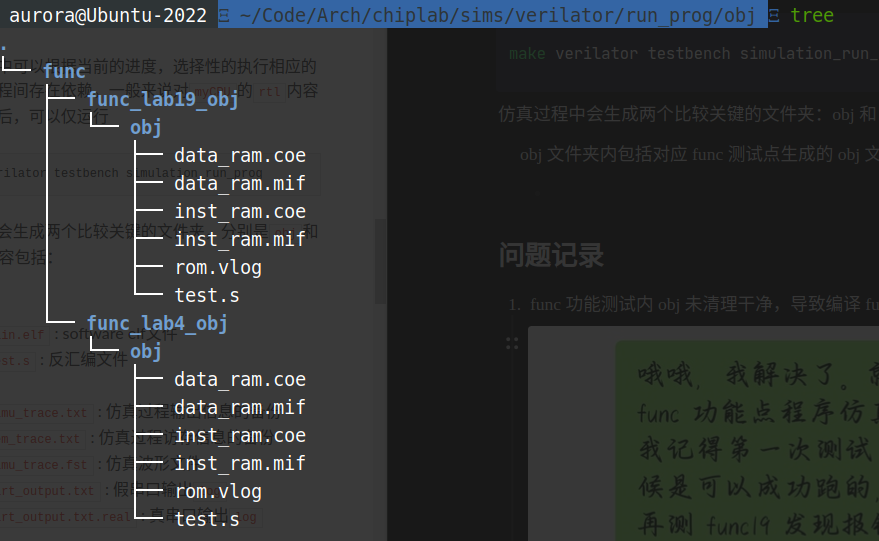
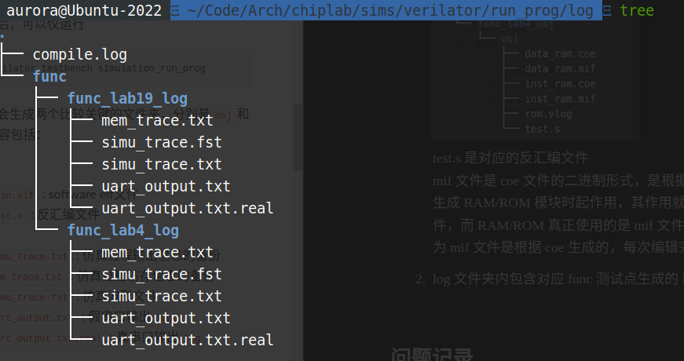
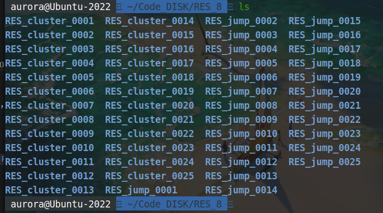
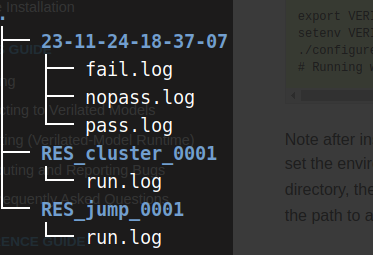

# verilator仿真环境说明

## 目录

- [2.1 SOC参数配置](#21-SOC参数配置)
- [2.2 Quick start](#22-Quick-start)
  - [简单的仿真过程](#简单的仿真过程)
- [2.3 LA32R-NEMU](#23-LA32R-NEMU)
- [2.4 prog环境](#24-prog环境)
  - [2.4.1. 编译参数配置](#241-编译参数配置)
  - [2.4.2 运行参数设置](#242-运行参数设置)
  - [2.4.3 编译运行](#243-编译运行)
- [2.4.4 func验证](#244-func验证)
- [2.5 random环境](#25-random环境)
  - [2.5.1 连接DIFFTEST相关信号](#251-连接DIFFTEST相关信号)
  - [2.5.2 准备测试用例](#252-准备测试用例)
  - [2.5.3. 编译参数配置](#253-编译参数配置)
  - [2.5.4 运行参数配置](#254-运行参数配置)
  - [2.5.5 编译运行](#255-编译运行)
    - [2.5.5.1 单个随机指令序列的运行方法](#2551-单个随机指令序列的运行方法)
  - [2.5.6. 随机验证调试帮助](#256-随机验证调试帮助)
- [2.6 提高仿真速度的Tips](#26-提高仿真速度的Tips)
- [问题记录](#问题记录)

运行环境包括`run_prog`和`run_random`

run\_prog用于运行以下测试程序

- func：共81个功能测试点，验证处理器核设计是否与指令手册一致
- coremark/dhrystone：性能测试程序
- my\_program：用户自定义裸机C程序
- linux：内核，仿真环境下可通过终端与用户交互

run\_random用于运行随机指令序列，能够覆盖部分边角情况。初始化完成后，序列中的指令可连续执行，由生成器保证序列可连续执行不会中断以及提供页表项完成虚实地址映射

仿真环境下的运行程序都可以通过diifftest框架实现处理器运行结果和nemu模拟器运行结果的实时比对，其中nemu是作为金标准[^注释1]，帮助用户发现出错的第一现场

## 2.1 SOC参数配置

目前chip目录并不具有顶层代码自动生成的能力，仅提供了少数宏定义，需要结合实际开发板对SoC中的部分参数进行简单调整，以适配处理器核的配置

在chip/config-generator.mak文件内

```bash
CURRENT_DESIGN_TOP=soc_demo
SOC_TOP_NAME=soc_top
TOP_SOC_SRC=${CHIPLAB_HOME}/chip/${CURRENT_DESIGN_TOP}/sim
MYCPU=y
BRIDGE=n
CONFREG=y
AXI_RAND=y
AXI_SRAM=y
AXI64=n
AXI128=n
CPU_2CMT=n
MYCPU_SRC=${CHIPLAB_HOME}/IP/myCPU
BRIDGE_SRC=${CHIPLAB_HOME}/IP/BRIDGE
CONFREG_SRC=${CHIPLAB_HOME}/IP/CONFREG
AXI_RAND_SRC=${CHIPLAB_HOME}/IP/AXI_DELAY_RAND
AXI_SRAM_SRC=${CHIPLAB_HOME}/IP/AXI_SRAM_BRIDGE
AMBA_SRC=${CHIPLAB_HOME}/IP/AMBA
APB_DEV_SRC=${CHIPLAB_HOME}/IP/APB_DEV
UART_SRC=${CHIPLAB_HOME}/IP/APB_DEV/URT+
NAND_SRC=${CHIPLAB_HOME}/IP/APB_DEV/NAND

```

1. AXI64设置为y，表示SoC中AXI协议数据位宽为64位
2. AXI128设置为y，表示SoC中AXI协议数据位宽为128位

   `AXI64`和`AXI128`至多配置一个`y`，都置为`n`时表示`AXI32`，AXI协议数据位宽为32bits
3. CPU\_2CMT 设置为y，表示处理器核每周期可至多提交2条指令，设置为n，表示处理器核每周期提交1条指令
4. 其他参数用于指示所使用的IP模块，以及IP所处的位置。在当前SoC固定无法修改的情况下，这部分参数不需要调整

## 2.2 Quick start

### 简单的仿真过程

首先进入到`$CHIPLAB_HOME/sims/verilator/run_prog`目录中，运行`configure.sh`脚本生产对应的makefile然后进行`make`

```bash
cd $CHIPLAB_HOME/sims/verilator/run_prog #进入验证程序仿真目录中
./configure.sh --run func/func_lab19     #以仿真运行的程序func_lab19为例子生成对应的Makefile
make                                     #开始编译。若没有编译出错，会自动进行仿真。
```

默认的Makefile\_run是不输出波形的，如果需要输出波形，可以修改Makefile\_run内的DUMP\_WAVEFORM参数

```bash
DUMP_WAVEFORM=1
```

然后运行下列命令查看波形

```bash
make run
cd $CHIPLAB_HOME/sims/verilator/run_prog/log/func/func_lab19_log
gtkwave simu_trace.fst                   #查看仿真波形
```

## 2.3 LA32R-NEMU

使用DIFFTEST帮助用户在仿真环境下调试内核[DIFFTEST使用说明](../DIFFTEST使用说明/DIFFTEST使用说明.md "DIFFTEST使用说明")

## 2.4 prog环境

### 2.4.1. 编译参数配置

在run\_prog目录下存在configure.sh文件，通过命令`./configure.sh --help`即可进行编译参数配置

```bash
--help                  print this message打印帮助信息
     
--run software          set software list(use ',' select multiple softwares)
                        Available software: func/func_lab3 func/func_lab4 
                        func/func_lab6 func/func_lab7 func/func_lab8 func/func_lab9 
                        func/func_lab14 func/func_lab15 func/func_lab19 func/func_advance
                        fireye/A0 fireye/B2 fireye/C0 fireye/D1 fireye/I2
                        my_program memset dhrystone coremark linux rtthread
                        c_prg/memcmp c_prg/inner_product c_prg/lookup_table
                        c_prg/loop_induction c_prg/minmax_sequence c_prg/product_sequence
                        设置仿真运行的程序，目前只支持单次仿真选择一个测试程序，支持的测试程序列表如上
 
--disable-trace-comp    disable trace compare in simulation(default: enable)
                        关闭使用NEMU的进行的trace比对功能，默认是开启的
     
--disable-simu-trace    disable print inst info to simu_trace.txt(default: enable)
                        关闭trace log记录，适用于内核的长时间仿真，simu_trace.txt可能会占用较大的存储空间，默认开启
   
--enable-mem-trace      enable print mem info to mem_trace.txt(default: disable)
                        打开访存信息记录，在mem_trace.txt保存取指、数据访问load/store的地址、数据信息
                        默认是关闭的
   
--disable-read-miss     disable read miss check. when core read uninited mem address, 
                          "read miss 0x*" info will be output to terminal(default: disable)
                        关闭read miss警告，C++模拟的ram在核访问未初始化的内容时，会报该地址的read miss，默认关闭

--disable-clk-time      disable print [*ns] info in simu_trace.txt(default: enable)
                        在simu_trace.txt中关闭仿真时间的打印，适用于将simu_trace.txt进行diff的场景，默认开启
                                  
--output-pc-info        output pc info to terminal(default: disable, can only output one info)
                        在当前终端输出每条指令提交的信息，开启这一选项会拉低仿真速度，默认关闭

--output-uart-info      output uart info to terminal 
                        在当前终端输出假串口以及真串口的输出，默认关闭

--output-nothing        output nothing to terminal
                        在当前终端不输出任何信息，默认关闭
    
--threads num           run simulation in num threads(default: disable multithread) 
                        开启num个线程进行仿真，默认是不使用多线程
     
--reset-val value       initialize variables that are not otherwise initialized
                        val=0 reset to zeros; val=1 reset to all-ones; val=2 randomize 
                        (default: 0)
                        reset信号置位时，rtl未初始化的寄存器，verilator不会呈现出x，而是会自行初始化。赋值0初始化为0；赋值1初始化为1；赋值2初始化为随机值。早期设计阶段，可以固定为某个值，而当设计比较稳定，可以设置为随机值，进行比较完备的验证

--reset-random-seed value  set random seed when reset in random mode 
                           当--reset-val为2时，该选项设置对应的随机数种子 

--dump-vcd              vcd waveform
                        生成vcd格式的波形文件，该格式未进行任何的压缩，会占用较大的存储空间，且gtkwave打开较慢，默认关闭

--dump-fst              fst waveform(default: enable)
                        生成fst格式的波形文件，该格式会进行一定的压缩，gtkwave打开较快，但会导致仿真速度下降，默认开启
     
--slice-waveform        slice waveform with waveform-slice-size ns(default: disable)
                        对波形文件进行切分，存储在多个文件中，用于解决波形堆积在一个文件导致打开极慢的问题，默认关闭
     
--waveform-slice-size size  waveform slice clock size(default: 10000)
                            波形文件切分的单位
    
--slice-simu-trace      slice simu_trace.txt with trace-slice-size ns(default: disable)
                        对simu_trace.txt进行切分，同样解决trace堆积在一个文件，vim打开及文本处理都极慢的问题
   
--trace-slice-size size  simu trace slice clock size(default: 100000)     
                         simu_trace.txt切分的单位
   
--tail-waveform         tail waveform with waveform-tail-size ns(default: disable)
                        仅保留末尾部分的波形文件，适用于运行内核时，希望保留出错位置的信息，默认是关闭的
   
--waveform-tail-size size  waveform tail clock size(default: 10000)
                           波形末尾部分的大小
   
--tail-simu-trace       tail simu_trace.txt with trace-tail-size ns(default: disable)
                        仅保留末尾的simu_trace.txt文件
   
--trace-tail-size size  simu trace tail clock size(default: 100000)
                        设置simu_trace.txt文件末尾大小
```

### 2.4.2 运行参数设置

运行参数在`Makefile_run`文件内，更改以后需要重新`make run`

```bash
DUMP_DELAY=0 波形起始时间
DUMP_WAVEFORM=1 是否生成波形，1生成；0不生成
TIME_LIMIT=0 仿真时间限制，设置为0表示无限制 
BUS_DELAY=y 总线是否引入随机延迟
BUS_DELAY_RANDOM_SEED=5570815 总线随机延迟种子
END_PC=1c000010 设置结束的PC值，当PC为该值时仿真结束
SAVE_BP_TIME=0 断点保存仿真时间，断点产生后仿真仍继续进行（设零不进行断点保存）
RAM_SAVE_BP_FILE=#pwd# 断点保存内存信息文件
TOP_SAVE_BP_FILE= 断点保存RTL状态文件
RESTORE_BP_TIME=0 断点恢复仿真时间。设置0表示不进行断点恢复
RAM_RESTORE_BP_FILE= 断点恢复内存信息文件
TOP_RESTORE_BP_FILE= 断点恢复RTL状态文件

ifeq ('${BUS_DELAY}', 'y')
RUN_FLAG += --simu-bus-delay
RUN_FLAG += --simu-bus-delay-random-seed $(BUS_DELAY_RANDOM_SEED)
endif

golden_trace_make:
        python3 ./qemu_log_helper.py --asm test.s --log single.log --dump-rftrace golden_trace.txt 
simulation_run_prog:
        ../output ${RUN_FLAG} --dump-delay $(DUMP_DELAY) --dump-waveform $(DUMP_WAVEFORM) --time-limit $(TIME_LIMIT) --save-bp-time $(SAVE_BP_TIME) --ram-save-bp-file $(RAM_SAVE_BP_FILE) --top-save-bp-file $(TOP_SAVE_BP_FILE) --restore-bp-time $(RESTORE_BP_TIME) --ram-restore-bp-file $(RAM_RESTORE_BP_FILE) --top-restore-bp-file $(TOP_RESTORE_BP_FILE) --end-pc $(END_PC) 

```

### 2.4.3 编译运行

使用`make`命令进行仿真的整个流程，包括

- `make verilator` : verilator编译verilog代码
- `make testbench` : 编译testbench（C++）
- `make soft_compile` : 编译software(func)
- `make simulation_run_prog` : 开始func仿真

可以运行`make clean`清理`make`生成的内容

还可运行`make clean_all`清理`make`及`configure.sh`生成的内容。

目前Makefile比较简陋，对于software无法进行是否修改过的判断，仅通过是否构建出对应obj/\*文件进行判断，如果仅希望重新编译software，可以运行`make clean_soft`删除对应的obj/\*文件夹，然后make。注意不是删除obj目录

## 2.4.4 func验证

一般来说对`myCPU`的`rtl`内容进行改动后，可以不需要对func重新编译，仅运行下列命令即可

```bash
make verilator testbench simulation_run_prog
```

仿真过程中会生成两个比较关键的文件夹：obj和log

1. &#x20;obj文件夹内包括对应func测试点生成的obj文件夹

   

   test.s是对应的反汇编文件
   mif文件是coe文件的二进制形式，是根据coe文件生成的。 coe文件只会在生成RAM/ROM模块时起作用，其作用就是根据文件内容生成相应的mif文件，而RAM/ROM真正使用的是mif文件。且并不能直接编辑mif文件，因为mif文件是根据coe生成的，每次编辑完mif重新生成的话又会覆盖掉修改
2. log文件夹内包含对应func测试点生成的log文件夹

   
   - `simu_trace.txt` : 仿真过程输出信息的备份
   - `mem_trace.txt` : 仿真过程访存信息的备份
   - `simu_trace.fst` : 仿真波形文件 可以使用gtkwave打开
   - `uart_output.txt` : 假串口输出`log`
   - `uart_output.txt.real` : 真串口输出`log`
   > 若使用`Ctrl+C`强制结束仿真，那么输出信息的备份`simu_trace.txt`并不会保存在log目录下，而是会保存在`/tmp`目录下，串口、波形的log输出则会丢失

## 2.5 random环境

### 2.5.1 连接DIFFTEST相关信号

### 2.5.2 准备测试用例

1. 下载相关随机res文件压缩包

   下载地址：[https://caiyun.139.com/w/i/1F5C1o0Yf7uYL](https://caiyun.139.com/w/i/1F5C1o0Yf7uYL "https://caiyun.139.com/w/i/1F5C1o0Yf7uYL")

   提取码：sHJS

   共有10个random资源，总大小为10G左右，为了节省空间，这里只下载其中大小最小的random8.tar.gz
2. random \*.tar.bz2介绍

   解压该`random*.tar.bz2`文件可以得到`RES_*`目录，目录内容如下：

   

   共有`RES_cluster_00**`和`RES_jump00**` 50个子目录

   `jump`类倾向于同一类指令重复，而`cluster`类为多类型指令混合
3. 准备测试用例

   在`$(CHIPLAB_HOME)/software/`目录下新建`random_res`目录，将步骤2解压得到的部分RES\_cluster\_00\*\*和RES\_jump\_00\*\*移动到该目录下

   移动部分的原因是：对于`random_res`下的所有文件，`run_random`都会对其进行处理，因此建议放入适量的随机指令序列，同时该目录下不可放置其他无关内容

   移动最后的random\_res目录结构如下：

   

### 2.5.3. 编译参数配置

> 📌run\_prog目录下的编译参数配置文件是`configure.sh`文件，run\_random目录下的编译参数配置文件是`config-random.mak、` `config-generator.mak `

`config-random.mak`文件内的内容如下：

```bash
LA32=y y表示32位架构
THREAD=1 编译测试所使用的进程数
RESET_VAL=0 设置reset复位时初始化寄存器的值
#0 reset to zero 值为0表示初始化寄存器值为0
#1 reset to all-ones 值为1表示初始化寄存器值为1
#2 randomize 值为2表示随机初始化
RESET_SEED=1997 RESET_VAL值为2时的随机数种子
#random seed
CACHE_SEED=1997 为对cache进行完备的测试，随机环境下，tlb的存储访问类型（MAT）也进行随机的配置，该选项配置随机种子 
#random set tlb cache or uncache 
DUMP_VCD=y 输出vcd格式的波形文件，vcd不压缩占用内存大gtkwave打开慢
DUMP_FST=n 输出fst格式的波形文件，fst进行一定压缩，gtkwave打开较快，但仿真速度慢
#select one 
#no space!

SLICE_WAVEFORM=n 切分波形文件，解决打开慢的问题
SLICE_SIZE=10000 切分单位

DEAD_CLOCK_EN=y 
DEAD_CLOCK_SIZE=10000

TRACE_COMP=y 是否与NEMQ的trace进行对比
SIMU_TRACE=y 是否记录仿真trace并输出到文件
MEM_TRACE=n 是否记录访存信息并输出到文件
```

### 2.5.4 运行参数配置

同run\_prog，run\_random的运行参数配置文件也是`Makefile_run`文件

```bash
DUMP_DELAY=0 波形起始时间
DUMP_WAVEFORM=0 是否生成波形文件，0不生成1生成
TIME_LIMIT=0 是否有时间限制，0无1有
BUS_DELAY=y 总线是否引入随机延迟
BUS_DELAY_RANDOM_SEED=5570123 总线随机延迟种子

ifeq ('${BUS_DELAY}', 'y')
RUN_FLAG += --simu-bus-delay 
RUN_FLAG += --simu-bus-delay-random-seed $(BUS_DELAY_RANDOM_SEED)
endif

simulation_run_random:ram.dat
  @echo "Run test" $(CASENAME)
  mkdir -p logs 
  mkdir -p ../../log
  ../../output ${RUN_FLAG} --dump-delay $(DUMP_DELAY) --dump-waveform $(DUMP_WAVEFORM) --time-limit $(TIME_LIMIT) --save-bp-time 0 --restore-bp-time 0 --rand-path ./ --end-pc=9c005000 --ram ram.dat > logs/run.log
  mkdir -p ../../log/$(CASENAME)/
  cp logs/* ../../log/$(CASENAME)/


golden_trace_make:golden_trace.txt

golden_trace.txt:./qemu_log_helper.py test.s single.log
  python3 ./qemu_log_helper.py --asm test.s --log single.log --dump-rftrace golden_trace.txt 

ram.dat:../../../../../software/random_boot/rom.vlog inst.vlog
  cat ../../../../../software/random_boot/rom.vlog inst.vlog > ram.dat
```

### 2.5.5 编译运行

在`$(CHIPLAB_HOME)/sims/verilator/run_ranom/`路径下`make`即可以开始随机验证，运行`software/random_res/`目录下的所有随机指令序列

所有随机序列测试成功或失败的信息存放在`run_random/log/date`目录下中；每个随机序列具体的测试信息存放在`run_random/log/$(TESTCASE)`[^注释2]下



左图是DUMP\_WAVEFORM=0的目录结构

若测试成功，则fail.log和nopass.log内容为空；此时pass.log内会记录所测试的随机序列的运行日志文件路径


cluster的run.log文件记录了对应每个random\_res/RES\_cluster\_00\*目录下的所有随机指令序列文件的TLB运行结果，以及总共用时，总指令数等信息
jump的run.log文件记录了对应每个random\_res/RES\_jump\_00\*目录下的所有随机指令的PC情况，以及总用时，总指令数等信息

若DUMP\_WAVEFORM=1，则还会在run.log同级生成波形文件

#### 2.5.5.1 单个随机指令序列的运行方法

在`/run_random/`目录下使用make是运行random\_res内的所有类别的随机指令序列文件。这样往往太耗时，且生成的vcd文件是比较大的

若需要跑具体某个随机测试用例类，则在`run_random/run_random/`目录下执行

```bash
make ../../../../software/random_res/$(TESTCASE)
```

如果之前并没有在/run\_random/下make过，则需要先执行`make prepare`，再运行上述代码框内命令

### 2.5.6. 随机验证调试帮助

随机启动代码位于`software/random_boot`的`rand_boot.S`中。对处理器状态进行初始化，`eret`指令之后开始执行随机指令序列，并且开始比对

随机指令序列只允许触发`tlb refill`[^注释3]异常，`tlb refill`异常的处理程序位于`rand_boot.S`中。当触发`tlb refill`例外时，由`testbench`获取出错虚地址，并查询随机指令序列中提供的页表项，填写到固定地址，再由例外处理程序填充到处理器核的`tlb`中。

随机测试用例文件夹中存有`*.res`文件，用于构成随机验证环境。同时，随机指令序列也给出了正确的执行路径以及执行结果。当运行出错时，一方面可以同作为金标准的`nemu`进行对比分析，另一方面也可以从`*.res`文件获取正确的运行结果并进行分析。以下对较为关键的`*.res`文件进行介绍。

- `comment.res` : 随机指令序列中的汇编指令。`instruction.res、address.res、pc.res、result_type.res、value1.res`五个文件每行与该文件每行的指令对应
- `instruction.res` : 随机指令的二进制。
- `address.res` : 随机指令修改的通用寄存器号。
- `value1.res` : 随机指令修改的通用寄存器的值。
- `pc.res` : 随机指令的虚地址。
- `result_type.res` : 为`1`表示随机指令修改通用寄存器，为`0`则表示不修改。
- `page.res` : 页表项的虚地址。
- `pfn.res` : 页表项的物理地址。
- `cca.res` : 页表项的存储访问类型。
- `page_size.res` : 页表项的页大小。`page.res、pfn.res、cca.res、page_size.res`四个文件每行描述一个页表项，当处理器核在处理`tlb`出错时，可查询四个文件观察页表填充是否正确。
- `init.reg.res` : 通用寄存器初始值。

查看波形时，可观察顶层`simu_top.v`的几个`ram*`信号，判断AXI总线发出的请求及传输的数据是否正确

## 2.6 提高仿真速度的Tips

- 推荐使用较新的`verilator`版本，建议`v4.224`及以上

  我的ubuntu22.04使用`sudo apt install verilator`后安装的是4.038版本
- 关注`verilator`编译时给出的`WARNING`中是否有`UNOPT`，`UNOPTFLAT`等字样，如有，应当尽量解决之
- 如果你的设计复杂度明显比`chiplab`仓库中自带的DEMO CPU更高，请尝试使用多线程仿真
- 建议关闭`output-pc-info`这一编译选项
- 不必要记录波形的时候建议不要开启`DUMP_WAVEFORM`，记录波形会带来明显的仿真速度下降
- `verilator`仿真非常依赖主机处理器前端的性能，因此，考虑压缩设计代码大小或使用前端性能更强的处理器来运行仿真会有帮助

## 问题记录

1. func功能测试内obj未清理干净，导致编译func时出现undefined reference错误

   
2. 不设置Makefile\_run中的`DUMP_WAVEFORM`为1时，make会出现mv /tmp/log/ \*.fst失败，Make报错tmp/log不存在，但这个不影响make进程。设置以后即不出现这个警告
3. 单个随机指令序列的运行时报错不存在目标rom.vlog，解决这个以后又报错不存在output

   原因是run\_random/run\_random下的makefile写的太乱

   若没有在run\_random/目录下make过，则在该目录下make需要先make random\_boot产生rom.vlog，然后再make testbench产生output；否则直接make即可

   因此可以将makefile修改为以下代码
   ```verilog
   BASE :=../../../../software/random_res
   DIRS :=$(filter-out Makefile,$(wildcard $(BASE)/*))
   .PHONY: all $(DIRS)
   # To run specific test <TESTCASE> (e.g. RES0)
   # make RES0
   all: $(DIRS)
   ifneq "$(MAKECMDGOALS)" "prepare"
   $(DIRS):
     +make simulation_run_random -C $(notdir $@) -f ../../Makefile_run CASENAME=$(notdir $@)
   else
   $(DIRS):
     mkdir -p $(notdir $@)
     cd $(notdir $@) && ln -sf ../$@/* ./
   endif
   prepare:$(DIRS)
     +make all -C ../../../../software/random_boot
     +make verilator -C ../
     +make testbench -C ../

   clean:
     rm -rf $(filter-out Makefile,$(wildcard *))
     +make clean -C ../../../../software/random_boot
     rm ../output

   ```
   > make 的-C是进入到-C参数的目录下执行make 以及make所带有的选项
   >
   > Makefile的缩进是只允许使用Tab缩进的
   > 改完之后即可以按照如果之前并没有在/run\_random/下make过，则需要先执行`make prepare`，再运行上述代码框内命令所述，**先**\*\*`make prepare`****再****`make`\*\*

[^注释1]: 当前临床医学界所公认的诊断某病最为可靠的方法

[^注释2]: TESTCASE是具体的RES\_cluster/RES\_jump序列号

[^注释3]: loongArch中有提到
