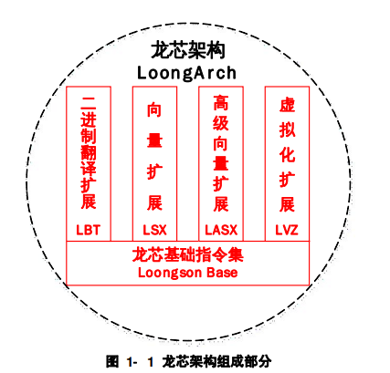
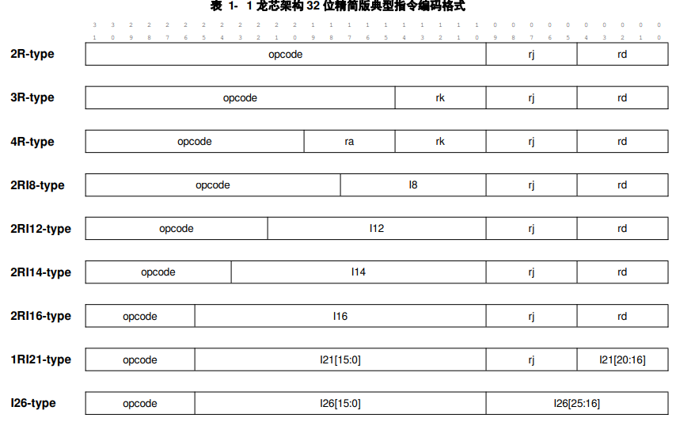

# 1 引言

## 目录

-   [1.1 龙芯架构概述](#11-龙芯架构概述)
-   [1.2 指令编码格式](#12-指令编码格式)
-   [1.3 指令汇编助记格式](#13-指令汇编助记格式)
-   [1.4 一些书写规则](#14-一些书写规则)
    -   [1.4.1 指令名缩写规则](#141-指令名缩写规则)
    -   [1.4.2 控制状态寄存器的指称方式](#142-控制状态寄存器的指称方式)

## 1.1 龙芯架构概述

龙芯架构 LoongArch 是RISC风格的指令系统架构。指令长度固定且编码格式规整，绝大多数指令只有两个源操作数和一个目的操作数，采用 load/store 架构，非load/store指令的操作对象均是处理器核内部的寄存器或指令中的立即数

龙芯架构分为 32 位和 64 位两个版本，分别称为 LA32 架构和 LA64 架构。LA64 架构**应用级二进制向下兼容**[^注释1] LA32 架构

龙芯架构采用基础部分加扩展部分的组织形式，如左图。扩展部分包括：二进制编译扩展LBT、虚拟化扩展LVZ、向量扩展LSX和高级向量扩展LASX

龙芯架构的基础部分包含非特权指令集和特权指令集两个部分，其中非特权指令集部分定义了常用的整数和浮点数指令，能够充分支持现有各主流编译系统生成高效的目标代码

供学习使用的是LA32R，LA32R是LA32的精简版

## 1.2 指令编码格式

LA32R中的所有指令均采用 32 位固定长度，且指令的地址都要求4 字节边界对齐[^注释2]。当指令地址不对齐时[^注释3]将触发地址错异常

> ✨指令编码的风格是所有寄存器操作数域都从第 0 比特开始从低到高依次摆放rd、rj、rk。操作码都是从第31比特开始从高到低依次摆放。如果指令中包含有立即数操作数，那么立即数域位于寄存器域和操作码域之间，根据不同指令类型有不同的长度

具体来说包括9种指令编码格式：3种不含立即数的，6种含有立即数的。此外也有极个别的不属于这9种编码格式的指令，对于这些指令需要单独考虑

## 1.3 指令汇编助记格式

指令汇编助记格式主要包括指令名和操作数两部分

1.  通过指令名前缀字母来区分整数和浮点数指令。所有非向量浮点数指令的指令名以字母“F”开头
2.  绝大多数指令通过指令名中“.XX”形式的后缀来指示指令的操作对象[^注释4]，且这种形式的后缀仅用来表征指令操作对象的类型。

    对于操作对象是整数类型的，指令名后缀为.B、.H、.W、.BU、.HU、.WU分别表示该指令操作的数据类型是有符号字节、有符号半字、有符号字、无符号字节、无符号半字、无符号字。当操作数是有符号数还是无符号数不影响运算结果时，指令名中携带的后缀均不带 U，但此时并不限制操作对象只能是有符号数。

    对于操作对象是浮点数类型的，或者更具体来说是那些指令名以“F”开头的指令，其指令名后缀为.H、.S、.D、.W、.WU 分别表示该指令操作的数据类型是半精度浮点数、单精度浮点数、双精度浮点数、有符号字、无符号字。
    > 并不是所有指令都用“.XX”形式的后缀来指示指令的操作对象。当指令操作对象的数据位宽由所执行处理器是32位实现还是 64 位决定的，如 SLT 和 SLTU 指令，这种指令是不加后缀的。此外，操作CSR、TLB 和Cache的特权态指令以及在不同寄存器文件之间移动数据的指令也是不加这种表征操作对象类型的后缀的
3.  当源操作数和目的操作数的数据位宽和有无符号情况一致时，指令名只有一个后缀
    如果所有源操作数的数据位宽和有无符号情况一致，但是与目的操作数的不一致，那么指令名将有两个后缀，从左往右，第一个后缀表明目的操作数的情况，第二个后缀表明源操作数的情况。
    如果源操作和目的操作数的情况更复杂，那么指令名将从左往右依次列出目的操作数和每个源操作数的情况，其次序与指令助记符中后面操作数的顺序一致。
4.  寄存器操作数通过不同的首字母表明其属于哪个寄存器文件

    以“rN”来标记通用寄存器，以“fN”来标记浮点寄存器。其中 N 是数字，表示操作的是该寄存器文件中第 N 号寄存器。

## 1.4 一些书写规则

### 1.4.1 指令名缩写规则

为了行文的简洁，本手册采用了一种指令名缩写规则。该规则中，{A/B/C}表示此处分别使用A、B、C来参与构成不同的指令名，A\[B]表示此处分别使用A和AB来参与构成不同的指令名。例如，ADD.{W/D}表示的是 ADD.W 和 ADD.D 两个指令名，而 BLT\[U]表示的是 BLT 和 BLTU 两个指令名，更复杂一点的，ADD\[I].{W/D}表示的是 ADD.W、ADD.D、ADDI.W 和 ADDI.D 四个指令名。**这些缩写的规则的指令运算模式相同或相似，只是操作对象存在差异**

### 1.4.2 控制状态寄存器的指称方式

龙芯架构 32 位精简版下定义了一系列控制状态寄存器（Control and Status Register，简称CSR），用于控制指令的执行行为，每个 CSR 通常包含若干个域。本手册在叙述过程中，将**采用CSR.%%%%.####的形式来指称名称缩写为%%%%的控制状态寄存器中名字为####的域。** 例如，CSR.CRMD.PLV表示CRMD这个寄存器中的 PLV 域。

[^注释1]: LA32 架构的应用软件可以直接运行在兼容 LA64 架构的机器上并获得相同的运行结果
    这种向下二进制兼容仅限于应用软件，架构规范并不保证在兼容 LA32 架构的机器上运行的系统软件（如操作系统内核）直接在兼容LA64 架构的机器上运行时总是获得相同的运行结果

[^注释2]: 地址的最低两位一定为0，所以指令地址都给的是\[:2]

[^注释3]: inst\_add\[1:0]不为0

[^注释4]: 只是一种约束，没有U代表是否有无符号不影响结果的运算
