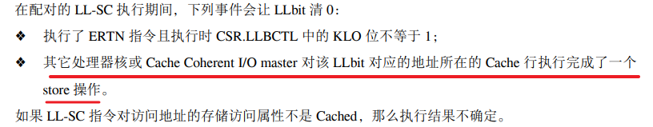
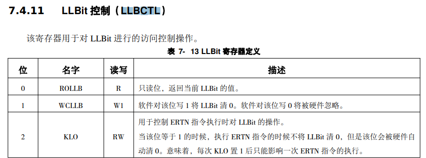

# 2 基础整数指令

## 目录

- [LA32R的机器语言与汇编语言表达](#LA32R的机器语言与汇编语言表达)
  - [机器语言表达](#机器语言表达)
  - [汇编语言表达](#汇编语言表达)
- [2.1 基础整数指令编程模型](#21-基础整数指令编程模型)
  - [2.1.1 数据类型](#211-数据类型)
  - [2.1.2 寄存器](#212-寄存器)
    - [2.1.2.1 通用寄存器](#2121-通用寄存器)
    - [2.1.2.2 PC](#2122-PC)
  - [2.1.3 运行特权等级](#213-运行特权等级)
  - [2.1.4 异常和中断](#214-异常和中断)
  - [2.1.5 内存地址空间](#215-内存地址空间)
  - [2.1.6 采用小端的字节顺序](#216-采用小端的字节顺序)
  - [2.1.7 存储访问类型](#217-存储访问类型)
  - [2.1.8非对齐存储访问](#218非对齐存储访问)
  - [2.1.9存储一致性模型](#219存储一致性模型)
- [2.2 基础整数指令概述](#22-基础整数指令概述)
  - [2.2.1 算术运算类模型](#221-算术运算类模型)
    - [2.2.1.1 ADD.W SUB.W](#2211-ADDW-SUBW)
    - [2.2.1.2 ADDI.W](#2212-ADDIW)
    - [2.2.1.3 LU12I.W](#2213-LU12IW)
    - [2.2.1.4 SLT\[U\]](#2214-SLTU)
    - [2.2.1.5 SLT\[U\]I](#2215-SLTUI)
    - [2.2.1.6 PCADDU12I](#2216-PCADDU12I)
    - [2.2.1.7 AND, OR, NOR, XOR](#2217-AND-OR-NOR-XOR)
    - [2.2.1.8 ANDI, ORI, XORI](#2218-ANDI-ORI-XORI)
    - [2.2.1.9 NOP](#2219-NOP)
    - [2.2.1.10 MUL.W, MULH.W\[U\]](#22110-MULW-MULHWU)
    - [2.2.1.11 DIV.W\[U\], MOD.W\[U\]](#22111-DIVWU-MODWU)
  - [2.2.2 移位运算类指令](#222-移位运算类指令)
    - [2.2.2.1 SLL.W, SRL.W, SRA.W](#2221-SLLW-SRLW-SRAW)
    - [2.2.2.2 SLLI.W, SRLI.W, SRAI.W](#2222-SLLIW-SRLIW-SRAIW)
  - [2.2.3 转移指令](#223-转移指令)
    - [2.2.3.1 BEQ, BNE, BLT\[U\], BGE\[U\]](#2231-BEQ-BNE-BLTU-BGEU)
    - [2.2.3.2 B](#2232-B)
    - [2.2.3.3 BL](#2233-BL)
    - [2.2.3.4 JIRL](#2234-JIRL)
  - [2.2.4 普通访存指令](#224-普通访存指令)
    - [2.2.4.1 LD.{B\[U\]/H\[U\]/W}, ST.{B/H/W}](#2241-LDBUHUW-STBHW)
    - [2.2.4.2 PRELD](#2242-PRELD)
  - [2.2.5 原子访存指令](#225-原子访存指令)
    - [2.2.5.1 LL.W, SC.W](#2251-LLW-SCW)
  - [2.2.6 栅障指令](#226-栅障指令)
    - [2.2.6.1 DBAR——完全的数据屏障](#2261-DBAR完全的数据屏障)
    - [2.2.6.2 IBAR——取指和store之间的屏障](#2262-IBAR取指和store之间的屏障)
  - [2.2.7 其它杂项指令](#227-其它杂项指令)
    - [2.2.7.1 SYSCALL](#2271-SYSCALL)
    - [2.2.7.2 BREAK](#2272-BREAK)
    - [2.2.7.3 RDCNTV{L/H}.W, RDCNTID](#2273-RDCNTVLHW-RDCNTID)

## LA32R的机器语言与汇编语言表达

### 机器语言表达

前面所提到的LA32R指令集的9种格式[🖼️ 图片](image/image_MY9WXk6f2d.png "🖼️ 图片")[^注释1]具有大多数RISC指令集指令编码的设计特征：

1. 定长以简化取指访存行为和译码电路定位指令边界的逻辑复杂度——32位
2. 一个不同：操作码采用层次化变长编码以适应不用数目操作数的情况

   变长：从指令集的9种常见格式可以看出，opcode长度再变化。比如两寄存器指令、三寄存器指令、8位立即数指令、12位立即数指令、14位立即数指令

   层次化：采用前缀编码方式根据操作数个数、立即数的长度来使得在指令码整体长度固定的情况下定义尽可能多的指令。而增减一个操作数会增减几个bit，立即数长度也每两个递增，因此呈现出一种层次化的形态。比如16位立即数指令、21位立即数指令、26位立即数指令
3. 操作数位置固定从而使得译码过程中操作码解析和操作数提取可以并行处理

   操作数从指令0编码起，有可变个数个。操作码从指令31编码递减若干位

> 可能会因为指令编码格式感到困难的可能是一些直接用Verilog等传统HDL语言开发CPU译码部件设计的读者，因为原先MIPS或RISC-V指令集将操作码信息层次切分到opcode、funct等域中，会使得设计者很自然地在写译码逻辑时按照这种层次化风格来译码。那么LA23R这种情况怎么办呢？
>
> 其实，设计者还是可以自己定义一个切分的层次，再按照层次化风格来译码。比如31-26、25-22、21-20、19-15.也可以采用行为风格直接采用整个编码inst\_code译码对应值。[^注释2]

### 汇编语言表达

1. 寄存器号前是否要加\$——**必须加**

   目前LA的工具链规定了指令中通用寄存器号的`r`前面必须添加`$`符号，浮点寄存器号的`f`前必须加`$`符号
2. 根据ABI寄存器使用约定的寄存器别名前是否要加\$?

   LoongArch工具链原生支持的只有`$t##`这种写法

   但是由于regdef.h头文件的存在，该头文件中用寄存器别名定义了`$r##`，如下
   ```verilog
   #define zero    $r0
   #define ra      $r1
   #define tp      $r2
   #define sp      $r3
   #define a0      $r4
   #define a1      $r5
   #define a2      $r6
   #define a3      $r7
   #define a4      $r8
   #define a5      $r9
   #define a6      $r10
   #define a7      $r11
   #define v0      $r10 
   #define v1      $r11 
   #define t0      $r12
   #define t1      $r13
   #define t2      $r14
   #define t3      $r15
   #define t4      $r16
   #define t5      $r17
   #define t6      $r18
   #define t7      $r19
   #define t8      $r20
   #define x       $r21
   #define fp      $r22
   #define s0      $r23
   #define s1      $r24
   #define s2      $r25
   #define s3      $r26
   #define s4      $r27
   #define s5      $r28
   #define s6      $r29
   #define s7      $r30
   #define s8      $r31
   ```
3. 汇编程序中出现的指令在指令手册中查不到是怎么回事？

   汇编程序中如move、li.w、jr、la这样的指令称为伪指令，并不需要在CPU上实现

   伪指令其实是一些固定了某些操作数表达形式的指令（序列），定义伪指令是为了在不增加硬件实现开销的情况下丰富汇编编程可用的指令，提升汇编开发的效率

## 2.1 基础整数指令编程模型

### 2.1.1 数据类型

LA32基础整数指令操作的数据类型有 4 种，分别是：比特（bit，简记 b）、字节（Byte，简记B，长度8b）、半字（Halfword，简记 H，长度 16b）、字（Word，简记 W，长度 32b）。字节、半字、字均采用补码编码

### 2.1.2 寄存器

基础整数指令涉及的寄存器包括通用寄存器（General-purpose Register，简称GR）和程序计数器（ProgramCouner，简称 PC）

#### 2.1.2.1 通用寄存器

通用寄存器 GR 有 32 个，记为 r0\~r31[^注释3]，其中第 0 号寄存器 r0 的值恒为 0[^注释4]。LA32的GR 的位宽是32 比特。基础整数指令与通用寄存器存在正交关系。即从架构角度而言，这些指令中任一个寄存器操作数都可以采用32个 GR 中的任一个。唯一的例外是 BL 指令中隐含的目的寄存器一定是r1——因为在标准的龙芯架构应用程序二进制接口API中，r1 固定作为存放函数调用返回地址的寄存器

#### 2.1.2.2 PC

PC宽度与GR一致，记录着当前指令的地址。只能被转移指令、异常陷入和返回指令间接修改，也可以作为一些非转移指令的源操作数直接读取。

### 2.1.3 运行特权等级

LA32R定义了两个运行特权等级——PLV0和PLV3

PLV0是内核级，运行应用软件和系统软件
PLV3是应用级，运行应用软件

### 2.1.4 异常和中断

异常（Exception）和中断（Interrupt）会打断当前正在执行的应用程序，将程序执行流切换到异常/中断处理程序的入口处开始执行。其中异常由指令在执行过程中发生的异常情况引发，而中断则由外部事件（如中断输入信号）引发

> ✨产生异常/中断不一定引发执行流的改变
>
> 触发异常/中断一定改变当前执行流，转移到异常/中断服务程序入口处

应用软件能够感知到的异常有：

1. 系统调用异常：syscall指令
2. 断点异常：break指令
3. 指令不存在异常：指令编码并未在架构中定义
4. 特权指令错异常：在应用软件PLV3执行特权指令
5. 地址错异常：地址未4字节对齐
6. 浮点错异常：浮点数据运算出现异常情况[^注释5]

### 2.1.5 内存地址空间

LA32R中的内存地址空间是一个字节寻址的线性连续地址空间，访问范围是$0 \dots2^{31}-1$

### 2.1.6 采用小端的字节顺序

### 2.1.7 存储访问类型

LA32R支持两种存储访问类型：一致可缓存CC和强序非缓存SUC

存储访问类型与访存虚拟地址绑定，通过页表项中的MAT域决定——0表示SUC、1表示CC、2/3保留

当采用CC时，所访问的对象既可以是最终存储对象也可以是处理器中维护有缓存一致性的缓存。通常采用这种访问类型访问内存以获得高性能

当采用SUC或者WUC时只能直接访问最终存储对象。SUC和WUC的区别是SUC满足顺序一致性，即所有访问严格按照程序中的次序执行且当前访存操作彻底完成前不能开始执行下一个访存操作

LA32R只要求强序非缓存类型的**访存指令**不能有副作用（Side Effect），即**此类指令不允许不可推测的执行**。软件可以利用这一特性通过强序非缓存类型的访存指令来访问系统中的I/O设备。但是，LA32R允许强序非缓存类型的**取指操作具有副作用**。这是指，访问类型是强序非缓存类型的取指操作，**即使它源自转移预测的结果，也允许执行**。~~为避免此类推测执行所产生的核外访存~~[^注释6]~~操作误入非法的物理地址空间，需要在片上网络~~[^注释7]~~中过滤掉存在风险的访问。~~[^注释8]

### 2.1.8非对齐存储访问

所有取指操作的访存地址必须 4 字节边界对齐，否则将触发取指地址错异常（ADEF）。所有访存指令都要进行地址对齐检查。对于需要进行地址对齐检查的访存指令，如果其访问的地址不是自然对齐的，将触发地址非对齐异常（ALE）

### 2.1.9~~存储一致性模型~~[^注释9]

LA32R的存储一致性模型采用弱一致性WC模型

在弱一致性模型中，同步操作和普通访存需要区分开来，程序员必须用架构所定义的同步操作把对于写共享单元的访问保护起来，以保证多个处理器核对于写共享单元的访问是互斥的。对访存事件发生次序做如下限制：

1. 同步操作的执行满足顺序一致性条件。即同步操作在所有处理器核中都严格按照其在程序中出现的次序执行，且在当前同步操作彻底完成之前不能开始执行下一个同步操作。2. 在任一普通访存操作允许被执行之前，所有在同一处理器核中先于这一访存操作的同步操作都已经完成；
2. 在任一同步操作允许被执行之前，所有在同一处理机中先于这一同步操作的普通访存操作都已完成。

龙芯架构 32 位精简版中能够产生同步操作的指令有 DBAR、IBAR 以及LL-SC 指令对。

## 2.2 基础整数指令概述

### 2.2.1 算术运算类模型

#### 2.2.1.1 ADD.W SUB.W

指令格式：`add.w rd, rj, rk`，`sub.w rd, rj, rk`

不对溢出做任何处理

#### 2.2.1.2 ADDI.W

指令格式：` addi.w rd, rj, si12`

ADDI.W 将通用寄存器 rj 中的数据加上 12 比特立即数 si12\*\* 符号扩展\*\*后的32 位数据，所得结果写入通用寄存器 rd 中

不对溢出做任何处理

#### 2.2.1.3 LU12I.W

指令格式：` lu12i.w rd, si20`

LU12I.W 将 20 比特立即数 si20 最低位连接上 12 比特 0 后写入通用寄存器rd 中

> 🍉该指令与 ORI 指令一起，用于将超过 12 位的立即数装载到通用寄存器中
>
> lu12i.w \$r8,0x12345
>
> ori \$r8,\$r8,0x678
>
> 则r8中存储的是0x1234\_5678

#### 2.2.1.4 SLT\[U]

指令格式：` slt rd, rj, rk`，`sltu rd, rj, rk`

SLT 将通用寄存器 rj 中的数据与通用寄存器 rk 中的数据视作**有符号整数**进行大小比较，如果**前者小于后者，则将通用寄存器 rd 的值置为 1，否则置为 0**。而SLTU视为**无符号数**进行比较

**SLT\[U]位宽隐含为执行机器GR位宽**

#### 2.2.1.5 SLT\[U]I

指令格式： `slti rd, rj, si12`，`sltui rd, rj, si12`

大致功能与SLT\[U]相同，只不过**比较的是rj和12位立即数si12****符号扩展****后的32位立即数**

#### 2.2.1.6 PCADDU12I

指令格式： `pcaddu12i rd, si20`

PCADDU12I 将 20 比特立即数 si20 最低位连接上 12 比特 0 之后符号扩展，所得数据加上该指令的PC，相加结果写入通用寄存器 rd 中。

#### 2.2.1.7 AND, OR, NOR, XOR

指令格式：` and rd, rj, rk`，`or rd, rj, rk`，`nor rd, rj, rk`，`xor rd, rj, rk`

**位宽隐含为执行机器GR位宽**

#### 2.2.1.8 ANDI, ORI, XORI

指令格式：` andi rd, rj, ui12`，`ori rd, rj, ui12`，`xori rd, rj, ui12`

执行功能：将rj和12比特问无符号立即数ui12**零扩展**后的数据按位逻辑运算，结果写入rd

#### 2.2.1.9 NOP

指令格式：`nop`

NOP 指令是指令“andi r0, r0, 0”的别名。其功能仅为占据 4 字节的指令码位置并将PC加4，除此之外不会改变其它任何软件可见的处理器状态

#### 2.2.1.10 MUL.W, MULH.W\[U]

指令格式：` mul.w rd, rj, rk`，`mulh.w rd, rj, rk`，`mulh.wu rd, rj, rk`

mul.w将通用寄存器 rj 中的数据与通用寄存器 rk 中的数据进行相乘，乘积结果的\[31:0]位数据写入通用寄存器 rd 中

mulh.w将通用寄存器 rj 中的数据与通用寄存器 rk 中的数据进行相乘，乘积结果的\[63:32]位数据写入通用寄存器 rd 中

mulh.wu 将通用寄存器 rj 中的数据与通用寄存器 rk 中的数据视作无符号数进行相乘，乘积结果的\[63:32]位数据写入通用寄存器 rd 中

#### 2.2.1.11 DIV.W\[U], MOD.W\[U]

指令格式： `div.w rd, rj, rk`，`mod.w rd, rj, rk`，`div.wu rd, rj, rk`，`mod.wu rd, rj, rk`

div.w将GR中的rj、rk中的数据视为有符号数然后相除，所得的商写入rd中

div.wu将GR中的rj、rk中的数据视为无符号数然后相除，所得的商写入rd中

mod.w将GR中的rj、rk中的数据视为有符号数然后相除，所得的余数写入rd中

mod.wu将GR中的rj、rk中的数据视为无符号数然后相除，所得的余数写入rd中

**除法运算：余数与被除数的符号一致且余数的绝对值小于除数的绝对值。商符为被除数符号和除数符号异或**

**当除数是0时，结果可以是任何值，并不会触发异常**

### 2.2.2 移位运算类指令

#### 2.2.2.1 SLL.W, SRL.W, SRA.W

指令格式： `sll.w rd, rj, rk`，`srl.w rd, rj, rk`，`sra.w rd, rj, rk`

sll、srl、sra将GR中的rj内容按照rk的低五位值进行移位(l是逻辑，a是算术)，结果写入rd

#### 2.2.2.2 SLLI.W, SRLI.W, SRAI.W

指令格式：` slli.w rd, rj, ui5`，`srli.w rd, rj, ui5`，`srai.w rd, rj, ui5`

根据给定的立即数移位，ui5为5比特的无符号立即数

### 2.2.3 转移指令

#### 2.2.3.1 BEQ, BNE, BLT\[U], BGE\[U]

指令格式： `beq rj, rd, offs16`，`bne rj, rd, offs16`，`blt rj, rd, offs16`，`bge rj, rd, offs16`，`bltu rj, rd, offs16`，`bgeu rj, rd, offs16`

这些指令均是比较rj和rd，然后满足关系后跳转到指定地址

关系：beq→=，bne→≠，blt→<，bge≥
带u的是进行无符号数比较
指定地址是：16位的立即数左移两位再进行符号扩展与当前指令地址PC相加

> 🍉不过需要注意的是，上述指令如果在写汇编时采用直接填入偏移值的方式，则汇编表示中的立即数应填入以字节为单位的偏移值，即指令码中 offs16<<2

#### 2.2.3.2 B

指令格式： `b offs26`

B指令是进行无条件跳转，其跳转目的地址是offs26左移2位再进行符号扩展，所得的地址+当前指令地址PC

仍然同2.2.3.1，该指令如果在写汇编时采用直接填入偏移值的方式，则汇编表示中的立即数应填入以字节为单位的偏移值，即指令码中 offs26<<2。

#### 2.2.3.3 BL

指令格式：`bl offs26`

BL 无条件跳转到目标地址处，同时将该指令的 PC 值加 4 的结果写入到1 号通用寄存器r1 中。

跳转目的地址是offs26左移2位再进行符号扩展，所得的地址+当前指令地址PC

仍然同2.2.3.1，该指令如果在写汇编时采用直接填入偏移值的方式，则汇编表示中的立即数应填入以字节为单位的偏移值，即指令码中 offs26<<2

#### 2.2.3.4 JIRL

指令格式：` jirl rd, rj, offs16`

JIRL 无条件跳转到目标地址处，同时将该指令的 PC 值加 4 的结果写入到通用寄存器rd 中

目标地址是：offs16<<2符号扩展+GR\[rj]

> 🍉rd=0，rj=1，offs16=0的JIRL指令一般用来做调用返回

该指令如果在写汇编时采用直接填入偏移值的方式，则汇编表示中的立即数应填入以字节为单位的偏移值，即指令码中 offs16<<2。

### 2.2.4 普通访存指令

#### 2.2.4.1 LD.{B\[U]/H\[U]/W}, ST.{B/H/W}

指令格式：` ld.b rd, rj, si12`，`ld.h rd, rj, si12`，`ld.w rd, rj, si12`，`ld.bu rd, rj, si12`，`ld.hu rd, rj, si12`，`st.b rd, rj, si12`，`st.h rd, rj, si12`，`st.w rd, rj, si12`

LD.{B/H}从内存{GR\[rj]+si12立即数符号扩展}的位置上取一个字节或半个字经符号扩展（若后缀是u则进行逻辑扩展）放在rd内
LD.W从内存{GR\[rj]+si12立即数符号扩展}的位置上取一个字放在rd内

ST.{B/H/W}从rd中的\[7:0],\[15:0],\[31:0]位数据写入内存{GR\[rj]+si12立即数符号扩展}位置

> 🍉对于 LD.{H\[U]/W}和 ST.{B/H/W}指令，只要其访存地址是自然对齐的，都不会触发非对齐例外；否则的话将触发非对齐例外
>
> H是半字，32位是2字节对齐
> W是字，32位是4字节对齐

#### ~~2.2.4.2 PRELD~~

指令格式： `preld hint, rj, si12`

preld指令是从内存{GR\[rj]+si12立即数符号扩展}位置上中预取一个 Cache 行的数据放入 Cache 中。该访存地址落在待预取的Cache 行内。PRELD 指令中的 hint 提示处理器预取的类型以及取回的数据填入哪一级Cache。hint 从0\~31有32个可选值。目前 hint=0 定义为 load 预取至一级数据 Cache，hint=8 定义为 store 预取至一级数据Cache。其余hint 值的含义暂未定义，处理器执行时视同 NOP 指令处理。如果 PRELD 指令的访存地址的 Cache 属性不是 cached，那么该指令不能产生访存动作，视同NOP指令处理。

**PRELD 指令不会触发任何与 MMU 或是地址相关的例外**

### ~~2.2.5 原子访存指令~~

#### 2.2.5.1 LL.W, SC.W

指令格式：` ll.w rd, rj, si14`，`sc.w rd, rj, si14`，汇编格式中si14<<2填入

内存地址的计算：14位立即数左移两位然后进行符号扩展再与rj寄存器内容相加

ll.w 和 sc.w 这一对指令用于实现原子的“读-修改-写”访存操作序列。LL.W指令从内存指定地址取回一个字的数据符号扩展后写入通用寄存器 rd，与之配对的 SC.W 指令操作同样宽度的数据且访问相同的内存地址。

访存操作序列原子性的维护机制是，LL.W 执行时记录下访问地址并置上一个标记（LLbit 置为1），SC.W 指令执行时会查看 LLbit，仅当 LLbit 为 1 时才真正产生写动作，否则不写。

那么就需要反复执行SC.W指令来检查LLbit——为了构建这个循环，SC.{W/D}指令会将其执行成功与否的标志（也可以简单理解为SC指令执行时所看到的 LLbit 值）写入到通用寄存器 rd 中返回。



ertn是异常返回指令，CSR是控制状态寄存器，LLBCTL是LLbit控制



### 2.2.6 栅障指令

> 内存屏障，也称内存栅栏，内存栅障，屏障指令等， 是一类同步屏障指令，是CPU或编译器在对内存随机访问的操作中的一个同步点，使得此点之前的所有读写操作都执行后才可以开始执行此点之后的操作
>
> 内存屏障之前的所有写操作都要写入内存；内存屏障之后的读操作都可以获得同步屏障之前的写操作的结果

#### 2.2.6.1 DBAR——完全的数据屏障

指令格式： `dbar hint`

DBAR 指令用于完成 load/store 访存操作之间的栅障功能。其携带的立即数hint 用于指示该栅障的同步对象和同步程度。
hint 值为 0 是默认必须实现的，其指示一个完全功能的同步栅障——只有等到之前所有load/store访存操作彻底执行完毕后，“DBAR 0”指令才能开始执行；且只有“DBAR 0”执行完成执行后，其后所有load/store访存操作才能开始执行。

如果没有专门的功能实现，其它所有 hint 值都必须按照 hint=0 执行

#### 2.2.6.2 IBAR——取指和store之间的屏障

指令格式：` ibar hint`

IBAR 指令使用完成单个处理器核内部 store 操作与取指操作之间的同步。其携带的立即数hint 用于指示该栅障的同步对象和同步程度。

hint 值为 0 是默认必须实现的。它能够确保“IBAR 0”指令之后的取指一定能够观察到“IBAR0”指令之前所有 store 操作的执行效果

### 2.2.7 其它杂项指令

#### 2.2.7.1 SYSCALL

指令格式：` syscall code`

执行syscall指令将立即无条件的触发系统调用异常。指令码中 code 域携带的信息可供异常处理程序作为所传递的参数使用。

#### 2.2.7.2 BREAK

指令格式： `break code`

执行break指令将立即无条件的触发断点异常，code域携带的信息可供异常处理程序作为所传递的参数使用

#### 2.2.7.3 RDCNTV{L/H}.W, RDCNTID

指令格式： `rdcntvl.w rd`，`rdcntvh.w rd`，`rdcntid rj`

LA32R定义了一个恒定频率的计时器——是64位的计数器，称*Stable Counter*。Stable Counter 在复位后置为 0，随后每个计数时钟周期自增 1，当计数至全 1 时自动绕回至0 继续自增。同时每个计时器都有一个软件可配置的全局唯一编号，称为 *Counter ID*。

rdcntv.w是读取计数器当前的计数值置rd寄存器，rdcntvl是读取63位的\[31:0],rdcntvh是读取63位的\[63:31]；rdcntid是读取当前计数器ID置rj

rdcntv\[l/h]，rdcntid实际上分别对应于LA32的`RDTIMEL.W rd, zero`、`RDTIMEH.W rd, zero`和`RDTIMEL.W zero, rj`

[^注释1]: 两寄存器、三寄存器、四寄存器、8位立即数、12位立即数、14位立即数、16位立即数、21位立即数、26位立即数

[^注释2]: 需要对于生成电路质量不是要求那么高且对于现代EDA综合工具提取公共子表达优化有充分的信心

[^注释3]: 汇编使用时前面要加\$，本来只支持\$txx，因为regdef.h文件的存在，也支持了\$rxx

[^注释4]: 并不是一个寄存器，实际当作接地的导线

[^注释5]: 目前的实现，并没有实现浮点指令集，因此不考虑该异常

[^注释6]: 核外访存操作是指处理器尝试访问物理内存中的数据，这些数据通常存储在主内存（RAM）中，而不是处理器的高速缓存（Cache）中

[^注释7]: 指在芯片内部连接各个处理器核心、高速缓存、内存控制器和其他关键组件的通信网络。片上网络用于在芯片内部传递数据和控制信号

[^注释8]: 目前还不懂

[^注释9]: 不懂
