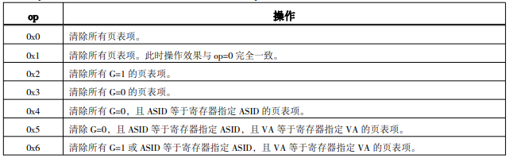

# 4 特权资源架构概述

## 目录

-   [4.1特权等级](#41特权等级)
-   [4.2特权指令概述](#42特权指令概述)
    -   [4.2.1 CSR访问指令](#421-CSR访问指令)
        -   [CSRRD](#CSRRD)
        -   [CSRWR](#CSRWR)
        -   [CSRXCHG](#CSRXCHG)
    -   [4.2.2 Cache维护指令](#422-Cache维护指令)
        -   [CACOP](#CACOP)
    -   [4.2.3 TLB维护指令](#423-TLB维护指令)
        -   [TLBSRCH](#TLBSRCH)
        -   [TLBRD](#TLBRD)
        -   [TLBWR](#TLBWR)
        -   [TLBFILL](#TLBFILL)
        -   [INVTLB](#INVTLB)
    -   [4.2.4 其他杂项指令](#424-其他杂项指令)
        -   [ERTN](#ERTN)
        -   [IDLE](#IDLE)

## 4.1特权等级

LA32R中处理器可以处于两种特权等级：PLV0和PLV3[^注释1]。处理器处于的特权等级由CSR.CRMD.PLV唯一确定

PLV0：最高权限的特权等级，唯一可以使用特权指令并访问所有特权资源的特权等级——对应Linux核心态

PLV3：应用级特权等级，相当于Linux用户态，不能执行特权指令访问特权资源——PLV3下执行除Hit类CACOP外的特权指令会产生特权指令错异常

## 4.2特权指令概述

> 📌所有特权指令仅在 PLV0 特权等级下才能访问。但是可以在 PLV3 特权等级下执行Hit 类CACOP指令

### 4.2.1 CSR访问指令

CSR寄存器类似于通用寄存器[^注释2]，有一个独立的寻址空间，每个CSR寄存器都有32位，具体的每个CSR寄存器含义见

#### CSRRD

指令格式：`csrrd rd,csr_num`

CSRRD指令将指定CSR 的值写入到通用寄存器 rd 中

#### CSRWR

指令格式：`csrwr rd,csr_num`

CSRWR 指令将通用寄存器 rd 中的旧值写入到指定 CSR 中，同时将指定CSR的旧值更新到通用寄存器 rd 中——`Reg[rd]←→Csr[csr_num]`

#### CSRXCHG

指令格式：`csrxchg rd,rj,csr_num`

CSRXCHG指令根据通用寄存器 rj 中存放的写掩码信息，将通用寄存器rd 中的旧值写入到指定 CSR 中对应写掩码为 1 的那些比特，该 CSR 中的其余比特保持不变，同时将该CSR的旧值更新到通用寄存器 rd 中——`(Old_Reg[rd]&Reg[rj])|旧Csr[csr_num]→Csr[csr_num]
旧Csr[csr_num]→Reg[rd]`

### 4.2.2 Cache维护指令

#### CACOP

指令格式：`cacop code,rj,si12`

CACOP指令主要用于Cache的初始化和Cache的一致性维护，其执行的功能是：

1.  通用寄存器 rj 的值加上符号扩展后的 12 位立即数 si12，将得到 CACOP 指令所用的虚拟地址VA，其将用于指示被操作 Cache 行的位置。
2.  code将指定访问哪个Cache以及执行哪种Cache操作

    code\[2:0]指定访问哪个Cache——code\[2:0]=0 表示操作一级私有指令 Cache，code\[2:0]=1 表示操作一级私有数据Cache，code\[2:0]=2表示操作二级共享混合 Cache

    code\[4:3]指定执行哪种Cache操作
    1.  code\[4:3]=0 表示用于 Cache 初始化，将指定 Cache 行的 tag 置为全0

        ~~假设被访问的Cache有（1<\<Way）路，每一路有（1<\<Index）个 Cache 行，每个 Cache 行大小为（1<\<Offset）个字节，那么采用地址直接索引方式意味着，操作该 Cache 的第 VA\[Way-1:0]路的第 VA\[Index+Offset-1:Offset]个Cache行~~
    2.  code\[4:3]=1 表示采用地址直接索引方式维护 Cache 一致性

        采用直接地址索引的方式计算见a

        维护一致性的操作是对指定的Cache 进行无效并写回的操作。如果被操作的是指令 Cache，那么仅需要进行无效操作，并不需要将 Cache 行中的数据写回。对于数据Cache 或混合Cache，由具体实现决定是否仅在 Cache 行数据为脏时才将其写回
    3.  code\[4:3]=2 表示采用查询索引方式维护 Cache 一致性

        查询索引方式是将CACOP的VA视作一个普通的Load指令[^注释3]去访问待操作的Cache，如果命中就对命中的Cache操作，否则不操作
    4.  code\[4:3]=1表示自定义的Cache操作

### 4.2.3 TLB维护指令

#### TLBSRCH

指令格式：`tlbsrch`

使用 CSR.ASID 和 CSR.TLBEHI 的信息去查询 TLB。如果有命中项，那么将命中项的索引值写入到CSR.TLBIDX 的 Index 域，同时将 CSR.TLBIDX 的 NE 位置为 0；如果没有命中项，那么将CSR.TLBIDX的NE位置设置为1

> TLB中各项的索引值计算规则是：从0开始依次递增编号，从第0行到最后一行

#### TLBRD

指令格式：`tlbrd`

将 CSR.TLBIDX 的 Index 域的值作为索引值去读取 TLB 中的指定项。如果指定位置处是一个有效TLB项，那么将该 TLB 项的页表信息写入到 CSR.TLBEHI、CSR.TLBELO0、CSR.TLBELO1 和CSR.TLBIDX.PS中，且将 CSR.TLBIDX 的 NE 位置为 0；如果指定位置处是一个无效 TLB 项，需将CSR.TLBIDX的NE位置为 1，且将 CSR.ASID.ASID、CSR.TLBEHI、CSR.TLBELO0、CSR.TLBELO1 和CSR.TLBIDX.PS全置为0

> 📌有效/无效TLB项和TLB中的页表项有效/无效

#### TLBWR

指令格式：`tlbwr`

TLBWR 指令将 TLB 相关 CSR 中所存放的页表项信息写入到 TLB 的指定项。被填入的页表项信息来自于 CSR.TLBEHI、CSR.TLBELO0、CSR.TLBELO1 和 CSR.TLBIDX.PS。若此时CSR.ESTAT.Ecode=0x3F，即处于 TLB 重填例外处理过程中，那么 TLB 中总是填入一个有效项（即 TLB 项的E 位为1）。否则的话，就需要看 CSR.TLBIDX.NE 位的值。此时如果 CSR.TLBIDX.NE=1，那么 TLB 中会被填入一个无效TLB项；仅当 CSR.TLBIDX.NE=0 时，TLB 中才会被填入一个有效 TLB 项

#### TLBFILL

指令格式：`tlbfill`

tlbfill指令执行的功能同tlbwr

#### INVTLB

指令格式：`invtlb op,rj,rk`

INVTLB 指令用于无效 TLB 中的内容，以维持 TLB 与内存之间页表数据的一致性

op是5位的立即数，用于指示操作类型

rj\[9:0]存放无效操作所需的ASID信息，rj\[31:10]为0。当op所指示的操作不需要ASID时，rj设置为r0

rk中存放无效操作所需的虚拟地址信息，当op所指示的操作不需要VA时，rk设置为r0

### 4.2.4 其他杂项指令

#### ERTN

指令格式：ertn

ERTN 指令用于从异常处理程序返回

ERTN指令将异常对应的 PPLV、PIE 等信息更新至 CSR.CRMD 中，同时跳转到异常所对应的ERA处开始取指。异常对应的 PPLV、PIE 信息来自于 CSR.PRMD，例外对应的 ERA 来自于CSR.ERA

执行 ERTN 指令时，如果 CSR.LLBCTL.KLO ≠ 1，则将 LLbit 置0，否则LLbit 不修改

#### IDLE

指令格式：`idle level`[^注释4]

IDLE 指令执行完毕后，处理器核将停止取指进入等待状态，直至其被中断唤醒或被复位。从停止状态被中断唤醒后，处理器核执行的第一条指令是 IDLE 之后的那一条指令

[^注释1]: PLV是Privilege Level的缩写

[^注释2]: 用一个独立的Verilog文件进行设计

[^注释3]: 涉及虚实地址的转换，可能会产生TLB方面的异常，但是因为访问的是Cache行，不需要考虑地址对齐错异常

[^注释4]: level有什么用？
