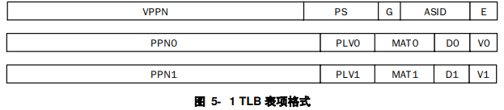

# 5 存储管理

1. 物理地址空间范围

   内存的物理地址空间范围是：$0 \sim 2^{PALEN}-1$

   在LA32R中，PALEN理论上是一个不超过36的正整数，一般是32
2. 虚拟地址空间

   LA32R中的虚拟地址空间是线性平整的→一维数组

   对于内核级PLV0来说，虚拟地址空间大小为$2^{32}B$
3. 地址翻译模式

   LA32R的MMU支持两种地址翻译模式：直接地址翻译模式和映射地址翻译模式
   1. 当CSR.CRMD.DA=1且CSR.CRMD.PG=0时，MMU处于直接地址翻译模式

      直接地址翻译模式默认$物理地址=虚拟地址[PALEN-1](不足high位补0)$，整个虚拟地址空间都是合法的→都可以映射到物理地址空间的全部或者一部分

      当处理器复位结束后，MMU处于直接地址翻译模式
   2. 当CSR.CRMD.DA=0且CSR.CRMD.PG=1时，MMU处于映射地址翻译模式

      映射地址翻译模式可以分为直接映射和页表映射

      翻译地址时将优先看其能否按照直接映射模式进行翻译，无法进行后再按照页表映射模式进行翻译
4. 直接映射地址翻译模式

   直接映射地址翻译模式是使用直接映射配置窗口机制来完成虚实地址的直接映射。LA32R提供了两个直接映射配置窗口`CSR.DMW0~CSR.DMW1`，可以同时用于取指和load/store

   直接映射配置窗口除了可以定义地址范围外，还可以配置该窗口在哪些特权等级下可以使用，以及虚地址落在该窗口上的访存操作的存储访问类型
   | 位                                                               | 名字   | 读写属性 | 描述                                      |
   | --------------------------------------------------------------- | ---- | ---- | --------------------------------------- |
   | 0                                                               | PLV0 | RW   | PLV0=1表示在特权等级PLV0下可以使用该寄存器的配置进行直接映射地址翻译 |
   | 2:1                                                             | 0    | R0   | 保留域。读返回 0，且软件不允许改变其值                    |
   | 3                                                               | PLV3 | RW   | PLV3=1表示在特权等级PLV3下可以使用该寄存器的配置进行直接映射地址翻译 |
   | 5:4                                                             | MAT  | RW   | MAT表示虚地址落在该映射窗口下访存操作的存储访问类型             |
   | 24:6                                                            | 0    | R0   | 保留域。读返回 0，且软件不允许改变其值                    |
   | 27:25                                                           | PSEG | RW   | PSEG表示直接映射窗口的物理地址的\[31:29]位             |
   | 28                                                              | 0    | R0   | 保留域。读返回 0，且软件不允许改变其值                    |
   | 31：29                                                           | VSEG | RW   | PSEG表示直接映射窗口的虚地址的\[31:29]位              |
   | 根据CSR.DMW的内容，LA32R规定每一个直接映射配置窗口可以配置一个$2^{29}B$固定大小的虚拟地址空间[^注释1] |      |      |                                         |
   当虚地址命中某个有效的直接映射配置窗口时，其`对应的物理地址={对应的CSR.DMW.PSEG，虚地址的[28:0]}`

   命中的判断方式是“虚地址的31...29位与对应的CSR.DMW\.VSEG相等，且当前特权等级允许访问该配置窗口”

   eg:将DMW0配置为0x8000\_0011，则对应的CSR.DMW0.PLV0=1，CSR.DMW0.PLV3=0，CSR.DMW0.MAT=2'b01，CSR.DMW0.PSEG=3'b000，

   CSR.DMW0.VSEG=3'b100
   因此可以访问该窗口的特权等级是PLV0、对应的虚地址是0x8000\_0000\~0x9fff\_ffff映射到实地址0x0\~0x1fff\_ffff、存储访问类型是一致可缓存
5. 存储访问类型

   LA32R支持两种存储访问类型：一致可缓存CC和强序非缓存SUC

   当MMU 处于直接地址翻译模式时，所有取指的存储访问类型由`CSR.CRMD.DATF`决定，所有 load/store 操作的存储访问类型由 `CSR.CRMD.DATM `域决定

   当MMU处于映射地址翻译方式时，如果采用的是直接映射，那么取指和load/store访存的存储访问类型由`CSR.DMW.MAT`定义；如果采用的是页表映射，那么存储访问类型由`CSR.TLBELO.MAT`定义

   DATF、DATM、MAT控制值均相同：0→SUC、1→CC、2/3保留
6. 页表映射地址翻译模式
   > 📌映射地址翻译模式下，除了落在直接映射配置窗口中的地址之外，其余所有合法的虚拟地址地址都必须通过页表映射完成虚实地址转换
   > 一般使用TLB缓存来加速页表映射方式的虚实地址转换
   1. TLB的组织结构采用全相联方式
   2. TLB的表项

      每一个TLB的表项包含两个部分：比较部分+物理转换部分。格式如下：

      

      比较部分包括：

      E：表项有效位；为1时才可以参与TLB查找匹配——对应\~CSR.TLBIDX.NE

      ASID：10bit的地址空间标识符用于区分不同进程中同样的虚拟地址。TLB在查找比对时除了要比对VPPN也要比对ASID

      G：全局有效位；当该位为1时表示操作系统的所有进程共用同一虚拟地址空间，查找比对时不需要比对ASID

      PS：仅在MTLB中出现。6bit用于指定页表项中的页大小，页大小的数值是$2^{PS}$LA32R支持的页大小有4KB、4MB分别对应PS是12、21[^注释2]

      VPPN：虚双页号。VALEN-13比特，因为每一个页表项中存在一对相邻奇偶页表的物理转换信息，所以这个VPPN是实际的虚页号/2(舍去最低位来比对)，根据最低位来选择是用奇表转换还是偶表

      物理转换部分包括一对相邻的奇偶页表的物理转换信息：

      V：为1表示该页表项有效且被访问过

      D：为1表示该页表项可以被修改

      MAT：落在该页表项所在地址空间上访存操作的存储访问类型

      PLV：所能访问该页表项的特权登记

      PPN：PALEN-12bit。当页大小大于 4KB 的时候，TLB 中所存放的PPN的\[PS-13:0]位可以是任意值[^注释3]
7. TLB的相关异常

   TLB 进行虚实地址转换过程由硬件自动完成，但是当 TLB 中没有匹配项，或者尽管匹配但页表项无效或访问非法时，就需要触发例外，交由操作系统内核或其它监管程序，由软件进一步处理
   1. TLB重填异常TLBR

      当访存操作的虚地址在 TLB 中查找没有匹配项时，触发该例外

      触发该异常后，硬件会自动将`CSR.CRMD.DA`置1，`CSR.CRMD.PG`置0，进入直接地址翻译模式——避免TLB重填异常处理程序再次触发重填异常

      TLB重填异常的异常处理程序入口不由CSR.EENTRY规定，而是由`CSR.TLBRENTRY`规定
   2. load操作页无效异常PIL

      load 操作的虚地址在 TLB 中找到了匹配项但是匹配页表项的V=0，将触发该异常
   3. store操作页无效异常PIS

      store操作的虚地址在 TLB 中找到了匹配项但是匹配页表项的V=0，将触发该异常
   4. 取指操作页无效异常PIF

      取指操作的虚地址在 TLB 中找到了匹配项但是匹配页表项的V=0，将触发该异常
   5. 页特权等级不合规异常PPI

      访存操作的虚地址在 TLB 中找到了匹配且V=1 的页表项，但是访问的特权等级不合规，将触发该异常

      特权登记不合规的判定是：访存操作的CSR.CRMD.PLV大于页表项中的PLV[^注释4]
   6. 页修改异常PME

      store 操作的虚地址在 TLB 中找到了匹配且 V=1且特权等级合规的项，但是该页表项的 D 位为 0，将触发该异常
      TLB异常的优先级是比较弱的且相互互斥
8. TLB相关的指令

   4.2.3 TLB维护指令

   TLBSRCH、TLBRD、TLBWR、TLBFILL、INVTLB
9. TLB相关的CSR

   7.4 TLB相关CSR
   1. 用于TLB的访问交互接口

      BADV、TLBEHI、TLBELO0、TLBELO1、TLBIDX、ASID
   2. 用于软件页表遍历

      PGD、PGDL、PGDH
   3. TLB重填

      TLBRENTRY
10. TLB的初始化

    LA32R允许不实现TLB的硬件初始化，让软件执行“`invtlb 0,r0,r0`”清空所有TLB表项
11. 基于 TLB 的虚实地址转换过程——伪代码描述
    ```python
    """
      va:待查找的虚地址
      mem_type:访存操作类型，FETCH、LOAD、STORE
      plv:访存操作的特权等级
      pa:转换后的物理地址
      mat:转换后的存储访问类型
      VALEN:虚地址有效位数
      PALEB:物理地址有效位数
      TLB[]:TLB[N]表示第N个TLB项
      TLBs:表示所有的TLB项
    """
    tlb_found = 0
    for i in range(TLBs):
        if(TLB[i].E and (TLB[i].G==1 or TLB[i].ASID == CSR.ASID.ASID) and TLB[i].VPPN[VALEN-1:TLB[i].PS+1] == va[VALEN-1:TLB[i].PS+1] :
          if(tlb_found == 0):
              tlb_found = 1
              found_ps = TLB[i].PS
              if(va[TLB[i].PS]):
                  found_v = TLB[i].V1
                  found_d = TLB[i].D1
                  found_mat = TLB[i].MAT1
                  found_plv = TLB[i].PLV1
                  found_ppn = TLB[i].PPN1  
              else:
                  found_v = TLB[i].V0
                  found_d = TLB[i].D0
                  found_mat = TLB[i].MAT0
                  found_plv = TLB[i].PLV0
                  found_ppn = TLB[i].PPN0
          else:
              #不允许同时命中
    if(tlb_found == 0):
        #TLBR excp
    else if(found_v == 0):
        case mem_type:
            FETCH: #PIF excp
            LOAD: #PIL excp
            STORE: #PIS excp
    else if(plv > found_plv):
        #PPI excp
    else if(found_d == 0 and mem_type == STORE):
        #PME excp
    else:
        mat = found_mat
        pa = {found_ppn[PALEN-13:found_ps-12],va[found_ps-1:0]}

    ```
    最后pa的构成的最低位即为va的页内地址：found\_ps-1:0位

    而ppn总共是PALEN-12比特，因此最高位是PALEN-13，而最低位如果found\_ps是12那么就是0，如果不是12，因为页表内容地址+1，所以截取ppn的长度也需要缩小

[^注释1]: 虚地址的31...29用于判断是否命中，28...0用于访存

[^注释2]: Linux 内核中 4MB 页大小对应的是透明大页——用户所见 的页表项，其在填入 TLB 过程中等分为 2 个 2MB 大小相同页表属性的表项

[^注释3]: 应该是PPN\[PS-13:0]，因为PS=12时，它是\[PALEN-13:0]，PS1位，物理地址宽度减1，少去一个LSB，因此可以是任意值

[^注释4]: 用户态PLV3只能访问PLV3的页表项，但是核心态PLV0可以访问PLV3和PLV0
