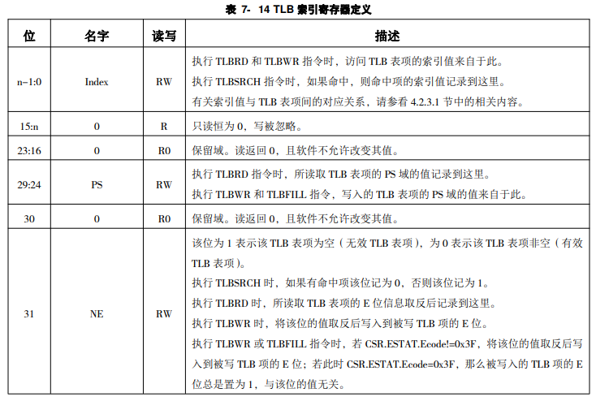
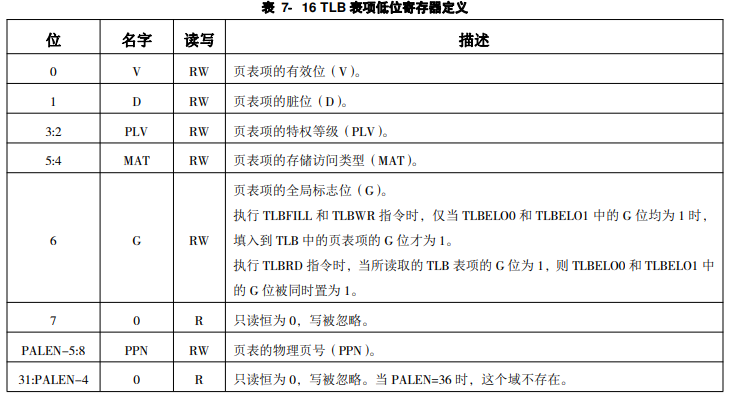

# 7 控制状态寄存器CSR

## 目录

-   [7.1控制状态寄存器列表](#71控制状态寄存器列表)
-   [7.2 CSR访问特性说明](#72-CSR访问特性说明)
    -   [7.2.1读写属性](#721读写属性)
    -   [7.2.2 未定义及未实现的CSR的访问效果](#722-未定义及未实现的CSR的访问效果)
-   [7.3 基础CSR](#73-基础CSR)
    -   [CRMD——当前处理器模式（特权等级、是否可响应中断、地址翻译模式、取指、Load、Store存储访问类型）](#CRMD当前处理器模式特权等级是否可响应中断地址翻译模式取指LoadStore存储访问类型)
    -   [PRMD——保护现场](#PRMD保护现场)
    -   [EUEN——是否实现了浮点指令](#EUEN是否实现了浮点指令)
    -   [ECFG——异常and中断控制](#ECFG异常and中断控制)
    -   [ESTAT——异常/中断状态](#ESTAT异常中断状态)
    -   [ERA——触发异常/中断的指令PC](#ERA触发异常中断的指令PC)
    -   [BADV——记录触发地址错的VA](#BADV记录触发地址错的VA)
    -   [EENTRY——服务程序入口地址](#EENTRY服务程序入口地址)
    -   [CPUID——多核时的处理器核编号](#CPUID多核时的处理器核编号)
    -   [SAVE0\~3——暂存数据](#SAVE03暂存数据)
    -   [LLBCTL——控制LLBit](#LLBCTL控制LLBit)
-   [7.4 TLB相关CSR](#74-TLB相关CSR)
    -   [TLBIDX](#TLBIDX)
    -   [TLBEHI](#TLBEHI)
    -   [TLBELO0、TLBELO1](#TLBELO0TLBELO1)
    -   [ASID——地址空间标识符](#ASID地址空间标识符)
    -   [PGDL——低半地址空间的全局目录基址](#PGDL低半地址空间的全局目录基址)
    -   [PGDH——高半地址空间的全局目录基址](#PGDH高半地址空间的全局目录基址)
    -   [PGD——当前上下文中出错虚地址所对应的全局目录基址信息](#PGD当前上下文中出错虚地址所对应的全局目录基址信息)
    -   [TLBRENTRY——TLB重填异常服务程序入口地址](#TLBRENTRYTLB重填异常服务程序入口地址)
    -   [DMW0\~DMW1——参与完成直接映射地址翻译模式](#DMW0DMW1参与完成直接映射地址翻译模式)
-   [7.5 定时器相关CSR](#75-定时器相关CSR)
    -   [TID——读取/写入定时器编号](#TID读取写入定时器编号)
    -   [TCFG——软件配置定时器](#TCFG软件配置定时器)
    -   [TVAL——获取对应编号的定时器计数值](#TVAL获取对应编号的定时器计数值)
    -   [TICLR——清定时中断信号](#TICLR清定时中断信号)
-   [7.6手册上没有但是chiplab项目官方实现上有的——不可见的](#76手册上没有但是chiplab项目官方实现上有的不可见的)
    -   [CNTC](#CNTC)
    -   [BRK](#BRK)
    -   [DISABLE\_CACHE](#DISABLE_CACHE)

## 7.1控制状态寄存器列表

| 地址           | 名称           |              |
| ------------ | ------------ | ------------ |
| 0x0          | 当前模式信息       | CRMD         |
| 0x1          | 异常模式信息       | PRMD         |
| 0x2          | 扩展部件使能       | EUEN         |
| 0x4          | 异常配置         | ECFG         |
| 0x5          | 异常状态         | ESTAT        |
| 0x6          | 异常返回地址       | ERA          |
| 0x7          | 出错虚地址        | BADV         |
| 0xc          | 异常入口地址       | EENTRY       |
| 0x10         | TLB索引        | TLBIDX       |
| 0x11         | TLB表项高位      | TLBEHI       |
| 0x12         | TLB表项低位0     | TLBELO0      |
| 0x13         | TLB表项低位1     | TLBELO1      |
| 0x18         | 地址空间标识符      | ASID         |
| 0x19         | 低半地址空间全局目录基址 | PGDL         |
| 0x1a         | 高半地址空间全局目录基址 | PGDH         |
| 0x1b         | 全局目录基址       | PGD          |
| 0x20         | 处理器编号        | CPUID        |
| 0x30\~0x33   | 数据保存         | SAVE0\~SAVE3 |
| 0x40         | 定时器编号        | TID          |
| 0x41         | 定时器配置        | TCFG         |
| 0x42         | 定时器值         | TVAL         |
| 0x44         | 定时中断清除       | TICLR        |
| 0x60         | LLBit控制      | LLBCTL       |
| 0x88         | TLB重填异常入口地址  | TLBRENTRY    |
| 0x98         | 高速缓存标签       | CTAG         |
| 0x180\~0x181 | 直接映射配置窗口     | DMW0\~DMW1   |

## 7.2 CSR访问特性说明

### 7.2.1读写属性

CSR各个域的读写属性的定义主要是从软件访问的视角进行，具体包括以下四种类型：

1.  RW：软件可读、可写

    除在定义中明确指出的会导致处理器执行结果不确定的非法值，软件可以写入任意值。通常情况下，软件对这些域进行先写后读的操作，读出的应该是写入的值。但是，当所访问的域可以被硬件更新时，或者执行读、写操作的两条指令之间有中断发生，则有可能出现读出值与写入值不一致的情况
2.  R：软件只读

    软件写这些域不会更新其内容，且不产生其他副作用
3.  R0：软件读这些域永远返回0

    软件必须保证要么通过设置CSR写屏蔽位避免更新这些域，要么在更新这些域时必须要写入 0 值
4.  W1：软件写1有效

    软件对这些域写 0 不会将其清 0，且不产生其它任何副作用。同时，定义为该属性的域的读出值没有任何软件意义，软件应该无视这些读出值

### 7.2.2 未定义及未实现的CSR的访问效果

当软件使用 CSR 指令访问的 CSR 对象是架构规范中未定义的，或者是架构规范中定义的可实现项但是具体硬件未实现的，此时读动作返回全 0 值，写动作不应改变软件可见的处理器状态

## 7.3 基础CSR

### CRMD——当前处理器模式（特权等级、是否可响应中断、地址翻译模式、取指、Load、Store存储访问类型）

CRMD（地址0x0）寄存器决定了处理器核当前所处的特权等级、全局中断使能以及地址翻译模式

| 位    | 名字   | 读写属性 | 描述                                                                                                                        |
| ---- | ---- | ---- | ------------------------------------------------------------------------------------------------------------------------- |
| 1:0  | PLV  | RW   | 这两位用于表示当前处理器核所处的特权等级，合法的取值范围为0\~3&#xA;当触发异常时，硬件将PLV置0&#xA;当执行ERTN指令从中断处理程序返回时，硬件将PLV设置为CSR.PRMD.PPLV的值                    |
| 2    | IE   | RW   | 这位用于表示当前处理器核对全局中断使能，高有效&#xA;当触发异常时，硬件将该域的值置为 0，以确保陷入后屏蔽中断。异常处理程序决定重新开启中断响应时，需显式地将该位置 1                                    |
| 3    | DA   | RW   | 这位用于表示当前处理器核的直接地址翻译模式的使能，高有效&#xA;当触发 TLB 重填异常时，硬件将该域置为 1&#xA;当执行 ERTN 指令从例外处理程序返回时，如果CSR.ESTAT.Ecode=0x3F，则硬件将该域置为 0      |
| 4    | PG   | RW   | 这位用于表示当前处理器核的映射地址翻译模式的使能，高有效&#xA;当触发 TLB 重填异常时，硬件将该域置为 0&#xA;当执行 ERTN 指令从例外处理程序返回时，如果CSR.ESTAT.Ecode=0x3F，则硬件将该域置为 1&#xA; |
| 6:5  | DATF | RW   | 这两位表示当处理器核处于直接地址翻译模式时，取指操作的存储访问类型&#xA;当软件将PG设置为1时，推荐同时将DATF设置为2'b01,即一致可缓存类型CC                                            |
| 8:7  | DATM | RW   | 这两位表示当处理器核处于直接地址翻译模式时，load、store操作的存储访问类型&#xA;当软件将PG设置为1时，推荐同时将DATM设置为2'b01,即一致可缓存类型CC                                    |
| 31:9 | 0    | R0   | 读返回0，且软件不允许改变该域值                                                                                                          |

> 📌DA和PG位的合法组合为(0,1)或者(1,0)，其它组合情况导致的结果不确定
>
> 复位后，CRMD值为32'h8;

### PRMD——保护现场

当触发异常时，硬件会将此时处理器核的特权等级和全局中断使能位保存至PRMD中，用于异常返回时恢复处理器核的现场

| 位    | 名字   | 读写属性 | 描述                                                                                                     |
| ---- | ---- | ---- | ------------------------------------------------------------------------------------------------------ |
| 1:0  | PPLV | RW   | 当触发异常时，硬件会将CSR.CRMD.PLV域的旧值记录在CSR.PRMD.PPLV&#xA;当执行ERTN指令从异常处理程序返回时，硬件会将这个CSR.PRMD.PPLV更新到CSR.CRMD.PLV |
| 2    | PIE  | RW   | 当触发异常时，硬件会将CSR.CRMD.IE域的旧值记录在CSR.PRMD.PIE&#xA;当执行ERTN指令从异常处理程序返回时，硬件会将这个CSR.PRMD.PIE更新到CSR.CRMD.IE     |
| 31:3 | 0    | R0   | 保留域，读返回0，且不允许改变其值                                                                                      |

### EUEN——是否实现了浮点指令

EUEN寄存器用于禁止掉基础浮点指令集。当这些使能控制无效时，执行对应的指令将触发相应的指令不可用例外。软件利用这套机制可以决定保存上下文时的范围。硬件实现也可以利用此处的控制位实现电路功耗控制

| 位    | 名字  | 读写属性 | 描述                                                      |
| ---- | --- | ---- | ------------------------------------------------------- |
| 0    | FPE | RW   | 这位表示基础浮点指令使能控制位。&#xA;当该位为 0 时，基础浮点数指令将会触发浮点指令未使能异常（FPD） |
| 31:1 | 0   | R0   | 保留域，读返回0，且不允许改变其值                                       |

### ECFG——异常and中断控制

ECFG用于控制各异常以及中断的局部使能位

| 位     | 名字          | 读写属性 | 描述                                                           |
| ----- | ----------- | ---- | ------------------------------------------------------------ |
| 9:0   | LIE\[9:0]   | RW   | 局部中断使能位，高有效&#xA;每一个局部中断使能位和CSR.ESTAT.IS\[9:0]对应，每一位控制一个中断源   |
| 10    | 0           | R0   | 保留域，读返回0，且软件不允许改变其值                                          |
| 12:11 | LIE\[12:11] | RW   | 局部中断使能位，高有效&#xA;每一个局部中断使能位和CSR.ESTAT.IS\[12:11]对应，每一位控制一个中断源 |
| 31:13 | 0           | R0   | 保留域，读返回0，且软件不允许改变其值                                          |

### ESTAT——异常/中断状态

ESTAT记录异常+中断的状态信息，包括所触发异常+中断的一二级编码以及各个中断的状态

| 位     | 名字       | 读写属性 | 描述                                                   |
| ----- | -------- | ---- | ---------------------------------------------------- |
| 1:0   | IS\[1:0] | RW   | IS\[1:0]为两个软件中断SWI0、SWI1的状态位&#xA;软件写1表示置中断，软件写0表示清中断 |
| 9:2   | IS\[9:2] | R    | IS\[9:2]表示8个硬中断(HWI0\~HWI7)的中断状态位，高电平有效              |
| 10    | 0        | R0   | 保留域，读返回 0，且软件不允许改变其值                                 |
| 11    | IS\[11]  | R    | 定时器中断T1的中断状态位，高电平有效                                  |
| 12    | IS\[12]  | R    | 核间中断IP1的中断状态位，高电平有效                                  |
| 15:13 | 0        | R0   | 保留域，读返回 0，且软件不允许改变其值                                 |
| 21:16 | Ecode    | R    | 异常+中断类型一级编码                                          |
| 30:22 | EsubCode | R    | 异常+中断类型二级编码                                          |
| 31    | 0        | R0   | 保留域，读返回 0，且软件不允许改变其值                                 |

> 📌触发异常+中断时，硬件会根据异常+中断类型按照下表中的定义写CSR.ESTAT.Ecode和CSR.ESTAT.EsubCode
>
> | Ecode 6位   | Esubcode 9位 | 异常+中断的符号表示 | 异常+中断类型      |
> | ---------- | ----------- | ---------- | ------------ |
> | 0x0        | 0           | INT        | 中断           |
> | 0x1        | 0           | PIL        | load操作页无效异常  |
> | 0x2        | 0           | PIS        | store操作页无效异常 |
> | 0x3        | 0           | PIF        | 取指操作页无效异常    |
> | 0x4        | 0           | PME        | 页修改异常        |
> | 0x7        | 0           | PPI        | 页特权等级不合规异常   |
> | 0x8        | 0           | ADEF       | 取指地址错异常      |
> |            | 1           | ADEM       | 访存指令地址错异常    |
> | 0x9        | 0           | ALE        | 地址非对齐异常      |
> | 0xb        | 0           | SYS        | 系统调用异常       |
> | 0xc        | 0           | BRK        | 断点异常         |
> | 0xd        | 0           | INE        | 指令不存在异常      |
> | 0xe        | 0           | IPE        | 指令特权等级错异常    |
> | 0xf        | 0           | FPD        | 浮点指令未使能异常    |
> | 0x12       | 0           | FPE        | 基础浮点指令异常     |
> | 0x1a\~0x3e |             |            | 保留编码         |
> | 0x3f       | 0           | TLBR       | TLB重填异常      |

### ERA——触发异常/中断的指令PC

ERA寄存器记录触发异常+中断的指令的PC

| 位    | 名字 | 读写属性 | 描述                           |
| ---- | -- | ---- | ---------------------------- |
| 31:0 | PC | RW   | 触发异常时，硬件会将触发异常+中断的指令的PC记录到该域 |

### BADV——记录触发地址错的VA

BADV寄存器用于触发地址错误相关异常[^注释1]时，记录出错的虚地址

| 位    | 名字    | 读写属性 | 描述                                   |
| ---- | ----- | ---- | ------------------------------------ |
| 31:0 | VAddr | RW   | 当触发 TLB 重填异常和地址错误相关异常时，硬件将出错的虚地址记录于此 |

### EENTRY——服务程序入口地址

该寄存器用于配置除 TLB 重填异常之外的异常和中断的入口地址

| 位    | 名字 | 读写属性 | 描述                                        |
| ---- | -- | ---- | ----------------------------------------- |
| 5:0  | 0  | R    | 只读恒为 0，写被忽略                               |
| 31:6 | VA | RW   | 异常和中断入口地址的\[31:6]位。这意味着例外和中断入口地址的低6 位必须为0 |

### CPUID——多核时的处理器核编号

CPUID寄存器中存有处理器核的编号信息

| 位    | 名字     | 读写属性 | 描述                            |
| ---- | ------ | ---- | ----------------------------- |
| 8:0  | coreid | R    | 处理器核的编号。该信息用于软件在多核系统中区分各个处理器核 |
| 31:9 | 0      | R0   | 保留域。读返回 0，且软件不允许改变其值          |

### SAVE0\~3——暂存数据

SAVE0\~3用于给系统软件暂存数据

| 位    | 名字   | 读写属性 | 描述                                |
| ---- | ---- | ---- | --------------------------------- |
| 31:0 | Data | RW   | 仅供软件读写的数据。除执行 CSR 指令外，硬件不会修改该域的内容 |

### LLBCTL——控制LLBit

LLBCTL实现对LLBit的访问控制

| 位    | 名字    | 读写属性 | 描述                                                                                                                   |
| ---- | ----- | ---- | -------------------------------------------------------------------------------------------------------------------- |
| 0    | ROLLB | R    | 只读位，返回当前LLBit的值                                                                                                      |
| 1    | WCLLB | W1   | 软件对该位写 1 将 LLBit 清 0。软件对该位写 0 将被硬件忽略                                                                                 |
| 2    | KLO   | RW   | 用于控制 ERTN 指令执行时对 LLBit 的操作。&#xA;当该位等于 1 的时候，执行 ERTN 指令的时候不将 LLBit 清0，但是该位会被硬件自动清 0。意味着，每次 KLO 置 1 后只能影响一次 ERTN 指令的执行 |
| 31:3 | 0     | R0   | 保留域。读返回 0，且软件不允许改变其值                                                                                                 |

## 7.4 TLB相关CSR

### TLBIDX

TLBIDX寄存器中包含TLB指令操作TLB时相关的索引值灯信息、以及TLB指令操作时与TLB表项中PS、E域相关的信息

### TLBEHI

该寄存器包含 TLB 指令操作时与 TLB 表项高位部分虚页号相关的信息

| 位     | 名字   | 读写属性 | 描述                                                                                                                                                                                                                     |
| ----- | ---- | ---- | ---------------------------------------------------------------------------------------------------------------------------------------------------------------------------------------------------------------------- |
| 12:0  | 0    | R    | 只读恒为0，写忽略                                                                                                                                                                                                              |
| 31:13 | VPPN | RW   | 执行 TLBRD 指令时，所读取 TLB 表项的 VPPN 域的值记录到这里。执行 TLBSRCH 指令时查询 TLB 所用 VPPN 值，以及执行TLBWR 和TLBFILL指令时写入 TLB 表项的 VPPN 域的值来自于此。&#xA;当触发 TLB 重填例外、load 操作页无效例外、store 操作页无效例外、取指操作页无效例外、页写允许例外和页特权等级不合规例外时，触发例外的虚地址的\[31:13]位被记录到这里。 |

### TLBELO0、TLBELO1

### ASID——地址空间标识符

ASID寄存器包含了用于访存操作和TLB指令的地址空间标识符

ASID的位宽随着架构规范的演进可能进一步增加，为方便软件明确 ASID 的位宽，将直接给出这一信息。

| 位     | 名字       | 读写属性 | 描述                                                                                                                                                                                            |
| ----- | -------- | ---- | --------------------------------------------------------------------------------------------------------------------------------------------------------------------------------------------- |
| 9:0   | ASID     | RW   | 当前执行的程序所对应的地址空间标识符。&#xA;在取指、执行 load/store 指令时，作为查询 TLB 的 ASID 键值信息。执行 TLBSRCH 指令时，作为查询 TLB 的 ASID 键值信息。执行 TLBWR 或 TLBFILL 指令时，写入 TLB 表项 ASID 域的值来自于此。执行 TLBRD 指令时，所读取的 TLB 表项的 ASID 域的内容记录到这里 |
| 15:10 | 0        | R    | 只读恒为0，写忽略                                                                                                                                                                                     |
| 23:16 | ASIDBITS | R    | ASID域的位宽，直接等于这个域的数值                                                                                                                                                                           |
| 31:24 | 0        | R0   | 保留域。读返回 0，且软件不允许改变其值                                                                                                                                                                          |

### PGDL——低半地址空间的全局目录基址

该寄存器用于配置低半地址空间的全局目录的基址

全局目录的基址一定是4KB 边界地址对齐的，因此该寄存器的最低 12 位软件不可配置，只读恒为 0

| 位     | 名字   | 读写属性 | 描述                                                |
| ----- | ---- | ---- | ------------------------------------------------- |
| 11:0  | 0    | R    | 只读恒为0，写忽略                                         |
| 31:12 | Base | RW   | 低半地址空间的全局目录的基址&#xA;所谓低半地址空间是指虚地址的第\[VALEN-1]位等于 0 |

### PGDH——高半地址空间的全局目录基址

该寄存器用于配置高半地址空间的全局目录的基址

全局目录的基址一定是4KB 边界地址对齐的，因此该寄存器的最低 12 位软件不可配置，只读恒为 0

| 位     | 名字   | 读写属性 | 描述                                                |
| ----- | ---- | ---- | ------------------------------------------------- |
| 11:0  | 0    | R    | 只读恒为0，写忽略                                         |
| 31:12 | Base | RW   | 高半地址空间的全局目录的基址&#xA;所谓高半地址空间是指虚地址的第\[VALEN-1]位等于 1 |

### PGD——当前上下文中出错虚地址所对应的全局目录基址信息

PGD是一个只读寄存器，其内容是当前上下文中出错虚地址所对应的全局目录基址信息

| 位     | 名字   | 读写属性 | 描述                                                             |
| ----- | ---- | ---- | -------------------------------------------------------------- |
| 11:0  | 0    | R    | 只读恒为0，写忽略                                                      |
| 31:12 | Base | R    | 如果CSR.BADV的最高位是0，那么Base=CSR.PGDL.Base&#xA;否则Base=CSR.PGDH.Base |

### TLBRENTRY——TLB重填异常服务程序入口地址

| 位    | 名字 | 读写属性 | 描述                                 |
| ---- | -- | ---- | ---------------------------------- |
| 5:0  | 0  | R    | 只读恒为 0，写被忽略                        |
| 31:6 | VA | RW   | TLB 重填例外入口地址\[31:6]位。此处填入的地址应为物理地址 |

### DMW0\~DMW1——参与完成直接映射地址翻译模式

DMW0\~DMW1寄存器参与完成直接映射地址翻译模式

| 位     | 名字   | 读写属性 | 描述                                      |
| ----- | ---- | ---- | --------------------------------------- |
| 0     | PLV0 | RW   | PLV0=1表示在特权等级PLV0下可以使用该寄存器的配置进行直接映射地址翻译 |
| 2:1   | 0    | R0   | 保留域。读返回 0，且软件不允许改变其值                    |
| 3     | PLV3 | RW   | PLV3=1表示在特权等级PLV3下可以使用该寄存器的配置进行直接映射地址翻译 |
| 5:4   | MAT  | RW   | MAT表示虚地址落在该映射窗口下访存操作的存储访问类型             |
| 24:6  | 0    | R0   | 保留域。读返回 0，且软件不允许改变其值                    |
| 27:25 | PSEG | RW   | PSEG表示直接映射窗口的物理地址的\[31:29]位             |
| 28    | 0    | R0   | 保留域。读返回 0，且软件不允许改变其值                    |
| 31：29 | VSEG | RW   | PSEG表示直接映射窗口的虚地址的\[31:29]位              |

## 7.5 定时器相关CSR

### TID——读取/写入定时器编号

处理器中每个定时器都有一个唯一可识别的编号，由软件配置在该寄存器中。每个定时器也同时唯一对应着一个计时器，当软件使用 RDCNTID 指令读取计时器 ID 号时，返回的就是与之对应的定时器编号

| 位    | 名字  | 读写属性 | 描述                                                    |
| ---- | --- | ---- | ----------------------------------------------------- |
| 31:0 | TID | RW   | 定时器编号。软件可配置。处理器核复位期间，硬件可以将其复位成与CSR.CPUID中 CoreID 相同的值 |

### TCFG——软件配置定时器

| 位     | 名字       | 读写属性 | 描述                                                                                                                                        |
| ----- | -------- | ---- | ----------------------------------------------------------------------------------------------------------------------------------------- |
| 0     | En       | RW   | 定时器使能位&#xA;当该位为1时，定时器才会倒计时自减；减为0时置定时中断信号                                                                                                  |
| 1     | Periodic | RW   | 定时器循环模式控制位&#xA;当设置为1时，定时器在倒计时自减至0 时，在置起定时中断信号的同时，还会使定时器重新装载成 TimeVal 域中配置的初始值，然后再下一个时钟周期继续自减&#xA;当设置为为0时，定时器在倒计时自减至0 时，将停止计数直至软件再次配置该定时器。 |
| n-1:2 | InitVal  | RW   | 循环模式位为1时的加载初始值，初始值必须是4的倍数&#xA;硬件会在该域值后添加2'b0再填充到定时器中                                                                                      |
| 31:n  | 0        | R    | 保留域。读返回 0，且软件不允许改变其值                                                                                                                      |

### TVAL——获取对应编号的定时器计数值

| 位     | 名字      | 读写属性 | 描述                    |
| ----- | ------- | ---- | --------------------- |
| n-1:0 | TimeVal | R    | 具体位数由实现决定；返回当前定时器的计数值 |
| 31:n  | 0       | R0   | 只读恒为0，忽略写             |

### TICLR——清定时中断信号

软件通过对该寄存器位 0 写 1 来清除定时器置起的定时中断信号

| 位    | 名字  | 读写属性 | 描述                            |
| ---- | --- | ---- | ----------------------------- |
| 0    | CLR | W1   | 当软件对CLR写1时，将清除定时中断信号。CLR读永远是0 |
| 31:1 | 0   | R0   | 保留域。读返回 0，且软件不允许改变其值          |

## 7.6手册上没有但是chiplab项目官方实现上有的——不可见的

### CNTC

CNTC寄存器的地址是0x43

### BRK

BRK寄存器的地址是0x100

### DISABLE\_CACHE

DISABLE\_CACHE的地址是0x101

[^注释1]: PIL、PIS、PIF、PME、PPI、ADEF（记录PC）、ALE、TLBR——没有ADEM吗
